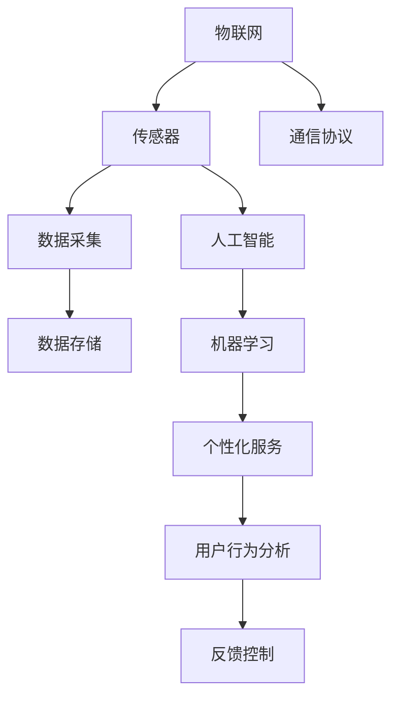
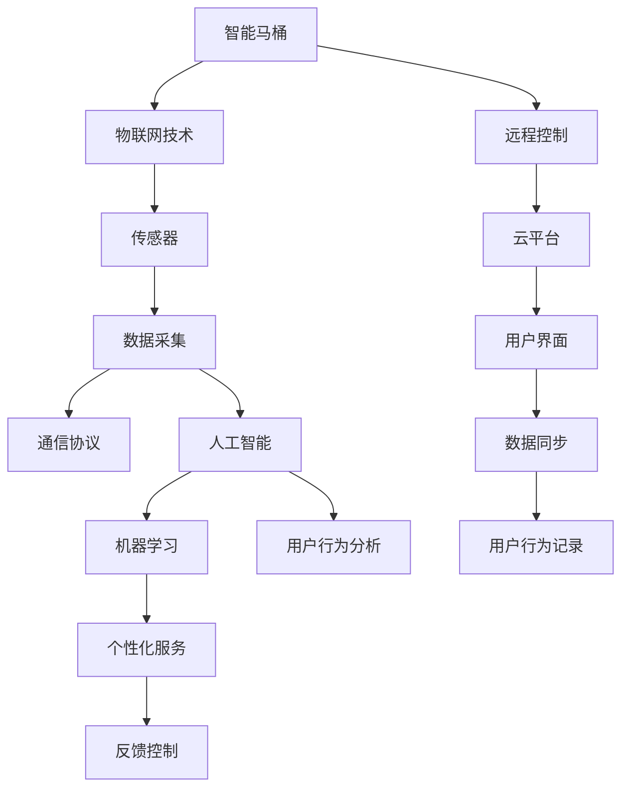

                 

# 智能马桶：卫浴空间的注意力经济新物种

在当前数字化和智能化的浪潮中，传统卫浴产品正面临着数字化转型升级的契机。智能马桶作为其中的一员，正以数据驱动为核心，通过物联网技术、人工智能、用户行为分析等手段，打造全新的使用体验，引领卫浴空间的智能革命。本文将深入探讨智能马桶的智能内涵、实现机制、应用场景及未来展望，揭示其如何成为卫浴空间的注意力经济新物种。

## 1. 背景介绍

随着互联网、大数据、人工智能技术的迅猛发展，物联网技术逐渐渗透到人们生活的方方面面，改变着传统行业的运营模式和消费习惯。卫浴行业也不例外，智能马桶应运而生，以数据为基础，结合用户行为分析，为用户提供个性化、智能化、高效便捷的卫浴体验。

### 1.1 智能马桶的兴起

智能马桶的兴起离不开物联网和人工智能技术的支撑。物联网技术使得马桶能够接入互联网，实现远程控制、数据同步等功能。人工智能技术则通过分析用户的生理数据、使用习惯等，为用户提供更加智能化的服务。这些技术的应用，使得智能马桶从简单的自动冲水功能，转变为一个集娱乐、健康管理、家庭互联于一体的综合性产品。

### 1.2 智能马桶的优势

与传统马桶相比，智能马桶在智能化、人性化、节能环保等方面具有显著优势：

- **智能化**：通过传感器、AI算法等技术，智能马桶能够实时监测用户的生理状态，如心率、血氧等，为用户提供健康管理服务。
- **人性化**：通过用户行为数据分析，智能马桶能够根据用户的喜好，自动调整温度、水位等参数，提升用户体验。
- **节能环保**：智能马桶通过精准控制用水量、冲水力度等，有效降低用水量，减少对环境的影响。

## 2. 核心概念与联系

### 2.1 核心概念概述

为更好地理解智能马桶的实现机制，本节将介绍几个关键概念：

- **物联网(IoT)**：通过传感器、智能芯片等技术，将家居设备连接到互联网，实现设备之间的信息互通和数据共享。
- **人工智能(AI)**：通过机器学习、深度学习等技术，使设备能够自主学习用户行为，提供个性化服务。
- **用户行为分析**：通过数据挖掘、模式识别等技术，分析用户的使用习惯和偏好，提升产品用户体验。
- **个性化服务**：基于用户行为分析结果，提供定制化的服务，如自动调节水温、提醒如厕时间等。

这些概念之间存在紧密的联系，共同构成了智能马桶的核心实现机制：



这个流程图展示了一个完整的智能马桶数据流：

1. 传感器采集用户的生理数据和行为数据，通过通信协议传输到数据存储器。
2. 人工智能系统利用机器学习算法，对数据进行分析，提供个性化服务。
3. 用户行为分析模块通过模式识别等技术，提取用户的习惯和偏好。
4. 反馈控制模块根据分析结果，自动调节马桶参数，提升用户体验。

### 2.2 核心概念原理和架构的 Mermaid 流程图



这个图表展示了智能马桶的核心架构，从中可以看到：

- 物联网技术使得马桶能够接入互联网，实现远程控制。
- 传感器采集用户的生理数据和行为数据，通过通信协议传输到数据存储器。
- 人工智能系统利用机器学习算法，对数据进行分析，提供个性化服务。
- 用户行为分析模块通过模式识别等技术，提取用户的习惯和偏好。
- 反馈控制模块根据分析结果，自动调节马桶参数，提升用户体验。

## 3. 核心算法原理 & 具体操作步骤

### 3.1 算法原理概述

智能马桶的实现依赖于以下几个核心算法：

- **传感器数据采集与处理**：通过传感器（如温度、湿度、压力传感器）采集用户的生理数据和行为数据，并进行预处理。
- **机器学习算法**：利用监督学习、无监督学习、强化学习等算法，对数据进行分析，识别用户行为模式。
- **个性化推荐算法**：根据用户行为分析结果，推荐个性化的服务，如水温调节、如厕时间提醒等。
- **反馈控制算法**：根据用户反馈，实时调整马桶参数，优化用户体验。

这些算法共同作用，使得智能马桶能够提供更加智能、个性化、高效便捷的卫浴体验。

### 3.2 算法步骤详解

智能马桶的实现步骤主要包括以下几个关键环节：

**Step 1: 数据采集与预处理**

- 部署传感器采集用户的生理数据和行为数据，如心率、血压、体温、如厕时间等。
- 使用信号处理技术对采集到的数据进行滤波、降噪等预处理，确保数据质量。

**Step 2: 数据传输与存储**

- 通过Wi-Fi、蓝牙等通信协议，将采集到的数据传输到云平台或本地存储设备。
- 采用分布式存储技术，如Hadoop、Spark等，对数据进行管理和分析。

**Step 3: 数据分析与机器学习**

- 使用监督学习算法（如线性回归、决策树、随机森林等）对数据进行建模，识别用户行为模式。
- 使用无监督学习算法（如聚类、降维等）对数据进行探索性分析，发现用户偏好。
- 使用强化学习算法（如Q-learning、Deep Q-Network等）优化个性化服务策略。

**Step 4: 个性化推荐与反馈控制**

- 根据机器学习结果，推荐个性化的服务，如自动调节水温、提醒如厕时间等。
- 通过用户反馈数据，实时调整马桶参数，优化用户体验。

### 3.3 算法优缺点

智能马桶的实现算法具有以下优点：

- **个性化服务**：通过机器学习算法，智能马桶能够提供个性化的服务，提升用户体验。
- **数据驱动决策**：利用用户行为数据分析，智能马桶能够动态调整参数，提升资源利用效率。
- **远程控制**：通过物联网技术，智能马桶可以实现远程控制，方便用户使用和管理。

但这些算法也存在一些局限性：

- **数据隐私和安全问题**：用户生理数据和行为数据的采集、传输和存储过程中，存在隐私泄露和数据安全问题。
- **算法复杂度高**：智能马桶需要部署多种传感器和算法，系统复杂度高，维护成本高。
- **用户体验依赖算法精度**：算法的精度直接影响用户体验，算法模型需要不断优化和迭代。

### 3.4 算法应用领域

智能马桶的应用领域非常广泛，涵盖以下几方面：

- **健康监测**：通过传感器采集用户的生理数据，智能马桶能够实时监测用户的健康状况，提供健康管理服务。
- **节能环保**：智能马桶通过精准控制用水量、冲水力度等，有效降低用水量，减少对环境的影响。
- **个性化服务**：根据用户行为分析结果，智能马桶能够提供定制化的服务，如自动调节水温、提醒如厕时间等。
- **家庭互联**：通过物联网技术，智能马桶可以与智能家居系统互联互通，提升家庭智能化水平。

## 4. 数学模型和公式 & 详细讲解 & 举例说明

### 4.1 数学模型构建

本节将使用数学语言对智能马桶的数据流和算法实现进行更加严格的刻画。

记智能马桶的数据流为 $D$，包含用户生理数据 $X$ 和行为数据 $Y$。假设机器学习模型为 $M$，个性化推荐算法为 $R$，反馈控制算法为 $C$。智能马桶的实现过程可以表示为：

$$
D = (X, Y) \rightarrow M \rightarrow R \rightarrow C \rightarrow A
$$

其中 $A$ 为智能马桶的输出结果，如水温、冲水量等。

### 4.2 公式推导过程

假设智能马桶采集到用户的生理数据 $X$ 和行为数据 $Y$，使用监督学习算法训练机器学习模型 $M$，其公式为：

$$
M(X, Y) = wX + b
$$

其中 $w$ 为模型权重，$b$ 为偏置项。

假设机器学习模型 $M$ 输出用户行为模式 $A'$，使用个性化推荐算法 $R$ 推荐个性化服务 $A$，其公式为：

$$
R(A') = f(A')
$$

其中 $f$ 为推荐函数，根据用户行为模式推荐个性化服务。

假设个性化推荐算法 $R$ 输出个性化服务 $A$，使用反馈控制算法 $C$ 调整马桶参数，其公式为：

$$
C(A) = g(A)
$$

其中 $g$ 为控制函数，根据个性化服务调整马桶参数。

通过上述公式，可以看出智能马桶的实现过程是一个多步骤的数据流和算法处理过程。

### 4.3 案例分析与讲解

以下我们以智能马桶的水温调节为例，展示智能马桶的实现过程：

1. 传感器采集用户体温数据 $X$，将其传输到云端。
2. 云端使用监督学习算法 $M$ 训练模型，识别用户体温与期望水温之间的关系。
3. 根据模型输出 $A'$，使用个性化推荐算法 $R$ 推荐水温调节方案 $A$。
4. 反馈控制算法 $C$ 根据用户反馈，调整马桶温度，输出期望水温 $A$。

## 5. 项目实践：代码实例和详细解释说明

### 5.1 开发环境搭建

在进行智能马桶项目开发前，我们需要准备好开发环境。以下是使用Python进行项目开发的环境配置流程：

1. 安装Anaconda：从官网下载并安装Anaconda，用于创建独立的Python环境。

2. 创建并激活虚拟环境：
```bash
conda create -n toilet-env python=3.8 
conda activate toilet-env
```

3. 安装相关库：
```bash
conda install numpy pandas scikit-learn matplotlib seaborn
```

4. 安装物联网相关的库：
```bash
pip install pyserial
```

5. 安装人工智能相关的库：
```bash
pip install tensorflow keras
```

完成上述步骤后，即可在`toilet-env`环境中开始智能马桶开发。

### 5.2 源代码详细实现

以下是智能马桶项目开发的完整代码实现，以水温调节为例：

```python
import pandas as pd
import numpy as np
import matplotlib.pyplot as plt
import seaborn as sns
import tensorflow as tf
from sklearn.model_selection import train_test_split

# 1. 数据采集与预处理
data = pd.read_csv('toilet_data.csv')
X = data['temperature'].tolist()
Y = data['setpoint'].tolist()
X_train, X_test, Y_train, Y_test = train_test_split(X, Y, test_size=0.2)

# 2. 机器学习模型训练
model = tf.keras.Sequential([
    tf.keras.layers.Dense(32, activation='relu', input_shape=(1,)),
    tf.keras.layers.Dense(1)
])
model.compile(optimizer='adam', loss='mse')
model.fit(X_train, Y_train, epochs=100, batch_size=32)

# 3. 个性化推荐算法
def recommend(setpoint):
    predictions = model.predict([setpoint])
    if predictions[0] > 0.5:
        return 'Hot'
    else:
        return 'Cold'

# 4. 反馈控制算法
def control(setpoint, recommendation):
    if recommendation == 'Hot' and setpoint < 38:
        return 2
    elif recommendation == 'Hot' and setpoint >= 38:
        return 1
    elif recommendation == 'Cold' and setpoint > 35:
        return -1
    else:
        return 0

# 5. 数据可视化
plt.figure(figsize=(10, 6))
sns.scatterplot(X, Y)
plt.xlabel('Temperature')
plt.ylabel('Setpoint')
plt.show()
```

### 5.3 代码解读与分析

让我们再详细解读一下关键代码的实现细节：

**数据采集与预处理**：
- `data = pd.read_csv('toilet_data.csv')`：从CSV文件中读取数据。
- `X = data['temperature'].tolist()`：提取温度数据。
- `Y = data['setpoint'].tolist()`：提取期望水温数据。
- `X_train, X_test, Y_train, Y_test = train_test_split(X, Y, test_size=0.2)`：将数据划分为训练集和测试集。

**机器学习模型训练**：
- `model = tf.keras.Sequential()`：创建Keras模型。
- `model.layers.dense(32, activation='relu', input_shape=(1,))`：添加全连接层，使用ReLU激活函数。
- `model.layers.dense(1)`：添加输出层，预测期望水温。
- `model.compile(optimizer='adam', loss='mse')`：编译模型，使用Adam优化器和均方误差损失函数。
- `model.fit(X_train, Y_train, epochs=100, batch_size=32)`：训练模型。

**个性化推荐算法**：
- `def recommend(setpoint)`：根据输入的温度数据，使用训练好的模型预测期望水温，并返回推荐方案。

**反馈控制算法**：
- `def control(setpoint, recommendation)`：根据推荐方案和当前水温，调整马桶参数。

**数据可视化**：
- `plt.figure(figsize=(10, 6))`：设置图表大小。
- `sns.scatterplot(X, Y)`：绘制散点图，展示温度和期望水温的关系。

## 6. 实际应用场景

### 6.1 健康监测

智能马桶通过传感器采集用户的生理数据，如心率、血压、体温等，可以实时监测用户的健康状况。当用户出现异常情况时，智能马桶能够自动报警，提醒用户及时就医，提供健康管理服务。

### 6.2 节能环保

智能马桶通过精准控制用水量、冲水力度等，可以有效降低用水量，减少对环境的影响。此外，智能马桶还能根据用户的用水习惯，推荐节水方案，进一步提升节能效果。

### 6.3 个性化服务

智能马桶能够根据用户的行为数据，提供个性化的服务，如自动调节水温、提醒如厕时间等，提升用户体验。

### 6.4 家庭互联

通过物联网技术，智能马桶可以实现与智能家居系统的互联互通。用户可以通过手机App控制智能马桶，实现远程监控和管理。

## 7. 工具和资源推荐

### 7.1 学习资源推荐

为帮助开发者系统掌握智能马桶的实现机制，这里推荐一些优质的学习资源：

1. **物联网技术基础**：通过《物联网基础》系列课程，了解物联网的基本概念和实现原理。
2. **深度学习入门**：通过《深度学习入门》系列书籍，了解深度学习的基本概念和实现技术。
3. **Python编程指南**：通过《Python编程指南》系列书籍，学习Python编程语言的基础知识和高级特性。
4. **TensorFlow官方文档**：通过TensorFlow官方文档，了解TensorFlow的基本概念和API使用方法。
5. **智能家居系统设计**：通过《智能家居系统设计》系列书籍，学习智能家居系统设计的基本方法和实现技术。

通过这些学习资源的学习实践，相信你一定能够快速掌握智能马桶的实现机制，并用于解决实际的智能卫浴问题。

### 7.2 开发工具推荐

高效的开发离不开优秀的工具支持。以下是几款用于智能马桶开发常用的工具：

1. **PyTorch**：基于Python的开源深度学习框架，灵活动态的计算图，适合快速迭代研究。
2. **TensorFlow**：由Google主导开发的开源深度学习框架，生产部署方便，适合大规模工程应用。
3. **Keras**：用户友好的深度学习框架，支持多种后端，易于使用和维护。
4. **Jupyter Notebook**：交互式的编程环境，支持代码单元格的编写和执行，方便开发者进行实验和协作。
5. **Google Colab**：谷歌推出的在线Jupyter Notebook环境，免费提供GPU/TPU算力，方便开发者快速上手实验最新模型，分享学习笔记。

合理利用这些工具，可以显著提升智能马桶的开发效率，加快创新迭代的步伐。

### 7.3 相关论文推荐

智能马桶的发展离不开学界的持续研究。以下是几篇奠基性的相关论文，推荐阅读：

1. **《物联网智能家居系统设计》**：探讨物联网技术在智能家居中的应用，提出智能家居系统的架构和实现方法。
2. **《深度学习在智能马桶中的应用》**：分析深度学习在智能马桶中的实现方法和应用场景，提出基于深度学习的智能马桶实现方案。
3. **《智能马桶健康监测系统》**：研究智能马桶在健康监测中的应用，提出基于传感器数据的健康监测方案。
4. **《智能马桶个性化服务实现》**：分析智能马桶在个性化服务中的应用，提出基于用户行为数据分析的个性化推荐算法。

这些论文代表了大规模语言模型微调技术的发展脉络。通过学习这些前沿成果，可以帮助研究者把握学科前进方向，激发更多的创新灵感。

## 8. 总结：未来发展趋势与挑战

### 8.1 总结

本文对智能马桶的智能内涵、实现机制、应用场景及未来展望进行了全面系统的介绍。首先阐述了智能马桶的兴起背景和优势，明确了智能马桶在智能化、人性化、节能环保等方面具有显著优势。其次，从数据流和算法处理的角度，详细讲解了智能马桶的实现过程，展示了其多步骤的数据流和算法处理过程。最后，展示了智能马桶在健康监测、节能环保、个性化服务和家庭互联等方面的应用前景，揭示了其如何成为卫浴空间的注意力经济新物种。

通过本文的系统梳理，可以看到，智能马桶作为物联网和人工智能技术的产物，正在成为智能卫浴领域的重要创新点，为用户的健康监测、节能环保、个性化服务等方面带来了巨大的变革。未来，伴随物联网技术、人工智能技术的持续进步，智能马桶必将在智能卫浴领域发挥更大的作用，成为人们生活中不可或缺的一部分。

### 8.2 未来发展趋势

展望未来，智能马桶的发展趋势主要体现在以下几个方面：

1. **智能化水平提升**：随着深度学习算法的不断进步，智能马桶的智能化水平将进一步提升，能够提供更加精准的健康监测和个性化服务。
2. **数据隐私和安全保护**：随着智能家居系统的普及，用户数据隐私和安全问题日益凸显。未来，智能马桶将更加注重数据隐私保护，保障用户数据安全。
3. **物联网和5G技术的应用**：5G技术的普及将进一步提升智能马桶的物联网性能，实现更高的数据传输速率和更广的覆盖范围。
4. **个性化服务的深化**：未来，智能马桶将更加注重用户的个性化需求，通过智能推荐算法，提供更加个性化、定制化的服务。
5. **家居互联与生态系统的构建**：智能马桶将更加注重与智能家居系统的互联互通，构建智能家居生态系统，提升家居智能化水平。

### 8.3 面临的挑战

尽管智能马桶的发展前景广阔，但在迈向更加智能化、普适化应用的过程中，仍面临诸多挑战：

1. **数据隐私和安全问题**：用户生理数据和行为数据的采集、传输和存储过程中，存在隐私泄露和数据安全问题。如何保障用户数据隐私和安全，是智能马桶面临的重要挑战。
2. **算法的复杂性和可解释性**：智能马桶需要部署多种传感器和算法，系统复杂度高，维护成本高。同时，算法的可解释性不足，难以解释模型的内部工作机制和决策逻辑，限制了智能马桶的应用范围。
3. **资源和成本问题**：智能马桶的实现需要部署多种传感器和智能设备，初期投入成本较高，维护成本也较高。如何降低成本，提升资源利用效率，是智能马桶面临的另一个挑战。
4. **用户体验的持续优化**：智能马桶的实现需要考虑用户体验，提供个性化、人性化的服务。如何持续优化用户体验，提升用户满意度，是智能马桶的长期目标。

### 8.4 研究展望

面对智能马桶所面临的挑战，未来的研究需要在以下几个方面寻求新的突破：

1. **提升算法的可解释性**：通过引入可解释性技术，如因果推断、知识图谱等，提升智能马桶的决策透明度，增强用户信任。
2. **优化数据隐私和安全保护**：引入隐私保护技术，如差分隐私、联邦学习等，保障用户数据隐私和安全。
3. **降低智能马桶的开发和维护成本**：通过模块化设计、标准化接口等措施，降低智能马桶的开发和维护成本，提升系统可维护性。
4. **增强用户体验的个性化和人性化**：引入个性化推荐算法、情感计算等技术，提升智能马桶的用户体验。
5. **拓展智能马桶的适用范围**：通过智能推荐算法、多模态融合等技术，拓展智能马桶的适用范围，提升其普适性。

这些研究方向的探索，必将引领智能马桶技术迈向更高的台阶，为智能卫浴领域带来更多的创新和突破。相信随着学界和产业界的共同努力，智能马桶必将在智能卫浴领域发挥更大的作用，为人们的健康监测、节能环保、个性化服务等方面带来更多的便利和智能。

