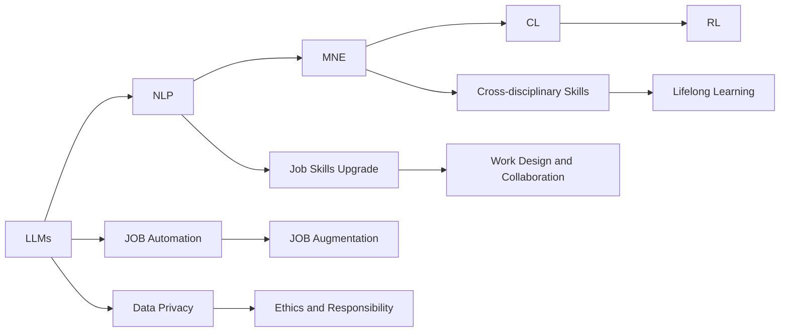

                 

## 1. 背景介绍

### 1.1 问题由来

在当今的数字化时代，人工智能（AI）和机器学习（ML）技术正在以前所未有的速度发展，对各行各业产生了深远影响。特别是近年来，大规模语言模型（Large Language Models, LLMs）的崛起，正在重塑工作技能的生态。LLMs 如 GPT-3、BERT 等，能够处理和理解人类语言，应用于翻译、自动摘要、问答、情感分析等自然语言处理（NLP）任务中，显著提升了工作效率和质量。

然而，LLMs 的强大功能也带来了新的挑战。劳动力市场的技能需求正在发生根本性变化，许多传统岗位正被自动化和智能化技术所取代，同时新型的岗位也正在不断涌现。因此，适应 LLM 驱动的经济，提升和重塑工作技能变得至关重要。

### 1.2 问题核心关键点

当前，适应 LLM 驱动经济的挑战主要包括以下几个方面：

- **技能升级需求**：许多现有岗位需要升级或转型，以适应 LLM 的使用，如需要具备自然语言处理、数据分析、算法开发等新技能。
- **跨学科能力**：LMLs 涉及多学科知识，因此需要跨学科融合的技能，如结合心理学、社会学、数据科学等。
- **终身学习**：LMLs 技术不断发展，需要持续学习和技能更新以保持竞争力。
- **伦理和责任**：在应用 LMLs 时，需考虑数据隐私、算法偏见、决策透明性等问题，提升伦理和责任意识。
- **工作设计**：LMLs 可能改变工作流程和团队协作方式，需重新设计工作角色和职责。

### 1.3 问题研究意义

适应 LLM 驱动的经济，对于个人、企业乃至整个社会都具有重要意义：

- **提升效率**：LLMs 能够自动处理大量重复性工作，提升工作效率，使员工专注于更具创造性和战略性的任务。
- **降低成本**：自动化和智能化的 LMLs 工具可以降低人力成本，尤其是在数据处理、客服、翻译等高成本领域。
- **开拓新领域**：LLMs 开辟了新的业务机会和应用场景，如自然语言生成、智能客服、市场分析等。
- **促进创新**：LMLs 提供了强大的工具，支持创新的产品和服务开发，推动技术进步。
- **提高决策质量**：LLMs 能够处理和分析海量数据，提供更加客观、准确的决策支持。

## 2. 核心概念与联系

### 2.1 核心概念概述

为了更好地理解如何适应 LLM 驱动的经济，本节将介绍几个关键概念及其相互联系：

- **大规模语言模型（LLMs）**：指能够处理和理解自然语言的大型深度学习模型，如 GPT、BERT 等。通过在大量文本数据上进行预训练，LLMs 学习到了丰富的语言知识，具备强大的语言理解和生成能力。
- **自然语言处理（NLP）**：涉及计算机处理和理解人类语言的技术，包括文本分类、实体识别、机器翻译、自动摘要、情感分析等。
- **迁移学习（Transfer Learning）**：指将预训练模型应用于新任务的方法，可以大大减少新任务训练所需的标注数据量。
- **持续学习（Continuous Learning）**：指模型在部署后，能够持续学习新数据，保持其知识和能力，避免数据分布变化导致的性能下降。
- **强化学习（Reinforcement Learning）**：涉及通过试错学习和优化策略，以实现特定目标的任务。
- **工作自动化（Job Automation）**：指通过自动化技术，减少或取代重复性、低价值的工作岗位。
- **工作增强（Job Augmentation）**：指通过自动化技术，增强人类工作的效率和质量，提高工作体验。

这些概念之间的逻辑关系可以通过以下 Mermaid 流程图来展示：



该流程图展示了大规模语言模型与其他关键概念之间的联系：

1. LLMs 通过在大量文本数据上进行预训练，学习到了丰富的语言知识。
2. NLP 技术依赖于 LLMs，提升处理和理解自然语言的能力。
3. 迁移学习允许将 LLMs 应用于新任务，减少训练成本。
4. 持续学习使 LLMs 在实际应用中保持知识和能力的更新。
5. 强化学习通过试错优化策略，提升 LLMs 的应用效果。
6. 工作自动化和增强技术使得 LLMs 在实际工作中发挥作用。
7. 工作技能升级、跨学科能力、终身学习、伦理和责任等要素，对应用 LLMs 至关重要。
8. 工作设计需考虑 LLMs 带来的变化，以确保工作流程和团队的优化。

## 3. 核心算法原理 & 具体操作步骤
### 3.1 算法原理概述

适应 LLM 驱动经济的算法原理主要包括以下几个方面：

- **技能升级算法**：通过对现有岗位进行评估，识别需要升级的技能，并提供相应的培训资源。
- **跨学科融合算法**：将 LLMs 与多学科知识融合，提升跨学科能力，如结合心理学、社会学、数据科学等。
- **持续学习算法**：通过 LLMs 进行持续学习，保持知识和技能的时效性和前瞻性。
- **伦理和责任算法**：在 LLMs 应用过程中，考虑数据隐私、算法偏见、决策透明性等伦理和责任问题。
- **工作设计算法**：重新设计工作角色和职责，适应 LLMs 带来的变化，如工作流程的自动化和增强。

### 3.2 算法步骤详解

基于上述算法原理，适应 LLM 驱动经济的具体操作步骤如下：

**Step 1: 技能评估和升级**

1. **技能需求分析**：评估现有岗位对新技能的需要，包括自然语言处理、数据分析、算法开发等。
2. **培训计划制定**：根据评估结果，制定培训计划，包括课程设置、培训时长、培训方式等。
3. **培训实施**：组织员工参与培训，提升其相关技能。

**Step 2: 跨学科融合**

1. **领域知识整合**：将多学科知识整合到 LLMs 中，提升其跨学科能力。
2. **多学科协同工作**：组建多学科团队，促进知识共享和协作，提升整体工作效果。

**Step 3: 持续学习**

1. **数据持续收集**：定期收集新数据，更新 LLMs 的知识库。
2. **模型持续训练**：利用新数据对 LLMs 进行持续训练，保持其知识和技能的更新。
3. **知识库管理**：建立知识库管理系统，记录和更新 LLMs 的知识和技能。

**Step 4: 伦理和责任**

1. **数据隐私保护**：确保数据隐私和安全的措施，如数据加密、访问控制等。
2. **算法偏见检测**：检测和纠正算法偏见，确保 LLMs 的公平性。
3. **决策透明性**：增强决策过程的透明性，提高决策的可解释性。

**Step 5: 工作设计**

1. **角色和职责重新设计**：根据 LLMs 的应用，重新设计工作角色和职责，优化工作流程。
2. **团队协作方式调整**：调整团队协作方式，利用 LLMs 提升团队效率和质量。

### 3.3 算法优缺点

适应 LLM 驱动经济的算法具有以下优点：

- **高效性**：通过 LLMs 自动化和智能化处理大量数据，大幅提升工作效率。
- **灵活性**：通过跨学科融合和持续学习，适应新任务和新数据的变化。
- **可扩展性**：通过伦理和责任算法，确保 LLMs 的应用符合法律法规和伦理规范。
- **持续性**：通过持续学习和知识管理，保持 LLMs 的知识和技能的更新。

同时，也存在一些局限性：

- **初始投资成本高**：需要投入大量资源进行技能升级和系统建设。
- **技术复杂性高**：需要具备一定的技术背景，才能实施和维护 LLMs 系统。
- **数据质量要求高**：需要高质量的数据进行持续学习，确保 LLMs 的准确性和可靠性。
- **伦理和责任风险**：需要建立健全的伦理和责任机制，防范潜在风险。

### 3.4 算法应用领域

适应 LLM 驱动经济的算法在多个领域得到了广泛应用，例如：

- **医疗健康**：通过 LLMs 进行病历分析、药物研发、医疗咨询等，提升医疗服务的智能化水平。
- **教育培训**：利用 LLMs 进行个性化教学、作业批改、学情分析等，提升教育质量。
- **金融服务**：通过 LLMs 进行市场分析、风险评估、智能投顾等，提升金融服务的智能化水平。
- **客户服务**：利用 LLMs 进行智能客服、虚拟助手等，提升客户体验。
- **物流运输**：通过 LLMs 进行路线规划、物流优化等，提升物流效率。

此外，在企业信息化、智能制造、公共服务等多个领域，适应 LLM 驱动经济的算法也得到了广泛应用，为各行各业带来了显著的经济效益和社会效益。

## 4. 数学模型和公式 & 详细讲解 & 举例说明

### 4.1 数学模型构建

本节将使用数学语言对适应 LLM 驱动经济的算法进行更加严格的刻画。

记 LLMs 为 $M_{\theta}$，其中 $\theta$ 为 LLMs 的参数。设 $D$ 为收集到的数据集，$L$ 为数据集中样本的总数。设 $f(x_i,y_i)$ 为第 $i$ 个样本的损失函数，$W$ 为模型的权重，$R$ 为正则化系数。

模型的训练目标为：

$$
\min_{\theta} \frac{1}{L}\sum_{i=1}^L f(x_i,y_i) + W \|M_{\theta}\|^2 + R
$$

其中 $\|M_{\theta}\|^2$ 表示模型参数的范数，$R$ 表示正则化项，用于防止过拟合。

### 4.2 公式推导过程

以医疗领域为例，假设任务是将患者的病历数据 $x_i$ 映射到相应的诊断结果 $y_i$，损失函数为交叉熵损失，则模型 $M_{\theta}$ 的训练目标为：

$$
\min_{\theta} -\frac{1}{L}\sum_{i=1}^L y_i \log M_{\theta}(x_i) + (1-y_i) \log (1-M_{\theta}(x_i)) + W \|M_{\theta}\|^2 + R
$$

推导过程如下：

1. 设定交叉熵损失函数：

$$
f(x_i,y_i) = -[y_i \log M_{\theta}(x_i) + (1-y_i) \log (1-M_{\theta}(x_i))]
$$

2. 加入正则化项：

$$
L(\theta) = \frac{1}{L}\sum_{i=1}^L f(x_i,y_i) + W \|M_{\theta}\|^2 + R
$$

3. 计算梯度：

$$
\frac{\partial L}{\partial \theta} = -\frac{1}{L}\sum_{i=1}^L \frac{\partial f(x_i,y_i)}{\partial M_{\theta}} + 2W \|M_{\theta}\| + R \frac{\partial M_{\theta}}{\partial \theta}
$$

4. 更新模型参数：

$$
\theta \leftarrow \theta - \eta \frac{\partial L}{\partial \theta}
$$

其中 $\eta$ 为学习率。

### 4.3 案例分析与讲解

以医疗领域为例，某医院使用 LLMs 进行病历数据分析和诊断。首先，收集医院的历史病历数据 $D=\{(x_i,y_i)\}_{i=1}^N$，其中 $x_i$ 为病历文本，$y_i$ 为诊断结果（如肺炎、心脏病等）。然后，对 LLMs 进行微调，使其能够将新病历文本 $x_{new}$ 映射到相应的诊断结果 $y_{new}$。

具体步骤如下：

1. **数据准备**：将历史病历数据划分为训练集、验证集和测试集。
2. **模型初始化**：选择一个预训练的 LLMs 模型，如 BERT，作为初始化参数。
3. **任务适配层设计**：在顶层添加线性分类器和交叉熵损失函数，用于对诊断结果进行分类。
4. **微调超参数设置**：选择合适的优化算法及其参数，如 AdamW，设置学习率、批大小、迭代轮数等。
5. **执行微调训练**：在训练集上执行微调，优化模型在诊断任务上的性能。
6. **模型评估**：在验证集上评估模型性能，根据性能指标决定是否触发 Early Stopping。
7. **测试和部署**：在测试集上评估微调后的模型，并将其应用于新病历数据，实时生成诊断结果。

通过以上步骤，医院实现了病历数据的智能化分析，提高了诊断的准确性和效率。

## 5. 项目实践：代码实例和详细解释说明

### 5.1 开发环境搭建

在进行 LLMs 微调实践前，我们需要准备好开发环境。以下是使用 Python 和 PyTorch 进行开发的环境配置流程：

1. 安装 Anaconda：从官网下载并安装 Anaconda，用于创建独立的 Python 环境。

2. 创建并激活虚拟环境：

```bash
conda create -n pytorch-env python=3.8 
conda activate pytorch-env
```

3. 安装 PyTorch：根据 CUDA 版本，从官网获取对应的安装命令。例如：

```bash
conda install pytorch torchvision torchaudio cudatoolkit=11.1 -c pytorch -c conda-forge
```

4. 安装 Transformers 库：

```bash
pip install transformers
```

5. 安装各类工具包：

```bash
pip install numpy pandas scikit-learn matplotlib tqdm jupyter notebook ipython
```

完成上述步骤后，即可在 `pytorch-env` 环境中开始微调实践。

### 5.2 源代码详细实现

这里我们以医疗领域为例，使用 Transformers 库对 BERT 模型进行微调的 PyTorch 代码实现。

首先，定义医疗数据处理函数：

```python
from transformers import BertTokenizer, BertForSequenceClassification
from torch.utils.data import Dataset, DataLoader
import torch

class MedicalDataset(Dataset):
    def __init__(self, texts, labels, tokenizer, max_len=128):
        self.texts = texts
        self.labels = labels
        self.tokenizer = tokenizer
        self.max_len = max_len
        
    def __len__(self):
        return len(self.texts)
    
    def __getitem__(self, item):
        text = self.texts[item]
        label = self.labels[item]
        
        encoding = self.tokenizer(text, return_tensors='pt', max_length=self.max_len, padding='max_length', truncation=True)
        input_ids = encoding['input_ids'][0]
        attention_mask = encoding['attention_mask'][0]
        
        # 对label进行编码
        encoded_label = [1 if label == 'pneumonia' else 0 for label in labels] 
        encoded_label.extend([0] * (self.max_len - len(encoded_label)))
        labels = torch.tensor(encoded_label, dtype=torch.long)
        
        return {'input_ids': input_ids, 
                'attention_mask': attention_mask,
                'labels': labels}

# 初始化数据
tokenizer = BertTokenizer.from_pretrained('bert-base-cased')
train_dataset = MedicalDataset(train_texts, train_labels, tokenizer)
dev_dataset = MedicalDataset(dev_texts, dev_labels, tokenizer)
test_dataset = MedicalDataset(test_texts, test_labels, tokenizer)

# 初始化模型和优化器
model = BertForSequenceClassification.from_pretrained('bert-base-cased', num_labels=2)
optimizer = AdamW(model.parameters(), lr=2e-5)

# 训练模型
epochs = 5
batch_size = 16

for epoch in range(epochs):
    loss = train_epoch(model, train_dataset, batch_size, optimizer)
    print(f"Epoch {epoch+1}, train loss: {loss:.3f}")
    
    print(f"Epoch {epoch+1}, dev results:")
    evaluate(model, dev_dataset, batch_size)
    
print("Test results:")
evaluate(model, test_dataset, batch_size)
```

### 5.3 代码解读与分析

让我们再详细解读一下关键代码的实现细节：

**MedicalDataset 类**：
- `__init__` 方法：初始化文本、标签、分词器等关键组件。
- `__len__` 方法：返回数据集的样本数量。
- `__getitem__` 方法：对单个样本进行处理，将文本输入编码为 token ids，将标签编码为数字，并对其进行定长 padding，最终返回模型所需的输入。

**初始化数据**：
- 定义了医疗数据处理函数，将文本和标签编码为模型所需的输入格式。

**模型初始化**：
- 使用 Transformers 库中的 BertForSequenceClassification 对 BERT 模型进行初始化，并指定二分类任务。

**训练模型**：
- 在训练集上执行微调，优化模型在医疗诊断任务上的性能。
- 在验证集上评估模型性能，根据性能指标决定是否触发 Early Stopping。
- 在测试集上评估微调后的模型，并输出测试结果。

## 6. 实际应用场景

### 6.1 智能客服系统

基于 LLMs 的智能客服系统，可以广泛应用于各类企业，提供7x24小时不间断的客户服务，提升客户体验和满意度。系统能够通过自然语言处理技术，理解客户提出的问题，并生成适当的回答。

具体实现步骤如下：

1. **数据收集**：收集客户的历史对话记录，提取问题和最佳答复作为监督数据。
2. **模型微调**：对 BERT 等预训练模型进行微调，使其能够匹配问题的最佳答复。
3. **系统部署**：将微调后的模型部署到智能客服系统中，实时处理客户咨询。
4. **持续优化**：收集新客户咨询，不断更新和优化模型，提高回答质量。

通过以上步骤，企业能够构建智能客服系统，提升客户服务的自动化和智能化水平，提高客户满意度和忠诚度。

### 6.2 金融舆情监测

金融机构需要实时监测市场舆情动向，以便及时应对负面信息传播，规避金融风险。使用 LLMs 进行情感分析，可以自动识别金融市场的新闻、评论等文本中的情绪倾向，帮助金融机构及时发现潜在风险。

具体实现步骤如下：

1. **数据收集**：收集金融领域的各类新闻、评论等文本数据。
2. **模型微调**：对 BERT 等预训练模型进行情感分析微调，使其能够自动识别文本中的情绪倾向。
3. **实时监测**：将微调后的模型应用于实时抓取的网络文本数据，实时监测金融市场的情绪变化。
4. **风险预警**：一旦发现负面信息激增等异常情况，系统自动预警，帮助金融机构快速应对潜在风险。

通过以上步骤，金融机构能够构建金融舆情监测系统，提升风险预警的及时性和准确性，保障金融市场的稳定和健康。

### 6.3 个性化推荐系统

目前的推荐系统往往只依赖用户的历史行为数据进行物品推荐，难以捕捉用户的深层次兴趣和需求。利用 LLMs 进行个性化推荐，可以更好地挖掘用户的兴趣点，提供更精准、多样的推荐内容。

具体实现步骤如下：

1. **数据收集**：收集用户浏览、点击、评论、分享等行为数据，提取和用户交互的物品标题、描述、标签等文本内容。
2. **模型微调**：对 BERT 等预训练模型进行微调，使其能够根据文本内容匹配用户兴趣。
3. **推荐生成**：在推荐系统中，使用微调后的模型预测用户对每个物品的兴趣匹配度，并综合排序，生成个性化推荐列表。
4. **系统优化**：不断收集新数据，更新和优化微调模型，提升推荐质量。

通过以上步骤，个性化推荐系统能够更好地挖掘用户的深层次兴趣和需求，提供更加精准、多样化的推荐内容，提升用户体验和满意度。

### 6.4 未来应用展望

伴随 LLMs 技术的发展，其应用领域将会进一步拓展，带来更多创新和突破。

1. **医疗健康**：LMLs 将广泛应用于病历分析、药物研发、医疗咨询等领域，提升医疗服务的智能化水平。
2. **教育培训**：利用 LMLs 进行个性化教学、作业批改、学情分析等，提升教育质量。
3. **金融服务**：通过 LMLs 进行市场分析、风险评估、智能投顾等，提升金融服务的智能化水平。
4. **客户服务**：利用 LMLs 进行智能客服、虚拟助手等，提升客户体验。
5. **物流运输**：通过 LMLs 进行路线规划、物流优化等，提升物流效率。

此外，在企业信息化、智能制造、公共服务等多个领域，LMLs 也得到了广泛应用，为各行各业带来了显著的经济效益和社会效益。

## 7. 工具和资源推荐

### 7.1 学习资源推荐

为了帮助开发者系统掌握 LLMs 的微调技术，这里推荐一些优质的学习资源：

1. **《Transformer from Zero to Hero》系列博文**：由 LMLs 专家撰写，深入浅出地介绍了 Transformer 原理、BERT 模型、微调技术等前沿话题。
2. **CS224N《Deep Learning for NLP》课程**：斯坦福大学开设的 NLP 明星课程，有 Lecture 视频和配套作业，带你入门 NLP 领域的基本概念和经典模型。
3. **《Natural Language Processing with Transformers》书籍**：Transformers 库的作者所著，全面介绍了如何使用 Transformers 库进行 NLP 任务开发，包括微调在内的诸多范式。
4. **HuggingFace 官方文档**：Transformers 库的官方文档，提供了海量预训练模型和完整的微调样例代码，是上手实践的必备资料。
5. **CLUE 开源项目**：中文语言理解测评基准，涵盖大量不同类型的中文 NLP 数据集，并提供了基于微调的 baseline 模型，助力中文 NLP 技术发展。

通过对这些资源的学习实践，相信你一定能够快速掌握 LLMs 的微调精髓，并用于解决实际的 NLP 问题。

### 7.2 开发工具推荐

高效的开发离不开优秀的工具支持。以下是几款用于 LLMs 微调开发的常用工具：

1. **PyTorch**：基于 Python 的开源深度学习框架，灵活动态的计算图，适合快速迭代研究。大部分预训练语言模型都有 PyTorch 版本的实现。
2. **TensorFlow**：由 Google 主导开发的开源深度学习框架，生产部署方便，适合大规模工程应用。同样有丰富的预训练语言模型资源。
3. **Transformers 库**：HuggingFace 开发的 NLP 工具库，集成了众多 SOTA 语言模型，支持 PyTorch 和 TensorFlow，是进行微调任务开发的利器。
4. **Weights & Biases**：模型训练的实验跟踪工具，可以记录和可视化模型训练过程中的各项指标，方便对比和调优。与主流深度学习框架无缝集成。
5. **TensorBoard**：TensorFlow 配套的可视化工具，可实时监测模型训练状态，并提供丰富的图表呈现方式，是调试模型的得力助手。
6. **Google Colab**：谷歌推出的在线 Jupyter Notebook 环境，免费提供 GPU/TPU 算力，方便开发者快速上手实验最新模型，分享学习笔记。

合理利用这些工具，可以显著提升 LLMs 微调的开发效率，加快创新迭代的步伐。

### 7.3 相关论文推荐

LMLs 和微调技术的发展源于学界的持续研究。以下是几篇奠基性的相关论文，推荐阅读：

1. **Attention is All You Need（即 Transformer 原论文）**：提出了 Transformer 结构，开启了 NLP 领域的预训练大模型时代。
2. **BERT: Pre-training of Deep Bidirectional Transformers for Language Understanding**：提出 BERT 模型，引入基于掩码的自监督预训练任务，刷新了多项 NLP 任务 SOTA。
3. **Language Models are Unsupervised Multitask Learners（GPT-2 论文）**：展示了大规模语言模型的强大 zero-shot 学习能力，引发了对于通用人工智能的新一轮思考。
4. **Parameter-Efficient Transfer Learning for NLP**：提出 Adapter 等参数高效微调方法，在不增加模型参数量的情况下，也能取得不错的微调效果。
5. **Fine-Tuning Pretrained Language Models for Zero-Shot Question Answering**：引入基于连续型 Prompt 的微调范式，为如何充分利用预训练知识提供了新的思路。
6. **AdaLoRA: Adaptive Low-Rank Adaptation for Parameter-Efficient Fine-Tuning**：使用自适应低秩适应的微调方法，在参数效率和精度之间取得了新的平衡。

这些论文代表了大规模语言模型微调技术的发展脉络。通过学习这些前沿成果，可以帮助研究者把握学科前进方向，激发更多的创新灵感。

## 8. 总结：未来发展趋势与挑战

### 8.1 总结

本文对适应 LLM 驱动的经济进行了全面系统的介绍。首先阐述了 LLMs 的崛起及其带来的变革，明确了 LLMs 驱动经济对劳动力市场的深远影响。其次，从原理到实践，详细讲解了 LLMs 微调的数学模型和具体操作步骤，给出了 LMLs 微调的完整代码实例。同时，本文还广泛探讨了 LMLs 在智能客服、金融舆情、个性化推荐等多个领域的应用前景，展示了 LMLs 微调技术的巨大潜力。此外，本文精选了 LMLs 微调技术的各类学习资源，力求为读者提供全方位的技术指引。

通过本文的系统梳理，可以看到，LMLs 微调技术正在成为 NLP 领域的重要范式，极大地拓展了预训练语言模型的应用边界，催生了更多的落地场景。得益于大规模语料的预训练，LMLs 微调模型以更低的时间和标注成本，在小样本条件下也能取得不俗的效果，有力推动了 NLP 技术的产业化进程。未来，伴随 LMLs 和微调方法的持续演进，相信 NLP 技术必将在更广阔的应用领域大放异彩，深刻影响人类的生产生活方式。

### 8.2 未来发展趋势

展望未来，LMLs 微调技术将呈现以下几个发展趋势：

1. **技术自动化**：LMLs 微调将逐渐从人工操作向自动化和智能化方向发展，如使用自动化工具进行技能升级和持续学习。
2. **跨学科融合**：LMLs 微调将更广泛地与多学科知识融合，提升跨学科能力，如结合心理学、社会学、数据科学等。
3. **数据驱动**：LMLs 微调将更加依赖数据驱动，利用大数据和先进的数据处理技术，提升模型的智能水平。
4. **模型多样化**：LMLs 微调将涌现更多模型，如 GPT、BERT、T5 等，每个模型都有其独特的优势和应用场景。
5. **应用场景拓展**：LMLs 微调将拓展到更多应用场景，如医疗健康、教育培训、金融服务、智能制造等。
6. **伦理和安全**：LMLs 微调将更加注重伦理和安全问题，确保数据隐私、算法公平性和决策透明性。

以上趋势凸显了 LMLs 微调技术的广阔前景。这些方向的探索发展，必将进一步提升 NLP 系统的性能和应用范围，为人类认知智能的进化带来深远影响。

### 8.3 面临的挑战

尽管 LMLs 微调技术已经取得了瞩目成就，但在迈向更加智能化、普适化应用的过程中，它仍面临着诸多挑战：

1. **技能升级难度高**：许多现有岗位需要升级或转型，但技能培训往往需要时间和成本。
2. **技术复杂性强**：LMLs 微调技术需要具备一定的技术背景，才能实施和维护。
3. **数据质量要求高**：LMLs 微调需要高质量的数据进行持续学习，确保模型的准确性和可靠性。
4. **伦理和责任风险**：在 LMLs 应用过程中，需要建立健全的伦理和责任机制，防范潜在风险。
5. **知识整合能力不足**：现有的微调模型往往局限于任务内数据，难以灵活吸收和运用更广泛的先验知识。

正视 LMLs 微调面临的这些挑战，积极应对并寻求突破，将是大规模语言模型微调走向成熟的必由之路。相信随着学界和产业界的共同努力，这些挑战终将一一被克服，LMLs 微调技术必将在构建人机协同的智能时代中扮演越来越重要的角色。

### 8.4 研究展望

未来的研究需要在以下几个方面寻求新的突破：

1. **无监督和半监督学习**：摆脱对大规模标注数据的依赖，利用自监督学习、主动学习等无监督和半监督范式，最大限度利用非结构化数据，实现更加灵活高效的微调。
2. **参数高效和计算高效**：开发更加参数高效和计算高效的微调方法，如 Prefix-Tuning、LoRA 等，在固定大部分预训练参数的情况下，只更新极少量的任务相关参数。
3. **因果分析和博弈论工具**：将因果分析方法引入微调模型，识别出模型决策的关键特征，增强输出解释的因果性和逻辑性。借助博弈论工具刻画人机交互过程，主动探索并规避模型的脆弱点，提高系统稳定性。
4. **知识表示与融合**：将符号化的先验知识，如知识图谱、逻辑规则等，与神经网络模型进行巧妙融合，引导微调过程学习更准确、合理的语言模型。同时加强不同模态数据的整合，实现视觉、语音等多模态信息与文本信息的协同建模。
5. **伦理和责任保障**：在模型训练目标中引入伦理导向的评估指标，过滤和惩罚有偏见、有害的输出倾向。同时加强人工干预和审核，建立模型行为的监管机制，确保输出符合人类价值观和伦理道德。

这些研究方向的探索，必将引领大规模语言模型微调技术迈向更高的台阶，为构建安全、可靠、可解释、可控的智能系统铺平道路。面向未来，大规模语言模型微调技术还需要与其他人工智能技术进行更深入的融合，如知识表示、因果推理、强化学习等，多路径协同发力，共同推动自然语言理解和智能交互系统的进步。只有勇于创新、敢于突破，才能不断拓展语言模型的边界，让智能技术更好地造福人类社会。

## 9. 附录：常见问题与解答

**Q1：大规模语言模型微调是否适用于所有 NLP 任务？**

A: 大规模语言模型微调在大多数 NLP 任务上都能取得不错的效果，特别是对于数据量较小的任务。但对于一些特定领域的任务，如医学、法律等，仅仅依靠通用语料预训练的模型可能难以很好地适应。此时需要在特定领域语料上进一步预训练，再进行微调，才能获得理想效果。此外，对于一些需要时效性、个性化很强的任务，如对话、推荐等，微调方法也需要针对性的改进优化。

**Q2：微调过程中如何选择合适的学习率？**

A: 微调的学习率一般要比预训练时小1-2个数量级，如果使用过大的学习率，容易破坏预训练权重，导致过拟合。一般建议从1e-5开始调参，逐步减小学习率，直至收敛。也可以使用 warmup 策略，在开始阶段使用较小的学习率，再逐渐过渡到预设值。需要注意的是，不同的优化器（如 AdamW、Adafactor 等）以及不同的学习率调度策略，可能需要设置不同的学习率阈值。

**Q3：采用大规模语言模型微调时会面临哪些资源瓶颈？**

A: 目前主流的预训练大模型动辄以亿计的参数规模，对算力、内存、存储都提出了很高的要求。GPU/TPU 等高性能设备是必不可少的，但即便如此，超大批次的训练和推理也可能遇到显存不足的问题。因此需要采用一些资源优化技术，如梯度积累、混合精度训练、模型并行等，来突破硬件瓶颈。同时，模型的存储和读取也可能占用大量时间和空间，需要采用模型压缩、稀疏化存储等方法进行优化。

**Q4：如何缓解微调过程中的过拟合问题？**

A: 过拟合是微调面临的主要挑战，尤其是在标注数据不足的情况下。常见的缓解策略包括：
1. 数据增强：通过回译、近义替换等方式扩充训练集
2. 正则化：使用 L2 正则、Dropout、Early Stopping 等防止模型过度适应小规模训练集。
3. 对抗训练：引入对抗样本，提高模型鲁棒性。
4. 参数高效微调：只调整少量参数（如 Adapter、Prefix 等），减小过拟合风险。
5. 多模型集成：训练多个微调模型，取平均输出，抑制过拟合。

这些策略往往需要根据具体任务和数据特点进行灵活组合。只有在数据、模型、训练、推理等各环节进行全面优化，才能最大限度地发挥大规模语言模型微调的威力。

**Q5：微调模型在落地部署时需要注意哪些问题？**

A: 将微调模型转化为实际应用，还需要考虑以下因素：
1. 模型裁剪：去除不必要的层和参数，减小模型尺寸，加快推理速度。
2. 量化加速：将浮点模型转为定点模型，压缩存储空间，提高计算效率。
3. 服务化封装：将模型封装为标准化服务接口，便于集成调用。
4. 弹性伸缩：根据请求流量动态调整资源配置，平衡服务质量和成本。
5. 监控告警：实时采集系统指标，设置异常告警阈值，确保服务稳定性。
6. 安全防护：采用访问鉴权、数据脱敏等措施，保障数据和模型安全。

大规模语言模型微调为 NLP 应用开启了广阔的想象空间，但如何将强大的性能转化为稳定、高效、安全的业务价值，还需要工程实践的不断打磨。唯有从数据、算法、工程、业务等多个维度协同发力，才能真正实现人工智能技术在垂直行业的规模化落地。总之，微调需要开发者根据具体任务，不断迭代和优化模型、数据和算法，方能得到理想的效果。

---

作者：禅与计算机程序设计艺术 / Zen and the Art of Computer Programming

