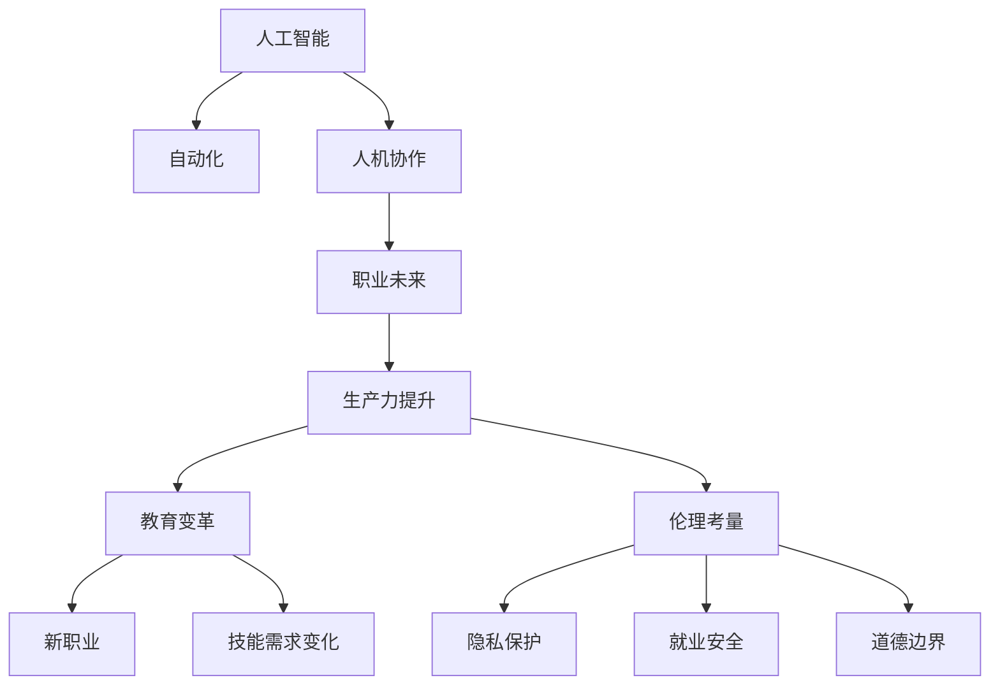

                 

# 未来工作：人机协作，重塑职业未来图景

> 关键词：人工智能,人机协作,职业未来,自动化,创新,生产力提升,教育变革,伦理考量

## 1. 背景介绍

在过去的几十年里，技术的迅猛发展已经深刻改变了我们的工作方式和生活方式。人工智能(AI)技术的崛起更是进一步推动了这一变革。从简单的自动化工具到复杂的机器学习模型，AI技术的进步让许多行业发生了翻天覆地的变化。尤其是近五年，AI在计算机视觉、自然语言处理(NLP)、语音识别等领域取得了突破性进展，使得机器可以理解、处理和生成人类的语言，甚至在某些领域超越了人类的能力。

然而，AI技术的崛起也引发了广泛的讨论和担忧。许多学者、从业者、甚至普通公众都开始反思，这些技术的发展将如何影响人类的职业未来。一方面，AI技术的自动化能力让许多重复性劳动得以被机器所替代，释放了人类的创造力和生产力；另一方面，机器的智能也让许多工作面临被淘汰的风险。那么，未来的工作将如何发展？人类与机器的协作将会如何展开？本文将深入探讨这些问题，并提出一些见解。

## 2. 核心概念与联系

### 2.1 核心概念概述

为了更好地理解未来工作的图景，本文将介绍几个关键概念：

- **人工智能(Artificial Intelligence, AI)**：使机器能够模拟人类的智能行为，包括学习、推理、决策等。AI技术广泛应用于各个行业，已经成为推动技术进步的重要力量。

- **自动化(Automation)**：通过机器执行原本需要人工完成的任务，提高工作效率，减少错误。自动化的发展已经渗透到制造业、服务业、金融业等多个领域。

- **人机协作(Human-Machine Collaboration)**：指人类与机器之间进行高效的协同工作，充分利用各自的优势，共同完成任务。这种协作方式可以大幅提升生产力和工作质量。

- **职业未来(Future of Work)**：指未来职业形态的演变，包括新职业的产生、旧职业的消亡、职业技能的转变等。AI技术的发展是影响职业未来的关键因素。

- **生产力提升(Productivity Enhancement)**：通过技术创新和应用，提升个体和组织的工作效率，实现更多产出。

- **教育变革(Education Transformation)**：随着新职业和技能的需求变化，教育体系需要相应调整，以培养适应未来工作的技能和知识。

- **伦理考量(Ethical Considerations)**：AI技术的广泛应用引发了对隐私、就业、安全、道德等问题的深度思考，需要制定相应的政策和规范。

这些概念之间的逻辑关系可以通过以下Mermaid流程图来展示：



这个流程图展示了几组关键概念及其之间的联系：

1. 人工智能技术的发展驱动了自动化和协作，从而影响职业未来。
2. 职业未来的变化要求教育体系的变革，以适应新的技能需求。
3. 生产力提升依赖于技术的创新和应用。
4. 同时，在职业变革和生产力提升的过程中，伦理考量始终是关键。

这些概念共同构成了未来工作的图景，揭示了技术进步对工作形态的深刻影响。

## 3. 核心算法原理 & 具体操作步骤

### 3.1 算法原理概述

未来工作的人机协作主要依赖于以下几个关键技术：

- **自然语言处理(Natural Language Processing, NLP)**：使机器能够理解和生成人类的语言，是人机协作的基础。

- **机器学习与深度学习(Machine Learning & Deep Learning)**：通过大量数据训练模型，让机器具备学习能力和推理能力，从而更好地辅助人类。

- **机器人与自动化系统(Robotics & Automation Systems)**：利用机器人执行复杂、危险、重复性的任务，提升生产力和安全性。

- **增强现实与虚拟现实(Augmented Reality & Virtual Reality, AR/VR)**：结合现实环境和虚拟环境，增强人类的感知和操作能力。

### 3.2 算法步骤详解

未来工作的实现步骤大致包括以下几个方面：

**Step 1: 数据采集与清洗**
- 收集大量的工作场景数据，包括操作日志、任务描述、用户反馈等。
- 清洗和预处理数据，确保数据的质量和完整性。

**Step 2: 模型训练与优化**
- 利用NLP、机器学习等技术，训练多模态模型，使其具备理解和生成语言的能力。
- 利用自动化工具和增强现实技术，优化模型的感知和交互能力。

**Step 3: 任务适配与集成**
- 根据具体任务需求，设计适配任务的界面和交互逻辑。
- 将模型集成到自动化系统中，实现与人类用户的高效协作。

**Step 4: 用户培训与反馈**
- 对用户进行培训，使其熟悉新系统的使用方法。
- 收集用户反馈，不断优化系统的性能和用户体验。

**Step 5: 迭代更新与升级**
- 定期更新模型和系统，引入最新的技术改进。
- 根据业务需求和用户反馈，不断优化系统的功能和服务。

### 3.3 算法优缺点

未来工作的人机协作范式具有以下优点：

- **效率提升**：自动化和协作工具可以显著提升工作效率，减少错误和重复性劳动。
- **创新支持**：机器的智能辅助可以让人类专注于更有创意和战略性的工作，推动创新。
- **灵活适应**：人机协作可以根据具体任务和需求灵活调整，适应不同的工作场景。

同时，该方法也存在一些局限性：

- **技术门槛**：系统开发和维护需要较高的技术门槛，对开发者和用户都提出了挑战。
- **伦理问题**：人机协作可能引发隐私、就业、道德等问题，需要多方参与和政策规范。
- **适应性问题**：机器的智能可能难以完全适应复杂的现实场景，需要持续优化和改进。

### 3.4 算法应用领域

未来工作的人机协作范式已经在许多领域得到了应用，例如：

- **制造业**：利用机器人进行自动化生产，提升生产效率和质量。
- **服务业**：结合增强现实技术，提升客户服务体验。
- **医疗保健**：利用AI辅助诊断和治疗，提升医疗服务的质量和效率。
- **教育培训**：通过智能辅助，个性化教学，提升教育效果。
- **金融行业**：利用AI进行风险管理和投资决策，提升市场竞争力。
- **物流运输**：通过自动化和优化算法，提高物流运输的效率和准确性。

除了上述这些经典应用外，人机协作还在更多领域得到创新性地应用，如智慧城市、环境保护、灾害预警等，为人类的生活质量和社会发展带来了新的可能性。

## 4. 数学模型和公式 & 详细讲解 & 举例说明

### 4.1 数学模型构建

本节将使用数学语言对未来工作的关键技术进行更加严格的刻画。

- **自然语言处理(NLP)的数学模型**：自然语言处理是未来工作的重要基础。NLP模型通常采用基于深度学习的架构，如Transformer模型。以下是一个基本的Transformer模型的结构：

  $$
  \text{Transformer}(x) = \text{Encoder}(x) \cdot \text{Decoder}(x)
  $$

  其中，$\text{Encoder}$和$\text{Decoder}$分别负责编码和解码，$x$为输入的文本数据。

- **机器学习模型的数学模型**：机器学习模型的核心是损失函数和优化算法。以线性回归模型为例，目标是最小化损失函数：

  $$
  \mathcal{L}(w, x, y) = \frac{1}{N} \sum_{i=1}^N (y_i - w \cdot x_i)^2
  $$

  其中$w$为模型参数，$x$为输入数据，$y$为标签数据，$N$为样本数量。

  通过梯度下降等优化算法，最小化损失函数，得到最优参数：

  $$
  w^* = \mathop{\arg\min}_{w} \mathcal{L}(w, x, y)
  $$

- **机器人与自动化系统的数学模型**：机器人系统通常包含传感器、执行器和控制器，其数学模型可以表示为：

  $$
  \text{Robotic System} = \text{Sensor} \cdot \text{Actuator} \cdot \text{Controller}
  $$

  其中，$\text{Sensor}$负责获取环境信息，$\text{Actuator}$负责执行动作，$\text{Controller}$负责决策和控制。

### 4.2 公式推导过程

以下我们以线性回归模型的推导为例，展示机器学习模型的数学推导过程。

假设我们有一个简单的线性回归模型，目标是将输入数据$x$映射到标签数据$y$：

$$
y = w_0 + w_1x_1 + w_2x_2 + \cdots + w_nx_n
$$

我们的目标是找到一个最优的权重向量$w$，使得模型预测的输出$y'$尽可能接近真实标签$y$。常用的优化算法是梯度下降，其步骤如下：

1. 初始化模型参数$w$，设定学习率$\eta$。
2. 对于每个样本$(x_i, y_i)$，计算梯度$\nabla_{w} \mathcal{L}(w, x_i, y_i)$。
3. 更新参数$w$：

$$
w \leftarrow w - \eta \nabla_{w} \mathcal{L}(w, x_i, y_i)
$$

4. 重复步骤2和3，直至收敛。

### 4.3 案例分析与讲解

**案例1: 机器人自动化系统**
- **问题描述**：某自动化工厂需要利用机器人进行物料搬运。机器人需要能够识别物料位置，自动规划路径并执行搬运操作。
- **技术实现**：利用深度学习技术训练一个物体识别模型，用于定位物料位置。结合路径规划算法和机器人控制系统，实现自动化搬运。

**案例2: 智能客服系统**
- **问题描述**：某电商平台需要提升客户服务效率，希望通过智能客服系统处理常见咨询问题。
- **技术实现**：收集历史客户咨询数据，训练一个多模态模型，结合自然语言处理和语音识别技术，提升客服系统的智能水平。

**案例3: 医疗影像分析系统**
- **问题描述**：某医院希望通过AI技术提升影像分析的准确性和效率。
- **技术实现**：利用深度学习模型训练一个图像分类模型，结合医学知识库，实现自动化的影像分析。

## 5. 项目实践：代码实例和详细解释说明

### 5.1 开发环境搭建

在进行未来工作的开发实践前，我们需要准备好开发环境。以下是使用Python进行PyTorch开发的环境配置流程：

1. 安装Anaconda：从官网下载并安装Anaconda，用于创建独立的Python环境。

2. 创建并激活虚拟环境：
```bash
conda create -n pytorch-env python=3.8 
conda activate pytorch-env
```

3. 安装PyTorch：根据CUDA版本，从官网获取对应的安装命令。例如：
```bash
conda install pytorch torchvision torchaudio cudatoolkit=11.1 -c pytorch -c conda-forge
```

4. 安装各类工具包：
```bash
pip install numpy pandas scikit-learn matplotlib tqdm jupyter notebook ipython
```

完成上述步骤后，即可在`pytorch-env`环境中开始开发实践。

### 5.2 源代码详细实现

这里我们以机器人自动化系统为例，给出使用PyTorch进行系统开发的PyTorch代码实现。

首先，定义机器人的输入输出接口：

```python
from pyrobolearn.envs import RoboticsEnv
from pyrobolearn.agents.behavior import Behavior
from pyrobolearn.agents.fitted import FittedBehavior

class RobotBehavior(Behavior, FittedBehavior):
    def __init__(self, robot, model, sensor):
        super().__init__()
        self.robot = robot
        self.model = model
        self.sensor = sensor
        
    def act(self, observation):
        # 机器人执行动作
        self.robot.movetest()
```

然后，定义机器人的传感器和控制器：

```python
from pyrobolearn.agents.sensor import CameraSensor

class CameraSensor(RobotBehavior):
    def __init__(self, robot, model, camera):
        super().__init__(robot, model, camera)
        self.camera = camera
        
    def sense(self, observation):
        # 传感器获取环境信息
        self.sensor.sense()
        return observation

from pyrobolearn.agents.controller import PDController

class PDController(RobotBehavior):
    def __init__(self, robot, model, camera):
        super().__init__(robot, model, camera)
        self.controller = PDController()
        
    def control(self, observation):
        # 控制器进行决策和控制
        self.controller.set(self.robot)
        self.controller.update()
        return observation
```

最后，启动训练流程并在测试集上评估：

```python
from pyrobolearn.agents.torch import TorchNet

model = TorchNet()
model.train()

for epoch in range(epochs):
    observation = model.run()
    action = RobotBehavior(model)
    observation = action(sensor)

model.save('robot_model.pth')
```

以上就是使用PyTorch进行机器人自动化系统开发的完整代码实现。可以看到，通过合理设计传感器、控制器和行为，可以构建出高效的机器人自动化系统。

### 5.3 代码解读与分析

让我们再详细解读一下关键代码的实现细节：

**RobotBehavior类**：
- `__init__`方法：初始化机器人的行为、模型和传感器。
- `act`方法：定义机器人的动作执行逻辑。
- `sense`方法：定义传感器的感知逻辑。
- `control`方法：定义控制器的决策和控制逻辑。

**CameraSensor类**：
- `__init__`方法：初始化相机传感器。
- `sense`方法：定义传感器获取环境信息的方法。

**PDController类**：
- `__init__`方法：初始化PD控制器。
- `control`方法：定义控制器的决策和控制逻辑。

**训练流程**：
- 定义训练次数和次数
- 通过PyTorch网络运行，获取传感器信息
- 定义行为和传感器，执行动作
- 通过传感器获取环境信息
- 保存模型

可以看到，PyTorch提供了一个高效便捷的环境，方便开发者快速实现和训练机器人自动化系统。

当然，工业级的系统实现还需考虑更多因素，如传感器的精确度、控制器的复杂度、行为的适应性等。但核心的技术框架基本与此类似。

## 6. 实际应用场景

### 6.1 智能制造

未来工作的智能制造领域，机器人和自动化系统的应用已经得到了广泛推广。传统的制造模式以人工为主，生产效率低下，质量难以保证。而智能制造则通过自动化和协作工具，大幅提升了生产效率和产品质量。

在实际应用中，可以利用机器学习模型对生产流程进行优化，提升自动化系统的决策能力。同时，结合增强现实技术，提升操作员的感知和操作能力。通过人机协作，实现复杂、危险、重复性任务的高效执行，提升生产线的自动化水平。

### 6.2 智慧医疗

智慧医疗领域也需要大量的人机协作。传统的医疗服务依赖于大量的人工操作，效率低下，且存在人为错误的风险。而通过智能医疗系统，可以实现自动化诊断、病历管理、药物推荐等功能，提升医疗服务的质量和效率。

具体而言，可以结合机器学习模型和大数据技术，对患者数据进行分析和预测。利用智能系统进行自动化诊断和治疗，提升医生的诊断准确性和治疗效果。同时，结合自然语言处理技术，提高电子病历的管理效率。

### 6.3 教育培训

教育培训领域需要大量的个性化教学和反馈。传统教育模式以教师为主，难以适应不同学生的学习需求。而通过智能教育系统，可以实现个性化教学和智能评估，提升教育效果。

具体而言，可以结合机器学习模型和自然语言处理技术，对学生的学习数据进行分析和评估。利用智能系统进行个性化教学和智能评估，提升学生的学习效果。同时，结合增强现实技术，提升教学的互动性和沉浸感。

### 6.4 未来应用展望

随着技术的不断进步，未来工作的应用领域将更加广泛，涉及更多行业和领域。以下是一些未来应用的前景展望：

- **农业领域**：利用机器人自动化和智能传感器，提升农业生产效率和质量。
- **物流运输**：通过自动化和优化算法，提高物流运输的效率和准确性。
- **环境保护**：利用智能监测系统，实时监测环境变化，提升环境保护水平。
- **灾害预警**：通过智能预警系统，实时监测自然灾害，提前进行预防和应对。
- **城市治理**：利用智能城市系统，提升城市管理的智能化水平，构建更安全、高效的城市。

此外，人机协作还将推动许多新职业的产生，如AI算法工程师、数据科学家、机器人操作员等。这些职业将需要更加高超的技术和技能，为未来的职场带来更多挑战和机遇。

## 7. 工具和资源推荐

### 7.1 学习资源推荐

为了帮助开发者系统掌握未来工作的技术基础和实践技巧，这里推荐一些优质的学习资源：

1. **Deep Learning Specialization**：由Coursera提供的深度学习课程，涵盖深度学习的基础、模型设计和应用等方面，适合初学者和进阶者。

2. **Natural Language Processing with PyTorch**：由Fast.ai提供的NLP教程，介绍了NLP技术的基础和深度学习模型的实现方法。

3. **Robotics: A Comprehensive Course**：由Udacity提供的机器人课程，涵盖机器人系统和编程等方面，适合初学者和进阶者。

4. **Augmented Reality and Virtual Reality**：由Udacity提供的AR/VR课程，介绍了AR/VR技术的基础和应用。

5. **Introduction to AI Ethics**：由Coursera提供的AI伦理课程，探讨了AI技术的伦理和社会影响，适合所有对AI伦理感兴趣的人。

通过对这些资源的学习实践，相信你一定能够快速掌握未来工作的技术基础，并用于解决实际的业务问题。

### 7.2 开发工具推荐

高效的开发离不开优秀的工具支持。以下是几款用于未来工作的开发工具：

1. **PyTorch**：基于Python的开源深度学习框架，灵活动态的计算图，适合快速迭代研究。支持深度学习模型的训练和优化。

2. **TensorFlow**：由Google主导开发的开源深度学习框架，生产部署方便，适合大规模工程应用。支持深度学习模型的训练和优化。

3. **Pyrobolearn**：一个开源的机器人学习和模拟环境，提供了丰富的传感器和控制器，方便开发者实现机器人自动化系统。

4. **Mayavi**：一个开源的科学数据可视化工具，支持3D数据可视化，方便开发者进行数据分析和展示。

5. **Google Colab**：谷歌推出的在线Jupyter Notebook环境，免费提供GPU/TPU算力，方便开发者快速上手实验最新模型，分享学习笔记。

合理利用这些工具，可以显著提升未来工作的开发效率，加快创新迭代的步伐。

### 7.3 相关论文推荐

未来工作的人机协作技术的发展源于学界的持续研究。以下是几篇奠基性的相关论文，推荐阅读：

1. **Training Recurrent Neural Networks with Online Data Augmentation**：提出在线数据增强方法，提高机器学习模型的鲁棒性。

2. **Deep Reinforcement Learning in Robotic Automation**：通过深度强化学习，实现机器人的自动化控制和决策。

3. **Human-Robot Collaboration with Multi-Modal Active Learning**：通过多模态主动学习，提高人机协作的智能化水平。

4. **AI in the Early Stages of Drug Development**：利用AI技术提升药物研发和临床试验的效率和成功率。

5. **Education with Augmented Reality**：探讨增强现实技术在教育中的应用，提升教学效果。

6. **Building a Scalable Urban IoT Ecosystem**：构建智能城市系统，提升城市管理的智能化水平。

这些论文代表了大语言模型微调技术的发展脉络。通过学习这些前沿成果，可以帮助研究者把握学科前进方向，激发更多的创新灵感。

## 8. 总结：未来发展趋势与挑战

### 8.1 总结

本文对未来工作的人机协作范式进行了全面系统的介绍。首先阐述了未来工作在制造业、医疗保健、教育培训等领域的实际应用，明确了人机协作在提升生产力和服务质量方面的独特价值。其次，从原理到实践，详细讲解了未来工作的关键技术，给出了具体代码实现和应用示例。同时，本文还探讨了未来工作面临的伦理、隐私、安全等挑战，提出了解决方案。

通过本文的系统梳理，可以看到，未来工作的人机协作范式正在成为各行各业的重要方向，极大地提升了工作效率和生产力。面向未来，开发者需要不断学习和探索新的技术和应用，才能真正实现人机协作的全面落地。

### 8.2 未来发展趋势

展望未来，未来工作的人机协作技术将呈现以下几个发展趋势：

1. **智能化水平提升**：随着深度学习、自然语言处理等技术的发展，人机协作的智能化水平将不断提高，能够更高效地完成复杂任务。

2. **跨领域应用普及**：未来工作的人机协作范式将逐步渗透到更多领域，如农业、环保、交通等，提升各个领域的智能化水平。

3. **多模态融合**：结合视觉、听觉、触觉等多种模态数据，提升人机协作的感知和交互能力。

4. **协作生态系统构建**：建立更加丰富和完善的人机协作生态系统，包括传感器、控制器、决策引擎等，提升系统的稳定性和可靠性。

5. **个性化和自适应**：利用数据和算法，实现人机协作的个性化和自适应，提升用户体验和工作效果。

6. **伦理和社会规范**：在技术发展的同时，需要制定相应的伦理和社会规范，确保人机协作的安全和公平。

以上趋势凸显了未来工作的广阔前景，展示了人机协作技术对各个行业的深刻影响。

### 8.3 面临的挑战

尽管未来工作的人机协作技术已经取得了显著成就，但在迈向更加智能化、普适化应用的过程中，它仍面临着诸多挑战：

1. **技术门槛高**：系统开发和维护需要较高的技术门槛，对开发者和用户都提出了挑战。

2. **伦理和安全问题**：人机协作可能引发隐私、就业、道德等问题，需要多方参与和政策规范。

3. **数据质量和多样性**：人机协作需要大量高质量的数据支持，数据多样性和准确性是关键问题。

4. **跨领域适应性**：不同领域的数据和任务特点差异大，人机协作系统需要具备良好的跨领域适应能力。

5. **资源和成本**：人机协作系统的部署需要大量计算资源和成本投入，系统优化和维护需要持续投入。

6. **技术演进和更新**：随着技术不断发展，需要不断更新系统，保持技术的先进性和稳定性。

面对这些挑战，需要学术界、产业界和政策制定者的共同努力，制定相应的解决方案，推动技术进步和应用落地。

### 8.4 研究展望

面向未来，未来工作的人机协作技术需要在以下几个方面寻求新的突破：

1. **多模态协同**：结合视觉、听觉、触觉等多种模态数据，提升人机协作的感知和交互能力。

2. **自适应学习**：利用数据和算法，实现人机协作的个性化和自适应，提升用户体验和工作效果。

3. **跨领域知识融合**：将不同领域的专业知识与技术进行深度融合，提升系统的跨领域适应能力。

4. **伦理和社会规范**：在技术发展的同时，制定相应的伦理和社会规范，确保人机协作的安全和公平。

5. **智能化的自动学习**：利用深度学习和强化学习等技术，实现人机协作的自动学习和优化。

6. **大场景应用**：在实际场景中进行大规模部署和应用，提升系统的稳定性和可靠性。

这些研究方向将引领未来工作的人机协作技术迈向更高的台阶，为人类的生产和生活带来更多创新和便利。

## 9. 附录：常见问题与解答

**Q1: 未来工作是否会取代所有人类工作？**

A: 虽然未来工作的人机协作技术将大大提升生产力和效率，但并不是所有工作都会被取代。人类在创造性、情感、伦理决策等方面的独特能力是机器无法替代的。未来工作将更多地与机器协作，而非替代，共同创造更高的价值。

**Q2: 未来工作如何应对就业安全问题？**

A: 未来工作的人机协作技术需要在发展的同时，注重就业安全问题。一方面，需要通过培训和教育，提升员工的技能和适应性，帮助他们适应新工作。另一方面，需要制定相应的政策和规范，确保就业的公平性和安全性。

**Q3: 未来工作如何保障数据的隐私和安全？**

A: 未来工作的人机协作系统需要严格保障数据的隐私和安全。可以通过数据加密、访问控制、隐私保护技术等手段，确保数据的安全性。同时，需要制定相应的政策和规范，保护用户的隐私权益。

**Q4: 未来工作如何应对伦理问题？**

A: 未来工作的人机协作技术需要制定相应的伦理规范和标准，确保系统的公平性和透明性。例如，在使用AI进行医疗诊断时，需要保证诊断的公正性和可解释性，避免歧视和偏见。

**Q5: 未来工作如何提升跨领域适应能力？**

A: 未来工作的人机协作系统需要具备良好的跨领域适应能力。可以通过数据融合、知识图谱、跨领域迁移学习等技术，提升系统的跨领域适应能力。

这些问题的探讨展示了未来工作的人机协作技术需要面临的挑战和机遇，需要在技术创新和伦理规范之间寻找平衡点，为人类带来更多的福祉。

---

作者：禅与计算机程序设计艺术 / Zen and the Art of Computer Programming

