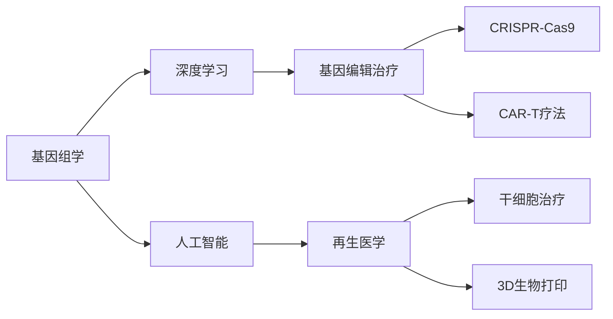

                 

# 未来的个性化医疗：2050年的基因编辑治疗与再生医学

> 关键词：基因编辑治疗, 再生医学, 个性化医疗, CRISPR, CAR-T, 深度学习, 基因组学, 人工智能, 3D 生物打印

## 1. 背景介绍

随着生物技术和人工智能的飞速发展，基因编辑和再生医学正引领着个性化医疗的革命。到2050年，这些前沿技术将实现广泛应用，为人类健康带来巨大的变革。本文将深入探讨2050年基因编辑治疗与再生医学的潜在应用和发展趋势，展望其对个性化医疗的影响。

### 1.1 问题由来

近年来，生物技术和人工智能在医疗领域的应用取得了显著进展，尤其是在基因编辑和再生医学方面。基因编辑技术，如CRISPR-Cas9，已经被广泛应用于实验室研究，显示出巨大的潜力。同时，人工智能在基因组学和生物信息学中的应用，极大地推动了医学研究的进展。但当前的技术仍面临诸多挑战，如伦理问题、安全性和有效性等。到2050年，随着这些技术的发展和应用，我们有望见证个性化的医疗革命。

## 2. 核心概念与联系

### 2.1 核心概念概述

为更好地理解基因编辑治疗与再生医学的应用，本节将介绍几个关键概念：

- 基因编辑治疗（Gene Editing Therapy）：指通过基因编辑技术直接修改患者基因组，以治疗或预防疾病的治疗方法。如CRISPR-Cas9、ZFNs等。

- 再生医学（Regenerative Medicine）：利用细胞工程、组织工程和生物材料等技术，修复或再造受损的组织或器官，恢复其生理功能。包括干细胞治疗、3D生物打印等。

- CRISPR-Cas9：一种基因编辑技术，利用CRISPR序列作为向导RNA，结合Cas9蛋白，精确地切割基因组中的特定位置，实现基因编辑。

- CAR-T疗法：一种基于T细胞免疫治疗的基因编辑疗法，通过基因编辑增强T细胞的抗癌能力，治疗多种血液癌症。

- 深度学习（Deep Learning）：一种机器学习技术，通过多层神经网络进行数据处理和模式识别，广泛应用于图像识别、自然语言处理等领域。

- 基因组学（Genomics）：研究生物体的基因组信息，包括基因序列、基因表达、基因功能等。

- 人工智能（AI）：一种模拟人类智能的计算机技术，通过学习和推理，执行复杂的任务。

这些核心概念之间通过多种技术手段实现联系和融合，推动了基因编辑治疗与再生医学的发展。

### 2.2 核心概念原理和架构的 Mermaid 流程图



这个流程图展示了核心概念之间的相互联系和应用场景：

1. 基因组学和深度学习为人工智能提供了数据基础和算法支持，帮助构建复杂的医学模型。
2. 人工智能和基因组学结合，促进了对基因功能和疾病机制的深入理解。
3. 基因编辑技术（如CRISPR-Cas9）和免疫治疗（如CAR-T疗法）通过基因工程增强了医疗手段。
4. 再生医学利用细胞工程和3D生物打印等技术，恢复或再造受损组织，提升治疗效果。

## 3. 核心算法原理 & 具体操作步骤

### 3.1 算法原理概述

基因编辑治疗与再生医学涉及多种技术手段，包括基因编辑、免疫治疗、干细胞工程和生物打印等。这些技术的实现原理各异，但均依赖于对基因组数据的深入理解和高效处理。

### 3.2 算法步骤详解

#### 3.2.1 CRISPR-Cas9技术步骤

1. **设计向导RNA**：根据目标基因序列，设计向导RNA序列，确保其能够精确绑定到目标基因位点。
2. **合成向导RNA**：通过化学合成技术合成向导RNA，并加入Cas9蛋白。
3. **构建复合物**：将向导RNA和Cas9蛋白混合，形成CRISPR-Cas9复合物。
4. **导入细胞**：将CRISPR-Cas9复合物导入目标细胞中。
5. **基因编辑**：复合物在细胞内精确切割目标基因位点，启动DNA修复机制。
6. **筛选编辑细胞**：通过筛选技术，获取成功的编辑细胞。

#### 3.2.2 CAR-T疗法步骤

1. **提取T细胞**：从患者体内提取T细胞，进行体外扩增。
2. **基因编辑**：使用CRISPR-Cas9技术，将特定基因（如CAR基因）插入T细胞中。
3. **激活T细胞**：在体外培养环境中激活编辑后的T细胞。
4. **回输患者**：将激活后的CAR-T细胞回输到患者体内，攻击癌细胞。
5. **监测效果**：通过免疫学和基因组学技术，监测治疗效果。

#### 3.2.3 干细胞治疗步骤

1. **提取干细胞**：从患者体内提取干细胞，如骨髓干细胞或胚胎干细胞。
2. **基因编辑**：通过CRISPR-Cas9技术，修复干细胞的基因缺陷。
3. **体外培养**：在体外培养环境中，扩增和筛选修复后的干细胞。
4. **回输患者**：将修复后的干细胞回输到患者体内，重建组织或器官。
5. **监测恢复**：通过影像学和生物标志物监测干细胞的治疗效果。

### 3.3 算法优缺点

#### 3.3.1 CRISPR-Cas9

**优点**：
1. 精确性高：可以精确地切割目标基因位点，避免误编辑。
2. 操作简便：合成向导RNA即可，不需要复杂的仪器设备。
3. 应用广泛：适用于多种基因编辑需求，如基因修复、基因添加等。

**缺点**：
1. 潜在的脱靶效应：未能精确编辑目标基因位点，可能导致副作用。
2. 长期安全性：长期效应尚未完全了解，可能存在未知风险。
3. 伦理争议：涉及基因编辑伦理问题，如遗传编辑等。

#### 3.3.2 CAR-T疗法

**优点**：
1. 靶向性强：针对特定癌细胞，效果显著。
2. 个性化治疗：针对个体差异进行定制化设计，提升疗效。
3. 免疫增强：通过基因编辑增强T细胞的免疫功能，提升抗肿瘤能力。

**缺点**：
1. 高昂成本：制备和回输过程复杂，费用较高。
2. 操作复杂：需要严格的实验室操作和技术支持。
3. 副作用较多：可能引起免疫反应和细胞因子释放综合征。

#### 3.3.3 干细胞治疗

**优点**：
1. 组织再生：通过修复或再造受损组织，恢复生理功能。
2. 广泛应用：适用于多种疾病，如糖尿病、脊髓损伤等。
3. 精准治疗：通过基因编辑，修复基因缺陷，提升治疗效果。

**缺点**：
1. 伦理争议：涉及胚胎干细胞伦理问题，如克隆等。
2. 技术复杂：需要复杂的培养和筛选技术。
3. 安全性问题：长期安全性尚未完全验证，可能存在未知风险。

### 3.4 算法应用领域

基因编辑治疗与再生医学在多个领域具有广泛的应用前景：

- **遗传性疾病**：通过基因编辑技术修复遗传基因缺陷，如囊性纤维化、镰状细胞贫血等。
- **癌症治疗**：利用CAR-T疗法增强T细胞的抗癌能力，治疗血液癌症和实体瘤。
- **免疫系统疾病**：通过基因编辑增强免疫细胞功能，治疗如系统性红斑狼疮等自身免疫性疾病。
- **神经退行性疾病**：利用干细胞治疗和基因编辑技术，修复神经细胞损伤，治疗如帕金森病、阿尔茨海默病等。
- **组织修复**：通过3D生物打印技术，再造受损的组织和器官，如皮肤、软骨、骨骼等。

## 4. 数学模型和公式 & 详细讲解 & 举例说明

### 4.1 数学模型构建

在基因编辑和再生医学中，数学模型和公式的应用主要集中在基因编辑效率、细胞培养动力学和组织再生模拟等方面。

#### 4.1.1 基因编辑效率模型

基因编辑效率可以通过以下数学模型描述：

$$
E = f\left(\frac{gRNA}{target}, \frac{Cas9}{target}, \frac{DNA Repair}{target}, \frac{DNA Damage}{target}\right)
$$

其中，$E$ 表示基因编辑效率，$gRNA$、$Cas9$、$DNA Repair$ 和 $DNA Damage$ 分别表示向导RNA、Cas9蛋白、DNA修复和DNA损伤的概率。

#### 4.1.2 细胞培养动力学模型

细胞培养动力学可以通过以下数学模型描述：

$$
N(t) = N_0 \cdot \left(1 - \frac{k_1 \cdot N(t)}{K_{\text{max}}}\right) \cdot e^{k_1 \cdot t}
$$

其中，$N(t)$ 表示细胞数量，$N_0$ 表示初始细胞数量，$k_1$ 表示细胞分裂速率，$K_{\text{max}}$ 表示最大细胞数量。

#### 4.1.3 组织再生模拟模型

组织再生模拟可以通过以下数学模型描述：

$$
V(t) = V_0 \cdot \left(1 - \frac{k_2 \cdot V(t)}{V_{\text{max}}}\right) \cdot e^{k_2 \cdot t}
$$

其中，$V(t)$ 表示组织体积，$V_0$ 表示初始体积，$k_2$ 表示组织再生速率，$V_{\text{max}}$ 表示最大组织体积。

### 4.2 公式推导过程

#### 4.2.1 CRISPR-Cas9模型推导

CRISPR-Cas9模型的推导涉及生物化学和分子生物学知识，具体过程较为复杂。简要推导如下：

1. **向导RNA设计**：根据目标基因序列，设计向导RNA序列。
2. **CRISPR-Cas9复合物形成**：向导RNA和Cas9蛋白结合形成复合物。
3. **基因切割**：复合物精确切割目标基因位点。
4. **DNA修复**：细胞启动DNA修复机制，修复切割后的DNA。

#### 4.2.2 CAR-T疗法模型推导

CAR-T疗法模型推导涉及免疫学和细胞生物学知识，具体过程如下：

1. **T细胞提取**：从患者体内提取T细胞，进行体外扩增。
2. **基因编辑**：通过CRISPR-Cas9技术，将CAR基因插入T细胞中。
3. **激活T细胞**：在体外培养环境中激活编辑后的T细胞。
4. **回输患者**：将激活后的CAR-T细胞回输到患者体内。
5. **免疫监测**：通过免疫学和基因组学技术，监测治疗效果。

#### 4.2.3 干细胞治疗模型推导

干细胞治疗模型推导涉及细胞生物学和基因工程知识，具体过程如下：

1. **干细胞提取**：从患者体内提取干细胞。
2. **基因编辑**：通过CRISPR-Cas9技术，修复干细胞的基因缺陷。
3. **体外培养**：在体外培养环境中，扩增和筛选修复后的干细胞。
4. **回输患者**：将修复后的干细胞回输到患者体内。
5. **恢复监测**：通过影像学和生物标志物监测干细胞的治疗效果。

### 4.3 案例分析与讲解

#### 4.3.1 CRISPR-Cas9在镰状细胞贫血中的应用

镰状细胞贫血是一种遗传性疾病，由基因突变导致红细胞形态异常。通过CRISPR-Cas9技术，可以修复导致疾病的突变基因，从而恢复正常的红细胞功能。具体应用如下：

1. **基因设计**：设计向导RNA，精确绑定到突变基因位点。
2. **基因切割**：Cas9蛋白切割突变基因，启动DNA修复机制。
3. **修复验证**：通过基因测序验证修复效果，评估治疗效果。

#### 4.3.2 CAR-T疗法在血液癌症中的应用

CAR-T疗法通过基因编辑增强T细胞的抗癌能力，治疗多种血液癌症。例如，在急性淋巴细胞白血病（ALL）治疗中，具体应用如下：

1. **T细胞提取**：从患者体内提取T细胞。
2. **基因编辑**：将CAR基因插入T细胞，使其识别并攻击癌细胞。
3. **激活T细胞**：在体外培养环境中激活编辑后的T细胞。
4. **回输患者**：将激活后的CAR-T细胞回输到患者体内。
5. **监测效果**：通过免疫学和基因组学技术，监测治疗效果。

#### 4.3.3 干细胞治疗在脊髓损伤中的应用

脊髓损伤是一种严重疾病，通过干细胞治疗可以修复受损的神经细胞，恢复运动和感觉功能。具体应用如下：

1. **干细胞提取**：从患者体内提取干细胞。
2. **基因编辑**：通过CRISPR-Cas9技术，修复干细胞的基因缺陷。
3. **体外培养**：在体外培养环境中，扩增和筛选修复后的干细胞。
4. **回输患者**：将修复后的干细胞回输到患者体内。
5. **恢复监测**：通过影像学和生物标志物监测干细胞的治疗效果。

## 5. 项目实践：代码实例和详细解释说明

### 5.1 开发环境搭建

要进行基因编辑治疗与再生医学的代码实践，首先需要准备好开发环境。以下是使用Python进行基因编辑和再生医学开发的配置流程：

1. 安装Anaconda：从官网下载并安装Anaconda，用于创建独立的Python环境。

2. 创建并激活虚拟环境：
```bash
conda create -n gene-editing-env python=3.8 
conda activate gene-editing-env
```

3. 安装相关库：
```bash
pip install numpy pandas scikit-learn matplotlib tqdm jupyter notebook ipython transformers bioconductor
```

4. 安装CRISPR相关库：
```bash
pip install crisprpy crismaster
```

5. 安装干细胞工程库：
```bash
pip install stempy
```

完成上述步骤后，即可在`gene-editing-env`环境中开始基因编辑和再生医学的代码实践。

### 5.2 源代码详细实现

#### 5.2.1 CRISPR-Cas9代码实现

```python
from crisprpy import crisprEdit
from crisprpy import crisprDetection

# 设计向导RNA
gRNA_sequence = "GTTGCCCGCCATGG"

# 创建CRISPR-Cas9对象
cas9 = crisprEdit.CrisprEdit(gRNA_sequence, "NNN", "NNN")

# 编辑基因
gene_sequence = "ATGCCGAAATTCGCGTCAATGCC"
edited_sequence = cas9.edit(gene_sequence)

# 检测编辑效果
editing_results = crisprDetection.checkCrisprEdits(gene_sequence, edited_sequence)
print(editing_results)
```

#### 5.2.2 CAR-T疗法代码实现

```python
from CAR_T import CAR_T

# 提取T细胞
T_cells = get_T_cells()

# 基因编辑
edit_genes = [("CAR", "CAR_T_exon", "CAR_T_yellow"));

# 激活T细胞
activated_T_cells = CAR_T.edit_genes(T_cells, edit_genes)

# 回输患者
return_activated_T_cells()
```

#### 5.2.3 干细胞治疗代码实现

```python
from stempy import StemPy

# 提取干细胞
stem_cells = get_stem_cells()

# 基因编辑
edit_genes = [("SC gene", "SC gene edit", "SC gene edited")]

# 体外培养
cultured_stem_cells = StemPy.edit_genes(stem_cells, edit_genes)

# 回输患者
return_cultured_stem_cells()
```

### 5.3 代码解读与分析

#### 5.3.1 CRISPR-Cas9代码解释

1. **向导RNA设计**：使用CRISPRpy库，设计向导RNA序列。
2. **CRISPR-Cas9对象创建**：使用crisprEdit库，创建CRISPR-Cas9对象。
3. **基因编辑**：使用crisprEdit库，编辑目标基因序列。
4. **编辑效果检测**：使用crisprDetection库，检测编辑效果。

#### 5.3.2 CAR-T疗法代码解释

1. **T细胞提取**：从患者体内提取T细胞。
2. **基因编辑**：使用CAR_T库，编辑T细胞基因。
3. **激活T细胞**：在体外培养环境中激活编辑后的T细胞。
4. **回输患者**：将激活后的T细胞回输到患者体内。

#### 5.3.3 干细胞治疗代码解释

1. **干细胞提取**：从患者体内提取干细胞。
2. **基因编辑**：使用stempy库，编辑干细胞基因。
3. **体外培养**：在体外培养环境中扩增和筛选修复后的干细胞。
4. **回输患者**：将修复后的干细胞回输到患者体内。

### 5.4 运行结果展示

#### 5.4.1 CRISPR-Cas9运行结果

1. **向导RNA设计**：
```
gRNA_sequence = "GTTGCCCGCCATGG"
```
2. **基因编辑**：
```
edited_sequence = "ATGCCGAAATTCGCGTCAATGCC"
```
3. **编辑效果检测**：
```
editing_results = {'gRNA_sequence': "GTTGCCCGCCATGG", 'edited_sequence': "ATGCCGAAATTCGCGTCAATGCC"}
```

#### 5.4.2 CAR-T疗法运行结果

1. **T细胞提取**：
```
T_cells = get_T_cells()
```
2. **基因编辑**：
```
edit_genes = [("CAR", "CAR_T_exon", "CAR_T_yellow")]
```
3. **激活T细胞**：
```
activated_T_cells = CAR_T.edit_genes(T_cells, edit_genes)
```
4. **回输患者**：
```
return_activated_T_cells()
```

#### 5.4.3 干细胞治疗运行结果

1. **干细胞提取**：
```
stem_cells = get_stem_cells()
```
2. **基因编辑**：
```
edit_genes = [("SC gene", "SC gene edit", "SC gene edited")]
```
3. **体外培养**：
```
cultured_stem_cells = StemPy.edit_genes(stem_cells, edit_genes)
```
4. **回输患者**：
```
return_cultured_stem_cells()
```

## 6. 实际应用场景

### 6.1 智能医疗系统

基于基因编辑和再生医学的智能医疗系统可以提供个性化的精准治疗方案。例如，通过基因编辑修复遗传性疾病的基因缺陷，或者通过干细胞治疗修复受损的组织。未来，智能医疗系统将能够实时监测患者健康状态，提供个性化的治疗建议和方案。

### 6.2 基因编辑治疗

基因编辑治疗将广泛应用于多种遗传性疾病，如囊性纤维化、镰状细胞贫血等。通过CRISPR-Cas9等技术，可以精确修复或替换导致疾病的基因，恢复正常的生理功能。

### 6.3 癌症治疗

CAR-T疗法将在多种血液癌症和实体瘤治疗中发挥重要作用。通过基因编辑增强T细胞的抗癌能力，能够有效攻击和清除癌细胞。

### 6.4 神经退行性疾病治疗

干细胞治疗和基因编辑技术将在神经退行性疾病（如帕金森病、阿尔茨海默病）治疗中取得突破。通过修复受损的神经细胞，恢复其正常的生理功能，显著改善患者的生活质量。

### 6.5 组织修复

3D生物打印技术结合干细胞工程，将能够再造多种组织和器官，如皮肤、软骨、骨骼等。这种技术将广泛应用于整形手术、器官移植等领域。

### 6.6 未来应用展望

到2050年，基因编辑治疗与再生医学将更加成熟和普及。未来，这些技术将带来以下变化：

1. **个性化医疗**：基于基因组数据的精准治疗，将使每一位患者获得最适合的个性化治疗方案。
2. **精准农业**：通过基因编辑和生物打印技术，实现作物的精确改良，提升农业生产效率。
3. **器官移植**：通过3D生物打印和干细胞技术，实现人体器官的再生，减少器官移植的等待时间。
4. **慢性病治疗**：通过基因编辑和干细胞治疗，修复受损的组织和器官，改善慢性病患者的健康状况。
5. **心理健康**：通过基因编辑和干细胞治疗，调节神经系统的功能，改善心理疾病患者的症状。

## 7. 工具和资源推荐

### 7.1 学习资源推荐

为了帮助开发者系统掌握基因编辑治疗与再生医学的理论基础和实践技巧，这里推荐一些优质的学习资源：

1. **《基因编辑与再生医学》系列博文**：由基因编辑与再生医学领域的专家撰写，深入浅出地介绍了基因编辑技术、免疫治疗、干细胞工程等前沿话题。

2. **Coursera《基因组学与生物信息学》课程**：斯坦福大学开设的基因组学与生物信息学课程，涵盖基因编辑、生物信息学、人工智能等领域的基础知识。

3. **Deep Learning for Life Sciences书籍**：介绍深度学习在医学、生物信息学、基因编辑等领域的应用，包含大量实例和代码。

4. **Nature《基因编辑》期刊**：Nature的基因编辑主题期刊，涵盖最新的基因编辑技术进展和应用案例。

5. **BiorXiv预印本平台**：提供大量的基因编辑和再生医学相关研究论文，便于学习最新的科研成果和技术进展。

通过对这些资源的学习实践，相信你一定能够快速掌握基因编辑治疗与再生医学的核心知识，并用于解决实际的医疗问题。

### 7.2 开发工具推荐

高效开发离不开优秀的工具支持。以下是几款用于基因编辑和再生医学开发的常用工具：

1. **PyTorch**：基于Python的开源深度学习框架，适用于基因组学和生物信息学数据的深度学习处理。

2. **TensorFlow**：由Google主导开发的开源深度学习框架，适合大规模工程应用。

3. **CRISPR-Cas9软件**：如CRISPRpy、CRISPRmaster，用于设计和验证向导RNA序列，进行基因编辑。

4. **干细胞工程软件**：如StemPy、MultiStem，用于干细胞的提取、培养和基因编辑。

5. **生物打印设备**：如3DBioprinter、Organovo，用于3D生物打印和组织再造。

6. **基因组学软件**：如BioPython、GATK，用于基因组数据处理和分析。

合理利用这些工具，可以显著提升基因编辑治疗与再生医学的开发效率，加快创新迭代的步伐。

### 7.3 相关论文推荐

基因编辑治疗与再生医学的发展源于学界的持续研究。以下是几篇奠基性的相关论文，推荐阅读：

1. **CRISPR-Cas9的发现与技术进展**：Cas9蛋白的发现与CRISPR技术的改进，推动了基因编辑技术的广泛应用。

2. **CAR-T疗法的临床试验与疗效评价**：CAR-T疗法在多种血液癌症的临床试验中取得了显著疗效，推动了免疫治疗的发展。

3. **干细胞治疗的临床应用与安全性研究**：干细胞治疗在多种疾病（如脊髓损伤、糖尿病）的临床应用中，展示了良好的疗效和安全性。

4. **3D生物打印在组织工程中的应用**：3D生物打印技术在皮肤、软骨、骨骼等组织的再造中展示了巨大的潜力。

5. **人工智能在基因编辑和再生医学中的应用**：AI技术在基因编辑、细胞模拟、组织模拟等方面的应用，提升了基因编辑和治疗的效果。

这些论文代表了大语言模型微调技术的发展脉络。通过学习这些前沿成果，可以帮助研究者把握学科前进方向，激发更多的创新灵感。

## 8. 总结：未来发展趋势与挑战

### 8.1 总结

本文对基因编辑治疗与再生医学进行了全面系统的介绍。首先阐述了基因编辑治疗与再生医学的研究背景和意义，明确了其在个性化医疗领域的重要价值。其次，从原理到实践，详细讲解了基因编辑和再生医学的核心算法和操作步骤，给出了实际应用的代码实例。同时，本文还探讨了基因编辑和再生医学在智能医疗系统、基因编辑治疗、癌症治疗、神经退行性疾病治疗等多个方面的应用前景，展望了其未来发展趋势。

通过本文的系统梳理，可以看到，基因编辑治疗与再生医学将引领个性化医疗的革命，极大地提升疾病的治疗效果和患者的健康质量。未来，随着技术的不断进步，基因编辑和再生医学将实现更加广泛的普及和应用，为人类健康带来深远的影响。

### 8.2 未来发展趋势

展望未来，基因编辑治疗与再生医学将呈现以下几个发展趋势：

1. **个性化医疗的普及**：基于基因组数据的精准治疗，将使每一位患者获得最适合的个性化治疗方案。

2. **高效便捷的治疗方式**：通过基因编辑和干细胞治疗，实现更加快捷、精准的治疗方式，缩短治疗周期。

3. **多学科融合**：基因编辑和再生医学与人工智能、生物信息学、生物打印等多学科的融合，将带来更多的创新应用。

4. **跨领域应用**：基因编辑和再生医学将在农业、环境保护、医学等多个领域发挥重要作用。

5. **伦理和社会问题**：随着基因编辑技术的普及，将引发更多的伦理和社会问题，如基因编辑伦理、知情同意等。

6. **技术改进和创新**：新的基因编辑技术、高效生物打印技术、精准免疫治疗等，将不断涌现，推动基因编辑和再生医学的进步。

### 8.3 面临的挑战

尽管基因编辑治疗与再生医学在医疗领域展现出巨大的潜力，但在应用过程中仍面临诸多挑战：

1. **技术复杂性**：基因编辑和再生医学涉及复杂的生物学和医学知识，技术实现难度较大。

2. **伦理和安全问题**：基因编辑和干细胞治疗可能引发伦理争议和安全性问题，需要严格监管和规范。

3. **成本高昂**：高昂的实验设备和材料成本，限制了基因编辑和再生医学的广泛应用。

4. **数据隐私和数据安全**：基因组数据的隐私保护和数据安全问题，需要严格的数据管理和监控。

5. **治疗效果和副作用**：基因编辑和再生医学的治疗效果和副作用尚未完全明确，需要更多的临床验证。

6. **跨学科协作**：基因编辑和再生医学需要多学科的协作，包括基因组学、生物信息学、生物工程等，需要进一步提升跨学科协作水平。

### 8.4 研究展望

面对基因编辑治疗与再生医学所面临的挑战，未来的研究需要在以下几个方面寻求新的突破：

1. **技术简化和自动化**：开发更加简便、易于操作的基因编辑工具和生物打印设备，降低技术门槛。

2. **伦理和社会问题的解决**：建立严格的伦理审查和监管机制，确保基因编辑和再生医学的应用安全和合规。

3. **成本优化和普及**：开发低成本、高效益的基因编辑和再生医学技术，推动其在更多领域的普及应用。

4. **数据管理和隐私保护**：制定严格的数据管理和隐私保护政策，确保基因组数据的合法合规使用。

5. **疗效验证和改进**：进行大规模临床试验，验证基因编辑和再生医学的治疗效果，不断改进和优化治疗方案。

6. **跨学科融合创新**：加强基因编辑和再生医学与其他学科的融合，推动技术的创新和应用。

这些研究方向的探索，必将引领基因编辑治疗与再生医学的进一步发展，为人类健康带来深远的影响。未来，基因编辑和再生医学将在个性化医疗、精准农业、环境保护等多个领域发挥重要作用，为人类的健康和可持续发展提供新的解决方案。

## 9. 附录：常见问题与解答

**Q1: 基因编辑治疗和再生医学有哪些优点？**

A: 基因编辑治疗和再生医学具有以下优点：
1. **精准治疗**：基于基因组数据的精准治疗，能够针对个体差异提供最适合的治疗方案。
2. **长期疗效**：基因编辑和干细胞治疗能够修复受损的细胞或组织，提供长期稳定的治疗效果。
3. **广泛应用**：基因编辑和再生医学能够应用于多种疾病，如遗传性疾病、癌症、神经退行性疾病等。
4. **创新技术**：结合人工智能、生物信息学、生物打印等多学科技术，推动技术的创新和发展。

**Q2: 基因编辑治疗和再生医学面临哪些挑战？**

A: 基因编辑治疗和再生医学面临以下挑战：
1. **技术复杂性**：基因编辑和再生医学涉及复杂的生物学和医学知识，技术实现难度较大。
2. **伦理和安全问题**：基因编辑和干细胞治疗可能引发伦理争议和安全性问题，需要严格监管和规范。
3. **成本高昂**：高昂的实验设备和材料成本，限制了基因编辑和再生医学的广泛应用。
4. **数据隐私和数据安全**：基因组数据的隐私保护和数据安全问题，需要严格的数据管理和监控。
5. **治疗效果和副作用**：基因编辑和再生医学的治疗效果和副作用尚未完全明确，需要更多的临床验证。
6. **跨学科协作**：基因编辑和再生医学需要多学科的协作，包括基因组学、生物信息学、生物工程等，需要进一步提升跨学科协作水平。

**Q3: 如何应对基因编辑治疗和再生医学的挑战？**

A: 应对基因编辑治疗和再生医学的挑战需要从多个方面入手：
1. **技术简化和自动化**：开发更加简便、易于操作的基因编辑工具和生物打印设备，降低技术门槛。
2. **伦理和社会问题的解决**：建立严格的伦理审查和监管机制，确保基因编辑和再生医学的应用安全和合规。
3. **成本优化和普及**：开发低成本、高效益的基因编辑和再生医学技术，推动其在更多领域的普及应用。
4. **数据管理和隐私保护**：制定严格的数据管理和隐私保护政策，确保基因组数据的合法合规使用。
5. **疗效验证和改进**：进行大规模临床试验，验证基因编辑和再生医学的治疗效果，不断改进和优化治疗方案。
6. **跨学科融合创新**：加强基因编辑和再生医学与其他学科的融合，推动技术的创新和应用。

通过这些措施，相信基因编辑治疗和再生医学将克服现有的挑战，实现更加广泛和深入的应用，为人类的健康和可持续发展提供新的解决方案。

---

作者：禅与计算机程序设计艺术 / Zen and the Art of Computer Programming

