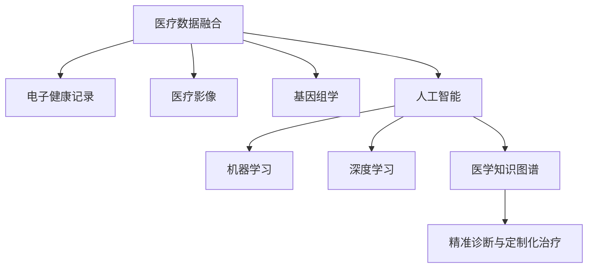

                 

# 未来的个性化医疗：2050年的精准诊断与定制化治疗

> 关键词：个性化医疗,精准诊断,定制化治疗,医疗数据,人工智能,机器学习,深度学习,医疗影像,基因组学,电子健康记录,算法优化,医疗决策

## 1. 背景介绍

### 1.1 问题由来

随着科技的进步，人类对医疗健康的需求日益增长。从过去的小病小痛需要排队等待，到如今复杂疾病的精准治疗，医疗技术的发展为人类健康带来了巨大的进步。但同时，传统医疗模式也面临着诸多挑战。随着人口老龄化、生活方式改变等问题的出现，个性化医疗成为了医疗领域的重要发展方向。

个性化医疗，即根据患者个体差异，提供个性化的诊疗方案。它不仅关注疾病本身，更关注患者的个体需求和生活习惯。个性化医疗不仅提高了诊疗的准确性和效果，还极大地改善了患者的治疗体验，提高了医疗资源的利用效率。

在2050年，随着技术的进一步发展，个性化医疗将进入一个全新的时代。利用先进的医疗数据技术、人工智能和机器学习算法，医疗系统能够更加精准地进行诊断和治疗，为患者提供更为个性化的健康方案。

### 1.2 问题核心关键点

实现个性化医疗的核心在于以下几个关键点：

- **医疗数据融合与分析**：收集、整合来自各种医疗设备和系统的数据，如电子健康记录、医疗影像、基因组数据等，通过数据融合与分析技术，挖掘出患者的潜在健康风险和疾病特征。
- **人工智能与机器学习**：利用深度学习、强化学习等先进算法，提高诊疗的精度和效率，预测疾病的发展趋势，提供个性化的治疗方案。
- **医学知识图谱**：构建医学知识图谱，将医学领域的知识进行结构化表示，为算法提供更多的先验知识支持。
- **精准诊断与定制化治疗**：利用先进的数据分析和机器学习算法，结合医学知识图谱，为患者提供精准的诊断结果和定制化的治疗方案。

这些关键点构成了未来个性化医疗的核心技术架构，使个性化医疗成为可能。

## 2. 核心概念与联系

### 2.1 核心概念概述

为了更好地理解未来个性化医疗的实现机制，本节将介绍几个密切相关的核心概念：

- **医疗数据融合**：将来自不同设备和系统的医疗数据进行整合，消除数据孤岛，形成一个完整的医疗数据体系。
- **电子健康记录**：记录患者的健康状况、疾病历史、治疗记录等信息，是医疗数据融合的重要组成部分。
- **医疗影像**：包括CT、MRI、X光等影像数据，是医疗诊断的重要依据之一。
- **基因组学**：通过分析患者的基因信息，预测其患病风险和治疗效果。
- **人工智能(AI)**：利用机器学习算法，在医疗领域进行疾病预测、诊断、治疗等任务。
- **机器学习(ML)**：包括监督学习、无监督学习和强化学习等，是AI的重要组成部分。
- **深度学习(DL)**：一种特殊的机器学习算法，适用于处理复杂的数据结构，如图像、语音、文本等。
- **医学知识图谱**：将医学领域的知识进行结构化表示，形成可查询、可推理的知识库。

这些概念之间的逻辑关系可以通过以下Mermaid流程图来展示：



这个流程图展示了大数据、人工智能、医学知识图谱和个性化医疗之间的关系：

1. 医疗数据融合是其他技术应用的基础。
2. 电子健康记录、医疗影像、基因组学等数据，通过融合与分析，形成患者的健康档案。
3. 人工智能和机器学习算法，对健康档案进行分析，提供个性化的诊疗方案。
4. 医学知识图谱为算法提供知识支持，提高诊疗的准确性和效率。
5. 精准诊断与定制化治疗，是最终的目标，是人工智能与医学知识图谱在实际应用中的体现。

## 3. 核心算法原理 & 具体操作步骤
### 3.1 算法原理概述

未来个性化医疗的实现，依赖于医疗数据融合、人工智能和机器学习算法。其核心思想是：

1. **数据融合与预处理**：将电子健康记录、医疗影像、基因组学等数据进行整合和预处理，形成一个完整的医疗数据体系。
2. **特征提取与选择**：利用机器学习算法，对数据进行特征提取和选择，挖掘出患者的潜在健康风险和疾病特征。
3. **模型训练与优化**：利用深度学习等算法，对患者数据进行训练，构建精准诊断和治疗模型。
4. **个性化诊疗方案生成**：结合医学知识图谱，生成个性化的诊疗方案。

### 3.2 算法步骤详解

基于上述核心思想，未来个性化医疗的算法步骤可以概括为以下几步：

**Step 1: 数据采集与融合**
- 收集患者的历史病历、电子健康记录、基因组数据、医疗影像等数据。
- 使用数据融合技术，将不同来源的数据进行整合，消除数据孤岛，形成一个完整的医疗数据体系。

**Step 2: 数据预处理与特征提取**
- 对收集到的数据进行预处理，如数据清洗、去噪等。
- 利用机器学习算法，如随机森林、支持向量机等，对数据进行特征提取和选择，提取出反映患者健康状况的关键特征。

**Step 3: 模型训练与优化**
- 利用深度学习算法，如卷积神经网络(CNN)、循环神经网络(RNN)等，对患者数据进行训练，构建精准诊断和治疗模型。
- 使用优化算法，如Adam、SGD等，对模型进行优化，提高模型的预测精度和鲁棒性。

**Step 4: 生成个性化诊疗方案**
- 结合医学知识图谱，利用模型对患者进行诊断，预测其健康状况和患病风险。
- 根据患者的病情和基因信息，生成个性化的诊疗方案，包括药物选择、治疗方案、生活习惯建议等。

**Step 5: 实时监控与反馈**
- 对患者进行实时监控，收集治疗效果和反馈信息。
- 利用反馈信息，不断调整和优化诊疗方案，提高治疗效果。

### 3.3 算法优缺点

未来个性化医疗的算法具有以下优点：

1. **精度高**：利用深度学习和大数据技术，可以有效提高诊断和治疗的精度。
2. **效率高**：通过数据融合与预处理，可以有效降低诊疗的时间成本。
3. **个性化**：结合医学知识图谱，为每个患者提供个性化的诊疗方案。

但同时，也存在以下缺点：

1. **数据隐私问题**：医疗数据的收集和融合，涉及到患者隐私问题，需要采取严格的数据保护措施。
2. **数据质量和噪声**：医疗数据的采集和处理过程中，可能会引入噪声和不准确的数据，影响模型的性能。
3. **算法复杂度高**：深度学习和机器学习算法，计算复杂度高，需要高性能计算资源支持。

### 3.4 算法应用领域

未来个性化医疗的算法在以下领域具有广泛的应用前景：

- **精准诊断**：利用深度学习和医学知识图谱，提供精准的疾病诊断，如癌症、心血管疾病等。
- **定制化治疗**：根据患者的基因信息和病情，提供个性化的治疗方案，如靶向药物、基因疗法等。
- **健康管理**：结合电子健康记录和生活习惯数据，提供个性化的健康管理方案，如饮食、运动等。
- **远程医疗**：通过互联网技术，提供远程医疗服务，提高医疗资源的可及性。
- **个性化康复**：根据患者的康复需求和病情，提供个性化的康复方案，如物理治疗、心理辅导等。

## 4. 数学模型和公式 & 详细讲解 & 举例说明

### 4.1 数学模型构建

在未来个性化医疗的实现过程中，需要构建多个数学模型。这里以深度学习模型为例，介绍其构建过程。

假设有一个深度学习模型，用于预测患者的患病风险，其数学模型为：

$$
y = W\cdot x + b
$$

其中 $x$ 为输入特征向量，$y$ 为预测结果，$W$ 为权重矩阵，$b$ 为偏置向量。

### 4.2 公式推导过程

以二分类问题为例，利用逻辑回归模型进行病情预测的公式推导如下：

假设模型接收一个特征向量 $x$，预测其患病概率 $p(y=1|x)$ 为：

$$
p(y=1|x) = \sigma(W\cdot x + b)
$$

其中 $\sigma$ 为sigmoid函数，用于将线性输出映射到 $(0,1)$ 区间内，表示预测结果的概率。

将上式带入交叉熵损失函数：

$$
L = -\frac{1}{N} \sum_{i=1}^N [y_i\log p(y_i|x_i) + (1-y_i)\log(1-p(y_i|x_i))]
$$

其中 $y_i$ 为真实标签，$N$ 为样本数。

### 4.3 案例分析与讲解

以预测患者患癌症的风险为例，假设有一个深度学习模型 $M_{\theta}$，其特征输入为患者的年龄、性别、家族病史、生活习惯等，输出为患癌症的概率。

模型训练数据集为 $D=\{(x_i,y_i)\}_{i=1}^N$，其中 $x_i$ 为患者的特征向量，$y_i$ 为患病标签。模型训练的目标是最小化交叉熵损失函数：

$$
\theta^* = \mathop{\arg\min}_{\theta} \mathcal{L}(\theta, D)
$$

其中 $\mathcal{L}$ 为交叉熵损失函数。

通过梯度下降等优化算法，对模型进行训练，最终得到最优参数 $\theta^*$。将训练好的模型应用到新患者的特征向量上，可以预测其患病的概率。

## 5. 项目实践：代码实例和详细解释说明
### 5.1 开发环境搭建

在进行个性化医疗项目开发前，需要先准备好开发环境。以下是使用Python进行TensorFlow开发的环境配置流程：

1. 安装Anaconda：从官网下载并安装Anaconda，用于创建独立的Python环境。

2. 创建并激活虚拟环境：
```bash
conda create -n tf-env python=3.8 
conda activate tf-env
```

3. 安装TensorFlow：根据CUDA版本，从官网获取对应的安装命令。例如：
```bash
conda install tensorflow -c pytorch -c conda-forge
```

4. 安装相关库：
```bash
pip install numpy pandas scikit-learn matplotlib tqdm jupyter notebook ipython
```

完成上述步骤后，即可在`tf-env`环境中开始开发。

### 5.2 源代码详细实现

以下是利用TensorFlow实现癌症风险预测的代码示例：

```python
import tensorflow as tf
from tensorflow.keras import layers

# 定义模型
model = tf.keras.Sequential([
    layers.Dense(64, activation='relu', input_shape=(4,)),
    layers.Dense(64, activation='relu'),
    layers.Dense(1, activation='sigmoid')
])

# 定义损失函数
loss_fn = tf.keras.losses.BinaryCrossentropy()

# 定义优化器
optimizer = tf.keras.optimizers.Adam()

# 定义训练数据集
train_dataset = tf.data.Dataset.from_tensor_slices((train_features, train_labels))
train_dataset = train_dataset.shuffle(1024).batch(64)

# 定义验证数据集
val_dataset = tf.data.Dataset.from_tensor_slices((val_features, val_labels))
val_dataset = val_dataset.batch(64)

# 训练模型
model.compile(optimizer=optimizer, loss=loss_fn, metrics=['accuracy'])
model.fit(train_dataset, validation_data=val_dataset, epochs=10, batch_size=64)

# 使用模型进行预测
test_dataset = tf.data.Dataset.from_tensor_slices((test_features,))
test_dataset = test_dataset.batch(64)
predictions = model.predict(test_dataset)
```

以上代码实现了一个简单的二分类模型，用于预测患者的患癌风险。模型使用64个神经元的两层全连接网络，激活函数为ReLU和sigmoid，适用于二分类问题。

### 5.3 代码解读与分析

以下是关键代码的实现细节：

**Sequential模型定义**：
```python
model = tf.keras.Sequential([
    layers.Dense(64, activation='relu', input_shape=(4,)),
    layers.Dense(64, activation='relu'),
    layers.Dense(1, activation='sigmoid')
])
```
定义了一个包含三层全连接网络的序列模型，第一层64个神经元，使用ReLU激活函数，输入维度为4；第二层64个神经元，使用ReLU激活函数；第三层1个神经元，使用sigmoid激活函数，输出概率。

**损失函数定义**：
```python
loss_fn = tf.keras.losses.BinaryCrossentropy()
```
定义了二分类问题的交叉熵损失函数。

**优化器定义**：
```python
optimizer = tf.keras.optimizers.Adam()
```
定义了Adam优化器，用于模型参数的更新。

**训练数据集准备**：
```python
train_dataset = tf.data.Dataset.from_tensor_slices((train_features, train_labels))
train_dataset = train_dataset.shuffle(1024).batch(64)
```
使用TensorFlow的Dataset API，将训练数据集转换为可迭代的数据集，并进行打乱和批处理，提高训练效率。

**模型编译与训练**：
```python
model.compile(optimizer=optimizer, loss=loss_fn, metrics=['accuracy'])
model.fit(train_dataset, validation_data=val_dataset, epochs=10, batch_size=64)
```
将模型编译，指定优化器和损失函数，并使用训练数据集进行模型训练，同时验证数据集进行验证。

**模型预测**：
```python
test_dataset = tf.data.Dataset.from_tensor_slices((test_features,))
test_dataset = test_dataset.batch(64)
predictions = model.predict(test_dataset)
```
使用模型对测试集进行预测，并将预测结果输出。

## 6. 实际应用场景

### 6.1 精准诊断

在未来个性化医疗中，精准诊断是实现个性化治疗的基础。利用深度学习和大数据技术，可以有效提高诊断的精度和效率。

在肿瘤诊断领域，通过收集患者的电子健康记录、基因组数据和影像数据，构建深度学习模型，可以对患者的肿瘤风险进行精准预测。具体而言，可以利用卷积神经网络(CNN)和循环神经网络(RNN)等算法，对患者的影像数据进行分析，提取肿瘤特征，预测其发展趋势。

**案例分析**：假设有一个深度学习模型 $M_{\theta}$，用于预测乳腺癌的患病概率。模型输入为患者的乳腺影像数据，输出为患乳腺癌的概率。

模型训练数据集为 $D=\{(x_i,y_i)\}_{i=1}^N$，其中 $x_i$ 为患者的影像数据，$y_i$ 为患病标签。模型训练的目标是最小化交叉熵损失函数：

$$
\theta^* = \mathop{\arg\min}_{\theta} \mathcal{L}(\theta, D)
$$

其中 $\mathcal{L}$ 为交叉熵损失函数。

通过梯度下降等优化算法，对模型进行训练，最终得到最优参数 $\theta^*$。将训练好的模型应用到新患者的影像数据上，可以预测其患乳腺癌的概率。

### 6.2 定制化治疗

在未来个性化医疗中，定制化治疗是实现个性化医疗的核心。利用深度学习和医学知识图谱，可以为每个患者提供个性化的治疗方案。

在癌症治疗领域，利用深度学习模型，可以对患者的基因信息进行分析，预测其对不同药物的敏感性，从而制定个性化的治疗方案。具体而言，可以利用卷积神经网络(CNN)和循环神经网络(RNN)等算法，对患者的基因数据进行分析，提取基因特征，预测其对不同药物的敏感性。

**案例分析**：假设有一个深度学习模型 $M_{\theta}$，用于预测患者对某种药物的敏感性。模型输入为患者的基因数据，输出为药物敏感性标签。

模型训练数据集为 $D=\{(x_i,y_i)\}_{i=1}^N$，其中 $x_i$ 为患者的基因数据，$y_i$ 为药物敏感性标签。模型训练的目标是最小化交叉熵损失函数：

$$
\theta^* = \mathop{\arg\min}_{\theta} \mathcal{L}(\theta, D)
$$

其中 $\mathcal{L}$ 为交叉熵损失函数。

通过梯度下降等优化算法，对模型进行训练，最终得到最优参数 $\theta^*$。将训练好的模型应用到新患者的基因数据上，可以预测其对某种药物的敏感性，从而制定个性化的治疗方案。

### 6.3 健康管理

在未来个性化医疗中，健康管理是实现个性化医疗的重要手段。利用深度学习和医学知识图谱，可以为患者提供个性化的健康管理方案。

在慢性病管理领域，利用深度学习模型，可以对患者的健康状况进行监测，提供个性化的健康建议。具体而言，可以利用卷积神经网络(CNN)和循环神经网络(RNN)等算法，对患者的健康记录进行分析，提取健康特征，预测其健康趋势。

**案例分析**：假设有一个深度学习模型 $M_{\theta}$，用于预测患者患糖尿病的风险。模型输入为患者的健康记录数据，输出为患糖尿病风险的概率。

模型训练数据集为 $D=\{(x_i,y_i)\}_{i=1}^N$，其中 $x_i$ 为患者的健康记录数据，$y_i$ 为患病风险标签。模型训练的目标是最小化交叉熵损失函数：

$$
\theta^* = \mathop{\arg\min}_{\theta} \mathcal{L}(\theta, D)
$$

其中 $\mathcal{L}$ 为交叉熵损失函数。

通过梯度下降等优化算法，对模型进行训练，最终得到最优参数 $\theta^*$。将训练好的模型应用到新患者的健康记录数据上，可以预测其患糖尿病的风险，从而提供个性化的健康管理建议。

### 6.4 未来应用展望

在未来，随着技术的进一步发展，个性化医疗将进入一个全新的时代。以下是未来个性化医疗可能的发展方向：

1. **多模态数据融合**：将电子健康记录、医疗影像、基因组学等数据进行融合，形成一个完整的医疗数据体系。通过多模态数据融合，可以有效提高诊断和治疗的精度。
2. **实时监控与反馈**：对患者进行实时监控，收集治疗效果和反馈信息。利用反馈信息，不断调整和优化诊疗方案，提高治疗效果。
3. **个性化康复方案**：根据患者的康复需求和病情，提供个性化的康复方案，如物理治疗、心理辅导等。
4. **远程医疗服务**：通过互联网技术，提供远程医疗服务，提高医疗资源的可及性。
5. **医学知识图谱更新**：随着医学知识的不断更新，医学知识图谱需要不断更新，以提供最新的医学知识支持。

## 7. 工具和资源推荐
### 7.1 学习资源推荐

为了帮助开发者系统掌握个性化医疗的理论基础和实践技巧，这里推荐一些优质的学习资源：

1. Coursera《Deep Learning for Healthcare》课程：由斯坦福大学开设的NLP明星课程，涵盖深度学习在医疗领域的多种应用，包括医疗影像、电子健康记录等。
2. Kaggle《Medical Imaging》比赛：通过参加Kaggle的医疗影像比赛，积累实际应用经验，锻炼数据处理和模型训练能力。
3. ArXiv上最新论文：阅读最新的深度学习在医疗领域的研究论文，了解最新的研究方向和技术进展。

### 7.2 开发工具推荐

高效的开发离不开优秀的工具支持。以下是几款用于个性化医疗开发的常用工具：

1. TensorFlow：由Google主导开发的开源深度学习框架，生产部署方便，适合大规模工程应用。
2. PyTorch：基于Python的开源深度学习框架，灵活性高，适合快速迭代研究。
3. Scikit-learn：开源的机器学习库，提供丰富的算法和工具，适用于数据处理和模型训练。
4. Keras：高级神经网络API，可以方便地构建深度学习模型，适合初学者和快速开发。

### 7.3 相关论文推荐

个性化医疗的发展离不开学界的持续研究。以下是几篇奠基性的相关论文，推荐阅读：

1. Deep Neural Network for Detecting Early-Stage Breast Cancer from Digital Mammograms（卷积神经网络检测早期乳腺癌）：提出卷积神经网络在医疗影像中的应用，取得了显著的成果。
2. Genomic Data Assisted Radiomic Features for Prostate Cancer Diagnosis（基因组数据辅助的放射学特征用于前列腺癌诊断）：提出将基因组数据和放射学数据结合，提高诊断精度。
3. Patient-Level Predictive Analytics for Hospital-Readmission Risk Using Electronic Health Records（利用电子健康记录预测患者再入院风险）：提出利用深度学习模型进行电子健康记录分析，预测患者的再入院风险。

## 8. 总结：未来发展趋势与挑战

### 8.1 研究成果总结

本文对未来个性化医疗的实现机制进行了全面系统的介绍。首先阐述了个性化医疗的研究背景和意义，明确了数据融合、人工智能和医学知识图谱等关键技术的重要性。其次，从原理到实践，详细讲解了个性化医疗的数学模型和算法步骤，给出了代码实例，展示了实际应用场景。

通过本文的系统梳理，可以看到，未来个性化医疗将通过深度学习、医学知识图谱等技术，实现精准诊断和定制化治疗。这一领域的突破，将极大地提升医疗服务的智能化水平，为患者提供更为个性化的健康方案。

### 8.2 未来发展趋势

展望未来，个性化医疗将进入一个全新的时代。以下是未来个性化医疗可能的发展方向：

1. **多模态数据融合**：将电子健康记录、医疗影像、基因组学等数据进行融合，形成一个完整的医疗数据体系。通过多模态数据融合，可以有效提高诊断和治疗的精度。
2. **实时监控与反馈**：对患者进行实时监控，收集治疗效果和反馈信息。利用反馈信息，不断调整和优化诊疗方案，提高治疗效果。
3. **个性化康复方案**：根据患者的康复需求和病情，提供个性化的康复方案，如物理治疗、心理辅导等。
4. **远程医疗服务**：通过互联网技术，提供远程医疗服务，提高医疗资源的可及性。
5. **医学知识图谱更新**：随着医学知识的不断更新，医学知识图谱需要不断更新，以提供最新的医学知识支持。

### 8.3 面临的挑战

尽管个性化医疗的实现前景广阔，但在迈向更加智能化、普适化应用的过程中，它仍面临着诸多挑战：

1. **数据隐私问题**：医疗数据的收集和融合，涉及到患者隐私问题，需要采取严格的数据保护措施。
2. **数据质量和噪声**：医疗数据的采集和处理过程中，可能会引入噪声和不准确的数据，影响模型的性能。
3. **算法复杂度高**：深度学习和机器学习算法，计算复杂度高，需要高性能计算资源支持。
4. **模型可解释性**：现有深度学习模型的决策过程通常缺乏可解释性，难以对其推理逻辑进行分析和调试。
5. **伦理与安全**：个性化医疗涉及患者隐私和数据安全，需要建立严格的伦理和法律框架，保障患者权益。

### 8.4 研究展望

面对个性化医疗所面临的种种挑战，未来的研究需要在以下几个方面寻求新的突破：

1. **数据隐私保护**：探索新的数据隐私保护技术，如联邦学习、差分隐私等，保护患者隐私。
2. **数据质量提升**：通过数据清洗和去噪技术，提高医疗数据的准确性和可靠性。
3. **算法优化**：开发更加高效和轻量级的深度学习算法，减少计算资源消耗。
4. **模型可解释性**：引入可解释性技术，如LIME、SHAP等，提高深度学习模型的可解释性。
5. **伦理与安全框架**：建立严格的伦理和法律框架，保障个性化医疗的规范和安全。

通过这些研究方向和突破，将有助于个性化医疗技术的进一步发展和应用，为患者提供更加精准、安全的医疗服务。

## 9. 附录：常见问题与解答

**Q1：个性化医疗的数据隐私问题如何解决？**

A: 个性化医疗的数据隐私问题可以通过以下方式解决：

1. 数据去标识化：在数据收集和处理过程中，对患者的个人信息进行去标识化处理，保护患者的隐私。
2. 联邦学习：通过分布式训练技术，将数据分布存储在多个节点上，而不是集中存储，防止数据泄露。
3. 差分隐私：在数据处理和分析过程中，引入噪声，使得攻击者无法通过数据分析推测出个体信息。

**Q2：如何提高个性化医疗的算法效率？**

A: 提高个性化医疗的算法效率可以通过以下方式：

1. 模型压缩与剪枝：使用模型压缩和剪枝技术，减少模型参数量和计算量，提高模型运行效率。
2. 量化技术：将浮点数模型转为定点模型，压缩存储空间，提高计算效率。
3. 分布式计算：使用分布式计算技术，将计算任务分配到多个节点上，提高计算效率。
4. 数据增量更新：通过增量更新技术，减少模型更新时间和计算资源消耗。

**Q3：个性化医疗的伦理与安全问题如何解决？**

A: 个性化医疗的伦理与安全问题可以通过以下方式解决：

1. 数据保护法规：制定严格的数据保护法规，保障患者隐私和数据安全。
2. 伦理审查机制：建立伦理审查机制，对个性化医疗项目进行伦理审查和监督。
3. 公开透明：公开透明化个性化医疗项目的数据来源和算法过程，接受公众监督。
4. 安全防护技术：引入安全防护技术，如加密传输、访问控制等，保障数据安全。

通过以上方式，可以最大限度地保障个性化医疗的规范和安全，为患者提供更加可靠和安全的医疗服务。

---

作者：禅与计算机程序设计艺术 / Zen and the Art of Computer Programming

