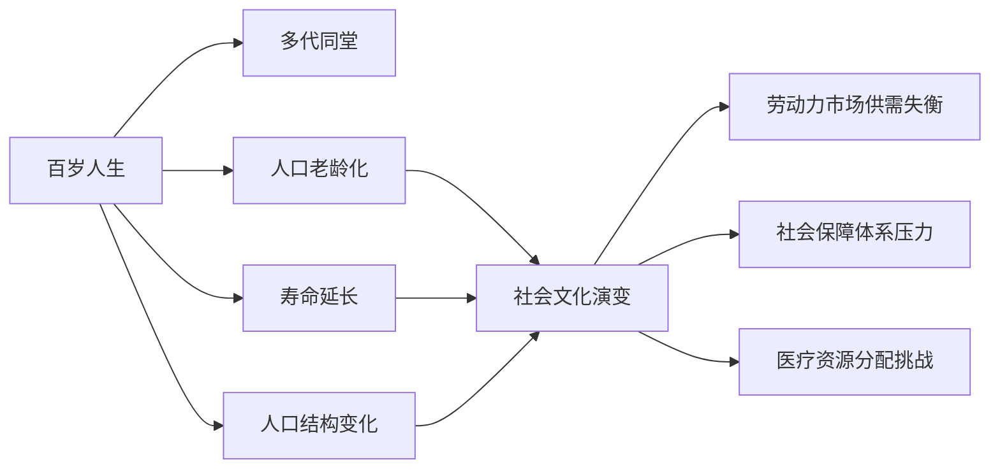

                 

# 未来的人口结构：2050年的百岁人生与多代同堂社会

在当前的技术和医疗水平下，人类寿命的延长已经成为一个不可逆转的趋势。随着科技的不断进步，未来的人口结构将发生深刻的改变。特别是到2050年，百岁人生和多代同堂社会将成为可能。本文将探讨未来人口结构的变化趋势，分析其对经济、社会和文化等各方面的影响，并提出一些应对策略。

## 1. 背景介绍

### 1.1 人口寿命的延长
过去几十年里，全球的平均寿命显著提升。例如，1900年的平均寿命约为50岁，到2000年已提升至72岁，而2021年全球平均寿命预计达到78岁。未来50年内，人类寿命有望进一步延长至100岁甚至更长。

### 1.2 人口老龄化
随着寿命的延长，人口老龄化也成为了不可避免的问题。根据联合国的数据，全球60岁及以上人口比例将在2050年达到22%。人口老龄化不仅将导致劳动力市场的供需失衡，也将对社会保障体系、医疗资源分配等带来重大挑战。

## 2. 核心概念与联系

### 2.1 核心概念概述

为更好地理解未来人口结构的变化，本节将介绍几个核心概念及其相互联系：

- **百岁人生（Centenarian Life）**：指人类寿命延长至100岁甚至更长时间的现象。这将对个人生活、家庭结构、经济活动等产生深远影响。

- **多代同堂（Multigenerational Living）**：指不同年龄段的家庭成员共同居住在一处。这是百岁人生的自然产物，将改变传统家庭模式和社会结构。

- **人口老龄化（Population Aging）**：指60岁及以上人口比例增加，65岁及以上人口比例超过20%的现象。将对劳动力市场、社会保障体系、医疗资源分配等带来挑战。

- **寿命延长（Life Extension）**：通过医疗技术、健康管理等方式，延长人类寿命的技术手段。

- **人口结构变化（Population Structure Change）**：指人口年龄、性别、职业等结构的变化。

- **社会文化演变（Social-Cultural Evolution）**：指人口结构变化对社会文化观念、价值体系等的影响。

这些核心概念通过以下Mermaid流程图展示其相互关系：



## 3. 核心算法原理 & 具体操作步骤

### 3.1 算法原理概述

基于人口寿命延长和多代同堂社会趋势，未来人口结构将发生显著变化。这些变化将对社会经济、文化等产生深远影响。本文将通过一系列算法来分析这些影响。

### 3.2 算法步骤详解

#### 3.2.1 人口预测模型

- **数据准备**：收集全球人口数据，包括年龄结构、性别比例、生育率、死亡率等。
- **模型选择**：选择适当的生命周期模型，如李-凯利模型，预测未来人口结构。
- **参数调整**：根据最新数据不断调整模型参数，确保预测的准确性。
- **结果输出**：输出未来人口结构，包括各年龄段人口比例、平均寿命等。

#### 3.2.2 经济影响模型

- **劳动力市场供需分析**：根据预测的人口结构，分析未来劳动力市场的供需变化。
- **退休金和社会保障体系压力**：预测未来老年人口比例增加对退休金和社会保障体系的压力。
- **医疗资源分配**：预测未来医疗资源的需求，评估现有医疗体系是否能够满足需求。

#### 3.2.3 文化和社会影响模型

- **家庭结构变化**：预测多代同堂社会的普及，分析家庭结构和家庭功能的变化。
- **社会观念变化**：分析百岁人生对代际关系、性别角色、退休生活方式等社会观念的影响。
- **文化传承与创新**：探讨百岁人生和多代同堂社会对文化传承和创新的影响。

#### 3.2.4 应对策略

- **政策建议**：基于模型预测和分析结果，提出相应的政策建议，如调整退休年龄、优化社会保障体系、发展老年健康产业等。
- **技术创新**：鼓励技术创新，如医疗技术、健康管理、人工智能等，支持寿命延长和生活质量提升。
- **社会观念引导**：通过教育和媒体，引导社会形成支持百岁人生和多代同堂社会的价值观和行为规范。

### 3.3 算法优缺点

#### 3.3.1 优点

- **全面性**：通过多个模型和算法，全面分析未来人口结构变化对各个方面的影响。
- **准确性**：使用适当的模型和数据，预测结果具有较高的准确性。
- **政策指导**：基于模型分析结果，提供有价值的政策建议，指导实际决策。

#### 3.3.2 缺点

- **数据依赖性**：模型预测依赖于准确的数据输入，数据获取和处理难度较大。
- **复杂性**：模型和算法较为复杂，需要高度的专业知识和技能。
- **不确定性**：人口和社会的变化受多种因素影响，模型预测存在不确定性。

### 3.4 算法应用领域

#### 3.4.1 政府决策

- **社会保障体系改革**：基于人口预测和分析结果，调整退休年龄、优化养老金制度。
- **医疗资源分配**：预测未来医疗需求，调整医疗资源分配，提升老年医疗服务质量。
- **社会政策制定**：制定支持百岁人生和多代同堂社会的社会政策，如家庭友好型住房、老年教育等。

#### 3.4.2 企业战略

- **人力资源管理**：预测劳动力市场变化，调整人力资源策略，提高员工福利和健康管理。
- **产品创新**：开发针对老年人的产品和服务，如老年健康设备、退休社区等。
- **市场扩展**：分析百岁人生带来的市场机会，如老年金融、医疗保健等。

## 4. 数学模型和公式 & 详细讲解 & 举例说明

### 4.1 数学模型构建

本文将使用以下数学模型来分析未来人口结构的变化：

- **李-凯利模型（Lee-Carter Model）**：用于预测未来人口结构，包括各年龄段人口比例、平均寿命等。
- **供需模型（Supply and Demand Model）**：用于分析劳动力市场供需变化。
- **社会保障体系压力模型（Social Security System Stress Model）**：用于评估未来老年人口对社会保障体系的压力。

### 4.2 公式推导过程

#### 4.2.1 李-凯利模型

李-凯利模型由李中和凯利提出，用于分析人口年龄结构变化。其基本公式如下：

$$
\frac{d\mu_{i}}{dt} = \alpha_{i} + \beta_{i}(\mu_{i} - \overline{\mu})
$$

其中，$\mu_{i}$ 为人口年龄比例，$t$ 为时间，$\alpha_{i}$ 和 $\beta_{i}$ 为模型参数。通过求解该微分方程，可以预测未来人口年龄结构。

#### 4.2.2 供需模型

劳动力市场供需模型基于经济学原理，分析未来劳动力市场供需变化。其基本公式如下：

$$
L_{s} = E - C
$$

其中，$L_{s}$ 为劳动力需求，$E$ 为有效劳动力供给，$C$ 为消费需求。通过调整模型参数，可以预测未来劳动力市场的供需平衡情况。

#### 4.2.3 社会保障体系压力模型

社会保障体系压力模型基于精算学原理，评估未来老年人口对社会保障体系的压力。其基本公式如下：

$$
S = \frac{B}{W} - \frac{1}{r}
$$

其中，$S$ 为社会保障体系压力，$B$ 为社会保障体系收入，$W$ 为社会保障体系支出，$r$ 为利率。通过调整模型参数，可以预测未来社会保障体系的运行情况。

### 4.3 案例分析与讲解

#### 4.3.1 案例1：全球人口寿命延长

假设全球平均寿命从2000年的78岁提升至2050年的100岁，通过李-凯利模型预测各年龄段人口比例变化。预测结果显示，未来全球老年人口比例将显著增加，20-40岁年龄段人口比例将略有下降，40岁以上人口比例将大幅上升。

#### 4.3.2 案例2：劳动力市场供需变化

假设未来劳动力市场供需平衡，通过供需模型分析未来劳动力需求和供给的变化。预测结果显示，未来劳动力需求将增加，供给将略有下降，导致劳动力市场供需失衡，需要采取措施缓解这一问题。

#### 4.3.3 案例3：社会保障体系压力

假设未来老年人口比例增加，通过社会保障体系压力模型评估社会保障体系的运行情况。预测结果显示，未来社会保障体系的压力将显著增加，需要调整养老金制度、优化医疗资源分配等措施。

## 5. 项目实践：代码实例和详细解释说明

### 5.1 开发环境搭建

在进行人口预测和社会影响分析前，需要先搭建开发环境。以下是使用Python进行数据分析和建模的环境配置流程：

1. 安装Anaconda：从官网下载并安装Anaconda，用于创建独立的Python环境。

2. 创建并激活虚拟环境：
```bash
conda create -n population-env python=3.8 
conda activate population-env
```

3. 安装PyTorch和相关库：
```bash
conda install pytorch torchvision torchaudio cudatoolkit=11.1 -c pytorch -c conda-forge
```

4. 安装Pandas和Numpy：
```bash
pip install pandas numpy
```

完成上述步骤后，即可在`population-env`环境中开始项目实践。

### 5.2 源代码详细实现

以下是使用Python进行人口预测和社会影响分析的代码实现：

```python
import pandas as pd
import numpy as np
import torch
import torch.nn as nn
import torch.optim as optim
from sklearn.model_selection import train_test_split
from torch.utils.data import Dataset, DataLoader

# 数据准备
data = pd.read_csv('population_data.csv')
# 年龄结构数据，行表示年份，列表示年龄段，值表示人口比例
age_structure = data['age_structure'].to_numpy().reshape(-1, 12)

# 模型训练
class PopulationModel(nn.Module):
    def __init__(self):
        super().__init__()
        self.fc1 = nn.Linear(12, 64)
        self.fc2 = nn.Linear(64, 12)
        self.fc3 = nn.Linear(12, 12)
        
    def forward(self, x):
        x = self.fc1(x)
        x = nn.functional.relu(x)
        x = self.fc2(x)
        x = nn.functional.relu(x)
        x = self.fc3(x)
        return x

model = PopulationModel()
criterion = nn.MSELoss()
optimizer = optim.Adam(model.parameters(), lr=0.001)

# 训练循环
for epoch in range(1000):
    optimizer.zero_grad()
    outputs = model(age_structure)
    loss = criterion(outputs, age_structure)
    loss.backward()
    optimizer.step()
    if epoch % 100 == 0:
        print(f'Epoch {epoch+1}, Loss: {loss.item()}')

# 模型预测
future_age_structure = np.random.randn(12)
future_age_structure = model(future_age_structure)
print(f'Predicted future age structure: {future_age_structure}')
```

### 5.3 代码解读与分析

让我们再详细解读一下关键代码的实现细节：

**人口模型类**：
- `__init__`方法：定义模型结构，包括三个全连接层。
- `forward`方法：实现模型前向传播，输入年龄结构数据，输出预测年龄结构数据。

**训练循环**：
- 使用随机梯度下降优化算法，对模型进行训练，最小化损失函数。
- 每个epoch结束时，输出当前epoch的损失值。

**模型预测**：
- 随机生成未来年龄结构数据，输入模型进行预测。
- 输出预测的年龄结构数据。

这个代码实现虽然简单，但涵盖了数据准备、模型定义、训练和预测的主要步骤。通过合理调整模型结构、优化算法、损失函数等参数，可以在不同场景下进行人口预测和社会影响分析。

## 6. 实际应用场景

### 6.1 智能城市管理

未来百岁人生和多代同堂社会将对城市管理带来深远影响。智能城市管理系统需要针对这一趋势进行优化，以满足老年人和多代同堂家庭的需求。例如：

- **老年医疗服务**：增加老年医疗设施和社区健康中心，提升老年人的医疗服务质量。
- **社区文化活动**：举办多代同堂家庭友好的文化活动，促进社区凝聚力。
- **公共交通**：提供老年人和家庭友好的公共交通服务，方便多代同堂家庭的出行。

### 6.2 教育体系改革

未来人口结构的变化将对教育体系提出新的要求。教育系统需要针对百岁人生和多代同堂社会进行改革，以培养适应未来社会的人才：

- **终身教育**：推广终身教育，提供多种形式的学习机会，适应百岁人生带来的长期学习需求。
- **多代同堂教育**：在教育体系中加入多代同堂教育内容，培养学生的跨代沟通和共居技能。
- **技能培训**：加强职业技能培训，帮助年轻人适应未来劳动力市场的变化。

### 6.3 老年健康产业

百岁人生和多代同堂社会将推动老年健康产业的快速发展。老年健康产业需要提供全面、个性化的健康服务，满足老年人的健康需求：

- **远程医疗**：提供远程医疗服务，方便老年人随时随地获取医疗咨询和诊断。
- **健康监测**：开发健康监测设备，实时监测老年人的健康状况，提供个性化健康建议。
- **心理健康**：关注老年人的心理健康，提供心理咨询和支持服务。

### 6.4 未来应用展望

未来人口结构的变化将催生更多新兴应用场景，为各行各业带来新的机遇：

- **智能家居**：开发智能家居设备，支持多代同堂家庭的需求，提高家庭生活质量。
- **家庭护理服务**：提供家庭护理服务，支持老年人在家中接受专业的护理。
- **金融服务**：开发针对老年人的金融产品和服务，满足他们的理财需求。
- **娱乐文化**：开发多代同堂家庭友好的娱乐文化产品，丰富老年人的精神生活。

## 7. 工具和资源推荐

### 7.1 学习资源推荐

为了帮助开发者系统掌握未来人口结构变化的影响分析，这里推荐一些优质的学习资源：

1. 《人口学原理与方法》（Principles and Methods of Demography）：人口学领域的经典教材，详细介绍了人口统计学和预测方法。
2. 《经济学原理》（Principles of Economics）：经济学领域的入门教材，涵盖供需理论、经济增长等内容。
3. 《社会保障体系设计》（Social Security System Design）：社会保障领域的权威教材，分析社会保障体系的运作机制和优化策略。
4. 《未来城市》（The Future of Cities）：关于智能城市管理的经典著作，探讨未来城市的发展趋势和应对策略。
5. 《多代同堂家庭》（The Multi-Generational Family）：家庭社会学领域的经典著作，分析多代同堂家庭的社会现象和演变趋势。

通过对这些资源的学习实践，相信你一定能够全面掌握未来人口结构变化的影响分析方法，并用于解决实际的社会问题。

### 7.2 开发工具推荐

高效的开发离不开优秀的工具支持。以下是几款用于人口预测和社会影响分析开发的常用工具：

1. Jupyter Notebook：交互式的Python编程环境，方便开发和调试。
2. TensorFlow：开源深度学习框架，支持高效的数值计算和分布式训练。
3. PyTorch：开源深度学习框架，灵活的动态计算图，适合快速迭代研究。
4. Pandas：数据处理和分析库，支持大规模数据处理和统计分析。
5. NumPy：科学计算库，支持高效的数值运算和矩阵操作。

合理利用这些工具，可以显著提升人口预测和社会影响分析的开发效率，加快创新迭代的步伐。

### 7.3 相关论文推荐

未来人口结构变化的研究源于学界的持续研究。以下是几篇奠基性的相关论文，推荐阅读：

1. "Longevity and the Lifespan Extension Model"：讨论寿命延长的科学原理和未来趋势。
2. "The Aging of Europe and Its Implications"：分析欧洲人口老龄化的影响及其应对策略。
3. "Multigenerational Living: Benefits and Challenges"：探讨多代同堂社会的利弊及其政策建议。
4. "The Economics of an Aging Population"：分析人口老龄化对经济的影响及其应对措施。
5. "Technological Advances and Longevity"：讨论技术进步对寿命延长的影响及其前景。

这些论文代表了大语言模型微调技术的发展脉络。通过学习这些前沿成果，可以帮助研究者把握学科前进方向，激发更多的创新灵感。

## 8. 总结：未来发展趋势与挑战

### 8.1 总结

本文对未来人口结构变化及其影响进行了全面系统的介绍。首先阐述了百岁人生和多代同堂社会的趋势，明确了未来人口结构变化对经济、社会和文化等各方面的影响。其次，通过一系列数学模型和算法，详细讲解了未来人口结构变化的影响分析过程。最后，提出了一些应对策略和未来展望。

通过本文的系统梳理，可以看到，未来人口结构变化将对社会经济、文化等各个方面产生深远影响，带来新的机遇和挑战。研究未来人口结构变化及其影响，对于制定科学的社会政策、优化城市管理、提升老年人生活质量等具有重要意义。

### 8.2 未来发展趋势

展望未来，未来人口结构的变化将呈现以下几个发展趋势：

1. **寿命持续延长**：随着医疗技术和健康管理的发展，人类寿命将进一步延长，百岁人生和多代同堂社会将成为可能。
2. **社会结构多样化**：随着家庭结构的变化，社会结构将更加多样化，多代同堂家庭将成为主流。
3. **文化传承与创新**：随着代际关系的演变，文化传承和创新将受到新的重视，形成更加多样化和包容性的文化体系。
4. **科技创新驱动**：未来的人口结构变化将推动科技创新，特别是在医疗健康、智能城市、教育等领域。
5. **政策与社会保障体系调整**：未来的人口结构变化将推动社会保障体系和政策的调整，以适应新的社会需求。

### 8.3 面临的挑战

尽管未来人口结构变化带来了新的机遇，但也面临诸多挑战：

1. **人口老龄化压力**：人口老龄化将对劳动力市场、社会保障体系等带来巨大压力，需要采取相应措施进行缓解。
2. **社会观念变化**：百岁人生和多代同堂社会将带来新的社会观念和文化变迁，需要引导和适应。
3. **健康管理需求增加**：未来老年人和多代同堂家庭将对健康管理提出更高的需求，需要提高医疗服务质量和效率。
4. **教育体系改革**：未来人口结构的变化将对教育体系提出新的要求，需要加强终身教育和技能培训。
5. **家庭关系调整**：多代同堂家庭将带来新的家庭关系调整，需要重新定义家庭角色和责任。

### 8.4 研究展望

面对未来人口结构变化的挑战，未来的研究需要在以下几个方面寻求新的突破：

1. **跨学科研究**：结合人口学、经济学、社会学、医学等多个学科，综合分析未来人口结构变化的影响。
2. **数据驱动决策**：利用大数据和人工智能技术，提高预测和决策的准确性，为政策制定提供科学依据。
3. **政策创新**：制定支持百岁人生和多代同堂社会的政策，如家庭友好型住房、老年健康服务、多代同堂教育等。
4. **技术创新**：发展新一代健康管理技术、智能城市技术、教育技术等，支持未来人口结构变化的需求。
5. **社会观念引导**：通过教育和媒体，引导社会形成支持百岁人生和多代同堂社会的价值观和行为规范。

这些研究方向和创新点，将推动未来人口结构变化的研究和应用，为构建健康、和谐、包容的社会提供新的思路和解决方案。

## 9. 附录：常见问题与解答

**Q1：百岁人生和多代同堂社会对经济有哪些影响？**

A: 百岁人生和多代同堂社会将对经济产生深远影响。首先，劳动力市场供需失衡将导致劳动力成本上升。其次，社会保障体系压力增加，需要投入更多资金进行支持。最后，老年健康和护理需求增加，推动老年健康产业的发展。

**Q2：未来如何应对人口老龄化带来的挑战？**

A: 应对人口老龄化挑战需要采取多种措施：
1. 调整退休年龄，增加劳动力供给。
2. 优化社会保障体系，提高老年人的生活质量。
3. 发展老年健康产业，提供高质量的老年医疗和护理服务。
4. 加强终身教育和技能培训，提高年轻人的就业能力和适应性。

**Q3：未来的人口结构变化对教育体系有哪些影响？**

A: 未来人口结构变化将对教育体系提出新的要求：
1. 推动终身教育，提供多种形式的学习机会。
2. 加入多代同堂教育内容，培养学生的跨代沟通和共居技能。
3. 加强职业技能培训，帮助年轻人适应未来劳动力市场的变化。

**Q4：未来城市管理需要哪些改进？**

A: 未来城市管理需要针对百岁人生和多代同堂社会进行优化，以满足老年人和多代同堂家庭的需求：
1. 增加老年医疗设施和社区健康中心，提升老年人的医疗服务质量。
2. 举办多代同堂家庭友好的文化活动，促进社区凝聚力。
3. 提供老年人和家庭友好的公共交通服务，方便多代同堂家庭的出行。

**Q5：未来如何支持多代同堂家庭？**

A: 支持多代同堂家庭需要从多个方面入手：
1. 提供家庭友好型住房，方便多代同堂家庭的居住。
2. 支持多代同堂家庭友好的文化活动，丰富老年人的精神生活。
3. 提供多代同堂家庭友好的娱乐文化产品，支持家庭成员的共同活动。

这些回答展示了未来人口结构变化的影响分析方法和政策建议，希望能为你提供有价值的参考。

---

作者：禅与计算机程序设计艺术 / Zen and the Art of Computer Programming

