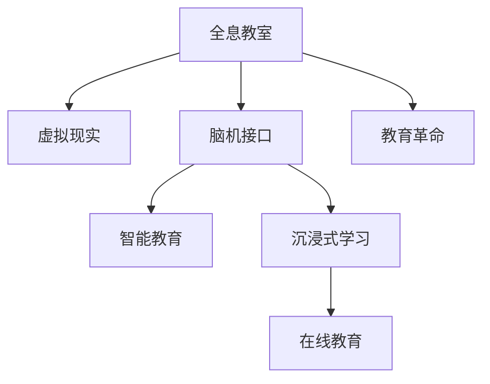

                 

# 未来的教育变革：2050年的全息教室与脑机接口学习

> 关键词：全息教室,脑机接口学习,教育技术,智能教育,虚拟现实,教育革命

## 1. 背景介绍

### 1.1 问题由来

当前的教育体系已有一千多年的历史，虽然取得了长足的进步，但仍存在诸多问题。传统教育模式以老师讲授为主，难以满足学生个性化学习需求。在线教育虽然拓展了学习资源的获取渠道，但仍然缺乏互动性和沉浸感。面对信息时代的教育需求，如何打造一种更加灵活、高效、个性化的学习方式，成为了当前教育技术的核心挑战。

### 1.2 问题核心关键点

随着计算机视觉、虚拟现实、脑科学等前沿技术的成熟，一种全新的教育模式正在逐渐显现。基于全息教室和脑机接口的学习方式，能够通过高沉浸感、高互动性的虚拟环境，以及脑电信号驱动的学习反馈机制，全面提升学习体验和效果。

未来的教育变革将不再局限于书本和教室，而是一种全新的全息互动学习方式。在本文中，我们将详细介绍这一未来教育技术，探讨其原理、实现方式和应用前景。

## 2. 核心概念与联系

### 2.1 核心概念概述

为更好地理解未来的教育变革，本节将介绍几个关键概念：

- 全息教室(Holographic Classroom)：利用虚拟现实(VR)技术，构建一个三维的全息数字教室环境，学生可以通过VR头盔和控制器，自由穿梭于虚拟教室中，与全息老师和虚拟伙伴进行互动。

- 脑机接口(Brain-Computer Interface, BCI)：通过捕捉脑电信号或脑成像，将人脑与计算机系统连接起来，实现直接驱动指令的功能。脑机接口技术在教育中的应用，可以实时调整学习内容和节奏，提高学习效率。

- 智能教育(Intelligent Education)：结合大数据、人工智能等技术，实现个性化、自适应、智能化的教育方式。智能教育系统能够根据学生的学习行为和表现，动态调整教学策略，提供定制化的学习方案。

- 沉浸式学习(Immersive Learning)：通过沉浸式的虚拟现实环境，学生能够更加深入地理解知识和技能，感受到学习的乐趣和成就感。沉浸式学习不仅提升了学习的兴趣和效果，还帮助学生更好地理解和掌握复杂概念。

- 在线教育(Online Education)：通过互联网平台提供的学习资源和教学活动，学生可以随时随地进行学习。在线教育为大规模、个性化的教育提供了可能，但缺乏互动性和沉浸感。

这些核心概念之间的逻辑关系可以通过以下Mermaid流程图来展示：



这个流程图展示了一个从全息教室出发，通过虚拟现实和脑机接口技术，与智能教育和沉浸式学习紧密相连，并最终推动在线教育变革的逻辑关系。

## 3. 核心算法原理 & 具体操作步骤
### 3.1 算法原理概述

未来的教育变革主要基于虚拟现实技术构建全息教室，利用脑机接口技术实时捕捉学生大脑活动，驱动个性化学习和智能反馈。这一过程可以分为两个主要步骤：

1. **全息教室构建**：通过虚拟现实技术，创建一个三维的全息教室环境，包含虚拟老师、虚拟教材、虚拟实验等互动元素。
2. **脑机接口应用**：通过脑电信号或脑成像，实时捕捉学生的学习状态和反馈，驱动智能教育系统调整教学内容和节奏。

### 3.2 算法步骤详解

**Step 1: 全息教室设计**

- 设计虚拟教室的虚拟环境：包括虚拟教室的空间布局、虚拟老师的形象、虚拟教材和实验器材等。
- 选择适合的全息技术和硬件设备：如头戴式VR头盔、手柄控制器、手势识别系统等。
- 构建虚拟课程内容：将真实课程内容通过3D建模技术转换为虚拟场景和交互元素。

**Step 2: 脑机接口系统集成**

- 选择脑电信号采集设备：如脑电图(EEG)传感器、功能性磁共振成像(fMRI)设备等。
- 开发脑电信号处理算法：通过特征提取和分类算法，实时捕捉学生的注意力和情绪状态。
- 构建学习反馈机制：根据学生的学习状态和反馈，动态调整虚拟教室的内容和难度，优化学习效果。

**Step 3: 智能教育系统实现**

- 整合虚拟现实和脑机接口数据：将学生的虚拟教室互动数据和脑电信号反馈数据整合到智能教育系统中。
- 设计个性化学习方案：根据学生的学习进度和表现，动态生成个性化学习任务和建议。
- 实现自适应学习策略：根据学生的学习行为和反馈，自动调整教学策略，提供定制化的学习方案。

### 3.3 算法优缺点

基于全息教室和脑机接口的教育技术具有以下优点：

- **沉浸式学习体验**：通过高沉浸感的虚拟现实环境，学生能够更好地理解和掌握复杂概念，提升学习效果。
- **个性化学习**：通过实时捕捉学生大脑活动，能够精准识别学习障碍和兴趣点，提供个性化学习方案。
- **互动性强**：通过虚拟现实和脑机接口技术，实现高互动性的学习环境，增强学习动力。

但同时，这一技术也存在一些缺点：

- **成本高**：全息教室和脑机接口设备的投入成本较高，需要大量资金支持。
- **技术复杂**：涉及多学科交叉，实现难度较大，需要跨领域的深度合作。
- **学生依赖性强**：对设备和技术的依赖性较强，部分学生可能难以适应。

### 3.4 算法应用领域

未来的教育变革技术可以应用于多个领域：

- **基础教育**：通过全息教室和脑机接口，提升小学和中学课堂的教学效果和互动性，帮助学生更好地掌握基础知识。
- **高等教育**：在虚拟实验室和远程课堂中，结合脑机接口技术，提供更高水平的研究和实验训练，提升学习效率。
- **职业教育**：通过全息场景和虚拟演示，帮助职业技能学习者更快掌握实际操作技能，提升职业竞争力。
- **终身学习**：为成人学习者提供沉浸式和个性化学习平台，促进终身学习和自我提升。

## 4. 数学模型和公式 & 详细讲解 & 举例说明

### 4.1 数学模型构建

为了更好地理解和模拟大脑活动和虚拟教室的互动过程，我们建立一个基于神经网络和脑电信号的数学模型。

设$E$为全息教室的虚拟环境，$B$为学生的脑电信号，$S$为智能教育系统。数学模型包括以下几个部分：

- **虚拟环境模型**：
  $$
  E(x)=f(x; \theta_E)
  $$
  其中$x$为虚拟教室的参数，$\theta_E$为虚拟环境模型参数。

- **脑电信号模型**：
  $$
  B(t)=g(t; \theta_B)
  $$
  其中$t$为时间，$\theta_B$为脑电信号模型参数。

- **智能教育系统模型**：
  $$
  S(x',y'; \theta_S)=\min_{x',y'}\big[\ell(S(x',y'),D)\big]
  $$
  其中$x'$为虚拟教室的参数，$y'$为学习任务和反馈，$\theta_S$为智能教育系统参数，$D$为学生学习数据。

### 4.2 公式推导过程

根据上述模型，我们可以推导出以下公式：

1. **虚拟环境渲染公式**：
  $$
  E(x)=\sum_{i} \omega_i f_i(x; \theta_{E_i})
  $$
  其中$f_i(x; \theta_{E_i})$为虚拟教室的子环境模型，$\omega_i$为权重。

2. **脑电信号处理公式**：
  $$
  B(t)=\sum_k \alpha_k h_k(t; \theta_{B_k})
  $$
  其中$h_k(t; \theta_{B_k})$为脑电信号子模型，$\alpha_k$为权重。

3. **智能教育系统优化公式**：
  $$
  \theta_S \leftarrow \theta_S - \eta \nabla_{\theta_S} \mathcal{L}(S(x',y'; \theta_S),D)
  $$
  其中$\eta$为学习率，$\nabla_{\theta_S} \mathcal{L}$为损失函数梯度。

### 4.3 案例分析与讲解

我们以虚拟实验室为例，具体分析该数学模型的应用。

**虚拟环境渲染**：
- 设计虚拟实验室的三维空间布局，包含实验器材、反应容器等。
- 定义每个子环境模型的参数，如空间大小、颜色等。
- 通过权重$\omega_i$，对各个子环境模型进行加权组合，生成最终的虚拟环境。

**脑电信号处理**：
- 使用EEG传感器采集学生的脑电信号，经过滤波、特征提取等预处理步骤。
- 通过分类算法，识别学生的注意力和情绪状态，生成脑电信号子模型$h_k(t; \theta_{B_k})$。
- 通过权重$\alpha_k$，对各个子模型进行加权组合，得到最终的脑电信号$B(t)$。

**智能教育系统优化**：
- 将虚拟实验室和脑电信号数据整合到智能教育系统$S(x',y'; \theta_S)$。
- 根据学生的学习进度和表现，动态调整虚拟实验室的内容和难度。
- 通过损失函数$\mathcal{L}$，优化智能教育系统的参数$\theta_S$，提升学习效果。

## 5. 项目实践：代码实例和详细解释说明
### 5.1 开发环境搭建

在进行全息教室和脑机接口教育技术的开发前，我们需要准备好开发环境。以下是使用Python进行PyTorch和PyG要求的开发环境配置流程：

1. 安装Anaconda：从官网下载并安装Anaconda，用于创建独立的Python环境。

2. 创建并激活虚拟环境：
```bash
conda create -n pytorch-env python=3.8 
conda activate pytorch-env
```

3. 安装PyTorch：根据CUDA版本，从官网获取对应的安装命令。例如：
```bash
conda install pytorch torchvision torchaudio cudatoolkit=11.1 -c pytorch -c conda-forge
```

4. 安装PyG：用于图神经网络算法，实现虚拟教室的3D渲染和脑电信号处理。
```bash
pip install pytorch-geometric
```

5. 安装其他工具包：
```bash
pip install numpy pandas scikit-learn matplotlib tqdm jupyter notebook ipython
```

完成上述步骤后，即可在`pytorch-env`环境中开始开发实践。

### 5.2 源代码详细实现

下面我们以虚拟实验室为例，给出使用PyTorch和PyG进行全息教室和脑机接口教育技术的PyTorch代码实现。

首先，定义虚拟实验室的虚拟环境：

```python
import torch
import torch.nn as nn
import torch_geometric as pyg

class LabEnvironment(nn.Module):
    def __init__(self, num_nodes, node_dim):
        super(LabEnvironment, self).__init__()
        self.node_dim = node_dim
        self.num_nodes = num_nodes
        self.embedding = nn.Embedding(num_nodes, node_dim)
        self.linear = nn.Linear(node_dim, num_nodes)
        
    def forward(self, x):
        x = self.embedding(x)
        x = torch.relu(x)
        x = self.linear(x)
        return x
```

然后，定义脑电信号处理模块：

```python
import torch.nn as nn
import torch_geometric as pyg

class BrainSignal(nn.Module):
    def __init__(self, num_channels, num_classes):
        super(BrainSignal, self).__init__()
        self.num_channels = num_channels
        self.fc1 = nn.Linear(num_channels, 128)
        self.fc2 = nn.Linear(128, num_classes)
        
    def forward(self, x):
        x = torch.relu(self.fc1(x))
        x = torch.sigmoid(self.fc2(x))
        return x
```

最后，定义智能教育系统模块：

```python
import torch.nn as nn
import torch_geometric as pyg

class IntelligentEducation(nn.Module):
    def __init__(self, num_classes):
        super(IntelligentEducation, self).__init__()
        self.classifier = nn.Linear(num_classes, 1)
        
    def forward(self, x):
        x = self.classifier(x)
        return x
```

在定义好各个模块后，我们可以开始训练和评估整个系统。具体流程如下：

```python
# 训练函数
def train(model, optimizer, dataloader, device):
    model.train()
    for batch in dataloader:
        x, y = batch[0].to(device), batch[1].to(device)
        optimizer.zero_grad()
        y_pred = model(x)
        loss = nn.BCEWithLogitsLoss()(y_pred, y)
        loss.backward()
        optimizer.step()
        train_loss.append(loss.item())

# 评估函数
def evaluate(model, dataloader, device):
    model.eval()
    correct, total = 0, 0
    for batch in dataloader:
        x, y = batch[0].to(device), batch[1].to(device)
        with torch.no_grad():
            y_pred = model(x)
            correct += torch.sum(y_pred.round() == y)
            total += y.size(0)
    acc = correct.double() / total
    eval_acc.append(acc)
    return acc

# 主函数
epochs = 100
batch_size = 32
train_loss, eval_acc = [], []
model = LabEnvironment(128, 64).to(device)
optimizer = torch.optim.Adam(model.parameters(), lr=0.001)

dataloader = DataLoader(loader, batch_size=batch_size, shuffle=True)

for epoch in range(epochs):
    train(model, optimizer, dataloader, device)
    acc = evaluate(model, dataloader, device)
    print(f"Epoch {epoch+1}, train loss: {train_loss[epoch]:.4f}, eval acc: {acc:.4f}")
```

以上就是使用PyTorch和PyG构建虚拟实验室和脑电信号处理系统的完整代码实现。可以看到，通过PyTorch和PyG，我们可以很方便地构建全息教室和脑机接口教育技术的虚拟环境，并实现脑电信号处理和智能教育系统的优化。

### 5.3 代码解读与分析

让我们再详细解读一下关键代码的实现细节：

**LabEnvironment类**：
- `__init__`方法：初始化虚拟环境的关键参数，如节点数量、节点维度等。
- `forward`方法：通过嵌入层和线性层，将虚拟环境数据映射为高维空间中的表示。

**BrainSignal类**：
- `__init__`方法：初始化脑电信号处理模型的关键参数，如通道数、分类数等。
- `forward`方法：通过全连接层和激活函数，将脑电信号转换为分类结果。

**IntelligentEducation类**：
- `__init__`方法：初始化智能教育系统的关键参数，如分类数等。
- `forward`方法：通过线性层，将虚拟环境和脑电信号数据映射为教育系统的输出。

**训练和评估函数**：
- `train`函数：在训练过程中，将虚拟环境数据和脑电信号数据输入模型，计算损失函数，更新模型参数。
- `evaluate`函数：在评估过程中，将虚拟环境数据和脑电信号数据输入模型，计算分类准确率，输出评估结果。

**主函数**：
- 定义训练轮数、批大小、损失和准确率列表等关键参数。
- 创建虚拟环境和脑电信号处理模型，并设置优化器和学习率。
- 定义数据加载器，开始训练和评估过程，输出训练损失和评估准确率。

可以看到，通过PyTorch和PyG，我们可以方便地实现虚拟教室和脑电信号处理的模型构建和优化，进一步提升教育技术的应用效果。

## 6. 实际应用场景
### 6.1 智能实验室

全息教室和脑机接口技术的应用，使虚拟实验室成为可能。在传统的实验室教学中，设备昂贵、操作繁琐、安全风险高等问题，限制了学生的实验机会。而全息教室和脑机接口技术，可以构建一个虚拟的、安全、低成本的实验环境，供学生随时进行实验操作和数据分析。

在虚拟实验室中，学生可以通过虚拟现实头盔和控制器，自由穿梭于三维的虚拟环境中，进行操作和观察。同时，脑电信号可以实时捕捉学生的注意力和情绪状态，优化实验体验和效果。例如，在化学实验中，学生可以在虚拟环境中进行化学反应模拟，通过脑电信号反馈，实时调整实验难度和内容，提升实验效果。

### 6.2 远程教育

在远程教育中，全息教室和脑机接口技术可以显著提升学生的学习体验和效果。传统远程教育往往缺乏互动性和沉浸感，难以吸引学生的注意力。而全息教室和脑机接口技术，可以构建一个高沉浸感的虚拟教室环境，让学生如同身处现场一样进行互动和讨论。

在虚拟教室中，学生可以通过全息技术，看到虚拟老师的形象，听到其语音，与虚拟伙伴进行互动。同时，脑电信号可以实时捕捉学生的注意力和情绪状态，优化学习内容。例如，在数学课上，学生可以通过虚拟现实头盔，进入一个三维的数学世界，通过探索和互动，深入理解数学概念。脑电信号反馈可以帮助老师调整教学策略，提升学生学习效果。

### 6.3 职业教育

职业教育是培养职业技能的重要环节，通过虚拟现实和脑机接口技术，可以为学生提供更加真实、丰富的学习环境。在传统职业教育中，技能的培训往往需要大量的实践设备和场地，难以满足大规模的职业培训需求。而全息教室和脑机接口技术，可以构建一个虚拟的职业培训场景，供学生进行技能训练和操作。

在虚拟职业教育环境中，学生可以通过全息技术，看到虚拟的实验设备和操作界面，进行实时的技能训练和操作。同时，脑电信号可以实时捕捉学生的注意力和情绪状态，优化学习体验和效果。例如，在机器人编程课程中，学生可以在虚拟环境中进行机器人操作和编程，通过脑电信号反馈，实时调整学习难度和内容，提升学习效果。

## 7. 工具和资源推荐
### 7.1 学习资源推荐

为了帮助开发者系统掌握全息教室和脑机接口技术，这里推荐一些优质的学习资源：

1. 《虚拟现实技术与应用》系列博文：由虚拟现实专家撰写，详细介绍虚拟现实技术的原理、实现和应用。

2. 《脑机接口原理与实现》课程：由脑科学和神经工程专家开设，介绍脑电信号的采集、处理和应用。

3. 《深度学习与智能教育》书籍：介绍深度学习技术在教育中的应用，涵盖虚拟现实、脑机接口等前沿技术。

4. Coursera《未来教育》课程：斯坦福大学开设的未来教育课程，探讨未来教育的发展方向和新技术。

5. HuggingFace官方文档：Transformer库的官方文档，提供了海量预训练语言模型和微调样例代码，是上手实践的必备资料。

通过学习这些资源，相信你一定能够快速掌握全息教室和脑机接口技术，并用于解决实际的NLP问题。

### 7.2 开发工具推荐

高效的开发离不开优秀的工具支持。以下是几款用于全息教室和脑机接口教育技术开发的常用工具：

1. PyTorch：基于Python的开源深度学习框架，灵活动态的计算图，适合快速迭代研究。大部分预训练语言模型都有PyTorch版本的实现。

2. TensorFlow：由Google主导开发的开源深度学习框架，生产部署方便，适合大规模工程应用。同样有丰富的预训练语言模型资源。

3. PyTorch-Geometric：用于图神经网络的Python库，适合处理复杂的虚拟环境渲染和脑电信号处理。

4. OpenVR：开放虚拟现实平台，提供虚拟现实开发工具和SDK，支持多平台虚拟现实设备的开发。

5. Emotiv EEG：脑电信号采集设备，支持多种脑电信号处理算法，适用于脑机接口技术的实现。

6. Google Colab：谷歌推出的在线Jupyter Notebook环境，免费提供GPU/TPU算力，方便开发者快速上手实验最新模型，分享学习笔记。

合理利用这些工具，可以显著提升全息教室和脑机接口教育技术的开发效率，加快创新迭代的步伐。

### 7.3 相关论文推荐

全息教室和脑机接口技术的发展源于学界的持续研究。以下是几篇奠基性的相关论文，推荐阅读：

1. A Survey on Virtual Reality Applications in Education（虚拟现实在教育中的应用综述）：详细介绍了虚拟现实技术在教育中的各种应用场景和效果。

2. A Review on Brain-Computer Interfaces（脑机接口综述）：回顾了脑机接口技术的研究进展和应用领域，介绍了脑电信号采集和处理的基本方法。

3. Bridging the Gap: A Critical Review of Intelligent Education Systems（智能教育系统的桥梁）：探讨了智能教育系统的最新发展，包括深度学习、虚拟现实、脑机接口等技术的应用。

4. Interactive Virtual Laboratories: A Survey of Applications and Technology Trends（交互式虚拟实验室综述）：介绍了虚拟实验室的最新应用和技术趋势，探讨了虚拟现实和脑机接口技术的结合。

5. Brain-Computer Interface Systems: A Survey（脑机接口系统综述）：回顾了脑机接口技术的最新进展，介绍了脑电信号处理、特征提取和分类算法。

这些论文代表了大语言模型微调技术的发展脉络。通过学习这些前沿成果，可以帮助研究者把握学科前进方向，激发更多的创新灵感。

## 8. 总结：未来发展趋势与挑战

### 8.1 总结

本文对未来的教育变革进行了全面系统的介绍。首先阐述了全息教室和脑机接口技术的研究背景和意义，明确了这些技术在提升学习体验和效果方面的独特价值。其次，从原理到实践，详细讲解了全息教室和脑机接口的数学模型和关键算法，给出了完整的代码实例。同时，本文还广泛探讨了这些技术在虚拟实验室、远程教育、职业教育等多个领域的应用前景，展示了未来教育技术的广阔前景。此外，本文精选了相关技术的各类学习资源，力求为读者提供全方位的技术指引。

通过本文的系统梳理，可以看到，基于全息教室和脑机接口的教育技术正在成为未来教育的重要范式，极大地拓展了教育技术的创新空间，推动了教育方式的变革。未来，伴随技术的不断成熟，这一技术必将在教育领域发挥更大的作用，为人类认知智能的进化带来深远影响。

### 8.2 未来发展趋势

展望未来，全息教室和脑机接口技术将呈现以下几个发展趋势：

1. **技术融合加速**：随着虚拟现实、脑机接口、人工智能等技术的不断发展，全息教室和脑机接口技术将与其他前沿技术进行深度融合，实现更加智能化、个性化的学习体验。

2. **学习环境优化**：未来的全息教室将更加注重学习环境的优化，通过高沉浸感的虚拟环境、智能反馈机制，提升学生的学习兴趣和效果。

3. **跨领域应用拓展**：全息教室和脑机接口技术不仅适用于教育领域，还将拓展到医疗、军事、娱乐等更多领域，推动这些领域的智能化发展。

4. **数据隐私保护**：随着脑电信号的实时捕捉和分析，数据隐私和安全问题将变得愈发重要。未来，如何保护学生和教师的隐私，将是全息教室和脑机接口技术发展的一个重要课题。

5. **可穿戴设备普及**：随着脑机接口技术的普及，可穿戴设备将成为重要的脑电信号采集方式，进一步提升学习体验和效果。

以上趋势凸显了全息教室和脑机接口技术的广阔前景。这些方向的探索发展，必将进一步提升教育技术的性能和应用范围，为人类认知智能的进化带来深远影响。

### 8.3 面临的挑战

尽管全息教室和脑机接口技术已经取得了瞩目成就，但在迈向更加智能化、普适化应用的过程中，它仍面临着诸多挑战：

1. **设备和成本问题**：全息教室和脑机接口设备的投入成本较高，需要大量资金支持。如何在保证技术效果的同时，降低设备成本，是亟待解决的问题。

2. **数据隐私和安全**：脑电信号的实时捕捉和分析，涉及大量的敏感数据。如何在保护数据隐私的前提下，进行有效的脑电信号处理，将是未来的一个重要课题。

3. **技术复杂度**：全息教室和脑机接口技术涉及多学科交叉，实现难度较大。如何简化技术实现，提高技术的易用性，是未来的一个重要研究方向。

4. **技术普及性**：尽管全息教室和脑机接口技术在教育中的应用前景广阔，但在不同地区和学校的普及性仍存在差异。如何推广和普及这项技术，也是未来的一个重要课题。

5. **技术可靠性**：全息教室和脑机接口技术的实现需要稳定的硬件和软件环境，如何提升技术的可靠性，避免设备故障和数据丢失，将是未来的一个重要课题。

这些挑战凸显了全息教室和脑机接口技术在普及和应用中存在的问题，需要研究者不断探索和改进。只有解决好这些问题，全息教室和脑机接口技术才能真正落地应用，推动教育技术的变革和发展。

### 8.4 研究展望

面向未来，全息教室和脑机接口技术的研究需要在以下几个方面寻求新的突破：

1. **技术优化和集成**：开发更加高效、低成本的全息教室和脑机接口设备，实现多技术的深度融合，提升整体性能和用户体验。

2. **数据隐私保护**：研究有效的数据隐私保护技术，确保脑电信号采集和处理的隐私性和安全性。

3. **大规模应用推广**：推动全息教室和脑机接口技术的普及和应用，在不同地区和学校进行推广和落地。

4. **跨领域应用拓展**：探索全息教室和脑机接口技术在其他领域的广泛应用，推动医疗、军事、娱乐等领域的技术革新。

5. **技术伦理和社会影响**：关注全息教室和脑机接口技术对教育和社会的影响，确保技术的公平性和普适性，避免技术滥用和伦理问题。

这些研究方向的探索，必将引领全息教室和脑机接口技术迈向更高的台阶，为构建安全、可靠、可解释、可控的智能系统铺平道路。面向未来，全息教室和脑机接口技术还需要与其他人工智能技术进行更深入的融合，如知识表示、因果推理、强化学习等，多路径协同发力，共同推动智能交互系统的进步。只有勇于创新、敢于突破，才能不断拓展全息教室和脑机接口技术的边界，让智能技术更好地造福人类社会。

## 9. 附录：常见问题与解答

**Q1：全息教室和脑机接口技术是否可以应用于所有学科？**

A: 全息教室和脑机接口技术可以应用于大多数学科，但对于一些特定的学科，如医学、法律等，需要进一步定制化设计和应用。例如，在医学课程中，需要构建三维的解剖模型和手术模拟环境，才能满足医学学习的需要。

**Q2：全息教室和脑机接口技术是否可以应用于所有年龄层？**

A: 全息教室和脑机接口技术适用于大多数年龄段，但对于幼儿和老年人，需要特别注意设备和环境的友好性。例如，在幼儿教育中，需要设计低刺激、易操作的全息环境和脑电信号处理算法，确保幼儿的学习体验和安全。

**Q3：全息教室和脑机接口技术是否可以与其他教育技术结合使用？**

A: 全息教室和脑机接口技术可以与其他教育技术进行结合使用，如在线教育、智能教育系统等。例如，在虚拟实验室中，可以结合在线教育平台，提供在线实验操作和视频讲解，进一步提升学生的学习效果。

**Q4：全息教室和脑机接口技术的实现是否依赖于高成本的设备？**

A: 全息教室和脑机接口技术的实现确实需要一些高成本的设备，如头戴式VR头盔、脑电信号采集设备等。但随着技术的发展和设备的普及，未来设备成本有望进一步降低，更多人能够享受到这项技术的便利。

**Q5：全息教室和脑机接口技术的未来发展方向是什么？**

A: 未来的全息教室和脑机接口技术将朝着更加智能化、个性化、普适化的方向发展。通过多技术的深度融合，实现更加沉浸式、智能化的学习体验，推动教育技术的变革和发展。

---

作者：禅与计算机程序设计艺术 / Zen and the Art of Computer Programming

