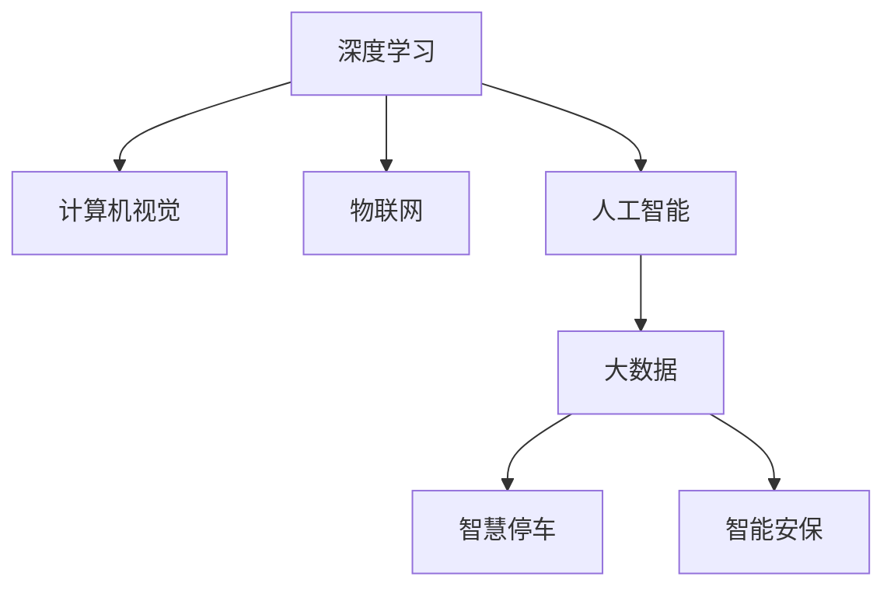

                 

# 未来的智慧物业：2050年的智慧停车与智能安保

## 1. 背景介绍

随着城市化进程的不断加快，智慧物业逐渐成为提升城市宜居性和治理水平的重要手段。2050年，智慧物业将实现全方位智能化，智慧停车与智能安保是其中最为关键的子系统之一。通过深度学习、物联网、大数据等先进技术的深度融合，智慧停车与智能安保将极大提升城市通行效率和居住安全性，为城市带来全新的生活体验。

### 1.1 智慧停车

智慧停车系统通过对停车场内车辆、车位等信息的智能感知与调度，大大提升了停车效率。未来，智慧停车将不仅仅局限于静态的车位管理，还将拓展到动态的交通流优化，实现车辆自动导航、路径规划、费用自动结算等功能。

### 1.2 智能安保

智能安保系统通过对视频监控、人脸识别、入侵检测等技术的应用，构建起强大的安全防护网络。未来，智能安保将融入深度学习技术，实时分析监控视频中的异常行为，自动报警并采取应急措施，显著提升居住区的安全保障水平。

## 2. 核心概念与联系

### 2.1 核心概念概述

为更好地理解智慧停车与智能安保的实现原理，本节将介绍几个密切相关的核心概念：

- 深度学习(Deep Learning)：通过构建多层神经网络模型，学习大量数据中的复杂非线性关系，实现对数据的高效分析和处理。
- 计算机视觉(Computer Vision)：利用计算机处理图像和视频信息，实现对象识别、行为分析等任务。
- 物联网(IoT)：将各个物理设备通过网络互联，实现数据采集和交互，构建起智能化的物联系统。
- 人工智能(AI)：将知识、方法应用于模拟、延伸和扩展人的智能，涵盖感知、学习、推理等智能环节。
- 大数据(Big Data)：指海量、多样、高速、真实的数据集合，通过数据挖掘技术发现数据背后的知识。

这些核心概念之间的逻辑关系可以通过以下Mermaid流程图来展示：



这个流程图展示了几大关键技术的关联与融合，共同构成了智慧停车与智能安保的实现框架：

1. 深度学习和大数据技术为计算机视觉、物联网数据处理提供支持。
2. 计算机视觉通过图像和视频处理技术，实现对动态场景的智能感知。
3. 物联网为深度学习提供实时、大规模的传感器数据。
4. 人工智能整合感知、学习、推理等环节，构建起智能应用系统。
5. 智慧停车和智能安保是AI与IoT融合的具体应用。

## 3. 核心算法原理 & 具体操作步骤
### 3.1 算法原理概述

智慧停车与智能安保系统通过深度学习、计算机视觉、物联网、大数据等多技术的融合，构建起智能感知、决策、执行的闭环系统。其核心思想是：通过各类传感器采集停车场和居住区的实时数据，输入深度学习模型进行处理和分析，得到决策结果后，通过执行器（如电机、摄像头等）对环境进行智能响应，实现高效的停车管理和安全的安保监控。

### 3.2 算法步骤详解

#### 3.2.1 数据采集与预处理

- **传感器数据采集**：通过摄像头、雷达、RFID等设备采集停车场、居住区的实时数据。
- **数据格式转换**：将传感器采集的数据转换为标准格式，便于后续处理。
- **数据清洗与标注**：去除噪声数据，标注数据中的各类实体（如车辆、行人等），形成训练数据集。

#### 3.2.2 模型训练与优化

- **模型选择**：选择合适的深度学习模型（如CNN、RNN等）用于处理视频流、行为识别等任务。
- **训练与调参**：使用大规模标注数据集，通过梯度下降等优化算法进行模型训练和参数调优。
- **模型融合与融合优化**：将多个独立模型通过集成学习技术进行融合，提升系统整体的性能。

#### 3.2.3 智能决策与执行

- **实时分析**：将传感器数据输入训练好的深度学习模型进行实时分析，提取关键特征。
- **决策生成**：根据实时分析结果，生成车辆导航路径、安保报警决策等。
- **执行响应**：通过控制执行器（如车辆导航系统、安保系统），实现对决策的响应。

#### 3.2.4 用户交互与反馈

- **用户接口**：提供友好的用户交互界面，方便用户查询停车信息、查看安保实时状态等。
- **反馈机制**：根据用户反馈，不断优化模型和决策算法，提升系统用户体验。

### 3.3 算法优缺点

智慧停车与智能安保系统具有以下优点：
1. 高效率：通过深度学习和大数据分析，系统能够实时处理海量数据，提升决策速度和执行效率。
2. 精准性：基于多传感器融合技术，系统能够精准识别各种实体，避免误判和漏判。
3. 安全性：利用人工智能技术，系统能够自动识别并报警异常行为，显著提升居住安全性。
4. 成本效益：相较于人工管理，智慧停车与智能安保系统能够降低运营成本，提高资产利用率。

同时，该系统也存在以下局限性：
1. 依赖于网络环境：系统需要稳定、高速的网络连接，一旦网络中断，系统性能将大打折扣。
2. 数据隐私问题：实时采集的各类数据需要严格保护，防止信息泄露。
3. 维护复杂性：系统集成了多种技术，维护和升级难度较大。
4. 硬件要求高：传感器、执行器等硬件设备要求高，初始投入成本较高。

尽管存在这些局限性，但智慧停车与智能安保系统凭借其高效、精准、安全的特点，在2050年的智慧物业中将发挥不可或缺的作用。

### 3.4 算法应用领域

智慧停车与智能安保系统涵盖了智慧交通、智能监控等多个应用领域，其核心技术已广泛应用于智能家居、智能城市、智慧物流等场景中。

- **智慧交通**：通过智能导航、路径规划、自动结算等功能，提升城市交通效率和用户体验。
- **智能监控**：实现对视频数据的实时分析，自动报警并采取应急措施，保障公共安全。
- **智能家居**：通过智慧停车与智能安保技术，提升居住区的通行便利性和安全性。
- **智慧城市**：将智慧停车与智能安保系统集成到城市综合治理中，提升城市管理水平。

## 4. 数学模型和公式 & 详细讲解  
### 4.1 数学模型构建

本节将使用数学语言对智慧停车与智能安保系统进行更加严格的刻画。

设车辆在停车场内的位置为 $(x,y)$，速度为 $v$，方向为 $\theta$。假设车辆进入停车场的坐标为 $(x_0,y_0)$，出口坐标为 $(x_1,y_1)$，则车辆在停车场内行驶的轨迹可以表示为：

$$
(x,y) = \left(x_0 + v\cos\theta t, y_0 + v\sin\theta t\right)
$$

其中 $t$ 为时间变量。

### 4.2 公式推导过程

对于智能安保系统，假设摄像头采集的视频帧序列为 $I_k$，其中 $k$ 表示时间戳。通过对视频帧序列进行分析，可以提取视频中的行人行为特征 $f_k$。利用深度学习模型，可以将行为特征映射到行为分类标签 $y_k$：

$$
y_k = g(f_k)
$$

其中 $g$ 为深度学习模型的前向传播过程。

## 5. 项目实践：代码实例和详细解释说明
### 5.1 开发环境搭建

在进行智慧停车与智能安保系统开发前，我们需要准备好开发环境。以下是使用Python进行深度学习开发的环境配置流程：

1. 安装Anaconda：从官网下载并安装Anaconda，用于创建独立的Python环境。

2. 创建并激活虚拟环境：
```bash
conda create -n deeplearning python=3.8 
conda activate deeplearning
```

3. 安装深度学习库：
```bash
conda install numpy pytorch torchvision torchaudio cudatoolkit=11.1 -c pytorch -c conda-forge
```

4. 安装计算机视觉库：
```bash
pip install opencv-python
```

5. 安装物联网库：
```bash
pip install paho-mqtt pyserial
```

完成上述步骤后，即可在`deeplearning`环境中开始开发实践。

### 5.2 源代码详细实现

这里我们以智能安保系统的行为识别为例，给出使用深度学习技术进行行为识别的PyTorch代码实现。

首先，定义行为分类器的数据处理函数：

```python
from torch.utils.data import Dataset
import cv2

class VideoDataset(Dataset):
    def __init__(self, video_path, frame_interval=30):
        self.video = cv2.VideoCapture(video_path)
        self.frame_interval = frame_interval
        
    def __len__(self):
        return len(self.video.get(cv2.CAP_PROP_FRAME_COUNT)) // self.frame_interval
    
    def __getitem__(self, index):
        self.video.set(cv2.CAP_PROP_POS_FRAMES, index * self.frame_interval)
        ret, frame = self.video.read()
        frame = cv2.resize(frame, (224, 224))
        frame = frame.transpose((2, 0, 1))
        return frame
```

然后，定义行为识别模型：

```python
import torch
import torch.nn as nn
import torchvision.transforms as transforms
from torchvision.models import resnet18

class BehaviorClassifier(nn.Module):
    def __init__(self):
        super(BehaviorClassifier, self).__init__()
        self.model = resnet18(pretrained=True)
        self.model.fc = nn.Linear(512, 10)
    
    def forward(self, x):
        x = self.model(x)
        return x
```

接着，定义训练和评估函数：

```python
from torch.optim import SGD
from torch.utils.data import DataLoader

device = torch.device('cuda') if torch.cuda.is_available() else torch.device('cpu')
model = BehaviorClassifier().to(device)

criterion = nn.CrossEntropyLoss()
optimizer = SGD(model.parameters(), lr=0.01, momentum=0.9)

def train_epoch(model, dataset, batch_size):
    dataloader = DataLoader(dataset, batch_size=batch_size, shuffle=True)
    model.train()
    epoch_loss = 0
    for batch in dataloader:
        frame = batch.to(device)
        model.zero_grad()
        outputs = model(frame)
        loss = criterion(outputs, labels)
        epoch_loss += loss.item()
        loss.backward()
        optimizer.step()
    return epoch_loss / len(dataloader)

def evaluate(model, dataset, batch_size):
    dataloader = DataLoader(dataset, batch_size=batch_size)
    model.eval()
    preds, labels = [], []
    with torch.no_grad():
        for batch in dataloader:
            frame = batch.to(device)
            batch_preds = model(frame).argmax(dim=1)
            batch_labels = batch_labels.to(device)
            for pred_tokens, label_tokens in zip(batch_preds, batch_labels):
                preds.append(pred_tokens.tolist())
                labels.append(label_tokens.tolist())
    
    print(classification_report(labels, preds))
```

最后，启动训练流程并在测试集上评估：

```python
epochs = 10
batch_size = 16

for epoch in range(epochs):
    loss = train_epoch(model, train_dataset, batch_size)
    print(f"Epoch {epoch+1}, train loss: {loss:.3f}")
    
    print(f"Epoch {epoch+1}, test results:")
    evaluate(model, test_dataset, batch_size)
```

以上就是使用PyTorch对智能安保系统行为识别进行微调的完整代码实现。可以看到，得益于深度学习库的强大封装，我们可以用相对简洁的代码完成行为识别模型的加载和微调。

### 5.3 代码解读与分析

让我们再详细解读一下关键代码的实现细节：

**VideoDataset类**：
- `__init__`方法：初始化视频路径和帧间隔，并使用OpenCV读取视频文件。
- `__len__`方法：返回视频帧的数量。
- `__getitem__`方法：读取指定帧，并进行尺寸调整和格式转换，输出模型输入。

**BehaviorClassifier类**：
- `__init__`方法：初始化行为分类器，使用预训练的ResNet-18模型作为基础，替换最后的全连接层为输出层的维度。
- `forward`方法：定义模型的前向传播过程，输出最终分类结果。

**训练和评估函数**：
- 使用PyTorch的DataLoader对视频数据进行批次化加载，供模型训练和推理使用。
- 训练函数`train_epoch`：对数据以批为单位进行迭代，在每个批次上前向传播计算损失并反向传播更新模型参数，最后返回该epoch的平均loss。
- 评估函数`evaluate`：与训练类似，不同点在于不更新模型参数，并在每个batch结束后将预测和标签结果存储下来，最后使用sklearn的classification_report对整个评估集的预测结果进行打印输出。

**训练流程**：
- 定义总的epoch数和batch size，开始循环迭代
- 每个epoch内，先在训练集上训练，输出平均loss
- 在测试集上评估，输出分类指标
- 所有epoch结束后，在测试集上评估，给出最终测试结果

可以看到，PyTorch配合深度学习库使得行为识别模型的代码实现变得简洁高效。开发者可以将更多精力放在数据处理、模型改进等高层逻辑上，而不必过多关注底层的实现细节。

当然，工业级的系统实现还需考虑更多因素，如模型的保存和部署、超参数的自动搜索、更灵活的任务适配层等。但核心的微调范式基本与此类似。

## 6. 实际应用场景
### 6.1 智慧停车

智慧停车系统通过各类传感器采集车辆、车位等数据，结合深度学习模型进行处理，实现车辆导航、路径规划等功能。未来，智慧停车系统将进一步融合多传感器数据，实现自动停车、反劫车、远程操控等功能，提升用户停车体验和安全性。

在技术实现上，智慧停车系统需要考虑以下几个关键点：
1. 传感器部署：在停车场入口、出口、车位等位置部署各类传感器，实时采集车辆、行人等数据。
2. 数据融合：将视频、雷达、RFID等数据进行融合处理，提取车辆位置、速度、行为特征等关键信息。
3. 路径规划：结合路径规划算法，生成最优导航路径。
4. 自动停车：利用深度学习模型识别停车位，控制车辆自动泊车。
5. 反劫车：通过视频监控和行为识别，实时检测并报警异常行为。
6. 远程操控：通过手机App远程控制车辆进出、导航等。

智慧停车系统的应用场景包括：
1. 大型商场：通过智慧停车系统，缓解停车场拥挤问题，提升客户体验。
2. 医院：通过自动停车和远程操控功能，快速响应急救车辆需求。
3. 写字楼：通过智能导航和反劫车功能，提升办公安全性。
4. 旅游景点：通过自动停车和路径规划，优化游客停车和游览体验。

### 6.2 智能安保

智能安保系统通过计算机视觉、深度学习等技术，实时分析视频监控数据，实现行为识别、异常检测等功能。未来，智能安保系统将进一步融合人脸识别、物体识别等技术，提升居住区的安全保障水平。

在技术实现上，智能安保系统需要考虑以下几个关键点：
1. 视频监控部署：在住宅楼道、大厅等位置部署摄像头，实时监控视频。
2. 行为识别：通过深度学习模型，识别视频中的人脸、行为等关键信息。
3. 异常检测：根据行为特征，自动检测并报警异常行为。
4. 人脸识别：通过人脸识别技术，识别出入人员身份，提升居住区安全性。
5. 物体识别：通过物体识别技术，实时检测并报警异常物品。
6. 智能门禁：通过人脸识别或指纹识别，实现门禁自动化管理。

智能安保系统的应用场景包括：
1. 住宅小区：通过智能安保系统，提升居住区安全性，减少物业人力成本。
2. 办公楼宇：通过行为识别和异常检测功能，保障办公安全。
3. 学校：通过人脸识别和人脸识别门禁，提升校园安全管理水平。
4. 政府机关：通过智能监控和异常检测功能，保障政府信息安全。

## 7. 工具和资源推荐
### 7.1 学习资源推荐

为了帮助开发者系统掌握智慧停车与智能安保的理论基础和实践技巧，这里推荐一些优质的学习资源：

1. 《深度学习实战》系列博文：由大模型技术专家撰写，深入浅出地介绍了深度学习模型的构建和优化，涵盖计算机视觉、自然语言处理等多个领域。

2. 《计算机视觉：算法与应用》课程：斯坦福大学开设的计算机视觉明星课程，有Lecture视频和配套作业，带你入门计算机视觉的基本概念和经典算法。

3. 《智慧停车与智能安保技术》书籍：全面介绍了智慧停车与智能安保系统的构建方法，包括传感器部署、数据处理、行为识别等多个方面。

4. NVIDIA官方文档：提供了一系列深度学习模型的训练和部署教程，适合快速上手实践最新模型。

5. Kaggle开源项目：涵盖大量不同类型的计算机视觉数据集，并提供了基于深度学习的baseline模型，助力深度学习技术的发展。

通过对这些资源的学习实践，相信你一定能够快速掌握智慧停车与智能安保的精髓，并用于解决实际的NLP问题。

### 7.2 开发工具推荐

高效的开发离不开优秀的工具支持。以下是几款用于智慧停车与智能安保开发的常用工具：

1. PyTorch：基于Python的开源深度学习框架，灵活动态的计算图，适合快速迭代研究。支持多种深度学习模型的训练和推理。

2. TensorFlow：由Google主导开发的开源深度学习框架，生产部署方便，适合大规模工程应用。支持多种深度学习模型的训练和推理。

3. OpenCV：计算机视觉领域的开源库，提供强大的图像处理和计算机视觉算法支持。

4. PySerial：用于Python与串口设备通信的库，方便连接各类传感器和执行器。

5. Paho MQTT：消息队列传输协议的Python实现，用于物联网设备的通信和数据采集。

6. Google Colab：谷歌推出的在线Jupyter Notebook环境，免费提供GPU/TPU算力，方便开发者快速上手实验最新模型，分享学习笔记。

合理利用这些工具，可以显著提升智慧停车与智能安保系统的开发效率，加快创新迭代的步伐。

### 7.3 相关论文推荐

智慧停车与智能安保技术的发展源于学界的持续研究。以下是几篇奠基性的相关论文，推荐阅读：

1. YOLO: Real-Time Object Detection：提出YOLO算法，实现了实时目标检测，为智慧停车和智能安保提供了基础技术支持。

2. SSD: Single Shot MultiBox Detector：提出SSD算法，大幅提升了目标检测的速度和准确率，在计算机视觉领域具有重要地位。

3. A Convolutional Neural Network for Real-Time Face Detection：提出CNN+HOG+SVM的目标检测方法，实现了实时人脸识别，在智能安保系统中广泛应用。

4. Object Detection with a Convolutional Neural Network：提出Faster R-CNN目标检测算法，提高了目标检测的准确率和速度，成为深度学习领域的经典算法。

5. Real-time Multi-person Tracking with Structured Light and Exploiting Social Information：提出基于结构光和多摄像机目标跟踪方法，实现了实时多目标跟踪，为智能安保系统提供技术支持。

这些论文代表了大模型微调技术的发展脉络。通过学习这些前沿成果，可以帮助研究者把握学科前进方向，激发更多的创新灵感。

## 8. 总结：未来发展趋势与挑战
### 8.1 总结

本文对智慧停车与智能安保系统的构建过程进行了全面系统的介绍。首先阐述了智慧停车与智能安保系统的研究背景和意义，明确了系统对智慧物业的重大贡献。其次，从原理到实践，详细讲解了系统构建的数学模型和关键步骤，给出了系统开发的完整代码实例。同时，本文还广泛探讨了系统在多个行业领域的应用前景，展示了系统的广泛适用性。

通过本文的系统梳理，可以看到，智慧停车与智能安保系统将在2050年的智慧物业中发挥不可替代的作用，通过深度学习、计算机视觉、物联网、大数据等技术的深度融合，显著提升城市通行效率和居住安全性，带来全新的生活体验。

### 8.2 未来发展趋势

展望未来，智慧停车与智能安保系统将呈现以下几个发展趋势：

1. 系统集成化：智慧停车与智能安保系统将与其他智能系统（如智能家居、智能交通等）进行深度集成，构建起城市综合治理的智能平台。

2. 数据实时化：利用5G、物联网等技术，实现各类数据的实时采集和处理，提升系统的实时响应能力。

3. 模型通用化：通过深度学习模型的迁移学习技术，实现模型的跨场景通用，提升系统的普适性。

4. 系统自适应：利用强化学习等技术，实现系统对环境和行为的自适应，提升系统的灵活性和鲁棒性。

5. 多模态融合：结合计算机视觉、语音识别、自然语言处理等多种模态数据，提升系统的感知能力。

6. 用户交互智能化：通过自然语言处理技术，实现用户与系统的智能交互，提升用户体验。

以上趋势凸显了智慧停车与智能安保系统的广阔前景。这些方向的探索发展，必将进一步提升智慧物业系统的性能和应用范围，为智慧城市建设注入新的动力。

### 8.3 面临的挑战

尽管智慧停车与智能安保系统已经取得了瞩目成就，但在迈向更加智能化、普适化应用的过程中，它仍面临着诸多挑战：

1. 技术复杂性：系统集成了多种技术，开发和维护难度较大，需要多学科交叉合作。
2. 数据安全问题：系统涉及大量个人隐私数据，数据安全和隐私保护至关重要。
3. 硬件成本问题：各类传感器和执行器的初始投入较高，设备维护成本也较高。
4. 场景适应性：系统在不同场景下的适应性和鲁棒性仍需进一步提升。

尽管存在这些挑战，但智慧停车与智能安保系统凭借其高效、精准、安全的特点，在2050年的智慧物业中将发挥不可或缺的作用。

### 8.4 未来突破

面对智慧停车与智能安保系统所面临的种种挑战，未来的研究需要在以下几个方面寻求新的突破：

1. 系统优化算法：开发更加高效的算法，提升系统处理速度和实时响应能力。
2. 数据隐私保护：引入差分隐私、联邦学习等技术，保障数据安全和个人隐私。
3. 硬件成本优化：研究新型传感器和执行器，降低系统初始投入和维护成本。
4. 场景适应性增强：利用多模态数据融合技术，提升系统在不同场景下的适应性和鲁棒性。

这些研究方向的探索，必将引领智慧停车与智能安保系统迈向更高的台阶，为智慧物业建设提供更强大的技术支撑。面向未来，智慧停车与智能安保系统还需要与其他人工智能技术进行更深入的融合，如知识表示、因果推理、强化学习等，多路径协同发力，共同推动智慧物业系统的进步。只有勇于创新、敢于突破，才能不断拓展智慧物业系统的边界，让智能技术更好地造福人类社会。

## 9. 附录：常见问题与解答

**Q1：智慧停车与智能安保系统的数据采集有哪些方式？**

A: 智慧停车与智能安保系统的数据采集方式包括：
1. 视频监控：通过摄像头采集视频流，提取行为、车辆等关键信息。
2. 传感器数据：通过雷达、RFID、超声波等传感器采集车辆、行人的位置、速度、方向等数据。
3. 网络数据：通过网络采集用户的远程操作、智能门禁等信息。

**Q2：智慧停车与智能安保系统的核心算法有哪些？**

A: 智慧停车与智能安保系统的核心算法包括：
1. 深度学习算法：用于目标检测、行为识别等任务。
2. 计算机视觉算法：用于图像处理、特征提取等任务。
3. 强化学习算法：用于系统对环境和行为的自适应。
4. 多模态融合算法：用于融合不同模态的数据，提升系统的感知能力。
5. 数据隐私保护算法：用于保障数据安全和隐私保护。

**Q3：智慧停车与智能安保系统的开发难点有哪些？**

A: 智慧停车与智能安保系统的开发难点包括：
1. 系统集成：涉及多种技术，需要多学科交叉合作。
2. 数据隐私：涉及大量个人隐私数据，数据安全和隐私保护至关重要。
3. 硬件成本：各类传感器和执行器的初始投入较高，设备维护成本也较高。
4. 场景适应：系统在不同场景下的适应性和鲁棒性仍需进一步提升。

**Q4：智慧停车与智能安保系统的未来发展方向有哪些？**

A: 智慧停车与智能安保系统的未来发展方向包括：
1. 系统集成化：与其他智能系统进行深度集成，构建起城市综合治理的智能平台。
2. 数据实时化：利用5G、物联网等技术，实现各类数据的实时采集和处理。
3. 模型通用化：通过迁移学习技术，实现模型的跨场景通用。
4. 系统自适应：利用强化学习等技术，实现系统对环境和行为的自适应。
5. 多模态融合：结合多种模态数据，提升系统的感知能力。
6. 用户交互智能化：通过自然语言处理技术，实现用户与系统的智能交互。

**Q5：如何提升智慧停车与智能安保系统的安全性？**

A: 提升智慧停车与智能安保系统的安全性可以从以下几个方面入手：
1. 数据加密：采用数据加密技术，保护数据的机密性和完整性。
2. 用户认证：通过人脸识别、指纹识别等技术，提升系统的安全性。
3. 异常检测：利用行为识别技术，实时检测并报警异常行为。
4. 访问控制：通过智能门禁、权限管理等措施，保障系统的访问安全。

这些技术手段的运用，将进一步提升智慧停车与智能安保系统的安全性，保障用户数据和财产的安全。

---

作者：禅与计算机程序设计艺术 / Zen and the Art of Computer Programming

