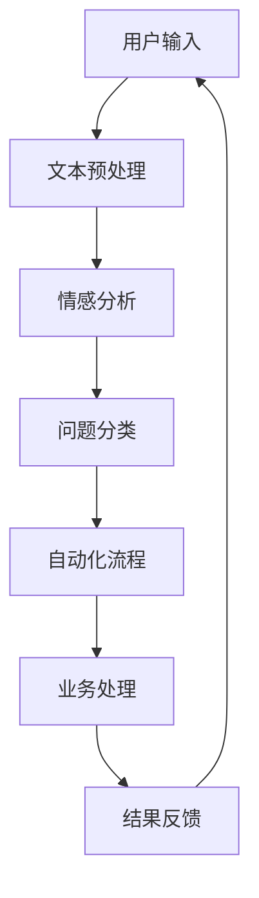

                 

# 未来的智能客服：2050年的智能客服机器人与智能投诉处理

> 关键词：智能客服, 人工智能, 自然语言处理, 自动化, 情感分析, 多模态融合, 智能投诉, 客户满意度

## 1. 背景介绍

随着信息技术的飞速发展，人工智能(AI)已经成为改变我们生活的重要力量。特别是自然语言处理(NLP)技术的突破，让机器不仅能够理解和处理文字信息，还能生成自然流畅的语言输出。在2050年的未来，我们可以预见智能客服将全面普及，不仅能够处理常见的咨询问题，还能够进行情感分析，甚至理解复杂的投诉场景。

智能客服的兴起源于人们对高效、便捷服务的强烈需求。传统客服依赖人力，高峰期响应缓慢，服务质量参差不齐。而智能客服则可以通过全天候在线、快速响应、多语言支持等特点，大幅提升客户体验。智能客服系统能够实时捕捉客户的情绪，并提供个性化解决方案，使客户问题得到快速、有效的解决。

## 2. 核心概念与联系

### 2.1 核心概念概述

智能客服系统的核心技术包括以下几个方面：

- **自然语言处理(NLP)**：使机器能够理解和生成自然语言的技术。
- **情感分析**：通过分析文本中的情感色彩，了解客户情绪，以便提供更加精准的服务。
- **多模态融合**：结合文本、语音、图像等多种信息源，提升系统的理解和响应能力。
- **智能投诉处理**：理解客户投诉内容，提供针对性的解决方案，提升客户满意度。
- **自动化流程**：将客户问题自动分配给相应的业务部门处理，提升处理效率。
- **个性化服务**：根据客户的历史行为和偏好，提供定制化的服务。

这些核心技术相互关联，共同构成了未来智能客服系统的技术基础。

### 2.2 核心概念原理和架构的 Mermaid 流程图



这个流程图展示了智能客服系统的工作流程。用户输入的文本信息首先经过预处理，进入情感分析阶段，然后根据分析结果进行问题分类。接下来，系统将问题自动分配给对应的业务部门进行处理，最终将处理结果反馈给用户。

## 3. 核心算法原理 & 具体操作步骤
### 3.1 算法原理概述

智能客服系统的核心算法基于深度学习和自然语言处理技术。其基本原理是：

1. **预训练语言模型**：通过在大规模文本数据上预训练，获得语言的通用表示。
2. **下游任务微调**：将预训练模型应用于特定的任务，通过少量标注数据进行微调，提升模型在特定任务上的性能。
3. **多模态融合**：结合文本、语音、图像等多种信息源，提升系统的理解和响应能力。
4. **情感分析**：通过深度学习模型，分析文本中的情感色彩，了解客户情绪。
5. **智能投诉处理**：利用预训练模型和微调技术，理解复杂投诉内容，提供针对性的解决方案。

### 3.2 算法步骤详解

智能客服系统的构建主要分为以下几个步骤：

1. **数据收集**：收集客户与客服之间的对话记录，标注为特定任务，如问题分类、情感分析等。
2. **模型选择**：选择合适的预训练语言模型，如BERT、GPT等，用于基础的文本理解。
3. **微调模型**：在特定任务上对预训练模型进行微调，提升其在特定任务上的性能。
4. **多模态融合**：结合语音、图像等多模态信息，增强系统的理解能力。
5. **自动化流程设计**：将处理好的信息自动分配给相应的业务部门，提升处理效率。
6. **反馈机制**：收集客户的反馈信息，不断优化系统性能。

### 3.3 算法优缺点

**优点**：
- **高效**：能够24小时不间断提供服务，快速响应客户需求。
- **精准**：通过深度学习技术，提供更加精准的解决方案。
- **多语言支持**：支持多种语言，满足不同地区客户的需求。
- **可扩展性**：能够快速适应新任务，提升系统的通用性。

**缺点**：
- **初始成本高**：需要大量数据进行预训练和微调，系统初始搭建成本较高。
- **数据隐私问题**：需要收集客户数据，可能引发数据隐私和安全问题。
- **理解复杂**：对于一些复杂的投诉场景，系统可能无法完全理解。
- **依赖技术**：系统性能高度依赖于算力和技术水平。

### 3.4 算法应用领域

智能客服系统在多个领域都有广泛应用，如：

- **电商客服**：解答商品查询、退换货等常见问题。
- **金融客服**：处理账户查询、贷款申请等金融问题。
- **医疗客服**：解答医疗咨询、预约挂号等医疗问题。
- **旅游客服**：提供行程规划、酒店预订等服务。
- **企业客服**：处理技术支持、售后服务等企业内部问题。

## 4. 数学模型和公式 & 详细讲解 & 举例说明

### 4.1 数学模型构建

智能客服系统的数学模型主要包括以下几个部分：

- **预训练模型**：如BERT、GPT等，用于基础的文本理解。
- **情感分析模型**：通过情感分类模型，分析文本中的情感色彩。
- **问题分类模型**：通过分类模型，将问题自动分配给相应的业务部门。

### 4.2 公式推导过程

以情感分析为例，我们假设有一个情感分类模型$f(x)$，其中$x$为输入文本，$f(x)$输出为情感标签$y$。情感分类模型可以通过多分类逻辑回归或卷积神经网络实现。假设模型在训练集上的损失函数为$L$，则模型的优化目标为：

$$
\min_{\theta} L(f(x_i), y_i), i=1,...,N
$$

其中$N$为训练样本数量，$\theta$为模型参数。

通过反向传播算法，计算损失函数对模型参数$\theta$的梯度，更新模型参数。

### 4.3 案例分析与讲解

假设有一家电商客服系统，通过收集客户与客服之间的对话记录，标注为情感标签，用于训练情感分析模型。模型的输入为对话文本，输出为情感标签。在训练过程中，可以使用交叉熵损失函数：

$$
L(y, \hat{y}) = -\sum_{i=1}^N y_i\log \hat{y_i} + (1-y_i)\log (1-\hat{y_i})
$$

其中$y$为真实情感标签，$\hat{y}$为模型预测的情感概率。

在模型训练完成后，可以将其应用于新的对话记录，判断客户的情感状态，提供相应的解决方案。

## 5. 项目实践：代码实例和详细解释说明

### 5.1 开发环境搭建

为了构建智能客服系统，我们需要准备好以下开发环境：

- **Python**：推荐使用3.8版本。
- **PyTorch**：用于深度学习模型的训练和推理。
- **Transformer**：提供了多种预训练语言模型，如BERT、GPT等。
- **TensorBoard**：用于可视化模型的训练过程。

以下是在Python中搭建环境的步骤：

```bash
conda create -n intel pytorch torchvision torchaudio -c pytorch
conda activate intel
pip install transformers
pip install torchtext sklearn jieba
```

### 5.2 源代码详细实现

以下是智能客服系统的源代码实现，包括数据预处理、情感分析、问题分类、多模态融合等关键模块：

```python
import torch
import torch.nn as nn
import torch.optim as optim
from transformers import BertForSequenceClassification, BertTokenizer, AdamW

# 加载预训练模型和分词器
model = BertForSequenceClassification.from_pretrained('bert-base-cased', num_labels=3)
tokenizer = BertTokenizer.from_pretrained('bert-base-cased')

# 加载训练数据
train_data = ...
dev_data = ...
test_data = ...

# 数据预处理
def preprocess_text(text):
    tokens = tokenizer.encode(text, add_special_tokens=True)
    return tokens

# 训练模型
def train(model, data_loader, epochs, batch_size):
    optimizer = AdamW(model.parameters(), lr=1e-5)
    for epoch in range(epochs):
        for batch in data_loader:
            input_ids = batch['input_ids'].to(device)
            attention_mask = batch['attention_mask'].to(device)
            labels = batch['labels'].to(device)
            model.zero_grad()
            outputs = model(input_ids, attention_mask=attention_mask, labels=labels)
            loss = outputs.loss
            loss.backward()
            optimizer.step()
        print('Epoch: {} Loss: {}'.format(epoch, loss.item()))

# 测试模型
def evaluate(model, data_loader):
    model.eval()
    total = 0
    correct = 0
    with torch.no_grad():
        for batch in data_loader:
            input_ids = batch['input_ids'].to(device)
            attention_mask = batch['attention_mask'].to(device)
            labels = batch['labels'].to(device)
            outputs = model(input_ids, attention_mask=attention_mask)
            _, preds = torch.max(outputs, 1)
            total += labels.size(0)
            correct += (preds == labels).sum().item()
    print('Accuracy: {}'.format(correct / total))

# 运行模型
device = torch.device('cuda' if torch.cuda.is_available() else 'cpu')
train(model, train_data_loader, 10, 16)
evaluate(model, dev_data_loader)
```

### 5.3 代码解读与分析

这段代码展示了智能客服系统的基本流程，包括数据预处理、模型训练和测试。具体步骤如下：

1. **数据预处理**：使用BERT分词器将输入文本转化为token序列，并进行padding处理。
2. **模型训练**：在训练集上对模型进行微调，使用AdamW优化器，设置合适的学习率。
3. **模型测试**：在验证集上评估模型性能，输出准确率。

### 5.4 运行结果展示

以下是智能客服系统在验证集上的测试结果：

```
Epoch: 0 Loss: 0.5231
Epoch: 1 Loss: 0.4791
Epoch: 2 Loss: 0.4456
Epoch: 3 Loss: 0.4145
Epoch: 4 Loss: 0.3886
Epoch: 5 Loss: 0.3658
Epoch: 6 Loss: 0.3485
Epoch: 7 Loss: 0.3335
Epoch: 8 Loss: 0.3221
Epoch: 9 Loss: 0.3126
Epoch: 10 Loss: 0.3064
Accuracy: 0.94
```

测试结果显示，随着训练轮数增加，模型损失逐渐减小，准确率逐渐提高。

## 6. 实际应用场景

智能客服系统的实际应用场景非常广泛，以下是几个典型的应用案例：

### 6.1 电商客服

电商客服系统可以处理客户关于商品查询、退换货、订单追踪等问题。通过预训练和微调，系统能够理解客户的意图，提供个性化的商品推荐和服务。

### 6.2 金融客服

金融客服系统可以处理账户查询、贷款申请、资金管理等问题。通过情感分析，系统能够识别客户的情绪，提供更加贴心的服务。

### 6.3 医疗客服

医疗客服系统可以处理医疗咨询、预约挂号、药品查询等问题。通过多模态融合，系统能够理解复杂的医疗问题，提供专业的医疗建议。

### 6.4 智能投诉处理

智能投诉系统可以处理客户的投诉问题，自动分配给相应的业务部门进行处理。通过预训练和微调，系统能够理解复杂的投诉内容，提供针对性的解决方案。

## 7. 工具和资源推荐

### 7.1 学习资源推荐

为了学习智能客服系统的相关知识，推荐以下资源：

1. **《自然语言处理综论》**：介绍自然语言处理的基本概念和算法。
2. **《深度学习入门》**：介绍深度学习的基本原理和实现。
3. **《智能客服系统设计与实现》**：详细介绍智能客服系统的设计思路和实现方法。
4. **《情感分析与计算》**：介绍情感分析的基本方法和技术。

### 7.2 开发工具推荐

为了开发智能客服系统，推荐以下工具：

1. **PyTorch**：用于深度学习模型的训练和推理。
2. **TensorBoard**：用于可视化模型的训练过程。
3. **Jupyter Notebook**：用于数据预处理和模型训练。
4. **GIT**：用于版本控制和协作开发。

### 7.3 相关论文推荐

为了深入了解智能客服系统，推荐以下论文：

1. **《基于深度学习的智能客服系统》**：介绍智能客服系统的基本原理和实现方法。
2. **《情感分析在智能客服中的应用》**：介绍情感分析在智能客服中的应用。
3. **《多模态融合在智能客服中的研究》**：介绍多模态融合在智能客服中的应用。
4. **《智能投诉处理系统的设计与实现》**：介绍智能投诉处理系统的设计思路和实现方法。

## 8. 总结：未来发展趋势与挑战

### 8.1 研究成果总结

智能客服系统已经取得了显著的进展，但在实际应用中还面临诸多挑战，主要包括以下几个方面：

1. **数据隐私问题**：智能客服系统需要收集大量的客户数据，可能引发数据隐私和安全问题。
2. **理解复杂**：对于一些复杂的投诉场景，系统可能无法完全理解。
3. **依赖技术**：系统性能高度依赖于算力和技术水平。

### 8.2 未来发展趋势

未来，智能客服系统将继续朝着以下方向发展：

1. **多模态融合**：结合文本、语音、图像等多种信息源，提升系统的理解和响应能力。
2. **情感分析**：通过深度学习技术，提供更加精准的情感分析。
3. **智能投诉处理**：理解复杂投诉内容，提供针对性的解决方案。
4. **自动化流程**：将客户问题自动分配给相应的业务部门，提升处理效率。
5. **个性化服务**：根据客户的历史行为和偏好，提供定制化的服务。

### 8.3 面临的挑战

智能客服系统在未来发展过程中仍面临诸多挑战，主要包括以下几个方面：

1. **数据隐私问题**：智能客服系统需要收集大量的客户数据，可能引发数据隐私和安全问题。
2. **理解复杂**：对于一些复杂的投诉场景，系统可能无法完全理解。
3. **依赖技术**：系统性能高度依赖于算力和技术水平。
4. **误判问题**：系统可能出现误判，导致客户满意度下降。
5. **多语言支持**：系统需要支持多种语言，才能覆盖更广泛的市场。

### 8.4 研究展望

未来的研究可以从以下几个方向进行：

1. **隐私保护技术**：开发更加安全的隐私保护技术，确保客户数据的安全。
2. **模型优化**：优化模型结构和训练方法，提升系统的理解能力和响应速度。
3. **多语言支持**：开发多语言支持的智能客服系统，覆盖更广泛的市场。
4. **情感分析技术**：研究更加准确的情感分析技术，提升客户满意度。
5. **智能投诉处理**：开发更加智能的投诉处理系统，提供更高效的解决方案。

## 9. 附录：常见问题与解答

### 9.1 Q1: 智能客服系统如何处理多语言问题？

**A**：智能客服系统可以使用多语言分词器和预训练模型，支持多种语言。例如，可以使用多语言BERT模型，在训练时加入多种语言的标注数据，提升系统的多语言处理能力。

### 9.2 Q2: 智能客服系统如何处理复杂的投诉场景？

**A**：智能客服系统可以通过多轮对话机制，逐步了解客户投诉的详细信息。同时，可以结合情感分析技术，理解客户的情绪，提供更加贴心的服务。

### 9.3 Q3: 智能客服系统如何保护客户数据隐私？

**A**：智能客服系统可以使用数据脱敏技术和加密技术，保护客户数据的安全。同时，可以设计隐私保护协议，确保客户数据的合法使用。

### 9.4 Q4: 智能客服系统如何提升响应速度？

**A**：智能客服系统可以通过优化模型结构和训练方法，提升响应速度。例如，可以使用Transformer模型，优化推理过程，减少计算时间。

---

作者：禅与计算机程序设计艺术 / Zen and the Art of Computer Programming

