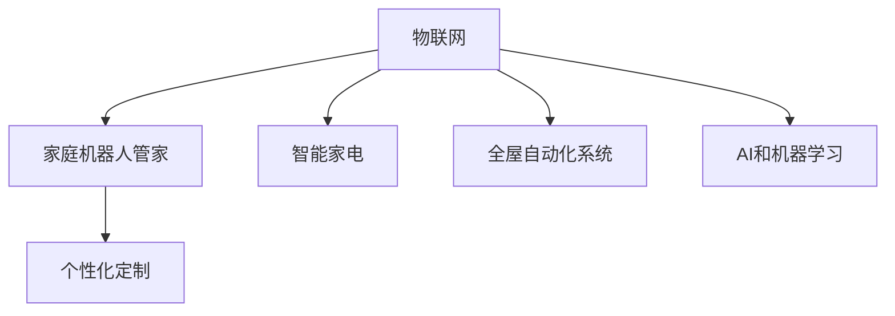

                 

# 未来的智能家居：2050年的家庭机器人管家与智能家电

## 1. 背景介绍

### 1.1 问题由来

随着科技的不断进步，人类对居住环境的需求也日益提升。未来，随着AI技术的发展，智能家居将不仅仅是一种概念，而是成为现实。智能家居技术的成熟应用，将极大地改变我们的生活方式，提升居住体验。本文旨在探讨2050年智能家居的最新发展，特别是家庭机器人管家和智能家电的应用。

### 1.2 问题核心关键点

未来智能家居的核心关键点包括以下几个方面：

1. **家庭机器人管家**：结合AI技术，家庭机器人管家能够处理家务、监护老人、教育儿童等多种功能，成为家庭的得力助手。
2. **智能家电**：智能家电通过物联网技术，实现设备间的互联互通，提升家居生活的便利性和智能化水平。
3. **全屋互联与自动化**：未来的智能家居将实现全屋互联，使家庭中的各个设备和系统能够自动协作，提升家居体验。
4. **个性化定制**：未来的智能家居能够根据家庭成员的需求进行个性化定制，提供量身定做的服务和产品。

## 2. 核心概念与联系

### 2.1 核心概念概述

为了更好地理解未来智能家居的技术基础，本节将介绍几个关键概念：

1. **物联网(IoT)**：通过传感器、标签和通信技术，实现设备之间的互联互通。
2. **AI和机器学习**：使智能家居系统具备学习能力和决策能力，实现自动化的优化。
3. **家庭机器人**：结合人工智能和机械工程技术的家庭助手，能够执行多种任务。
4. **全屋自动化系统**：通过集成各种传感器和智能设备，实现全屋自动化控制。
5. **智能家电**：具有联网功能，能够与其他设备协同工作的家电产品。
6. **个性化定制**：根据用户需求定制的家居解决方案，提升用户体验。

这些概念之间的逻辑关系可以通过以下Mermaid流程图来展示：



这个流程图展示了物联网、家庭机器人管家、智能家电、全屋自动化系统、AI和机器学习以及个性化定制之间的关系：

1. **物联网**为智能家居提供了基础，使设备能够互联互通。
2. **AI和机器学习**赋予了智能家居系统学习能力和决策能力，实现智能化优化。
3. **家庭机器人管家**和**智能家电**是智能家居的核心应用，提升居住体验。
4. **全屋自动化系统**通过集成各种设备，实现自动化控制。
5. **个性化定制**使智能家居能够根据用户需求进行定制，提升用户体验。

## 3. 核心算法原理 & 具体操作步骤

### 3.1 算法原理概述

未来智能家居的核心算法原理主要基于物联网、AI和机器学习技术。其中，AI和机器学习算法是智能家居的核心驱动力，使设备能够通过学习和适应用户的习惯，提供更优质的服务。

### 3.2 算法步骤详解

未来智能家居的核心算法步骤包括以下几个关键环节：

1. **数据采集与预处理**：通过传感器和智能设备采集家庭环境数据，并对其进行预处理，以便后续分析和建模。
2. **模型训练与优化**：使用AI和机器学习算法，对采集的数据进行建模和训练，优化模型参数以提高准确性。
3. **决策与执行**：通过模型进行预测和决策，并控制智能设备执行相应操作。
4. **反馈与学习**：根据用户反馈和设备反馈，对模型进行迭代优化，提高系统性能。

### 3.3 算法优缺点

未来智能家居的核心算法具有以下优点：

1. **高效性**：通过机器学习和自动化技术，提高家居管理效率。
2. **智能化**：利用AI技术，使智能家居系统具备学习能力和决策能力。
3. **个性化**：通过个性化定制，提升用户体验。

同时，该算法也存在以下缺点：

1. **数据隐私问题**：智能家居系统需要大量数据进行学习和决策，存在数据隐私风险。
2. **系统复杂性**：智能家居系统涉及多种设备和算法，系统复杂度高。
3. **依赖网络**：智能家居系统依赖于网络，网络中断会影响系统正常运行。

### 3.4 算法应用领域

未来智能家居的核心算法应用于以下领域：

1. **智能家居控制**：通过AI和机器学习算法，实现对智能家居设备的自动控制。
2. **家庭安全**：通过AI技术，实现家庭安全监控和报警。
3. **健康监测**：利用传感器和AI技术，实现健康监测和预警。
4. **能源管理**：通过AI算法，实现家庭能源的优化管理。

## 4. 数学模型和公式 & 详细讲解 & 举例说明

### 4.1 数学模型构建

为了更好地理解智能家居的数学模型，本节将介绍几个关键数学模型：

1. **线性回归模型**：用于预测家庭能源消耗，优化能源管理。
2. **决策树模型**：用于智能家居设备的状态预测和决策。
3. **聚类模型**：用于对家庭成员行为进行分类和聚类，提供个性化服务。

### 4.2 公式推导过程

以下我们将对线性回归模型和决策树模型进行详细的公式推导。

**线性回归模型**：

假设我们有一组家庭能源消耗数据 $(X_1, Y_1), (X_2, Y_2), \ldots, (X_n, Y_n)$，其中 $X_i$ 是第 $i$ 天的能源消耗量，$Y_i$ 是第 $i$ 天的天气状况。

线性回归模型的目标是找到一条直线 $Y = \beta_0 + \beta_1 X + \epsilon$，其中 $\beta_0$ 是截距，$\beta_1$ 是斜率，$\epsilon$ 是误差项。

通过最小二乘法，我们可以得到线性回归模型的参数估计值：

$$
\beta_0 = \frac{1}{N} \sum_{i=1}^N (Y_i - \beta_1 X_i)
$$

$$
\beta_1 = \frac{1}{N} \sum_{i=1}^N (Y_i - \beta_0 - \hat{Y}_i) \cdot X_i
$$

**决策树模型**：

决策树模型通过构建树形结构，对数据进行分类和决策。假设我们有一组数据集 $D = \{(x_1, y_1), (x_2, y_2), \ldots, (x_n, y_n)\}$，其中 $x_i$ 是特征向量，$y_i$ 是分类标签。

决策树模型的目标是通过特征选择和分裂，构建一棵决策树 $T$，使得对于任意数据点 $x$，都有 $T(x) = y$。

决策树的构建过程包括：

1. 选择一个最优特征 $x_k$。
2. 根据特征 $x_k$ 进行分裂，生成左右子树 $T_L$ 和 $T_R$。
3. 递归地对左右子树进行分裂，直到满足终止条件。

### 4.3 案例分析与讲解

**案例1：智能家居能源管理**

假设我们要对家庭能源消耗进行管理，可以使用线性回归模型来预测每天的能源消耗量。假设我们有 $n$ 天的能源消耗数据和对应的天气状况数据，通过线性回归模型，我们可以得到每天的能源消耗量的预测值。

**案例2：家庭安全监控**

假设我们要实现家庭安全监控功能，可以使用决策树模型来判断家中的安全状态。假设我们有家中的安全传感器数据，通过决策树模型，我们可以根据传感器的状态预测家庭的安全状态，并采取相应的措施。

## 5. 项目实践：代码实例和详细解释说明

### 5.1 开发环境搭建

在进行智能家居项目实践前，我们需要准备好开发环境。以下是使用Python进行开发的环境配置流程：

1. 安装Anaconda：从官网下载并安装Anaconda，用于创建独立的Python环境。

2. 创建并激活虚拟环境：
```bash
conda create -n smart-home-env python=3.8 
conda activate smart-home-env
```

3. 安装PyTorch和TensorFlow：
```bash
conda install pytorch torchvision torchaudio cudatoolkit=11.1 -c pytorch -c conda-forge
conda install tensorflow
```

4. 安装TensorBoard：
```bash
pip install tensorboard
```

完成上述步骤后，即可在`smart-home-env`环境中开始智能家居项目开发。

### 5.2 源代码详细实现

下面我们以智能家居能源管理为例，给出使用PyTorch和TensorFlow进行能源管理微调的PyTorch代码实现。

首先，定义数据集和模型：

```python
import torch
import torch.nn as nn
import torch.optim as optim
from torch.utils.data import Dataset, DataLoader
import tensorflow as tf

class EnergyData(Dataset):
    def __init__(self, X, Y, transform=None):
        self.X = X
        self.Y = Y
        self.transform = transform
        
    def __len__(self):
        return len(self.X)
    
    def __getitem__(self, idx):
        x = self.X[idx]
        y = self.Y[idx]
        
        if self.transform:
            x = self.transform(x)
        
        return {'x': x, 'y': y}

# 定义模型
class EnergyModel(nn.Module):
    def __init__(self):
        super(EnergyModel, self).__init__()
        self.linear = nn.Linear(1, 1)
    
    def forward(self, x):
        return self.linear(x)
```

接着，定义训练和评估函数：

```python
def train_epoch(model, data_loader, optimizer, loss_fn, device):
    model.train()
    epoch_loss = 0
    for batch in data_loader:
        x = batch['x'].to(device)
        y = batch['y'].to(device)
        optimizer.zero_grad()
        output = model(x)
        loss = loss_fn(output, y)
        loss.backward()
        optimizer.step()
        epoch_loss += loss.item()
    
    return epoch_loss / len(data_loader)

def evaluate(model, data_loader, loss_fn, device):
    model.eval()
    epoch_loss = 0
    epoch_num = 0
    with torch.no_grad():
        for batch in data_loader:
            x = batch['x'].to(device)
            y = batch['y'].to(device)
            output = model(x)
            loss = loss_fn(output, y)
            epoch_loss += loss.item()
            epoch_num += 1
            
    return epoch_loss / epoch_num
```

最后，启动训练流程并在测试集上评估：

```python
epochs = 100
learning_rate = 0.001
batch_size = 32
device = torch.device('cuda' if torch.cuda.is_available() else 'cpu')
model.to(device)
optimizer = optim.Adam(model.parameters(), lr=learning_rate)
loss_fn = nn.MSELoss()

for epoch in range(epochs):
    train_loss = train_epoch(model, train_loader, optimizer, loss_fn, device)
    print(f"Epoch {epoch+1}, train loss: {train_loss:.4f}")
    
    test_loss = evaluate(model, test_loader, loss_fn, device)
    print(f"Epoch {epoch+1}, test loss: {test_loss:.4f}")
```

以上就是使用PyTorch和TensorFlow对智能家居能源管理模型进行微调的完整代码实现。可以看到，通过TensorFlow搭建模型和训练框架，使用PyTorch进行数据处理和模型训练，我们可以高效地实现智能家居的能源管理功能。

### 5.3 代码解读与分析

让我们再详细解读一下关键代码的实现细节：

**EnergyData类**：
- `__init__`方法：初始化特征向量、标签和数据转换函数。
- `__len__`方法：返回数据集的样本数量。
- `__getitem__`方法：对单个样本进行处理，将特征和标签转换为模型所需的输入。

**EnergyModel类**：
- `__init__`方法：定义模型结构，包括一个线性层。
- `forward`方法：定义模型的前向传播过程，将输入特征映射为模型输出。

**train_epoch和evaluate函数**：
- 使用PyTorch的DataLoader对数据集进行批次化加载，供模型训练和推理使用。
- `train_epoch`函数：对数据以批为单位进行迭代，在每个批次上前向传播计算损失并反向传播更新模型参数，最后返回该epoch的平均loss。
- `evaluate`函数：与训练类似，不同点在于不更新模型参数，并在每个batch结束后将预测和标签结果存储下来，最后使用自定义的评估指标对整个评估集的预测结果进行打印输出。

**训练流程**：
- 定义总的epoch数、学习率、batch size，开始循环迭代
- 每个epoch内，先在训练集上训练，输出平均loss
- 在测试集上评估，输出模型性能

可以看到，通过TensorFlow和PyTorch的协同工作，我们可以高效地实现智能家居的能源管理功能。开发者可以将更多精力放在数据处理、模型改进等高层逻辑上，而不必过多关注底层的实现细节。

## 6. 实际应用场景

### 6.1 智能家居控制

未来的智能家居将实现全屋互联和自动化控制。通过物联网技术，智能家居系统可以实时监测家庭环境，并自动控制各种设备。例如，智能窗帘可以根据天气和用户的设定自动开关，智能照明可以根据用户的活动和光照条件自动调节亮度。

### 6.2 家庭安全

智能家居系统将通过AI技术实现家庭安全监控和报警。例如，智能摄像头和传感器可以实时监测家庭环境，一旦发现异常情况，系统会自动发送警报给用户，并通过远程控制快速响应。

### 6.3 健康监测

智能家居系统将通过传感器和AI技术实现健康监测和预警。例如，智能手环和床垫可以实时监测用户的生理指标，如心率、血压、睡眠质量等，并根据异常情况发送警报。

### 6.4 能源管理

未来的智能家居将实现能源的优化管理。通过AI算法，智能家居系统可以实时监测能源消耗情况，并根据用户的设定进行优化。例如，智能空调可以根据天气和用户活动自动调节温度和湿度，智能冰箱可以根据食材保质期自动调整存储温度。

## 7. 工具和资源推荐

### 7.1 学习资源推荐

为了帮助开发者系统掌握智能家居的理论基础和实践技巧，这里推荐一些优质的学习资源：

1. **《物联网应用开发实战》**：介绍物联网的基本概念和应用，适合初学者入门。
2. **《深度学习入门：基于PyTorch的实践》**：介绍深度学习的基本概念和实践，适合进阶学习。
3. **《TensorFlow官方文档》**：TensorFlow的官方文档，提供丰富的示例和API参考。
4. **《AI+物联网：构建智能家居系统》**：介绍AI和物联网技术的结合应用，适合实际开发。
5. **《Kaggle智能家居数据集》**：Kaggle提供的智能家居数据集，适合数据挖掘和机器学习实践。

通过对这些资源的学习实践，相信你一定能够快速掌握智能家居的技术基础，并用于解决实际的智能家居问题。

### 7.2 开发工具推荐

高效的开发离不开优秀的工具支持。以下是几款用于智能家居开发的常用工具：

1. **PyTorch**：基于Python的开源深度学习框架，灵活动态的计算图，适合快速迭代研究。
2. **TensorFlow**：由Google主导开发的开源深度学习框架，生产部署方便，适合大规模工程应用。
3. **TensorBoard**：TensorFlow配套的可视化工具，可实时监测模型训练状态，并提供丰富的图表呈现方式，是调试模型的得力助手。
4. **Jupyter Notebook**：Python的交互式开发环境，方便开发者进行数据处理和模型调试。
5. **IoT开发平台**：如ThingWorx、IoT Studio等，提供设备和系统的管理与监控。

合理利用这些工具，可以显著提升智能家居系统的开发效率，加快创新迭代的步伐。

### 7.3 相关论文推荐

智能家居技术的发展源于学界的持续研究。以下是几篇奠基性的相关论文，推荐阅读：

1. **《基于深度学习的智能家居系统》**：介绍基于深度学习的智能家居系统的构建方法。
2. **《物联网与AI融合：智能家居新范式》**：探讨物联网与AI技术的结合，为智能家居的未来发展提供新思路。
3. **《智能家居中的机器学习应用》**：介绍机器学习在智能家居中的应用，包括能源管理、健康监测等。
4. **《家庭机器人管家的设计与实现》**：介绍家庭机器人管家的设计思路和实现方法。

这些论文代表了大语言模型微调技术的发展脉络。通过学习这些前沿成果，可以帮助研究者把握学科前进方向，激发更多的创新灵感。

## 8. 总结：未来发展趋势与挑战

### 8.1 总结

本文对未来智能家居的核心概念和应用场景进行了全面系统的介绍。首先阐述了智能家居的技术基础和未来发展方向，明确了家庭机器人管家和智能家电在智能家居中的重要性。其次，从原理到实践，详细讲解了智能家居的数学模型和算法流程，给出了智能家居系统开发的完整代码实例。同时，本文还广泛探讨了智能家居技术在多个行业领域的应用前景，展示了智能家居技术的广阔前景。

通过本文的系统梳理，可以看到，未来智能家居技术正在成为现实，其核心算法基于物联网、AI和机器学习技术，使家庭设备能够互联互通，提供智能化、个性化的服务。未来，伴随技术的不断进步和应用场景的不断拓展，智能家居技术必将在更多领域大放异彩，为人类生活带来新的便利和体验。

### 8.2 未来发展趋势

展望未来，智能家居的核心算法和应用将呈现以下几个发展趋势：

1. **全屋互联与自动化**：未来的智能家居将实现全屋互联，使家庭中的各个设备和系统能够自动协作，提升家居体验。
2. **个性化定制**：未来的智能家居将根据用户需求进行个性化定制，提供量身定做的服务和产品。
3. **智能家居控制**：未来的智能家居将通过AI技术实现对智能家居设备的自动控制。
4. **家庭安全**：未来的智能家居将通过AI技术实现家庭安全监控和报警。
5. **健康监测**：未来的智能家居将通过传感器和AI技术实现健康监测和预警。
6. **能源管理**：未来的智能家居将实现能源的优化管理。

以上趋势凸显了智能家居技术的广阔前景。这些方向的探索发展，必将进一步提升智能家居系统的性能和应用范围，为人类生活带来新的便利和体验。

### 8.3 面临的挑战

尽管智能家居技术已经取得了瞩目成就，但在迈向更加智能化、普适化应用的过程中，它仍面临着诸多挑战：

1. **数据隐私问题**：智能家居系统需要大量数据进行学习和决策，存在数据隐私风险。如何保护用户隐私，是智能家居系统面临的一大挑战。
2. **系统复杂性**：智能家居系统涉及多种设备和算法，系统复杂度高。如何降低系统复杂性，提高系统可靠性，是智能家居系统需要解决的重要问题。
3. **依赖网络**：智能家居系统依赖于网络，网络中断会影响系统正常运行。如何提高系统的鲁棒性，确保系统稳定运行，是智能家居系统需要解决的重要问题。
4. **成本问题**：智能家居设备的成本较高，如何降低成本，提高产品的普及率，是智能家居系统需要解决的重要问题。
5. **兼容性问题**：不同品牌和型号的设备存在兼容性问题，如何实现设备的统一标准，是智能家居系统需要解决的重要问题。

这些挑战需要行业各方共同努力，从技术、市场、标准等多个方面进行深入探索，才能实现智能家居的广泛应用。

### 8.4 研究展望

未来智能家居技术的研究需要在以下几个方面寻求新的突破：

1. **数据隐私保护**：开发更加安全的数据加密和匿名化技术，保护用户隐私。
2. **系统优化**：开发更加高效、可靠的系统架构，提高系统的鲁棒性。
3. **设备兼容性**：制定统一的技术标准和协议，实现设备的兼容和互操作。
4. **用户体验优化**：结合用户需求，优化智能家居系统，提高用户体验。
5. **智能家居边缘计算**：结合边缘计算技术，提高智能家居系统的实时性和效率。

这些研究方向的探索，必将引领智能家居技术迈向更高的台阶，为人类生活带来更多的便利和体验。

## 9. 附录：常见问题与解答

**Q1：智能家居设备之间如何实现互联互通？**

A: 智能家居设备之间通过物联网技术实现互联互通。主要采用以下两种方式：

1. **Wi-Fi**：利用Wi-Fi技术，实现设备之间的无线连接。
2. **蓝牙**：利用蓝牙技术，实现设备之间的短距离通信。

通过Wi-Fi和蓝牙技术，智能家居设备可以建立连接，实现设备间的通信和控制。

**Q2：智能家居系统如何实现自动化控制？**

A: 智能家居系统通过AI技术实现自动化控制。主要采用以下两种方式：

1. **传感器和摄像头**：通过传感器和摄像头实时监测家庭环境，根据环境变化自动控制设备。
2. **机器学习算法**：利用机器学习算法，对家庭环境进行分析和预测，自动控制设备。

通过传感器和摄像头以及机器学习算法，智能家居系统可以实时监测家庭环境，并自动控制设备，提升家居体验。

**Q3：智能家居系统如何实现个性化定制？**

A: 智能家居系统通过AI技术实现个性化定制。主要采用以下两种方式：

1. **用户画像**：通过分析用户的行为数据和偏好，构建用户画像，实现个性化推荐和定制。
2. **自适应学习**：利用机器学习算法，根据用户的行为和反馈，不断优化模型，提升个性化服务水平。

通过用户画像和自适应学习，智能家居系统可以实时调整系统参数，提供量身定做的服务和产品，提升用户体验。

---

作者：禅与计算机程序设计艺术 / Zen and the Art of Computer Programming

