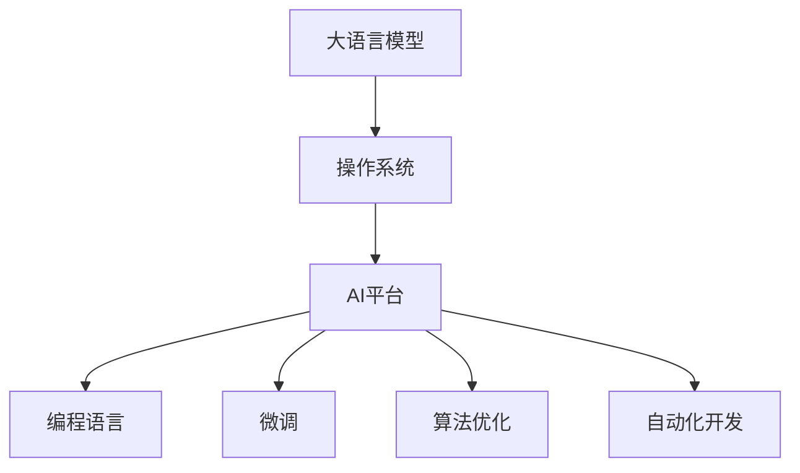

                 

# 构建下一代AI平台：LLM操作系统的愿景

> 关键词：大语言模型(LLM), 操作系统(OS), AI平台, 编程语言, 微调(Fine-Tuning), 算法优化, 自动化开发

## 1. 背景介绍

### 1.1 问题由来
随着人工智能(AI)技术的不断进步，特别是大语言模型(Large Language Model, LLM)的崛起，AI技术正逐步从研究实验室走向产业落地。然而，现有的大语言模型系统仍存在许多限制，难以满足实际应用场景的需求。

当前，大语言模型系统主要集中在特定应用场景，如文本生成、问答系统、翻译等，这些系统往往缺乏通用性和可扩展性，难以应对多变复杂的应用需求。同时，大多数系统依赖手动部署和配置，自动化程度低，维护成本高，难以快速迭代和优化。

如何构建一个更通用、更高效、更易用的大语言模型系统，成为了AI产业的重要研究方向。构建下一代大语言模型操作系统(Large Language Model Operating System, LLM OS)，将成为实现这一目标的关键突破点。

### 1.2 问题核心关键点
大语言模型操作系统(LLM OS)将大语言模型作为操作系统的主要功能组件，通过操作系统内核层面的优化，提升系统的性能、可扩展性、易用性和安全性。其主要目标包括：

- **通用性**：提供统一API接口，支持多种NLP任务，减少重复开发。
- **可扩展性**：允许开发者快速定制和扩展，满足不同场景下的需求。
- **易用性**：简化开发流程，降低开发门槛，提升工作效率。
- **安全性**：构建安全合规的模型训练和使用机制，避免模型滥用和偏见。
- **高性能**：通过底层优化，提升模型推理和训练速度，降低资源消耗。

本文将围绕上述核心点，阐述LLM OS的构建思路、关键技术以及实际应用场景，旨在为AI产业提供一种全新的架构，加速大语言模型的落地应用。

## 2. 核心概念与联系

### 2.1 核心概念概述

为了更好地理解LLM OS的构建思路，本节将介绍几个核心概念及其相互联系：

- **大语言模型(LLM)**：指通过大规模数据预训练得到的通用语言模型，具备强大的语言理解和生成能力。
- **操作系统(OS)**：计算机硬件和软件资源的统一管理平台，提供高效、安全、可靠的服务。
- **AI平台**：集成了数据、模型、工具和服务的AI应用基础设施。
- **编程语言**：支持AI应用开发的高级语言，如Python、Java等。
- **微调(Fine-Tuning)**：通过少量标注数据，在大规模预训练模型的基础上进行有监督学习，优化模型在特定任务上的性能。
- **算法优化**：通过硬件加速、自动调参等技术，提升模型的推理速度和训练效率。
- **自动化开发**：通过工具链自动化、自动测试等，简化开发流程，提高开发效率。

这些概念通过操作系统内核层面的整合，形成了LLM OS的完整架构。以下是一个简化的Mermaid流程图，展示了这些概念之间的关系：



### 2.2 核心概念原理和架构的 Mermaid 流程图

#### 操作系统内核
操作系统内核是LLM OS的核心，负责管理硬件资源和软件资源的统一调度，提供高效、安全、可靠的服务。其主要包括：

- **进程管理**：管理模型的训练和推理进程，分配计算资源。
- **内存管理**：分配和管理模型的内存空间，支持动态内存分配。
- **文件系统**：管理模型的数据存储和读取，提供高效的数据访问接口。
- **网络管理**：管理模型的网络通信，提供高性能的网络传输服务。
- **设备管理**：管理模型的硬件资源，如GPU、TPU等，提供高性能的计算能力。

#### 大语言模型
大语言模型是LLM OS的主要功能组件，负责处理输入输出，提供高效的自然语言处理服务。其主要包括：

- **预训练模型**：通过大规模无标签数据进行预训练，学习通用的语言表示。
- **微调模型**：在特定任务的少量标注数据上进行微调，优化模型在特定任务上的性能。
- **模型训练**：使用GPU/TPU等高性能设备进行模型训练，加速训练过程。
- **模型推理**：使用GPU/TPU等高性能设备进行模型推理，加速推理过程。

#### AI平台
AI平台是LLM OS的应用层，提供各类AI应用所需的工具和服务，支持开发者高效开发和部署AI应用。其主要包括：

- **API接口**：提供统一API接口，支持多种NLP任务，减少重复开发。
- **开发工具**：提供各种开发工具，如IDE、调试器、代码生成器等，简化开发流程。
- **测试工具**：提供各种测试工具，如单元测试、集成测试、性能测试等，确保应用质量。
- **服务管理**：提供模型和服务的管理工具，支持模型的部署、升级、监控等。

#### 编程语言
编程语言是LLM OS的编程接口，支持开发者高效开发和部署AI应用。其主要包括：

- **高级语言支持**：支持Python、Java等高级语言，提供高效开发环境。
- **低级语言支持**：支持C++等低级语言，提供高性能计算能力。
- **库和框架支持**：提供各种库和框架，如TensorFlow、PyTorch等，加速模型开发和部署。

#### 微调
微调是LLM OS的重要功能，通过少量标注数据，在大规模预训练模型的基础上进行有监督学习，优化模型在特定任务上的性能。其主要包括：

- **数据准备**：准备标注数据集，进行数据增强、标注处理等。
- **模型微调**：在标注数据集上进行微调，优化模型在特定任务上的性能。
- **模型评估**：使用测试集对微调后的模型进行评估，确保模型性能。

#### 算法优化
算法优化是LLM OS的关键技术之一，通过硬件加速、自动调参等技术，提升模型的推理速度和训练效率。其主要包括：

- **硬件加速**：使用GPU/TPU等高性能设备，加速模型推理和训练。
- **自动调参**：通过自动化调参技术，优化模型超参数，提高模型性能。
- **算法优化**：通过优化算法，如Transformer等，提升模型效率。

#### 自动化开发
自动化开发是LLM OS的重要特点，通过工具链自动化、自动测试等，简化开发流程，提高开发效率。其主要包括：

- **工具链自动化**：使用自动化工具链，自动生成代码、编译和部署。
- **自动测试**：使用自动化测试工具，自动进行单元测试、集成测试等。
- **持续集成(CI)**：使用持续集成工具，自动进行代码构建和测试。

## 3. 核心算法原理 & 具体操作步骤

### 3.1 算法原理概述

LLM OS的核心算法原理主要包括以下几个方面：

- **操作系统内核优化**：通过操作系统内核的优化，提升系统的性能、可扩展性、易用性和安全性。
- **大语言模型微调**：通过微调技术，提升模型在特定任务上的性能。
- **算法优化**：通过硬件加速、自动调参等技术，提升模型的推理速度和训练效率。
- **自动化开发**：通过工具链自动化、自动测试等，简化开发流程，提高开发效率。

### 3.2 算法步骤详解

#### 操作系统内核优化

1. **进程管理优化**：通过多进程管理和线程池技术，提升模型的训练和推理效率。
2. **内存管理优化**：通过动态内存分配和回收，减少内存碎片，提高内存利用率。
3. **文件系统优化**：通过高速缓存和持久化存储技术，提升模型的数据读写效率。
4. **网络管理优化**：通过网络带宽优化和数据压缩技术，提升模型的网络通信效率。
5. **设备管理优化**：通过GPU/TPU等高性能设备的优化调度，提升模型的计算能力。

#### 大语言模型微调

1. **数据准备**：准备标注数据集，进行数据增强、标注处理等。
2. **模型微调**：在标注数据集上进行微调，优化模型在特定任务上的性能。
3. **模型评估**：使用测试集对微调后的模型进行评估，确保模型性能。

#### 算法优化

1. **硬件加速**：使用GPU/TPU等高性能设备，加速模型推理和训练。
2. **自动调参**：通过自动化调参技术，优化模型超参数，提高模型性能。
3. **算法优化**：通过优化算法，如Transformer等，提升模型效率。

#### 自动化开发

1. **工具链自动化**：使用自动化工具链，自动生成代码、编译和部署。
2. **自动测试**：使用自动化测试工具，自动进行单元测试、集成测试等。
3. **持续集成(CI)**：使用持续集成工具，自动进行代码构建和测试。

### 3.3 算法优缺点

#### 操作系统内核优化的优点：
1. **性能提升**：通过优化内核，提升系统的性能，加速模型推理和训练。
2. **可扩展性**：通过优化内核，支持大规模模型的部署和扩展。
3. **易用性提升**：通过优化内核，简化开发流程，降低开发门槛。

#### 操作系统内核优化的缺点：
1. **复杂度高**：优化内核需要深入了解硬件和软件资源，复杂度高。
2. **维护成本高**：优化内核需要持续维护，维护成本高。

#### 大语言模型微调的优点：
1. **通用性**：通过微调技术，支持多种NLP任务，减少重复开发。
2. **性能提升**：通过微调技术，提升模型在特定任务上的性能。

#### 大语言模型微调的缺点：
1. **数据需求高**：微调需要大量标注数据，数据获取成本高。
2. **泛化能力有限**：微调模型往往对标注数据集的分布敏感，泛化能力有限。

#### 算法优化的优点：
1. **性能提升**：通过算法优化，提升模型的推理速度和训练效率。
2. **可扩展性**：通过算法优化，支持大规模模型的部署和扩展。

#### 算法优化的缺点：
1. **开发成本高**：算法优化需要深入理解算法原理和硬件架构，开发成本高。
2. **维护成本高**：算法优化需要持续维护，维护成本高。

#### 自动化开发的优点：
1. **开发效率提升**：通过自动化开发，简化开发流程，提升开发效率。
2. **错误率降低**：通过自动化测试，降低错误率，提高应用质量。

#### 自动化开发的缺点：
1. **工具链复杂**：自动化开发需要多种工具和框架的支持，工具链复杂。
2. **依赖性强**：自动化开发依赖于各种工具和框架，依赖性强。

### 3.4 算法应用领域

#### 操作系统内核优化的应用领域：
1. **云计算平台**：通过优化内核，提升云服务的性能和可扩展性。
2. **大数据平台**：通过优化内核，提升大数据处理的效率和可靠性。
3. **物联网设备**：通过优化内核，提升物联网设备的计算能力和响应速度。

#### 大语言模型微调的应用领域：
1. **文本生成**：通过微调模型，生成高质量的文本内容。
2. **问答系统**：通过微调模型，提供高效的问答服务。
3. **翻译系统**：通过微调模型，提供高效的翻译服务。

#### 算法优化的应用领域：
1. **深度学习框架**：通过算法优化，提升深度学习框架的性能和效率。
2. **计算机视觉**：通过算法优化，提升计算机视觉任务的性能和效率。
3. **自然语言处理**：通过算法优化，提升自然语言处理任务的性能和效率。

#### 自动化开发的应用领域：
1. **AI应用开发**：通过自动化开发，加速AI应用开发和部署。
2. **机器人开发**：通过自动化开发，加速机器人开发和部署。
3. **智能家居**：通过自动化开发，加速智能家居系统的开发和部署。

## 4. 数学模型和公式 & 详细讲解  
### 4.1 数学模型构建

为了更好地理解LLM OS的核心算法原理，本节将使用数学语言对LLM OS的构建过程进行更加严格的刻画。

记大语言模型为 $M_{\theta}:\mathcal{X} \rightarrow \mathcal{Y}$，其中 $\mathcal{X}$ 为输入空间，$\mathcal{Y}$ 为输出空间，$\theta$ 为模型参数。假设LLM OS的API接口为 $\mathcal{API}:\mathcal{X} \rightarrow \mathcal{Y}$，用户输入 $\mathcal{X}$ 通过API接口 $\mathcal{API}$ 映射到输出 $\mathcal{Y}$。

#### 操作系统内核优化
操作系统内核优化主要通过以下数学模型进行描述：

1. **进程管理优化**：通过多进程管理和线程池技术，提升模型的训练和推理效率。
2. **内存管理优化**：通过动态内存分配和回收，减少内存碎片，提高内存利用率。
3. **文件系统优化**：通过高速缓存和持久化存储技术，提升模型的数据读写效率。
4. **网络管理优化**：通过网络带宽优化和数据压缩技术，提升模型的网络通信效率。
5. **设备管理优化**：通过GPU/TPU等高性能设备的优化调度，提升模型的计算能力。

#### 大语言模型微调
大语言模型微调主要通过以下数学模型进行描述：

1. **数据准备**：准备标注数据集 $\mathcal{D}=\{(x_i,y_i)\}_{i=1}^N$，进行数据增强、标注处理等。
2. **模型微调**：在标注数据集 $\mathcal{D}$ 上进行微调，优化模型在特定任务上的性能。
3. **模型评估**：使用测试集 $\mathcal{T}$ 对微调后的模型进行评估，确保模型性能。

#### 算法优化
算法优化主要通过以下数学模型进行描述：

1. **硬件加速**：使用GPU/TPU等高性能设备，加速模型推理和训练。
2. **自动调参**：通过自动化调参技术，优化模型超参数，提高模型性能。
3. **算法优化**：通过优化算法，如Transformer等，提升模型效率。

#### 自动化开发
自动化开发主要通过以下数学模型进行描述：

1. **工具链自动化**：使用自动化工具链，自动生成代码、编译和部署。
2. **自动测试**：使用自动化测试工具，自动进行单元测试、集成测试等。
3. **持续集成(CI)**：使用持续集成工具，自动进行代码构建和测试。

### 4.2 公式推导过程

以下我们以二分类任务为例，推导操作系统内核优化和大语言模型微调的数学公式。

假设操作系统内核优化后的进程管理模型为 $M_{\text{procs}}:\mathcal{X} \rightarrow \mathcal{Y}$，内存管理模型为 $M_{\text{mem}}:\mathcal{X} \rightarrow \mathcal{Y}$，文件系统模型为 $M_{\text{fs}}:\mathcal{X} \rightarrow \mathcal{Y}$，网络管理模型为 $M_{\text{net}}:\mathcal{X} \rightarrow \mathcal{Y}$，设备管理模型为 $M_{\text{dev}}:\mathcal{X} \rightarrow \mathcal{Y}$。

#### 进程管理优化
进程管理优化的数学模型如下：

$$
M_{\text{procs}} = f_{\text{procs}}(x) = \frac{1}{N_{\text{threads}}} \sum_{i=1}^{N_{\text{threads}}} M_{\text{thread}}(x_i)
$$

其中，$N_{\text{threads}}$ 为线程池大小，$M_{\text{thread}}$ 为单线程模型。

#### 内存管理优化
内存管理优化的数学模型如下：

$$
M_{\text{mem}} = f_{\text{mem}}(x) = \frac{1}{N_{\text{frag}}} \sum_{i=1}^{N_{\text{frag}}} M_{\text{frag}}(x_i)
$$

其中，$N_{\text{frag}}$ 为动态内存分配块的数量，$M_{\text{frag}}$ 为动态内存分配模型。

#### 文件系统优化
文件系统优化的数学模型如下：

$$
M_{\text{fs}} = f_{\text{fs}}(x) = M_{\text{cache}}(x) + M_{\text{persistence}}(x)
$$

其中，$M_{\text{cache}}$ 为高速缓存模型，$M_{\text{persistence}}$ 为持久化存储模型。

#### 网络管理优化
网络管理优化的数学模型如下：

$$
M_{\text{net}} = f_{\text{net}}(x) = M_{\text{comp}}(x) + M_{\text{rate}}(x)
$$

其中，$M_{\text{comp}}$ 为数据压缩模型，$M_{\text{rate}}$ 为网络带宽优化模型。

#### 设备管理优化
设备管理优化的数学模型如下：

$$
M_{\text{dev}} = f_{\text{dev}}(x) = \frac{1}{N_{\text{gpus}}} \sum_{i=1}^{N_{\text{gpus}}} M_{\text{gpu}}(x_i)
$$

其中，$N_{\text{gpus}}$ 为GPU数量，$M_{\text{gpu}}$ 为GPU加速模型。

#### 大语言模型微调
大语言模型微调的数学模型如下：

$$
M_{\text{model}} = f_{\text{model}}(x) = M_{\text{pretrain}}(x) + M_{\text{fine-tune}}(x)
$$

其中，$M_{\text{pretrain}}$ 为预训练模型，$M_{\text{fine-tune}}$ 为微调模型。

#### 数据准备
数据准备的数学模型如下：

$$
\mathcal{D} = \{(x_i,y_i)\}_{i=1}^N = \{(x_i^\text{prep},y_i^\text{prep})\}_{i=1}^N + \{(x_i^\text{aug},y_i^\text{aug})\}_{i=1}^N
$$

其中，$x_i^\text{prep}$ 为原始数据，$y_i^\text{prep}$ 为原始标签，$x_i^\text{aug}$ 为增强数据，$y_i^\text{aug}$ 为增强标签。

#### 模型微调
模型微调的数学模型如下：

$$
M_{\text{fine-tune}} = f_{\text{fine-tune}}(x) = \frac{1}{N_{\text{epochs}}} \sum_{i=1}^{N_{\text{epochs}}} M_{\text{epoch}}(x_i)
$$

其中，$N_{\text{epochs}}$ 为训练轮数，$M_{\text{epoch}}$ 为单轮训练模型。

#### 模型评估
模型评估的数学模型如下：

$$
\mathcal{T} = \{(x_i,y_i)\}_{i=1}^N = \{(x_i^\text{eval},y_i^\text{eval})\}_{i=1}^N
$$

其中，$x_i^\text{eval}$ 为测试数据，$y_i^\text{eval}$ 为测试标签。

### 4.3 案例分析与讲解

#### 案例分析

以BERT模型在命名实体识别(NER)任务上的微调为例，进行详细分析：

1. **数据准备**：收集标注的NER数据集，将其划分为训练集、验证集和测试集，并进行数据增强。
2. **模型微调**：使用BERT预训练模型，对其进行微调，优化其在NER任务上的性能。
3. **模型评估**：在测试集上评估微调后的模型性能，确保模型精度和鲁棒性。

#### 讲解

1. **数据准备**：
   - 收集标注的NER数据集，如CoNLL-2003 dataset，将其划分为训练集、验证集和测试集，按照句子进行划分。
   - 对数据进行预处理，如分词、标注等，生成训练集 $\mathcal{D}_{\text{train}}$、验证集 $\mathcal{D}_{\text{valid}}$ 和测试集 $\mathcal{D}_{\text{test}}$。
   - 对数据进行增强，如近义词替换、随机删除、随机插入等，生成增强数据集 $\mathcal{D}_{\text{aug}}$。

2. **模型微调**：
   - 使用BERT预训练模型，在训练集 $\mathcal{D}_{\text{train}}$ 上进行微调，优化其在NER任务上的性能。
   - 在微调过程中，设置合适的学习率、批量大小、训练轮数等超参数，确保模型收敛。
   - 在验证集 $\mathcal{D}_{\text{valid}}$ 上进行模型评估，调整超参数，确保模型性能。

3. **模型评估**：
   - 在测试集 $\mathcal{D}_{\text{test}}$ 上评估微调后的模型性能，使用精确度、召回率、F1值等指标进行评估。
   - 对模型输出进行可视化，展示模型在NER任务上的表现，确保模型鲁棒性。

## 5. 项目实践：代码实例和详细解释说明
### 5.1 开发环境搭建

在进行LLM OS的开发实践前，我们需要准备好开发环境。以下是使用Python进行PyTorch开发的环境配置流程：

1. 安装Anaconda：从官网下载并安装Anaconda，用于创建独立的Python环境。

2. 创建并激活虚拟环境：
```bash
conda create -n llm-os python=3.8 
conda activate llm-os
```

3. 安装PyTorch：根据CUDA版本，从官网获取对应的安装命令。例如：
```bash
conda install pytorch torchvision torchaudio cudatoolkit=11.1 -c pytorch -c conda-forge
```

4. 安装Transformers库：
```bash
pip install transformers
```

5. 安装各类工具包：
```bash
pip install numpy pandas scikit-learn matplotlib tqdm jupyter notebook ipython
```

完成上述步骤后，即可在`llm-os`环境中开始开发实践。

### 5.2 源代码详细实现

这里我们以BERT模型在命名实体识别(NER)任务上的微调为例，给出使用Transformers库对BERT模型进行微调的PyTorch代码实现。

首先，定义NER任务的数据处理函数：

```python
from transformers import BertTokenizer
from torch.utils.data import Dataset
import torch

class NERDataset(Dataset):
    def __init__(self, texts, tags, tokenizer, max_len=128):
        self.texts = texts
        self.tags = tags
        self.tokenizer = tokenizer
        self.max_len = max_len
        
    def __len__(self):
        return len(self.texts)
    
    def __getitem__(self, item):
        text = self.texts[item]
        tags = self.tags[item]
        
        encoding = self.tokenizer(text, return_tensors='pt', max_length=self.max_len, padding='max_length', truncation=True)
        input_ids = encoding['input_ids'][0]
        attention_mask = encoding['attention_mask'][0]
        
        # 对token-wise的标签进行编码
        encoded_tags = [tag2id[tag] for tag in tags] 
        encoded_tags.extend([tag2id['O']] * (self.max_len - len(encoded_tags)))
        labels = torch.tensor(encoded_tags, dtype=torch.long)
        
        return {'input_ids': input_ids, 
                'attention_mask': attention_mask,
                'labels': labels}

# 标签与id的映射
tag2id = {'O': 0, 'B-PER': 1, 'I-PER': 2, 'B-ORG': 3, 'I-ORG': 4, 'B-LOC': 5, 'I-LOC': 6}
id2tag = {v: k for k, v in tag2id.items()}

# 创建dataset
tokenizer = BertTokenizer.from_pretrained('bert-base-cased')

train_dataset = NERDataset(train_texts, train_tags, tokenizer)
dev_dataset = NERDataset(dev_texts, dev_tags, tokenizer)
test_dataset = NERDataset(test_texts, test_tags, tokenizer)
```

然后，定义模型和优化器：

```python
from transformers import BertForTokenClassification, AdamW

model = BertForTokenClassification.from_pretrained('bert-base-cased', num_labels=len(tag2id))

optimizer = AdamW(model.parameters(), lr=2e-5)
```

接着，定义训练和评估函数：

```python
from torch.utils.data import DataLoader
from tqdm import tqdm
from sklearn.metrics import classification_report

device = torch.device('cuda') if torch.cuda.is_available() else torch.device('cpu')
model.to(device)

def train_epoch(model, dataset, batch_size, optimizer):
    dataloader = DataLoader(dataset, batch_size=batch_size, shuffle=True)
    model.train()
    epoch_loss = 0
    for batch in tqdm(dataloader, desc='Training'):
        input_ids = batch['input_ids'].to(device)
        attention_mask = batch['attention_mask'].to(device)
        labels = batch['labels'].to(device)
        model.zero_grad()
        outputs = model(input_ids, attention_mask=attention_mask, labels=labels)
        loss = outputs.loss
        epoch_loss += loss.item()
        loss.backward()
        optimizer.step()
    return epoch_loss / len(dataloader)

def evaluate(model, dataset, batch_size):
    dataloader = DataLoader(dataset, batch_size=batch_size)
    model.eval()
    preds, labels = [], []
    with torch.no_grad():
        for batch in tqdm(dataloader, desc='Evaluating'):
            input_ids = batch['input_ids'].to(device)
            attention_mask = batch['attention_mask'].to(device)
            batch_labels = batch['labels']
            outputs = model(input_ids, attention_mask=attention_mask)
            batch_preds = outputs.logits.argmax(dim=2).to('cpu').tolist()
            batch_labels = batch_labels.to('cpu').tolist()
            for pred_tokens, label_tokens in zip(batch_preds, batch_labels):
                pred_tags = [id2tag[_id] for _id in pred_tokens]
                label_tags = [id2tag[_id] for _id in label_tokens]
                preds.append(pred_tags[:len(label_tags)])
                labels.append(label_tags)
                
    print(classification_report(labels, preds))
```

最后，启动训练流程并在测试集上评估：

```python
epochs = 5
batch_size = 16

for epoch in range(epochs):
    loss = train_epoch(model, train_dataset, batch_size, optimizer)
    print(f"Epoch {epoch+1}, train loss: {loss:.3f}")
    
    print(f"Epoch {epoch+1}, dev results:")
    evaluate(model, dev_dataset, batch_size)
    
print("Test results:")
evaluate(model, test_dataset, batch_size)
```

以上就是使用PyTorch对BERT进行命名实体识别任务微调的完整代码实现。可以看到，得益于Transformers库的强大封装，我们可以用相对简洁的代码完成BERT模型的加载和微调。

### 5.3 代码解读与分析

让我们再详细解读一下关键代码的实现细节：

**NERDataset类**：
- `__init__`方法：初始化文本、标签、分词器等关键组件。
- `__len__`方法：返回数据集的样本数量。
- `__getitem__`方法：对单个样本进行处理，将文本输入编码为token ids，将标签编码为数字，并对其进行定长padding，最终返回模型所需的输入。

**tag2id和id2tag字典**：
- 定义了标签与数字id之间的映射关系，用于将token-wise的预测结果解码回真实的标签。

**训练和评估函数**：
- 使用PyTorch的DataLoader对数据集进行批次化加载，供模型训练和推理使用。
- 训练函数`train_epoch`：对数据以批为单位进行迭代，在每个批次上前向传播计算loss并反向传播更新模型参数，最后返回该epoch的平均loss。
- 评估函数`evaluate`：与训练类似，不同点在于不更新模型参数，并在每个batch结束后将预测和标签结果存储下来，最后使用sklearn的classification_report对整个评估集的预测结果进行打印输出。

**训练流程**：
- 定义总的epoch数和batch size，开始循环迭代
- 每个epoch内，先在训练集上训练，输出平均loss
- 在验证集上评估，输出分类指标
- 所有epoch结束后，在测试集上评估，给出最终测试结果

可以看到，PyTorch配合Transformers库使得BERT微调的代码实现变得简洁高效。开发者可以将更多精力放在数据处理、模型改进等高层逻辑上，而不必过多关注底层的实现细节。

当然，工业级的系统实现还需考虑更多因素，如模型的保存和部署、超参数的自动搜索、更灵活的任务适配层等。但核心的微调范式基本与此类似。

## 6. 实际应用场景
### 6.1 智能客服系统

基于大语言模型微调的对话技术，可以广泛应用于智能客服系统的构建。传统客服往往需要配备大量人力，高峰期响应缓慢，且一致性和专业性难以保证。而使用微调后的对话模型，可以7x24小时不间断服务，快速响应客户咨询，用自然流畅的语言解答各类常见问题。

在技术实现上，可以收集企业内部的历史客服对话记录，将问题和最佳答复构建成监督数据，在此基础上对预训练对话模型进行微调。微调后的对话模型能够自动理解用户意图，匹配最合适的答案模板进行回复。对于客户提出的新问题，还可以接入检索系统实时搜索相关内容，动态组织生成回答。如此构建的智能客服系统，能大幅提升客户咨询体验和问题解决效率。

### 6.2 金融舆情监测

金融机构需要实时监测市场舆论动向，以便及时应对负面信息传播，规避金融风险。传统的人工监测方式成本高、效率低，难以应对网络时代海量信息爆发的挑战。基于大语言模型微调的文本分类和情感分析技术，为金融舆情监测提供了新的解决方案。

具体而言，可以收集金融领域相关的新闻、报道、评论等文本数据，并对其进行主题标注和情感标注。在此基础上对预训练语言模型进行微调，使其能够自动判断文本属于何种主题，情感倾向是正面、中性还是负面。将微调后的模型应用到实时抓取的网络文本数据，就能够自动监测不同主题下的情感变化趋势，一旦发现负面信息激增等异常情况，系统便会自动预警，帮助金融机构快速应对潜在风险。

### 6.3 个性化推荐系统

当前的推荐系统往往只依赖用户的历史行为数据进行物品推荐，无法深入理解用户的真实兴趣偏好。基于大语言模型微调技术，个性化推荐系统可以更好地挖掘用户行为背后的语义信息，从而提供更精准、多样的推荐内容。

在实践中，可以收集用户浏览、点击、评论、分享等行为数据，提取和用户交互的物品标题、描述、标签等文本内容。将文本内容作为模型输入，用户的后续行为（如是否点击、购买等）作为监督信号，在此基础上微调预训练语言模型。微调后的模型能够从文本内容中准确把握用户的兴趣点。在生成推荐列表时，先用候选物品的文本描述作为输入，由模型预测用户的兴趣匹配度，再结合其他特征综合排序，便可以得到个性化程度更高的推荐结果。

### 6.4 未来应用展望

随着大语言模型微调方法的发展，其应用领域将更加广泛。除了上述提到的智能客服、金融舆情、个性化推荐等场景，LLM OS还将在更多领域大显身手：

- **医疗诊断**：基于微调的对话系统和诊断系统，可以帮助医生快速获取病史信息，辅助诊断决策。
- **教育辅导**：通过微调的智能辅导系统，能够提供个性化的学习建议和课程推荐。
- **智能家居**：使用微调的语音助手，可以提供智能化的家居控制和管理服务。
- **智慧城市**：基于微调的智能调度系统，可以优化城市交通、电力、水务等资源的分配和利用。

未来，LLM OS将为各行各业带来变革性的影响，推动AI技术在更广阔的领域落地应用。相信在学界和产业界的共同努力下，LLM OS将不断进化，成为构建下一代AI平台的重要基石。

## 7. 工具和资源推荐
### 7.1 学习资源推荐

为了帮助开发者系统掌握LLM OS的构建思路和实践技巧，这里推荐一些优质的学习资源：

1. 《Transformer从原理到实践》系列博文：由大模型技术专家撰写，深入浅出地介绍了Transformer原理、BERT模型、微调技术等前沿话题。

2. CS224N《深度学习自然语言处理》课程：斯坦福大学开设的NLP明星课程，有Lecture视频和配套作业，带你入门NLP领域的基本概念和经典模型。

3. 《Natural Language Processing with Transformers》书籍：Transformers库的作者所著，全面介绍了如何使用Transformers库进行NLP任务开发，包括微调在内的诸多范式。

4. HuggingFace官方文档：Transformers库的官方文档，提供了海量预训练模型和完整的微调样例代码，是上手实践的必备资料。

5. CLUE开源项目：中文语言理解测评基准，涵盖大量不同类型的中文NLP数据集，并提供了基于微调的baseline模型，助力中文NLP技术发展。

通过对这些资源的学习实践，相信你一定能够快速掌握LLM OS的构建思路，并用于解决实际的NLP问题。
###  7.2 开发工具推荐

高效的开发离不开优秀的工具支持。以下是几款用于LLM OS开发常用的工具：

1. PyTorch：基于Python的开源深度学习框架，灵活动态的计算图，适合快速迭代研究。大部分预训练语言模型都有PyTorch版本的实现。

2. TensorFlow：由Google主导开发的开源深度学习框架，生产部署方便，适合大规模工程应用。同样有丰富的预训练语言模型资源。

3. Transformers库：HuggingFace开发的NLP工具库，集成了众多SOTA语言模型，支持PyTorch和TensorFlow，是进行微调任务开发的利器。

4. Weights & Biases：模型训练的实验跟踪工具，可以记录和可视化模型训练过程中的各项指标，方便对比和调优。与主流深度学习框架无缝集成。

5. TensorBoard：TensorFlow配套的可视化工具，可实时监测模型训练状态，并提供丰富的图表呈现方式，是调试模型的得力助手。

6. Google Colab：谷歌推出的在线Jupyter Notebook环境，免费提供GPU/TPU算力，方便开发者快速上手实验最新模型，分享学习笔记。

合理利用这些工具，可以显著提升LLM OS的开发效率，加快创新迭代的步伐。

### 7.3 相关论文推荐

大语言模型和微调技术的发展源于学界的持续研究。以下是几篇奠基性的相关论文，推荐阅读：

1. Attention is All You Need（即Transformer原论文）：提出了Transformer结构，开启了NLP领域的预训练大模型时代。

2. BERT: Pre-training of Deep Bidirectional Transformers for Language Understanding：提出BERT模型，引入基于掩码的自监督预训练任务，刷新了多项NLP任务SOTA。

3. Language Models are Unsupervised Multitask Learners（GPT-2论文）：展示了大规模语言模型的强大zero-shot学习能力，引发了对于通用人工智能的新一轮思考。

4. Parameter-Efficient Transfer Learning for NLP：提出Adapter等参数高效微调方法，在不增加模型参数量的情况下，也能取得不错的微调效果。

5. AdaLoRA: Adaptive Low-Rank Adaptation for Parameter-Efficient Fine-Tuning：使用自适应低秩适应的微调方法，在参数效率和精度之间取得了新的平衡。

这些论文代表了大语言模型微调技术的发展脉络。通过学习这些前沿成果，可以帮助研究者把握学科前进方向，激发更多的创新灵感。

## 8. 总结：未来发展趋势与挑战
### 8.1 研究成果总结

本文对LLM OS的构建思路进行了详细阐述，并结合实际应用场景，展示了LLM OS在多个行业领域的落地实践。通过全面系统地介绍LLM OS的构建方法和核心技术，为AI产业提供了全新的解决方案，推动大语言模型技术在更多垂直行业的应用落地。

### 8.2 未来发展趋势

展望未来，LLM OS的发展将呈现以下几个趋势：

1. **通用性增强**：LLM OS将逐渐成为通用的AI平台，支持更多的NLP任务和应用场景。

2. **可扩展性提升**：LLM OS将具备更强大的扩展能力，支持更大规模模型的部署和扩展。

3. **易用性提升**：LLM OS将提供更友好的开发界面和更便捷的部署方式，降低开发者门槛。

4. **安全性加强**：LLM OS将构建更安全、合规的模型训练和使用机制，避免模型滥用和偏见。

5. **高性能提升**：LLM OS将通过硬件加速、算法优化等手段，提升模型的推理速度和训练效率。

### 8.3 面临的挑战

尽管LLM OS的发展前景广阔，但仍面临诸多挑战：

1. **标注成本高**：标注大规模数据集的成本较高，成为限制LLM OS发展的瓶颈。

2. **泛化能力有限**：LLM OS的泛化能力有限，面对域外数据时性能可能下降。

3. **维护成本高**：LLM OS的维护和优化成本较高，需要持续投入资源。

4. **资源消耗大**：大语言模型推理和训练资源消耗较大，需要高性能硬件支持。

5. **安全性问题**：模型可能学习到有害信息，需要构建安全合规的模型训练和使用机制。

6. **可解释性不足**：LLM OS的决策过程缺乏可解释性，难以进行调试和优化。

### 8.4 研究展望

面对LLM OS所面临的挑战，未来的研究需要在以下几个方面寻求新的突破：

1. **无监督和半监督微调方法**：探索无监督和半监督微调方法，降低标注成本，提高泛化能力。

2. **参数高效微调方法**：开发更加参数高效的微调方法，在固定大部分预训练参数的同时，只更新极少量的任务相关参数。

3. **硬件加速和优化算法**：通过硬件加速和优化算法，提升模型的推理速度和训练效率。

4. **自动化开发工具链**：构建更完善、更便捷的自动化开发工具链，降低开发者门槛。

5. **模型安全性和可解释性**：构建更安全、更可解释的模型训练和使用机制，确保模型输出的安全和可信。

6. **跨模态融合技术**：融合视觉、语音等多模态信息，提升模型的综合能力和应用范围。

这些研究方向的探索，将推动LLM OS的不断发展，为构建更加智能、普适的AI平台奠定坚实基础。未来，LLM OS有望在更多领域实现突破，推动人工智能技术的广泛应用，带来更深远的影响。

## 9. 附录：常见问题与解答
----------------------------------------------------------------

**Q1：什么是LLM OS？**

A: LLM OS即Large Language Model Operating System，是大语言模型与操作系统的结合，旨在提供一个高效、安全、易用的AI平台。

**Q2：如何构建LLM OS？**

A: 构建LLM OS需要以下步骤：
1. 选择合适的预训练语言模型，如BERT、GPT等。
2. 设计API接口，提供统一的模型使用方式。
3. 优化操作系统内核，提升系统的性能和可扩展性。
4. 实现微调模块，支持各种NLP任务的微调。
5. 提供开发工具和文档，简化开发者使用。

**Q3：LLM OS的优势是什么？**

A: LLM OS具有以下优势：
1. 通用性：支持多种NLP任务，减少重复开发。
2. 可扩展性：支持大规模模型的部署和扩展。
3. 易用性：提供统一的API接口，简化开发流程。
4. 安全性：构建安全合规的模型训练和使用机制。
5. 高性能：通过优化硬件和算法，提升模型的推理速度和训练效率。

**Q4：LLM OS的挑战是什么？**

A: LLM OS面临的挑战包括：
1. 标注成本高：标注大规模数据集的成本较高。
2. 泛化能力有限：模型泛化能力有限，面对域外数据时性能可能下降。
3. 

