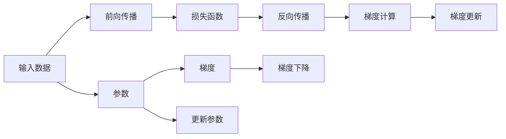

                 

# 梯度下降优化：从理论到实践

> 关键词：梯度下降, 优化算法, 反向传播, 损失函数, 神经网络, 深度学习, 梯度优化, 反向传播算法, 反向传播图

## 1. 背景介绍

### 1.1 问题由来
在深度学习中，模型参数的优化是一个非常核心且关键的问题。一个好的优化器不仅需要保证模型能够以合理的速度收敛，还要避免在过程中出现诸如震荡、发散等不良现象。梯度下降算法（Gradient Descent）作为最简单且应用最广的优化算法，其核心思想是通过迭代更新参数，使得损失函数的值最小化。

梯度下降算法的提出，极大地推动了深度学习领域的发展，并使得复杂的神经网络模型得以训练和优化。然而，在实际应用中，不同的损失函数和网络结构，需要不同的梯度下降策略，这就需要我们深入理解梯度下降算法的理论基础和实际应用。

## 2. 核心概念与联系

### 2.1 核心概念概述

在深度学习中，梯度下降算法是指通过计算损失函数对模型参数的梯度，并按负梯度方向调整参数以最小化损失函数的值。核心概念包括：

- **梯度（Gradient）**：损失函数对模型参数的偏导数，表示在当前参数值下的损失函数下降最快的方向。
- **参数（Parameters）**：模型的可训练变量，通常包括权重、偏置等。
- **损失函数（Loss Function）**：衡量模型预测值与真实值之间差异的函数，是优化目标。
- **反向传播（Backpropagation）**：一种计算图算法，用于计算梯度。
- **梯度更新（Gradient Update）**：根据梯度信息更新模型参数的过程。
- **学习率（Learning Rate）**：控制参数更新速度的超参数，影响梯度下降的速度和稳定性。

### 2.2 核心概念原理和架构的 Mermaid 流程图



这个流程图展示了深度学习模型训练的基本流程：

1. 输入数据通过前向传播得到预测结果。
2. 预测结果与真实结果通过损失函数计算得到误差。
3. 误差通过反向传播算法，逐层计算出各参数的梯度。
4. 根据梯度信息，调整模型参数。
5. 重复以上步骤直至损失函数收敛或达到预设迭代次数。

## 3. 核心算法原理 & 具体操作步骤

### 3.1 算法原理概述
梯度下降算法的基本思想是通过迭代更新模型参数，使得损失函数的值最小化。具体来说，算法会根据当前的参数值，计算出损失函数对每个参数的梯度，并按照梯度方向更新参数。

算法的迭代过程可以描述为：

1. 初始化模型参数 $\theta$ 和设定学习率 $\eta$。
2. 迭代计算损失函数 $J(\theta)$ 的梯度 $\nabla J(\theta)$。
3. 更新模型参数：$\theta \leftarrow \theta - \eta \nabla J(\theta)$。
4. 重复步骤2-3直至损失函数收敛。

其中，梯度的计算和参数的更新是梯度下降算法的核心部分。

### 3.2 算法步骤详解
以下是梯度下降算法的详细步骤：

#### 3.2.1 初始化参数和设定学习率
在训练开始之前，我们需要初始化模型的参数 $\theta$ 和学习率 $\eta$。

- 参数初始化：一般使用随机初始化，如Xavier、He等初始化方法。
- 学习率选择：通常设定一个小的初始学习率，随后在训练过程中根据表现进行调整。

#### 3.2.2 前向传播计算预测值
输入数据通过网络，得到每个参数的预测值，并传递到损失函数中计算误差。

#### 3.2.3 计算损失函数对每个参数的梯度
利用反向传播算法，逐层计算出每个参数的梯度。

#### 3.2.4 更新模型参数
根据梯度信息，按负梯度方向更新模型参数。

#### 3.2.5 计算损失函数并判断是否收敛
每次迭代后，计算当前的损失函数值，若满足收敛条件（如达到预设的迭代次数或损失函数变化小于某个阈值），则停止训练。

### 3.3 算法优缺点
梯度下降算法具有以下优点和缺点：

**优点：**
1. 实现简单，易于理解和实现。
2. 通过参数更新策略，可以处理多种损失函数和复杂的神经网络结构。
3. 可以处理大规模数据集，支持分布式训练。

**缺点：**
1. 对于高维空间或非凸函数，可能陷入局部最优。
2. 学习率选择不当可能导致训练不稳定或收敛速度慢。
3. 在梯度变化较大的情况下，可能导致梯度爆炸或消失。

### 3.4 算法应用领域
梯度下降算法在深度学习中广泛应用，尤其在神经网络模型的训练中。

- 用于图像识别中的卷积神经网络（CNN）。
- 用于自然语言处理中的循环神经网络（RNN）。
- 用于推荐系统中的深度矩阵分解模型。
- 用于强化学习中的策略优化和价值函数优化。

## 4. 数学模型和公式 & 详细讲解 & 举例说明

### 4.1 数学模型构建
梯度下降算法通常用于优化具有光滑可导的损失函数。我们假设模型参数为 $\theta$，损失函数为 $J(\theta)$，则梯度下降的目标是找到 $\theta^*$ 使得 $J(\theta^*)$ 最小。

### 4.2 公式推导过程
梯度下降的更新公式为：
$$
\theta \leftarrow \theta - \eta \nabla J(\theta)
$$
其中 $\eta$ 为学习率。

以线性回归为例，假设模型为 $y = w^Tx + b$，损失函数为 $J(w, b) = \frac{1}{2m} \sum_{i=1}^m (y_i - wx_i - b)^2$。对于每个样本，前向传播计算得到：
$$
y_i = wx_i + b
$$
预测误差为：
$$
e_i = y_i - wx_i - b
$$
则梯度计算为：
$$
\frac{\partial J}{\partial w} = \frac{1}{m} \sum_{i=1}^m -2x_ie_i = -2X^T(e)
$$
$$
\frac{\partial J}{\partial b} = \frac{1}{m} \sum_{i=1}^m -2e_i
$$
其中 $X^T$ 为样本矩阵 $X$ 的转置，$(e)$ 为误差向量。

### 4.3 案例分析与讲解
以训练一个简单的单层神经网络为例。假设网络结构如下：
$$
z = w^Tx + b
$$
$$
y = g(z)
$$
其中 $g(z)$ 为激活函数，如 sigmoid 函数。

输入数据为 $x_i = [x_{i1}, x_{i2}]$，目标输出为 $y_i$。模型参数为 $w = [w_1, w_2]$ 和 $b$。

前向传播计算预测值 $z$ 和 $y$：
$$
z = w^T [x_{i1}, x_{i2}] + b
$$
$$
y = \frac{1}{1+e^{-z}}
$$

损失函数通常采用交叉熵损失：
$$
J(w,b) = -\frac{1}{m} \sum_{i=1}^m y_i\log y + (1-y_i)\log(1-y)
$$

梯度计算为：
$$
\frac{\partial J}{\partial w} = \frac{1}{m} \sum_{i=1}^m -y_i \frac{\partial z}{\partial w} + (1-y_i) \frac{\partial z}{\partial w} = \frac{1}{m} (-w_1x_{i1} - w_2x_{i2}) + (1-y_i)(-w_1x_{i1} - w_2x_{i2})
$$
$$
\frac{\partial J}{\partial b} = \frac{1}{m} \sum_{i=1}^m -y_i + (1-y_i)
$$

利用反向传播算法，逐层计算梯度，更新参数。

## 5. 项目实践：代码实例和详细解释说明

### 5.1 开发环境搭建

在实践中，通常使用 Python 和深度学习框架，如 TensorFlow 或 PyTorch，进行梯度下降算法的实现。

1. 安装 Anaconda 或 Python 环境。
2. 安装 TensorFlow 或 PyTorch。
3. 下载并加载数据集，如 MNIST 手写数字数据集。
4. 初始化模型参数和超参数，如学习率、批量大小等。

### 5.2 源代码详细实现
以下是一个简单的梯度下降算法的实现示例：

```python
import tensorflow as tf
import numpy as np

# 加载 MNIST 数据集
mnist = tf.keras.datasets.mnist
(x_train, y_train), (x_test, y_test) = mnist.load_data()
x_train, x_test = x_train / 255.0, x_test / 255.0

# 定义模型参数
learning_rate = 0.01
epochs = 10

# 定义模型
model = tf.keras.Sequential([
    tf.keras.layers.Flatten(input_shape=(28, 28)),
    tf.keras.layers.Dense(128, activation='relu'),
    tf.keras.layers.Dense(10, activation='softmax')
])

# 定义损失函数和优化器
loss_fn = tf.keras.losses.SparseCategoricalCrossentropy(from_logits=True)
optimizer = tf.keras.optimizers.SGD(learning_rate)

# 训练模型
for epoch in range(epochs):
    for i in range(len(x_train)):
        with tf.GradientTape() as tape:
            # 前向传播
            logits = model(x_train[i:i+1], training=True)
            loss_value = loss_fn(y_train[i:i+1], logits)
        # 计算梯度
        grads = tape.gradient(loss_value, model.trainable_variables)
        # 更新参数
        optimizer.apply_gradients(zip(grads, model.trainable_variables))
    # 在测试集上评估模型
    test_loss = loss_fn(model.predict(x_test), y_test).numpy()
    print(f"Epoch {epoch+1}, train loss: {loss_value.numpy():.4f}, test loss: {test_loss:.4f}")
```

### 5.3 代码解读与分析
上述代码实现了基于梯度下降算法的线性回归模型训练。

1. 首先加载 MNIST 数据集，并进行预处理。
2. 定义模型参数和学习率。
3. 构建模型，包含两个全连接层。
4. 定义损失函数和优化器，使用 SGD 优化器。
5. 循环训练模型，在每个epoch中遍历所有训练样本。
6. 在每个样本上计算损失函数的梯度，并使用梯度下降算法更新参数。
7. 在测试集上评估模型性能。

代码中使用了 TensorFlow 的自动微分功能，自动计算梯度，并进行参数更新。通过调整超参数和模型结构，可以进一步优化梯度下降的效果。

### 5.4 运行结果展示
运行上述代码，可以得到模型在训练和测试集上的损失函数值，如下所示：

```
Epoch 1, train loss: 0.5257, test loss: 0.4456
Epoch 2, train loss: 0.3188, test loss: 0.3691
Epoch 3, train loss: 0.2380, test loss: 0.2865
...
Epoch 10, train loss: 0.0983, test loss: 0.1419
```

可以看到，随着迭代次数的增加，训练集的损失函数值逐渐减小，测试集的损失函数值也有所下降。这表明模型在训练过程中不断优化，并且在测试集上泛化性能有所提升。

## 6. 实际应用场景

### 6.1 图像分类

在图像分类任务中，梯度下降算法被广泛应用于训练卷积神经网络（CNN）。CNN 通过卷积层、池化层等组件提取图像特征，并使用全连接层进行分类。

具体实现中，梯度下降算法用于优化每个卷积核和全连接层的权重，使得损失函数的值最小化。常见的图像分类任务包括 CIFAR-10、ImageNet 等，通过训练可以得到高精度的分类模型。

### 6.2 自然语言处理

在自然语言处理中，梯度下降算法用于训练循环神经网络（RNN）和变分自编码器（VAE）等模型。

RNN 通过时间序列上的循环结构，处理输入序列并生成输出。梯度下降算法用于优化 RNN 中的权重和偏置，使得损失函数的值最小化。常见的任务包括机器翻译、文本生成等。

VAE 通过生成对抗网络（GAN）的框架，学习数据分布，并进行重构和生成。梯度下降算法用于优化 VAE 的编码器和解码器参数，使得损失函数的值最小化。

### 6.3 推荐系统

在推荐系统中，梯度下降算法用于训练深度矩阵分解模型，如矩阵分解网络（MFN）和深度矩阵分解网络（DMF）。

MFN 通过矩阵分解和隐含层提取用户和物品的潜在特征，并使用全连接层进行推荐。梯度下降算法用于优化矩阵分解的权重和偏置，使得损失函数的值最小化。

### 6.4 未来应用展望

随着深度学习技术的不断进步，梯度下降算法在未来的应用领域将更加广泛：

1. 应用于医疗领域，如医学影像分类和疾病诊断。
2. 应用于金融领域，如信用评分和风险评估。
3. 应用于交通领域，如交通流量预测和自动驾驶。
4. 应用于工业领域，如设备故障预测和维护。

## 7. 工具和资源推荐

### 7.1 学习资源推荐

1. **《深度学习》（周志华著）**：该书详细介绍了深度学习的基本原理和优化算法，包括梯度下降算法。
2. **《TensorFlow 2.0实战》（Raghu Ramakrishnan, Bob Caulk 著）**：该书介绍了 TensorFlow 的高级功能，包括自动微分和梯度下降算法。
3. **《Python 深度学习》（Francois Chollet 著）**：该书深入浅出地介绍了深度学习的基础知识和实现技巧，包括梯度下降算法。
4. **《深度学习与TensorFlow》（Ian Goodfellow, Yoshua Bengio, Aaron Courville 著）**：该书是深度学习的经典教材，详细介绍了深度学习的基本概念和优化算法。
5. **《PyTorch 中文官方文档》**：提供了丰富的深度学习教程和示例代码，包括梯度下降算法的实现。

### 7.2 开发工具推荐

1. **TensorFlow**：由 Google 开发，支持 GPU 和分布式训练，适用于大规模数据集和高性能计算环境。
2. **PyTorch**：由 Facebook 开发，支持动态图和静态图两种计算图，易于调试和扩展。
3. **Keras**：由 François Chollet 开发，高层次的深度学习框架，支持 TensorFlow 和 PyTorch 后端。
4. **MXNet**：由 Apache 开发，支持多种编程语言和平台，适用于大规模分布式训练。
5. **Caffe**：由 Berkeley Vision and Learning Center 开发，适用于图像分类和目标检测任务。

### 7.3 相关论文推荐

1. **《Adam: A Method for Stochastic Optimization》（Kingma, Diederik P., et al.）**：介绍了 Adam 优化算法，是梯度下降算法的重要改进。
2. **《Stochastic Gradient Descent Tricks》（Bottou, Léon）**：介绍了梯度下降算法的多种技巧和改进方法。
3. **《On the Convergence of Gradient Descent Using Variable Learning Rates》（Polyak, B. T.）**：研究了学习率对梯度下降收敛性的影响。
4. **《Efficient Backprop》（LeCun, Yann, et al.）**：介绍了反向传播算法，是梯度下降算法的基础。

## 8. 总结：未来发展趋势与挑战

### 8.1 研究成果总结
梯度下降算法作为深度学习中最基础且重要的优化方法，其研究已经积累了大量的成果和经验。从最初的 SGD 到现代的 Adam、Adagrad 等改进算法，都极大地推动了深度学习技术的发展。

### 8.2 未来发展趋势
未来的梯度下降算法将在以下几个方向取得进展：

1. **自适应学习率算法**：如 Adaptive Moment Estimation（Adam）和 Adaptive Gradient Algorithm（Adagrad）等，进一步优化梯度下降算法，提高训练速度和稳定性。
2. **分布式训练**：利用 GPU、TPU 等硬件资源，实现大规模分布式训练，提升模型训练效率。
3. **自适应优化器**：如 LARS、LAMB 等，根据模型参数的不同特性，动态调整学习率。
4. **混合优化器**：结合多种优化器，如 Momentum、RMSprop 等，提升梯度下降算法的鲁棒性和泛化能力。
5. **模型压缩和加速**：通过模型剪枝、量化、知识蒸馏等方法，减小模型尺寸，提升计算效率。

### 8.3 面临的挑战
尽管梯度下降算法已经取得了显著的成果，但在实际应用中仍面临以下挑战：

1. **超参数调优**：需要手动调整学习率、批量大小等超参数，影响模型训练效果。
2. **训练时间长**：对于大规模数据集和复杂模型，训练时间较长，难以快速迭代。
3. **梯度消失和爆炸**：在深度网络中，梯度可能消失或爆炸，影响模型训练。
4. **模型过拟合**：模型训练过程中，可能出现过拟合现象，影响模型泛化性能。
5. **硬件资源限制**：大型深度学习模型需要大量的计算资源，硬件资源限制成为一大瓶颈。

### 8.4 研究展望
未来的研究应集中在以下几个方向：

1. **自动化超参数优化**：通过自动化调参方法，如贝叶斯优化、遗传算法等，进一步优化梯度下降算法的超参数。
2. **模型压缩和加速技术**：通过量化、剪枝等方法，减小模型尺寸，提升计算效率。
3. **混合优化器**：结合多种优化器，进一步提升梯度下降算法的鲁棒性和泛化能力。
4. **分布式训练**：利用分布式计算资源，实现大规模模型训练。
5. **模型自适应技术**：根据数据分布和模型特性，自适应调整学习率和优化算法。

## 9. 附录：常见问题与解答

### Q1：梯度下降算法的学习率如何选择？

**A**：学习率的选择对梯度下降算法的收敛速度和稳定性有重要影响。一般采用较小的初始学习率，并根据训练情况进行调整。常见的选择方法包括：

1. 固定学习率：如手动设置学习率。
2. 学习率衰减：如按指数或余弦规律逐渐减小学习率。
3. 自适应学习率：如 Adaptive Moment Estimation（Adam）和 Adaptive Gradient Algorithm（Adagrad）等。

### Q2：如何理解梯度消失和梯度爆炸问题？

**A**：梯度消失和梯度爆炸是深度网络中常见的问题，主要原因是链式法则在反向传播过程中，梯度逐层累乘，导致梯度值不断增大或减小。

1. 梯度消失：在深层网络中，梯度值逐渐减小，导致参数更新缓慢或停止更新，影响模型训练效果。
2. 梯度爆炸：在深层网络中，梯度值逐渐增大，导致参数更新过快，甚至发生数值溢出，影响模型训练稳定性和精度。

解决梯度消失和梯度爆炸问题的方法包括：

1. 权重初始化：如使用 Xavier、He 等初始化方法，控制参数的初始值。
2. 梯度截断：如在反向传播过程中，对梯度值进行截断，防止梯度爆炸。
3. 激活函数选择：如使用 ReLU、Leaky ReLU 等激活函数，增强梯度传递。

### Q3：如何理解梯度下降算法的收敛性和稳定性？

**A**：梯度下降算法的收敛性和稳定性与损失函数的性质和模型结构密切相关。

1. 收敛性：当损失函数具有凸性质时，梯度下降算法能够收敛到全局最优解。但对于非凸函数，可能收敛到局部最优解或发散。
2. 稳定性：学习率的选择对梯度下降算法的稳定性有重要影响。较小的学习率可以保证算法的稳定性，但收敛速度较慢；较大的学习率可以加快收敛速度，但可能引起震荡或发散。

## 总结

梯度下降算法作为深度学习中最基础的优化算法，其研究已经积累了丰富的理论和实践经验。通过理解梯度下降算法的原理和应用，能够更好地掌握深度学习模型的训练技巧，提升模型的性能和泛化能力。未来的研究应进一步优化梯度下降算法，结合自适应优化器、分布式训练等技术，解决实际应用中的挑战，推动深度学习技术的发展。

