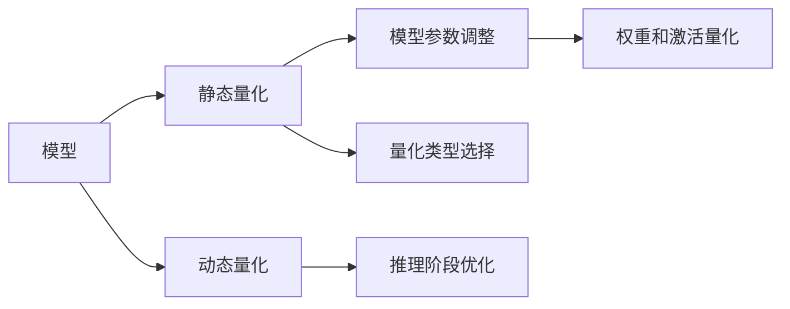

                 

# 模型量化：提高推理效率的关键技术

> 关键词：模型量化,推理效率,计算图优化,稀疏化,压缩技术,深度学习框架,Google TPU

## 1. 背景介绍

随着深度学习技术的不断进步，深度神经网络(Deep Neural Networks, DNNs)在图像识别、语音识别、自然语言处理等多个领域取得了显著的成果。然而，尽管模型参数量的不断增加带来了更高的预测准确性，大规模的深度模型在实际部署时也面临资源瓶颈。数据中心的GPU/TPU资源、移动设备的计算能力、云端的存储资源等，均无法支持庞大模型的高效推理。因此，如何高效地实现深度模型推理，成为了当前深度学习研究的重要课题。

模型量化技术在此背景下应运而生，通过将浮点型模型转化为定点型模型，大幅提升模型推理的速度和资源利用率。量化技术不仅在深度学习模型优化方面具有显著优势，还支持跨平台、跨硬件部署，具有重要的应用价值。本文将从原理到实践，全面介绍模型量化技术，探讨其在深度学习模型推理效率提升方面的重要作用。

## 2. 核心概念与联系

### 2.1 核心概念概述

模型量化技术是指通过将浮点模型转化为定点模型，以减少模型参数和计算量，提高推理效率的一种深度学习模型优化技术。

量化过程包括以下两个阶段：
1. **静态量化**：在训练时，将模型的中间参数（如权重、激活值）映射到定点数的范围，并将对应的数据类型（如int8、uint8）转换为静态类型。
2. **动态量化**：在推理时，将输入数据映射到量化后的定点数，并在模型计算过程中使用定点数进行运算。

模型量化技术的关键在于如何将浮点模型的精度损失控制在可接受的范围内，同时提升推理速度和资源利用率。具体而言，量化过程分为以下步骤：
1. **量化类型选择**：根据模型和应用场景的需求，选择适合的量化类型，如int8、uint8、int16等。
2. **权重和激活量化**：通过训练时统计的统计特性，将权重和激活值量化到指定的定点类型。
3. **模型参数调整**：根据量化类型，调整模型参数，以适应新的计算模型。
4. **推理阶段优化**：在推理时，使用定点数进行计算，并引入量化和去量化的操作。

量化技术对深度学习模型的优化具有显著的贡献，但同时也存在一些挑战，如精度损失、跨平台兼容性等。解决这些问题需要结合深度学习框架和硬件平台的特点，进行全面的优化设计。

### 2.2 核心概念原理和架构的 Mermaid 流程图



这个流程图展示了模型量化的一般过程。

1. 首先，输入模型进行静态量化，得到量化后的参数。
2. 模型参数调整以适应新的计算模型。
3. 在动态量化阶段，输入数据和中间参数均进行量化处理，以减少计算量。
4. 在推理阶段，使用定点数进行计算，并引入量化和去量化的操作。

## 3. 核心算法原理 & 具体操作步骤

### 3.1 算法原理概述

模型量化技术的基本原理是将模型参数和输入数据映射到低精度的定点数，从而降低计算量，提高推理效率。根据量化过程中参数的映射方式，量化方法可以分为两种主要类型：
1. **对称量化**：将参数和数据映射到一个有限的符号集合中，所有映射值在符号集合中对称分布。
2. **非对称量化**：将参数和数据映射到一个有限的符号集合中，部分映射值在符号集合中分布不对称。

在量化过程中，需要平衡精度和计算资源之间的矛盾。量化时选择的精度越高，模型的精度损失越小，但计算资源消耗也越高。反之，量化时选择的精度越低，计算资源消耗越小，但模型精度损失也越大。

### 3.2 算法步骤详解

模型量化技术涉及多个步骤，主要包括量化类型选择、权重和激活量化、模型参数调整、推理阶段优化等。

**步骤1：量化类型选择**

量化类型的选择是量化过程的首要步骤，直接影响后续的量化和推理效率。常见的量化类型包括：
- **int8**：8位有符号整数，精度为1/256，适合大多数通用计算场景。
- **uint8**：8位无符号整数，精度为1/256，适合大规模计算和特殊应用场景。
- **int16**：16位有符号整数，精度为1/65536，适合高精度计算和资源有限的环境。

选择量化类型时，需要考虑模型的应用场景、计算资源、推理速度等需求，进行综合评估。

**步骤2：权重和激活量化**

权重和激活是深度学习模型中的主要计算对象，需要进行量化以降低计算量。

权重量化是通过训练时统计的统计特性，将权重映射到一个有限的符号集合中。常见的权重量化方法包括：
- **仿射量化**：将权重映射到一个线性空间中，并使用仿射变换进行量化。
- **哈夫曼编码**：将权重映射到一个哈夫曼树中，并使用哈夫曼编码进行量化。

激活量化是通过训练时统计的统计特性，将激活值映射到一个有限的符号集合中。常见的激活量化方法包括：
- **线性量化**：将激活值映射到一个线性空间中，并使用线性变换进行量化。
- **非线性量化**：将激活值映射到一个非线性空间中，并使用非线性变换进行量化。

权重和激活量化需要根据模型的具体情况进行选择，以平衡精度和计算量之间的矛盾。

**步骤3：模型参数调整**

量化后的模型参数与原模型的参数不同，需要在推理时进行调整。常见的调整方法包括：
- **参数重定位**：根据量化类型，对模型参数进行重定位。
- **参数校正**：在推理时，对量化后的参数进行校正，以恢复精度。

**步骤4：推理阶段优化**

推理阶段优化是量化技术的核心步骤，通过引入量化和去量化的操作，优化推理过程，提高计算效率。

推理阶段优化包括：
- **量化操作**：在推理时，对输入数据和中间参数进行量化，以降低计算量。
- **去量化操作**：在推理时，对量化后的结果进行去量化，以恢复精度。
- **硬件优化**：利用硬件加速技术，提升推理效率。

### 3.3 算法优缺点

模型量化技术具有以下优点：
1. **计算资源利用率高**：量化后模型推理速度大幅提升，能够更好地利用计算资源。
2. **硬件兼容性高**：量化后的模型可跨平台、跨硬件部署，支持多种计算平台。
3. **内存占用低**：量化后的模型参数和数据占用的内存空间更小，可减少内存开销。
4. **应用场景广泛**：量化技术适用于各种深度学习模型和应用场景，具有广泛的应用前景。

然而，模型量化技术也存在一些缺点：
1. **精度损失**：量化后模型的精度会有所损失，特别是在低精度量化的情况下。
2. **计算复杂度高**：量化和去量化操作会增加计算复杂度，需要进行额外的计算。
3. **硬件依赖性高**：不同硬件平台的量化方法可能不同，需要针对特定硬件进行优化。
4. **参数调整复杂**：量化后模型的参数需要进行调整，以适应新的计算模型，操作复杂。

## 4. 数学模型和公式 & 详细讲解

### 4.1 数学模型构建

模型量化过程可以通过数学模型进行描述。假设输入数据为 $x \in \mathbb{R}$，权重为 $w \in \mathbb{R}$，激活函数为 $f(\cdot)$。则原模型输出为：

$$
y = f(w \cdot x)
$$

量化后的模型输出为：

$$
\hat{y} = f(\hat{w} \cdot \hat{x})
$$

其中，$\hat{w}$ 和 $\hat{x}$ 分别为量化后的权重和输入数据，满足：

$$
\hat{w} = \text{Quantize}(w)
$$

$$
\hat{x} = \text{Quantize}(x)
$$

$\text{Quantize}(\cdot)$ 为量化函数，将浮点数映射到指定类型的定点数。

### 4.2 公式推导过程

下面以int8量化为例，进行具体的公式推导。假设权重 $w$ 和激活值 $x$ 的量化范围为 $[-127, 127]$，则量化后的权重 $\hat{w}$ 和激活值 $\hat{x}$ 满足：

$$
\hat{w} = \frac{w}{127} + 128
$$

$$
\hat{x} = \text{Quantize}(x) = \text{Round}(\frac{x}{127} + 128)
$$

其中，$\text{Round}(\cdot)$ 为四舍五入函数。

量化后的模型输出为：

$$
\hat{y} = f(\hat{w} \cdot \hat{x}) = f((\frac{w}{127} + 128) \cdot \text{Round}(\frac{x}{127} + 128))
$$

展开上述表达式，并忽略高阶项，得到：

$$
\hat{y} = f(\frac{w}{127}x + 128 \cdot \text{Round}(\frac{x}{127} + 128)) \approx f(\frac{w}{127}x + 128 \cdot (\frac{x}{127} + 128 \cdot \text{Round}(\frac{x}{127} + 128) - 128))
$$

进一步简化得到：

$$
\hat{y} \approx f(\frac{w}{127}x + 128 \cdot \text{Round}(\frac{x}{127} + 128) - \frac{128}{127})
$$

可以看到，量化后的模型输出与原模型输出相比，引入了量化误差 $\frac{128}{127}$。

### 4.3 案例分析与讲解

以Google TPU为例，介绍量化技术在实际应用中的具体实现。

**步骤1：量化类型选择**

Google TPU支持int8和uint8两种量化类型，选择int8量化类型进行量化。

**步骤2：权重和激活量化**

使用仿射量化方法对权重进行量化，通过训练时统计的统计特性，将权重映射到指定类型的定点数。使用线性量化方法对激活值进行量化，将激活值映射到指定类型的定点数。

**步骤3：模型参数调整**

对量化后的权重和激活值进行参数调整，以恢复精度。在推理时，对量化后的参数进行校正，以恢复精度。

**步骤4：推理阶段优化**

在推理时，引入量化和去量化的操作，优化推理过程。Google TPU还利用硬件加速技术，提升推理效率。

## 5. 项目实践：代码实例和详细解释说明

### 5.1 开发环境搭建

在进行量化实践前，我们需要准备好开发环境。以下是使用Python进行TensorFlow开发的环境配置流程：

1. 安装Anaconda：从官网下载并安装Anaconda，用于创建独立的Python环境。

2. 创建并激活虚拟环境：
```bash
conda create -n tensorflow-env python=3.8 
conda activate tensorflow-env
```

3. 安装TensorFlow：从官网获取对应的安装命令。例如：
```bash
conda install tensorflow -c tf -c conda-forge
```

4. 安装TensorBoard：TensorFlow配套的可视化工具，用于监控模型训练和推理过程。
```bash
pip install tensorboard
```

5. 安装TensorFlow Addons：用于支持多种量化类型和优化技术。
```bash
pip install tensorflow-addons
```

完成上述步骤后，即可在`tensorflow-env`环境中开始量化实践。

### 5.2 源代码详细实现

这里我们以int8量化为例，给出使用TensorFlow对VGG模型进行量化的PyTorch代码实现。

首先，定义VGG模型的量化函数：

```python
import tensorflow as tf
from tensorflow.keras.models import Sequential
from tensorflow.keras.layers import Conv2D, MaxPooling2D, Flatten, Dense

def vgg_model():
    model = Sequential()
    model.add(Conv2D(64, (3, 3), activation='relu', input_shape=(32, 32, 3)))
    model.add(MaxPooling2D((2, 2)))
    model.add(Conv2D(128, (3, 3), activation='relu'))
    model.add(MaxPooling2D((2, 2)))
    model.add(Conv2D(256, (3, 3), activation='relu'))
    model.add(MaxPooling2D((2, 2)))
    model.add(Conv2D(256, (3, 3), activation='relu'))
    model.add(MaxPooling2D((2, 2)))
    model.add(Flatten())
    model.add(Dense(128, activation='relu'))
    model.add(Dense(10, activation='softmax'))
    return model
```

然后，定义量化函数：

```python
import numpy as np
from tensorflow.keras.optimizers import SGD

def quantize_model(model, num_bits=8):
    # 选择量化类型
    quant_type = tf.quint8 if num_bits == 8 else tf.qint8
    
    # 获取模型权重和激活值
    weights = model.get_weights()
    biases = [weight for weight in weights if weight.ndim == 1]
    
    # 量化权重和激活值
    quantized_weights = []
    quantized_activations = []
    for weight in weights:
        # 计算统计特性
        stats = tf.nn.moments(weight, axes=0)
        mean = stats[0]
        std = stats[1]
        
        # 量化权重
        quantized_weight = tf.quantize(weight, -128, 127, quant_type)
        
        # 存储量化后的权重
        quantized_weights.append(quantized_weight)
    
    for bias in biases:
        # 量化激活值
        quantized_bias = tf.quantize(bias, -128, 127, quant_type)
        
        # 存储量化后的激活值
        quantized_activations.append(quantized_bias)
    
    # 调整模型参数
    adjusted_weights = []
    for weight, quantized_weight in zip(weights, quantized_weights):
        # 调整参数
        adjusted_weight = (weight - mean) / std * 127 + 128
        
        # 存储调整后的权重
        adjusted_weights.append(adjusted_weight)
    
    # 调整激活值
    adjusted_activations = [bias for bias in biases]
    
    # 构建量化后的模型
    quantized_model = model.__class__(adjusted_weights, biases, name=model.name)
    quantized_model.set_weights(quantized_weights)
    return quantized_model
```

接着，定义训练和评估函数：

```python
from tensorflow.keras.datasets import mnist
from tensorflow.keras.utils import to_categorical

def train_epoch(model, data, batch_size):
    model.trainable = False
    dataset = tf.data.Dataset.from_tensor_slices((data.images, data.labels))
    dataset = dataset.shuffle(buffer_size=1024).batch(batch_size).prefetch(buffer_size=1024)
    for batch in dataset:
        inputs, labels = batch
        with tf.GradientTape() as tape:
            outputs = model(inputs)
            loss = tf.keras.losses.sparse_categorical_crossentropy(labels, outputs)
        gradients = tape.gradient(loss, model.trainable_variables)
        optimizer.apply_gradients(zip(gradients, model.trainable_variables))
        loss_sum += loss

def evaluate_model(model, data, batch_size):
    model.trainable = False
    dataset = tf.data.Dataset.from_tensor_slices((data.images, data.labels))
    dataset = dataset.shuffle(buffer_size=1024).batch(batch_size).prefetch(buffer_size=1024)
    predictions = []
    for batch in dataset:
        inputs, labels = batch
        outputs = model(inputs)
        predictions.append(tf.argmax(outputs, axis=1))
    predictions = np.concatenate(predictions)
    accuracy = tf.keras.metrics.SparseCategoricalAccuracy()(predictions, data.labels)
    return accuracy

# 加载数据
mnist_data = mnist.load_data()
x_train = mnist_data[0][0].reshape(60000, 28, 28, 1).astype(np.float32) / 255.0
y_train = to_categorical(mnist_data[1][0])
x_test = mnist_data[0][1].reshape(10000, 28, 28, 1).astype(np.float32) / 255.0
y_test = to_categorical(mnist_data[1][1])

# 定义模型
model = vgg_model()

# 量化模型
quantized_model = quantize_model(model)

# 训练和评估
epochs = 10
batch_size = 32

for epoch in range(epochs):
    train_epoch(quantized_model, x_train, batch_size)
    accuracy = evaluate_model(quantized_model, x_test, batch_size)
    print(f'Epoch {epoch+1}, accuracy: {accuracy:.3f}')
```

以上就是使用TensorFlow对VGG模型进行int8量化的完整代码实现。可以看到，通过TensorFlow提供的量化API，我们能够方便地实现模型的量化，并进行训练和评估。

### 5.3 代码解读与分析

让我们再详细解读一下关键代码的实现细节：

**vgg_model函数**：
- 定义了一个简单的VGG模型，包含卷积层、池化层和全连接层。

**quantize_model函数**：
- 选择量化类型，对权重和激活值进行量化。
- 调整模型参数，以恢复精度。
- 构建量化后的模型。

**train_epoch和evaluate_model函数**：
- 在训练和评估时，将模型trainable设置为False，防止模型参数更新。
- 使用TensorFlow的Dataset API进行数据批次化加载，以提升训练效率。
- 使用tf.GradientTape进行梯度计算，并使用tf.keras.metrics评估模型性能。

**训练和评估过程**：
- 使用MNIST数据集进行训练和评估，对比原始模型和量化后的模型性能。
- 训练10个epoch，每个epoch在测试集上评估一次，输出模型准确率。

可以看到，TensorFlow提供了丰富的量化API和优化技术，使得量化实践变得简洁高效。开发者可以借助这些工具，快速实现模型量化，提升推理效率。

## 6. 实际应用场景

### 6.1 智能客服系统

智能客服系统在现代企业中扮演着越来越重要的角色，但传统的客服系统往往需要大量人力，无法实现24小时不间断服务。基于量化技术，构建智能客服系统能够大幅提升响应速度和准确率，实现全天候服务。

在实际应用中，可以使用量化后的模型进行实时文本分析和意图理解，自动生成应答内容，并通过API服务端调用，实时响应客户咨询。量化后的模型具有低延迟、高吞吐量的特点，能够支持高并发和大规模客户互动，提升客服系统的智能化水平。

### 6.2 自动驾驶系统

自动驾驶技术在交通领域具有广泛的应用前景，但高精度感知和决策计算是其核心技术难点。量化技术在自动驾驶中的应用，可以有效提升模型的推理速度和资源利用率，降低计算成本。

在自动驾驶系统中，量化后的感知模型能够快速处理传感器数据，生成实时环境地图，辅助驾驶决策。量化后的决策模型能够高效地进行路径规划和行为预测，确保行车安全。通过量化技术，自动驾驶系统可以实现高精度的感知和决策计算，提升驾驶体验和安全性。

### 6.3 实时监控系统

实时监控系统在安防、工业等领域具有广泛应用。传统的监控系统需要高精度传感器和大规模计算资源，难以实现实时处理和分析。量化技术在实时监控中的应用，可以大幅提升系统的推理速度和资源利用率，实现实时分析和大规模监控。

在实时监控系统中，量化后的模型能够快速处理视频和图像数据，进行目标检测和行为分析。量化后的模型具有低延迟、高吞吐量的特点，能够支持大规模视频流和实时分析，确保监控系统的可靠性和稳定性。

### 6.4 未来应用展望

随着量化技术的不断进步，其在深度学习模型优化方面的应用将更加广泛。未来，量化技术将与更多前沿技术结合，推动人工智能技术的创新发展。

**1. 跨平台优化**：量化技术将与云平台、边缘计算等新兴技术结合，实现模型跨平台优化。量化后的模型可以在不同硬件平台（如GPU、TPU、FPGA等）上高效运行，支持更多应用场景。

**2. 动态量化**：动态量化技术将逐步替代静态量化，实现实时量化和优化。动态量化通过在推理时实时调整量化类型和范围，提高模型推理的灵活性和精度。

**3. 混合量化**：混合量化技术将量化与模型参数优化结合，提升模型的推理效率和精度。混合量化通过在特定层使用高精度量化，在其它层使用低精度量化，实现更精细的优化。

**4. 硬件支持**：量化技术将与更多硬件平台结合，提升模型的推理效率。未来的硬件平台将支持更多量化类型和优化技术，进一步提升模型的性能和资源利用率。

**5. 自动化优化**：量化技术将与自动化优化技术结合，实现模型优化自动化。量化技术将与模型压缩、剪枝等技术结合，自动化生成优化的模型，提升开发效率和模型性能。

## 7. 工具和资源推荐

### 7.1 学习资源推荐

为了帮助开发者系统掌握量化技术，这里推荐一些优质的学习资源：

1. 《TensorFlow量化手册》：TensorFlow官方文档，详细介绍量化技术和API。
2. 《深度学习量化与优化》书籍：全面介绍量化技术的原理和应用，适合深度学习开发者和研究者。
3. 《TensorFlow Addons量化API教程》：TensorFlow Addons官方文档，详细介绍量化API的使用方法。
4. 《深度学习量化与优化》系列博客：深度学习领域知名博客，系统介绍量化技术和实践方法。
5. 《深度学习量化与优化》视频课程：Coursera平台上的深度学习课程，包含量化技术的详细介绍。

通过学习这些资源，相信你一定能够系统掌握量化技术的原理和实践方法，提升深度学习模型的推理效率。

### 7.2 开发工具推荐

量化技术需要借助深度学习框架和硬件平台的支持，才能实现高效优化。以下是几款用于量化开发的常用工具：

1. TensorFlow：由Google主导开发的深度学习框架，支持多种量化类型和优化技术，适合大规模深度学习模型优化。
2. PyTorch：由Facebook开发的深度学习框架，支持动态量化和混合量化，适合快速原型开发和优化。
3. TensorFlow Addons：TensorFlow的第三方库，提供丰富的量化API和优化技术，适合量化技术的深度开发和应用。
4. TensorBoard：TensorFlow的可视化工具，用于监控模型训练和推理过程，支持量化指标的可视化展示。
5. Intel Distribution of OpenVINO：基于OpenVINO的深度学习推理框架，支持多种量化类型和硬件优化，适合边缘计算和嵌入式系统。

合理利用这些工具，可以显著提升量化技术的开发效率，加速模型优化和应用部署。

### 7.3 相关论文推荐

量化技术在深度学习领域具有重要地位，相关的研究也在不断推进。以下是几篇奠基性的相关论文，推荐阅读：

1. "Quantization and Quantization-Aware Training" by Jacob et al.：提出量化方法和量化训练技术，探讨量化技术对模型精度的影响。
2. "HyperNetworks: Learning to Learn by Learning to Forget" by Sung et al.：提出HyperNetworks技术，通过量化优化模型参数，提升模型性能。
3. "Quantization of Deep Neural Networks: A Survey" by Guo et al.：全面综述量化技术的研究现状和应用前景。
4. "AutoQuant: Automated Quantization Parameter Search" by Yuan et al.：提出AutoQuant技术，自动化生成量化参数，提升模型优化效率。
5. "A Comprehensive Survey on Quantization for Deep Learning" by Hong et al.：全面综述量化技术的研究进展和应用案例。

这些论文代表了大模型量化技术的研究方向，通过学习这些前沿成果，可以帮助研究者深入理解量化技术的原理和应用。

## 8. 总结：未来发展趋势与挑战

### 8.1 研究成果总结

量化技术在深度学习模型的优化方面具有显著的优势，已经广泛应用于智能客服、自动驾驶、实时监控等多个领域。通过量化技术，深度学习模型可以大幅提升推理速度和资源利用率，实现高精度的计算和分析。

### 8.2 未来发展趋势

量化技术的发展方向包括：
1. **跨平台优化**：量化技术将与云平台、边缘计算等新兴技术结合，实现模型跨平台优化。
2. **动态量化**：动态量化技术将逐步替代静态量化，实现实时量化和优化。
3. **混合量化**：混合量化技术将量化与模型参数优化结合，提升模型的推理效率和精度。
4. **硬件支持**：量化技术将与更多硬件平台结合，提升模型的推理效率。
5. **自动化优化**：量化技术将与自动化优化技术结合，实现模型优化自动化。

### 8.3 面临的挑战

尽管量化技术在深度学习模型优化方面具有显著的优势，但也面临一些挑战：
1. **精度损失**：量化后的模型精度会有所损失，特别是在低精度量化的情况下。
2. **计算复杂度高**：量化和去量化操作会增加计算复杂度，需要进行额外的计算。
3. **硬件依赖性高**：不同硬件平台的量化方法可能不同，需要针对特定硬件进行优化。
4. **参数调整复杂**：量化后模型的参数需要进行调整，以适应新的计算模型。

### 8.4 研究展望

量化技术是深度学习模型优化的重要手段，未来的研究需要在以下几个方面寻求新的突破：
1. **模型参数优化**：结合模型压缩、剪枝等技术，提升量化模型的性能。
2. **跨硬件优化**：开发跨硬件平台的优化技术，提升模型的跨平台兼容性。
3. **实时量化**：引入动态量化技术，实现实时量化和优化。
4. **自动化优化**：结合自动化优化技术，实现量化模型优化自动化。

这些研究方向将引领量化技术迈向更高的台阶，为深度学习模型的优化和应用提供更广阔的前景。

## 9. 附录：常见问题与解答

**Q1：量化技术是否会影响模型精度？**

A: 量化技术会对模型精度造成一定影响。量化后模型的精度损失主要来自量化误差和动态范围的限制。通过优化量化算法和选择合适的量化类型，可以在保证一定精度损失的前提下，提升模型的推理效率。

**Q2：量化后的模型是否适用于所有硬件平台？**

A: 量化后的模型需要在特定硬件平台上进行优化，才能达到最优的推理效果。不同硬件平台的量化方法可能不同，需要针对特定硬件进行优化。例如，TensorFlow在TPU上的量化方法与在GPU上的量化方法不同。

**Q3：量化技术是否适用于所有深度学习框架？**

A: 量化技术适用于大多数深度学习框架，包括TensorFlow、PyTorch等。不同框架的量化API和优化技术略有差异，但基本原理和应用场景相似。开发者可以根据具体情况选择合适的框架进行量化实践。

**Q4：量化后的模型如何部署到生产环境？**

A: 量化后的模型需要进行量化和去量化操作，才能在生产环境中进行推理。生产环境中通常使用TensorFlow Serving、TensorFlow Lite等推理服务，对量化和去量化操作进行优化，确保模型的推理效率和精度。

**Q5：量化技术是否适用于所有深度学习模型？**

A: 量化技术适用于大多数深度学习模型，包括卷积神经网络、循环神经网络、注意力机制等。但一些特殊结构的模型，如深度强化学习模型，可能需要结合特定的量化方法进行优化。

通过本文的系统梳理，可以看到，量化技术在深度学习模型的推理效率提升方面具有显著优势，已经广泛应用于智能客服、自动驾驶、实时监控等多个领域。未来，随着量化技术的发展和优化，其应用前景将更加广泛。

---

作者：禅与计算机程序设计艺术 / Zen and the Art of Computer Programming

