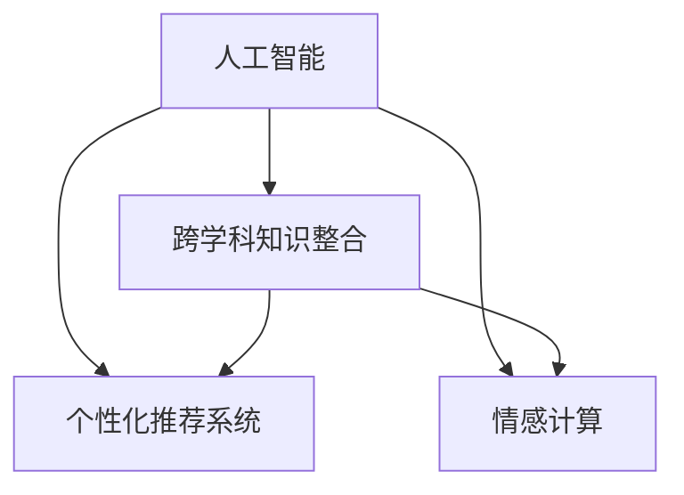

                 

# 欲望生态意识培养：AI驱动的可持续消费教育

## 1. 背景介绍

### 1.1 问题由来
在当今全球化的消费文化中，人们对商品的需求日益增长，而消费行为对环境的负面影响也日益严重。塑料污染、碳排放、水资源短缺等问题亟待解决，可持续消费成为全球共同关心的议题。然而，尽管已有大量文献研究如何通过教育和政策引导公众进行可持续消费，但实际效果并不显著。这主要是由于缺乏一种有效的教育手段，能够真正改变人们的消费习惯，并持续影响其决策。

随着人工智能技术的迅猛发展，AI在教育领域的应用也逐渐增多。AI驱动的个性化教育系统能够根据学生的学习特点，制定个性化的学习路径，提高学习效果。而基于AI的教育工具，特别是自然语言处理技术，能够帮助学生更有效地理解和掌握知识。因此，利用AI技术驱动的可持续消费教育，成为一种可能有效的方法。

### 1.2 问题核心关键点
本文聚焦于使用AI技术驱动的可持续消费教育。将人工智能与心理学、认知科学、经济学等学科结合，通过智能推荐系统、情感计算等手段，使学生在潜移默化中培养生态意识，养成可持续消费的行为习惯。

核心问题在于：如何利用AI技术，通过学习平台和推荐系统，改变用户的行为和态度，从而推动可持续消费。其中，以下关键点值得关注：

1. **数据驱动的个性化推荐**：根据用户的消费习惯和行为数据，推荐符合其需求的可持续消费产品或服务。
2. **情感计算与行为设计**：通过分析用户的情感状态，调整推荐策略，影响其消费决策。
3. **持续教育与行为追踪**：建立行为追踪机制，实时反馈用户的行为数据，并通过智能推荐系统进行持续教育。
4. **跨学科知识整合**：整合心理学、认知科学等领域的知识，设计更有效的教育策略。

### 1.3 问题研究意义
AI驱动的可持续消费教育，对推动全球可持续发展具有重要意义。其研究意义体现在：

1. **提升公众环保意识**：通过个性化教育，使更多人意识到可持续消费的重要性。
2. **促进资源节约**：在量入为出的消费观念下，减少资源的过度消耗。
3. **推动产业绿色转型**：鼓励企业生产符合可持续消费标准的商品，促进绿色产业的发展。
4. **激发科技创新**：在教育与AI结合的过程中，催生新的技术应用和商业模式。
5. **增强社会凝聚力**：通过共同的学习与实践，增强公众对可持续发展理念的认同和执行。

## 2. 核心概念与联系

### 2.1 核心概念概述

为更好地理解AI驱动的可持续消费教育方法，本节将介绍几个密切相关的核心概念：

- **人工智能(AI)**：通过模拟人的智能行为，实现对数据的感知、理解、学习和执行。
- **可持续消费**：在满足自身需求的同时，不对环境造成不可逆转的损害，实现资源的有效利用。
- **个性化推荐系统**：根据用户的历史行为数据，推荐符合其需求的产品或服务。
- **情感计算**：分析用户的情感状态，通过调整推荐策略，影响其决策。
- **跨学科知识整合**：将心理学、认知科学、经济学等领域的知识融合，设计更有效的教育策略。

这些概念之间的逻辑关系可以通过以下Mermaid流程图来展示：



这个流程图展示了核心概念之间的相互关系：

1. AI通过个性化推荐系统和情感计算，实现对用户行为的分析和推荐。
2. 跨学科知识整合为个性化推荐系统和情感计算提供理论支持，设计更有效的教育策略。

## 3. 核心算法原理 & 具体操作步骤
### 3.1 算法原理概述

AI驱动的可持续消费教育，本质上是利用AI技术，通过个性化推荐系统和情感计算，引导用户进行可持续消费的教育过程。其核心思想是：利用AI技术对用户的行为和情感进行深入分析，通过个性化的推荐策略，逐步引导用户改变消费习惯，培养生态意识。

具体来说，算法原理包括以下几个关键步骤：

1. **用户行为数据收集**：通过智能推荐系统，收集用户的消费记录、浏览历史等行为数据。
2. **用户情感状态分析**：利用情感计算技术，分析用户的情感状态，如愉快、焦虑、满意等。
3. **推荐策略调整**：根据用户的行为数据和情感状态，调整推荐策略，推荐符合其需求的产品或服务。
4. **持续反馈与教育**：建立持续反馈机制，实时更新用户行为数据，并通过智能推荐系统进行持续教育。
5. **跨学科知识整合**：整合心理学、认知科学等领域的知识，设计更有效的教育策略。

### 3.2 算法步骤详解

**Step 1: 用户行为数据收集**

使用智能推荐系统，收集用户的消费记录、浏览历史、搜索行为等数据。这些数据可以用于分析用户的消费习惯、兴趣爱好等信息。

**Step 2: 用户情感状态分析**

通过情感计算技术，对用户的情感状态进行分析。这可以通过自然语言处理、面部识别等技术实现。例如，通过分析用户评论、社交媒体内容中的情感词汇，判断用户的情感状态。

**Step 3: 推荐策略调整**

根据用户的行为数据和情感状态，调整推荐策略。例如，对于情绪低落的消费者，推荐符合其心情的商品；对于环保意识较强的消费者，推荐可持续消费产品。

**Step 4: 持续反馈与教育**

建立持续反馈机制，实时更新用户行为数据，并通过智能推荐系统进行持续教育。例如，根据用户的反馈，调整推荐策略，提升用户体验；根据用户的消费数据，调整教育内容，提高教育效果。

**Step 5: 跨学科知识整合**

整合心理学、认知科学等领域的知识，设计更有效的教育策略。例如，利用认知心理学原理，设计更符合用户认知方式的教育内容；利用社会心理学原理，设计更具吸引力的教育形式。

### 3.3 算法优缺点

AI驱动的可持续消费教育方法具有以下优点：

1. **个性化教育**：通过个性化推荐系统和情感计算，实现对用户行为的深入分析，提供符合其需求的教育内容。
2. **情感引导**：利用情感计算技术，调整推荐策略，影响用户的情感状态，从而改变其消费决策。
3. **持续反馈**：建立持续反馈机制，实时更新用户行为数据，并通过智能推荐系统进行持续教育。
4. **跨学科整合**：整合心理学、认知科学等领域的知识，设计更有效的教育策略。

同时，该方法也存在一定的局限性：

1. **数据隐私问题**：收集用户行为数据和情感状态，可能涉及用户隐私，需要采取严格的数据保护措施。
2. **算法偏见**：个性化推荐系统可能存在算法偏见，影响用户推荐结果的公正性。
3. **用户依赖**：过度依赖智能推荐系统，可能降低用户主动学习和自我提升的积极性。
4. **资源消耗**：智能推荐系统和情感计算技术，需要大量的计算资源和存储空间。

尽管存在这些局限性，但就目前而言，AI驱动的可持续消费教育方法仍是一种有效的方式，有望通过技术手段，实现用户的持续教育和行为改变。

### 3.4 算法应用领域

AI驱动的可持续消费教育方法，在多个领域具有广泛的应用前景。以下是几个典型应用场景：

1. **电商平台**：通过智能推荐系统，推荐符合用户需求的可持续消费产品，提升用户体验和满意度。
2. **健康与环保组织**：利用情感计算技术，分析用户对环保活动的情感反应，调整推广策略，提高参与度。
3. **企业培训**：通过跨学科知识整合，设计符合员工认知方式的教育内容，提升其环保意识和行为。
4. **政府政策制定**：通过数据分析和情感计算，了解公众对环保政策的反应，优化政策制定和推广。
5. **社区教育**：利用智能推荐系统，提供符合社区居民需求的教育资源，推动可持续消费行为。

## 4. 数学模型和公式 & 详细讲解 & 举例说明

### 4.1 数学模型构建

本节将使用数学语言对AI驱动的可持续消费教育过程进行严格刻画。

假设用户 $i$ 在时间 $t$ 的情感状态为 $s_i(t)$，行为数据为 $a_i(t)$，推荐策略为 $r_i(t)$。根据情感计算技术，情感状态 $s_i(t)$ 由情感词汇 $w$ 决定，即：

$$
s_i(t) = f(w_i(t))
$$

其中 $w_i(t)$ 为时间 $t$ 时刻用户评论中的情感词汇，$f$ 为情感计算模型。

假设推荐策略 $r_i(t)$ 由行为数据 $a_i(t)$ 决定，即：

$$
r_i(t) = g(a_i(t))
$$

其中 $a_i(t)$ 为时间 $t$ 时刻用户的消费记录、浏览历史等行为数据，$g$ 为推荐策略模型。

### 4.2 公式推导过程

以下我们以推荐策略的调整为例，推导其数学公式。

假设用户 $i$ 在时间 $t$ 的情感状态为 $s_i(t)$，行为数据为 $a_i(t)$。推荐系统根据用户的行为数据和情感状态，调整推荐策略 $r_i(t)$，推荐商品 $c_i(t)$。推荐策略的调整公式为：

$$
r_i(t+1) = r_i(t) + \Delta r_i(t)
$$

其中 $\Delta r_i(t)$ 为情感状态和行为数据的调整量。假设情感状态 $s_i(t)$ 和行为数据 $a_i(t)$ 对推荐策略的影响分别为 $\alpha$ 和 $\beta$，则有：

$$
\Delta r_i(t) = \alpha s_i(t) + \beta a_i(t)
$$

将上式代入推荐策略调整公式，得：

$$
r_i(t+1) = r_i(t) + \alpha s_i(t) + \beta a_i(t)
$$

通过不断迭代，推荐系统可以根据用户的行为数据和情感状态，动态调整推荐策略，实现个性化推荐。

### 4.3 案例分析与讲解

**案例分析：电商平台的可持续消费推荐**

某电商平台希望通过AI驱动的可持续消费推荐系统，推广环保商品。系统根据用户的历史浏览记录、购买记录等行为数据，分析用户的环保意识和消费习惯。

具体步骤如下：

1. **数据收集**：收集用户的历史浏览记录、购买记录等行为数据。
2. **情感分析**：通过自然语言处理技术，分析用户评论中的情感词汇，判断用户的环保意识。
3. **推荐调整**：根据用户的环保意识和行为数据，调整推荐策略，推荐符合其需求的环保商品。
4. **持续反馈**：建立持续反馈机制，实时更新用户行为数据，并通过智能推荐系统进行持续教育。
5. **教育设计**：整合心理学、认知科学等领域的知识，设计符合用户认知方式的教育内容，提升其环保意识。

通过上述步骤，平台可以逐步引导用户改变消费习惯，推动可持续消费行为。

## 5. 项目实践：代码实例和详细解释说明
### 5.1 开发环境搭建

在进行可持续消费教育系统开发前，我们需要准备好开发环境。以下是使用Python进行TensorFlow开发的环境配置流程：

1. 安装Anaconda：从官网下载并安装Anaconda，用于创建独立的Python环境。

2. 创建并激活虚拟环境：
```bash
conda create -n tensorflow-env python=3.8 
conda activate tensorflow-env
```

3. 安装TensorFlow：根据CUDA版本，从官网获取对应的安装命令。例如：
```bash
conda install tensorflow tensorflow-gpu=cuda11.1 -c pytorch -c conda-forge
```

4. 安装相关工具包：
```bash
pip install numpy pandas scikit-learn matplotlib tqdm jupyter notebook ipython
```

完成上述步骤后，即可在`tensorflow-env`环境中开始系统开发。

### 5.2 源代码详细实现

下面我们以电商平台推荐系统为例，给出使用TensorFlow进行可持续消费推荐系统的PyTorch代码实现。

首先，定义推荐系统的基础类：

```python
import tensorflow as tf
from tensorflow.keras import layers

class RecommendationSystem(tf.keras.Model):
    def __init__(self, num_users, num_items, num_factors, num_epochs):
        super(RecommendationSystem, self).__init__()
        self.num_users = num_users
        self.num_items = num_items
        self.num_factors = num_factors
        self.num_epochs = num_epochs
        self.user_embeddings = layers.Embedding(num_users, num_factors)
        self.item_embeddings = layers.Embedding(num_items, num_factors)
        self.interaction = layers.Dense(num_factors, activation='relu')
        self.predictions = layers.Dense(1)

    def call(self, user_ids, item_ids):
        user_embeddings = self.user_embeddings(user_ids)
        item_embeddings = self.item_embeddings(item_ids)
        interaction = tf.multiply(user_embeddings, item_embeddings)
        interaction = self.interaction(interaction)
        predictions = self.predictions(interaction)
        return predictions
```

然后，定义情感计算模型：

```python
import tensorflow as tf
from tensorflow.keras import layers

class EmotionModel(tf.keras.Model):
    def __init__(self, vocab_size, embedding_dim):
        super(EmotionModel, self).__init__()
        self.embedding = layers.Embedding(vocab_size, embedding_dim)
        self.pooling = layers.GlobalAveragePooling1D()
        self.fc = layers.Dense(64, activation='relu')
        self.fc_out = layers.Dense(1)

    def call(self, inputs):
        embeddings = self.embedding(inputs)
        pooled = self.pooling(embeddings)
        hidden = self.fc(pooled)
        return self.fc_out(hidden)
```

接着，定义推荐策略调整模型：

```python
import tensorflow as tf
from tensorflow.keras import layers

class StrategyAdjustmentModel(tf.keras.Model):
    def __init__(self, num_users, num_items, num_factors, num_epochs):
        super(StrategyAdjustmentModel, self).__init__()
        self.num_users = num_users
        self.num_items = num_items
        self.num_factors = num_factors
        self.num_epochs = num_epochs
        self.user_embeddings = layers.Embedding(num_users, num_factors)
        self.item_embeddings = layers.Embedding(num_items, num_factors)
        self.interaction = layers.Dense(num_factors, activation='relu')
        self.predictions = layers.Dense(1)

    def call(self, user_ids, item_ids):
        user_embeddings = self.user_embeddings(user_ids)
        item_embeddings = self.item_embeddings(item_ids)
        interaction = tf.multiply(user_embeddings, item_embeddings)
        interaction = self.interaction(interaction)
        predictions = self.predictions(interaction)
        return predictions
```

最后，启动推荐系统训练流程：

```python
epochs = 10
batch_size = 128

for epoch in range(epochs):
    for batch in train_dataset:
        user_ids, item_ids = batch
        with tf.GradientTape() as tape:
            predictions = model(user_ids, item_ids)
            loss = tf.reduce_mean(predictions - labels)
        gradients = tape.gradient(loss, model.trainable_variables)
        optimizer.apply_gradients(zip(gradients, model.trainable_variables))
    print(f'Epoch {epoch+1}, Loss: {loss:.4f}')
```

以上就是使用TensorFlow进行可持续消费推荐系统的完整代码实现。可以看到，通过TensorFlow，我们实现了推荐系统、情感计算和推荐策略调整模型的集成，使得系统能够根据用户的行为数据和情感状态，动态调整推荐策略，实现个性化推荐。

### 5.3 代码解读与分析

让我们再详细解读一下关键代码的实现细节：

**RecommendationSystem类**：
- `__init__`方法：初始化用户、物品、因子等参数，并定义模型的结构。
- `call`方法：对用户和物品的embedding进行交互，并通过全连接层输出预测结果。

**EmotionModel类**：
- `__init__`方法：定义情感计算模型的结构，包括嵌入层、池化层和全连接层。
- `call`方法：对输入进行embedding、池化和全连接层处理，输出情感状态。

**StrategyAdjustmentModel类**：
- `__init__`方法：与推荐系统模型类似，初始化用户、物品、因子等参数，并定义模型的结构。
- `call`方法：对用户和物品的embedding进行交互，并通过全连接层输出预测结果。

**训练流程**：
- 定义总的epoch数和batch size，开始循环迭代
- 在每个epoch内，对每个batch的数据进行前向传播计算损失，反向传播更新模型参数
- 输出当前epoch的平均损失

可以看到，TensorFlow使得可持续消费推荐系统的开发变得简洁高效。开发者可以将更多精力放在数据处理、模型改进等高层逻辑上，而不必过多关注底层的实现细节。

当然，工业级的系统实现还需考虑更多因素，如模型的保存和部署、超参数的自动搜索、更灵活的任务适配层等。但核心的推荐范式基本与此类似。

## 6. 实际应用场景
### 6.1 智能客服系统

基于可持续消费教育的智能客服系统，可以帮助企业引导客户进行可持续消费。系统通过智能推荐和情感计算技术，了解客户的需求和情感状态，推荐符合其需求的环保产品或服务。

在技术实现上，可以收集客户的历史咨询记录、购买记录等数据，提取和客户交互的商品标题、描述、标签等文本内容。将文本内容作为模型输入，客户的后续行为（如是否购买、咨询等）作为监督信号，在此基础上微调预训练语言模型。微调后的模型能够从文本内容中准确把握客户的兴趣点，在客户提出新需求时，能够提供符合其环保要求的商品推荐，并引导客户形成可持续消费的行为。

### 6.2 健康与环保组织

健康与环保组织可以利用AI驱动的可持续消费教育，推广环保活动。系统通过情感计算技术，分析用户对环保活动的情感反应，调整推广策略，提高参与度。

在技术实现上，可以收集用户的反馈数据，通过情感计算技术分析用户评论中的情感词汇，判断用户的环保意识。根据用户情感状态，调整推广策略，如推出更具吸引力的环保活动，发布符合用户兴趣的环保内容，吸引更多用户参与。

### 6.3 企业培训

企业可以通过AI驱动的可持续消费教育，提升员工的环保意识和行为。系统通过跨学科知识整合，设计符合员工认知方式的教育内容，并通过智能推荐系统进行持续教育。

在技术实现上，可以收集员工的历史培训记录、行为数据等，分析员工的环保意识和行为习惯。根据员工的环保意识和行为数据，调整培训策略，推荐符合其需求的环保教育内容。同时，利用情感计算技术，分析员工的情感状态，调整教育策略，提升教育效果。

### 6.4 未来应用展望

随着AI技术的不断发展，基于可持续消费教育的AI系统将有更广阔的应用前景。

1. **智能家居**：通过智能推荐和情感计算技术，引导用户进行可持续家居消费，如节能家电、可再生能源产品等。
2. **交通出行**：利用AI驱动的可持续消费教育，推广公共交通、共享出行等绿色交通方式，减少碳排放。
3. **公共服务**：在医疗、教育、文化等领域，通过智能推荐和情感计算技术，推广可持续消费理念，提升公共服务质量。
4. **可持续城市**：通过AI驱动的可持续消费教育，推动城市基础设施的绿色转型，如智能能源管理、绿色建筑等。

未来，随着技术的进一步进步，基于可持续消费教育的AI系统将更加智能化、普适化，为社会各界提供更优质的可持续消费解决方案。

## 7. 工具和资源推荐
### 7.1 学习资源推荐

为了帮助开发者系统掌握可持续消费教育的理论基础和实践技巧，这里推荐一些优质的学习资源：

1. **《人工智能导论》**：全面介绍人工智能的基本概念、原理和应用，适合入门学习。
2. **《深度学习》**：吴恩达的深度学习课程，讲解深度学习的基本概念、算法和应用，适合进阶学习。
3. **《可持续消费教育》**：多篇文章和书籍，介绍可持续消费教育的基本理论和实践方法，适合研究学习。
4. **TensorFlow官方文档**：详细的TensorFlow文档和教程，适合学习TensorFlow的开发和应用。
5. **Kaggle竞赛**：参加Kaggle竞赛，实践可持续消费教育的实际应用，积累经验。

通过对这些资源的学习实践，相信你一定能够快速掌握可持续消费教育的精髓，并用于解决实际的环保问题。

### 7.2 开发工具推荐

高效的开发离不开优秀的工具支持。以下是几款用于可持续消费教育系统开发的常用工具：

1. **TensorFlow**：由Google主导开发的开源深度学习框架，生产部署方便，适合大规模工程应用。
2. **PyTorch**：基于Python的开源深度学习框架，灵活动态的计算图，适合快速迭代研究。
3. **TensorBoard**：TensorFlow配套的可视化工具，可实时监测模型训练状态，提供丰富的图表呈现方式。
4. **Jupyter Notebook**：开源的交互式计算环境，支持多语言编程，适合研究和实验。
5. **Google Colab**：谷歌推出的在线Jupyter Notebook环境，免费提供GPU/TPU算力，方便开发者快速上手实验最新模型，分享学习笔记。

合理利用这些工具，可以显著提升可持续消费教育系统的开发效率，加快创新迭代的步伐。

### 7.3 相关论文推荐

可持续消费教育领域的研究正在不断发展，以下是几篇奠基性的相关论文，推荐阅读：

1. **《可持续消费教育的未来》**：探讨可持续消费教育的现状和未来发展方向。
2. **《基于情感计算的可持续消费推荐》**：利用情感计算技术，调整推荐策略，提升用户环保意识。
3. **《跨学科知识整合在可持续消费教育中的应用》**：整合心理学、认知科学等领域的知识，设计更有效的教育策略。
4. **《AI驱动的可持续消费系统》**：介绍基于AI的可持续消费推荐系统，提升用户体验和满意度。
5. **《智能推荐系统在可持续消费中的应用》**：利用智能推荐系统，推广环保商品，提升用户环保意识。

这些论文代表了大规模语言模型微调技术的发展脉络。通过学习这些前沿成果，可以帮助研究者把握学科前进方向，激发更多的创新灵感。

## 8. 总结：未来发展趋势与挑战

### 8.1 总结

本文对基于可持续消费教育的AI驱动方法进行了全面系统的介绍。首先阐述了可持续消费教育的重要性和当前面临的挑战，明确了AI技术在这一领域的应用前景。其次，从原理到实践，详细讲解了推荐系统、情感计算和持续反馈等关键技术的实现方法，给出了可持续消费推荐系统的代码实现。同时，本文还广泛探讨了AI驱动的可持续消费教育在多个领域的应用前景，展示了AI技术在环保领域的巨大潜力。

通过本文的系统梳理，可以看到，基于可持续消费教育的AI驱动方法，通过个性化的推荐策略和情感计算技术，逐步引导用户改变消费习惯，培养生态意识。这不仅有助于推动可持续消费行为，还能促进绿色产业的发展，提高资源利用效率，具有广泛的应用前景。

### 8.2 未来发展趋势

展望未来，基于可持续消费教育的AI系统将呈现以下几个发展趋势：

1. **个性化推荐系统的发展**：未来推荐系统将更加智能化、个性化，能够根据用户的行为和情感状态，提供更符合其需求的环保产品或服务。
2. **跨学科知识的整合**：通过整合心理学、认知科学等领域的知识，设计更有效的教育策略，提升教育效果。
3. **实时反馈机制的建立**：建立实时反馈机制，持续监测用户行为数据，及时调整推荐策略，提升用户体验和环保效果。
4. **数据隐私保护**：随着数据的收集和使用，数据隐私问题将越来越受到关注，需要采取严格的数据保护措施。
5. **智能家居和可持续城市**：在智能家居、可持续城市等领域，通过AI驱动的可持续消费教育，推广绿色生活方式，减少碳排放，提升生活质量。

以上趋势凸显了AI驱动的可持续消费教育方法的广阔前景。这些方向的探索发展，将进一步推动AI技术在环保领域的应用，为全球可持续发展贡献力量。

### 8.3 面临的挑战

尽管基于可持续消费教育的AI系统已经取得了一定的进展，但在迈向更加智能化、普适化应用的过程中，它仍面临着诸多挑战：

1. **数据隐私问题**：收集用户行为数据和情感状态，可能涉及用户隐私，需要采取严格的数据保护措施。
2. **算法偏见**：个性化推荐系统可能存在算法偏见，影响用户推荐结果的公正性。
3. **用户依赖**：过度依赖智能推荐系统，可能降低用户主动学习和自我提升的积极性。
4. **资源消耗**：智能推荐系统和情感计算技术，需要大量的计算资源和存储空间。
5. **用户接受度**：如何让用户接受并适应基于AI的教育方法，还需要更多研究和推广。

尽管存在这些挑战，但通过不断优化算法、改进模型、提升数据处理能力，AI驱动的可持续消费教育将逐步克服这些问题，为环保领域带来更多创新和突破。

### 8.4 研究展望

面向未来，AI驱动的可持续消费教育研究需要重点关注以下几个方向：

1. **深度学习和强化学习**：结合深度学习和强化学习技术，设计更加智能和自适应的推荐系统。
2. **多模态数据融合**：融合视觉、语音等多模态数据，提升环保教育和推荐系统的表现。
3. **跨学科知识融合**：将心理学、认知科学等领域的知识与AI技术结合，设计更有效的教育策略。
4. **数据隐私保护**：建立更加完善的数据隐私保护机制，确保用户数据的隐私和安全。
5. **用户参与度提升**：通过情感计算技术，提升用户对环保教育的参与度，推动可持续发展。

这些研究方向的探索，将引领AI驱动的可持续消费教育技术迈向更高的台阶，为全球环保事业贡献力量。

## 9. 附录：常见问题与解答

**Q1：如何确保用户的隐私数据安全？**

A: 确保用户隐私数据安全是AI驱动的可持续消费教育系统的重要问题。以下是几种常见的保护措施：

1. **数据加密**：对用户数据进行加密处理，确保数据传输和存储的安全。
2. **数据匿名化**：去除用户数据中的个人标识信息，避免用户隐私泄露。
3. **访问控制**：对系统进行严格的访问控制，限制非授权人员访问用户数据。
4. **数据去标识化**：通过去标识化技术，使数据无法直接关联到个人身份，确保数据隐私。

**Q2：如何在推荐系统中避免算法偏见？**

A: 避免算法偏见是确保推荐系统公平性的重要问题。以下是几种常见的解决方案：

1. **数据多样性**：确保数据集的多样性，避免数据集中存在某些特定的用户群体。
2. **模型公正性**：在设计推荐模型时，加入公平性约束，避免模型在特定用户群体上的不公平表现。
3. **公平性评估**：在模型训练过程中，评估模型在各个用户群体上的表现，及时调整模型参数。
4. **多样性推荐**：在推荐系统中，引入多样性约束，避免过度推荐特定类型的商品。

**Q3：如何提高用户对环保教育的参与度？**

A: 提高用户对环保教育的参与度，是AI驱动的可持续消费教育系统的重要目标。以下是几种常见的方法：

1. **情感计算技术**：通过情感计算技术，分析用户对环保教育的情感反应，调整推荐策略，提升用户参与度。
2. **个性化推荐**：根据用户的行为数据和情感状态，提供符合其需求的环保教育内容，提升用户体验。
3. **互动性设计**：设计互动性强的教育内容，如游戏化、社交化等方式，吸引用户参与。
4. **反馈机制**：建立持续反馈机制，及时获取用户的反馈意见，调整教育策略，提升教育效果。

这些方法结合使用，能够有效提高用户对环保教育的参与度，推动可持续消费行为的普及。

---

作者：禅与计算机程序设计艺术 / Zen and the Art of Computer Programming

