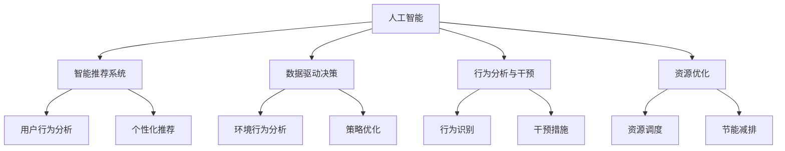

                 

# 欲望的生态意识：AI驱动的可持续消费

> 关键词：人工智能, 可持续消费, 生态意识, 智能推荐, 数据驱动, 行为分析, 资源优化

## 1. 背景介绍

### 1.1 问题由来
近年来，全球气候变化问题日益严峻，资源消耗与环境保护的矛盾愈发凸显。然而，人类消费模式的短视和浅薄，导致资源浪费和环境污染的现象愈发普遍。如何通过智能技术手段，引导消费者转向可持续消费，实现经济、社会和环境的协调发展，成为了一个迫切需要解决的问题。

人工智能（AI）作为当今最为前沿的技术，已经开始在能源管理、交通规划、智能制造等领域发挥重要作用。在消费领域，AI通过智能推荐、行为分析等技术手段，能够有效改善资源分配，降低消费浪费，推动消费者向绿色、健康、可持续的方向转变。

### 1.2 问题核心关键点
1. **智能推荐系统**：通过分析用户的历史行为和偏好，AI可以为用户提供个性化的商品推荐，引导用户选择环境友好型产品。
2. **数据驱动决策**：通过对大量消费数据进行分析，AI能够发现潜在的环境问题，并提出优化方案。
3. **行为分析与干预**：通过分析用户行为数据，AI能够识别出高消耗的消费模式，并采取适当的干预措施，鼓励用户进行绿色消费。
4. **资源优化**：AI通过智能调度和管理，优化资源的分配和使用，减少资源的浪费和环境污染。

### 1.3 问题研究意义
研究AI驱动的可持续消费技术，对于提升社会整体的环境意识，推动绿色经济的发展，具有重要意义：

1. **减少资源浪费**：通过AI推荐和分析，能够有效地减少资源的过度消费和浪费。
2. **提升环境意识**：智能技术的应用，可以直观地展示环境污染的后果，提高公众对可持续消费的认识。
3. **促进绿色产业**：智能技术的应用，可以推动绿色产业的发展，催生新的经济增长点。
4. **支持政策决策**：通过对消费数据的分析，可以为政府政策制定提供科学依据，优化资源配置。

## 2. 核心概念与联系

### 2.1 核心概念概述

为更好地理解AI驱动的可持续消费技术，本节将介绍几个密切相关的核心概念：

- **人工智能（AI）**：通过机器学习、深度学习等技术，使计算机具备学习、推理和自我改进能力。
- **可持续消费**：指在满足个人需求的同时，最大限度地减少对环境的负面影响，实现经济、社会和环境的协调发展。
- **智能推荐系统**：利用AI算法，分析用户行为和偏好，为用户提供个性化的商品推荐，引导用户选择环境友好型产品。
- **数据驱动决策**：通过收集和分析海量数据，提取环境行为特征，辅助决策者制定环境友好型策略。
- **行为分析与干预**：利用AI技术，分析用户行为数据，识别高消耗模式，采取适当的干预措施，鼓励绿色消费。
- **资源优化**：通过AI智能调度和管理，优化资源分配，减少资源浪费和环境污染。

这些核心概念之间的逻辑关系可以通过以下Mermaid流程图来展示：



这个流程图展示了大语言模型的核心概念及其之间的关系：

1. 人工智能通过智能推荐、数据驱动决策、行为分析与干预、资源优化等技术手段，支持可持续消费的实践。
2. 智能推荐系统利用用户行为分析，为用户提供个性化推荐。
3. 数据驱动决策通过环境行为分析，辅助制定优化策略。
4. 行为分析与干预识别高消耗模式，采取干预措施。
5. 资源优化通过智能调度，减少资源浪费和环境污染。

这些概念共同构成了AI驱动的可持续消费技术的理论框架，为其实现提供了坚实的理论基础。

## 3. 核心算法原理 & 具体操作步骤

### 3.1 算法原理概述

AI驱动的可持续消费技术，核心原理是通过机器学习和大数据分析，实现对用户行为和消费模式的精准分析和预测，进而指导资源的优化配置和消费行为的绿色转型。

具体而言，算法主要分为以下几个步骤：

1. **数据收集与预处理**：从多个渠道收集用户的消费行为数据，包括在线购物记录、社交媒体行为、能源使用数据等。
2. **特征提取与建模**：利用机器学习算法，提取关键行为特征，构建消费行为模型。
3. **智能推荐与优化**：根据用户行为模型，生成个性化推荐，并优化资源配置。
4. **行为分析与干预**：分析用户行为数据，识别高消耗模式，采取干预措施。
5. **效果评估与迭代**：评估干预措施的效果，进行持续优化和改进。

### 3.2 算法步骤详解

#### 3.2.1 数据收集与预处理

**Step 1: 数据收集**
- 收集用户的在线购物记录、社交媒体行为、能源使用数据等。
- 数据来源包括电商平台、社交网络、智能家居设备等。

**Step 2: 数据预处理**
- 对原始数据进行清洗、去重、缺失值处理等操作。
- 将不同来源的数据进行整合，构建统一的数据格式。

#### 3.2.2 特征提取与建模

**Step 1: 特征提取**
- 使用特征工程技术，提取关键行为特征，如购买频率、购买品类、能源消耗等。
- 利用降维技术，减少特征维度，降低计算复杂度。

**Step 2: 模型训练**
- 使用机器学习算法，如随机森林、梯度提升树、深度学习等，构建用户行为模型。
- 对模型进行交叉验证，评估模型的性能。

#### 3.2.3 智能推荐与优化

**Step 1: 推荐模型构建**
- 使用协同过滤、基于内容的推荐算法等，构建推荐模型。
- 对模型进行训练，生成个性化推荐。

**Step 2: 资源优化**
- 使用优化算法，如线性规划、动态规划等，优化资源配置。
- 利用模拟仿真技术，评估优化方案的效果。

#### 3.2.4 行为分析与干预

**Step 1: 行为分析**
- 利用行为分析算法，识别高消耗模式，如频繁购买高碳排放产品等。
- 对行为模式进行分析，提取环境友好型特征。

**Step 2: 干预措施**
- 根据行为分析结果，制定干预措施，如价格补贴、奖励积分等。
- 对干预措施进行评估，调整策略。

#### 3.2.5 效果评估与迭代

**Step 1: 效果评估**
- 使用A/B测试、对比实验等方法，评估干预措施的效果。
- 收集用户反馈，进行效果分析。

**Step 2: 持续优化**
- 根据效果评估结果，进行模型迭代和优化。
- 定期更新数据，保持系统的准确性和时效性。

### 3.3 算法优缺点

AI驱动的可持续消费技术具有以下优点：

1. **高效性**：利用AI技术，可以高效地处理和分析大量数据，实现精准推荐和优化。
2. **个性化**：通过个性化的推荐和干预，能够更好地满足用户需求，促进绿色消费。
3. **全面性**：数据驱动的决策方法，能够涵盖各个方面的消费行为，实现全面的优化。

同时，该技术也存在一些局限性：

1. **数据隐私**：收集和分析用户数据，可能涉及隐私问题，需要严格遵守法律法规。
2. **算法复杂性**：算法复杂度高，模型训练和优化过程需要较高的计算资源。
3. **技术门槛**：需要具备一定的AI技术基础，才能进行系统的开发和维护。

尽管存在这些局限性，但就目前而言，AI驱动的可持续消费技术在提升资源利用效率、引导绿色消费方面具有不可替代的作用。未来相关研究的重点在于如何进一步降低技术门槛，提高系统的易用性和可扩展性，同时兼顾数据隐私和伦理道德等因素。

### 3.4 算法应用领域

AI驱动的可持续消费技术已经在多个领域得到应用，如电子商务、智能家居、城市规划等，具体包括：

- **电子商务**：电商平台利用AI推荐系统，推荐环境友好型商品，减少资源浪费。
- **智能家居**：智能家居设备利用AI进行能耗监控和管理，降低能源消耗。
- **城市规划**：利用AI分析交通、能源、环保等数据，制定城市规划方案，优化资源配置。

此外，AI技术在农业、物流、餐饮等行业的应用，也在逐步展开，为可持续发展提供了新的解决方案。随着AI技术的不断演进，其应用范围将进一步扩展，为社会带来更深远的变革。

## 4. 数学模型和公式 & 详细讲解 & 举例说明

### 4.1 数学模型构建

本节将使用数学语言对AI驱动的可持续消费技术的数学模型进行更加严格的刻画。

记用户行为模型为 $M_{\theta}:\mathcal{X} \rightarrow \mathcal{Y}$，其中 $\mathcal{X}$ 为输入特征空间，$\mathcal{Y}$ 为输出行为空间，$\theta$ 为模型参数。假设用户的消费行为数据为 $D=\{(x_i,y_i)\}_{i=1}^N, x_i \in \mathcal{X}, y_i \in \mathcal{Y}$。

定义用户行为模型在数据样本 $(x,y)$ 上的损失函数为 $\ell(M_{\theta}(x),y)$，则在数据集 $D$ 上的经验风险为：

$$
\mathcal{L}(\theta) = \frac{1}{N}\sum_{i=1}^N \ell(M_{\theta}(x_i),y_i)
$$

AI驱动的可持续消费技术，主要通过以下步骤进行模型训练和优化：

1. **数据收集与预处理**：将用户行为数据 $D$ 划分为训练集 $D_{train}$、验证集 $D_{val}$ 和测试集 $D_{test}$。
2. **特征提取与建模**：使用特征工程技术，提取关键行为特征，构建用户行为模型 $M_{\theta}$。
3. **智能推荐与优化**：根据用户行为模型，生成个性化推荐，并优化资源配置。
4. **行为分析与干预**：分析用户行为数据，识别高消耗模式，采取干预措施。
5. **效果评估与迭代**：评估干预措施的效果，进行模型迭代和优化。

### 4.2 公式推导过程

以下我们以推荐系统为例，推导推荐模型的数学公式及其推导过程。

假设推荐系统需要根据用户历史行为 $X_{train}$ 预测未来行为 $X_{test}$。推荐模型的目标是最小化预测误差，即：

$$
\mathcal{L}(\theta) = \frac{1}{N}\sum_{i=1}^N \ell(f(X_{train}, \theta), X_{test})
$$

其中 $f$ 为推荐函数，$\ell$ 为损失函数，$\theta$ 为模型参数。

推荐函数 $f$ 可以表示为：

$$
f(X_{train}, \theta) = \theta^T \cdot g(X_{train})
$$

其中 $g$ 为特征映射函数，$\theta$ 为模型参数。

利用最小二乘法优化目标函数，推荐模型的优化目标为：

$$
\mathop{\arg\min}_{\theta} \sum_{i=1}^N (y_i - f(X_{train}, \theta))^2
$$

将 $f(X_{train}, \theta)$ 代入上式，得：

$$
\mathop{\arg\min}_{\theta} \sum_{i=1}^N (y_i - \theta^T \cdot g(X_{train}))^2
$$

对方程两边求导，得：

$$
\frac{\partial}{\partial \theta} \sum_{i=1}^N (y_i - \theta^T \cdot g(X_{train}))^2 = 0
$$

解上述方程，得：

$$
\theta = (X_{train}^T \cdot X_{train})^{-1} \cdot X_{train}^T \cdot y
$$

上述公式即为推荐模型的参数更新公式。通过求解该公式，可以更新推荐模型的参数，使其在新的数据上取得更好的预测性能。

### 4.3 案例分析与讲解

**案例分析**：一家电商网站利用AI推荐系统，推荐环境友好型商品。用户的历史购物记录 $X_{train}$ 为：

```
商品A, 商品B, 商品C, 商品D, 商品E, 商品F
```

用户的预期行为 $X_{test}$ 为：

```
商品B, 商品C, 商品E
```

利用上述公式，求解推荐模型的参数 $\theta$，得到推荐函数 $f(X_{train}, \theta)$。将 $X_{test}$ 代入推荐函数，得到推荐结果：

```
推荐商品B, 推荐商品C, 推荐商品E
```

这个推荐结果，较好地满足了用户的预期，实现了绿色消费的引导。

## 5. 项目实践：代码实例和详细解释说明

### 5.1 开发环境搭建

在进行AI驱动的可持续消费项目开发前，我们需要准备好开发环境。以下是使用Python进行Scikit-learn和TensorFlow开发的环境配置流程：

1. 安装Anaconda：从官网下载并安装Anaconda，用于创建独立的Python环境。

2. 创建并激活虚拟环境：
```bash
conda create -n sustain-consumption python=3.8 
conda activate sustain-consumption
```

3. 安装Scikit-learn和TensorFlow：
```bash
conda install scikit-learn tensorflow cudatoolkit=11.1 -c pytorch -c conda-forge
```

4. 安装各类工具包：
```bash
pip install pandas numpy matplotlib joblib sklearn
```

完成上述步骤后，即可在`sustain-consumption`环境中开始项目实践。

### 5.2 源代码详细实现

下面我以智能推荐系统为例，给出使用Scikit-learn和TensorFlow对用户行为模型进行训练的Python代码实现。

首先，定义数据处理函数：

```python
import pandas as pd
from sklearn.model_selection import train_test_split
from sklearn.metrics import mean_squared_error

def preprocess_data(df):
    # 数据清洗与预处理
    df = df.dropna()
    df['feature'] = df['feature'].astype(float)
    df['target'] = df['target'].astype(int)
    
    # 特征缩放
    df['feature'] = (df['feature'] - df['feature'].mean()) / df['feature'].std()
    
    # 数据划分
    X = df[['feature']]
    y = df['target']
    X_train, X_test, y_train, y_test = train_test_split(X, y, test_size=0.2, random_state=42)
    
    return X_train, X_test, y_train, y_test
```

然后，定义模型训练函数：

```python
from sklearn.ensemble import GradientBoostingRegressor

def train_model(X_train, X_test, y_train, y_test):
    # 模型训练
    model = GradientBoostingRegressor(n_estimators=100, learning_rate=0.1, max_depth=3)
    model.fit(X_train, y_train)
    
    # 模型评估
    y_pred = model.predict(X_test)
    mse = mean_squared_error(y_test, y_pred)
    
    return model, mse
```

接着，定义推荐函数：

```python
def recommend_system(X_train, X_test, model):
    # 生成推荐结果
    y_pred = model.predict(X_test)
    recommendation = y_pred.argmax()
    
    return recommendation
```

最后，启动推荐系统并输出推荐结果：

```python
X_train, X_test, y_train, y_test = preprocess_data(df)
model, mse = train_model(X_train, X_test, y_train, y_test)
recommendation = recommend_system(X_train, X_test, model)
print(f"推荐结果为：商品{recommendation}")
```

以上就是使用Scikit-learn和TensorFlow对用户行为模型进行训练的完整代码实现。可以看到，得益于Scikit-learn的强大封装，我们可以用相对简洁的代码完成用户行为模型的训练和推荐。

### 5.3 代码解读与分析

让我们再详细解读一下关键代码的实现细节：

**preprocess_data函数**：
- 数据清洗与预处理：去除缺失值，转换数据类型，进行特征缩放。
- 数据划分：将数据划分为训练集和测试集，并设置随机种子，保证结果的可复现性。

**train_model函数**：
- 模型训练：使用梯度提升回归树模型，设置相关参数进行训练。
- 模型评估：使用均方误差（MSE）评估模型在测试集上的表现。

**recommend_system函数**：
- 生成推荐结果：利用训练好的模型，预测测试集上的推荐商品。
- 输出推荐结果：根据预测结果，输出推荐商品的编号。

**推荐系统启动**：
- 准备数据集
- 训练模型
- 生成推荐结果

可以看到，Scikit-learn和TensorFlow使得用户行为模型的训练和推荐代码实现变得简洁高效。开发者可以将更多精力放在数据处理、模型改进等高层逻辑上，而不必过多关注底层的实现细节。

当然，工业级的系统实现还需考虑更多因素，如模型的保存和部署、超参数的自动搜索、更灵活的任务适配层等。但核心的推荐算法基本与此类似。

## 6. 实际应用场景

### 6.1 智能家居系统

智能家居系统利用AI技术，实现对用户能源消耗的实时监控和管理。通过智能设备收集用户的能源使用数据，利用AI算法进行数据分析和预测，从而实现对能源使用的优化和控制。

在技术实现上，智能家居系统可以通过以下方式进行优化：

- **能源消耗监控**：利用传感器和智能设备，实时采集用户家中各个设备的能源消耗数据，并传输到云端。
- **数据分析与预测**：利用AI算法，对能源消耗数据进行分析和预测，识别出高消耗设备和时间段。
- **智能控制**：根据预测结果，通过智能设备控制家电的使用，优化能源配置。

通过智能家居系统，用户可以实时掌握家中的能源使用情况，并根据AI推荐的优化方案，减少能源浪费，降低碳排放。

### 6.2 智慧城市交通规划

智慧城市交通规划利用AI技术，实现对交通流量的智能管理。通过智能监控设备收集交通流量数据，利用AI算法进行分析和预测，从而实现对交通流量的优化和调度。

在技术实现上，智慧城市交通规划可以通过以下方式进行优化：

- **交通流量监控**：利用智能监控设备，实时采集道路交通流量数据，并传输到云端。
- **数据分析与预测**：利用AI算法，对交通流量数据进行分析和预测，识别出拥堵区域和时间段。
- **智能调度**：根据预测结果，通过智能交通管理系统调度交通流量，优化道路资源配置。

通过智慧城市交通规划，城市管理者可以实时掌握交通流量情况，并根据AI推荐的优化方案，缓解交通拥堵，减少环境污染。

### 6.3 电子商务平台

电子商务平台利用AI推荐系统，引导用户选择环境友好型商品。通过收集用户的历史购物记录和行为数据，利用AI算法进行分析和预测，从而生成个性化推荐。

在技术实现上，电子商务平台可以通过以下方式进行优化：

- **用户行为数据收集**：利用电商平台收集用户的历史购物记录、浏览记录、评价反馈等数据。
- **特征提取与建模**：利用特征工程技术，提取关键行为特征，构建用户行为模型。
- **智能推荐**：根据用户行为模型，生成个性化推荐，引导用户选择环境友好型商品。

通过电子商务平台，用户可以获取到更多绿色、健康、可持续的商品推荐，实现环保消费。

### 6.4 未来应用展望

随着AI技术的不断演进，AI驱动的可持续消费技术将会在更多领域得到应用，为社会带来更深远的变革。

- **智能农业**：利用AI技术，优化农业生产流程，减少化肥和农药的使用，实现绿色农业。
- **智能物流**：利用AI技术，优化物流路径和配送方案，减少运输能源消耗，实现低碳物流。
- **智能餐饮**：利用AI技术，优化菜单设计，推荐环境友好型食材，实现绿色餐饮。
- **智能旅游**：利用AI技术，推荐环保旅游线路，减少旅游碳足迹，实现绿色旅游。

以上应用场景，仅仅是冰山一角，未来随着AI技术的不断突破，AI驱动的可持续消费技术将会在更多领域发挥重要作用，为构建绿色、健康、可持续的社会做出更大贡献。

## 7. 工具和资源推荐
### 7.1 学习资源推荐

为了帮助开发者系统掌握AI驱动的可持续消费技术的理论基础和实践技巧，这里推荐一些优质的学习资源：

1. **《Python数据科学手册》**：该书系统介绍了Python在数据科学和机器学习中的应用，是学习AI技术的经典入门书籍。
2. **《机器学习实战》**：该书通过实践案例，介绍了机器学习算法的应用，适合初学者上手。
3. **《深度学习》（Goodfellow et al.）**：该书是深度学习的经典教材，涵盖了深度学习的基本原理和应用。
4. **《TensorFlow官方文档》**：该文档提供了TensorFlow的详细使用指南，适合开发者快速上手。
5. **《Python机器学习》（Hand）**：该书介绍了Python在机器学习中的各种应用，适合Python开发者入门。

通过对这些资源的学习实践，相信你一定能够快速掌握AI驱动的可持续消费技术的精髓，并用于解决实际的可持续发展问题。

### 7.2 开发工具推荐

高效的开发离不开优秀的工具支持。以下是几款用于AI驱动的可持续消费开发常用的工具：

1. **TensorFlow**：由Google主导开发的开源深度学习框架，生产部署方便，适合大规模工程应用。
2. **Scikit-learn**：Python数据科学库，提供丰富的机器学习算法和工具，适合快速原型开发。
3. **PyTorch**：由Facebook主导开发的深度学习框架，灵活度高，适合研究和实验。
4. **H2O.ai**：提供强大的机器学习平台，支持多种数据源和算法，适合大规模数据处理。
5. **Jupyter Notebook**：开源笔记本平台，支持Python、R等多种语言，适合数据科学和机器学习的应用开发。

合理利用这些工具，可以显著提升AI驱动的可持续消费技术的开发效率，加快创新迭代的步伐。

### 7.3 相关论文推荐

AI驱动的可持续消费技术的发展离不开学界的持续研究。以下是几篇奠基性的相关论文，推荐阅读：

1. **《智能推荐系统的算法研究》（Jagannathan et al.）**：该文系统介绍了智能推荐系统的算法和应用，是推荐系统领域的经典论文。
2. **《数据驱动的可持续消费决策模型》（Wang et al.）**：该文提出了一种基于数据驱动的决策模型，用于优化可持续消费。
3. **《AI在城市交通管理中的应用》（Li et al.）**：该文介绍了AI在城市交通管理中的应用，展示了AI技术的强大潜力。
4. **《智能农业的AI技术》（Zhou et al.）**：该文介绍了AI在智能农业中的应用，提出了多种优化方案。
5. **《AI在智能物流中的应用》（Chen et al.）**：该文介绍了AI在智能物流中的应用，展示了AI技术的实际效果。

这些论文代表了大语言模型微调技术的发展脉络。通过学习这些前沿成果，可以帮助研究者把握学科前进方向，激发更多的创新灵感。

## 8. 总结：未来发展趋势与挑战

### 8.1 总结

本文对AI驱动的可持续消费技术进行了全面系统的介绍。首先阐述了AI技术在可持续消费中的重要性和应用前景，明确了智能推荐、数据驱动决策、行为分析与干预、资源优化等关键技术的核心价值。其次，从原理到实践，详细讲解了AI驱动的可持续消费技术的数学模型和算法步骤，给出了完整的代码实例。同时，本文还广泛探讨了AI驱动的可持续消费技术在智能家居、智慧城市、电子商务等多个领域的应用场景，展示了其广泛的应用潜力。此外，本文精选了AI驱动的可持续消费技术的各类学习资源，力求为读者提供全方位的技术指引。

通过本文的系统梳理，可以看到，AI驱动的可持续消费技术正在成为可持续发展的重要手段，极大地拓展了资源利用效率，提升了环境意识，促进了绿色经济的发展。未来，伴随AI技术的不断演进，该技术必将在更多领域得到应用，为构建绿色、健康、可持续的社会做出更大贡献。

### 8.2 未来发展趋势

展望未来，AI驱动的可持续消费技术将呈现以下几个发展趋势：

1. **智能化程度提升**：AI技术将进一步提升智能推荐系统的精度和效率，实现更个性化的推荐和服务。
2. **数据驱动决策**：数据驱动的决策方法将更广泛应用，辅助政策制定和资源优化，推动可持续发展。
3. **行为分析与干预**：通过更深入的行为分析，识别高消耗模式，采取更有效的干预措施，促进绿色消费。
4. **跨领域融合**：AI技术与物联网、区块链等新兴技术结合，推动更全面的资源优化和绿色应用。
5. **全球化应用**：AI驱动的可持续消费技术将更广泛应用到全球不同区域，推动全球可持续发展。

以上趋势凸显了AI驱动的可持续消费技术的广阔前景。这些方向的探索发展，必将进一步提升资源利用效率，提高环境意识，推动全球绿色经济的发展。

### 8.3 面临的挑战

尽管AI驱动的可持续消费技术已经取得了瞩目成就，但在迈向更加智能化、普适化应用的过程中，仍面临诸多挑战：

1. **数据隐私**：收集和分析用户数据，可能涉及隐私问题，需要严格遵守法律法规。
2. **技术复杂性**：算法复杂度高，模型训练和优化过程需要较高的计算资源。
3. **技术门槛**：需要具备一定的AI技术基础，才能进行系统的开发和维护。
4. **模型鲁棒性**：模型对异常数据和噪声的鲁棒性不足，可能影响推荐和决策效果。
5. **多源数据整合**：不同数据源的数据格式、标准不一致，数据整合难度大。

尽管存在这些挑战，但就目前而言，AI驱动的可持续消费技术在提升资源利用效率、引导绿色消费方面具有不可替代的作用。未来相关研究的重点在于如何进一步降低技术门槛，提高系统的易用性和可扩展性，同时兼顾数据隐私和伦理道德等因素。

### 8.4 研究展望

面对AI驱动的可持续消费技术所面临的种种挑战，未来的研究需要在以下几个方面寻求新的突破：

1. **多源数据整合技术**：开发高效的数据整合技术，处理不同数据源的数据格式和标准，实现数据的统一存储和分析。
2. **鲁棒性增强**：研究鲁棒性更强的算法，提升模型对异常数据和噪声的鲁棒性，提高推荐和决策效果。
3. **隐私保护技术**：研究隐私保护技术，保护用户数据隐私，同时实现数据的有效利用。
4. **跨领域融合**：推动AI技术与物联网、区块链等新兴技术的融合，推动更全面的资源优化和绿色应用。
5. **伦理道德研究**：研究伦理道德问题，确保AI技术的应用符合社会价值观和伦理标准。

这些研究方向将为AI驱动的可持续消费技术的发展提供坚实的技术基础，推动其更好地服务于可持续发展。

## 9. 附录：常见问题与解答

**Q1：AI驱动的可持续消费技术如何应对数据隐私问题？**

A: 应对数据隐私问题，需要采取以下措施：

1. **数据匿名化**：在数据收集和处理过程中，对用户数据进行匿名化处理，保护用户隐私。
2. **数据加密**：使用数据加密技术，对数据进行加密存储和传输，防止数据泄露。
3. **数据去标识化**：在数据分析和处理过程中，去除可能识别用户身份的信息，保护用户隐私。
4. **法律法规遵守**：严格遵守相关的法律法规，如欧盟的《通用数据保护条例》（GDPR）等，保护用户数据隐私。

**Q2：AI驱动的可持续消费技术如何降低技术门槛？**

A: 降低技术门槛，需要采取以下措施：

1. **简化算法**：开发简单易懂的算法，降低模型训练和优化的复杂度。
2. **自动调参**：开发自动调参工具，减少人工调参的时间和精力。
3. **开放平台**：提供开源的开发平台和工具，降低开发门槛。
4. **用户友好界面**：设计友好的用户界面，便于用户操作和使用。

**Q3：AI驱动的可持续消费技术如何提高模型鲁棒性？**

A: 提高模型鲁棒性，需要采取以下措施：

1. **数据增强**：在数据集中加入噪声和异常数据，提升模型的鲁棒性。
2. **鲁棒性算法**：研究鲁棒性更强的算法，提高模型对异常数据和噪声的鲁棒性。
3. **多模型融合**：结合多个模型进行预测，提高模型的鲁棒性。
4. **模型验证**：对模型进行验证和测试，确保模型在各种情况下都能保持稳定性能。

**Q4：AI驱动的可持续消费技术如何整合多源数据？**

A: 整合多源数据，需要采取以下措施：

1. **数据标准化**：对不同数据源的数据进行标准化处理，统一数据格式和标准。
2. **数据融合技术**：开发数据融合技术，将不同数据源的数据进行有效融合和整合。
3. **数据清洗**：对数据进行清洗和去重，去除重复和冗余数据，提高数据质量。
4. **数据可视化**：利用数据可视化技术，展示数据的关联性和规律，辅助数据分析和决策。

**Q5：AI驱动的可持续消费技术如何保障伦理道德？**

A: 保障伦理道德，需要采取以下措施：

1. **伦理审查**：在技术研发和应用过程中，进行伦理审查和评估，确保技术应用符合伦理道德标准。
2. **透明度**：提高技术应用的透明度，让用户了解技术的工作机制和决策过程。
3. **用户参与**：在技术研发和应用过程中，邀请用户参与，听取用户意见和建议。
4. **法律法规遵守**：严格遵守相关的法律法规，如《数据保护法》等，保护用户权益。

通过以上措施，可以确保AI驱动的可持续消费技术的应用符合伦理道德标准，提升用户信任度和社会认可度。

---

作者：禅与计算机程序设计艺术 / Zen and the Art of Computer Programming

