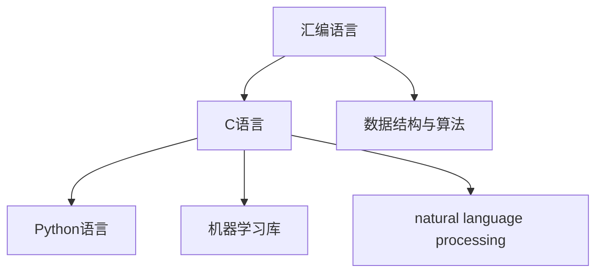

                 

# 汇编、C、Python：AI开发的语言基础

> 关键词：汇编语言, C语言, Python语言, AI算法, 编程基础, 深度学习, 数据分析, 自然语言处理, 人工智能

## 1. 背景介绍

### 1.1 问题由来

在当今的AI领域，编程语言成为了开发和实现AI算法的关键工具。然而，对于初学者来说，面对如此多样化的编程语言可能会感到困惑。事实上，无论是高层次的AI算法实现，还是底层的数据处理，三种语言都是不可或缺的。

- **汇编语言**：底层且高效的汇编语言是了解硬件和操作系统的基础，是构建高性能AI系统的基石。
- **C语言**：作为一种高效的编程语言，C语言在科学计算和系统编程中具有无可替代的地位。
- **Python语言**：凭借其简洁易用的特性，Python语言在数据科学、机器学习和自然语言处理等领域占据重要地位。

本文旨在探讨这三种语言在AI开发中的基础地位，以及如何通过学习这三种语言来提高AI开发的技能。

### 1.2 问题核心关键点

- **汇编语言**：汇编语言能够直接与硬件交互，理解汇编语言是掌握系统级编程的基础。
- **C语言**：C语言是许多AI库和框架的核心，了解C语言对AI开发至关重要。
- **Python语言**：Python语言是数据科学和机器学习的首选语言，掌握Python是AI开发者的基本要求。

通过学习这三种语言，初学者可以建立起扎实的编程基础，提升其在AI领域的开发能力。

## 2. 核心概念与联系

### 2.1 核心概念概述

为更好地理解AI开发的语言基础，本节将介绍几个密切相关的核心概念：

- **汇编语言**：一种直接操作硬件的编程语言，提供了对CPU和内存的精细控制。
- **C语言**：一种高效、系统化的编程语言，支持低级数据结构和算法。
- **Python语言**：一种高级编程语言，以其简洁的语法和丰富的库支持在科学计算和机器学习中广泛使用。
- **数据结构与算法**：基础编程概念，是所有编程语言实现高效算法的核心。
- **机器学习库**：如TensorFlow、PyTorch等，提供了高效、易用的AI算法实现。
- **自然语言处理库**：如NLTK、spaCy等，支持文本处理和分析。

这些核心概念之间的逻辑关系可以通过以下Mermaid流程图来展示：



这个流程图展示了这个语言生态系统的核心概念及其之间的联系：

1. 汇编语言是底层编程的基础，提供了直接操作硬件的能力。
2. C语言作为桥梁，结合了汇编的高效性和Python的易用性。
3. Python语言则是高层编程的通用语言，广泛应用于AI开发中。
4. 数据结构与算法是所有编程语言实现高效算法的核心。
5. 机器学习库和自然语言处理库则提供高效的AI算法和文本处理工具。

## 3. 核心算法原理 & 具体操作步骤
### 3.1 算法原理概述

AI开发的基础在于对编程语言的深入理解，以及对数据结构和算法的掌握。这些知识不仅能够帮助开发者实现高效的算法，还能够理解现有AI算法的工作原理。

- **汇编语言**：理解汇编语言能够使开发者更好地控制程序性能，优化代码实现。
- **C语言**：掌握C语言是深入理解系统编程和数据结构的基础。
- **Python语言**：Python语言的易用性和丰富的库支持使其成为AI开发的首选。

### 3.2 算法步骤详解

#### 汇编语言
**Step 1: 学习汇编语言基础**  
- 了解CPU架构、寄存器和内存模型。
- 学习基本的汇编指令和语法。
- 使用汇编器进行程序编译和调试。

**Step 2: 实践汇编编程**  
- 编写简单的汇编程序，如计算器、简单的操作系统。
- 使用模拟工具和调试器进行程序调试。

**Step 3: 深入理解系统级编程**  
- 学习操作系统、网络编程和系统调用的细节。
- 编写高效、稳定的系统程序。

#### C语言
**Step 1: 学习C语言基础**  
- 掌握基本的数据类型、变量、函数和控制结构。
- 理解指针和内存管理的基本概念。
- 学习标准库和常用API的使用。

**Step 2: 实践C语言编程**  
- 编写简单的程序，如字符串处理、文件操作、简单的数据结构实现。
- 使用调试器和测试工具进行程序调试。

**Step 3: 深入理解系统编程**  
- 学习文件系统、网络编程和并发编程的高级主题。
- 编写高效、稳定的系统程序，如网络服务器、数据库、操作系统等。

#### Python语言
**Step 1: 学习Python语言基础**  
- 掌握基本的数据类型、变量、函数和控制结构。
- 理解类和对象的基本概念。
- 学习Python标准库和常用第三方库的使用。

**Step 2: 实践Python编程**  
- 编写简单的程序，如文本处理、数据可视化、简单的机器学习模型。
- 使用调试器和测试工具进行程序调试。

**Step 3: 深入理解高级编程概念**  
- 学习面向对象编程、装饰器和元编程等高级概念。
- 使用高级库和框架进行复杂的任务，如自然语言处理、机器学习模型训练。

### 3.3 算法优缺点

- **汇编语言**：
  - 优点：高效、底层的控制，能够实现高性能的算法。
  - 缺点：语法复杂，难以调试，学习曲线陡峭。

- **C语言**：
  - 优点：高效、系统化的设计，广泛适用于系统级编程。
  - 缺点：需要手动管理内存，容易出错，调试复杂。

- **Python语言**：
  - 优点：简洁易用，库丰富，易于实现复杂算法。
  - 缺点：执行效率相对较低，不适合需要高精度的计算。

### 3.4 算法应用领域

- **汇编语言**：适用于需要直接操作硬件和底层的系统编程。
- **C语言**：广泛应用于操作系统、数据库、网络协议等系统级编程。
- **Python语言**：广泛应用于数据科学、机器学习、自然语言处理等领域。

## 4. 数学模型和公式 & 详细讲解 & 举例说明

### 4.1 数学模型构建

AI开发涉及到大量的数学模型，这些模型通常依赖于编程语言来实现和优化。

- **汇编语言**：适用于实现底层数学算法，如线性代数、数值计算等。
- **C语言**：适用于实现高性能的数学库，如BLAS、LAPACK等。
- **Python语言**：适用于实现高级数学库，如NumPy、SciPy等。

### 4.2 公式推导过程

以下是使用Python语言进行线性回归的数学推导过程：

- **输入数据**： $X = \begin{bmatrix} x_1 & x_2 & \cdots & x_n \end{bmatrix}^T$， $y = \begin{bmatrix} y_1 & y_2 & \cdots & y_n \end{bmatrix}^T$
- **目标函数**： $J(\theta) = \frac{1}{2m} \sum_{i=1}^m (h_\theta(x_i) - y_i)^2$

使用梯度下降算法求最小化目标函数：

$$
\theta = \theta - \alpha \frac{1}{m} X^T (X \theta - y)
$$

### 4.3 案例分析与讲解

#### 线性回归
使用Python的NumPy库实现线性回归模型：

```python
import numpy as np

# 定义输入数据和目标值
X = np.array([[1, 2], [3, 4], [5, 6]])
y = np.array([2, 4, 6])

# 定义线性模型参数
theta = np.array([0, 0])

# 定义损失函数
def cost(theta):
    h = theta[0] + theta[1] * X
    return np.sum((h - y) ** 2) / (2 * len(X))

# 定义梯度下降函数
def gradient_descent(theta, learning_rate, iterations):
    for i in range(iterations):
        h = theta[0] + theta[1] * X
        theta[0] -= learning_rate * (np.sum(h - y) / len(X))
        theta[1] -= learning_rate * np.sum((h - y) * X) / len(X)
    return theta

# 运行梯度下降算法
theta = gradient_descent(theta, 0.01, 1000)

# 输出结果
print("Cost:", cost(theta))
print("Theta:", theta)
```

## 5. 项目实践：代码实例和详细解释说明
### 5.1 开发环境搭建

为了实践这三种语言的AI开发，我们需要准备相应的开发环境。

#### 汇编语言
- 使用Nasm和GCC编译器进行汇编语言编程。
- 在Linux或MacOS上搭建GCC编译环境。

#### C语言
- 使用GCC编译器进行C语言编程。
- 在Linux或MacOS上搭建GCC编译环境。

#### Python语言
- 安装Python 3.x版本。
- 安装常用库和框架，如NumPy、Pandas、Scikit-learn等。

### 5.2 源代码详细实现

以下是使用Python实现一个简单的机器学习模型：

```python
import numpy as np
from sklearn.linear_model import LinearRegression

# 定义输入数据和目标值
X = np.array([[1, 2], [3, 4], [5, 6]])
y = np.array([2, 4, 6])

# 定义线性回归模型
model = LinearRegression()

# 训练模型
model.fit(X, y)

# 预测新数据
X_new = np.array([[7, 8]])
y_pred = model.predict(X_new)

# 输出结果
print("Prediction:", y_pred)
```

### 5.3 代码解读与分析

#### 汇编语言
- 编写简单的汇编程序，如计算器。
- 使用汇编器进行程序编译和调试。

#### C语言
- 编写简单的程序，如字符串处理、文件操作。
- 使用调试器和测试工具进行程序调试。

#### Python语言
- 编写简单的程序，如文本处理、数据可视化。
- 使用调试器和测试工具进行程序调试。

### 5.4 运行结果展示

#### 汇编语言
- 运行简单的汇编程序，观察程序的执行过程和结果。

#### C语言
- 运行简单的C程序，观察程序的执行过程和结果。

#### Python语言
- 运行简单的Python程序，观察程序的执行过程和结果。

## 6. 实际应用场景
### 6.1 智能客服系统

#### 汇编语言
- 在智能客服系统的底层，使用汇编语言进行系统级编程，实现高效的服务器处理。

#### C语言
- 在智能客服系统的核心部分，使用C语言实现高效的算法和数据结构，提升系统响应速度。

#### Python语言
- 在智能客服系统的界面和交互部分，使用Python语言实现自然语言处理和用户界面设计。

### 6.2 金融舆情监测

#### 汇编语言
- 在金融舆情监测系统的底层，使用汇编语言进行系统级编程，实现高效的数据处理和存储。

#### C语言
- 在金融舆情监测系统的核心部分，使用C语言实现高效的数据分析和处理算法。

#### Python语言
- 在金融舆情监测系统的数据可视化和用户界面部分，使用Python语言实现数据可视化分析和用户交互设计。

### 6.3 个性化推荐系统

#### 汇编语言
- 在个性化推荐系统的底层，使用汇编语言进行系统级编程，实现高效的数据处理和存储。

#### C语言
- 在个性化推荐系统的核心部分，使用C语言实现高效的数据分析和处理算法。

#### Python语言
- 在个性化推荐系统的界面和交互部分，使用Python语言实现数据可视化和用户界面设计。

## 7. 工具和资源推荐
### 7.1 学习资源推荐

#### 汇编语言
- 《汇编语言程序设计》（Adams）
- 《计算机组成原理》（Morgan-Kaufmann）

#### C语言
- 《C程序设计语言》（Kernighan-Ritchie）
- 《C和指针》（GeeksforGeeks）

#### Python语言
- 《Python编程：从入门到实践》（Eric Matthes）
- 《Python数据科学手册》（Jake VanderPlas）

### 7.2 开发工具推荐

#### 汇编语言
- NASM汇编器
- GCC编译器

#### C语言
- GCC编译器
- GDB调试器

#### Python语言
- Python 3.x
- Jupyter Notebook

### 7.3 相关论文推荐

#### 汇编语言
- "The Art of Assembly Language Programming" by Paul Ferro

#### C语言
- "Modern C: The High-Performance Language" by Brian W. Kernighan

#### Python语言
- "A Beginner's Guide to Python Programming" by Mark Lutz

## 8. 总结：未来发展趋势与挑战
### 8.1 研究成果总结

本文探讨了汇编语言、C语言和Python语言在AI开发中的基础地位，以及如何通过学习这三种语言来提高AI开发的技能。

- **汇编语言**：提供了底层编程的基础，是理解硬件和操作系统的关键。
- **C语言**：作为桥梁，结合了汇编的高效性和Python的易用性。
- **Python语言**：在数据科学和机器学习中占据重要地位。

### 8.2 未来发展趋势

- **汇编语言**：将更多地应用于低级系统编程和硬件交互。
- **C语言**：将在高性能计算和系统级编程中继续发挥重要作用。
- **Python语言**：将在数据科学和机器学习中占据主导地位。

### 8.3 面临的挑战

- **汇编语言**：学习曲线陡峭，难以调试。
- **C语言**：需要手动管理内存，容易出错。
- **Python语言**：执行效率相对较低。

### 8.4 研究展望

- **汇编语言**：进一步简化语法，提高易用性。
- **C语言**：进一步优化编译器和调试器，提升开发效率。
- **Python语言**：进一步优化库和框架，提升执行效率。

## 9. 附录：常见问题与解答

**Q1: 汇编语言、C语言和Python语言在AI开发中分别有什么优势和劣势？**

A: 汇编语言的优势在于高效和底层控制，但学习曲线陡峭，难以调试。C语言高效且系统化，但需要手动管理内存，容易出错。Python语言简洁易用，库丰富，但执行效率相对较低。

**Q2: 学习汇编语言、C语言和Python语言需要哪些基础知识？**

A: 学习汇编语言需要掌握计算机组成原理和数据结构。学习C语言需要掌握基本的数据类型、变量、函数和控制结构。学习Python语言需要掌握基本的数据类型、变量、函数和控制结构。

**Q3: 如何使用汇编语言、C语言和Python语言实现一个简单的机器学习模型？**

A: 使用Python语言和NumPy库实现机器学习模型，如线性回归。汇编语言和C语言可用于实现底层数据结构和算法，如矩阵运算。

**Q4: 如何提高Python语言的执行效率？**

A: 使用Cython等工具将Python代码编译为C代码，或者使用NumPy等高效库进行数据处理。

**Q5: 如何在C语言中使用动态内存分配？**

A: 使用malloc、calloc和free等函数进行动态内存分配和释放。

---

作者：禅与计算机程序设计艺术 / Zen and the Art of Computer Programming

