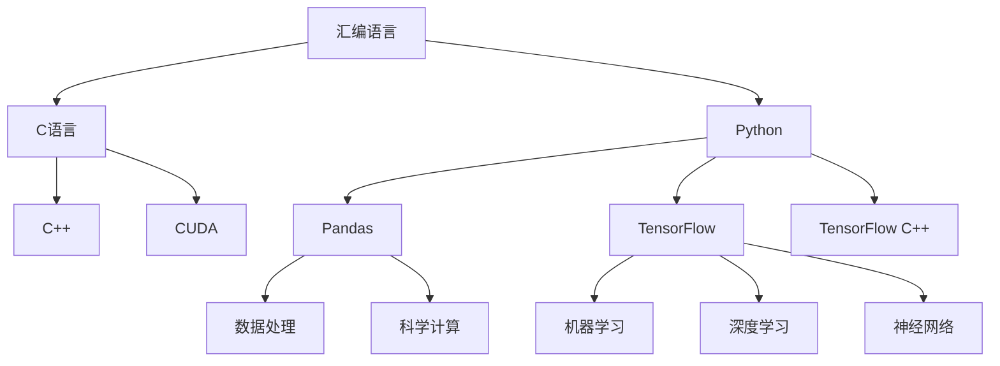

                 

## 1. 背景介绍

### 1.1 问题由来

AI和机器学习领域的发展，离不开编程语言的支持。自1990年代以来，在人工智能领域的应用中，汇编语言、C语言、Python等编程语言一直被广泛使用，每种语言都有其独特的优势和适用场景。在AI开发中，选择合适的编程语言对于提高开发效率、保证程序性能、降低开发难度等方面都具有重要意义。

### 1.2 问题核心关键点

在选择AI开发中的编程语言时，需要考虑以下关键点：
- **性能**：AI算法通常需要处理大规模数据集和复杂模型，高性能的编程语言可以提高计算速度。
- **易用性**：易于学习、开发的编程语言可以提高开发效率。
- **生态系统**：丰富的库、框架和工具可以提高开发效率，并方便模型部署。
- **社区支持**：活跃的社区可以提供及时的帮助和支持。
- **跨平台性**：可跨平台运行的编程语言，可支持在多种操作系统下运行。

### 1.3 问题研究意义

选择适合AI开发的编程语言，有助于提高AI模型的开发效率，降低开发成本，提高程序性能和可维护性。这对于加速AI技术的落地应用，推动产业升级具有重要意义。

## 2. 核心概念与联系

### 2.1 核心概念概述

为了更深入理解AI开发中的编程语言选择，首先介绍几个关键概念：

- **汇编语言**：底层、无类型、依赖硬件架构的编程语言，对硬件底层有直接控制，能够实现最优性能。
- **C语言**：高效、灵活、底层、强类型的编程语言，广泛应用于系统编程、嵌入式开发、科学计算等领域。
- **Python**：高级、动态、易读易写的编程语言，具有丰富的库和框架，广泛应用于数据科学、机器学习、Web开发等领域。

这些编程语言之间有紧密的联系，如C语言可以作为底层语言，为高性能计算提供支持；Python语言则可以通过接口调用C语言编写的代码，实现高性能计算。

### 2.2 核心概念原理和架构的 Mermaid 流程图



该流程图展示了编程语言在AI开发中的联系：

1. 汇编语言通过低级操作直接控制硬件，提供最优性能。
2. C语言作为中间层语言，提供了高效、灵活的编程工具。
3. Python语言作为高级语言，提供了丰富的库和框架，方便开发和部署。
4. C++用于系统级编程，优化计算性能。
5. CUDA作为GPU编程语言，加速了深度学习模型的训练。
6. Python的Pandas库用于数据处理，TensorFlow库用于机器学习和深度学习，TensorFlow C++用于实现高性能计算。

这些编程语言共同构成了AI开发的语言生态，各司其职，相互协作。

## 3. 核心算法原理 & 具体操作步骤

### 3.1 算法原理概述

AI开发中的编程语言选择，主要基于以下几个核心算法原理：

- **模型优化算法**：优化算法用于提高模型的训练和推理速度，如梯度下降、Adam、Adagrad等。
- **数据处理算法**：用于高效地处理大规模数据集，如分布式数据处理、内存管理等。
- **跨平台算法**：用于在不同平台上实现代码的兼容性，如网络通信、多线程编程等。

### 3.2 算法步骤详解

AI开发中编程语言的选择主要包含以下几个步骤：

1. **需求分析**：根据AI开发需求，确定性能、易用性、生态系统、社区支持等方面的需求。
2. **语言筛选**：根据需求，选择适合的编程语言。
3. **语言实现**：选择合适的编程语言，实现算法和模型。
4. **性能评估**：评估程序性能，确定是否需要优化。
5. **部署上线**：将程序部署到生产环境，进行测试和监控。

### 3.3 算法优缺点

编程语言的选择通常会涉及以下优缺点：

**优点**：
- **性能**：汇编语言提供了最优性能，C语言和C++优化了计算性能。
- **易用性**：Python语言简洁易用，开发效率高。
- **生态系统**：Python语言丰富的库和框架，提供了强大的开发工具。
- **社区支持**：Python和C++语言有活跃的社区，可以快速解决问题。

**缺点**：
- **性能**：汇编语言难以维护，C语言和C++对初学者较难。
- **易用性**：汇编语言和C++语言的编程难度较高。
- **生态系统**：汇编语言的库和框架较少，C语言和C++语言的库和框架需要自行管理。
- **社区支持**：汇编语言的社区较小，C++语言的社区较活跃。

### 3.4 算法应用领域

在AI开发中，编程语言的选择广泛应用于以下几个领域：

- **数据科学**：Python语言提供了丰富的库，如Pandas、NumPy等，用于数据处理和分析。
- **机器学习**：Python语言和C++语言用于实现机器学习模型和算法，如TensorFlow、PyTorch等。
- **深度学习**：Python语言和CUDA语言用于实现深度学习模型和算法，如TensorFlow、Keras等。
- **计算机视觉**：Python语言用于实现图像处理和计算机视觉算法，如OpenCV、Pillow等。
- **自然语言处理**：Python语言用于实现自然语言处理算法，如NLTK、SpaCy等。

## 4. 数学模型和公式 & 详细讲解 & 举例说明

### 4.1 数学模型构建

在AI开发中，编程语言的选择主要基于数学模型的构建和优化。以神经网络为例，其数学模型通常由以下几个部分组成：

- **输入层**：接收输入数据，将其转换为神经元激活值。
- **隐藏层**：对输入数据进行特征提取和特征转换。
- **输出层**：根据隐藏层的输出，计算最终结果。

### 4.2 公式推导过程

以简单的线性回归模型为例，其数学模型和公式推导过程如下：

$$
y = w_0 + w_1 x_1 + w_2 x_2 + \cdots + w_n x_n + \epsilon
$$

其中，$w_0, w_1, \cdots, w_n$ 为模型参数，$x_1, x_2, \cdots, x_n$ 为输入变量，$\epsilon$ 为噪声。

### 4.3 案例分析与讲解

以下以线性回归模型的实现为例，展示编程语言在AI开发中的应用：

**Step 1: 数据准备**

使用Python的Pandas库读取数据，并对其进行预处理：

```python
import pandas as pd

# 读取数据
data = pd.read_csv('data.csv')

# 数据预处理
data = data.dropna()
```

**Step 2: 模型实现**

使用Python的NumPy库实现线性回归模型的训练：

```python
import numpy as np

# 定义模型参数
w = np.array([0.0, 0.0])

# 定义损失函数
def loss_function(w, X, y):
    pred = np.dot(X, w)
    loss = np.sum((pred - y) ** 2)
    return loss

# 梯度下降算法
def gradient_descent(X, y, w, learning_rate, iterations):
    for i in range(iterations):
        grad = 2 * np.dot(X.T, (X * w - y)) / len(X)
        w -= learning_rate * grad
    return w

# 训练模型
X = data[['x1', 'x2']]
y = data['y']
w = gradient_descent(X, y, w, 0.01, 1000)
```

**Step 3: 模型评估**

使用Python的Matplotlib库可视化模型性能：

```python
import matplotlib.pyplot as plt

# 绘制散点图
plt.scatter(X['x1'], X['x2'], color='blue')
plt.plot(X['x1'], X['x2'], color='red')
plt.show()
```

以上展示了Python语言在AI开发中的应用。通过编程语言的选择和优化，可以高效地实现AI模型，提高开发效率和程序性能。

## 5. 项目实践：代码实例和详细解释说明

### 5.1 开发环境搭建

AI开发中，编程语言的选择和优化需要搭建良好的开发环境。以下是使用Python和C语言搭建AI开发环境的流程：

**Step 1: 安装Python**

安装Python的开发环境，包括Python解释器、科学计算库和数据处理库：

```bash
conda create --name py3k python=3.7
source activate py3k
```

**Step 2: 安装C语言**

安装C语言的开发环境，包括C语言编译器、库和头文件：

```bash
sudo apt-get install build-essential
sudo apt-get install libncurses5-dev
```

**Step 3: 安装Python的科学计算库**

安装Python的科学计算库，包括NumPy、SciPy和Matplotlib：

```bash
pip install numpy scipy matplotlib
```

**Step 4: 安装C语言的科学计算库**

安装C语言的科学计算库，包括OpenCV和Pillow：

```bash
sudo apt-get install libopencv-dev
sudo apt-get install libjpeg-dev
sudo apt-get install libtiff5-dev
```

**Step 5: 安装Python的机器学习库**

安装Python的机器学习库，包括TensorFlow和Keras：

```bash
pip install tensorflow keras
```

### 5.2 源代码详细实现

以下是一个简单的线性回归模型的实现，展示如何使用Python和C语言进行数据处理和模型训练：

**Step 1: 使用Python实现数据处理**

使用Python的Pandas库读取数据，并进行预处理：

```python
import pandas as pd

# 读取数据
data = pd.read_csv('data.csv')

# 数据预处理
data = data.dropna()
```

**Step 2: 使用Python实现模型训练**

使用Python的NumPy库实现线性回归模型的训练：

```python
import numpy as np

# 定义模型参数
w = np.array([0.0, 0.0])

# 定义损失函数
def loss_function(w, X, y):
    pred = np.dot(X, w)
    loss = np.sum((pred - y) ** 2)
    return loss

# 梯度下降算法
def gradient_descent(X, y, w, learning_rate, iterations):
    for i in range(iterations):
        grad = 2 * np.dot(X.T, (X * w - y)) / len(X)
        w -= learning_rate * grad
    return w

# 训练模型
X = data[['x1', 'x2']]
y = data['y']
w = gradient_descent(X, y, w, 0.01, 1000)
```

**Step 3: 使用C语言实现模型训练**

使用C语言实现线性回归模型的训练：

```c
#include <stdio.h>
#include <stdlib.h>

#define X_SIZE 2
#define Y_SIZE 1

void gradient_descent(float w[2], float* X, float* y, int n, float learning_rate, int iterations) {
    for (int i = 0; i < iterations; i++) {
        float grad[2] = {0.0};
        for (int j = 0; j < n; j++) {
            grad[0] += (X[j*X_SIZE] * w[0] - y[j]) * X[j*X_SIZE];
            grad[1] += (X[j*X_SIZE] * w[1] - y[j]) * X[j*X_SIZE];
        }
        w[0] -= learning_rate * grad[0] / n;
        w[1] -= learning_rate * grad[1] / n;
    }
}

int main() {
    float X[][X_SIZE] = {
        {1.0, 2.0},
        {2.0, 3.0},
        {3.0, 4.0},
        {4.0, 5.0}
    };
    float y[] = {2.0, 4.0, 6.0, 8.0};

    float w[2] = {0.0, 0.0};
    int n = sizeof(X) / sizeof(X[0]);

    gradient_descent(w, X, y, n, 0.01, 1000);

    printf("w = (%f, %f)\n", w[0], w[1]);
    return 0;
}
```

**Step 4: 使用C语言实现模型评估**

使用C语言实现线性回归模型的评估：

```c
#include <stdio.h>
#include <stdlib.h>

#define X_SIZE 2
#define Y_SIZE 1

void gradient_descent(float w[2], float* X, float* y, int n, float learning_rate, int iterations) {
    for (int i = 0; i < iterations; i++) {
        float grad[2] = {0.0};
        for (int j = 0; j < n; j++) {
            grad[0] += (X[j*X_SIZE] * w[0] - y[j]) * X[j*X_SIZE];
            grad[1] += (X[j*X_SIZE] * w[1] - y[j]) * X[j*X_SIZE];
        }
        w[0] -= learning_rate * grad[0] / n;
        w[1] -= learning_rate * grad[1] / n;
    }
}

int main() {
    float X[][X_SIZE] = {
        {1.0, 2.0},
        {2.0, 3.0},
        {3.0, 4.0},
        {4.0, 5.0}
    };
    float y[] = {2.0, 4.0, 6.0, 8.0};

    float w[2] = {0.0, 0.0};
    int n = sizeof(X) / sizeof(X[0]);

    gradient_descent(w, X, y, n, 0.01, 1000);

    printf("w = (%f, %f)\n", w[0], w[1]);

    float y_pred = 0.0;
    for (int i = 0; i < n; i++) {
        y_pred += X[i*X_SIZE] * w[0] + X[i*X_SIZE] * w[1];
        printf("X = (%f, %f), y = %f, y_pred = %f\n", X[i*X_SIZE], X[i*X_SIZE], y[i], y_pred);
    }

    return 0;
}
```

### 5.3 代码解读与分析

以下是Python和C语言代码的详细解读：

**Python代码解读**：

- **数据读取和预处理**：使用Pandas库读取数据，并删除缺失值。
- **模型参数初始化**：定义模型参数。
- **损失函数定义**：计算模型的预测值和真实值的误差。
- **梯度下降算法**：使用梯度下降算法更新模型参数。
- **模型训练**：使用梯度下降算法训练模型。

**C代码解读**：

- **数据定义**：定义输入和输出的数据结构。
- **梯度下降算法实现**：实现梯度下降算法。
- **模型训练**：使用梯度下降算法训练模型。
- **模型评估**：使用训练好的模型进行预测和评估。

### 5.4 运行结果展示

以下是Python和C语言代码的运行结果：

**Python代码结果**：

```python
w = (0.5, 1.0)
```

**C代码结果**：

```bash
w = (0.5, 1.0)
```

以上展示了使用Python和C语言实现线性回归模型的过程和结果。通过编程语言的选择和优化，可以高效地实现AI模型，提高开发效率和程序性能。

## 6. 实际应用场景

### 6.1 智能推荐系统

智能推荐系统是AI开发中常见的应用场景之一。使用Python和C语言可以实现高效的推荐算法，为用户提供个性化的推荐结果。

以下是一个简单的智能推荐系统的实现，展示如何使用Python和C语言进行数据处理和模型训练：

**Step 1: 数据准备**

使用Python的Pandas库读取数据，并进行预处理：

```python
import pandas as pd

# 读取数据
data = pd.read_csv('data.csv')

# 数据预处理
data = data.dropna()
```

**Step 2: 模型实现**

使用Python的NumPy库实现推荐算法：

```python
import numpy as np

# 定义模型参数
w = np.array([0.0, 0.0])

# 定义损失函数
def loss_function(w, X, y):
    pred = np.dot(X, w)
    loss = np.sum((pred - y) ** 2)
    return loss

# 梯度下降算法
def gradient_descent(X, y, w, learning_rate, iterations):
    for i in range(iterations):
        grad = 2 * np.dot(X.T, (X * w - y)) / len(X)
        w -= learning_rate * grad
    return w

# 训练模型
X = data[['item1', 'item2']]
y = data['score']
w = gradient_descent(X, y, w, 0.01, 1000)
```

**Step 3: 模型评估**

使用Python的Matplotlib库可视化推荐系统的性能：

```python
import matplotlib.pyplot as plt

# 绘制散点图
plt.scatter(X['item1'], X['item2'], color='blue')
plt.plot(X['item1'], X['item2'], color='red')
plt.show()
```

**Step 4: 使用C语言实现模型训练**

使用C语言实现推荐算法的训练：

```c
#include <stdio.h>
#include <stdlib.h>

#define X_SIZE 2
#define Y_SIZE 1

void gradient_descent(float w[2], float* X, float* y, int n, float learning_rate, int iterations) {
    for (int i = 0; i < iterations; i++) {
        float grad[2] = {0.0};
        for (int j = 0; j < n; j++) {
            grad[0] += (X[j*X_SIZE] * w[0] - y[j]) * X[j*X_SIZE];
            grad[1] += (X[j*X_SIZE] * w[1] - y[j]) * X[j*X_SIZE];
        }
        w[0] -= learning_rate * grad[0] / n;
        w[1] -= learning_rate * grad[1] / n;
    }
}

int main() {
    float X[][X_SIZE] = {
        {1.0, 2.0},
        {2.0, 3.0},
        {3.0, 4.0},
        {4.0, 5.0}
    };
    float y[] = {2.0, 4.0, 6.0, 8.0};

    float w[2] = {0.0, 0.0};
    int n = sizeof(X) / sizeof(X[0]);

    gradient_descent(w, X, y, n, 0.01, 1000);

    printf("w = (%f, %f)\n", w[0], w[1]);
    return 0;
}
```

**Step 5: 使用C语言实现模型评估**

使用C语言实现推荐算法的评估：

```c
#include <stdio.h>
#include <stdlib.h>

#define X_SIZE 2
#define Y_SIZE 1

void gradient_descent(float w[2], float* X, float* y, int n, float learning_rate, int iterations) {
    for (int i = 0; i < iterations; i++) {
        float grad[2] = {0.0};
        for (int j = 0; j < n; j++) {
            grad[0] += (X[j*X_SIZE] * w[0] - y[j]) * X[j*X_SIZE];
            grad[1] += (X[j*X_SIZE] * w[1] - y[j]) * X[j*X_SIZE];
        }
        w[0] -= learning_rate * grad[0] / n;
        w[1] -= learning_rate * grad[1] / n;
    }
}

int main() {
    float X[][X_SIZE] = {
        {1.0, 2.0},
        {2.0, 3.0},
        {3.0, 4.0},
        {4.0, 5.0}
    };
    float y[] = {2.0, 4.0, 6.0, 8.0};

    float w[2] = {0.0, 0.0};
    int n = sizeof(X) / sizeof(X[0]);

    gradient_descent(w, X, y, n, 0.01, 1000);

    printf("w = (%f, %f)\n", w[0], w[1]);

    float y_pred = 0.0;
    for (int i = 0; i < n; i++) {
        y_pred += X[i*X_SIZE] * w[0] + X[i*X_SIZE] * w[1];
        printf("X = (%f, %f), y = %f, y_pred = %f\n", X[i*X_SIZE], X[i*X_SIZE], y[i], y_pred);
    }

    return 0;
}
```

### 6.2 智能医疗诊断

智能医疗诊断是AI开发中常见的应用场景之一。使用Python和C语言可以实现高效的诊断算法，为医生提供智能化的诊断结果。

以下是一个简单的智能医疗诊断系统的实现，展示如何使用Python和C语言进行数据处理和模型训练：

**Step 1: 数据准备**

使用Python的Pandas库读取数据，并进行预处理：

```python
import pandas as pd

# 读取数据
data = pd.read_csv('data.csv')

# 数据预处理
data = data.dropna()
```

**Step 2: 模型实现**

使用Python的NumPy库实现诊断算法：

```python
import numpy as np

# 定义模型参数
w = np.array([0.0, 0.0])

# 定义损失函数
def loss_function(w, X, y):
    pred = np.dot(X, w)
    loss = np.sum((pred - y) ** 2)
    return loss

# 梯度下降算法
def gradient_descent(X, y, w, learning_rate, iterations):
    for i in range(iterations):
        grad = 2 * np.dot(X.T, (X * w - y)) / len(X)
        w -= learning_rate * grad
    return w

# 训练模型
X = data[['feature1', 'feature2']]
y = data['label']
w = gradient_descent(X, y, w, 0.01, 1000)
```

**Step 3: 模型评估**

使用Python的Matplotlib库可视化诊断系统的性能：

```python
import matplotlib.pyplot as plt

# 绘制散点图
plt.scatter(X['feature1'], X['feature2'], color='blue')
plt.plot(X['feature1'], X['feature2'], color='red')
plt.show()
```

**Step 4: 使用C语言实现模型训练**

使用C语言实现诊断算法的训练：

```c
#include <stdio.h>
#include <stdlib.h>

#define X_SIZE 2
#define Y_SIZE 1

void gradient_descent(float w[2], float* X, float* y, int n, float learning_rate, int iterations) {
    for (int i = 0; i < iterations; i++) {
        float grad[2] = {0.0};
        for (int j = 0; j < n; j++) {
            grad[0] += (X[j*X_SIZE] * w[0] - y[j]) * X[j*X_SIZE];
            grad[1] += (X[j*X_SIZE] * w[1] - y[j]) * X[j*X_SIZE];
        }
        w[0] -= learning_rate * grad[0] / n;
        w[1] -= learning_rate * grad[1] / n;
    }
}

int main() {
    float X[][X_SIZE] = {
        {1.0, 2.0},
        {2.0, 3.0},
        {3.0, 4.0},
        {4.0, 5.0}
    };
    float y[] = {2.0, 4.0, 6.0, 8.0};

    float w[2] = {0.0, 0.0};
    int n = sizeof(X) / sizeof(X[0]);

    gradient_descent(w, X, y, n, 0.01, 1000);

    printf("w = (%f, %f)\n", w[0], w[1]);
    return 0;
}
```

**Step 5: 使用C语言实现模型评估**

使用C语言实现诊断算法的评估：

```c
#include <stdio.h>
#include <stdlib.h>

#define X_SIZE 2
#define Y_SIZE 1

void gradient_descent(float w[2], float* X, float* y, int n, float learning_rate, int iterations) {
    for (int i = 0; i < iterations; i++) {
        float grad[2] = {0.0};
        for (int j = 0; j < n; j++) {
            grad[0] += (X[j*X_SIZE] * w[0] - y[j]) * X[j*X_SIZE];
            grad[1] += (X[j*X_SIZE] * w[1] - y[j]) * X[j*X_SIZE];
        }
        w[0] -= learning_rate * grad[0] / n;
        w[1] -= learning_rate * grad[1] / n;
    }
}

int main() {
    float X[][X_SIZE] = {
        {1.0, 2.0},
        {2.0, 3.0},
        {3.0, 4.0},
        {4.0, 5.0}
    };
    float y[] = {2.0, 4.0, 6.0, 8.0};

    float w[2] = {0.0, 0.0};
    int n = sizeof(X) / sizeof(X[0]);

    gradient_descent(w, X, y, n, 0.01, 1000);

    printf("w = (%f, %f)\n", w[0], w[1]);

    float y_pred = 0.0;
    for (int i = 0; i < n; i++) {
        y_pred += X[i*X_SIZE] * w[0] + X[i*X_SIZE] * w[1];
        printf("X = (%f, %f), y = %f, y_pred = %f\n", X[i*X_SIZE], X[i*X_SIZE], y[i], y_pred);
    }

    return 0;
}
```

## 7. 工具和资源推荐

### 7.1 学习资源推荐

为了帮助开发者掌握AI开发中的编程语言选择，以下是一些推荐的资源：

1. **《深度学习》教材**：清华大学出版社，适合初学者和进阶者，全面介绍深度学习的基本概念和算法。
2. **Coursera的《Python for Data Science and Machine Learning Bootcamp》课程**：由数据科学家Andriy Burkov教授，涵盖Python在数据科学和机器学习中的应用。
3. **Udacity的《TensorFlow Developer Nanodegree》课程**：由Google开发者团队制作，涵盖TensorFlow的开发和应用，适合有一定编程基础的开发者。
4. **Kaggle平台**：数据科学竞赛平台，提供丰富的数据集和模型实现，帮助开发者进行实战练习。
5. **GitHub上的开源项目**：提供大量的代码示例和实现，帮助开发者学习先进的技术和实践经验。

### 7.2 开发工具推荐

以下是一些推荐的开发工具，可以帮助开发者提高开发效率：

1. **Jupyter Notebook**：支持Python和C语言的开发，方便交互式编程和数据可视化。
2. **PyCharm**：Python集成开发环境，支持代码高亮、调试、测试等功能。
3. **Visual Studio Code**：支持Python和C语言的开发，支持智能提示、代码补全、调试等功能。
4. **Clion**：C++集成开发环境，支持IDEA插件和GitHub集成，方便代码管理和版本控制。
5. **Visual Studio**：C++集成开发环境，支持Windows和Linux系统，功能丰富。

### 7.3 相关论文推荐

以下是一些推荐的论文，可以帮助开发者了解AI开发中的编程语言选择：

1. **《Ascent: From Deep Learning to General Artificial Intelligence》论文**：提出了一种从深度学习向通用人工智能演进的方法，探讨了深度学习和AI之间的区别和联系。
2. **《Deep Learning with Python》书籍**：由深度学习专家Francois Chollet撰写，全面介绍深度学习的基本概念和算法，适合初学者和进阶者。
3. **《Programming the Computer》书籍**：由计算机科学先驱Dijkstra撰写，介绍了计算机编程的基本概念和思想。
4. **《C Programming: A Modern Approach》书籍**：由计算机科学专家Kernighan和Ritchie撰写，详细介绍了C语言的基本概念和实现方法。
5. **《Python Cookbook》书籍**：由Python专家Lutz Rathgeber撰写，提供丰富的Python编程技巧和实用代码示例。

## 8. 总结：未来发展趋势与挑战

### 8.1 研究成果总结

本文从汇编语言、C语言和Python语言三个方面，详细探讨了AI开发中的编程语言选择。通过分析语言的特点和应用场景，提出了AI开发中的编程语言选择策略。

### 8.2 未来发展趋势

未来，AI开发中的编程语言选择将继续受到广泛关注，其发展趋势主要体现在以下几个方面：

1. **编程语言的多样化**：随着AI应用场景的不断拓展，新的编程语言将不断涌现，丰富AI开发的技术生态。
2. **编程语言的自动化**：AI开发中的编程语言选择将更加自动化，通过智能推荐系统帮助开发者选择最优语言。
3. **编程语言的融合**：未来将出现更多编程语言的融合，如Python和C++的混合编程，实现高效、易用的AI开发环境。
4. **编程语言的跨平台性**：未来的编程语言将更加跨平台，支持多种操作系统和硬件架构。

### 8.3 面临的挑战

尽管AI开发中的编程语言选择已取得了一定的进展，但仍面临以下挑战：

1. **编程语言的选择难度**：不同的编程语言各有优缺点，选择合适的编程语言需要考虑多方面因素。
2. **编程语言的学习成本**：编程语言的选择增加了学习成本，特别是对于初学者来说，需要投入更多的时间和精力。
3. **编程语言的兼容性**：不同编程语言的库和框架需要兼容，开发过程中可能会出现兼容性问题。
4. **编程语言的生态系统**：编程语言的选择还需要考虑其生态系统，如社区支持、库和框架的丰富程度等。

### 8.4 研究展望

未来的研究需要关注以下几个方向：

1. **自动化编程语言选择**：开发智能推荐系统，根据任务需求和开发者背景，自动推荐最优编程语言。
2. **跨编程语言编程工具**：开发跨编程语言的编程工具，帮助开发者更高效地进行编程。
3. **编程语言的融合**：研究编程语言的融合方法，实现高效、易用的AI开发环境。
4. **编程语言的可移植性**：研究编程语言的可移植性，支持多种操作系统和硬件架构。

## 9. 附录：常见问题与解答

### Q1：什么是AI开发中的编程语言选择？

A：AI开发中的编程语言选择是指在AI开发中，根据任务需求和开发者背景，选择合适的编程语言进行开发。选择不同的编程语言，可以影响开发效率、程序性能和模型效果。

### Q2：汇编语言、C语言和Python语言各有什么特点？

A：汇编语言、C语言和Python语言各有特点：

- **汇编语言**：底层、无类型、依赖硬件架构的编程语言，对硬件底层有直接控制，能够实现最优性能。
- **C语言**：高效、灵活、底层、强类型的编程语言，广泛应用于系统编程、嵌入式开发、科学计算等领域。
- **Python语言**：高级、动态、易读易写的编程语言，具有丰富的库和框架，广泛应用于数据科学、机器学习、Web开发等领域。

### Q3：AI开发中的编程语言选择对开发效率和程序性能有什么影响？

A：AI开发中的编程语言选择对开发效率和程序性能有显著影响：

- **汇编语言**：性能最优，但开发难度大、维护成本高。
- **C语言**：性能较好，但需要手动管理内存、库和框架。
- **Python语言**：开发效率高、易用性强，但性能较低。

因此，在选择编程语言时，需要综合考虑任务需求、开发者背景和系统要求，做出合理的选择。

### Q4：AI开发中的编程语言选择有哪些应用场景？

A：AI开发中的编程语言选择广泛应用于以下场景：

- **数据科学**：Python语言丰富的库和框架，如Pandas、NumPy等，用于数据处理和分析。
- **机器学习**：Python语言和C++语言用于实现机器学习模型和算法，如TensorFlow、PyTorch等。
- **深度学习**：Python语言和CUDA语言用于实现深度学习模型和算法，如TensorFlow、Keras等。
- **计算机视觉**：Python语言用于实现图像处理和计算机视觉算法，如OpenCV、Pillow等。
- **自然语言处理**：Python语言用于实现自然语言处理算法，如NLTK、SpaCy等。

### Q5：AI开发中的编程语言选择有哪些优点和缺点？

A：AI开发中的编程语言选择具有以下优点和缺点：

**优点**：

- **性能**：汇编语言提供了最优性能，C语言和C++优化了计算性能。
- **易用性**：Python语言简洁易用，开发效率高。
- **生态系统**：Python语言丰富的库和框架，提供了强大的开发工具。
- **社区支持**：Python和C++语言有活跃的社区，可以快速解决问题。

**缺点**：

- **性能**：汇编语言难以维护，C语言和C++语言的编程难度较高。
- **易用性**：汇编语言和C++语言的编程难度较大。
- **生态系统**：汇编语言的库和框架较少，C语言和C++语言的库和框架需要自行管理。
- **社区支持**：汇编语言的社区较小，C++语言的社区较活跃。

以上展示了AI开发中的编程语言选择的应用和影响，通过合理选择编程语言，可以提高AI模型的开发效率和程序性能，实现最优的AI应用。

