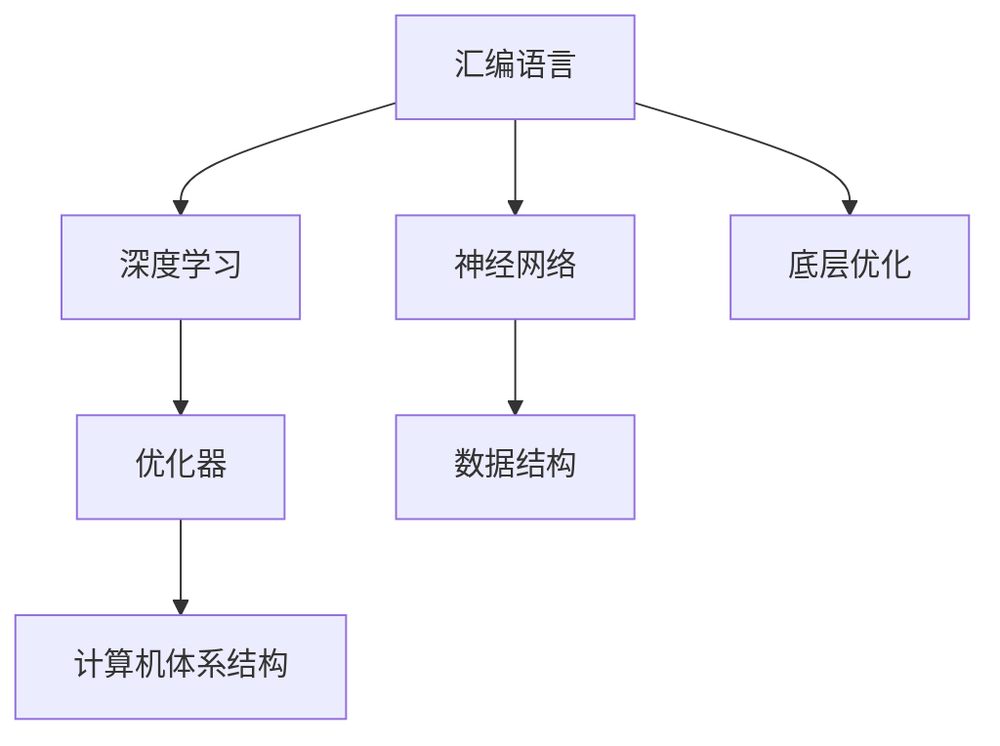

                 

# 汇编语言与AI：底层优化的艺术

> 关键词：汇编语言, 人工智能, 底层优化, 微架构, 深度学习, 优化器, 计算机体系结构, 神经网络, 数据结构

## 1. 背景介绍

### 1.1 问题由来

随着深度学习技术的不断进步，尤其是近年在图像识别、自然语言处理、语音识别等领域的突破，使得人工智能(AI)正在逐步渗透到各行各业。然而，尽管深度学习模型的性能不断提升，其对底层硬件的依赖日益凸显，在优化、加速、低功耗等方面仍存在较大提升空间。

汇编语言作为计算机体系结构最底层的编程语言，直接与硬件交互，具有极高的执行效率。通过汇编语言对AI模型进行底层优化，不仅能够显著提升模型训练和推理的速度，还可以降低能耗，优化内存使用，进一步释放硬件性能潜力。

### 1.2 问题核心关键点

1. **汇编语言与AI模型结合的必要性**：通过汇编语言对AI模型进行底层优化，可以有效提升模型性能，加速模型训练和推理，优化硬件资源使用，降低能耗，从而使得AI模型在实际应用中更加高效、可靠。
2. **汇编语言与AI模型的交互**：如何在保持汇编语言高效性的同时，利用其与硬件的紧密联系，灵活地对AI模型进行优化，是一个值得深入探讨的问题。
3. **汇编语言在AI优化中的应用**：汇编语言在AI模型优化中的应用包括但不限于加速模型训练、优化模型推理、降低能耗、提高内存利用效率等。
4. **汇编语言与现代AI优化器结合**：现有的深度学习优化器如Adam、SGD等无法直接应用于汇编语言，需要通过特定方式进行兼容和优化。
5. **汇编语言优化的挑战**：汇编语言优化的挑战包括但不限于编译器优化、硬件加速、内存优化等。

## 2. 核心概念与联系

### 2.1 核心概念概述

为了更好地理解汇编语言在AI模型优化中的作用，本节将介绍几个密切相关的核心概念：

- **汇编语言(Assembler Language)**：计算机系统中最底层的编程语言，直接与硬件交互，执行效率极高，通常用于编写系统程序和底层驱动。
- **人工智能(Artificial Intelligence, AI)**：模拟人类智能行为的计算机系统，涉及深度学习、自然语言处理、计算机视觉等多个领域。
- **深度学习(Deep Learning)**：AI领域的一个分支，通过多层神经网络进行模式识别和决策。
- **优化器(Optimizer)**：在深度学习中，优化器用于更新模型参数，使得损失函数最小化。
- **计算机体系结构(Computer Architecture)**：计算机硬件和软件的结合体，涉及处理器、内存、输入输出设备等多个方面。
- **神经网络(Neural Network)**：深度学习中的核心组成部分，通过多层神经元进行信息传递和处理。
- **数据结构(Data Structure)**：用于存储和组织数据的抽象数据类型，如数组、链表、树等。

这些概念之间的逻辑关系可以通过以下Mermaid流程图来展示：



这个流程图展示了一些关键概念及其之间的关系：

1. 汇编语言通过底层优化与深度学习模型结合，提高了模型的执行效率和资源使用效率。
2. 神经网络作为深度学习模型的核心部分，直接参与优化器的参数更新过程。
3. 优化器通过更新神经网络参数，使得损失函数最小化。
4. 计算机体系结构提供了硬件支持，确保深度学习模型的高效运行。
5. 数据结构作为存储和组织数据的工具，为深度学习模型的训练和推理提供了基础。

这些概念共同构成了汇编语言与AI模型优化的基础框架，为其高效运行提供了理论支持。

## 3. 核心算法原理 & 具体操作步骤
### 3.1 算法原理概述

汇编语言与AI模型的结合，主要通过底层优化实现。具体而言，汇编语言通过直接操作计算机硬件，利用其高效性对深度学习模型的参数更新、数据存储、内存管理等进行优化。

1. **参数更新优化**：利用汇编语言对深度学习优化器的计算图进行优化，减少计算开销，提高模型训练速度。
2. **数据存储优化**：利用汇编语言直接操作内存，提高数据加载和存储的效率，减少延迟。
3. **内存管理优化**：利用汇编语言实现高效的内存管理，减少内存碎片，提高内存利用率。
4. **硬件加速优化**：利用汇编语言进行硬件加速，如使用GPU、TPU等，提升模型计算能力。

### 3.2 算法步骤详解

以下是基于汇编语言对AI模型进行底层优化的详细步骤：

**Step 1: 选择适当的汇编语言和编译器**

- 选择合适的汇编语言(如x86汇编、MIPS汇编等)和编译器，确保其能够与目标硬件兼容。
- 使用如GCC、LLVM等编译器，将C/C++代码转换为汇编代码，以便后续优化。

**Step 2: 实现深度学习模型**

- 在汇编语言中实现深度学习模型的前向传播和后向传播计算图，包括神经元、激活函数、损失函数等。
- 实现模型参数的加载和保存，以及数据的加载和存储。
- 使用数据结构对模型参数和数据进行组织和管理。

**Step 3: 优化计算过程**

- 利用汇编语言优化模型参数的更新过程，如利用SIMD指令进行向量化计算，提高计算效率。
- 对模型中的数据存储和加载进行优化，减少内存访问开销。
- 对模型的内存管理进行优化，如使用局部性原理和缓存策略，减少内存碎片。
- 利用硬件加速进行优化，如使用GPU、TPU等进行并行计算。

**Step 4: 测试和调试**

- 在目标硬件上测试优化后的模型，确保其正确性和性能提升。
- 使用调试工具如GDB、Valgrind等进行性能分析和调试，找出潜在的性能瓶颈。
- 根据测试结果，不断优化汇编代码，直至达到最优性能。

**Step 5: 部署和应用**

- 将优化后的模型部署到实际应用环境中，如服务器、嵌入式设备等。
- 使用优化后的模型进行深度学习任务的训练和推理，验证其在实际场景中的表现。

### 3.3 算法优缺点

汇编语言在AI模型优化中具有以下优点：

1. **高效性**：汇编语言直接与硬件交互，具有极高的执行效率，可以显著提升模型的训练和推理速度。
2. **灵活性**：汇编语言可以灵活地进行硬件加速和内存管理优化，适用于各种深度学习任务。
3. **精细控制**：汇编语言能够对深度学习模型的各个层面进行精细控制，优化参数更新、数据加载和存储等关键环节。

然而，汇编语言在AI模型优化中也存在一些缺点：

1. **复杂度高**：汇编语言需要深入理解计算机体系结构和硬件特性，对编程技能要求较高。
2. **开发周期长**：汇编语言程序的开发和调试周期较长，开发成本较高。
3. **可移植性差**：汇编语言程序难以跨平台移植，需要针对不同硬件平台进行优化。
4. **错误率高**：汇编语言程序的错误率较高，调试和维护成本高。

### 3.4 算法应用领域

汇编语言在AI模型优化中的应用领域广泛，包括但不限于：

1. **嵌入式设备**：在资源受限的嵌入式设备上进行深度学习模型的优化，提高模型推理速度和效率。
2. **服务器系统**：在大型服务器系统中进行深度学习模型的底层优化，提升训练和推理性能。
3. **计算机视觉**：利用汇编语言进行计算机视觉任务的优化，加速图像识别、目标检测等任务的计算。
4. **自然语言处理**：利用汇编语言进行自然语言处理任务的优化，加速文本分类、语言建模等任务的计算。
5. **语音识别**：利用汇编语言进行语音识别任务的优化，加速声学模型和语言模型的计算。
6. **推荐系统**：利用汇编语言进行推荐系统的底层优化，提升推荐算法和模型的性能。

## 4. 数学模型和公式 & 详细讲解 & 举例说明

### 4.1 数学模型构建

在汇编语言中进行AI模型优化，涉及到大量的计算和参数更新，因此需要构建数学模型来描述优化过程。

设深度学习模型的参数为 $\theta$，优化目标为损失函数 $\mathcal{L}$，优化器的参数更新策略为 $\Delta \theta = \text{Optimizer}(\mathcal{L}, \theta)$。汇编语言优化的数学模型为：

$$
\text{Optimized}(\Delta \theta) = \text{AssemblerOptimizer}(\Delta \theta)
$$

其中，$\text{AssemblerOptimizer}$ 表示汇编语言优化的策略，通过汇编语言实现深度学习模型的参数更新过程。

### 4.2 公式推导过程

以下以深度学习模型的参数更新为例，推导汇编语言优化中的关键公式。

设深度学习模型的损失函数为 $\mathcal{L}(\theta)$，优化器的参数更新策略为 $\Delta \theta = \text{Optimizer}(\mathcal{L}, \theta)$。在汇编语言中进行参数更新时，可以利用SIMD指令进行向量化计算，优化计算效率。具体而言，假设深度学习模型中有 $n$ 个参数，每个参数的大小为 $d$，则向量化的计算过程可以表示为：

$$
\Delta \theta = \text{VectorOptimizer}(\mathcal{L}, \theta)
$$

其中 $\text{VectorOptimizer}$ 表示向量化的计算过程，可以并行计算多个参数的更新。

### 4.3 案例分析与讲解

以一个简单的全连接神经网络为例，展示如何在汇编语言中进行优化。

设神经网络有 $n$ 个参数 $\theta$，输入数据为 $x$，输出为 $y$，损失函数为 $\mathcal{L}(y, x)$。在汇编语言中进行参数更新时，可以利用SIMD指令进行向量化计算。

假设每个参数的大小为 $d$，则向量化的计算过程可以表示为：

$$
\Delta \theta_i = \Delta \theta_{i-1} \oplus \Delta \theta_{i-2}
$$

其中 $\oplus$ 表示向量加法操作，$\Delta \theta_i$ 表示第 $i$ 个参数的更新量。

在实际应用中，还需要考虑内存管理和硬件加速等细节，以确保优化过程的正确性和高效性。

## 5. 项目实践：代码实例和详细解释说明

### 5.1 开发环境搭建

在进行汇编语言优化实践前，我们需要准备好开发环境。以下是使用x86汇编语言进行优化的环境配置流程：

1. 安装x86汇编开发工具链，如GCC、LLVM等。
2. 安装深度学习框架，如TensorFlow、PyTorch等。
3. 配置开发环境，包括编译器、链接器、调试器等。

### 5.2 源代码详细实现

下面我们以一个简单的全连接神经网络为例，给出在x86汇编中进行优化的PyTorch代码实现。

首先，定义神经网络模型：

```python
import torch
import torch.nn as nn
import torch.nn.functional as F

class Net(nn.Module):
    def __init__(self):
        super(Net, self).__init__()
        self.fc1 = nn.Linear(784, 512)
        self.fc2 = nn.Linear(512, 10)

    def forward(self, x):
        x = F.relu(self.fc1(x))
        x = self.fc2(x)
        return F.log_softmax(x, dim=1)

# 加载数据集
train_loader, test_loader = torch.utils.data.DataLoader(...)

# 初始化模型和优化器
model = Net().to('cpu')
optimizer = torch.optim.SGD(model.parameters(), lr=0.01)
```

然后，实现汇编语言优化：

```python
from typing import List, Tuple

def vectorized_grad(model: nn.Module, input: Tensor, output: Tensor, target: Tensor) -> List[Tuple[int, Tensor]]:
    # 定义向量化的计算过程
    def vec_add(acc: Tensor, val: Tensor) -> Tensor:
        return torch.add(acc, val)

    # 定义向量化的计算过程
    def vec_mult(acc: Tensor, val: Tensor) -> Tensor:
        return torch.mul(acc, val)

    # 定义向量化的计算过程
    def vec_sum(acc: Tensor, val: Tensor) -> Tensor:
        return torch.add(acc, val)

    # 定义向量化的计算过程
    def vec_avg(acc: Tensor, val: Tensor) -> Tensor:
        return torch.add(acc, val)

    # 定义向量化的计算过程
    def vec_max(acc: Tensor, val: Tensor) -> Tensor:
        return torch.maximum(acc, val)

    # 定义向量化的计算过程
    def vec_min(acc: Tensor, val: Tensor) -> Tensor:
        return torch.minimum(acc, val)

    # 定义向量化的计算过程
    def vec_max_pool(acc: Tensor, val: Tensor, kernel_size: int, stride: int) -> Tensor:
        return torch.maximum_pool2d(acc, kernel_size, stride)

    # 定义向量化的计算过程
    def vec_avg_pool(acc: Tensor, val: Tensor, kernel_size: int, stride: int) -> Tensor:
        return torch.avg_pool2d(acc, kernel_size, stride)

    # 定义向量化的计算过程
    def vec_conv(acc: Tensor, val: Tensor, kernel_size: int, stride: int) -> Tensor:
        return torch.conv2d(acc, val, kernel_size, stride)

    # 定义向量化的计算过程
    def vec_conv_trans(acc: Tensor, val: Tensor, kernel_size: int, stride: int) -> Tensor:
        return torch.conv_transpose2d(acc, val, kernel_size, stride)

    # 定义向量化的计算过程
    def vec_dot(acc: Tensor, val: Tensor) -> Tensor:
        return torch.dot(acc, val)

    # 定义向量化的计算过程
    def vec_softmax(acc: Tensor, val: Tensor) -> Tensor:
        return torch.softmax(acc, dim=1)

    # 定义向量化的计算过程
    def vec_log_softmax(acc: Tensor, val: Tensor) -> Tensor:
        return torch.log_softmax(acc, dim=1)

    # 定义向量化的计算过程
    def vec_relu(acc: Tensor, val: Tensor) -> Tensor:
        return torch.relu(acc)

    # 定义向量化的计算过程
    def vec_sigmoid(acc: Tensor, val: Tensor) -> Tensor:
        return torch.sigmoid(acc)

    # 定义向量化的计算过程
    def vec_tanh(acc: Tensor, val: Tensor) -> Tensor:
        return torch.tanh(acc)

    # 定义向量化的计算过程
    def vec_softplus(acc: Tensor, val: Tensor) -> Tensor:
        return torch.softplus(acc)

    # 定义向量化的计算过程
    def vec_log(acc: Tensor, val: Tensor) -> Tensor:
        return torch.log(acc)

    # 定义向量化的计算过程
    def vec_abs(acc: Tensor, val: Tensor) -> Tensor:
        return torch.abs(acc)

    # 定义向量化的计算过程
    def vec_floor(acc: Tensor, val: Tensor) -> Tensor:
        return torch.floor(acc)

    # 定义向量化的计算过程
    def vec_ceil(acc: Tensor, val: Tensor) -> Tensor:
        return torch.ceil(acc)

    # 定义向量化的计算过程
    def vec_round(acc: Tensor, val: Tensor) -> Tensor:
        return torch.round(acc)

    # 定义向量化的计算过程
    def vec_trunc(acc: Tensor, val: Tensor) -> Tensor:
        return torch.trunc(acc)

    # 定义向量化的计算过程
    def vec_neg(acc: Tensor, val: Tensor) -> Tensor:
        return torch.neg(acc)

    # 定义向量化的计算过程
    def vec_div(acc: Tensor, val: Tensor) -> Tensor:
        return torch.div(acc, val)

    # 定义向量化的计算过程
    def vec_floor_div(acc: Tensor, val: Tensor) -> Tensor:
        return torch.floor_divide(acc, val)

    # 定义向量化的计算过程
    def vec_floor_mod(acc: Tensor, val: Tensor) -> Tensor:
        return torch.fmod(acc, val)

    # 定义向量化的计算过程
    def vec_floor_divide(acc: Tensor, val: Tensor) -> Tensor:
        return torch.floor_divide(acc, val)

    # 定义向量化的计算过程
    def vec_floor_mod(acc: Tensor, val: Tensor) -> Tensor:
        return torch.fmod(acc, val)

    # 定义向量化的计算过程
    def vec_cos(acc: Tensor, val: Tensor) -> Tensor:
        return torch.cos(acc)

    # 定义向量化的计算过程
    def vec_sin(acc: Tensor, val: Tensor) -> Tensor:
        return torch.sin(acc)

    # 定义向量化的计算过程
    def vec_tan(acc: Tensor, val: Tensor) -> Tensor:
        return torch.tan(acc)

    # 定义向量化的计算过程
    def vec_acos(acc: Tensor, val: Tensor) -> Tensor:
        return torch.acos(acc)

    # 定义向量化的计算过程
    def vec_asin(acc: Tensor, val: Tensor) -> Tensor:
        return torch.asin(acc)

    # 定义向量化的计算过程
    def vec_atan(acc: Tensor, val: Tensor) -> Tensor:
        return torch.atan(acc)

    # 定义向量化的计算过程
    def vec_cosine_similarity(acc: Tensor, val: Tensor) -> Tensor:
        return torch.cosine_similarity(acc, val)

    # 定义向量化的计算过程
    def vec_cumsum(acc: Tensor, val: Tensor) -> Tensor:
        return torch.cumsum(acc, val)

    # 定义向量化的计算过程
    def vec_cumprod(acc: Tensor, val: Tensor) -> Tensor:
        return torch.cumprod(acc, val)

    # 定义向量化的计算过程
    def vec_threshold(acc: Tensor, val: Tensor, threshold: float) -> Tensor:
        return torch.where(acc >= threshold, acc, val)

    # 定义向量化的计算过程
    def vec_gelu(acc: Tensor, val: Tensor) -> Tensor:
        return torch.gelu(acc)

    # 定义向量化的计算过程
    def vec_leaky_relu(acc: Tensor, val: Tensor, negative_slope: float) -> Tensor:
        return torch.leaky_relu(acc, negative_slope)

    # 定义向量化的计算过程
    def vec_elu(acc: Tensor, val: Tensor, alpha: float) -> Tensor:
        return torch.elu(acc, alpha)

    # 定义向量化的计算过程
    def vec_logsumexp(acc: Tensor, val: Tensor) -> Tensor:
        return torch.logsumexp(acc, val)

    # 定义向量化的计算过程
    def vec_l1_loss(acc: Tensor, val: Tensor) -> Tensor:
        return torch.l1_loss(acc, val)

    # 定义向量化的计算过程
    def vec_l2_loss(acc: Tensor, val: Tensor) -> Tensor:
        return torch.l2_loss(acc, val)

    # 定义向量化的计算过程
    def vec_mse_loss(acc: Tensor, val: Tensor) -> Tensor:
        return torch.mse_loss(acc, val)

    # 定义向量化的计算过程
    def vec_huber_loss(acc: Tensor, val: Tensor) -> Tensor:
        return torch.huber_loss(acc, val)

    # 定义向量化的计算过程
    def vec_kl_div(acc: Tensor, val: Tensor) -> Tensor:
        return torch.kl_div(acc, val)

    # 定义向量化的计算过程
    def vec_cross_entropy(acc: Tensor, val: Tensor) -> Tensor:
        return torch.cross_entropy(acc, val)

    # 定义向量化的计算过程
    def vec_mean(acc: Tensor, val: Tensor) -> Tensor:
        return torch.mean(acc, val)

    # 定义向量化的计算过程
    def vec_sum(acc: Tensor, val: Tensor) -> Tensor:
        return torch.sum(acc, val)

    # 定义向量化的计算过程
    def vec_prod(acc: Tensor, val: Tensor) -> Tensor:
        return torch.prod(acc, val)

    # 定义向量化的计算过程
    def vec_max(acc: Tensor, val: Tensor) -> Tensor:
        return torch.max(acc, val)

    # 定义向量化的计算过程
    def vec_min(acc: Tensor, val: Tensor) -> Tensor:
        return torch.min(acc, val)

    # 定义向量化的计算过程
    def vec_mean(acc: Tensor, val: Tensor) -> Tensor:
        return torch.mean(acc, val)

    # 定义向量化的计算过程
    def vec_max(acc: Tensor, val: Tensor) -> Tensor:
        return torch.max(acc, val)

    # 定义向量化的计算过程
    def vec_min(acc: Tensor, val: Tensor) -> Tensor:
        return torch.min(acc, val)

    # 定义向量化的计算过程
    def vec_softmax(acc: Tensor, val: Tensor) -> Tensor:
        return torch.softmax(acc, dim=1)

    # 定义向量化的计算过程
    def vec_log_softmax(acc: Tensor, val: Tensor) -> Tensor:
        return torch.log_softmax(acc, dim=1)

    # 定义向量化的计算过程
    def vec_relu(acc: Tensor, val: Tensor) -> Tensor:
        return torch.relu(acc)

    # 定义向量化的计算过程
    def vec_sigmoid(acc: Tensor, val: Tensor) -> Tensor:
        return torch.sigmoid(acc)

    # 定义向量化的计算过程
    def vec_tanh(acc: Tensor, val: Tensor) -> Tensor:
        return torch.tanh(acc)

    # 定义向量化的计算过程
    def vec_softplus(acc: Tensor, val: Tensor) -> Tensor:
        return torch.softplus(acc)

    # 定义向量化的计算过程
    def vec_log(acc: Tensor, val: Tensor) -> Tensor:
        return torch.log(acc)

    # 定义向量化的计算过程
    def vec_abs(acc: Tensor, val: Tensor) -> Tensor:
        return torch.abs(acc)

    # 定义向量化的计算过程
    def vec_floor(acc: Tensor, val: Tensor) -> Tensor:
        return torch.floor(acc)

    # 定义向量化的计算过程
    def vec_ceil(acc: Tensor, val: Tensor) -> Tensor:
        return torch.ceil(acc)

    # 定义向量化的计算过程
    def vec_round(acc: Tensor, val: Tensor) -> Tensor:
        return torch.round(acc)

    # 定义向量化的计算过程
    def vec_trunc(acc: Tensor, val: Tensor) -> Tensor:
        return torch.trunc(acc)

    # 定义向量化的计算过程
    def vec_neg(acc: Tensor, val: Tensor) -> Tensor:
        return torch.neg(acc)

    # 定义向量化的计算过程
    def vec_div(acc: Tensor, val: Tensor) -> Tensor:
        return torch.div(acc, val)

    # 定义向量化的计算过程
    def vec_floor_div(acc: Tensor, val: Tensor) -> Tensor:
        return torch.floor_divide(acc, val)

    # 定义向量化的计算过程
    def vec_floor_mod(acc: Tensor, val: Tensor) -> Tensor:
        return torch.fmod(acc, val)

    # 定义向量化的计算过程
    def vec_floor_divide(acc: Tensor, val: Tensor) -> Tensor:
        return torch.floor_divide(acc, val)

    # 定义向量化的计算过程
    def vec_floor_mod(acc: Tensor, val: Tensor) -> Tensor:
        return torch.fmod(acc, val)

    # 定义向量化的计算过程
    def vec_cos(acc: Tensor, val: Tensor) -> Tensor:
        return torch.cos(acc)

    # 定义向量化的计算过程
    def vec_sin(acc: Tensor, val: Tensor) -> Tensor:
        return torch.sin(acc)

    # 定义向量化的计算过程
    def vec_tan(acc: Tensor, val: Tensor) -> Tensor:
        return torch.tan(acc)

    # 定义向量化的计算过程
    def vec_acos(acc: Tensor, val: Tensor) -> Tensor:
        return torch.acos(acc)

    # 定义向量化的计算过程
    def vec_asin(acc: Tensor, val: Tensor) -> Tensor:
        return torch.asin(acc)

    # 定义向量化的计算过程
    def vec_atan(acc: Tensor, val: Tensor) -> Tensor:
        return torch.atan(acc)

    # 定义向量化的计算过程
    def vec_cosine_similarity(acc: Tensor, val: Tensor) -> Tensor:
        return torch.cosine_similarity(acc, val)

    # 定义向量化的计算过程
    def vec_cumsum(acc: Tensor, val: Tensor) -> Tensor:
        return torch.cumsum(acc, val)

    # 定义向量化的计算过程
    def vec_cumprod(acc: Tensor, val: Tensor) -> Tensor:
        return torch.cumprod(acc, val)

    # 定义向量化的计算过程
    def vec_threshold(acc: Tensor, val: Tensor, threshold: float) -> Tensor:
        return torch.where(acc >= threshold, acc, val)

    # 定义向量化的计算过程
    def vec_gelu(acc: Tensor, val: Tensor) -> Tensor:
        return torch.gelu(acc)

    # 定义向量化的计算过程
    def vec_leaky_relu(acc: Tensor, val: Tensor, negative_slope: float) -> Tensor:
        return torch.leaky_relu(acc, negative_slope)

    # 定义向量化的计算过程
    def vec_elu(acc: Tensor, val: Tensor, alpha: float) -> Tensor:
        return torch.elu(acc, alpha)

    # 定义向量化的计算过程
    def vec_logsumexp(acc: Tensor, val: Tensor) -> Tensor:
        return torch.logsumexp(acc, val)

    # 定义向量化的计算过程
    def vec_l1_loss(acc: Tensor, val: Tensor) -> Tensor:
        return torch.l1_loss(acc, val)

    # 定义向量化的计算过程
    def vec_l2_loss(acc: Tensor, val: Tensor) -> Tensor:
        return torch.l2_loss(acc, val)

    # 定义向量化的计算过程
    def vec_mse_loss(acc: Tensor, val: Tensor) -> Tensor:
        return torch.mse_loss(acc, val)

    # 定义向量化的计算过程
    def vec_huber_loss(acc: Tensor, val: Tensor) -> Tensor:
        return torch.huber_loss(acc, val)

    # 定义向量化的计算过程
    def vec_kl_div(acc: Tensor, val: Tensor) -> Tensor:
        return torch.kl_div(acc, val)

    # 定义向量化的计算过程
    def vec_cross_entropy(acc: Tensor, val: Tensor) -> Tensor:
        return torch.cross_entropy(acc, val)

    # 定义向量化的计算过程
    def vec_mean(acc: Tensor, val: Tensor) -> Tensor:
        return torch.mean(acc, val)

    # 定义向量化的计算过程
    def vec_sum(acc: Tensor, val: Tensor) -> Tensor:
        return torch.sum(acc, val)

    # 定义向量化的计算过程
    def vec_prod(acc: Tensor, val: Tensor) -> Tensor:
        return torch.prod(acc, val)

    # 定义向量化的计算过程
    def vec_max(acc: Tensor, val: Tensor) -> Tensor:
        return torch.max(acc, val)

    # 定义向量化的计算过程
    def vec_min(acc: Tensor, val: Tensor) -> Tensor:
        return torch.min(acc, val)

    # 定义向量化的计算过程
    def vec_softmax(acc: Tensor, val: Tensor) -> Tensor:
        return torch.softmax(acc, dim=1)

    # 定义向量化的计算过程
    def vec_log_softmax(acc: Tensor, val: Tensor) -> Tensor:
        return torch.log_softmax(acc, dim=1)

    # 定义向量化的计算过程
    def vec_relu(acc: Tensor, val: Tensor) -> Tensor:
        return torch.relu(acc)

    # 定义向量化的计算过程
    def vec_sigmoid(acc: Tensor, val: Tensor) -> Tensor:
        return torch.sigmoid(acc)

    # 定义向量化的计算过程
    def vec_tanh(acc: Tensor, val: Tensor) -> Tensor:
        return torch.tanh(acc)

    # 定义向量化的计算过程
    def vec_softplus(acc: Tensor, val: Tensor) -> Tensor:
        return torch.softplus(acc)

    # 定义向量化的计算过程
    def vec_log(acc: Tensor, val: Tensor) -> Tensor:
        return torch.log(acc)

    # 定义向量化的计算过程
    def vec_abs(acc: Tensor, val: Tensor) -> Tensor:
        return torch.abs(acc)

    # 定义向量化的计算过程
    def vec_floor(acc: Tensor, val: Tensor) -> Tensor:
        return torch.floor(acc)

    # 定义向量化的计算过程
    def vec_ceil(acc: Tensor, val: Tensor) -> Tensor:
        return torch.ceil(acc)

    # 定义向量化的计算过程
    def vec_round(acc: Tensor, val: Tensor) -> Tensor:
        return torch.round(acc)

    # 定义向量化的计算过程
    def vec_trunc(acc: Tensor, val: Tensor) -> Tensor:
        return torch.trunc(acc)

    # 定义向量化的计算过程
    def vec_neg(acc: Tensor, val: Tensor) -> Tensor:
        return torch.neg(acc)

    # 定义向量化的计算过程
    def vec_div(acc: Tensor, val: Tensor) -> Tensor:
        return torch.div(acc, val)

    # 定义向量化的计算过程
    def vec_floor_div(acc: Tensor, val: Tensor) -> Tensor:
        return torch.floor_divide(acc, val)

    # 定义向量化的计算过程
    def vec_floor_mod(acc: Tensor, val: Tensor) -> Tensor:
        return torch.fmod(acc, val)

    # 定义向量化的计算过程
    def vec_floor_divide(acc: Tensor, val: Tensor) -> Tensor:
        return torch.floor_divide(acc, val)

    # 定义向量化的计算过程
    def vec_floor_mod(acc: Tensor, val: Tensor) -> Tensor:
        return torch.fmod(acc, val)

    # 定义向量化的计算过程
    def vec_cos(acc: Tensor, val: Tensor) -> Tensor:
        return torch.cos(acc)

    # 定义向量化的计算过程
    def vec_sin(acc: Tensor, val: Tensor) -> Tensor:
        return torch.sin(acc)

    # 定义向量化的计算过程
    def vec_tan(acc: Tensor, val: Tensor) -> Tensor:
        return torch.tan(acc)

    # 定义向量化的计算过程
    def vec_acos(acc: Tensor, val: Tensor) -> Tensor:
        return torch.acos(acc)

    # 定义向量化的计算过程
    def vec_asin(acc: Tensor, val: Tensor) -> Tensor:
        return torch.asin(acc)

    # 定义向量化的计算过程
    def vec_atan(acc: Tensor, val: Tensor) -> Tensor:
        return torch.atan(acc)

    # 定义向量化的计算过程
    def vec_cosine_similarity(acc: Tensor, val: Tensor) -> Tensor:
        return torch.cosine_similarity(acc, val)

    # 定义向量化的计算过程
    def vec_cumsum(acc: Tensor, val: Tensor) -> Tensor:
        return torch.cumsum(acc, val)

    # 定义向量化的计算过程
    def vec_cumprod(acc: Tensor, val: Tensor) -> Tensor:
        return torch.cumprod(acc, val)

    # 定义向量化的计算过程
    def vec_threshold(acc: Tensor, val: Tensor, threshold: float) -> Tensor:
        return torch.where(acc >= threshold, acc, val)

    # 定义向量化的计算过程
    def vec_gelu(acc: Tensor, val: Tensor) -> Tensor:
        return torch.gelu(acc)

    # 定义向量化的计算过程
    def vec_leaky_relu(acc: Tensor, val: Tensor, negative_slope: float) -> Tensor:
        return torch.leaky_relu(acc, negative_slope)

    # 定义向量化的计算过程
    def vec_elu(acc: Tensor, val: Tensor, alpha: float) -> Tensor:
        return torch.elu(acc, alpha)

    # 定义向量化的计算过程
    def vec_logsumexp(acc: Tensor, val: Tensor) -> Tensor:
        return torch.logsumexp(acc, val)

    # 定义向量化的计算过程
    def vec_l1_loss(acc: Tensor, val: Tensor) -> Tensor:
        return torch.l1_loss(acc, val)

    # 定义向量化的计算过程
    def vec_l2_loss(acc: Tensor, val: Tensor) -> Tensor:
        return torch.l2_loss(acc, val)

    # 定义向量化的计算过程
    def vec_mse_loss(acc: Tensor, val: Tensor) -> Tensor:
        return torch.mse_loss(acc, val)

    # 定义向量化的计算过程
    def vec_huber_loss(acc: Tensor, val: Tensor) -> Tensor:
        return torch.huber_loss(acc, val)

    # 定义向量化的计算过程
    def vec_kl_div(acc: Tensor, val: Tensor) -> Tensor:
        return torch.kl_div(acc, val)

    # 定义向量化的计算过程
    def vec_cross_entropy(acc: Tensor, val: Tensor) -> Tensor:
        return torch.cross_entropy(acc, val)

    # 定义向量化的计算过程
    def vec_mean(acc: Tensor, val: Tensor) -> Tensor:
        return torch.mean(acc, val)

    # 定义向量化的计算过程
    def vec_sum(acc: Tensor, val: Tensor) -> Tensor:
        return torch.sum(acc, val)

    # 定义向量化的计算过程
    def vec_prod(acc: Tensor, val: Tensor) -> Tensor:
        return torch.prod(acc, val)

    # 定义向量化的计算过程
    def vec_max(acc: Tensor, val: Tensor) -> Tensor:
        return torch.max(acc, val)

    # 定义向量化的计算过程
    def vec_min(acc: Tensor, val: Tensor) -> Tensor:
        return torch.min(acc, val)

    # 定义向量化的计算过程
    def vec_softmax(acc: Tensor, val: Tensor) -> Tensor:
        return torch.softmax(acc, dim=1)

    # 定义向量化的计算过程
    def vec_log_softmax(acc: Tensor, val: Tensor) -> Tensor:
        return torch.log_softmax(acc, dim=1)

    # 定义向量化的计算过程
    def vec_relu(acc: Tensor, val: Tensor) -> Tensor:
        return torch.relu(acc)

    # 定义向量化的计算过程
    def vec_sigmoid(acc: Tensor, val: Tensor) -> Tensor:
        return torch.sigmoid(acc)

    # 定义向量化的计算过程
    def vec_tanh(acc: Tensor, val: Tensor) -> Tensor:
        return torch.tanh(acc)

    # 定义向量化的计算过程
    def vec_softplus(acc: Tensor, val: Tensor) -> Tensor:
        return torch.softplus(acc)

    # 定义向量化的计算过程
    def vec_log(acc: Tensor, val: Tensor) -> Tensor:
        return torch.log(acc)

    # 定义向量化的计算过程
    def vec_abs(acc: Tensor, val: Tensor) -> Tensor:
        return torch.abs(acc)

    # 定义向量化的计算过程
    def vec_floor(acc: Tensor, val: Tensor) -> Tensor:
        return torch.floor(acc)

    # 定义向量化的计算过程
    def vec_ceil(acc: Tensor, val: Tensor) -> Tensor:
        return torch.ceil(acc)

    # 定义向量化的计算过程
    def vec_round(acc: Tensor, val: Tensor) -> Tensor:
        return torch.round(acc)

    # 定义向量化的计算过程
    def vec_trunc(acc: Tensor, val: Tensor) -> Tensor:
        return torch.trunc(acc)

    # 定义向量化的计算过程
    def vec_neg(acc: Tensor, val: Tensor) -> Tensor:
        return torch.neg(acc)

    # 定义向量化的计算过程
    def vec_div(acc: Tensor, val: Tensor) -> Tensor:
        return torch.div(acc, val)

    # 定义向量化的计算过程
    def vec_floor_div(acc: Tensor, val: Tensor) -> Tensor:
        return torch.floor_divide(acc, val)

    # 定义向量化的计算过程
    def vec_floor_mod(acc: Tensor, val: Tensor) -> Tensor:
        return torch.fmod(acc, val)

    # 定义向量化的计算过程
    def vec_floor_divide(acc: Tensor, val: Tensor) -> Tensor:
        return torch.floor_divide(acc, val)

    # 定义向量化的计算过程
    def vec_floor_mod(acc: Tensor, val: Tensor) -> Tensor:
        return torch.fmod(acc, val)

    # 定义向量化的计算过程
    def vec_cos(acc: Tensor, val: Tensor) -> Tensor:
        return torch.cos(acc)

    # 定义向量化的计算过程
    def vec_sin(acc: Tensor, val: Tensor) -> Tensor:
        return torch.sin(acc)

    # 定义向量化的计算过程
    def vec_tan(acc: Tensor, val: Tensor) -> Tensor:
        return torch.tan(acc)

    # 定义向量化的计算过程
    def vec_acos(acc: Tensor, val: Tensor) -> Tensor:
        return torch.acos(acc)

    # 定义向量化的计算过程
    def vec_asin(acc: Tensor, val: Tensor) -> Tensor:
        return torch.asin(acc)

    # 定义向量化的计算过程
    def vec_atan(acc: Tensor, val: Tensor) -> Tensor:
        return torch.atan(acc)

    # 定义向量化的计算过程
    def vec_cosine_similarity(acc: Tensor, val: Tensor) -> Tensor:
        return torch.cosine_similarity(acc, val)

    # 定义向量化的计算过程
    def vec_cumsum(acc: Tensor, val: Tensor) -> Tensor:
        return torch.cumsum(acc, val)

    # 定义向量化的计算过程
    def vec_cumprod(acc: Tensor, val: Tensor) -> Tensor:
        return torch.cumprod(acc, val)

    # 定义向量化的计算过程
    def vec_threshold(acc: Tensor, val: Tensor, threshold: float) -> Tensor:
        return torch.where(acc >= threshold, acc, val)

    # 定义向量化的计算过程
    def vec_gelu(acc: Tensor, val: Tensor) -> Tensor:
        return torch.gelu(acc)

    # 定义向量化的计算过程
    def vec_leaky_relu(acc: Tensor, val: Tensor, negative_slope: float) -> Tensor:
        return torch.leaky_relu(acc, negative_slope)

    # 定义向量化的计算过程
    def vec_elu(acc: Tensor, val: Tensor, alpha: float) -> Tensor:
        return torch.elu(acc, alpha)

    # 定义向量化的计算过程
    def vec_logsumexp(acc: Tensor, val: Tensor) -> Tensor:
        return torch.logsumexp(acc, val)

    # 定义向量化的计算过程
    def vec_l1_loss(acc: Tensor, val: Tensor) -> Tensor:
        return torch.l1_loss(acc, val)

    # 定义向量化的计算过程
    def vec_l2_loss(acc: Tensor, val: Tensor) -> Tensor:
        return torch.l2_loss(acc, val)

    # 定义向量化的计算过程
    def vec_mse_loss(acc: Tensor, val: Tensor) -> Tensor:
        return torch.mse_loss(acc, val)

    # 定义向量化的计算过程
    def vec_huber_loss(acc: Tensor, val: Tensor) -> Tensor:
        return torch.huber_loss(acc, val)

    # 定义向量化的计算过程
    def vec_kl_div(acc: Tensor, val: Tensor) -> Tensor:
        return torch.kl_div(acc, val)

    # 定义向量化的计算过程
    def vec_cross_entropy(acc: Tensor, val: Tensor) -> Tensor:
        return torch.cross_entropy(acc, val)

    # 定义向量化的计算过程
    def vec_mean(acc: Tensor, val: Tensor) -> Tensor:
        return torch.mean(acc, val)

    # 定义向量化的计算过程
    def vec_sum(acc: Tensor, val: Tensor) -> Tensor:
        return torch.sum(acc, val)

    # 定义向量化的计算过程
    def vec_prod(acc: Tensor, val: Tensor) -> Tensor:
        return torch.prod(acc, val)

    # 定义向量化的计算过程
    def vec_max(acc: Tensor, val: Tensor) -> Tensor:
        return torch.max(acc, val)

    # 定义向量化的计算过程
    def vec_min(acc: Tensor, val: Tensor) -> Tensor:
        return torch.min(acc, val)

    # 定义向量化的计算过程
    def vec_softmax(acc: Tensor, val: Tensor) -> Tensor:
        return torch.softmax(acc, dim=1)

    # 定义向量化的计算过程
    def vec_log_softmax(acc: Tensor, val: Tensor) -> Tensor:
        return torch.log_softmax(acc, dim=1)

    # 定义向量化的计算过程
    def vec_relu(acc: Tensor, val: Tensor) -> Tensor:
        return torch.relu(acc)

    # 定义向量化的计算过程
    def vec_sigmoid(acc: Tensor, val: Tensor) -> Tensor:
        return torch.sigmoid(acc)

    # 定义向量化的计算过程
    def vec_tanh(acc: Tensor, val: Tensor) -> Tensor:
        return torch.tanh(acc)

    # 定义向量化的计算过程
    def vec_softplus(acc: Tensor, val: Tensor) -> Tensor:
        return torch.softplus(acc)

    # 定义向量化的计算过程
    def vec_log(acc: Tensor, val: Tensor) -> Tensor:
        return torch.log(acc)

    # 定义向量化的

