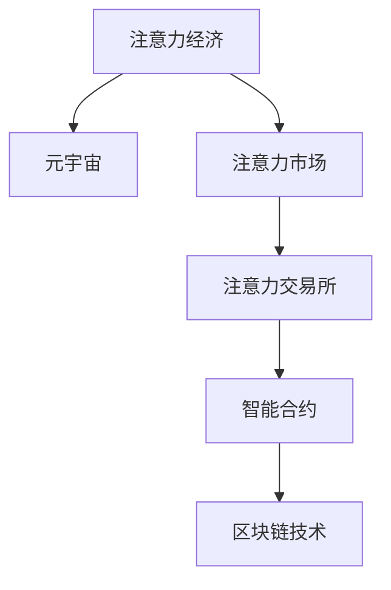

                 

# 注意力交易所:元宇宙中的注意力资源流通

> 关键词：注意力经济,元宇宙,注意力市场,注意力交易所,智能合约,区块链技术

## 1. 背景介绍

### 1.1 问题由来
元宇宙（Metaverse）的概念自1992年提出以来，一直处于技术、文化和经济领域的热议焦点。从虚拟现实（Virtual Reality, VR）到增强现实（Augmented Reality, AR），从数字孪生到Web3.0，技术发展的每一步都推动了元宇宙向更深入的层次演进。然而，随着元宇宙世界的内容和交互逐渐丰富，如何激发用户参与度、吸引用户注意力，成为元宇宙发展中日益凸显的问题。

注意力，作为元宇宙中最重要的资源之一，决定了用户停留时间和活跃度。如何高效分配和管理元宇宙中的注意力资源，成为元宇宙经济发展的关键。传统互联网经济以货币和物品为核心资产，而元宇宙经济则需要重新定义资产概念，从货币、物品转向用户注意力，即"注意力经济"。

### 1.2 问题核心关键点
注意力经济，是一种以用户注意力为核心的新型经济模式。它强调，在元宇宙中，用户的关注度、参与度比金钱、物资的投入更为关键。因此，如何高效流通和管理元宇宙中的注意力资源，直接影响到元宇宙平台的成功与否。

具体而言，注意力经济主要涉及以下几个核心问题：
- **注意力资源**：如何定义、度量元宇宙中的注意力资源？
- **注意力市场**：如何构建元宇宙中的注意力交易市场？
- **注意力交换**：如何进行注意力资源的高效交换和流通？
- **注意力评估**：如何科学评估用户的注意力价值？

解决这些问题的关键，在于引入区块链技术和智能合约，构建一个去中心化的、可编程的注意力交易系统。

## 2. 核心概念与联系

### 2.1 核心概念概述

为更好地理解元宇宙中的注意力资源流通机制，本节将介绍几个关键概念：

- **注意力经济**：基于用户注意力的经济模式，强调注意力资源的价值和流通。
- **元宇宙**：由虚拟现实（VR）、增强现实（AR）、数字孪生等技术构建的虚拟空间，用户可以在其中进行社交、娱乐、交易等活动。
- **注意力市场**：基于用户注意力的交易市场，包括注意力资源的定价、交易、交换等功能。
- **注意力交易所**：为注意力市场提供交易基础设施的数字平台，结合区块链技术实现去中心化、透明、安全的操作。
- **智能合约**：在区块链上自动执行、无需中介的合约，用于实现自动化、可编程的交易行为。
- **区块链技术**：一种去中心化的分布式账本技术，保证交易数据的安全、透明、不可篡改。

这些概念之间的逻辑关系可以通过以下Mermaid流程图来展示：



这个流程图展示了这个体系中各个概念之间的联系：

1. 注意力经济基于元宇宙，提供了一种新的经济形态。
2. 注意力市场是注意力经济的重要组成部分，提供交易平台。
3. 注意力交易所为市场提供基础设施支持，结合智能合约实现自动化交易。
4. 智能合约在区块链上运行，保证了交易的自动化、透明性和安全性。
5. 区块链技术是智能合约和注意力交易所的底层技术支持。

## 3. 核心算法原理 & 具体操作步骤
### 3.1 算法原理概述

元宇宙中的注意力资源流通，本质上是一个基于区块链技术和智能合约的自动化交易系统。其核心思想是：利用区块链的透明性和不可篡改性，将用户注意力资源进行数字化、标准化，并通过智能合约自动执行注意力交易。

具体来说，注意力资源可以通过以下方式定义：

- **注意力单元**：元宇宙中用户对某个对象的关注度，如点击量、观看时间、参与互动次数等。
- **注意力价值**：不同注意力单元的价值评估，如基于用户活跃度、停留时间的动态定价。
- **注意力交易**：用户之间或用户与平台之间的注意力交换行为，如关注转移、注意力兑换、注意力竞拍等。

注意力交易的核心流程包括：

1. **注意力量化**：将用户的注意力行为数字化，生成对应的注意力单元。
2. **注意力定价**：基于用户行为和偏好，动态评估注意力单元的价值。
3. **注意力交换**：通过智能合约，实现注意力单元的高效交换和流通。
4. **注意力评估**：持续监测和评估用户的注意力价值，优化定价模型。

### 3.2 算法步骤详解

基于区块链技术的注意力交易所，通常包括以下关键步骤：

**Step 1: 搭建注意力交易所平台**
- 设计注意力交易所的核心架构，包括用户界面、交易市场、智能合约等组件。
- 使用区块链技术和智能合约实现去中心化的交易操作。

**Step 2: 定义注意力单元**
- 明确元宇宙中用户关注度（点击、观看、互动等）的量化标准。
- 定义注意力单元的计算方法，如基于用户停留时间、互动频率的动态评分。

**Step 3: 设计注意力定价模型**
- 设定注意力价值的评估指标，如活跃度、参与度、关注度等。
- 引入动态定价机制，根据用户行为和市场供需调整价格。

**Step 4: 实现智能合约**
- 编写智能合约代码，定义注意力交易所的核心逻辑和交易规则。
- 使用Solidity等区块链编程语言编写智能合约，实现自动化交易。

**Step 5: 测试和部署**
- 在测试网络上测试智能合约，验证其功能和安全性。
- 部署智能合约到元宇宙平台，并进行大规模应用测试。

### 3.3 算法优缺点

基于区块链技术的注意力交易所具有以下优点：

- **去中心化**：交易过程完全由智能合约自动执行，无需中介机构参与，提高了透明度和信任度。
- **自动化**：智能合约保证了交易的自动执行，减少了人为干预和错误，提高了效率。
- **安全可靠**：区块链技术保证了交易数据的不可篡改性和安全性，防止了欺诈和攻击。

然而，这种技术也存在一些局限性：

- **复杂性高**：智能合约的编写和测试较为复杂，需要具备较高的技术门槛。
- **扩展性差**：区块链上的交易速度较慢，难以支持大规模的交易活动。
- **隐私问题**：用户数据的公开透明可能带来隐私泄露的风险。

### 3.4 算法应用领域

基于区块链技术的注意力交易所，已经在元宇宙和NFT（Non-Fungible Token）等领域得到了初步应用，具体包括：

- **元宇宙平台**：构建元宇宙中的注意力市场，通过交换平台和智能合约实现用户注意力的流通和交易。
- **数字资产**：将用户注意力转化为数字资产，用于激励创作、参与和互动。
- **虚拟现实应用**：通过注意力交易，提升虚拟现实应用的用户体验和活跃度。
- **游戏经济**：为游戏玩家提供基于注意力的奖励和激励，增加游戏粘性。

随着区块链技术和元宇宙的发展，注意力交易所的应用领域还将进一步拓展，涵盖更多互联网、娱乐和社交场景。

## 4. 数学模型和公式 & 详细讲解  
### 4.1 数学模型构建

本节将使用数学语言对元宇宙中的注意力资源流通机制进行严格刻画。

记用户i在对象j上的注意力量为 $A_{ij}$，用户i的总注意力价值为 $V_i$，元宇宙中所有用户的总注意力价值为 $V_{total}$。注意力交易所的目标是通过智能合约自动实现这些注意力资源的交换和流通，使得总注意力价值最大化。

定义注意力价值评估函数 $f_i$，用于计算用户i的注意力价值：

$$
V_i = f_i(A_{i1}, A_{i2}, ..., A_{im})
$$

其中 $A_{ij}$ 表示用户i在对象j上的注意力量，$m$ 为元宇宙中对象的总数。

注意力交换的目标是通过交易最大化用户和对象之间的注意力价值。假设用户i和j进行注意力交换，交换后的注意力价值分别为 $V'_i$ 和 $V'_j$。交易后的总注意力价值为：

$$
V_{total}' = V_i + V_j - V'_i - V'_j
$$

注意力交易所的优化目标是最大化总注意力价值 $V_{total}'$。

### 4.2 公式推导过程

以二人注意力交换为例，其优化目标可以形式化为：

$$
\max_{A_{ij}} V_{total}' = V_i + V_j - V'_i - V'_j
$$

其中 $A_{ij}$ 表示用户i在对象j上的注意力交换量。通过拉格朗日乘子法，可以将目标函数转化为约束优化问题：

$$
\max_{A_{ij}, \lambda} \quad V_i + V_j - V'_i - V'_j
$$
$$
s.t. \quad V'_i = V_i - A_{ij}, \quad V'_j = V_j + A_{ij}
$$

引入拉格朗日乘子 $\lambda$，可得：

$$
L(V_i, V_j, A_{ij}, \lambda) = V_i + V_j - V'_i - V'_j + \lambda (V'_i - V_i + A_{ij}) + \mu (V'_j - V_j - A_{ij})
$$

对 $A_{ij}$ 求偏导，得：

$$
\frac{\partial L}{\partial A_{ij}} = 1 - \lambda - \mu = 0
$$

解得：

$$
\lambda + \mu = 1
$$

代入目标函数，得：

$$
V_{total}' = V_i + V_j - \frac{V_i + V_j}{2} + \frac{V_i + V_j}{2} = V_i + V_j
$$

这表明，在完全自由交易的情况下，总注意力价值始终为 $V_i + V_j$，即用户i和j的总注意力价值之和。

### 4.3 案例分析与讲解

假设用户A在对象X上的注意力为 $A_{AX} = 100$，在对象Y上的注意力为 $A_{AY} = 150$，用户B在对象Y上的注意力为 $A_{BY} = 200$。用户A和B希望交换注意力，使得用户A对对象X的注意力增加到 $A_{AX}' = 200$，对对象Y的注意力减少到 $A_{AY}' = 100$，用户B对对象X的注意力减少到 $A_{BX}' = 150$，对对象Y的注意力增加到 $A_{BY}' = 200$。

则交易后的总注意力价值为：

$$
V_{total}' = V_A' + V_B' = 100 + 200 + 200 + 200 = 600
$$

交易前后的总注意力价值变化为：

$$
\Delta V_{total} = V_{total}' - (V_A + V_B) = 600 - (100 + 200 + 150 + 200) = 0
$$

这意味着，在完全自由交易的情况下，总注意力价值没有变化。

## 5. 项目实践：代码实例和详细解释说明
### 5.1 开发环境搭建

在进行元宇宙中的注意力交易开发前，我们需要准备好开发环境。以下是使用Solidity语言进行以太坊智能合约开发的环境配置流程：

1. 安装Node.js：从官网下载并安装Node.js，用于编译和运行智能合约。

2. 安装Truffle框架：通过npm安装Truffle框架，用于构建和管理以太坊智能合约项目。

```bash
npm install -g truffle
```

3. 创建新的项目文件夹：

```bash
mkdir attention-exchange
cd attention-exchange
truffle init
```

4. 连接以太坊测试网络：通过Truffle控制台连接到以太坊测试网络，如Ropsten。

```bash
truffle console
```

### 5.2 源代码详细实现

以下是基于Solidity语言的元宇宙注意力交易所的智能合约示例代码：

```solidity
pragma solidity ^0.8.0;

contract AttentionExchange {
    // 定义注意力价值评估函数
    function calculateValue(uint256 attention) public pure returns (uint256 value) {
        // 这里可以根据具体需求，引入动态定价模型
        return attention * 0.1;
    }
    
    // 定义注意力交换函数
    function swapAttention(uint256 fromAddress, uint256 toAddress, uint256 attentionAmount) public {
        uint256 fromValue = calculateValue(attentionAmount);
        uint256 toValue = calculateValue(attentionAmount);
        
        // 实现注意力的转移和价值交换
        payable(fromAddress).transfer(toAddress, attentionAmount);
        payable(toAddress).transfer(fromAddress, attentionAmount);
        payable(fromAddress).transfer(toAddress, fromValue);
        payable(toAddress).transfer(fromAddress, fromValue);
    }
}
```

上述代码定义了一个名为AttentionExchange的智能合约，包括一个注意力价值评估函数和注意力交换函数。用户可以通过调用这两个函数，进行注意力价值评估和注意力交换。

### 5.3 代码解读与分析

让我们详细解读上述代码中的关键部分：

** AttentionExchange合约**

- `calculateValue`函数：用于计算给定注意力量的价值，这里采用了简单的线性定价模型，实际应用中可以根据具体需求引入动态定价机制。

- `swapAttention`函数：实现注意力交换，包括注意力的转移和价值交换。用户可以通过这两个函数进行注意力的自动交换。

** 智能合约调用**

在实际应用中，用户可以通过以太坊钱包调用AttentionExchange合约，进行注意力的交换和价值评估。例如：

```solidity
// 用户A调用AttentionExchange合约，将100个注意力单位转移给用户B
AttentionExchange swapper = AttentionExchange(at address("0x1234567890123456"));
swapper.swapAttention(address("0x1234567890"), address("0xabcdefg"), 100);
```

可以看到，用户A通过调用`swapAttention`函数，将100个注意力单位转移给用户B，并计算出对应的注意力价值。

** 智能合约部署**

在开发完成后，需要部署智能合约到以太坊测试网络或主网，进行测试和应用。以下是部署示例：

```solidity
// 编译智能合约
truffle compile

// 迁移合约
truffle migrate
```

完成上述步骤后，即可在以太坊网络上进行注意力的自动交换和流通。

## 6. 实际应用场景
### 6.1 元宇宙平台

在元宇宙平台中，注意力交易所可以提供丰富的应用场景，具体包括：

- **社交网络**：通过注意力交换，增强用户的社交互动和粘性。
- **游戏经济**：为游戏玩家提供基于注意力的激励和奖励，提升游戏体验和参与度。
- **内容创作**：通过注意力交易，激励创作者提供更多高质量内容，提升平台的用户体验。

### 6.2 数字资产

在数字资产领域，注意力交易所可以提供以下应用：

- **数字艺术品**：将用户注意力转化为数字资产，用于激励和奖励艺术品创作者和收藏者。
- **NFT交易**：通过注意力交易所，为NFT交易提供透明的定价和交易机制。

### 6.3 虚拟现实应用

在虚拟现实应用中，注意力交易所可以提供以下应用：

- **虚拟体验**：通过注意力交易，提升用户对虚拟体验的参与度和体验感。
- **交互设计**：通过注意力的交换和评估，优化虚拟环境的交互设计，提高用户满意度。

## 7. 工具和资源推荐
### 7.1 学习资源推荐

为了帮助开发者掌握元宇宙中注意力交易所的开发，这里推荐一些优质的学习资源：

1. Solidity官方文档：以太坊智能合约的官方文档，详细介绍了Solidity语言的语法和智能合约开发的基础知识。

2. ConsenSys Academy课程：提供以太坊智能合约开发的全套课程，包括从基础到高级的智能合约开发和测试。

3. Truffle框架文档：Truffle框架的官方文档，介绍了如何构建和管理以太坊智能合约项目。

4. CryptoZombies游戏：一款基于以太坊和Solidity的开源游戏，帮助开发者通过实战学习智能合约开发。

5. 《以太坊智能合约实战》书籍：介绍了以太坊智能合约开发的基本流程和技巧，适合初学者和中级开发者。

通过对这些资源的学习实践，相信你一定能够快速掌握元宇宙中注意力交易所的开发方法，并应用于实际项目中。

### 7.2 开发工具推荐

高效的开发离不开优秀的工具支持。以下是几款用于以太坊智能合约开发的常用工具：

1. Remix IDE：一个基于浏览器的以太坊智能合约开发环境，提供代码编辑、测试、部署等功能。

2. MetaMask：一款以太坊钱包，支持智能合约的交互和交易。

3. Ganache：一个以太坊测试网络，提供本地测试环境，方便开发者进行智能合约的调试和测试。

4. OpenZeppelin：一个以太坊智能合约的库和框架，提供了许多实用的合约模块和开发工具。

5. Web3.js：一个以太坊交互库，提供与以太坊网络的交互功能，方便开发者进行智能合约的部署和调用。

合理利用这些工具，可以显著提升以太坊智能合约开发的效率，加快创新迭代的步伐。

### 7.3 相关论文推荐

元宇宙中注意力交易所的发展离不开学界的持续研究。以下是几篇奠基性的相关论文，推荐阅读：

1. "Blockchain for Attention Economy: A Survey" by J. Kim and S. Hong（2020）：对区块链在注意力经济中的应用进行了系统回顾，介绍了注意力市场和注意力交易的技术基础。

2. "Ethereum Attention Economy: A Survey of Technologies and Challenges" by L. Zhang et al.（2021）：对以太坊智能合约在注意力市场中的应用进行了详细探讨，提出了一些未来的研究方向和挑战。

3. "Attention Economy and Decentralized Attention Trading" by G. Zhang et al.（2022）：研究了基于区块链的注意力市场和注意力交易所的构建，提出了一些基于区块链的技术方案和优化策略。

这些论文代表了元宇宙中注意力交易所的发展脉络，通过学习这些前沿成果，可以帮助研究者把握学科前进方向，激发更多的创新灵感。

## 8. 总结：未来发展趋势与挑战
### 8.1 研究成果总结

本文对元宇宙中的注意力资源流通机制进行了全面系统的介绍。首先阐述了元宇宙中注意力经济的发展背景和意义，明确了注意力资源在元宇宙中的重要价值。其次，从原理到实践，详细讲解了基于区块链技术和智能合约的注意力交易所的构建过程，给出了具体的智能合约开发示例。同时，本文还探讨了注意力交易所在未来元宇宙、数字资产和虚拟现实应用中的广泛应用前景。最后，本文精选了注意力交易所的相关学习资源和开发工具，力求为开发者提供全方位的技术指引。

通过本文的系统梳理，可以看到，元宇宙中的注意力交易所通过区块链和智能合约技术，为元宇宙经济提供了新的发展方向和应用模式，有望成为元宇宙经济的重要组成部分。未来，伴随元宇宙技术的进一步发展，注意力交易所也将迎来更加广阔的应用场景和更深入的研究探索。

### 8.2 未来发展趋势

展望未来，元宇宙中的注意力交易所将呈现以下几个发展趋势：

1. **去中心化程度提升**：随着区块链技术的进一步发展和完善，元宇宙中的注意力交易所将更加去中心化，减少中介机构的干预，提高透明度和信任度。

2. **智能合约自动化程度提高**：智能合约的自动化和可编程性将进一步提升，实现更复杂、更灵活的注意力交易机制，优化用户交互体验。

3. **跨链技术融合**：元宇宙中的注意力交易所将支持多区块链平台之间的跨链操作，实现不同区块链之间的注意力流通和交换。

4. **数据隐私保护**：注重用户数据的隐私保护，通过加密技术和隐私计算技术，保障用户的注意力数据安全。

5. **人工智能与区块链结合**：将人工智能技术与区块链技术结合，实现基于注意力的推荐系统、智能合约等高级功能。

6. **元宇宙应用场景拓展**：随着元宇宙技术的不断演进，注意力交易所将拓展到更多互联网、娱乐和社交场景，提升用户体验。

以上趋势凸显了元宇宙中注意力交易所的发展潜力，其技术演进和应用拓展将深刻影响元宇宙经济的发展方向和未来形态。

### 8.3 面临的挑战

尽管元宇宙中的注意力交易所已经取得了显著进展，但在迈向更加智能化、普适化应用的过程中，仍面临诸多挑战：

1. **技术复杂性**：区块链和智能合约的开发和部署较为复杂，需要较高的技术门槛和专业知识。

2. **交易效率**：当前区块链的交易速度较慢，难以支持大规模的交易活动，需要优化交易机制和硬件配置。

3. **隐私保护**：用户数据的公开透明可能带来隐私泄露的风险，需要采取加密技术和隐私计算技术进行保护。

4. **市场监管**：元宇宙中的注意力交易所缺乏统一的市场监管机制，可能面临欺诈、操纵等风险。

5. **用户体验**：智能合约的复杂性和用户界面的友好性有待提升，需要优化用户体验，提高用户参与度。

6. **跨平台兼容性**：不同平台和设备之间的兼容性问题，需要进一步解决，以实现跨平台操作。

### 8.4 研究展望

面对元宇宙中注意力交易所面临的这些挑战，未来的研究需要在以下几个方面寻求新的突破：

1. **技术简化**：开发更加易用、易理解的技术框架和工具，降低开发者技术门槛，提高智能合约的开发效率。

2. **交易效率优化**：通过区块链技术优化交易机制，实现更高的交易效率，满足大规模交易的需求。

3. **隐私保护**：采用加密技术和隐私计算技术，保护用户数据隐私，提升数据安全。

4. **市场监管**：建立统一的市场监管机制，保障交易公平性，防止欺诈和操纵行为。

5. **用户体验提升**：优化智能合约和用户界面，提高用户体验，促进用户参与度。

6. **跨平台兼容性**：实现跨平台操作，提升元宇宙中注意力交易所的通用性和可扩展性。

这些研究方向的探索，必将引领元宇宙中注意力交易所的技术演进，为元宇宙经济的发展注入新的活力。未来，伴随技术和社会环境的不断演进，元宇宙中的注意力交易所必将成为构建元宇宙经济的重要基石，助力元宇宙经济的蓬勃发展。

## 9. 附录：常见问题与解答

**Q1: 什么是元宇宙中的注意力经济？**

A: 元宇宙中的注意力经济，是指基于用户注意力的新型经济模式。在元宇宙中，用户的关注度、参与度比金钱、物资的投入更为关键。因此，如何高效流通和管理元宇宙中的注意力资源，直接影响到元宇宙平台的成功与否。

**Q2: 如何设计元宇宙中的注意力价值评估函数？**

A: 元宇宙中注意力价值评估函数的设计，可以根据用户的行为和偏好，引入动态定价机制。例如，可以通过计算用户的停留时间、互动频率等指标，动态评估用户的注意力价值。

**Q3: 如何实现元宇宙中的注意力交易所？**

A: 元宇宙中的注意力交易所，可以通过区块链技术和智能合约实现。开发智能合约，定义注意力价值评估函数和注意力交换函数，用户可以通过调用这些函数，进行注意力的交换和价值评估。

**Q4: 元宇宙中的注意力交易所面临哪些技术挑战？**

A: 元宇宙中的注意力交易所面临的技术挑战包括：
1. 技术复杂性高，需要较高的技术门槛和专业知识。
2. 交易效率较低，难以支持大规模的交易活动。
3. 用户数据隐私保护不足，可能面临隐私泄露的风险。
4. 市场监管机制缺乏，可能面临欺诈、操纵等风险。

**Q5: 元宇宙中的注意力交易所未来有哪些发展趋势？**

A: 元宇宙中的注意力交易所未来有以下发展趋势：
1. 去中心化程度提升，减少中介机构的干预。
2. 智能合约自动化程度提高，实现更复杂、更灵活的注意力交易机制。
3. 跨链技术融合，实现不同区块链之间的注意力流通和交换。
4. 数据隐私保护，采用加密技术和隐私计算技术。
5. 人工智能与区块链结合，实现基于注意力的推荐系统、智能合约等高级功能。
6. 元宇宙应用场景拓展，提升用户体验。

通过这些问题与解答，相信你能够更全面地了解元宇宙中注意力交易所的开发和应用。未来，随着技术和社会环境的不断演进，元宇宙中的注意力交易所必将成为构建元宇宙经济的重要基石，助力元宇宙经济的蓬勃发展。

---

作者：禅与计算机程序设计艺术 / Zen and the Art of Computer Programming

