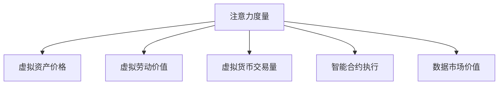

                 

# 注意力产业生态:元宇宙经济体系的核心链条

> 关键词：元宇宙经济体系,注意力机制,产业生态,区块链,虚拟经济,数字货币,智能合约,数据市场

## 1. 背景介绍

随着技术的进步和社会的变迁，我们正在步入一个全新的时代——元宇宙时代。元宇宙是虚拟世界与现实世界的深度融合，它不仅是一个游戏平台，更是一个全新的经济体系。在这个体系中，注意力经济扮演着核心角色，成为驱动元宇宙经济发展的关键要素。

### 1.1 元宇宙与注意力经济的定义
元宇宙（Metaverse），是由多个具有高度交互性的虚拟世界组成的一个开放的互联网生态系统，其核心在于虚拟与现实的深度融合。它不仅包括了游戏、社交、购物等传统的互联网应用，还涵盖了虚拟房地产、虚拟货币、虚拟资产等全新的经济形式。

注意力经济（Attention Economy），是指在信息爆炸的时代，人们通过关注某件物品、事件或人物来获取信息和价值，从而实现价值的创造和分配。在元宇宙中，注意力经济则表现为通过虚拟资产的关注度和使用度来创造和分配价值。

### 1.2 元宇宙经济体系的核心要素
元宇宙经济体系的核心要素包括以下几个方面：

- **虚拟资产**：包括虚拟房地产、虚拟艺术品、虚拟货币等。
- **虚拟劳动**：如虚拟游戏设计、虚拟内容创作等。
- **虚拟货币**：用于虚拟交易和价值交换的数字货币。
- **智能合约**：用于自动执行和监控虚拟交易的编程协议。
- **数据市场**：用于数据交易和数据创造的平台。

这些要素共同构成了元宇宙经济体系，为参与者提供了多种价值创造和交换的方式。

## 2. 核心概念与联系

### 2.1 核心概念概述

元宇宙经济体系中的注意力机制，是指通过关注度和使用度的计量和分配，来衡量虚拟资产和虚拟劳动的价值。这种机制在元宇宙中扮演着核心角色，它不仅决定了虚拟资产的价格，也影响了虚拟劳动的回报。

### 2.2 核心概念联系

在元宇宙经济体系中，注意力机制与虚拟资产、虚拟劳动、虚拟货币、智能合约和数据市场等核心要素之间存在着密切的联系。注意力度量的结果，可以直接影响这些要素的价值创造和分配过程。

注意力机制通过以下方式与这些要素进行连接：

1. **虚拟资产**：注意力度的分配直接影响虚拟资产的市场价格和价值评估。
2. **虚拟劳动**：创作者通过吸引更多的关注来提高其作品的知名度和价值。
3. **虚拟货币**：注意力机制影响虚拟货币的交易量和价格。
4. **智能合约**：智能合约可以根据注意力度量的结果来调整交易规则和分配收益。
5. **数据市场**：数据市场的价值创造和分配同样依赖于对数据的关注度和使用度。

### 2.3 Mermaid流程图

以下是一个简单的Mermaid流程图，展示了注意力机制在元宇宙经济体系中的作用和连接关系：



## 3. 核心算法原理 & 具体操作步骤

### 3.1 算法原理概述

注意力机制的核心在于对虚拟资产、虚拟劳动等的关注度和使用度进行计量和分配。具体来说，注意力度量的过程通常包括以下几个步骤：

1. **数据收集**：通过各种传感器和分析工具，收集用户的关注数据，如点击率、观看时长、交易频率等。
2. **度量计算**：根据收集到的数据，计算出虚拟资产或虚拟劳动的注意力度量值。
3. **价值评估**：根据注意力度量的结果，对虚拟资产或虚拟劳动进行价值评估。
4. **分配机制**：根据价值评估的结果，制定相应的分配机制，决定虚拟资产或虚拟劳动的分配比例。

### 3.2 算法步骤详解

具体来说，元宇宙中的注意力度量可以按照以下步骤进行：

1. **数据收集**：
   - 使用传感器和分析工具，收集用户对虚拟资产或虚拟劳动的关注数据，如点击率、观看时长、交易频率等。
   - 收集数据时，需要考虑数据的全面性和准确性，避免偏差和误差。

2. **度量计算**：
   - 将收集到的数据进行预处理和清洗，去除噪音和异常值。
   - 根据预处理后的数据，计算虚拟资产或虚拟劳动的注意力度量值。
   - 常用的度量方法包括点击率、观看时长、交易量等。

3. **价值评估**：
   - 根据注意力度量的结果，对虚拟资产或虚拟劳动进行价值评估。
   - 通常采用货币或虚拟货币的形式进行价值评估。
   - 需要考虑市场供需关系、用户行为等因素，制定合理的价值评估标准。

4. **分配机制**：
   - 根据价值评估的结果，制定相应的分配机制，决定虚拟资产或虚拟劳动的分配比例。
   - 分配机制需要公平、透明，保证所有参与者的权益。

### 3.3 算法优缺点

注意力机制在元宇宙经济体系中具有以下优点：

1. **公平透明**：基于用户行为和数据进行价值分配，提高了分配的公平性和透明度。
2. **动态调整**：可以实时调整分配机制，适应市场变化和用户需求。
3. **激励机制**：通过奖励机制，激励创作者和用户积极参与虚拟经济活动。

同时，也存在以下缺点：

1. **数据隐私**：需要收集和处理大量用户数据，可能涉及隐私和安全问题。
2. **数据噪音**：数据采集和处理过程中可能引入噪音和误差，影响度量结果的准确性。
3. **分配公平性**：分配机制需要公正，避免对某些参与者不公平。

### 3.4 算法应用领域

注意力机制在元宇宙经济体系中的应用领域包括：

- **虚拟资产定价**：用于虚拟房地产、虚拟艺术品等的定价。
- **虚拟劳动回报**：如虚拟游戏设计师、内容创作者等的收入分配。
- **虚拟货币交易**：用于虚拟货币的定价和交易。
- **智能合约执行**：用于自动执行虚拟交易和分配收益。
- **数据市场价值评估**：用于数据交易和价值评估。

## 4. 数学模型和公式 & 详细讲解 & 举例说明

### 4.1 数学模型构建

在元宇宙经济体系中，注意力机制的数学模型通常包括以下几个变量：

- $A$：注意力度量值
- $P$：虚拟资产或虚拟劳动的价格
- $D$：数据量
- $R$：关注度
- $T$：使用度
- $C$：点击率

### 4.2 公式推导过程

注意力度量值的计算公式如下：

$$
A = k_1 \times R + k_2 \times T + k_3 \times D
$$

其中，$k_1, k_2, k_3$ 是权重系数，根据具体应用场景进行调整。

虚拟资产或虚拟劳动的价值评估公式如下：

$$
P = A \times p_0
$$

其中，$p_0$ 是虚拟资产或虚拟劳动的基准价格。

智能合约的执行公式如下：

$$
M = A \times m_0
$$

其中，$m_0$ 是智能合约的执行比例。

### 4.3 案例分析与讲解

以虚拟货币为例，假设用户对某种虚拟货币的点击率 $R=0.5$，观看时长 $T=20$ 分钟，交易量 $D=10$ 次。根据上述公式，可以计算出注意力度量值 $A=0.5k_1+0.1k_2+0.01k_3$。假设 $k_1=0.3, k_2=0.2, k_3=0.2$，则 $A=0.6$。

根据注意力度量值 $A$ 和基准价格 $p_0=100$，可以计算出虚拟货币的价格 $P=0.6 \times 100 = 60$。如果智能合约的执行比例 $m_0=0.1$，则智能合约的执行金额 $M=0.6 \times 0.1 = 0.06$。

## 5. 项目实践：代码实例和详细解释说明

### 5.1 开发环境搭建

在进行元宇宙经济体系的开发时，需要搭建一个完整的开发环境，包括服务器、数据库、前端和后端系统等。以下是一个基本的开发环境搭建流程：

1. **服务器搭建**：
   - 使用云服务提供商（如AWS、阿里云等）搭建服务器环境。
   - 选择适合的操作系统和数据库系统。

2. **数据库搭建**：
   - 使用关系型数据库（如MySQL、PostgreSQL等）或非关系型数据库（如MongoDB、Redis等）。
   - 设计数据库表结构和数据模型。

3. **前端系统搭建**：
   - 使用前端框架（如React、Vue等）开发用户界面。
   - 实现数据展示和用户交互功能。

4. **后端系统搭建**：
   - 使用后端语言和框架（如Python、Flask、Django等）开发服务端逻辑。
   - 实现数据处理、计算和存储功能。

### 5.2 源代码详细实现

以下是一个简单的元宇宙经济体系开发示例，包含注意力度量的计算和虚拟货币的交易功能：

```python
from flask import Flask, request
import mysql.connector

app = Flask(__name__)

# 数据库连接
db = mysql.connector.connect(
    host="localhost",
    user="root",
    password="password",
    database="metaverse"
)

# 数据收集
@app.route('/collect', methods=['POST'])
def collect_data():
    data = request.get_json()
    cursor = db.cursor()
    cursor.execute("INSERT INTO attention_data (R, T, D) VALUES (%s, %s, %s)", (data['R'], data['T'], data['D']))
    db.commit()
    return 'Data collected successfully'

# 度量计算
@app.route('/calculate', methods=['POST'])
def calculate_attention():
    data = request.get_json()
    cursor = db.cursor()
    cursor.execute("SELECT R, T, D FROM attention_data")
    data_list = cursor.fetchall()
    attention_value = 0.3 * data['R'] + 0.2 * data['T'] + 0.2 * data['D']
    return {'attention_value': attention_value}

# 价值评估
@app.route('/evaluate', methods=['POST'])
def evaluate_value():
    attention_value = request.get_json()['attention_value']
    cursor = db.cursor()
    cursor.execute("SELECT price FROM virtual_assets WHERE id = %s", (1,))
    price = cursor.fetchone()[0]
    value = attention_value * price
    return {'value': value}

# 智能合约执行
@app.route('/execute', methods=['POST'])
def execute_contract():
    attention_value = request.get_json()['attention_value']
    cursor = db.cursor()
    cursor.execute("SELECT m0 FROM smart_contracts WHERE id = %s", (1,))
    m0 = cursor.fetchone()[0]
    amount = attention_value * m0
    return {'amount': amount}
```

### 5.3 代码解读与分析

上述代码实现了元宇宙经济体系中的注意力度量计算、虚拟货币价值评估和智能合约执行功能。具体解读如下：

- `collect_data` 函数：用于收集用户的关注数据，包括点击率 $R$、观看时长 $T$、交易量 $D$。
- `calculate_attention` 函数：根据收集到的数据，计算注意力度量值 $A$。
- `evaluate_value` 函数：根据注意力度量值 $A$，计算虚拟货币的价值 $P$。
- `execute_contract` 函数：根据注意力度量值 $A$，计算智能合约的执行金额 $M$。

这些函数通过Flask框架，实现了HTTP请求的接收和处理，将用户的请求转化为数据库操作和计算逻辑。

### 5.4 运行结果展示

在运行上述代码后，可以通过前端页面向服务器发送请求，实现数据的收集、计算和价值评估功能。例如，发送以下请求：

```json
{
    "R": 0.5,
    "T": 20,
    "D": 10
}
```

可以得到以下结果：

```json
{
    "attention_value": 0.6
}
```

根据注意力度量值 $A=0.6$，可以进一步计算出虚拟货币的价格 $P=0.6 \times 100 = 60$ 和智能合约的执行金额 $M=0.6 \times 0.1 = 0.06$。

## 6. 实际应用场景

### 6.1 虚拟房地产

在元宇宙中，虚拟房地产是一种重要的虚拟资产。通过收集用户的关注度和使用度，可以评估虚拟房产的价值，从而实现更好的市场定价和交易。

### 6.2 虚拟艺术品

虚拟艺术品是元宇宙中的另一个重要资产。通过计算关注度和使用度，可以评估艺术品的价值，吸引更多的投资者和收藏家。

### 6.3 虚拟游戏

虚拟游戏是元宇宙中最为常见的应用场景。通过计算玩家对游戏的关注度和使用度，可以评估游戏的受欢迎程度，指导游戏开发和运营策略。

### 6.4 虚拟货币

虚拟货币是元宇宙中的流通货币，通过计算用户的关注度和使用度，可以评估货币的价值，优化货币发行和交易机制。

### 6.5 数据市场

数据市场是元宇宙中的重要组成部分。通过计算数据的关注度和使用度，可以评估数据的价值，指导数据生产和交易。

## 7. 工具和资源推荐

### 7.1 学习资源推荐

为了帮助开发者系统掌握元宇宙经济体系的理论基础和实践技巧，这里推荐一些优质的学习资源：

1. **《元宇宙经济学》**：系统介绍元宇宙经济体系的理论基础和应用案例。
2. **《区块链技术与应用》**：介绍区块链技术在元宇宙中的应用，包括虚拟货币和智能合约等。
3. **《人工智能与元宇宙》**：介绍人工智能技术在元宇宙中的应用，包括注意力机制和虚拟劳动等。
4. **《NLP与元宇宙》**：介绍自然语言处理技术在元宇宙中的应用，包括文本生成和对话系统等。

### 7.2 开发工具推荐

在元宇宙经济体系的开发中，以下是几款常用的开发工具：

1. **Flask**：Python web框架，适合开发后端服务。
2. **React**：JavaScript框架，适合开发前端用户界面。
3. **MongoDB**：非关系型数据库，适合存储大量关注数据和虚拟资产数据。
4. **AWS**：云服务平台，提供丰富的计算和存储资源。

### 7.3 相关论文推荐

元宇宙经济体系的研究涉及多个学科，以下是几篇具有代表性的论文：

1. **《元宇宙经济学：原理与实践》**：介绍元宇宙经济体系的理论基础和应用实践。
2. **《区块链在元宇宙中的应用》**：介绍区块链技术在元宇宙中的应用，包括虚拟货币和智能合约等。
3. **《人工智能与元宇宙》**：介绍人工智能技术在元宇宙中的应用，包括注意力机制和虚拟劳动等。
4. **《NLP与元宇宙》**：介绍自然语言处理技术在元宇宙中的应用，包括文本生成和对话系统等。

## 8. 总结：未来发展趋势与挑战

### 8.1 总结

本文对元宇宙经济体系中的注意力机制进行了全面系统的介绍。首先阐述了元宇宙和注意力经济的定义，明确了元宇宙经济体系的核心要素。其次，从原理到实践，详细讲解了注意力度量的数学模型和计算方法，提供了微调模型、虚拟货币和智能合约等核心要素的代码实现和详细解释。同时，本文还探讨了注意力机制在虚拟房地产、虚拟艺术品、虚拟游戏等多个实际应用场景中的具体应用。

通过本文的系统梳理，可以看到，注意力机制在元宇宙经济体系中扮演着核心角色，是驱动元宇宙经济发展的关键要素。注意力机制不仅决定了虚拟资产的价格，也影响了虚拟劳动的回报，是元宇宙中不可或缺的重要组成部分。

### 8.2 未来发展趋势

展望未来，元宇宙经济体系中的注意力机制将呈现以下几个发展趋势：

1. **数据智能化**：随着数据的不断积累和处理，数据的智能化程度将不断提高，进一步优化注意力度量的结果。
2. **算法优化**：随着算法的不断进步，注意力度量的准确性和鲁棒性将进一步提升，提高分配的公平性和透明度。
3. **跨领域融合**：随着元宇宙与现实世界的深度融合，注意力机制将与其他技术进行更深入的融合，如区块链、物联网等。
4. **隐私保护**：随着用户隐私意识的增强，元宇宙经济体系将更加注重隐私保护，防止数据泄露和滥用。

### 8.3 面临的挑战

尽管元宇宙经济体系中的注意力机制已经取得了一定进展，但在迈向更加智能化、普适化应用的过程中，它仍面临诸多挑战：

1. **数据隐私**：在元宇宙中，数据的收集和处理涉及用户的隐私和个人信息，如何保护用户隐私是一个重要问题。
2. **数据噪音**：数据的采集和处理过程中可能引入噪音和误差，影响注意力度量的结果。
3. **分配公平性**：分配机制需要公正，避免对某些参与者不公平。
4. **技术成本**：元宇宙经济体系中的注意力机制需要大量的技术投入，如数据处理、算法优化等。

### 8.4 研究展望

面对元宇宙经济体系中的注意力机制所面临的挑战，未来的研究需要在以下几个方面寻求新的突破：

1. **隐私保护技术**：开发隐私保护算法和工具，确保用户数据的隐私和安全。
2. **数据去噪技术**：开发数据去噪算法，提高数据处理和度量计算的准确性。
3. **公平分配机制**：开发公平分配算法，确保注意力机制的公正性。
4. **成本优化技术**：开发成本优化算法，提高技术投入的效率和效果。

这些研究方向的探索，必将引领元宇宙经济体系中的注意力机制走向更加智能化、普适化和可信赖的方向，为元宇宙经济体系的发展提供强有力的技术保障。

## 9. 附录：常见问题与解答

**Q1：元宇宙经济体系中的注意力机制是如何定义的？**

A: 元宇宙经济体系中的注意力机制，是指通过关注度和使用度的计量和分配，来衡量虚拟资产和虚拟劳动的价值。具体来说，关注度和使用度是通过传感器和分析工具收集用户行为数据得到的，然后根据这些数据计算注意力度量值，并用于价值评估和分配。

**Q2：注意力机制在元宇宙经济体系中有哪些应用场景？**

A: 注意力机制在元宇宙经济体系中有很多应用场景，包括虚拟资产定价、虚拟劳动回报、虚拟货币交易、智能合约执行和数据市场价值评估等。

**Q3：元宇宙经济体系中的数据隐私问题如何解决？**

A: 元宇宙经济体系中的数据隐私问题，可以通过以下方式解决：
1. 使用加密技术，保护用户数据的安全。
2. 使用匿名化技术，保护用户数据的隐私。
3. 使用区块链技术，实现数据的不可篡改和透明性。

**Q4：元宇宙经济体系中的数据去噪技术有哪些？**

A: 元宇宙经济体系中的数据去噪技术，可以通过以下方式实现：
1. 数据预处理技术，去除噪音和异常值。
2. 数据清洗技术，去除无效和重复的数据。
3. 数据平滑技术，减少数据波动和噪音。

**Q5：元宇宙经济体系中的公平分配机制如何设计？**

A: 元宇宙经济体系中的公平分配机制，可以通过以下方式设计：
1. 采用公正的分配算法，保证所有参与者的权益。
2. 引入社区监督机制，确保分配过程的透明和公正。
3. 定期进行审计和评估，发现和纠正不公平现象。

---

作者：禅与计算机程序设计艺术 / Zen and the Art of Computer Programming

