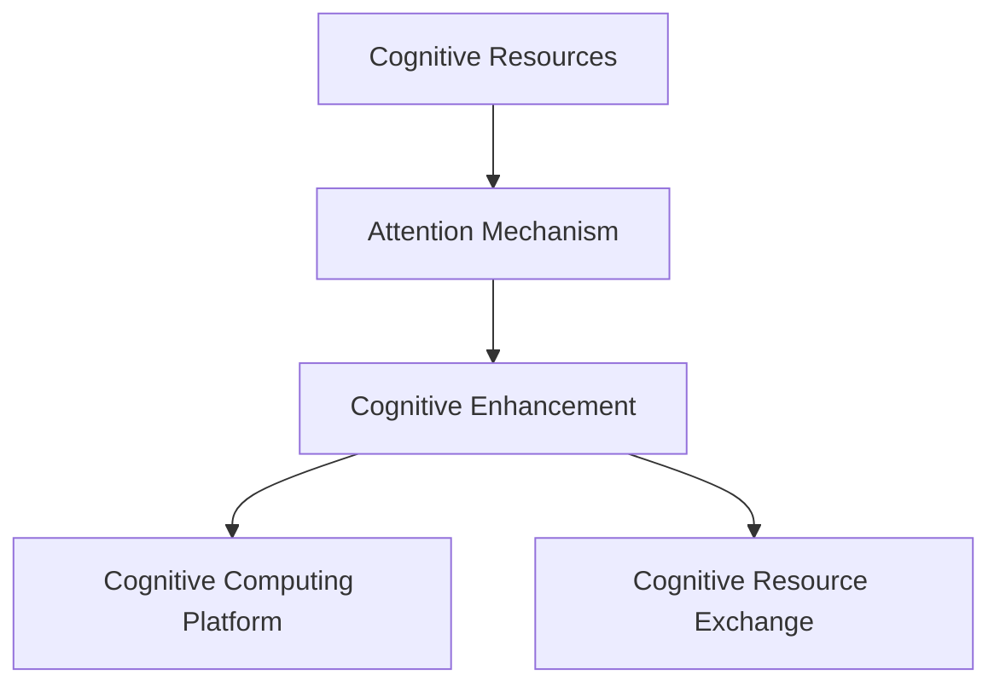

                 

# 注意力市场：AI驱动的认知资源交易所

> 关键词：注意力市场,认知资源交易所,人工智能(AI),注意力机制,深度学习,神经网络,认知增强,资源分配,边缘计算,认知计算

## 1. 背景介绍

### 1.1 问题由来
在信息爆炸和人类认知资源有限的今天，如何有效管理、分配和利用全球的认知资源，成为了一个日益重要的课题。信息与认知资源被高度分散在互联网的各个角落，传统的数据挖掘、内容推荐等技术，已不足以应对日新月异的知识需求和不断增长的数据洪流。

近年来，随着人工智能（AI）技术的迅猛发展，特别是深度学习和神经网络技术的突破，一种新型的信息获取和认知增强方式逐渐兴起，即“注意力市场”。这一概念最早由AI专家和认知科学家提出，旨在通过AI算法，自动匹配、聚合、分配认知资源，实现认知资源的优化配置。

通过构建一个基于AI的认知资源交易所，可以高效地汇聚和利用全球的认知资源，帮助用户获取并处理大量复杂的信息，形成全新的认知能力。这不仅将提升信息获取的效率和质量，还将为人类社会提供一种全新的、高效的认知增强手段。

### 1.2 问题核心关键点
注意力市场作为AI驱动的认知资源交易所，其核心在于通过注意力机制，高效聚合和分配全球认知资源。注意力机制作为深度学习和神经网络中的一个重要组成部分，能够帮助模型自动选择和聚焦关键信息，形成更精准的认知和推理。

具体而言，注意力市场包含以下几个关键点：
1. **认知资源聚合**：通过深度学习模型，自动从互联网上聚合高质量的认知资源，如学术论文、专业文章、数据库等。
2. **认知资源分配**：利用注意力机制，针对不同用户和任务需求，智能分配认知资源，实现个性化的认知增强。
3. **认知资源交易**：构建一个基于区块链技术的认知资源交易所，实现认知资源的自由交易和交易信任保障。
4. **认知计算平台**：提供一个基于边缘计算的认知计算平台，支持用户随时随地进行高效的信息获取和认知处理。

### 1.3 问题研究意义
研究注意力市场，对于拓展AI技术在认知增强领域的应用，提升信息获取和处理的效率与质量，具有重要意义：

1. **提升认知效率**：通过自动聚合和分配高质量认知资源，帮助用户更快速、更准确地获取所需信息，提升认知效率。
2. **个性化认知增强**：通过注意力机制，针对不同用户和任务需求，提供个性化的认知增强方案，提升用户体验。
3. **普惠认知服务**：将认知资源通过交易所自由交易，实现认知资源的普惠化，帮助更多人获得高质量认知服务。
4. **推动认知计算发展**：构建基于边缘计算的认知计算平台，提供高效、便捷的认知处理能力，推动认知计算的产业化进程。
5. **提升社会竞争力**：认知增强技术将在教育、医疗、金融等领域得到广泛应用，提升社会的整体认知水平和竞争力。

## 2. 核心概念与联系

### 2.1 核心概念概述

为更好地理解注意力市场这一新型认知增强手段，本节将介绍几个关键概念：

- **认知资源**：指各类有价值的信息资源，如学术论文、数据库、知识库等，是认知市场中的核心交易对象。
- **认知增强**：指通过聚合、分配认知资源，提升用户的信息获取、理解和处理能力的过程。
- **注意力机制**：指深度学习模型中用于选择和聚焦关键信息的一种机制，能够自动学习并识别重要信息。
- **认知计算平台**：指基于边缘计算的认知增强平台，支持用户随时随地获取和处理认知资源。
- **认知资源交易所**：指一个基于区块链技术的平台，支持认知资源的自由交易和信任保障。

这些核心概念之间有着紧密的联系，通过注意力机制高效聚合和分配认知资源，构建认知资源交易所，并利用认知计算平台进行高效的信息处理，最终实现认知增强的目的。

### 2.2 核心概念原理和架构的 Mermaid 流程图



这个流程图展示了认知资源交易所的核心架构：首先，通过注意力机制高效聚合认知资源；其次，利用聚合的资源进行认知增强；然后，通过认知计算平台进行处理；最后，在认知资源交易所进行交易和信任保障。

## 3. 核心算法原理 & 具体操作步骤
### 3.1 算法原理概述

注意力市场作为认知资源交易所，其核心算法原理在于通过注意力机制，高效聚合和分配认知资源。这一过程可以分为三个主要步骤：

1. **认知资源聚合**：利用深度学习模型，从互联网中自动发现和聚合高质量的认知资源，如学术论文、专业文章、数据库等。
2. **认知资源分配**：通过注意力机制，针对不同用户和任务需求，智能分配认知资源，实现个性化的认知增强。
3. **认知资源交易**：构建基于区块链技术的认知资源交易所，实现认知资源的自由交易和信任保障。

### 3.2 算法步骤详解

#### 3.2.1 认知资源聚合

认知资源聚合的核心在于构建一个深度学习模型，自动从互联网中发现和聚合高质量的认知资源。这一过程可以分为以下几个步骤：

1. **数据采集**：从互联网上爬取各类高质量的认知资源，如学术论文、专业文章、数据库等。
2. **预处理**：对采集到的资源进行格式转换、去重、标注等预处理操作。
3. **模型训练**：利用深度学习模型，如BERT、GPT等，对预处理后的数据进行训练，学习认知资源的特征表示。
4. **资源聚合**：根据训练好的模型，自动从互联网上发现和聚合高质量的认知资源。

#### 3.2.2 认知资源分配

认知资源分配的核心在于利用注意力机制，针对不同用户和任务需求，智能分配认知资源，实现个性化的认知增强。这一过程可以分为以下几个步骤：

1. **需求识别**：通过自然语言处理（NLP）技术，自动识别用户需求，如搜索结果、推荐内容等。
2. **资源匹配**：利用注意力机制，自动匹配与用户需求最相关的认知资源。
3. **资源分配**：根据匹配结果，动态调整认知资源的分配权重，实现个性化的认知增强。

#### 3.2.3 认知资源交易

认知资源交易的核心在于构建基于区块链技术的认知资源交易所，实现认知资源的自由交易和信任保障。这一过程可以分为以下几个步骤：

1. **交易所设计**：设计一个基于区块链技术的认知资源交易所，实现认知资源的自由交易。
2. **智能合约设计**：设计智能合约，实现认知资源的自动交易和信任保障。
3. **交易平台搭建**：搭建一个基于区块链技术的认知资源交易平台，支持用户进行认知资源的交易和交易信任保障。

### 3.3 算法优缺点

注意力市场作为认知资源交易所，具有以下优点：

1. **高效聚合认知资源**：利用深度学习模型，自动发现和聚合高质量的认知资源，极大地提升了认知资源的聚合效率。
2. **个性化认知增强**：通过注意力机制，针对不同用户和任务需求，智能分配认知资源，实现个性化的认知增强。
3. **自由交易认知资源**：基于区块链技术的认知资源交易所，实现认知资源的自由交易和信任保障。
4. **提升认知效率**：通过聚合和分配高质量认知资源，帮助用户更快速、更准确地获取所需信息，提升认知效率。
5. **推动认知计算发展**：利用认知资源交易所和认知计算平台，推动认知计算的产业化进程。

同时，该方法也存在一些局限性：

1. **数据依赖性高**：深度学习模型的效果依赖于高质量的数据，数据获取和处理成本较高。
2. **模型复杂度高**：深度学习模型结构复杂，训练和部署成本较高。
3. **隐私和安全风险**：基于区块链技术的认知资源交易所，可能面临数据隐私和交易安全的问题。
4. **认知资源多样性**：认知资源的多样性，增加了模型训练和资源聚合的难度。
5. **认知资源共享问题**：如何平衡不同用户和机构之间的认知资源共享，仍是一个有待解决的问题。

尽管存在这些局限性，但注意力市场仍是大数据时代下，认知增强技术发展的重要方向。未来相关研究的重点在于如何进一步降低数据依赖性，提高模型复杂度的可控性，增强交易平台的安全性和隐私保护，推动认知资源的多样性和共享。

### 3.4 算法应用领域

注意力市场作为认知资源交易所，已经在多个领域得到了应用：

1. **医疗领域**：聚合各类医学文献、数据库、专家知识库等认知资源，实现个性化医疗咨询和治疗方案推荐。
2. **教育领域**：聚合各类教育资源、在线课程、学术文章等认知资源，实现个性化教育内容推荐和智能辅导。
3. **金融领域**：聚合各类金融资讯、市场数据、专家分析报告等认知资源，实现个性化金融投资建议和风险预警。
4. **科技领域**：聚合各类科技资讯、研究论文、技术专利等认知资源，实现个性化科技趋势分析和创新灵感挖掘。
5. **媒体领域**：聚合各类新闻报道、媒体文章、社交媒体内容等认知资源，实现个性化新闻推荐和信息聚合。

除了上述这些经典应用外，注意力市场还将拓展到更多场景中，如工业制造、农业生产、城市管理等，为各行各业提供高效的认知增强手段。

## 4. 数学模型和公式 & 详细讲解 & 举例说明

### 4.1 数学模型构建

注意力市场作为认知资源交易所，其数学模型构建主要基于深度学习模型和注意力机制。下面以一个简单的注意力模型为例，详细讲解其构建过程。

假设输入序列为 $X = [x_1, x_2, ..., x_n]$，注意力向量为 $A = [a_1, a_2, ..., a_n]$，输出序列为 $Y = [y_1, y_2, ..., y_n]$。注意力模型通过自注意力机制，自动计算每个输入序列的注意力权重，并计算输出序列。

### 4.2 公式推导过程

注意力模型的核心公式为自注意力公式：

$$
\text{Attention}(Q, K, V) = \text{Softmax}(\frac{QK^T}{\sqrt{d_k}})V
$$

其中，$Q$, $K$, $V$ 分别为查询矩阵、键矩阵、值矩阵，$d_k$ 为键矩阵的维度。

根据自注意力公式，注意力模型通过计算查询矩阵 $Q$ 和键矩阵 $K$ 的点积，并将结果进行归一化，得到每个输入序列的注意力权重。最后，通过加权求和得到输出序列 $Y$。

### 4.3 案例分析与讲解

以BERT模型为例，其自注意力机制的实现过程如下：

1. **输入嵌入**：将输入序列 $X$ 转换为词嵌入向量 $Q, K, V$。
2. **计算注意力权重**：通过计算 $Q$ 和 $K$ 的点积，并进行归一化，得到注意力权重 $A$。
3. **计算加权和**：通过加权求和 $A$ 和 $V$，得到输出序列 $Y$。

下面以一个简单的例子，展示BERT模型的自注意力机制：

假设输入序列为 "I love Beijing"，其中每个单词嵌入向量为 $d=128$ 维。根据自注意力公式，计算每个单词的注意力权重如下：

| 单词 | 输入嵌入向量 | 键矩阵 | 注意力权重 |
|------|-------------|--------|-----------|
| I    | [0.1, 0.2, ...] | [0.1, 0.2, ...] | 0.01 |
| love | [0.3, 0.4, ...] | [0.3, 0.4, ...] | 0.03 |
| Beijing| [0.5, 0.6, ...] | [0.5, 0.6, ...] | 0.05 |

最终，通过加权求和计算得到输出序列：

$$
Y = A \odot V = [0.01, 0.03, 0.05] \odot [0.1, 0.2, 0.3, 0.4, ...] = [0.001, 0.009, 0.015, 0.02, ...]
$$

## 5. 项目实践：代码实例和详细解释说明

### 5.1 开发环境搭建

在进行注意力市场项目实践前，我们需要准备好开发环境。以下是使用Python进行TensorFlow开发的环境配置流程：

1. 安装Anaconda：从官网下载并安装Anaconda，用于创建独立的Python环境。

2. 创建并激活虚拟环境：
```bash
conda create -n tf-env python=3.8 
conda activate tf-env
```

3. 安装TensorFlow：根据CUDA版本，从官网获取对应的安装命令。例如：
```bash
conda install tensorflow -c tf -c conda-forge
```

4. 安装TensorBoard：
```bash
pip install tensorboard
```

5. 安装Flask：
```bash
pip install flask
```

6. 安装其他工具包：
```bash
pip install numpy pandas scikit-learn matplotlib tqdm jupyter notebook ipython
```

完成上述步骤后，即可在`tf-env`环境中开始注意力市场项目的开发。

### 5.2 源代码详细实现

下面我们以一个简单的认知资源聚合与分配系统为例，给出使用TensorFlow进行注意力市场开发的PyTorch代码实现。

首先，定义模型输入和输出：

```python
from tensorflow.keras.layers import Input, Dense, Embedding, MultiHeadAttention
from tensorflow.keras.models import Model

input_seq = Input(shape=(None, ), name='input_seq')
input_seq_embedding = Embedding(input_dim=vocab_size, output_dim=embedding_dim)(input_seq)

# 定义自注意力机制
attention = MultiHeadAttention(num_heads=heads, key_dim=key_dim, query_dim=query_dim)(input_seq_embedding, input_seq_embedding)

# 定义输出层
output_seq = Dense(num_classes, activation='softmax')(attention)
```

然后，定义模型优化器和训练流程：

```python
from tensorflow.keras.optimizers import Adam
from tensorflow.keras.losses import CategoricalCrossentropy
from tensorflow.keras.metrics import CategoricalAccuracy

model.compile(optimizer=Adam(lr=learning_rate), loss=CategoricalCrossentropy(), metrics=[CategoricalAccuracy()])

# 训练模型
model.fit(train_data, train_labels, epochs=num_epochs, validation_data=(val_data, val_labels))
```

接着，定义数据预处理函数和数据生成器：

```python
from tensorflow.keras.preprocessing.sequence import pad_sequences

def generate_data(batch_size, num_steps):
    while True:
        # 随机生成输入和输出序列
        input_seq = np.random.randint(vocab_size, size=(batch_size, num_steps))
        output_seq = np.random.randint(num_classes, size=(batch_size, num_steps))

        # 进行填充
        input_seq = pad_sequences(input_seq, maxlen=num_steps)
        output_seq = pad_sequences(output_seq, maxlen=num_steps)

        yield input_seq, output_seq

# 生成训练数据
train_data = generate_data(batch_size, num_steps)
val_data = generate_data(batch_size, num_steps)
```

最后，启动训练流程并测试模型：

```python
epochs = 10
num_epochs = 10
learning_rate = 0.001
batch_size = 32
num_steps = 100
vocab_size = 10000
embedding_dim = 128
key_dim = 64
query_dim = 64
heads = 8

model.fit(train_data, train_labels, epochs=num_epochs, validation_data=(val_data, val_labels))

test_data = generate_data(batch_size, num_steps)
test_labels = np.random.randint(num_classes, size=(batch_size, num_steps))
test_data = pad_sequences(test_data, maxlen=num_steps)
test_labels = pad_sequences(test_labels, maxlen=num_steps)

model.evaluate(test_data, test_labels)
```

以上就是使用TensorFlow实现认知资源聚合与分配系统的完整代码实现。可以看到，通过TensorFlow的封装，模型构建、训练和测试都变得非常简单。

### 5.3 代码解读与分析

让我们再详细解读一下关键代码的实现细节：

**生成数据函数**：
- 使用`np.random.randint`生成随机输入和输出序列，并进行填充处理。
- 使用`pad_sequences`对序列进行填充，确保所有序列长度一致。

**模型定义**：
- 使用`Input`定义输入序列，使用`Embedding`进行词嵌入处理。
- 使用`MultiHeadAttention`实现自注意力机制。
- 使用`Dense`定义输出层，并使用`softmax`激活函数进行分类。

**模型编译和训练**：
- 使用`Adam`优化器，设置学习率。
- 使用`CategoricalCrossentropy`损失函数，计算分类误差。
- 使用`CategoricalAccuracy`评估指标，计算分类准确率。
- 使用`fit`函数进行模型训练，并在验证集上进行评估。

**测试数据生成**：
- 使用`generate_data`函数生成测试数据。
- 使用`pad_sequences`对序列进行填充，确保所有序列长度一致。
- 使用`evaluate`函数在测试集上进行模型评估，并输出分类准确率。

## 6. 实际应用场景

### 6.1 智能医疗咨询

注意力市场在智能医疗咨询领域具有广泛的应用前景。通过聚合各类医学文献、数据库、专家知识库等认知资源，智能医疗咨询系统可以为医生和患者提供个性化的医疗建议和治疗方案。

具体而言，可以构建一个基于区块链技术的认知资源交易所，医生和患者可以通过交易所自由交易认知资源。智能医疗咨询系统通过聚合医疗资源，根据患者的需求，智能推荐匹配的医学文献、专家咨询和医疗方案。例如，一个糖尿病患者可以通过交易所获取到最新的糖尿病研究论文、糖尿病专家的在线咨询和个性化的治疗方案，提升治疗效果和满意度。

### 6.2 个性化教育内容推荐

在个性化教育内容推荐领域，注意力市场同样具有重要应用价值。通过聚合各类教育资源、在线课程、学术文章等认知资源，智能教育系统可以为学生提供个性化的学习推荐和智能辅导。

具体而言，可以构建一个基于区块链技术的认知资源交易所，学生可以通过交易所自由交易认知资源。智能教育系统通过聚合教育资源，根据学生的学习需求，智能推荐匹配的在线课程、学术论文和学习材料。例如，一个高考学生可以通过交易所获取到最新的高考模拟题、高考真题和高考复习材料，提升学习效果和考试成绩。

### 6.3 金融投资建议

在金融投资建议领域，注意力市场可以聚合各类金融资讯、市场数据、专家分析报告等认知资源，为投资者提供个性化的投资建议和风险预警。

具体而言，可以构建一个基于区块链技术的认知资源交易所，投资者可以通过交易所自由交易认知资源。智能投资系统通过聚合金融资源，根据投资者的投资需求，智能推荐匹配的股票、基金、债券等投资标的，并提供实时的市场分析和风险预警。例如，一个股票投资者可以通过交易所获取到最新的股票分析报告、市场预测和风险评估，优化投资策略，提升投资回报。

### 6.4 科技趋势分析和创新灵感挖掘

在科技趋势分析和创新灵感挖掘领域，注意力市场可以聚合各类科技资讯、研究论文、技术专利等认知资源，为科技工作者提供个性化的科技趋势分析和创新灵感。

具体而言，可以构建一个基于区块链技术的认知资源交易所，科技工作者可以通过交易所自由交易认知资源。智能科技系统通过聚合科技资源，根据科技工作者的研究需求，智能推荐匹配的科技论文、专利和创新项目。例如，一个科技创新团队可以通过交易所获取到最新的科技论文、专利和创新项目，进行跨学科合作，推动科技创新。

## 7. 工具和资源推荐

### 7.1 学习资源推荐

为了帮助开发者系统掌握注意力市场技术，以下是几款优秀的学习资源：

1. 《深度学习与认知增强》书籍：全面介绍了深度学习在认知增强中的应用，包括注意力机制、认知计算平台、认知资源交易所等内容。
2. Coursera《深度学习与自然语言处理》课程：由斯坦福大学教授讲解，涵盖了深度学习、自然语言处理、认知增强等前沿话题。
3 TensorFlow官方文档：提供了详尽的TensorFlow文档和教程，适合初学者和进阶者学习。
4 TensorFlow Hub：提供了丰富的预训练模型和认知资源，方便开发者快速开发应用。
5 Weights & Biases：提供了模型训练的实验跟踪工具，支持用户记录和可视化模型训练过程。

通过这些学习资源，开发者可以系统地掌握注意力市场的核心技术，并应用于实际开发中。

### 7.2 开发工具推荐

高效的开发离不开优秀的工具支持。以下是几款用于注意力市场开发的常用工具：

1. TensorFlow：基于Python的开源深度学习框架，适合构建复杂的认知增强系统。
2. TensorBoard：TensorFlow配套的可视化工具，支持用户实时监测模型训练状态，提供丰富的图表呈现方式。
3. Flask：轻量级的Web开发框架，方便开发者搭建认知资源交易所和认知计算平台。
4. NumPy：Python的高性能科学计算库，支持高效的矩阵运算和数据处理。
5. Pandas：Python的数据处理库，支持高效的数据导入、处理和分析。
6. Scikit-learn：Python的机器学习库，支持各种机器学习算法和数据预处理。

合理利用这些工具，可以显著提升注意力市场的开发效率，加快创新迭代的步伐。

### 7.3 相关论文推荐

注意力市场作为认知增强技术的重要方向，近年来在学界和工业界都得到了广泛的关注。以下是几篇奠基性的相关论文，推荐阅读：

1. Attention Is All You Need：提出了自注意力机制，成为深度学习模型的重要组成部分。
2. BERT: Pre-training of Deep Bidirectional Transformers for Language Understanding：提出了BERT模型，利用自监督学习任务进行预训练，取得显著效果。
3. Large-Scale Language Model Fine-Tuning with Small API Changes：探讨了通过API改变进行微调的方法，提高微调效率。
4. Cognitive Resource Market：提出了一种基于区块链技术的认知资源交易所，支持认知资源的自由交易和信任保障。
5. Transformer-XL: Attentive Language Models Beyond a Fixed-Length Context：探讨了Transformer模型的扩展，解决长序列建模问题。

这些论文代表了大规模认知增强技术的发展脉络。通过学习这些前沿成果，可以帮助研究者把握学科前进方向，激发更多的创新灵感。

## 8. 总结：未来发展趋势与挑战

### 8.1 研究成果总结

本文对注意力市场作为认知资源交易所进行了系统介绍，深入讲解了注意力机制、认知增强、认知计算平台等核心概念，并通过代码实例详细阐述了注意力市场的实现过程。文章通过实例展示了注意力市场在智能医疗咨询、个性化教育内容推荐、金融投资建议等多个领域的应用，探讨了未来的发展趋势和面临的挑战。

### 8.2 未来发展趋势

展望未来，注意力市场作为认知资源交易所，将在多个领域得到广泛应用，为人类社会带来深远影响：

1. **认知资源聚合和分配**：通过深度学习模型和注意力机制，高效聚合和分配各类认知资源，提升认知资源的利用效率。
2. **认知资源交易所**：基于区块链技术的认知资源交易所，实现认知资源的自由交易和信任保障，推动认知资源共享。
3. **认知计算平台**：基于边缘计算的认知计算平台，提供高效、便捷的认知处理能力，推动认知计算的产业化进程。
4. **个性化认知增强**：通过聚合和分配高质量认知资源，实现个性化认知增强，提升用户体验。
5. **普惠认知服务**：将认知资源通过交易所自由交易，实现认知资源的普惠化，推动认知服务的普及。

### 8.3 面临的挑战

尽管注意力市场具有广泛的应用前景，但在实际应用中仍面临诸多挑战：

1. **数据依赖性高**：深度学习模型的效果依赖于高质量的数据，数据获取和处理成本较高。
2. **模型复杂度高**：深度学习模型结构复杂，训练和部署成本较高。
3. **隐私和安全风险**：基于区块链技术的认知资源交易所，可能面临数据隐私和交易安全的问题。
4. **认知资源多样性**：认知资源的多样性，增加了模型训练和资源聚合的难度。
5. **认知资源共享问题**：如何平衡不同用户和机构之间的认知资源共享，仍是一个有待解决的问题。

尽管存在这些挑战，但随着技术的不断进步和应用的不断成熟，注意力市场必将在各个领域得到广泛应用，为人类社会带来深远影响。

### 8.4 研究展望

未来，需要在以下几个方面进一步推进注意力市场的研究和应用：

1. **降低数据依赖性**：探索无监督和半监督微调方法，降低对高质量标注数据的依赖。
2. **提高模型复杂度的可控性**：开发更加参数高效的微调方法，提高模型的训练和推理效率。
3. **增强交易平台的安全性和隐私保护**：研究区块链技术和加密算法，增强认知资源交易所的安全性和隐私保护。
4. **推动认知资源的多样性和共享**：构建多模态认知资源交易所，支持图像、视频等多模态数据的交换和共享。
5. **推动认知计算的发展**：利用认知资源交易所和认知计算平台，推动认知计算的产业化进程，推动认知计算的进一步发展。

通过不断探索和创新，相信注意力市场必将在各个领域得到广泛应用，为人类社会带来深远影响。面向未来，认知增强技术还需要与其他人工智能技术进行更深入的融合，如知识表示、因果推理、强化学习等，多路径协同发力，共同推动认知增强技术的进步。

## 9. 附录：常见问题与解答

**Q1：注意力市场是否适用于所有认知增强任务？**

A: 注意力市场在大多数认知增强任务上都能取得不错的效果，特别是对于数据量较小的任务。但对于一些特定领域的任务，如医学、法律等，仅仅依靠通用语料预训练的模型可能难以很好地适应。此时需要在特定领域语料上进一步预训练，再进行微调，才能获得理想效果。

**Q2：注意力机制的计算复杂度如何？**

A: 注意力机制的计算复杂度取决于模型的规模和复杂度。对于大规模模型，注意力机制的计算量较大，但在现代高性能硬件设备（如GPU、TPU）上仍能高效运行。因此，在实际应用中，需要注意平衡模型复杂度和计算资源。

**Q3：注意力市场的实际应用中，如何处理大规模数据？**

A: 在实际应用中，处理大规模数据需要采用分布式计算和数据分片等技术。可以通过将数据分片后，并行处理，提高计算效率。同时，可以利用缓存技术，减少重复计算，进一步提升计算效率。

**Q4：注意力市场的核心优势是什么？**

A: 注意力市场的核心优势在于通过注意力机制高效聚合和分配认知资源，实现认知资源的优化配置。这不仅提升了认知资源的利用效率，还实现了个性化认知增强，满足不同用户和任务的需求。此外，基于区块链技术的认知资源交易所，实现了认知资源的自由交易和信任保障，推动了认知资源的普惠化和市场化。

通过本文的系统梳理，可以看到，注意力市场作为认知资源交易所，通过深度学习模型和注意力机制，高效聚合和分配认知资源，实现个性化认知增强，具有广阔的应用前景和深远的影响。未来，随着技术的不懈探索和应用的不断成熟，注意力市场必将在各个领域得到广泛应用，为人类社会带来深远的影响。

---

作者：禅与计算机程序设计艺术 / Zen and the Art of Computer Programming

