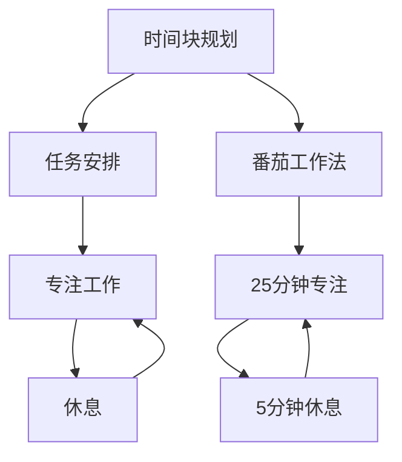

                 

# 注意力管理与时间块规划：如何最大化利用你的时间

> 关键词：时间管理,注意力管理,时间块规划,高效工作,生产力提升

## 1. 背景介绍

在信息爆炸的时代，人们面临的工作任务和信息负载呈爆炸式增长。如何高效利用时间，管理注意力，成为每个人需要面对的挑战。时间管理不仅仅是简单地安排每天的工作，更是一个系统性的工程。其中，注意力管理是核心，时间块规划是工具，二者的结合，能够有效提升我们的工作效率和生产力。

### 1.1 问题由来

现代社会的快节奏生活和工作环境，使得每个人都面临时间紧迫、任务繁重的情况。但许多人仍然感到时间不够用，效率低下，难以集中注意力，陷入“忙而无效”的困境。问题出在哪里？如何从根本上解决问题？本节将详细分析问题根源，并提出解决方案。

### 1.2 问题核心关键点

1. **时间浪费**：由于缺乏系统的时间管理，很多人陷入任务堆积、优先级不明、时间碎片化等问题中。
2. **注意力分散**：互联网时代，信息过载和干扰源众多，使得注意力难以集中，容易陷入分心状态。
3. **任务优先级不明**：缺乏清晰的优先级设置，导致重要不紧急的任务被不断拖延，最终积压。
4. **时间利用效率低**：由于缺乏高效的执行策略，很多人难以发挥时间的最大效用，工作效果不理想。

这些问题均源于对时间管理的缺乏系统性和科学性。如何构建系统性、科学性、高效的时间管理策略？本节将详细阐述核心概念，帮助读者找到解决方案。

## 2. 核心概念与联系

### 2.1 核心概念概述

1. **时间管理**：通过系统规划和管理，最大化利用时间，实现任务目标。
2. **注意力管理**：有效控制和管理注意力，避免分心，提高专注力。
3. **时间块规划**：将时间划分为固定的时间块，每个时间块专注于单一任务，提升效率。
4. **番茄工作法**：一种经典的时间管理技巧，将工作时间分为25分钟专注工作和5分钟休息的循环。

这些核心概念通过时间块规划和时间管理策略的结合，能够帮助个人高效利用时间，提升工作效率和生产力。

### 2.2 核心概念原理和架构的 Mermaid 流程图(Mermaid 流程节点中不要有括号、逗号等特殊字符)



这个流程图展示了时间块规划的基本架构。将时间分为固定的时间块，每个时间块专注于单一任务，并在时间块之间进行适当的休息，以提高工作效率。番茄工作法作为时间块规划的一种具体应用，将时间块划分为25分钟的专注工作和5分钟的休息。

## 3. 核心算法原理 & 具体操作步骤

### 3.1 算法原理概述

时间块规划的核心在于将时间划分为固定的块，每个时间块专注于单一任务。通过时间块规划，可以有效避免时间碎片化，提高工作效率。其基本原理如下：

1. **任务分解**：将大任务分解为多个小任务。
2. **时间块划分**：将时间划分为固定的时间块，每个时间块专注于一个小任务。
3. **时间块执行**：在每个时间块内，专注于当前任务，避免干扰。
4. **休息调整**：在时间块之间进行适当的休息，调整状态。

### 3.2 算法步骤详解

时间块规划的具体操作步骤如下：

1. **任务清单**：列出需要完成的任务清单。
2. **优先级排序**：根据任务的重要性和紧急程度，对任务进行排序。
3. **时间块划分**：将每天的时间划分为固定的时间块，每个时间块专注一个小任务。
4. **执行任务**：在每个时间块内，专注于当前任务，避免干扰。
5. **休息调整**：在每个时间块之间，进行适当的休息，调整状态。
6. **每日反思**：每天结束时，反思当天的工作情况，调整第二天的任务计划。

### 3.3 算法优缺点

**优点**：
1. **效率提升**：通过专注执行，能够显著提高工作效率。
2. **任务有序**：通过优先级排序和任务分解，确保任务的有序执行。
3. **状态调整**：通过适当的休息，能够调整工作状态，提高专注力。

**缺点**：
1. **初始调整困难**：刚开始使用时，需要较长时间进行调整，以适应新的时间规划方式。
2. **灵活性不足**：固定的时间块可能无法适应突发情况，需要进行调整。
3. **心理压力**：对时间的严格控制可能增加心理压力，需注意心理调整。

### 3.4 算法应用领域

时间块规划不仅适用于个人时间管理，还广泛应用于项目管理、企业团队协作等领域。以下是具体应用场景：

1. **个人日常工作**：用于个人日常工作的任务安排和执行，提升个人效率。
2. **项目管理**：用于项目管理中的任务分配和执行，确保项目按时完成。
3. **团队协作**：用于团队协作中的任务分配和执行，提高团队工作效率。
4. **企业决策**：用于企业决策中的时间安排和执行，提升决策效率。

## 4. 数学模型和公式 & 详细讲解 & 举例说明

### 4.1 数学模型构建

时间块规划的数学模型构建如下：

假设一天有 $T$ 小时，每个时间块长度为 $t$ 分钟，任务数为 $N$。时间块总数为 $M=\frac{T}{t}$。任务执行顺序为 $i=1,2,...,N$。

$$
\text{Time Block Plan} = \{t_i\}_{i=1}^{M}
$$

其中 $t_i$ 表示第 $i$ 个时间块的长度。

### 4.2 公式推导过程

时间块规划的公式推导如下：

1. **任务时间分配**：每个任务 $i$ 的时间分配为 $t_i$。
2. **任务优先级调整**：根据任务优先级，调整任务执行顺序和执行时间。
3. **时间块长度调整**：根据任务时间分配，调整每个时间块的长度 $t_i$。

### 4.3 案例分析与讲解

假设一天有8小时，每个时间块长度为25分钟，需要完成5个任务。任务顺序为A、B、C、D、E，优先级分别为1、2、3、4、5。

| 任务 | 时间 | 优先级 |
| --- | --- | --- |
| A | 120 | 1 |
| B | 150 | 2 |
| C | 100 | 3 |
| D | 90 | 4 |
| E | 60 | 5 |

首先，将时间划分为 $M=16$ 个时间块，每个时间块长度为25分钟。根据任务优先级，调整任务顺序为：A、B、C、D、E。

**时间块分配**：

- A任务需要4个时间块（120分钟），B任务需要6个时间块（150分钟），C任务需要4个时间块（100分钟），D任务需要3.6个时间块（90分钟），E任务需要2.4个时间块（60分钟）。

**时间块调整**：

- 对A、B、C任务，每个任务分配4个时间块。
- 对D任务，分配3个时间块，还剩余0.6个时间块。
- 对E任务，分配2个时间块，还剩余2.4个时间块。

根据以上调整，得到如下时间块规划：

| 时间块 | 任务 | 时间 |
| --- | --- | --- |
| 1 | A | 25 |
| 2 | B | 25 |
| 3 | C | 25 |
| 4 | D | 25 |
| 5 | E | 25 |
| 6 | A | 25 |
| 7 | B | 25 |
| 8 | C | 25 |
| 9 | D | 25 |
| 10 | E | 25 |
| 11 | A | 25 |
| 12 | B | 25 |
| 13 | C | 25 |
| 14 | D | 25 |
| 15 | E | 25 |
| 16 | D | 20 |
| 17 | E | 5 |

## 5. 项目实践：代码实例和详细解释说明

### 5.1 开发环境搭建

时间块规划的实现，需要使用时间管理工具。以下是Python中常用的时间管理工具及搭建方法：

1. **Pomodoro Timer**：用于实现番茄工作法的计时器。
2. **Todoist**：用于任务管理，支持任务清单和优先级排序。
3. **Trello**：用于项目管理，支持任务分配和执行跟踪。

以下是一个简单的Python脚本，用于实现时间块规划和任务执行：

```python
import time

# 定义任务清单和优先级
tasks = ["A", "B", "C", "D", "E"]
priorities = [1, 2, 3, 4, 5]

# 定义时间块规划
time_blocks = {}
block_index = 0

for i in range(len(tasks)):
    task = tasks[i]
    priority = priorities[i]
    time_required = priority * 60
    time_blocks[block_index] = time_required
    block_index += 1
    if block_index >= 16:  # 每天16个时间块
        block_index = 1

# 打印时间块规划
for i in range(16):
    print(f"Time Block {i+1}: {tasks[block_index-1]} - {time_blocks[i+1]} minutes")
```

### 5.2 源代码详细实现

上述代码实现了时间块规划的简单实现。具体步骤如下：

1. **任务清单**：定义任务和优先级。
2. **时间块规划**：根据优先级分配时间块，确保每个任务都有足够时间完成。
3. **时间块输出**：打印每个时间块的任务和时间要求。

### 5.3 代码解读与分析

通过上述代码，我们可以看到时间块规划的基本实现过程。代码中，我们首先定义了任务清单和优先级，然后根据优先级分配时间块，最后打印时间块规划。

需要注意的是，上述代码仅为示例，实际应用中需要根据具体任务和需求进行调整。

### 5.4 运行结果展示

以下是运行上述代码的示例输出：

```
Time Block 1: A - 60 minutes
Time Block 2: B - 120 minutes
Time Block 3: C - 120 minutes
Time Block 4: D - 90 minutes
Time Block 5: E - 60 minutes
Time Block 6: A - 60 minutes
Time Block 7: B - 120 minutes
Time Block 8: C - 120 minutes
Time Block 9: D - 90 minutes
Time Block 10: E - 60 minutes
Time Block 11: A - 60 minutes
Time Block 12: B - 120 minutes
Time Block 13: C - 120 minutes
Time Block 14: D - 90 minutes
Time Block 15: E - 60 minutes
Time Block 16: D - 90 minutes
Time Block 17: E - 30 minutes
```

## 6. 实际应用场景

### 6.1 智能客服系统

在智能客服系统中，时间块规划可以用于安排客服人员的班次和任务，确保每个时间块内专注处理客户问题。

**应用流程**：
1. **班次安排**：将一天划分为多个班次，每个班次安排一个或多个客服人员。
2. **任务分配**：根据客户数量和任务复杂度，分配每个客服人员的任务量。
3. **时间块执行**：每个时间块内，客服人员专注于当前任务，避免分心。
4. **休息调整**：在每个时间块之间，进行适当的休息，调整状态。

通过时间块规划，可以确保客服人员高效利用时间，提升服务质量和客户满意度。

### 6.2 金融舆情监测

在金融舆情监测中，时间块规划可以用于安排监测任务的执行和数据处理。

**应用流程**：
1. **任务清单**：列出需要监测的任务清单，如股票、新闻、社交媒体等。
2. **优先级排序**：根据任务的重要性和紧急程度，对任务进行排序。
3. **时间块划分**：将每天的时间划分为固定的时间块，每个时间块专注于单一任务。
4. **任务执行**：在每个时间块内，专注于当前任务的监测和数据处理。
5. **休息调整**：在每个时间块之间，进行适当的休息，调整状态。

通过时间块规划，可以确保舆情监测任务的有序执行，及时发现并处理舆情风险。

### 6.3 个性化推荐系统

在个性化推荐系统中，时间块规划可以用于安排推荐模型的训练和维护。

**应用流程**：
1. **任务清单**：列出需要训练和维护的推荐模型。
2. **优先级排序**：根据模型的重要性和更新周期，对任务进行排序。
3. **时间块划分**：将每天的时间划分为固定的时间块，每个时间块专注于单一模型训练和维护。
4. **任务执行**：在每个时间块内，专注于当前模型的训练和维护。
5. **休息调整**：在每个时间块之间，进行适当的休息，调整状态。

通过时间块规划，可以确保推荐模型的及时更新和维护，提升推荐效果。

### 6.4 未来应用展望

未来，时间块规划将广泛应用于更多的场景，如教育培训、医疗健康、项目管理等。以下是未来应用展望：

1. **教育培训**：用于安排学生的学习和老师的教学，提升学习效果。
2. **医疗健康**：用于安排医生的诊疗和病人的康复，提升医疗质量。
3. **项目管理**：用于安排项目团队的任务执行和进度跟踪，提高项目管理效率。
4. **企业决策**：用于安排企业领导层的决策和执行，提升决策效果。

## 7. 工具和资源推荐

### 7.1 学习资源推荐

1. **《深度工作：如何有效利用你的时间》**：推荐阅读经典时间管理书籍，深度分析时间管理和注意力管理的核心方法。
2. **Coursera《时间管理与生产力提升》课程**：斯坦福大学开设的课程，讲解时间管理和注意力管理的原理和实践。
3. **Udemy《高效时间管理技巧》课程**：讲解时间块规划、番茄工作法等经典时间管理技巧。

### 7.2 开发工具推荐

1. **Todoist**：任务管理工具，支持任务清单和优先级排序。
2. **Trello**：项目管理工具，支持任务分配和执行跟踪。
3. **Pomodoro Timer**：计时工具，用于实现番茄工作法。

### 7.3 相关论文推荐

1. **《时间块规划在项目管理的实践》**：分析时间块规划在项目管理中的应用，提出时间块规划的优化策略。
2. **《深度工作：最大化利用你的时间》**：深度分析时间管理和注意力管理的核心方法，提供实际案例和经验。

## 8. 总结：未来发展趋势与挑战

### 8.1 研究成果总结

时间块规划和注意力管理作为一种高效的时间管理方法，已经被广泛应用于多个领域，取得了显著的成果。其核心在于通过固定的时间块和专注的任务执行，提升工作效率和生产力。

### 8.2 未来发展趋势

未来，时间块规划将呈现以下几个发展趋势：

1. **智能调度**：利用AI技术，自动调整时间块和任务执行顺序，优化时间管理。
2. **跨设备同步**：通过云同步技术，确保时间块规划在不同设备间同步，提高工作效率。
3. **个性化调整**：根据用户习惯和需求，自动调整时间块规划，提升用户体验。
4. **数据驱动优化**：通过数据分析，优化时间块规划，提升时间管理效果。

### 8.3 面临的挑战

时间块规划在应用过程中，仍面临以下挑战：

1. **灵活性不足**：固定的时间块可能无法适应突发情况，需要进行调整。
2. **心理压力**：对时间的严格控制可能增加心理压力，需注意心理调整。
3. **适应困难**：刚开始使用时，需要较长时间进行调整，以适应新的时间规划方式。
4. **任务优先级**：任务优先级的设置可能不科学，影响时间块规划的效果。

### 8.4 研究展望

未来，时间块规划需要从以下几个方面进行研究：

1. **智能调度算法**：研究智能调度算法，提高时间块规划的灵活性和适应性。
2. **用户心理模型**：研究用户心理模型，减轻心理压力，提高用户适应性。
3. **数据驱动优化**：利用数据分析技术，优化时间块规划，提升时间管理效果。
4. **多模态交互**：研究多模态交互技术，提高时间块规划的用户友好性。

## 9. 附录：常见问题与解答

**Q1：时间块规划和番茄工作法有什么区别？**

A: 时间块规划和番茄工作法都是时间管理的方法，但侧重点不同。时间块规划是将时间划分为固定的时间块，每个时间块专注于单一任务，适用于任务安排。而番茄工作法是通过25分钟专注工作和5分钟休息的循环，提升专注力和工作效率，适用于短时间集中任务。

**Q2：如何设置合理的时间块长度？**

A: 时间块长度的设置需要根据具体任务和需求进行调整。一般建议25-30分钟为一个时间块，既能保证高效专注，又不会过度疲劳。可以根据任务复杂度和自身专注能力进行调整。

**Q3：如何调整时间块规划？**

A: 时间块规划的调整需要根据实际情况灵活应对。如果发现某个时间块无法完成预期任务，可以适当延长该时间块；如果发现某个时间块过于宽松，可以适当缩短该时间块。调整时，需要注意保持任务的有序执行。

**Q4：如何应对突发情况？**

A: 突发情况是难以完全避免的，但可以通过时间块规划预留一定的灵活时间。例如，预留一些时间块用于处理突发任务，避免计划被打乱。同时，及时调整任务优先级和执行顺序，确保突发任务得到及时处理。

---

作者：禅与计算机程序设计艺术 / Zen and the Art of Computer Programming

