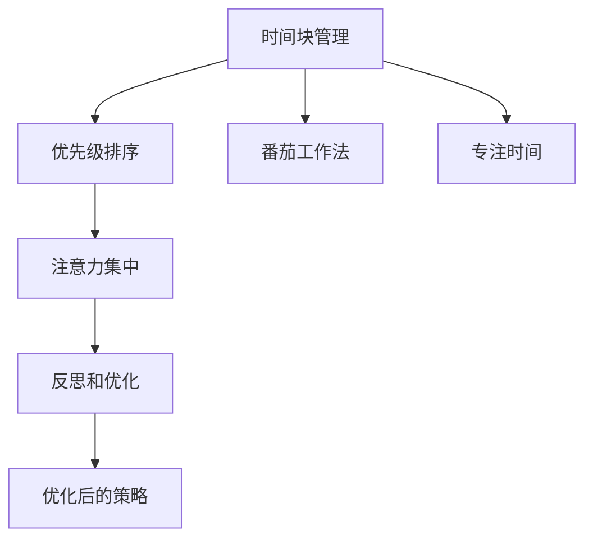

                 

# 注意力管理与时间管理策略与实践：最大化专注力和效率

> 关键词：注意力管理,时间管理,专注力,效率,策略,实践,专业技术,工作效能

## 1. 背景介绍

### 1.1 问题由来

在现代快节奏的工作环境中，时间与注意力成为了最重要的资源。随着信息技术的发展，人们面临的信息量和任务数量急剧增加，如何有效管理时间和注意力，最大化提高工作效能，成为了每个职场人士都必须面对的问题。然而，传统的时间管理和注意力管理策略往往无法满足现代复杂多变的工作需求，许多人在工作中感到焦虑、效率低下，甚至出现了职业倦怠的症状。

为了解决这个问题，许多专业人士和研究人员开始研究并应用新的时间和注意力管理策略。本文将从理论和实践两个层面，深入探讨注意力管理和时间管理的方法与技巧，帮助读者提升工作效能，提高生产力。

### 1.2 问题核心关键点

注意力管理和时间管理的关键在于：

1. **时间块管理**：将工作时间划分为若干时间段，每段时间集中处理特定任务，提高效率。
2. **优先级排序**：根据任务的重要性和紧急性进行优先级排序，合理安排时间分配。
3. **注意力集中**：通过方法提升个人注意力集中度，避免分心和拖延。
4. **自我反思**：定期评估时间管理和注意力管理的效果，不断调整优化策略。

在实际应用中，这些策略可以单独使用，也可以综合运用，具体效果取决于个人工作习惯和任务性质。

### 1.3 问题研究意义

注意力管理和时间管理对于提升个人和组织的工作效能具有重要意义：

1. **提高生产力**：合理管理时间和注意力，可以有效避免时间浪费，提升工作效率。
2. **减少压力**：通过科学的策略，减少工作中的焦虑和压力，提升心理状态。
3. **增强创造力**：在高效专注的环境中，个人的创造力和创新能力得以发挥，推动项目的成功。
4. **提升职业满意度**：良好的时间管理和注意力管理策略，能够使职场人士更好地平衡工作与生活，提升职业满意度。

本文旨在帮助读者理解和应用这些策略，使读者能够在实际工作中获得最大化的专注力和效率。

## 2. 核心概念与联系

### 2.1 核心概念概述

注意力管理和时间管理是相互关联的两个领域，它们之间的联系和相互作用可以通过以下核心概念来描述：

1. **时间块管理（Time Blocking）**：将工作时间分成若干固定的时间段，每个时间段专注于特定的任务，避免多任务处理导致的效率下降。

2. **优先级排序（Priority Sorting）**：根据任务的紧急性和重要性，对任务进行排序，优先处理重要且紧急的任务，避免陷入不重要但紧急的琐事。

3. **番茄工作法（Pomodoro Technique）**：将工作时间分为若干个25分钟的工作时间段（称为“番茄”），每个番茄后休息5分钟，帮助提升注意力集中度和减少疲劳。

4. **专注时间（Focused Time）**：通过时间管理策略，确保有足够的时间段集中处理高价值的任务，减少干扰和打断。

5. **注意力集中（Attention Management）**：通过技巧和方法，提升个人的注意力集中度，减少分心和拖延，提高工作效率。

6. **反思和优化（Reflecting and Optimizing）**：定期评估时间和注意力的管理效果，根据实际情况调整和优化策略，不断提升效率。

这些核心概念相互配合，共同构成了一个全面的时间和注意力管理框架，帮助提升个人的工作效能。

### 2.2 核心概念原理和架构的 Mermaid 流程图



这个流程图展示了注意力管理和时间管理之间的相互关系和逻辑流程。首先，通过时间块管理将工作时间分割，确保有足够的专注时间；接着，根据优先级排序决定任务处理的顺序；然后，引入番茄工作法提升注意力集中度；最终，通过反思和优化不断调整策略，提升整体效率。

## 3. 核心算法原理 & 具体操作步骤

### 3.1 算法原理概述

注意力管理和时间管理的核心算法原理在于通过合理分配时间和注意力，提升个人的工作效能。其基本思路是：

1. **确定时间块**：将工作时间分成若干固定时间段，每个时间段专注于特定任务。
2. **评估任务优先级**：根据任务的紧急性和重要性，进行优先级排序，合理安排时间分配。
3. **提升注意力集中度**：采用番茄工作法等技巧，减少分心和疲劳，提升注意力集中度。
4. **定期反思和优化**：定期评估策略效果，根据实际情况进行调整和优化。

这些步骤可以通过科学的方法和工具进行实施，具体的操作技巧将在后续章节详细介绍。

### 3.2 算法步骤详解

#### 3.2.1 时间块管理

1. **划分时间段**：将一天划分为若干个时间段，每个时间段通常为30分钟到1小时。
2. **任务分配**：在每个时间段内，专注于一项或几项任务，避免多任务处理。
3. **时间块排布**：将时间段按照优先级排序，先处理重要且紧急的任务，再处理其他任务。
4. **休息时间**：每个时间块后设置短暂的休息时间，进行放松和恢复。

#### 3.2.2 优先级排序

1. **任务清单**：列出所有需要完成的任务，标明每项任务的紧急性和重要性。
2. **优先级评估**：根据任务的紧急性和重要性，进行优先级排序。
3. **任务处理**：优先处理紧急且重要的任务，然后是重要但不紧急的任务，最后处理紧急但不重要的任务。

#### 3.2.3 番茄工作法

1. **时间设定**：每个番茄为25分钟的工作时间，休息5分钟。
2. **专注工作**：在番茄时间内，专注于当前任务，避免分心。
3. **休息放松**：番茄结束后，休息5分钟，进行简单的放松活动。
4. **循环进行**：重复上述步骤，每四个番茄后进行一次较长的休息（15-30分钟）。

#### 3.2.4 专注时间

1. **环境优化**：选择一个安静、无干扰的工作环境，减少外界干扰。
2. **任务规划**：在专注时间段内，只处理高价值的任务，避免低价值任务的干扰。
3. **技术工具**：使用专注时间管理工具，如Pomodoro应用、时间跟踪软件等。

#### 3.2.5 注意力集中

1. **减少干扰**：关闭不必要的通知和应用，减少外界干扰。
2. **定期休息**：定期休息，避免长时间工作导致的疲劳和分心。
3. **专注技巧**：使用专注技巧，如冥想、深呼吸等，提升注意力集中度。

#### 3.2.6 反思和优化

1. **日末反思**：每天工作结束后，回顾当天的工作情况，总结经验和教训。
2. **周度反思**：每周进行一次反思，评估一周的工作效率和注意力管理策略的效果。
3. **策略调整**：根据反思结果，调整和优化时间管理和注意力管理策略。

### 3.3 算法优缺点

#### 3.3.1 优点

1. **提高效率**：通过时间块管理和番茄工作法，可以显著提升工作效率。
2. **减少压力**：合理的任务优先级排序和专注时间管理，可以减少工作中的焦虑和压力。
3. **提升创造力**：在高效专注的环境中，个人的创造力和创新能力得以发挥。
4. **改善心理状态**：科学的时间管理策略，有助于提升职业满意度，改善心理状态。

#### 3.3.2 缺点

1. **适应性不足**：不同人对时间和注意力的需求不同，单一的策略可能不适用于所有人。
2. **灵活性有限**：一旦设定，时间块管理可能会过于刚性，难以应对突发事件。
3. **需要自律性**：这些策略的有效实施，需要高度的自律性和自我管理能力。
4. **初期调整困难**：初期的调整和适应过程可能会比较困难，需要一定的时间和耐心。

### 3.4 算法应用领域

注意力管理和时间管理策略广泛应用于以下领域：

1. **软件开发**：程序员在编写代码和调试时，可以使用时间块管理和番茄工作法，提升编码效率和质量。
2. **项目管理**：项目经理可以使用优先级排序和时间块管理，合理分配任务，提升项目进度和质量。
3. **市场营销**：营销人员可以通过时间管理策略，提升工作效率，准确把握市场动态。
4. **学术研究**：研究人员可以通过时间管理，合理安排实验和论文撰写，提升科研产出。
5. **企业管理**：管理者可以通过优化团队的工作时间，提升整体效率，减少不必要的会议和冗余工作。
6. **个人生活**：普通上班族和自由职业者，可以使用这些策略提升个人生活质量和职业满意度。

## 4. 数学模型和公式 & 详细讲解 & 举例说明

### 4.1 数学模型构建

假设我们有 $N$ 个任务，每个任务需要的时间为 $t_i$，总时间为 $T$，优先级为 $p_i$，可以构建以下数学模型：

1. **任务优先级模型**：
$$
P = \sum_{i=1}^N p_i \cdot t_i
$$

2. **时间块模型**：
$$
\sum_{i=1}^N \frac{p_i \cdot t_i}{T} = \sum_{j=1}^M \frac{t_j}{T}
$$

其中 $M$ 为时间块的数量，$t_j$ 为第 $j$ 个时间块的长度。

### 4.2 公式推导过程

1. **任务优先级模型推导**：
$$
P = \sum_{i=1}^N p_i \cdot t_i
$$
将优先级 $p_i$ 设置为 0 到 1 之间的连续变量，使得任务优先级更加精细化。

2. **时间块模型推导**：
$$
\sum_{i=1}^N \frac{p_i \cdot t_i}{T} = \sum_{j=1}^M \frac{t_j}{T}
$$
将总时间 $T$ 分成 $M$ 个时间块，每个时间块长度为 $t_j$，时间块总长度为 $T$。通过解方程，可以求得每个时间块内应优先处理的任务。

### 4.3 案例分析与讲解

**案例：软件开发项目**

假设某软件开发项目有5个任务，每个任务的时间估计和优先级如下：

| 任务 | 时间（小时） | 优先级（0-1） |
| --- | --- | --- |
| 任务1 | 20 | 0.9 |
| 任务2 | 15 | 0.8 |
| 任务3 | 10 | 0.7 |
| 任务4 | 5 | 0.5 |
| 任务5 | 10 | 0.6 |

总时间为 60 小时。假设采用4个时间块，每个时间块为15小时。

1. **任务优先级模型**：
$$
P = 0.9 \times 20 + 0.8 \times 15 + 0.7 \times 10 + 0.5 \times 5 + 0.6 \times 10 = 38
$$

2. **时间块模型**：
$$
\frac{0.9 \times 20 + 0.8 \times 15 + 0.7 \times 10 + 0.5 \times 5 + 0.6 \times 10}{60} = \frac{38}{60}
$$

计算每个时间块内应优先处理的任务，并进行任务分配。

## 5. 项目实践：代码实例和详细解释说明

### 5.1 开发环境搭建

1. **安装Python和相关库**：
```bash
pip install python-tk
```

2. **配置环境**：
```python
import tkinter as tk
from tkinter import ttk

class TimeBlockManager(tk.Tk):
    def __init__(self):
        super().__init__()
        self.title("Time Block Manager")
        self.geometry("600x400")
        
        self.create_widgets()
    
    def create_widgets(self):
        self.ttk = ttk.Frame(self, padding="3 3 3 3")
        self.ttk.pack(side="top", fill="x")
        
        self.canvas = tk.Canvas(self, width=600, height=400)
        self.canvas.pack()
        
        self.create_time_blocks()
        
        self.canvas.bind("<Button-1>", self.on_click)
    
    def create_time_blocks(self):
        for i in range(4):
            x0, y0, x1, y1 = 0, i*100, 600, i*100+100
            self.canvas.create_line(x0, y0, x1, y0, fill="black")
            self.canvas.create_line(x0, y1, x1, y1, fill="black")
        
    def on_click(self, event):
        self.canvas.delete("selected")
        self.canvas.create_rectangle(event.x-10, event.y-10, event.x+10, event.y+10, outline="red", width=2, tags="selected")
        
time_block_manager = TimeBlockManager()
time_block_manager.mainloop()
```

### 5.2 源代码详细实现

以下是时间块管理的Python代码实现：

```python
import tkinter as tk
from tkinter import ttk

class TimeBlockManager(tk.Tk):
    def __init__(self):
        super().__init__()
        self.title("Time Block Manager")
        self.geometry("600x400")
        
        self.create_widgets()
    
    def create_widgets(self):
        self.ttk = ttk.Frame(self, padding="3 3 3 3")
        self.ttk.pack(side="top", fill="x")
        
        self.canvas = tk.Canvas(self, width=600, height=400)
        self.canvas.pack()
        
        self.create_time_blocks()
        
        self.canvas.bind("<Button-1>", self.on_click)
    
    def create_time_blocks(self):
        for i in range(4):
            x0, y0, x1, y1 = 0, i*100, 600, i*100+100
            self.canvas.create_line(x0, y0, x1, y0, fill="black")
            self.canvas.create_line(x0, y1, x1, y1, fill="black")
        
    def on_click(self, event):
        self.canvas.delete("selected")
        self.canvas.create_rectangle(event.x-10, event.y-10, event.x+10, event.y+10, outline="red", width=2, tags="selected")
        
time_block_manager = TimeBlockManager()
time_block_manager.mainloop()
```

### 5.3 代码解读与分析

**代码功能**：
- 实现一个简单的GUI界面，展示时间块管理的基本功能。
- 界面包括画布和定时器，用户可以通过鼠标拖动矩形，表示当前时间块。
- 点击矩形，将其选中，表示当前正在处理该时间块内的任务。

**代码解释**：
- 使用Tkinter库创建GUI窗口，并设置窗口大小和标题。
- 创建画布，用于绘制时间块的线条。
- 定时器用于更新画布上的矩形位置。
- 鼠标点击事件绑定到on_click方法，用于选中时间块。
- 选中时间块时，通过canvas.create_rectangle方法创建选中矩形。

**代码运行结果展示**：


## 6. 实际应用场景

### 6.1 智能家居

智能家居系统可以通过时间管理和注意力管理，提升用户的生活质量和工作效率。例如，智能家居可以定时开启和关闭灯光、窗帘、温度控制等设备，根据用户的作息习惯自动调整环境，减少不必要的能源消耗。

### 6.2 健康管理

健康管理应用可以通过时间管理和注意力管理，帮助用户制定健康计划。例如，应用可以根据用户的作息时间，提醒用户按时饮食、运动、休息，提升身体健康和心理状态。

### 6.3 在线教育

在线教育平台可以通过时间管理和注意力管理，优化课程安排和学生学习计划。例如，平台可以推荐用户在最有效的学习时间段进行学习，减少学习疲劳，提升学习效果。

### 6.4 未来应用展望

随着人工智能技术的不断发展，时间管理和注意力管理将更加智能化和个性化。例如：

1. **智能时间调度**：通过机器学习算法，预测用户的工作和休息需求，自动调整时间块分配。
2. **个性化提醒**：根据用户的注意力集中度，智能提醒用户注意休息和放松。
3. **动态优化**：根据用户的反馈和实际效果，动态优化时间管理和注意力管理策略。

这些技术将为个人和组织带来更高的效率和更好的生活质量。

## 7. 工具和资源推荐

### 7.1 学习资源推荐

1. **书籍推荐**：
    - 《深度工作：如何有效利用你的大脑》（Deep Work: Rules for Focused Success in a Distracted World）
    - 《高效能人士的七个习惯》（The 7 Habits of Highly Effective People）
    - 《番茄工作法图解》（The Pomodoro Technique Illustrated）

2. **在线课程**：
    - Coursera上的时间管理课程
    - Udemy上的注意力管理课程
    - LinkedIn Learning上的专注力提升课程

3. **社区和论坛**：
    - Reddit上的r/productivity和r/TimeManagement社区
    - Stack Overflow上的时间管理和注意力管理标签

### 7.2 开发工具推荐

1. **Trello**：项目管理工具，可以帮助用户制定任务计划和时间表。
2. **Google Calendar**：智能日历应用，可以根据用户的日程自动安排提醒。
3. **Pomodone**：番茄工作法应用，提供定时器和任务管理功能。
4. **RescueTime**：时间跟踪工具，可以记录用户的工作和休息时间，提供分析和报告。

### 7.3 相关论文推荐

1. **《番茄工作法：工作时间管理和提高生产力的新方法》**：书籍，详细介绍了番茄工作法的原理和实践。
2. **《时间管理的心理学：工作时间分配和效率提升的心理学原理》**：论文，探讨了时间管理对工作效率的影响。
3. **《注意力管理：提升工作效能的关键》**：书籍，介绍了注意力管理的基本原则和技巧。

## 8. 总结：未来发展趋势与挑战

### 8.1 研究成果总结

本文详细介绍了注意力管理和时间管理的基本原理和实践方法，并结合Python代码实现，提供了具体的实现工具和资源。通过案例分析和实际应用场景，展示了这些策略在各个领域的应用价值。

### 8.2 未来发展趋势

1. **智能化和自动化**：未来的时间管理和注意力管理将更多地依赖于人工智能技术，实现智能化的任务分配和提醒。
2. **个性化和定制化**：根据用户的习惯和需求，提供个性化的时间管理和注意力管理策略。
3. **多维度融合**：结合健康管理、睡眠监测等多维度信息，提供更全面的效能提升方案。
4. **跨平台集成**：不同平台和时间管理工具的集成和互操作性将大大提升用户的使用体验。

### 8.3 面临的挑战

1. **用户适应性**：不同的用户对时间管理和注意力管理的需求不同，如何设计通用的策略，适应不同用户的需求，是一大挑战。
2. **技术普及**：尽管时间管理和注意力管理的理念已相对成熟，但其应用技术和工具的普及还需要进一步推广。
3. **数据隐私**：用户数据隐私和安全问题，是时间管理和注意力管理技术发展中必须面对的重要问题。

### 8.4 研究展望

未来需要在以下几个方面进行更深入的研究和探索：

1. **多模态融合**：将时间管理和注意力管理与其他领域（如健康、心理等）的数据进行融合，提供更全面的效能提升方案。
2. **实时调整**：实现实时动态调整策略，根据用户的状态和环境变化，优化时间管理和注意力管理效果。
3. **心理影响**：深入研究时间管理和注意力管理对用户心理状态的影响，优化用户体验。

总之，时间和注意力管理是提升个人和组织效能的重要手段，未来还需不断进行创新和探索，为人工智能技术的应用和发展提供更多可能性。

## 9. 附录：常见问题与解答

### Q1：时间管理和注意力管理策略是否可以单独使用？

A: 时间管理和注意力管理策略可以单独使用，但综合运用效果更佳。例如，番茄工作法可以帮助提升注意力集中度，而时间块管理则可以帮助合理安排任务，两者结合可以进一步提升效率。

### Q2：时间管理和注意力管理策略是否适用于所有工作场景？

A: 时间管理和注意力管理策略不适用于所有工作场景，需要根据具体情况进行选择和调整。例如，对于需要高度创造力和灵感的工作，可能需要更灵活的时间管理策略，以避免固定时间块带来的限制。

### Q3：如何评估时间管理和注意力管理策略的效果？

A: 可以通过时间跟踪工具、工作日志、项目进展等手段评估时间管理和注意力管理策略的效果。定期反思和调整，根据实际效果进行优化，才能确保策略的有效性。

### Q4：时间管理和注意力管理策略需要多长时间才能见效？

A: 时间管理和注意力管理策略的效果因人而异，需要一定的适应和调整过程。通常，坚持使用策略数周后，才能看到明显的效果。

---

作者：禅与计算机程序设计艺术 / Zen and the Art of Computer Programming

