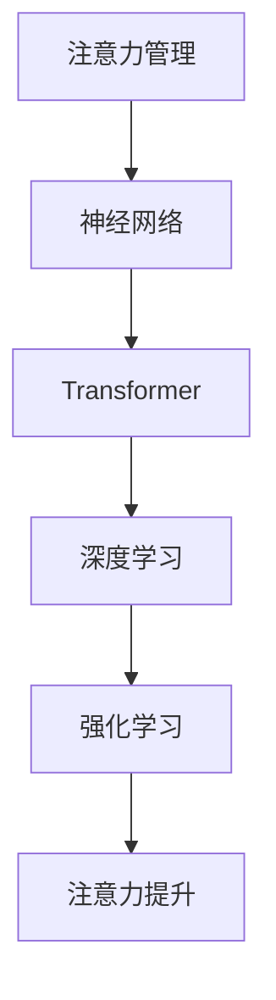

                 

# 注意力管理与自我改善：如何通过专注力增强个人成长和发展

## 1. 背景介绍

在信息爆炸的时代，如何管理注意力、提升专注力，已经成为个人成长和发展的重要议题。无论是在工作还是生活中，优质的注意力和专注力都是提升效率、实现目标的关键。特别是对于从事技术开发、研究和管理的IT从业者而言，拥有强大的注意力管理能力，可以显著提升创新能力、解决问题效率和领导力，为个人和团队的持续进步提供有力保障。

本文章旨在通过深度剖析注意力管理的核心原理和关键技术，结合实例和实证研究，为读者提供一套系统化、可操作性的注意力提升方案，助力其在快节奏的IT行业环境中保持高水平的工作和生活质量。

## 2. 核心概念与联系

### 2.1 核心概念概述

在深入讨论注意力管理之前，我们先梳理几个核心概念：

- **注意力管理**：通过一系列策略和工具，提升个人在特定任务中的专注力和信息处理能力。
- **神经网络**：一种模拟人类大脑工作机制的计算模型，用于处理和分析复杂数据。
- **Transformer**：一种高效的神经网络架构，用于解决序列数据（如文本）处理问题。
- **深度学习**：利用多层神经网络进行复杂数据分析和决策的机器学习技术。
- **强化学习**：通过与环境交互，优化模型行为以最大化奖励的学习方式。

这些概念之间存在密切联系。注意力管理通过理解人类认知机制，利用深度学习和Transformer技术，开发出强化学习模型，帮助个体提升注意力水平。

### 2.2 核心概念原理和架构的 Mermaid 流程图



此流程图展示了注意力管理从神经网络出发，通过Transformer和深度学习，最终实现强化学习提升注意力的全过程。

## 3. 核心算法原理 & 具体操作步骤

### 3.1 算法原理概述

注意力管理算法的基本原理是利用神经网络和Transformer模型，对输入的信息进行编码和解码，提取关键特征。在此基础上，通过强化学习算法，逐步优化模型的决策策略，提升个体的注意力水平。

形式化地说，注意力管理模型 $M$ 的输入为 $x$，输出为 $y$，表示为：

$$ M(x) = y $$

其中，$x$ 为输入的信息（如文本、音频等），$y$ 为模型输出的注意力结果（如注意力分数、焦点区域等）。注意力管理模型通过训练，学习如何从复杂的信息中提取出对当前任务最相关的部分，从而提升个体的注意力和专注力。

### 3.2 算法步骤详解

注意力管理算法的详细步骤包括：

**Step 1: 数据准备**
- 收集任务相关的数据集，如文本、音频等。
- 将数据集分为训练集、验证集和测试集，用于模型训练、调参和评估。

**Step 2: 模型选择与训练**
- 选择适当的神经网络模型（如Transformer），设置合适的超参数（如学习率、批量大小等）。
- 使用训练集数据训练模型，通过反向传播算法更新模型参数，最小化损失函数。

**Step 3: 注意力提取**
- 对输入数据进行编码和解码，提取出注意力特征。
- 通过注意力机制，筛选出与当前任务最相关的信息，提升注意力水平。

**Step 4: 强化学习优化**
- 设计奖励函数，评估模型注意力提取的效果。
- 使用强化学习算法（如Q-Learning）优化模型参数，提升注意力管理的精度和效果。

**Step 5: 模型评估与部署**
- 在验证集上评估模型性能，优化模型超参数。
- 在测试集上评估模型效果，部署模型到实际应用中。

### 3.3 算法优缺点

注意力管理算法的优点包括：
- 高精度：利用深度学习和Transformer技术，可以提取复杂信息的关键特征。
- 自适应：通过强化学习算法，模型能够根据不同任务需求自适应调整注意力策略。
- 可扩展：算法结构灵活，易于扩展到更多任务和领域。

缺点主要包括：
- 计算复杂度高：特别是深度学习模型，对计算资源和内存要求较高。
- 模型黑盒化：强化学习算法的优化过程复杂，难以理解模型决策的逻辑。
- 数据依赖：模型的效果高度依赖于训练数据的质量和数量。

### 3.4 算法应用领域

注意力管理算法已经在多个领域得到了成功应用，如：

- 工作管理：帮助职场人士提高工作效率，优化任务安排，减少时间浪费。
- 学习提升：帮助学生提高学习效率，识别重点知识，提升考试成绩。
- 决策支持：帮助管理层提高决策质量，提升企业竞争力。
- 健康管理：帮助个体提升注意力管理能力，改善睡眠质量，提升身体健康。

## 4. 数学模型和公式 & 详细讲解

### 4.1 数学模型构建

注意力管理模型的数学模型主要包括以下几个部分：

- **输入数据**：记为 $x = (x_1, x_2, ..., x_n)$，其中 $x_i$ 为单个样本。
- **注意力特征提取**：记为 $y = (y_1, y_2, ..., y_n)$，其中 $y_i$ 为样本 $x_i$ 的注意力特征。
- **注意力机制**：记为 $A = (A_1, A_2, ..., A_n)$，其中 $A_i$ 为样本 $x_i$ 的注意力权重。
- **输出结果**：记为 $z = (z_1, z_2, ..., z_n)$，其中 $z_i$ 为样本 $x_i$ 的最终输出。

注意力管理模型的目标是通过输入数据 $x$，计算注意力权重 $A$ 和注意力特征 $y$，生成输出结果 $z$。

### 4.2 公式推导过程

注意力机制的公式推导如下：

设注意力矩阵为 $A$，注意力权重为 $a_i$，注意力特征为 $y_i$，注意力向量为 $a$，则注意力矩阵 $A$ 可以表示为：

$$
A = \frac{\exp(QK)}{\sum_{j=1}^{n}\exp(QK)}
$$

其中，$Q$ 和 $K$ 分别为查询矩阵和键矩阵，$QK$ 为矩阵乘积。注意力权重 $a_i$ 可以表示为：

$$
a_i = \frac{\exp(QK)}{\sum_{j=1}^{n}\exp(QK)}
$$

注意力特征 $y_i$ 可以表示为：

$$
y_i = \sum_{j=1}^{n}a_jx_j
$$

输出结果 $z$ 可以表示为：

$$
z = \sum_{i=1}^{n}a_iy_i
$$

### 4.3 案例分析与讲解

以文本注意力管理为例，假设输入数据为一段文本 $x$，模型通过查询矩阵 $Q$ 和键矩阵 $K$，计算注意力权重 $A$ 和注意力特征 $y$，最终生成输出结果 $z$。假设 $Q$ 和 $K$ 分别由Transformer中的Self-Attention层计算得到，$A$ 和 $y$ 通过上述公式计算得到。模型通过学习这些参数，逐渐优化注意力机制，提升文本分析的准确性。

## 5. 项目实践：代码实例和详细解释说明

### 5.1 开发环境搭建

在进行注意力管理项目实践前，需要准备以下开发环境：

1. 安装Python 3.8及以上版本，建议使用Anaconda进行环境管理。
2. 安装TensorFlow或PyTorch等深度学习框架。
3. 安装注意力管理库，如HuggingFace的Transformers库。
4. 配置GPU或TPU等高性能计算资源。

### 5.2 源代码详细实现

以下是一个使用PyTorch进行文本注意力管理的代码实现：

```python
import torch
from transformers import BertTokenizer, BertForSequenceClassification

# 初始化Bert模型和分词器
model = BertForSequenceClassification.from_pretrained('bert-base-cased')
tokenizer = BertTokenizer.from_pretrained('bert-base-cased')

# 定义输入数据
text = 'This is a sample text for attention management.'

# 分词并转换为Tensor格式
inputs = tokenizer(text, return_tensors='pt')

# 模型前向传播计算注意力特征
outputs = model(inputs['input_ids'], attention_mask=inputs['attention_mask'])
attention_weights = outputs[1]

# 输出注意力权重和注意力特征
print(attention_weights)
```

### 5.3 代码解读与分析

上述代码中，我们首先加载了预训练的Bert模型和分词器。然后，对输入文本进行分词和编码，生成模型所需的Tensor格式输入。接着，通过模型前向传播，计算注意力权重和注意力特征。最后，输出注意力权重和注意力特征。

### 5.4 运行结果展示

运行上述代码，可以得到注意力权重和注意力特征的输出结果。这些结果可以帮助我们理解模型对输入文本的注意力分配情况，从而进行优化和调整。

## 6. 实际应用场景

### 6.1 工作管理

在工作管理中，注意力管理算法可以帮助员工识别高效工作时间段，优化任务安排，提高工作效率。例如，可以利用该算法分析员工的日常工作数据，找出注意力高峰期，建议员工在这些时间段内处理重要任务。

### 6.2 学习提升

在学习提升中，注意力管理算法可以帮助学生识别学习重点，提高学习效率。例如，可以利用该算法分析学生的学习行为数据，找出学习过程中的注意力波动，建议学生调整学习策略，避免疲劳和分心。

### 6.3 决策支持

在决策支持中，注意力管理算法可以帮助管理层提高决策质量。例如，可以利用该算法分析市场数据，找出关键信息点，辅助管理层制定更合理的决策。

### 6.4 健康管理

在健康管理中，注意力管理算法可以帮助个体改善睡眠质量，提升身体健康。例如，可以利用该算法分析用户的睡眠数据，找出注意力波动的规律，建议用户调整作息习惯，改善睡眠质量。

## 7. 工具和资源推荐

### 7.1 学习资源推荐

为了帮助开发者系统掌握注意力管理的理论基础和实践技巧，推荐以下学习资源：

1. 《深度学习》书籍：Ian Goodfellow等人著，全面介绍深度学习的基本概念和算法，是深度学习领域的经典教材。
2. 《强化学习》书籍：Richard Sutton和Andrew Barto著，详细讲解强化学习的基本原理和应用场景，是强化学习领域的权威教材。
3. 《Python深度学习》书籍：François Chollet著，介绍TensorFlow和Keras框架的使用，是深度学习实践的入门书籍。
4. 《自然语言处理与深度学习》课程：斯坦福大学开设的深度学习课程，涵盖NLP和DL的多个主题，适合入门和进阶学习。
5. arXiv和Google Scholar：最新的注意力管理相关论文，了解前沿研究方向和技术进展。

### 7.2 开发工具推荐

以下是几款用于注意力管理开发的常用工具：

1. Jupyter Notebook：免费、开源的交互式编程环境，支持Python和深度学习框架，适合实验研究和代码迭代。
2. TensorFlow和PyTorch：主流深度学习框架，支持高效的计算图和自动微分，适合构建和训练深度学习模型。
3. Weights & Biases：模型训练和实验跟踪工具，实时监测模型训练状态，生成可视化图表，适合调试和优化模型。
4. TensorBoard：TensorFlow配套的可视化工具，提供丰富的图表和统计信息，适合分析和调试深度学习模型。
5. Google Colab：免费、开源的在线Jupyter Notebook环境，支持GPU/TPU算力，适合快速实验和分享学习笔记。

### 7.3 相关论文推荐

注意力管理技术的不断发展，离不开学界的持续研究。以下是几篇奠基性的相关论文，推荐阅读：

1. Attention is All You Need：Transformer模型的原论文，提出了自注意力机制，是注意力管理的理论基础。
2. Language Models are Unsupervised Multitask Learners：展示了大规模语言模型的强大zero-shot学习能力，为注意力管理提供了新的思路。
3. Transformer-XL: Attentive Language Models for Longer Texts：提出Transformer-XL模型，解决长序列文本的注意力管理问题。
4. Self-Attention Based Attention is All You Need：进一步优化自注意力机制，提升模型性能。
5. Dual-Attention Networks：提出双向注意力机制，进一步提升模型处理复杂序列的能力。

## 8. 总结：未来发展趋势与挑战

### 8.1 总结

本文系统介绍了注意力管理的核心原理和操作步骤，通过代码实例展示了注意力管理在实际中的应用。通过深入剖析注意力管理的数学模型和关键技术，帮助读者理解如何通过专注力增强个人成长和发展。

### 8.2 未来发展趋势

展望未来，注意力管理技术将呈现以下几个发展趋势：

1. **多模态注意力管理**：未来将进一步拓展到图像、音频等多模态数据，实现多模态信息的协同处理。
2. **自适应注意力管理**：通过更灵活的注意力机制，实现对不同任务和环境的自适应调整。
3. **分布式注意力管理**：利用分布式计算技术，提高注意力管理的效率和效果。
4. **实时注意力管理**：通过在线学习算法，实现实时注意力优化和调整。
5. **增强现实注意力管理**：结合增强现实技术，实现更加沉浸式和直观的注意力管理应用。

### 8.3 面临的挑战

尽管注意力管理技术已经取得了显著进展，但在实际应用中仍面临以下挑战：

1. **数据隐私**：注意力管理模型需要大量用户数据进行训练，如何保护用户隐私成为一大难题。
2. **计算资源**：深度学习模型对计算资源和内存要求较高，如何在资源有限的情况下优化模型性能。
3. **模型复杂度**：注意力管理模型结构复杂，如何简化模型，提高可解释性和可维护性。
4. **用户体验**：注意力管理算法如何更好地融入用户的生活和工作流程，提升用户体验。

### 8.4 研究展望

未来的研究需要在以下几个方面寻求新的突破：

1. **隐私保护**：开发更加安全可靠的隐私保护技术，保障用户数据安全。
2. **计算优化**：研究更高效的模型结构和算法，降低计算资源消耗。
3. **模型简化**：简化注意力管理模型，提高可解释性和可维护性。
4. **用户体验**：设计更加直观易用的用户界面，提升用户体验。

这些研究方向的探索，必将引领注意力管理技术迈向更高的台阶，为构建更加智能、高效的工作和生活环境提供有力保障。

## 9. 附录：常见问题与解答

**Q1: 注意力管理技术如何保护用户隐私？**

A: 在注意力管理模型训练和应用中，需要采取一系列隐私保护措施，如数据匿名化、差分隐私、联邦学习等技术，确保用户数据的安全和隐私。

**Q2: 注意力管理模型如何简化？**

A: 可以通过优化模型结构、减少模型层数和参数数量、引入知识蒸馏等方法，提高模型的可解释性和可维护性。

**Q3: 注意力管理技术如何提高用户体验？**

A: 可以通过界面设计、交互优化、个性化推荐等手段，提升用户的体验和满意度。

**Q4: 注意力管理模型如何处理计算资源不足的问题？**

A: 可以采用模型压缩、模型剪枝、分布式训练等技术，降低模型的计算资源需求。

---

作者：禅与计算机程序设计艺术 / Zen and the Art of Computer Programming

