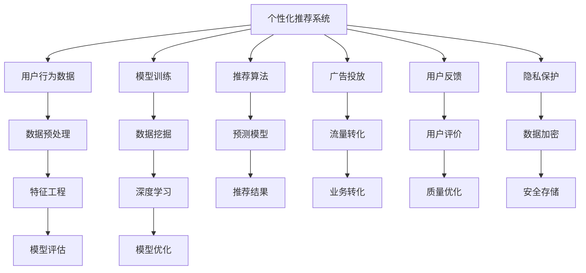

                 

# 注意力经济与个人消费决策的变化

> 关键词：注意力经济, 消费决策, 数字时代, 算法推荐, 用户行为, 隐私保护

## 1. 背景介绍

### 1.1 问题由来
在信息爆炸的现代社会，信息源和消费品种类繁多，用户面对海量选择时往往感到困惑和疲惫。传统线性搜索的方式逐渐被基于兴趣和偏好的个性化推荐系统所替代，极大地提升了用户的浏览和购物效率。同时，这一变革也推动了互联网企业通过广告和数据挖掘等手段，实现盈利模式的转变，进而催生了新兴的“注意力经济”概念。

在数据驱动的时代，如何更高效地利用用户有限的注意力资源，最大化消费决策的效益，成为了当今互联网和营销领域的重要课题。本文将从理论到实践，系统地介绍“注意力经济”的概念、发展现状以及未来趋势，并探讨该背景下个人消费决策的变化。

## 2. 核心概念与联系

### 2.1 核心概念概述

“注意力经济”（Economy of Attention）是由经济学家曼斯菲尔德（Gary Mansfield）提出，强调在信息过载时代，用户注意力资源的稀缺性及其经济价值。与传统的经济资源不同，注意力经济中的核心资源是用户的时间和精神能量，即他们的注意力。互联网企业通过提供个性化推荐、精准广告投放等手段，争夺用户有限注意力的竞争，形成新的商业模式。

个性化推荐系统（Recommender System）是实现注意力经济的核心技术，其通过分析用户历史行为和偏好，向用户推荐最符合其兴趣的内容和商品，从而实现流量转化和用户黏性提升。常见的推荐系统包括基于协同过滤、内容过滤、混合过滤等不同策略的模型。

此外，隐私保护（Privacy Protection）也是注意力经济中不可或缺的议题。在个性化推荐中，用户的行为数据和个人信息可能被滥用，引发数据隐私泄露等问题。如何在个性化推荐和隐私保护之间寻求平衡，保障用户权益，是业界亟需解决的问题。

### 2.2 核心概念原理和架构的 Mermaid 流程图



### 2.3 核心概念之间的关系

- **用户行为数据**：是推荐系统的输入，包含用户浏览历史、点击行为、购买记录等信息。
- **模型训练**：基于用户行为数据，使用机器学习算法训练个性化推荐模型。
- **推荐算法**：根据训练好的模型，计算用户对每个商品或内容的兴趣评分，推荐结果。
- **广告投放**：将推荐结果作为广告内容进行投放，吸引用户点击，实现流量转化。
- **用户反馈**：用户对推荐结果的评价，用于优化推荐系统。
- **隐私保护**：在数据收集和使用过程中，保障用户隐私不被泄露。

## 3. 核心算法原理 & 具体操作步骤

### 3.1 算法原理概述

个性化推荐系统主要分为基于内容的推荐、协同过滤推荐和混合推荐等几种模式。其中，基于内容的推荐系统（Content-based Recommender）主要利用物品的描述特征，进行相似性匹配。协同过滤推荐系统（Collaborative Filtering Recommender）则通过分析用户和物品之间的交互行为，找到用户和物品之间的潜在联系，进行推荐。

#### 3.2 算法步骤详解

以下以协同过滤推荐系统为例，详细讲解其操作步骤：

**Step 1: 数据准备**
- 收集用户行为数据，如用户ID、物品ID、评分等。
- 对数据进行清洗、去重、归一化等预处理操作。
- 将数据划分为训练集、验证集和测试集，用于模型训练、调参和评估。

**Step 2: 模型训练**
- 选择协同过滤算法，如基于用户的协同过滤、基于物品的协同过滤等。
- 使用训练集数据，训练推荐模型。
- 在验证集上评估模型性能，调整参数。
- 最终使用测试集进行模型测试，评估推荐效果。

**Step 3: 推荐实现**
- 对新用户进行预测，使用用户-物品交互矩阵计算兴趣评分。
- 根据评分排序，推荐评分最高的物品。
- 可根据用户反馈调整推荐算法，如加入动态调整机制、多臂投币机策略等。

#### 3.3 算法优缺点

**协同过滤算法的优点：**
- 简单易实现：不需要物品特征，对物品属性描述要求较低。
- 高效性：适用于用户众多、物品多样的场景，能够快速找到相似用户或物品。

**协同过滤算法的缺点：**
- 数据稀疏性：用户-物品交互矩阵往往稀疏，难以充分挖掘用户和物品的潜在联系。
- 冷启动问题：新用户和物品无法有效利用历史数据进行推荐，需要额外策略处理。
- 可扩展性：随着数据规模的增长，系统存储和计算成本线性增加，需考虑分布式存储和计算。

#### 3.4 算法应用领域

个性化推荐系统广泛应用在电商、社交媒体、视频网站、音乐平台等场景中，通过提升用户体验，增加用户粘性，从而实现商业价值最大化。同时，广告投放系统也常基于个性化推荐，精准推送广告，提高广告点击率和转化率。

## 4. 数学模型和公式 & 详细讲解 & 举例说明

### 4.1 数学模型构建

协同过滤推荐系统的核心数学模型是用户-物品交互矩阵 $U$ 和物品-物品相似度矩阵 $V$。假设用户集为 $U$，物品集为 $I$，用户对物品的评分矩阵为 $R \in \mathbb{R}^{n \times m}$，其中 $n$ 为用户数，$m$ 为物品数。

**基于用户的协同过滤算法**：

$$
R_{ui} = \sum_{j \in U} \frac{U_{uj}V_{ji}}{\sqrt{U_{uj}V_{ji}}}
$$

其中 $U_{uj}$ 和 $V_{ji}$ 分别表示用户 $u$ 对物品 $j$ 的评分和物品 $j$ 与物品 $i$ 的相似度。

**基于物品的协同过滤算法**：

$$
R_{ui} = \sum_{j \in I} \frac{U_{uj}V_{ji}}{\sqrt{U_{uj}V_{ji}}}
$$

### 4.2 公式推导过程

以基于用户的协同过滤算法为例，进行详细推导：

**Step 1: 用户相似度计算**

$$
\text{User Similarity}(u_i,u_j) = \frac{R_{ui}\cdot R_{uj}}{||R_u||_2 ||R_j||_2}
$$

其中 $R_u$ 和 $R_j$ 分别为用户 $u$ 和 $j$ 的评分向量。

**Step 2: 物品相似度计算**

$$
\text{Item Similarity}(i_i,i_j) = \frac{V_{i_i}\cdot V_{i_j}}{||V_i||_2 ||V_j||_2}
$$

**Step 3: 用户评分预测**

$$
\hat{R}_{ui} = \sum_{j \in U} \text{User Similarity}(u_i,u_j) \cdot R_{uj}
$$

### 4.3 案例分析与讲解

假设某电商平台收集了用户的评分数据，利用基于用户的协同过滤算法进行推荐。具体步骤包括：

1. 数据预处理：对用户和物品评分进行归一化，处理缺失数据。
2. 相似度计算：计算用户和物品的相似度，构建用户-物品交互矩阵。
3. 模型训练：使用训练集数据训练推荐模型，调整相似度计算公式中的参数。
4. 推荐实现：对新用户进行评分预测，推荐评分最高的商品。

## 5. 项目实践：代码实例和详细解释说明

### 5.1 开发环境搭建

进行个性化推荐系统开发前，需要准备以下开发环境：

- 安装Python 3.8或以上版本。
- 安装Pandas、NumPy、Scikit-learn等数据科学库。
- 安装Scikit-mind和TensorFlow等推荐系统库。
- 安装Docker和Kubernetes等容器化工具。

### 5.2 源代码详细实现

以下是一个基于TensorFlow的协同过滤推荐系统的代码实现，包含数据准备、模型训练和推荐实现等步骤：

```python
import tensorflow as tf
import pandas as pd
import numpy as np

# 数据准备
data = pd.read_csv('ratings.csv')
data = data.dropna()

# 特征工程
users = data['user_id'].unique()
items = data['item_id'].unique()
data['user_id'] = data['user_id'].astype('category').cat.codes
data['item_id'] = data['item_id'].astype('category').cat.codes

# 模型训练
num_users = len(data)
num_items = len(items)
embedding_dim = 100

user_embeddings = tf.Variable(tf.random.normal([num_users, embedding_dim]))
item_embeddings = tf.Variable(tf.random.normal([num_items, embedding_dim]))

user_features = tf.reshape(data['user_id'], [num_users, 1])
item_features = tf.reshape(data['item_id'], [num_items, 1])

user_similarity = tf.matmul(user_features, user_embeddings)
item_similarity = tf.matmul(item_features, item_embeddings)

user_item_matrix = user_similarity * item_similarity
predicted_ratings = tf.matmul(user_item_matrix, item_embeddings)

# 损失函数和优化器
loss = tf.losses.mean_squared_error(tf.reshape(data['rating'], [-1, 1]), predicted_ratings)
optimizer = tf.optimizers.Adam()

# 训练过程
for i in range(100):
    optimizer.minimize(loss)

# 推荐实现
test_data = pd.read_csv('test_data.csv')
test_data = test_data.dropna()
user_test = test_data['user_id'].astype('category').cat.codes
item_test = test_data['item_id'].astype('category').cat.codes

user_similarity_test = tf.matmul(user_test, user_embeddings)
item_similarity_test = tf.matmul(item_test, item_embeddings)

user_item_matrix_test = user_similarity_test * item_similarity_test
predicted_ratings_test = tf.matmul(user_item_matrix_test, item_embeddings)

# 获取推荐结果
top_items = predicted_ratings_test.argsort()[::-1][:10]
```

### 5.3 代码解读与分析

代码中，首先使用Pandas进行数据读取和处理，将评分数据转化为适合模型训练的格式。在特征工程部分，使用Embedding层将用户和物品ID转化为向量表示，构建用户-物品交互矩阵。然后，使用TensorFlow计算相似度，进行预测，定义损失函数并使用Adam优化器进行模型训练。最后，对测试数据进行评分预测，并获取推荐结果。

## 6. 实际应用场景

### 6.1 电商平台

电商平台广泛使用个性化推荐系统，提升用户购物体验和转化率。例如亚马逊、淘宝等，通过分析用户浏览、点击、购买记录，向用户推荐相关商品，大幅提高用户复购率。

### 6.2 视频网站

视频网站如Netflix、YouTube等，通过推荐算法，推荐用户可能感兴趣的电影和视频，提高用户观看时间和满意度，增强平台黏性。

### 6.3 音乐平台

音乐平台如Spotify、网易云音乐等，利用推荐系统，向用户推荐适合的音乐和歌单，增加用户使用时长，提高音乐推荐质量。

## 7. 工具和资源推荐

### 7.1 学习资源推荐

- 《推荐系统实战》一书：详细介绍了推荐系统的理论基础和实际应用，推荐算法，以及最新技术。
- Coursera《推荐系统》课程：由斯坦福大学提供，涵盖推荐系统的经典算法、应用案例等。
- Kaggle竞赛：参与推荐系统相关的竞赛，提高实战能力。

### 7.2 开发工具推荐

- PyTorch：灵活的深度学习框架，适合进行推荐系统研究。
- TensorFlow：强大的深度学习框架，易于部署和优化。
- Apache Spark：分布式计算平台，适用于大规模数据处理和训练。

### 7.3 相关论文推荐

- 《Collaborative Filtering for Implicit Feedback Datasets》（Reshef et al. 2007）：介绍了协同过滤推荐系统的经典算法和应用。
- 《Precision-Recall Tradeoff in Recommendation Systems》（Cantor et al. 2009）：探讨了推荐系统中的精度和召回率之间的平衡问题。
- 《Deep Learning for Recommender Systems》（He et al. 2017）：综述了深度学习在推荐系统中的应用。

## 8. 总结：未来发展趋势与挑战

### 8.1 研究成果总结

个性化推荐系统在电商、视频、音乐等领域已经得到了广泛应用，提升了用户体验和商业价值。同时，广告投放系统也常基于推荐系统，精准推送广告，提高广告点击率和转化率。然而，推荐系统面临数据稀疏、冷启动、隐私保护等挑战，仍需不断优化和改进。

### 8.2 未来发展趋势

未来的推荐系统将更加注重个性化和多样性，通过多模态融合、上下文感知等技术，提升推荐效果。同时，推荐系统也将更加注重隐私保护，使用差分隐私、联邦学习等技术，保障用户隐私不被滥用。

### 8.3 面临的挑战

推荐系统需要解决数据稀疏、冷启动、隐私保护等挑战，需要更加高效、鲁棒的算法和模型。同时，推荐系统需要更好地融入用户决策模型，理解用户偏好和行为，实现真正意义上的个性化推荐。

### 8.4 研究展望

未来的推荐系统需要引入更多智能技术，如因果推断、强化学习、用户行为建模等，从多维度理解用户需求，提供更加准确、个性化的推荐。同时，推荐系统需要更好地与外部知识库、规则库等专家知识结合，实现更加全面、准确的信息整合能力。

## 9. 附录：常见问题与解答

**Q1: 推荐系统如何处理数据稀疏性问题？**

A: 推荐系统通过数据补全、矩阵分解、邻域采样等方法，处理数据稀疏性问题。例如，利用矩阵分解算法，将用户-物品矩阵分解为用户特征和物品特征，填补缺失数据。同时，利用邻域采样方法，在用户-物品矩阵中找到相似的邻居用户或物品，进行推荐。

**Q2: 推荐系统如何缓解冷启动问题？**

A: 推荐系统通过引入新用户或物品的初始评分、内容特征等方法，缓解冷启动问题。例如，在协同过滤算法中，利用物品内容特征，对新用户进行评分预测，提高推荐准确度。此外，利用知识图谱、用户画像等方法，增加新用户和物品的特征，实现冷启动推荐。

**Q3: 推荐系统如何保护用户隐私？**

A: 推荐系统通过差分隐私、联邦学习等技术，保护用户隐私。例如，差分隐私通过添加噪音，保护用户数据的隐私性。联邦学习通过在用户端进行模型训练，保护数据不被集中存储和传输。

**Q4: 推荐系统如何提升推荐效果？**

A: 推荐系统通过算法优化、特征工程、上下文感知等方法，提升推荐效果。例如，在协同过滤算法中，优化相似度计算方法，提升推荐准确度。在基于内容的推荐中，利用用户画像、行为特征等进行特征工程，提升推荐效果。在上下文感知推荐中，引入上下文信息，如时间、地点等，提升推荐效果。

---

作者：禅与计算机程序设计艺术 / Zen and the Art of Computer Programming

