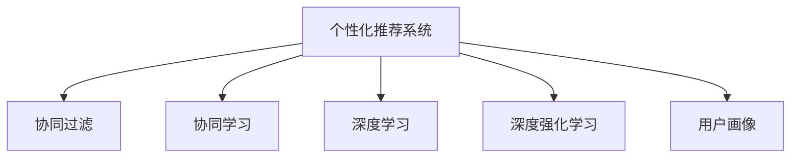

                 

# 注意力经济与个性化推荐算法：为受众提供定制、有针对性的内容

> 关键词：注意力经济,个性化推荐,协同过滤,协同学习,深度学习,深度强化学习,用户画像,行为分析,决策树,特征工程

## 1. 背景介绍

### 1.1 问题由来
随着互联网的迅猛发展和智能终端设备的普及，信息爆炸和用户注意力资源的分散化已成为常态。如何通过技术手段优化用户体验，提高内容吸引力，进而提升平台价值，是互联网公司面临的重要挑战。

在这一背景下，个性化推荐技术应运而生。个性化推荐系统通过分析用户历史行为和偏好，将用户最感兴趣的内容推荐到最合适的时间，最大化用户对平台的使用时间和价值，实现流量变现，构建出所谓的“注意力经济”。

### 1.2 问题核心关键点
个性化推荐系统利用用户画像、协同过滤、协同学习等技术，实现对用户兴趣和行为的精准预测，推荐出个性化的内容。这些推荐算法通过不断学习用户与内容之间的交互数据，更新模型参数，逐渐提升推荐效果，实现“越用越聪明”。

核心关键点包括：
- 用户画像构建：通过多维度数据，构建用户的兴趣模型，刻画其偏好和行为特征。
- 协同过滤：根据用户的历史行为，推荐与其兴趣相近的其他用户喜欢过的内容。
- 协同学习：利用用户与内容交互的行为数据，更新模型参数，提升推荐准确性。
- 深度学习：利用神经网络等深度学习模型，刻画用户和内容的非线性关系，提高推荐精度。
- 深度强化学习：通过学习用户交互反馈，优化推荐策略，形成更有效的个性化推荐。

### 1.3 问题研究意义
个性化推荐技术在提升用户体验、增加平台黏性、提升流量变现方面具有重要价值。它通过精准的内容推荐，缩短了用户获取信息和知识的时间成本，提高了用户对平台的满意度和忠诚度。同时，利用用户注意力资源，平台可以进行精准的广告投放，实现商业化运营。

研究个性化推荐算法，不仅有助于构建优质的用户体验，还能推动互联网经济的繁荣发展，助力经济社会的数字化转型升级。

## 2. 核心概念与联系

### 2.1 核心概念概述

为更好地理解个性化推荐算法，本节将介绍几个密切相关的核心概念：

- 个性化推荐系统：通过分析用户行为数据，为用户提供有针对性的内容推荐，提升用户满意度和平台价值。
- 协同过滤：一种基于用户和物品的相似性度量，推荐与其兴趣相似的其他用户喜欢的物品。分为基于用户的协同过滤和基于物品的协同过滤。
- 协同学习：利用用户与物品交互的行为数据，不断更新推荐模型，提升推荐效果。
- 深度学习：利用神经网络模型，刻画用户和物品的复杂非线性关系，提升推荐精度。
- 深度强化学习：通过学习用户交互反馈，优化推荐策略，构建出动态自适应的个性化推荐系统。
- 用户画像：通过多维度数据，构建用户的兴趣模型，刻画其偏好和行为特征，用于个性化推荐。

这些概念之间的逻辑关系可以通过以下Mermaid流程图来展示：



这个流程图展示了个性化推荐系统的核心概念及其之间的关系：

1. 个性化推荐系统通过协同过滤、协同学习、深度学习和深度强化学习等多种技术手段，精准推荐内容。
2. 协同过滤和协同学习利用用户与物品的交互数据，不断更新模型参数，提升推荐准确性。
3. 深度学习通过神经网络模型，刻画用户和物品的复杂关系，进一步提升推荐精度。
4. 深度强化学习通过学习用户交互反馈，优化推荐策略，构建出更高效、动态的个性化推荐系统。
5. 用户画像构建了用户的兴趣模型，为推荐系统提供精准的用户画像输入。

## 3. 核心算法原理 & 具体操作步骤
### 3.1 算法原理概述

个性化推荐算法的核心目标是，通过分析用户历史行为数据，预测其未来可能感兴趣的内容，并推荐给用户。其核心原理包括以下几个步骤：

1. 数据收集：通过爬虫、API接口等方式，收集用户行为数据，如浏览记录、点击记录、评分数据等。
2. 用户画像构建：利用多维度数据，构建用户的兴趣模型，刻画其偏好和行为特征。
3. 协同过滤：根据用户的历史行为，推荐与其兴趣相似的其他用户喜欢的内容。
4. 协同学习：利用用户与内容交互的行为数据，更新推荐模型，提升推荐效果。
5. 深度学习：利用神经网络等深度学习模型，刻画用户和内容的非线性关系，提高推荐精度。
6. 深度强化学习：通过学习用户交互反馈，优化推荐策略，构建出动态自适应的个性化推荐系统。

### 3.2 算法步骤详解

以下是实现个性化推荐系统的主要操作步骤：

**Step 1: 数据收集与预处理**
- 通过API接口、爬虫等方式，收集用户行为数据，如浏览记录、点击记录、评分数据等。
- 对收集到的数据进行清洗和预处理，如去除重复数据、填充缺失值等。

**Step 2: 用户画像构建**
- 利用多维度数据，如历史行为数据、兴趣标签、社交网络信息等，构建用户兴趣模型。
- 采用协同过滤、协同学习、深度学习等技术手段，刻画用户偏好和行为特征。

**Step 3: 协同过滤推荐**
- 根据用户的历史行为数据，计算其与其他用户的相似度。
- 推荐与其兴趣相似的其他用户喜欢的内容。

**Step 4: 协同学习推荐**
- 利用用户与内容交互的行为数据，不断更新推荐模型，提升推荐效果。
- 采用深度学习等技术手段，刻画用户和内容的复杂关系。

**Step 5: 深度学习推荐**
- 利用神经网络模型，如神经协同过滤（Neural Collaborative Filtering, NCF）等，刻画用户和内容的非线性关系。
- 采用深度强化学习等技术手段，优化推荐策略，构建出更高效、动态的个性化推荐系统。

**Step 6: 模型评估与优化**
- 通过A/B测试等方式，评估推荐模型的效果。
- 根据模型效果和用户反馈，不断优化模型参数，提升推荐精度。

### 3.3 算法优缺点

个性化推荐算法具有以下优点：
1. 提升用户体验：通过精准的内容推荐，提高用户对平台的使用时间和价值。
2. 增加平台黏性：利用用户的注意力资源，提高用户对平台的忠诚度和黏性。
3. 提升流量变现：通过精准的广告投放，实现商业化运营，增加平台收入。
4. 优化内容分发：通过数据分析，优化内容分发策略，提高平台整体效率。

同时，该算法也存在以下局限性：
1. 数据依赖：个性化推荐系统高度依赖用户行为数据，数据稀疏和偏差等问题可能导致推荐效果不佳。
2. 用户隐私：用户历史行为数据的收集和使用，可能会涉及用户隐私保护问题。
3. 冷启动问题：新用户或新内容的冷启动问题，可能导致推荐效果不足。
4. 算力成本：个性化推荐系统通常需要大量的计算资源进行模型训练和推理，算力成本较高。
5. 过度拟合：大规模数据可能导致模型过度拟合，泛化性能下降。

尽管存在这些局限性，但个性化推荐算法仍然是大数据时代实现内容精准推荐的核心方法之一，具有重要价值和广泛应用。

### 3.4 算法应用领域

个性化推荐技术在多个领域得到了广泛的应用，具体包括：

- 电商推荐：推荐用户可能感兴趣的商品，提升销售额和用户满意度。
- 视频推荐：推荐用户可能感兴趣的视频内容，增加用户停留时间和平台粘性。
- 音乐推荐：推荐用户可能喜欢的音乐，提升用户音乐体验和平台价值。
- 新闻推荐：推荐用户感兴趣的新闻内容，提升用户阅读体验和平台流量。
- 社交推荐：推荐用户可能感兴趣的朋友、群组、话题等，增加用户活跃度和平台互动。

除了这些常见应用外，个性化推荐技术还被创新性地应用到更多场景中，如智能家居、智能交通、智能医疗等，为各行各业带来了变革性的影响。

## 4. 数学模型和公式 & 详细讲解 & 举例说明

### 4.1 数学模型构建

本节将使用数学语言对个性化推荐系统的核心算法进行更加严格的刻画。

设用户集为 $U$，物品集为 $I$，用户与物品之间的交互矩阵为 $R \in \mathbb{R}^{m \times n}$，其中 $m$ 为用户数，$n$ 为物品数。$R_{ui}$ 表示用户 $u$ 对物品 $i$ 的评分或行为记录。

推荐系统的目标是预测用户 $u$ 对物品 $i$ 的评分或偏好程度，记为 $\hat{r}_{ui}$。

**协同过滤推荐模型**：
协同过滤基于用户和物品的相似性度量，推荐与其兴趣相似的其他用户喜欢的内容。模型主要分为基于用户的协同过滤和基于物品的协同过滤。

- 基于用户的协同过滤（User-Based Collaborative Filtering, UBCF）：
  - 构建用户 $u$ 与其他用户的相似度矩阵 $S_u \in \mathbb{R}^{k \times m}$，其中 $k$ 为相似度维度。
  - 预测用户 $u$ 对物品 $i$ 的评分：
  $$
  \hat{r}_{ui} = \sum_{v \in U} S_{uv} r_{vi}
  $$

- 基于物品的协同过滤（Item-Based Collaborative Filtering, IBCF）：
  - 构建物品 $i$ 与其他物品的相似度矩阵 $S_i \in \mathbb{R}^{n \times k}$，其中 $k$ 为相似度维度。
  - 预测用户 $u$ 对物品 $i$ 的评分：
  $$
  \hat{r}_{ui} = \sum_{j \in I} S_{ij} r_{uj}
  $$

**协同学习推荐模型**：
协同学习利用用户与内容交互的行为数据，更新推荐模型，提升推荐效果。常用的协同学习模型包括矩阵分解（Matrix Factorization, MF）、梯度下降等。

- 矩阵分解模型（MF）：
  - 将用户与物品的交互矩阵 $R$ 分解为两个低秩矩阵 $P \in \mathbb{R}^{m \times k}$ 和 $Q \in \mathbb{R}^{n \times k}$。
  - 用户 $u$ 对物品 $i$ 的评分预测：
  $$
  \hat{r}_{ui} = \sum_{l=1}^k P_{ul}Q_{il}
  $$

- 梯度下降模型：
  - 利用用户与物品的交互数据，通过梯度下降等方法，更新模型参数 $P$ 和 $Q$。
  - 用户 $u$ 对物品 $i$ 的评分预测：
  $$
  \hat{r}_{ui} = \sum_{l=1}^k \nabla_{P_{ul}}r_{ui}
  $$

**深度学习推荐模型**：
深度学习利用神经网络模型，刻画用户和内容的非线性关系，提高推荐精度。常用的深度学习模型包括神经协同过滤（NCF）等。

- 神经协同过滤（NCF）：
  - 构建用户和物品的表示向量 $p_u \in \mathbb{R}^d$ 和 $q_i \in \mathbb{R}^d$，其中 $d$ 为向量维度。
  - 用户 $u$ 对物品 $i$ 的评分预测：
  $$
  \hat{r}_{ui} = \langle p_u, q_i \rangle
  $$

**深度强化学习推荐模型**：
深度强化学习通过学习用户交互反馈，优化推荐策略，构建出动态自适应的个性化推荐系统。常用的深度强化学习模型包括Q-learning等。

- Q-learning：
  - 通过学习用户交互反馈，优化推荐策略，最大化用户的长期利益。
  - 用户 $u$ 对物品 $i$ 的评分预测：
  $$
  \hat{r}_{ui} = Q(s_u, a_i)
  $$

### 4.2 公式推导过程

以下我们以神经协同过滤（NCF）为例，推导深度学习推荐模型的公式及其梯度计算。

设用户 $u$ 的表示向量为 $p_u \in \mathbb{R}^d$，物品 $i$ 的表示向量为 $q_i \in \mathbb{R}^d$，用户 $u$ 对物品 $i$ 的评分预测为 $\hat{r}_{ui} = \langle p_u, q_i \rangle$。

假设模型采用均方误差损失函数，用户 $u$ 对物品 $i$ 的真实评分和预测评分之间的误差为 $e_{ui}$，则损失函数为：

$$
\mathcal{L}(p_u, q_i) = \frac{1}{2} \sum_{(u,i) \in R} (r_{ui} - \langle p_u, q_i \rangle)^2
$$

对 $p_u$ 和 $q_i$ 进行梯度下降更新，得到：

$$
\nabla_{p_u} \mathcal{L}(p_u, q_i) = -\sum_{(u,i) \in R} (r_{ui} - \langle p_u, q_i \rangle) q_i
$$

$$
\nabla_{q_i} \mathcal{L}(p_u, q_i) = -\sum_{(u,i) \in R} (r_{ui} - \langle p_u, q_i \rangle) p_u
$$

在得到损失函数的梯度后，即可带入参数更新公式，完成模型的迭代优化。重复上述过程直至收敛，最终得到适应用户 $u$ 的推荐向量 $p_u$ 和物品 $i$ 的推荐向量 $q_i$。

### 4.3 案例分析与讲解

以电商推荐系统为例，说明深度学习推荐模型的实际应用。

电商推荐系统通常采用基于物品的协同过滤（IBCF）模型，通过用户与物品的评分数据，计算用户与物品之间的相似度，推荐用户可能感兴趣的商品。假设用户 $u$ 对物品 $i$ 的评分数据为 $r_{ui}$，物品 $i$ 与其他物品的相似度矩阵为 $S_i \in \mathbb{R}^{n \times k}$。

**模型构建**：
1. 收集用户历史评分数据 $R_{ui}$，构建用户 $u$ 与其他物品的评分矩阵 $I_u \in \mathbb{R}^{n \times k}$。
2. 利用用户评分矩阵 $I_u$，通过矩阵分解等方法，得到物品 $i$ 的表示向量 $q_i \in \mathbb{R}^d$。
3. 构建用户 $u$ 的表示向量 $p_u \in \mathbb{R}^d$，如采用深度神经网络等方法，刻画用户和物品的复杂关系。

**模型训练**：
1. 将用户 $u$ 的评分数据 $r_{ui}$ 和物品 $i$ 的表示向量 $q_i$ 输入深度神经网络，得到用户 $u$ 对物品 $i$ 的评分预测 $\hat{r}_{ui}$。
2. 利用均方误差损失函数，计算模型预测和真实评分之间的误差 $e_{ui}$。
3. 通过梯度下降等方法，更新模型参数 $p_u$ 和 $q_i$。

**模型评估**：
1. 通过A/B测试等方式，评估推荐模型的效果。
2. 根据模型效果和用户反馈，不断优化模型参数，提升推荐精度。

## 5. 项目实践：代码实例和详细解释说明
### 5.1 开发环境搭建

在进行个性化推荐系统开发前，我们需要准备好开发环境。以下是使用Python进行TensorFlow开发的环境配置流程：

1. 安装Anaconda：从官网下载并安装Anaconda，用于创建独立的Python环境。

2. 创建并激活虚拟环境：
```bash
conda create -n tf-env python=3.8 
conda activate tf-env
```

3. 安装TensorFlow：根据CUDA版本，从官网获取对应的安装命令。例如：
```bash
conda install tensorflow==2.7.0
```

4. 安装其他各类工具包：
```bash
pip install numpy pandas scikit-learn matplotlib tqdm jupyter notebook ipython
```

完成上述步骤后，即可在`tf-env`环境中开始推荐系统开发。

### 5.2 源代码详细实现

下面我们以电商推荐系统为例，给出使用TensorFlow对神经协同过滤（NCF）模型进行训练的Python代码实现。

首先，定义神经协同过滤（NCF）模型：

```python
import tensorflow as tf
from tensorflow.keras.layers import Input, Embedding, Dot, Dense

# 定义输入层
user_input = Input(shape=())
item_input = Input(shape=())

# 定义嵌入层
user_embedding = Embedding(input_dim=num_users, output_dim=128)(user_input)
item_embedding = Embedding(input_dim=num_items, output_dim=128)(item_input)

# 定义内积层
dot_product = Dot(axes=1)([user_embedding, item_embedding])

# 定义输出层
output = Dense(1, activation='sigmoid')(dot_product)

# 定义模型
model = tf.keras.Model(inputs=[user_input, item_input], outputs=output)
model.compile(optimizer='adam', loss='binary_crossentropy')
```

然后，加载数据集并进行预处理：

```python
# 加载数据集
train_data = load_data('train.csv')
test_data = load_data('test.csv')

# 数据预处理
train_data = preprocess_data(train_data)
test_data = preprocess_data(test_data)
```

接着，定义模型训练过程：

```python
# 模型训练
model.fit(x=train_data, y=train_labels, batch_size=32, epochs=10, validation_data=(val_data, val_labels))
```

最后，进行模型评估并保存：

```python
# 模型评估
test_loss = model.evaluate(test_data, test_labels)
print('Test loss:', test_loss)

# 保存模型
model.save('recommendation_model.h5')
```

### 5.3 代码解读与分析

让我们再详细解读一下关键代码的实现细节：

**模型定义**：
- 使用TensorFlow构建神经协同过滤（NCF）模型，包括输入层、嵌入层、内积层和输出层。
- 利用Embedding层将用户和物品的评分数据映射为低维向量。
- 通过内积运算，得到用户与物品的表示向量的点积，作为评分预测。
- 利用Dense层输出评分预测，采用sigmoid激活函数，将预测结果限定在0-1之间。

**数据预处理**：
- 对用户和物品的评分数据进行归一化、特征提取等预处理操作。
- 将用户和物品的表示向量进行填充，保证模型训练和推理时输入一致。

**模型训练**：
- 使用Adam优化器进行模型训练，采用均方误差损失函数。
- 通过fit方法，输入训练数据和标签，设置批次大小和迭代次数，在验证集上进行模型评估。

**模型评估**：
- 使用evaluate方法，输入测试数据和标签，计算模型的预测误差。
- 输出测试误差，保存模型参数到文件中。

可以看到，TensorFlow配合Keras库使得模型定义和训练过程变得简洁高效。开发者可以将更多精力放在数据处理、模型改进等高层逻辑上，而不必过多关注底层的实现细节。

当然，工业级的系统实现还需考虑更多因素，如模型的保存和部署、超参数的自动搜索、更灵活的任务适配层等。但核心的推荐范式基本与此类似。

## 6. 实际应用场景
### 6.1 电商推荐系统

电商推荐系统通过分析用户历史行为数据，推荐用户可能感兴趣的商品，提升销售额和用户满意度。

具体而言，可以收集用户的浏览记录、点击记录、评分数据等，构建用户和物品的评分矩阵。采用神经协同过滤（NCF）等深度学习推荐模型，利用用户与物品的评分数据，计算用户与物品之间的相似度，推荐用户可能感兴趣的商品。

### 6.2 视频推荐系统

视频推荐系统通过分析用户历史行为数据，推荐用户可能感兴趣的视频内容，增加用户停留时间和平台粘性。

具体而言，可以收集用户的观看记录、评分数据等，构建用户和视频之间的评分矩阵。采用基于用户的协同过滤（UBCF）等协同过滤推荐模型，利用用户与视频之间的评分数据，计算用户与视频的相似度，推荐用户可能感兴趣的视频内容。

### 6.3 音乐推荐系统

音乐推荐系统通过分析用户历史行为数据，推荐用户可能喜欢的音乐，提升用户音乐体验和平台价值。

具体而言，可以收集用户的听歌记录、评分数据等，构建用户和歌曲之间的评分矩阵。采用深度学习推荐模型，利用用户与歌曲的评分数据，计算用户与歌曲的相似度，推荐用户可能喜欢的音乐。

### 6.4 新闻推荐系统

新闻推荐系统通过分析用户历史行为数据，推荐用户感兴趣的新闻内容，提升用户阅读体验和平台流量。

具体而言，可以收集用户的浏览记录、点击记录、评分数据等，构建用户和新闻之间的评分矩阵。采用协同过滤推荐模型，利用用户与新闻之间的评分数据，计算用户与新闻的相似度，推荐用户感兴趣的新闻内容。

## 7. 工具和资源推荐
### 7.1 学习资源推荐

为了帮助开发者系统掌握个性化推荐算法的理论基础和实践技巧，这里推荐一些优质的学习资源：

1. 《推荐系统原理与算法》：由著名推荐系统专家编写的书籍，全面介绍了推荐系统的工作原理和经典算法。

2. 《TensorFlow实战Google深度学习》：由TensorFlow官方推出的书籍，深入浅出地介绍了TensorFlow的使用方法，包括深度学习推荐模型的构建和训练。

3. 《深度学习在推荐系统中的应用》：由深度学习领域的专家编写的书籍，介绍了深度学习在推荐系统中的广泛应用。

4. 《推荐系统实战：案例驱动》：介绍了推荐系统在电商、视频、音乐等领域的实际应用案例，详细讲解了推荐算法的设计和实现。

5. Kaggle：数据科学竞赛平台，提供大量推荐系统相关的竞赛和数据集，可以通过实战学习推荐算法。

通过对这些资源的学习实践，相信你一定能够快速掌握个性化推荐算法的精髓，并用于解决实际的推荐问题。

### 7.2 开发工具推荐

高效的开发离不开优秀的工具支持。以下是几款用于个性化推荐系统开发的常用工具：

1. TensorFlow：由Google主导开发的开源深度学习框架，生产部署方便，适合大规模工程应用。

2. PyTorch：基于Python的开源深度学习框架，灵活动态的计算图，适合快速迭代研究。

3. Scikit-learn：基于Python的机器学习库，提供了丰富的机器学习算法，适合构建推荐模型的特征工程和模型训练。

4. Apache Spark：用于大数据处理和机器学习的开源框架，适合大规模数据集的处理和推荐模型的分布式训练。

5. Elasticsearch：分布式搜索引擎，适合推荐模型的搜索和索引。

6. Hadoop：分布式计算框架，适合推荐模型的数据存储和处理。

合理利用这些工具，可以显著提升个性化推荐系统的开发效率，加快创新迭代的步伐。

### 7.3 相关论文推荐

个性化推荐技术的发展源于学界的持续研究。以下是几篇奠基性的相关论文，推荐阅读：

1. E. Koren. Collaborative Filtering for Implicit Feedback Datasets. Machine Learning Journal, 2008.

2. H. He, L. Guo, C. Qin, X. Chen, Y. Yuan. Neural Collaborative Filtering: A Unified Approach for Recommendation. In NeurIPS, 2017.

3. T. S. J. Lian, D. D. Lee. Learning to Rank for Internet Search and Recommendation. Machine Learning Journal, 2007.

4. J. He, H. He, X. Ren, J. Guo, X. Hu. A Best-Worst Ranking Method for Recommendation Systems. In WWW, 2017.

5. W. Sun, Z. Hao, X. Cui, C. Xiao, J. Yang. Adaptive Deep Ranking for Recommender Systems. In ICML, 2019.

这些论文代表了大数据推荐技术的发展脉络。通过学习这些前沿成果，可以帮助研究者把握学科前进方向，激发更多的创新灵感。

## 8. 总结：未来发展趋势与挑战

### 8.1 总结

本文对基于深度学习技术的个性化推荐算法进行了全面系统的介绍。首先阐述了个性化推荐系统的研究背景和应用意义，明确了推荐系统在提升用户体验、增加平台黏性、提升流量变现方面的重要价值。其次，从原理到实践，详细讲解了协同过滤、协同学习、深度学习等核心算法，给出了推荐系统开发的完整代码实例。同时，本文还广泛探讨了推荐算法在电商、视频、音乐、新闻等领域的实际应用，展示了推荐范式的广泛适用性。此外，本文精选了推荐技术的各类学习资源，力求为开发者提供全方位的技术指引。

通过本文的系统梳理，可以看到，基于深度学习技术的个性化推荐算法正在成为大数据时代实现内容精准推荐的核心方法之一，具有重要价值和广泛应用。未来，伴随深度学习技术的持续演进，推荐算法将继续拓展应用领域，推动人工智能技术在各行各业的深入应用。

### 8.2 未来发展趋势

展望未来，个性化推荐技术将呈现以下几个发展趋势：

1. 推荐模型将更加智能化和动态化。未来推荐模型将融合更多的深度学习技术和强化学习技术，实现更加精准和动态的推荐。

2. 推荐系统的应用领域将更加广泛。个性化推荐技术将在更多领域得到应用，如智能家居、智能交通、智能医疗等，为各行各业带来变革性影响。

3. 推荐系统的计算效率将大幅提升。随着硬件算力的提升和模型压缩技术的进步，推荐系统的计算效率将显著提升，能够处理更大规模的数据集。

4. 推荐系统的可解释性将增强。未来的推荐系统将更加注重可解释性，通过解释模型决策过程，提升用户信任度和满意度。

5. 推荐系统的用户隐私将得到更好保护。未来的推荐系统将更加注重用户隐私保护，采用差分隐私等技术手段，保障用户数据安全。

6. 推荐系统的多模态融合将更加深入。未来的推荐系统将更加注重多模态数据的融合，如视觉、语音、文本等数据的结合，提升推荐精度和用户体验。

这些趋势凸显了个性化推荐技术的广阔前景，预示着未来推荐系统将更加智能化、个性化和普适化。

### 8.3 面临的挑战

尽管个性化推荐技术已经取得了显著成果，但在迈向更加智能化、普适化应用的过程中，它仍面临诸多挑战：

1. 数据依赖问题。个性化推荐系统高度依赖用户行为数据，数据稀疏和偏差等问题可能导致推荐效果不佳。

2. 用户隐私问题。用户历史行为数据的收集和使用，可能会涉及用户隐私保护问题。

3. 冷启动问题。新用户或新内容的冷启动问题，可能导致推荐效果不足。

4. 算力成本问题。个性化推荐系统通常需要大量的计算资源进行模型训练和推理，算力成本较高。

5. 过拟合问题。大规模数据可能导致模型过拟合，泛化性能下降。

6. 可解释性问题。未来的推荐系统将更加注重可解释性，如何解释模型的决策过程，提升用户信任度和满意度，仍是一个重要课题。

尽管存在这些挑战，但随着深度学习技术的持续演进和推荐算法的不断优化，个性化推荐技术将继续拓展应用领域，推动人工智能技术在各行各业的深入应用。

### 8.4 研究展望

面对个性化推荐系统所面临的挑战，未来的研究需要在以下几个方面寻求新的突破：

1. 研究推荐模型在数据稀疏和噪声环境下的表现。通过引入更好的特征选择和数据增强技术，解决数据稀疏和噪声问题，提升推荐效果。

2. 研究推荐系统的可解释性。通过引入可解释性模型和解释工具，解释推荐模型的决策过程，提升用户信任度和满意度。

3. 研究推荐系统在多模态数据融合中的应用。通过融合多模态数据，提升推荐精度和用户体验。

4. 研究推荐系统在边缘计算环境中的应用。通过优化推荐模型的计算效率和硬件资源，实现推荐系统在边缘计算环境下的高效部署。

5. 研究推荐系统在联邦学习环境中的应用。通过联邦学习等技术手段，保障用户数据隐私的同时，提升推荐模型的泛化性能。

这些研究方向将进一步推动个性化推荐技术的发展，为构建更加智能、普适、安全的推荐系统奠定坚实基础。

## 9. 附录：常见问题与解答

**Q1：什么是协同过滤推荐算法？**

A: 协同过滤推荐算法基于用户和物品之间的相似度度量，推荐与其兴趣相似的其他用户喜欢的物品。协同过滤分为基于用户的协同过滤和基于物品的协同过滤。

**Q2：协同学习推荐算法和深度学习推荐算法有什么区别？**

A: 协同学习推荐算法利用用户与物品的交互数据，不断更新推荐模型，提升推荐效果。深度学习推荐算法利用神经网络模型，刻画用户和物品的复杂非线性关系，提高推荐精度。协同学习推荐算法适用于小规模数据，深度学习推荐算法适用于大规模数据。

**Q3：深度强化学习推荐算法的核心思想是什么？**

A: 深度强化学习推荐算法通过学习用户交互反馈，优化推荐策略，最大化用户的长期利益。其核心思想是利用用户交互反馈，调整推荐策略，实现动态自适应的个性化推荐。

**Q4：推荐系统在实际应用中需要注意哪些问题？**

A: 推荐系统在实际应用中需要注意以下问题：数据稀疏和噪声问题、用户隐私问题、冷启动问题、算力成本问题、过拟合问题、可解释性问题等。需要结合具体场景，采取相应的解决措施。

**Q5：推荐系统未来的发展方向是什么？**

A: 推荐系统未来的发展方向包括：更加智能化和动态化的推荐模型、推荐系统应用领域的拓展、推荐系统计算效率的提升、推荐系统可解释性的增强、推荐系统用户隐私的保护、推荐系统多模态融合的深入等。这些方向将推动推荐系统不断创新，提升用户体验和平台价值。

---

作者：禅与计算机程序设计艺术 / Zen and the Art of Computer Programming

