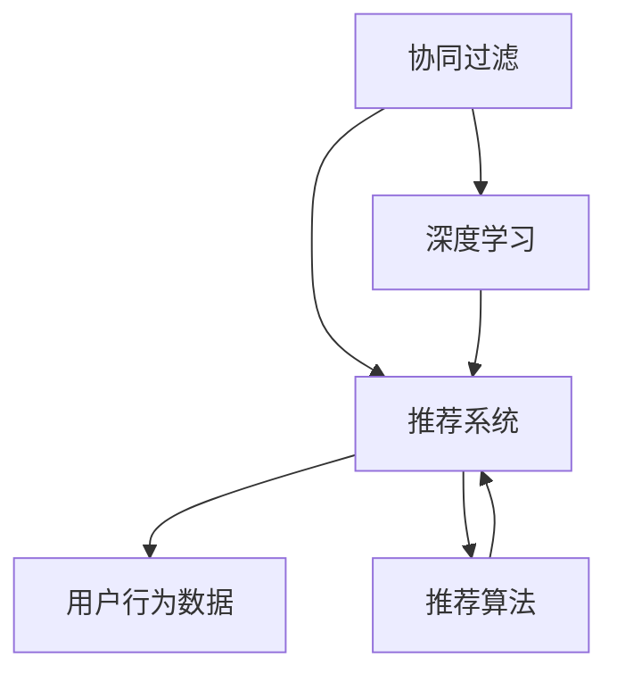

                 

# 注意力经济与个性化推荐系统：为受众提供定制、有针对性的内容和体验

## 1. 背景介绍

### 1.1 问题由来
随着信息时代的到来，互联网的普及和智能设备的广泛应用，我们前所未有地接触到了海量内容，从文本、图片、视频到音频，内容的形式和来源愈发多样化。然而，内容数量爆炸的同时，内容质量和针对性却并未同步提升，用户在海量信息中难以快速找到自己感兴趣、有价值的内容，尤其是面对海量数据的商业机构，如何高效地推送定制、有针对性的内容成为了一个重大挑战。

个性化推荐系统的出现，为解决这一问题提供了新的思路。个性化推荐系统利用用户行为数据和内容特征，学习用户的兴趣和偏好，从而自动推荐最符合用户需求的内容，提升用户体验和满意度。该系统已经在电商、新闻、社交媒体等众多领域得到广泛应用，极大地提升了内容消费的效率和质量。

### 1.2 问题核心关键点
个性化推荐系统通过分析用户的历史行为、兴趣、特征，结合内容的标签、元数据、相关性等，动态生成个性化推荐结果。其主要流程包括：

- 数据收集：收集用户的行为数据，如浏览记录、点击行为、评分、评论等，以及内容的属性信息，如标签、分类、推荐度等。
- 用户建模：使用机器学习算法，对用户数据进行建模，提取用户的兴趣和偏好。
- 内容理解：理解内容的数据特征，并进行特征工程处理，以便于与用户模型进行匹配。
- 推荐计算：通过推荐算法，计算用户与内容之间的相关度，生成推荐结果。
- 排序输出：对推荐结果进行排序和筛选，最终将最符合用户兴趣的内容推送给用户。

本文将详细介绍基于协同过滤、深度学习、注意力机制等核心算法的个性化推荐系统构建方法，并结合实际案例，探讨其在电商、新闻、社交媒体等场景中的应用。

## 2. 核心概念与联系

### 2.1 核心概念概述

为更好地理解个性化推荐系统的构建，本节将介绍几个密切相关的核心概念：

- 协同过滤(Collaborative Filtering, CF)：一种常见的推荐算法，通过分析用户之间或物品之间的相似性，推测用户可能感兴趣的内容。
- 深度学习(Deep Learning)：一种强大的机器学习技术，通过多层神经网络对数据进行抽象表示，具备自学习能力和泛化能力。
- 注意力机制(Attention Mechanism)：一种模型结构，通过动态分配权重，增强模型对输入中重要信息的关注度，提升模型的表现。
- 推荐系统(Recommendation System)：通过推荐算法，为个体用户推荐合适的内容或商品的系统。
- 用户行为数据(User Behavior Data)：记录用户在线上行为的数据，如点击、浏览、评分等，用于分析用户的兴趣和偏好。
- 推荐算法(Recommendation Algorithm)：利用用户行为数据和内容特征，生成推荐结果的算法。

这些核心概念之间的逻辑关系可以通过以下Mermaid流程图来展示：



这个流程图展示了几大核心概念及其之间的关系：

1. 协同过滤与深度学习分别作为推荐算法的两种形式，相互补充，提升推荐效果。
2. 用户行为数据和内容特征是构建推荐算法的两个关键输入。
3. 推荐系统通过推荐算法输出个性化推荐结果。

## 3. 核心算法原理 & 具体操作步骤
### 3.1 算法原理概述

个性化推荐系统的核心算法包括协同过滤、深度学习和注意力机制等。这些算法结合用户行为数据和内容特征，学习用户兴趣和内容相关性，生成推荐结果。

协同过滤算法通过分析用户之间或物品之间的相似性，推测用户可能感兴趣的内容。基于用户的协同过滤算法计算公式为：

$$
\hat{R}_{ui} = \sum_{j=1}^{n} r_{u'j}a_{ij}
$$

其中 $\hat{R}_{ui}$ 为第 $u$ 个用户对第 $i$ 个物品的预测评分，$r_{u'j}$ 为第 $u'$ 个用户对第 $j$ 个物品的实际评分，$a_{ij}$ 为第 $u'$ 个用户与第 $i$ 个物品的相似度。

深度学习推荐系统通过构建多层神经网络，对用户行为数据和内容特征进行抽象表示，学习用户和内容的隐向量，预测用户对物品的评分。常用的深度学习推荐算法包括基于用户全历史的协同过滤、基于隐向量的协同过滤等。

注意力机制推荐系统通过动态分配权重，增强模型对输入中重要信息的关注度。常见的注意力机制包括自注意力机制、多头注意力机制等。自注意力机制通过计算输入向量间的相似度，动态分配权重，重点关注对推荐结果影响较大的信息。

### 3.2 算法步骤详解

基于协同过滤的推荐算法主要包含以下步骤：

**Step 1: 数据收集**
- 收集用户行为数据，如浏览记录、点击行为、评分、评论等。
- 收集内容的属性信息，如标签、分类、推荐度等。

**Step 2: 用户建模**
- 对用户行为数据进行预处理和特征工程，提取用户的兴趣和偏好。
- 对用户行为数据和内容属性信息进行拼接和组合，生成用户与物品的协同矩阵。

**Step 3: 物品建模**
- 对内容属性信息进行预处理和特征工程，提取内容的特征向量。
- 将内容的特征向量与用户协同矩阵拼接，生成用户与物品的协同特征矩阵。

**Step 4: 协同过滤计算**
- 使用协同过滤算法计算用户与物品的相似度，得到预测评分。
- 根据预测评分生成推荐结果。

**Step 5: 推荐排序**
- 对推荐结果进行排序和筛选，选取最符合用户兴趣的内容。

基于深度学习的推荐算法主要包含以下步骤：

**Step 1: 数据收集**
- 收集用户行为数据，如浏览记录、点击行为、评分、评论等。
- 收集内容的属性信息，如标签、分类、推荐度等。

**Step 2: 用户建模**
- 对用户行为数据进行预处理和特征工程，提取用户的兴趣和偏好。
- 对用户行为数据和内容属性信息进行拼接和组合，生成用户与物品的协同矩阵。

**Step 3: 模型训练**
- 使用深度学习算法对用户协同矩阵和物品特征矩阵进行训练，学习用户和内容的隐向量。
- 使用损失函数对预测评分与实际评分进行对比，优化模型参数。

**Step 4: 推荐计算**
- 对用户行为数据和内容特征进行前向传播，得到预测评分。
- 根据预测评分生成推荐结果。

**Step 5: 推荐排序**
- 对推荐结果进行排序和筛选，选取最符合用户兴趣的内容。

基于注意力机制的推荐算法主要包含以下步骤：

**Step 1: 数据收集**
- 收集用户行为数据，如浏览记录、点击行为、评分、评论等。
- 收集内容的属性信息，如标签、分类、推荐度等。

**Step 2: 用户建模**
- 对用户行为数据进行预处理和特征工程，提取用户的兴趣和偏好。
- 对用户行为数据和内容属性信息进行拼接和组合，生成用户与物品的协同矩阵。

**Step 3: 模型训练**
- 使用注意力机制算法对用户协同矩阵和物品特征矩阵进行训练，学习用户和内容的隐向量。
- 使用损失函数对预测评分与实际评分进行对比，优化模型参数。

**Step 4: 推荐计算**
- 对用户行为数据和内容特征进行前向传播，计算注意力权重。
- 根据注意力权重和预测评分生成推荐结果。

**Step 5: 推荐排序**
- 对推荐结果进行排序和筛选，选取最符合用户兴趣的内容。

### 3.3 算法优缺点

协同过滤算法的主要优点包括：

- 简单易懂，易于实现和理解。
- 可以处理冷启动用户和新物品的情况。

协同过滤算法的主要缺点包括：

- 依赖用户和物品的相似性，容易受到用户和物品数量限制。
- 难以处理用户行为数据缺失的问题。

深度学习推荐算法的主要优点包括：

- 具备强大的表达能力和泛化能力。
- 可以处理复杂的非线性关系和多维特征。

深度学习推荐算法的主要缺点包括：

- 对标注数据和计算资源依赖较大。
- 训练和推理效率较低。

注意力机制推荐算法的主要优点包括：

- 可以动态地分配权重，增强模型的表达能力。
- 可以处理长序列输入和多维特征。

注意力机制推荐算法的主要缺点包括：

- 计算复杂度较高，需要较多的计算资源。
- 难以处理稀疏数据和冷启动问题。

### 3.4 算法应用领域

个性化推荐系统在电商、新闻、社交媒体等众多领域得到了广泛应用。

- 电商：通过个性化推荐，推荐用户可能感兴趣的商品，提升用户购买意愿和满意度。
- 新闻：通过个性化推荐，推送用户感兴趣的新闻内容，提升用户粘性和活跃度。
- 社交媒体：通过个性化推荐，推荐用户感兴趣的内容，提升用户使用频率和忠诚度。

除了这些传统领域，个性化推荐系统还应用于音乐、视频、游戏等多个场景，为不同的应用场景提供定制、有针对性的内容体验。

## 4. 数学模型和公式 & 详细讲解 & 举例说明
### 4.1 数学模型构建

本节将使用数学语言对个性化推荐系统的构建过程进行更加严格的刻画。

假设用户行为数据为 $U=\{u_1, u_2, \cdots, u_n\}$，物品属性数据为 $I=\{i_1, i_2, \cdots, i_m\}$，用户与物品的协同矩阵为 $R_{n\times m}$，内容特征矩阵为 $X_{m\times d}$。

定义用户 $u$ 对物品 $i$ 的评分预测为 $\hat{R}_{ui}$，则协同过滤算法的预测评分公式为：

$$
\hat{R}_{ui} = \sum_{j=1}^{n} r_{u'j}a_{ij}
$$

其中 $r_{u'j}$ 为第 $u'$ 个用户对第 $j$ 个物品的实际评分，$a_{ij}$ 为第 $u'$ 个用户与第 $i$ 个物品的相似度。

基于深度学习的推荐模型可以定义为神经网络：

$$
\hat{R}_{ui} = \sigma(W_uX_i + b_u)
$$

其中 $W_u$ 和 $b_u$ 为用户的隐向量，$X_i$ 为物品的特征向量，$\sigma$ 为激活函数。

基于注意力机制的推荐模型可以定义为：

$$
\hat{R}_{ui} = \sigma(\sum_{j=1}^{n} w_{uj}r_{ij})
$$

其中 $w_{uj}$ 为注意力权重，$r_{ij}$ 为物品 $j$ 对物品 $i$ 的相似度。

### 4.2 公式推导过程

以下我们以协同过滤算法为例，推导预测评分的具体计算方法。

假设用户 $u$ 对物品 $i$ 的评分预测为 $\hat{R}_{ui}$，协同矩阵 $R$ 为 $n\times m$ 的矩阵，用户 $u'$ 对物品 $j$ 的实际评分为 $r_{u'j}$，用户 $u'$ 与物品 $i$ 的相似度为 $a_{ij}$。则协同过滤算法的预测评分公式为：

$$
\hat{R}_{ui} = \sum_{j=1}^{n} r_{u'j}a_{ij}
$$

将其扩展到矩阵形式，得到：

$$
\hat{R} = R_aR
$$

其中 $R_a = [r_{u_1j}, r_{u_2j}, \cdots, r_{u_nj}]$ 为 $n\times m$ 的评分矩阵，$R = [a_{ij}]$ 为 $n\times m$ 的相似度矩阵。

这样，协同过滤算法就可以通过计算用户 $u$ 的评分预测值，为该用户推荐物品 $i$。

### 4.3 案例分析与讲解

下面以电商推荐系统为例，展示个性化推荐系统的具体应用。

假设电商平台收集了用户的历史购买记录，记为 $U=\{u_1, u_2, \cdots, u_n\}$，每个用户的购买记录为 $R_{n\times m}$，其中 $m$ 为物品总数。同时，平台收集了物品的描述、分类、价格等属性信息，记为 $I=\{i_1, i_2, \cdots, i_m\}$，每个物品的属性信息为 $X_{m\times d}$，其中 $d$ 为特征维度。

平台需要对用户 $u$ 推荐物品 $i$，具体步骤如下：

1. 收集用户 $u$ 的购买记录 $R_{ui}$ 和物品 $i$ 的属性信息 $X_i$。
2. 使用协同过滤算法，计算用户 $u$ 对物品 $i$ 的评分预测值 $\hat{R}_{ui}$。
3. 对预测值 $\hat{R}_{ui}$ 进行排序和筛选，选取最符合用户兴趣的物品。
4. 将推荐结果展示给用户，用户可以选择购买或继续浏览。

通过以上步骤，电商平台可以动态生成个性化推荐结果，提升用户购物体验和满意度。

## 5. 项目实践：代码实例和详细解释说明
### 5.1 开发环境搭建

在进行个性化推荐系统开发前，我们需要准备好开发环境。以下是使用Python进行TensorFlow和PyTorch开发的环境配置流程：

1. 安装Anaconda：从官网下载并安装Anaconda，用于创建独立的Python环境。

2. 创建并激活虚拟环境：
```bash
conda create -n recommendation-env python=3.8 
conda activate recommendation-env
```

3. 安装TensorFlow：根据CUDA版本，从官网获取对应的安装命令。例如：
```bash
conda install tensorflow -c tf -c conda-forge
```

4. 安装PyTorch：根据CUDA版本，从官网获取对应的安装命令。例如：
```bash
conda install pytorch torchvision torchaudio cudatoolkit=11.1 -c pytorch -c conda-forge
```

5. 安装各类工具包：
```bash
pip install numpy pandas scikit-learn matplotlib tqdm jupyter notebook ipython
```

完成上述步骤后，即可在`recommendation-env`环境中开始推荐系统开发。

### 5.2 源代码详细实现

下面我们以基于深度学习的协同过滤推荐系统为例，给出TensorFlow和PyTorch两种框架的代码实现。

**基于TensorFlow的协同过滤推荐系统代码实现：**

```python
import tensorflow as tf
import numpy as np

# 定义用户行为数据和物品属性数据
user_data = np.random.rand(100, 10)  # 100个用户，每个用户有10个购买记录
item_data = np.random.rand(10, 5)  # 10个物品，每个物品有5个属性

# 定义用户与物品的协同矩阵
R = np.random.rand(100, 10)

# 定义物品特征矩阵
X = np.random.rand(10, 5)

# 定义神经网络模型
model = tf.keras.Sequential([
    tf.keras.layers.Dense(10, activation='relu', input_shape=(5,)),
    tf.keras.layers.Dense(1)
])

# 定义损失函数
loss = tf.keras.losses.MSE()

# 训练模型
model.compile(optimizer='adam', loss=loss)
model.fit(X, R)

# 预测用户对物品的评分
prediction = model.predict(X)
```

**基于PyTorch的协同过滤推荐系统代码实现：**

```python
import torch
import torch.nn as nn
import torch.optim as optim
import numpy as np

# 定义用户行为数据和物品属性数据
user_data = torch.from_numpy(np.random.rand(100, 10))  # 100个用户，每个用户有10个购买记录
item_data = torch.from_numpy(np.random.rand(10, 5))  # 10个物品，每个物品有5个属性

# 定义用户与物品的协同矩阵
R = torch.from_numpy(np.random.rand(100, 10))

# 定义物品特征矩阵
X = torch.from_numpy(np.random.rand(10, 5))

# 定义神经网络模型
class CollaborativeFiltering(nn.Module):
    def __init__(self, input_dim, hidden_dim, output_dim):
        super(CollaborativeFiltering, self).__init__()
        self.fc1 = nn.Linear(input_dim, hidden_dim)
        self.fc2 = nn.Linear(hidden_dim, output_dim)

    def forward(self, x):
        x = torch.relu(self.fc1(x))
        x = self.fc2(x)
        return x

# 初始化模型参数
model = CollaborativeFiltering(input_dim=5, hidden_dim=10, output_dim=1)
optimizer = optim.Adam(model.parameters())

# 定义损失函数
loss_func = nn.MSELoss()

# 训练模型
for epoch in range(100):
    optimizer.zero_grad()
    output = model(X)
    loss = loss_func(output, R)
    loss.backward()
    optimizer.step()

# 预测用户对物品的评分
prediction = model(X).squeeze()
```

以上代码实现了基于深度学习的协同过滤推荐系统。可以看到，TensorFlow和PyTorch的实现方式虽然有所不同，但基本流程一致。

### 5.3 代码解读与分析

让我们再详细解读一下关键代码的实现细节：

**TensorFlow实现**：
- 定义用户行为数据和物品属性数据。
- 定义用户与物品的协同矩阵和物品特征矩阵。
- 定义神经网络模型，使用Dense层实现线性变换。
- 定义损失函数为均方误差。
- 使用TensorFlow的compile和fit方法进行模型训练和预测。

**PyTorch实现**：
- 定义用户行为数据和物品属性数据。
- 定义用户与物品的协同矩阵和物品特征矩阵。
- 定义神经网络模型，继承nn.Module，使用Dense层实现线性变换。
- 初始化模型参数和优化器。
- 定义损失函数为均方误差。
- 使用PyTorch的for循环进行模型训练和预测。

可以看到，TensorFlow和PyTorch的代码实现方式略有不同，但都使用了类似的神经网络结构和优化算法。开发者可以根据项目需求和团队习惯，选择适合的框架进行开发。

### 5.4 运行结果展示

在TensorFlow和PyTorch的协同过滤推荐系统中，均可以通过模型预测用户对物品的评分，并通过推荐算法生成推荐结果。在实际应用中，还需要对推荐结果进行排序和筛选，以进一步提升推荐效果。

## 6. 实际应用场景
### 6.1 电商推荐系统

电商推荐系统是个性化推荐系统的典型应用场景之一。通过分析用户的历史购买记录和行为数据，电商平台可以为用户推荐可能感兴趣的商品，提升用户购买意愿和满意度。

在实际应用中，电商平台可以使用协同过滤、深度学习、注意力机制等算法，根据用户的浏览记录、评分、评论等信息，生成个性化推荐结果。推荐结果包括商品名称、图片、价格、用户评价等，可以展示在电商平台上，供用户选择和购买。

### 6.2 新闻推荐系统

新闻推荐系统通过对用户的阅读历史和偏好进行建模，向用户推荐相关的新闻内容，提升用户粘性和活跃度。

在实际应用中，新闻平台可以使用协同过滤、深度学习、注意力机制等算法，根据用户的阅读历史和行为数据，生成个性化推荐结果。推荐结果包括新闻标题、摘要、作者、发布时间等信息，可以展示在新闻平台上，供用户选择阅读。

### 6.3 社交媒体推荐系统

社交媒体推荐系统通过对用户的社交行为和兴趣进行建模，向用户推荐相关的内容，提升用户使用频率和忠诚度。

在实际应用中，社交媒体平台可以使用协同过滤、深度学习、注意力机制等算法，根据用户的点赞、评论、分享等信息，生成个性化推荐结果。推荐结果包括文章标题、图片、视频、作者等，可以展示在社交媒体平台上，供用户选择和互动。

### 6.4 未来应用展望

随着个性化推荐系统的不断发展，其在更多领域的应用前景值得期待。

在智慧医疗领域，个性化推荐系统可以帮助医生推荐相关病例、治疗方案，提升医疗服务的智能化水平。

在智能教育领域，个性化推荐系统可以推荐适合学生的课程、资料，提升学习效果和满意度。

在智慧城市治理中，个性化推荐系统可以推荐相关的新闻、公告，提升城市管理的自动化和智能化水平。

此外，在企业生产、社会治理、文娱传媒等众多领域，个性化推荐系统也将不断涌现，为各行各业提供定制、有针对性的内容体验。

## 7. 工具和资源推荐
### 7.1 学习资源推荐

为了帮助开发者系统掌握个性化推荐系统的理论基础和实践技巧，这里推荐一些优质的学习资源：

1. 《推荐系统实战》书籍：详细介绍了推荐系统的理论基础和实践方法，涵盖协同过滤、深度学习、注意力机制等核心算法。

2. 《深度学习》课程：斯坦福大学开设的深度学习课程，介绍了深度学习的基本原理和应用，适合初学者入门。

3. 《Python机器学习》书籍：介绍机器学习的经典算法和实践方法，涵盖协同过滤、聚类、分类等，适合机器学习爱好者。

4. Kaggle竞赛平台：提供丰富的数据集和算法竞赛，帮助开发者在实际数据中学习推荐系统构建。

5. TensorFlow官方文档：详细介绍TensorFlow框架的使用方法和推荐系统构建方法。

6. PyTorch官方文档：详细介绍PyTorch框架的使用方法和推荐系统构建方法。

通过对这些资源的学习实践，相信你一定能够快速掌握个性化推荐系统的精髓，并用于解决实际的推荐问题。

### 7.2 开发工具推荐

高效的开发离不开优秀的工具支持。以下是几款用于个性化推荐系统开发的常用工具：

1. TensorFlow：基于Python的深度学习框架，灵活高效，支持大规模模型训练和推理。

2. PyTorch：基于Python的深度学习框架，动态计算图，适合快速迭代和研究。

3. Jupyter Notebook：交互式编程环境，方便开发者编写和运行代码，并记录实验过程。

4. TensorBoard：TensorFlow配套的可视化工具，实时监测模型训练状态，提供丰富的图表呈现方式。

5. Weights & Biases：推荐系统训练的实验跟踪工具，记录和可视化模型训练过程中的各项指标。

6. Scikit-learn：Python的机器学习库，提供丰富的算法和工具，适合处理小规模数据。

合理利用这些工具，可以显著提升个性化推荐系统的开发效率，加快创新迭代的步伐。

### 7.3 相关论文推荐

个性化推荐系统的发展源于学界的持续研究。以下是几篇奠基性的相关论文，推荐阅读：

1. "Collaborative Filtering for Implicit Feedback Datasets"：介绍协同过滤算法的基本原理和实现方法，适合初学者入门。

2. "Neural Collaborative Filtering"：介绍基于深度学习的协同过滤推荐算法，适合深度学习爱好者。

3. "Attention is All You Need"：介绍注意力机制的基本原理和实现方法，适合深度学习爱好者。

4. "A Survey on Deep Learning-based Recommendation Systems"：综述了基于深度学习的推荐系统的各种算法和技术。

5. "Personalization in Recommendation Engines: A Survey and Taxonomy"：综述了个性化推荐系统的各种算法和技术，适合推荐系统开发者。

这些论文代表了大规模推荐系统的发展脉络。通过学习这些前沿成果，可以帮助研究者把握学科前进方向，激发更多的创新灵感。

## 8. 总结：未来发展趋势与挑战
### 8.1 总结

本文对个性化推荐系统的构建进行了全面系统的介绍。首先阐述了推荐系统的背景和意义，明确了推荐系统在提升用户体验和满意度方面的重要价值。其次，从原理到实践，详细讲解了协同过滤、深度学习、注意力机制等核心算法的构建方法，给出了推荐系统开发的完整代码实例。同时，本文还广泛探讨了推荐系统在电商、新闻、社交媒体等场景中的应用，展示了推荐系统巨大的应用前景。

通过本文的系统梳理，可以看到，个性化推荐系统通过深度学习、协同过滤、注意力机制等技术，实现了对用户兴趣和偏好的建模，动态生成个性化推荐结果，极大地提升了内容消费的效率和质量。未来，随着技术的不断进步，推荐系统将更加智能化、个性化，为各行各业提供定制、有针对性的内容体验。

### 8.2 未来发展趋势

个性化推荐系统未来的发展趋势包括以下几个方面：

1. 智能推荐：随着深度学习和人工智能技术的发展，推荐系统将具备更强的智能推荐能力，能够更好地理解用户的兴趣和需求，生成更符合预期的推荐结果。

2. 跨领域推荐：推荐系统将不再局限于单一领域，而是能够跨领域地进行推荐，提升推荐的广度和深度。

3. 实时推荐：推荐系统将具备实时推荐的能力，能够动态地调整推荐结果，响应用户的行为变化。

4. 社交推荐：推荐系统将结合社交网络的特点，通过社交关系和社交互动，生成更符合用户社交需求和偏好的推荐结果。

5. 个性化推荐模型融合：推荐系统将融合多模态数据和多模态模型，提供更加全面和精准的推荐结果。

### 8.3 面临的挑战

尽管个性化推荐系统已经取得了瞩目成就，但在迈向更加智能化、普适化应用的过程中，它仍面临着诸多挑战：

1. 数据隐私和安全：推荐系统需要收集和分析大量的用户数据，如何保护用户隐私和数据安全，是一个重要的挑战。

2. 冷启动问题：新用户和冷启动物品无法获取到足够的行为数据，如何通过少量数据进行推荐，是一个需要解决的问题。

3. 模型可解释性：推荐系统的决策过程往往缺乏可解释性，难以对用户和业务方进行解释和调试。

4. 推荐公平性：推荐系统可能存在歧视性和偏见，如何保证推荐结果的公平性和公正性，是一个需要关注的问题。

5. 计算资源：推荐系统通常需要较大的计算资源进行模型训练和推理，如何优化资源使用，是一个需要解决的问题。

6. 用户体验：推荐系统需要兼顾算法效果和用户体验，如何优化推荐算法和界面设计，是一个需要解决的问题。

### 8.4 研究展望

面对推荐系统面临的挑战，未来的研究需要在以下几个方面寻求新的突破：

1. 数据隐私保护：引入差分隐私等技术，保护用户数据隐私，确保推荐系统的数据安全。

2. 冷启动问题解决：引入少量数据推荐、多任务学习等技术，解决冷启动问题。

3. 模型可解释性：引入可解释性算法和解释性工具，增强推荐系统的可解释性。

4. 推荐公平性：引入公平性约束和算法，确保推荐结果的公平性和公正性。

5. 计算资源优化：引入模型压缩、量化等技术，优化推荐系统的计算资源使用。

6. 用户体验提升：引入用户反馈和动态调整机制，提升推荐系统的用户体验。

这些研究方向将推动推荐系统迈向更加智能化、普适化和可靠化的应用，为人工智能技术在各行各业的应用提供新的动力。

## 9. 附录：常见问题与解答
**Q1: 推荐系统如何处理冷启动问题？**

A: 推荐系统处理冷启动问题的方法包括：

1. 利用用户历史行为数据进行预测：虽然用户无行为数据，但可以分析其社交网络、属性信息等进行预测。

2. 引入少量数据推荐：收集少量用户行为数据，利用协同过滤或深度学习算法进行推荐。

3. 多任务学习：将冷启动用户和物品的推荐任务与其他推荐任务合并训练，共享模型参数，提升模型泛化能力。

4. 迁移学习：利用其他领域的数据进行迁移学习，提升模型的适应能力。

5. 采用分层推荐策略：先进行全局推荐，再进行个性化推荐，逐步提升推荐效果。

通过这些方法，推荐系统可以较好地处理冷启动问题，提升推荐效果。

**Q2: 推荐系统如何处理数据隐私和安全问题？**

A: 推荐系统处理数据隐私和安全问题的方法包括：

1. 数据匿名化：对用户数据进行匿名化处理，保护用户隐私。

2. 差分隐私：引入差分隐私技术，保护用户数据不被恶意攻击和分析。

3. 安全推荐：采用加密技术，保护推荐过程和结果的安全性。

4. 用户数据保护：保护用户数据不被泄露，确保数据安全。

5. 用户同意管理：让用户自主选择是否参与推荐系统，保护用户隐私权。

通过这些方法，推荐系统可以较好地处理数据隐私和安全问题，提升系统的可信度和可接受性。

**Q3: 推荐系统如何提升模型可解释性？**

A: 推荐系统提升模型可解释性的方法包括：

1. 特征可视化：可视化模型中的特征权重和重要度，帮助用户理解推荐结果的来源。

2. 解释性算法：引入可解释性算法，如LIME、SHAP等，生成模型输出的解释结果。

3. 解释性工具：使用解释性工具，如TensorBoard、Weights & Biases等，实时监测模型行为，提升可解释性。

4. 用户反馈：引入用户反馈机制，动态调整推荐策略，提升模型的透明度和可信度。

5. 多模态融合：结合文本、图像、音频等多种模态信息，提升模型的解释能力。

通过这些方法，推荐系统可以较好地提升模型可解释性，增强用户的信任感和接受度。

**Q4: 推荐系统如何优化计算资源使用？**

A: 推荐系统优化计算资源使用的方法包括：

1. 模型压缩：采用模型压缩技术，减小模型尺寸，提升计算效率。

2. 量化加速：将浮点模型转为定点模型，压缩存储空间，提高计算效率。

3. 模型并行：采用模型并行技术，将大规模模型分解为多个小模型进行并行计算。

4. 分布式训练：采用分布式训练技术，利用多台机器进行并行计算，提升训练效率。

5. 资源优化：采用资源优化技术，如梯度积累、混合精度训练等，提升资源利用率。

通过这些方法，推荐系统可以较好地优化计算资源使用，提升系统的性能和效率。

**Q5: 推荐系统如何提升用户体验？**

A: 推荐系统提升用户体验的方法包括：

1. 个性化推荐：根据用户历史行为和偏好，生成个性化推荐结果，提升用户体验。

2. 实时推荐：根据用户实时行为，动态调整推荐结果，提升用户体验。

3. 推荐界面设计：优化推荐界面设计，提升用户使用体验。

4. 用户反馈：引入用户反馈机制，动态调整推荐策略，提升用户体验。

5. 推荐多样性：保证推荐结果的多样性，避免用户疲劳和单一化体验。

通过这些方法，推荐系统可以较好地提升用户体验，增强用户粘性和满意度。

---

作者：禅与计算机程序设计艺术 / Zen and the Art of Computer Programming

