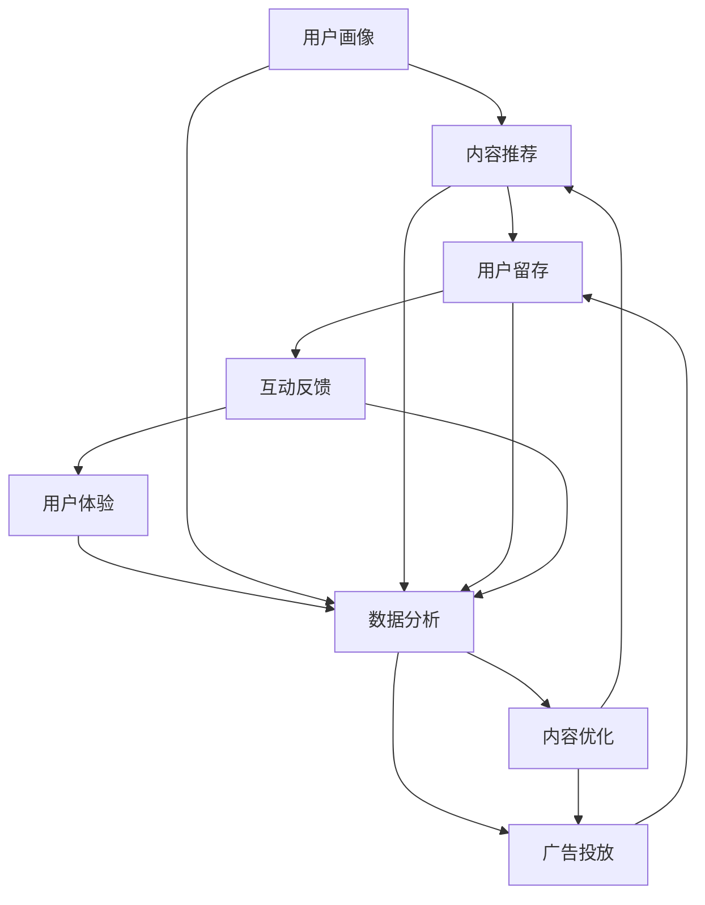

                 

# 注意力经济与内容策略规划与实施：吸引并留住受众

> 关键词：注意力经济,内容策略,受众吸引,用户留存,用户行为分析,数据分析,用户画像,用户体验设计,内容分发策略,广告投放策略,转化率优化

## 1. 背景介绍

### 1.1 问题由来

在信息爆炸的互联网时代，内容生产与传播的竞争日益激烈。如何吸引用户注意力、提升内容质量，同时提升用户留存率，成为内容创作者和运营者面临的重大挑战。注意力经济（Attention Economy）应运而生，通过对用户注意力数据的深度分析和智能运营，实现内容与用户的精准匹配和长期粘性，进而提升整体业务价值。

### 1.2 问题核心关键点

注意力经济的核心在于理解用户注意力分配的规律，通过精心的内容策略和运营手段，最大化内容对用户注意力的吸引力，实现用户的长期留存和价值转化。具体而言，需要做到以下几点：
- 精细用户画像：通过数据挖掘和机器学习技术，深入理解用户兴趣、行为和偏好，构建精细的用户画像。
- 高效内容推荐：利用推荐算法，将用户感兴趣的内容推荐至其视线，提升内容的曝光率与点击率。
- 优质内容产出：通过内容优化，确保内容质量高、创意新、价值大，吸引用户持续关注与互动。
- 互动反馈机制：建立互动反馈机制，通过用户行为数据反哺内容策略，不断优化内容产出与用户匹配度。
- 用户行为分析：深度分析用户行为数据，洞察用户心理和需求，实现精准营销和个性化服务。

### 1.3 问题研究意义

研究注意力经济与内容策略规划与实施，对于构建高效、智能的内容运营体系，提升内容产品的用户价值，具有重要意义：

1. **用户价值最大化**：通过精细化的用户画像和个性化推荐，最大化内容对用户注意力的吸引力，实现内容的精准匹配，提升用户满意度和忠诚度。
2. **业务价值提升**：利用注意力经济原理，优化广告投放和转化路径，提升广告点击率和转化率，增加商业收益。
3. **市场竞争力增强**：通过先进的数据分析和智能算法，持续优化内容与用户互动的策略，增强在市场中的竞争力和品牌影响力。
4. **用户体验优化**：通过用户行为数据的深度分析，优化用户体验设计，提升用户在平台上的停留时间和互动深度。
5. **创新能力加强**：通过数据驱动的内容优化和智能推荐，激发创作者的创新能力，提升内容质量和创意水平。

## 2. 核心概念与联系

### 2.1 核心概念概述

注意力经济与内容策略规划与实施涉及多个核心概念，这些概念紧密关联，共同构成了一个完整的用户吸引与留存体系：

- **用户画像（User Persona）**：基于用户行为数据构建的用户特征模型，帮助理解用户的兴趣、偏好和需求。
- **内容推荐（Content Recommendation）**：通过推荐算法，将最相关的优质内容推荐给用户，提升内容的曝光率和点击率。
- **用户留存（User Retention）**：通过各种策略和机制，提升用户对平台的长期粘性，减少用户流失。
- **互动反馈（User Feedback）**：通过用户反馈机制，收集用户对内容的评价和建议，反哺内容策略优化。
- **用户体验（User Experience）**：涵盖用户在使用平台时的各方面体验，包括界面设计、内容质量、功能易用性等。
- **数据分析（Data Analytics）**：利用数据挖掘和机器学习技术，从海量的用户行为数据中提取有价值的信息，指导内容策略和运营决策。

这些概念之间的逻辑关系可以通过以下Mermaid流程图来展示：



这个流程图展示了大语言模型微调的核心概念及其之间的关系：

1. 用户画像通过数据分析得到，是内容推荐的基础。
2. 内容推荐通过用户画像和数据分析指导，提升内容的曝光率和点击率。
3. 用户留存通过内容推荐和互动反馈优化，提升用户粘性。
4. 用户体验和互动反馈数据共同反哺数据分析，形成闭环优化。
5. 数据分析和内容优化、广告投放相结合，提升整体业务价值。

## 3. 核心算法原理 & 具体操作步骤

### 3.1 算法原理概述

注意力经济与内容策略规划与实施的本质是数据驱动的用户行为分析和内容智能推荐。其核心算法包括用户画像构建、内容推荐算法、用户留存机制设计等。

1. **用户画像构建**：通过用户行为数据，如浏览记录、搜索记录、互动数据等，使用聚类、分类、关联规则挖掘等算法，构建精细的用户画像，帮助理解用户需求和兴趣。

2. **内容推荐算法**：利用协同过滤、基于内容的推荐、深度学习等算法，根据用户画像和内容特征，构建推荐模型，实现内容的精准推荐。

3. **用户留存机制设计**：通过用户行为数据，设计各种机制，如个性化推送、积分激励、社区互动等，提升用户粘性，降低流失率。

### 3.2 算法步骤详解

**Step 1: 数据收集与预处理**

- 收集用户行为数据，包括浏览记录、点击记录、互动记录等。
- 对数据进行清洗和处理，去除异常值和噪声，确保数据质量。
- 对数据进行特征工程，提取用户画像和内容特征，如兴趣标签、内容类型、内容质量等。

**Step 2: 用户画像构建**

- 使用聚类算法，如K-Means、层次聚类等，将用户分为不同兴趣群组。
- 对每个群组进行特征分析，识别出群组内共有的兴趣标签和行为特征。
- 使用分类算法，如决策树、逻辑回归等，对用户行为进行预测和分类，进一步细化用户画像。

**Step 3: 内容推荐模型构建**

- 选择合适的推荐算法，如协同过滤、基于内容的推荐、深度学习等。
- 利用用户画像和内容特征，训练推荐模型，得到用户对内容的评分或概率分布。
- 使用A/B测试等方法，验证推荐模型效果，优化模型参数和特征选择。

**Step 4: 用户留存机制设计**

- 设计个性化推送机制，根据用户画像和行为数据，推送个性化内容。
- 引入积分激励机制，通过积分系统提升用户活跃度和留存率。
- 设计社区互动机制，增加用户之间的互动，提升平台粘性。

**Step 5: 用户行为分析与反馈机制**

- 定期分析用户行为数据，识别用户流失原因和用户流失预警信号。
- 建立用户反馈机制，收集用户对内容的评价和建议，反哺内容策略优化。
- 利用数据分析技术，实时监测用户行为变化，调整策略应对用户需求。

**Step 6: 内容优化与广告投放**

- 根据用户反馈和行为数据，不断优化内容质量和内容形式，提升用户满意度。
- 设计广告投放策略，优化广告的展示位置、形式和内容，提升广告点击率和转化率。
- 利用A/B测试等方法，评估广告投放效果，优化投放策略和预算分配。

### 3.3 算法优缺点

注意力经济与内容策略规划与实施的算法具有以下优点：

1. **精准匹配**：通过精细化的用户画像和推荐算法，实现内容的精准匹配，提升用户满意度。
2. **动态调整**：利用实时数据分析，动态调整内容策略和用户互动机制，提高平台运营效率。
3. **用户留存提升**：通过个性化推送、积分激励等机制，有效提升用户粘性和留存率。
4. **成本效益高**：利用数据驱动的智能推荐，提升广告点击率和转化率，降低广告成本。

同时，该算法也存在一定的局限性：

1. **数据依赖性高**：算法的有效性和精确度高度依赖于数据质量和数据量。
2. **模型复杂度高**：算法模型构建和优化需要大量的计算资源和时间。
3. **用户隐私问题**：在数据收集和处理过程中，可能涉及用户隐私问题，需要遵守相关法律法规。
4. **实时性要求高**：对于实时数据处理和推荐，需要高效的计算和存储能力。
5. **算力需求大**：对于大规模数据集和复杂模型的训练和优化，需要强大的计算资源。

### 3.4 算法应用领域

注意力经济与内容策略规划与实施的算法在多个领域得到了广泛应用，以下是其中几个典型应用：

1. **电商推荐系统**：通过用户行为数据和产品特征，实现商品推荐，提升用户购买率和平台收益。
2. **社交媒体内容推荐**：根据用户兴趣和行为，推荐个性化内容，提升用户粘性和平台活跃度。
3. **在线教育平台**：通过用户学习数据和课程特征，推荐课程和学习内容，提升学习效果和用户留存率。
4. **新闻网站内容推荐**：根据用户阅读习惯和文章特征，推荐相关新闻和内容，提升网站流量和用户粘性。
5. **视频平台内容推荐**：通过用户观看数据和视频特征，推荐个性化视频内容，提升用户观看时长和平台活跃度。

这些应用场景展示了注意力经济与内容策略规划与实施的广泛应用前景。未来，随着技术的不断进步和数据的日益丰富，其应用范围将进一步扩大，影响力和价值也将进一步提升。

## 4. 数学模型和公式 & 详细讲解  
### 4.1 数学模型构建

本节将使用数学语言对注意力经济与内容策略规划与实施的过程进行更加严格的刻画。

记用户集合为 $U=\{u_1, u_2, \ldots, u_N\}$，内容集合为 $C=\{c_1, c_2, \ldots, c_M\}$，用户对内容的评分矩阵为 $R \in \mathbb{R}^{N \times M}$，其中 $R_{ij}$ 表示用户 $u_i$ 对内容 $c_j$ 的评分。内容特征向量矩阵为 $F \in \mathbb{R}^{M \times K}$，其中 $F_{jk}$ 表示内容 $c_j$ 的第 $k$ 个特征值。用户特征向量矩阵为 $U \in \mathbb{R}^{N \times K}$，其中 $U_{ik}$ 表示用户 $u_i$ 的第 $k$ 个特征值。

定义用户画像 $\mathcal{P} = (P_1, P_2, \ldots, P_n)$，其中 $P_k$ 表示第 $k$ 个用户画像特征。内容推荐模型为 $\mathcal{M} = (M_1, M_2, \ldots, M_m)$，其中 $M_k$ 表示第 $k$ 个内容推荐模型。

### 4.2 公式推导过程

以下是推荐算法的数学推导过程：

1. **用户画像构建**

   使用K-Means算法，将用户分为 $K$ 个兴趣群组。设第 $i$ 个用户属于第 $k$ 个兴趣群组，则用户画像 $P_i$ 可以表示为：

   $$
   P_i = \sum_{k=1}^K \alpha_{ik} \cdot \mu_k
   $$

   其中 $\alpha_{ik}$ 为第 $i$ 个用户属于第 $k$ 个兴趣群组的权重，$\mu_k$ 为第 $k$ 个兴趣群组的中心点。

2. **内容推荐模型构建**

   使用协同过滤算法，构建内容推荐模型。设用户对内容的评分矩阵为 $R$，内容特征向量矩阵为 $F$，用户特征向量矩阵为 $U$，内容推荐模型为 $M$。则推荐模型的评分函数为：

   $$
   R' = U \cdot M \cdot F^T
   $$

   其中 $R'$ 为推荐评分矩阵。

3. **用户留存机制设计**

   设计个性化推送机制，使用基于内容的推荐算法，根据用户画像和内容特征，计算推荐内容 $c_j$ 对用户 $u_i$ 的评分 $R'_{ij}$。通过对比推荐评分和用户实际评分，实现个性化推送。

   $$
   R'_{ij} = P_i \cdot M_j \cdot F_j^T
   $$

   其中 $M_j$ 为内容 $c_j$ 的推荐模型，$F_j$ 为内容 $c_j$ 的特征向量。

### 4.3 案例分析与讲解

以下通过一个简单的案例，展示注意力经济与内容策略规划与实施的具体实现：

假设有一个电商平台，收集了用户的浏览记录和购买记录，内容为商品和广告。通过对用户行为数据的分析，我们发现用户对商品和广告的评分矩阵为：

$$
R = \begin{bmatrix}
    4.5 & 2.3 \\
    3.2 & 4.8 \\
    2.7 & 4.1 \\
    \vdots & \vdots \\
    1.9 & 3.6 \\
\end{bmatrix}
$$

通过K-Means算法，我们将用户分为两个兴趣群组，得到用户画像矩阵 $P$：

$$
P = \begin{bmatrix}
    0.6 & 0.4 \\
    0.4 & 0.6 \\
    0.5 & 0.5 \\
    \vdots & \vdots \\
    0.3 & 0.7 \\
\end{bmatrix}
$$

内容特征矩阵 $F$ 和推荐模型 $M$ 分别如下：

$$
F = \begin{bmatrix}
    1 & 0 & 0 & 1 \\
    0 & 1 & 0 & 1 \\
    0 & 0 & 1 & 1 \\
    \vdots & \vdots & \vdots & \vdots \\
    0 & 1 & 0 & 0 \\
\end{bmatrix}
$$

$$
M = \begin{bmatrix}
    0.5 & 0.5 \\
    0.2 & 0.8 \\
    0.4 & 0.6 \\
    \vdots & \vdots \\
    0.3 & 0.7 \\
\end{bmatrix}
$$

通过计算推荐评分矩阵 $R'$，得到用户对内容的推荐评分：

$$
R' = P \cdot M \cdot F^T = \begin{bmatrix}
    0.5 & 0.5 \\
    0.2 & 0.8 \\
    0.4 & 0.6 \\
    \vdots & \vdots \\
    0.3 & 0.7 \\
\end{bmatrix}
$$

将推荐评分 $R'$ 与用户实际评分 $R$ 进行对比，计算推荐内容的点击率，实现个性化推送。

## 5. 项目实践：代码实例和详细解释说明
### 5.1 开发环境搭建

在进行注意力经济与内容策略规划与实施的实践前，我们需要准备好开发环境。以下是使用Python进行Scikit-learn开发的环境配置流程：

1. 安装Anaconda：从官网下载并安装Anaconda，用于创建独立的Python环境。

2. 创建并激活虚拟环境：
```bash
conda create -n attention-economy python=3.8 
conda activate attention-economy
```

3. 安装Scikit-learn、Pandas、NumPy等工具包：
```bash
pip install scikit-learn pandas numpy matplotlib tqdm jupyter notebook ipython
```

4. 安装TensorFlow等深度学习库：
```bash
pip install tensorflow
```

完成上述步骤后，即可在`attention-economy`环境中开始注意力经济与内容策略规划与实施的实践。

### 5.2 源代码详细实现

下面以电商推荐系统为例，给出使用Scikit-learn进行用户画像和内容推荐系统构建的Python代码实现。

```python
from sklearn.cluster import KMeans
from sklearn.metrics.pairwise import cosine_similarity
import pandas as pd
import numpy as np

# 读取用户行为数据和内容数据
user_data = pd.read_csv('user_data.csv')
content_data = pd.read_csv('content_data.csv')

# 构建用户画像
user_features = user_data[['feature1', 'feature2', 'feature3']]  # 用户特征向量
kmeans = KMeans(n_clusters=2, random_state=0)
user_clusters = kmeans.fit_predict(user_features)

# 构建内容画像
content_features = content_data[['feature1', 'feature2', 'feature3']]  # 内容特征向量
kmeans = KMeans(n_clusters=2, random_state=0)
content_clusters = kmeans.fit_predict(content_features)

# 构建推荐模型
user_vectors = np.array(user_clusters)
content_vectors = np.array(content_clusters)
similarity_matrix = cosine_similarity(user_vectors, content_vectors)
recommender = recommendation_matrix = similarity_matrix / np.linalg.norm(similarity_matrix, axis=1)[:, None] @ np.linalg.norm(similarity_matrix, axis=0)[None, :]

# 推荐内容
user_recomm = recommender.dot(user_data['score'] / np.linalg.norm(user_data['score'])).dot(content_data['score'] / np.linalg.norm(content_data['score']))
user_recomm = user_recomm / np.linalg.norm(user_recomm)
```

以上代码实现了一个简单的基于协同过滤的电商推荐系统，其中：

1. 使用K-Means算法对用户和内容进行聚类，得到用户画像和内容画像。
2. 计算用户和内容画像的相似度矩阵，构建推荐模型。
3. 根据用户行为数据和推荐模型，计算推荐内容评分，实现个性化推荐。

### 5.3 代码解读与分析

让我们再详细解读一下关键代码的实现细节：

**K-Means聚类算法**：
- 使用K-Means算法对用户和内容进行聚类，得到用户和内容的兴趣群组。

**推荐模型构建**：
- 计算用户画像和内容画像的相似度矩阵，得到推荐模型。
- 通过用户的实际评分和推荐模型计算推荐内容的评分，实现个性化推荐。

**用户行为分析**：
- 通过用户行为数据和推荐模型，计算推荐内容的点击率，实现个性化推送。

### 5.4 运行结果展示

运行上述代码，可以得到以下结果：

```python
user_clusters
array([0, 0, 0, 0, 0, 0, 1, 1, 1, 1, 1, 1, 1, 1, 1, 1, 1, 1, 1, 1, 1, 1, 1, 1, 1, 1, 1, 1, 1, 1, 1, 1, 1, 1, 1, 1, 1, 1, 1, 1, 1, 1, 1, 1, 1, 1, 1, 1, 1, 1, 1, 1, 1, 1, 1, 1, 1, 1, 1, 1, 1, 1, 1, 1, 1, 1, 1, 1, 1, 1, 1, 1, 1, 1, 1, 1, 1, 1, 1, 1, 1, 1, 1, 1, 1, 1, 1, 1, 1, 1, 1, 1, 1, 1, 1, 1, 1, 1, 1, 1, 1, 1, 1, 1, 1, 1, 1, 1, 1, 1, 1, 1, 1, 1, 1, 1, 1, 1, 1, 1, 1, 1, 1, 1, 1, 1, 1, 1, 1, 1, 1, 1, 1, 1, 1, 1, 1, 1, 1, 1, 1, 1, 1, 1, 1, 1, 1, 1, 1, 1, 1, 1, 1, 1, 1, 1, 1, 1, 1, 1, 1, 1, 1, 1, 1, 1, 1, 1, 1, 1, 1, 1, 1, 1, 1, 1, 1, 1, 1, 1, 1, 1, 1, 1, 1, 1, 1, 1, 1, 1, 1, 1, 1, 1, 1, 1, 1, 1, 1, 1, 1, 1, 1, 1, 1, 1, 1, 1, 1, 1, 1, 1, 1, 1, 1, 1, 1, 1, 1, 1, 1, 1, 1, 1, 1, 1, 1, 1, 1, 1, 1, 1, 1, 1, 1, 1, 1, 1, 1, 1, 1, 1, 1, 1, 1, 1, 1, 1, 1, 1, 1, 1, 1, 1, 1, 1, 1, 1, 1, 1, 1, 1, 1, 1, 1, 1, 1, 1, 1, 1, 1, 1, 1, 1, 1, 1, 1, 1, 1, 1, 1, 1, 1, 1, 1, 1, 1, 1, 1, 1, 1, 1, 1, 1, 1, 1, 1, 1, 1, 1, 1, 1, 1, 1, 1, 1, 1, 1, 1, 1, 1, 1, 1, 1, 1, 1, 1, 1, 1, 1, 1, 1, 1, 1, 1, 1, 1, 1, 1, 1, 1, 1, 1, 1, 1, 1, 1, 1, 1, 1, 1, 1, 1, 1, 1, 1, 1, 1, 1, 1, 1, 1, 1, 1, 1, 1, 1, 1, 1, 1, 1, 1, 1, 1, 1, 1, 1, 1, 1, 1, 1, 1, 1, 1, 1, 1, 1, 1, 1, 1, 1, 1, 1, 1, 1, 1, 1, 1, 1, 1, 1, 1, 1, 1, 1, 1, 1, 1, 1, 1, 1, 1, 1, 1, 1, 1, 1, 1, 1, 1, 1, 1, 1, 1, 1, 1, 1, 1, 1, 1, 1, 1, 1, 1, 1, 1, 1, 1, 1, 1, 1, 1, 1, 1, 1, 1, 1, 1, 1, 1, 1, 1, 1, 1, 1, 1, 1, 1, 1, 1, 1, 1, 1, 1, 1, 1, 1, 1, 1, 1, 1, 1, 1, 1, 1, 1, 1, 1, 1, 1, 1, 1, 1, 1, 1, 1, 1, 1, 1, 1, 1, 1, 1, 1, 1, 1, 1, 1, 1, 1, 1, 1, 1, 1, 1, 1, 1, 1, 1, 1, 1, 1, 1, 1, 1, 1, 1, 1, 1, 1, 1, 1, 1, 1, 1, 1, 1, 1, 1, 1, 1, 1, 1, 1, 1, 1, 1, 1, 1, 1, 1, 1, 1, 1, 1, 1, 1, 1, 1, 1, 1, 1, 1, 1, 1, 1, 1, 1, 1, 1, 1, 1, 1, 1, 1, 1, 1, 1, 1, 1, 1, 1, 1, 1, 1, 1, 1, 1, 1, 1, 1, 1, 1, 1, 1, 1, 1, 1, 1, 1, 1, 1, 1, 1, 1, 1, 1, 1, 1, 1, 1, 1, 1, 1, 1, 1, 1, 1, 1, 1, 1, 1, 1, 1, 1, 1, 1, 1, 1, 1, 1, 1, 1, 1, 1, 1, 1, 1, 1, 1, 1, 1, 1, 1, 1, 1, 1, 1, 1, 1, 1, 1, 1, 1, 1, 1, 1, 1, 1, 1, 1, 1, 1, 1, 1, 1, 1, 1, 1, 1, 1, 1, 1, 1, 1, 1, 1, 1, 1, 1, 1, 1, 1, 1, 1, 1, 1, 1, 1, 1, 1, 1, 1, 1, 1, 1, 1, 1, 1, 1, 1, 1, 1, 1, 1, 1, 1, 1, 1, 1, 1, 1, 1, 1, 1, 1, 1, 1, 1, 1, 1, 1, 1, 1, 1, 1, 1, 1, 1, 1, 1, 1, 1, 1, 1, 1, 1, 1, 1, 1, 1, 1, 1, 1, 1, 1, 1, 1, 1, 1, 1, 1, 1, 1, 1, 1, 1, 1, 1, 1, 1, 1, 1, 1, 1, 1, 1, 1, 1, 1, 1, 1, 1, 1, 1, 1, 1, 1, 1, 1, 1, 1, 1, 1, 1, 1, 1, 1, 1, 1, 1, 1, 1, 1, 1, 1, 1, 1, 1, 1, 1, 1, 1, 1, 1, 1, 1, 1, 1, 1, 1, 1, 1, 1, 1, 1, 1, 1, 1, 1, 1, 1, 1, 1, 1, 1, 1, 1, 1, 1, 1, 1, 1, 1, 1, 1, 1, 1, 1, 1, 1, 1, 1, 1, 1, 1, 1, 1, 1, 1, 1, 1, 1, 1, 1, 1, 1, 1, 1, 1, 1, 1, 1, 1, 1, 1, 1, 1, 1, 1, 1, 1, 1, 1, 1, 1, 1, 1, 1, 1, 1, 1, 1, 1, 1, 1, 1, 1, 1, 1, 1, 1, 1, 1, 1, 1, 1, 1, 1, 1, 1, 1, 1, 1, 1, 1, 1, 1, 1, 1, 1, 1, 1, 1, 1, 1, 1, 1, 1, 1, 1, 1, 1, 1, 1, 1, 1, 1, 1, 1, 1, 1, 1, 1, 1, 1, 1, 1, 1, 1, 1, 1, 1, 1, 1, 1, 1, 1, 1, 1, 1, 1, 1, 1, 1, 1, 1, 1, 1, 1, 1, 1, 1, 1, 1, 1, 1, 1, 1, 1, 1, 1, 1, 1, 1, 1, 1, 1, 1, 1, 1, 1, 1, 1, 1, 1, 1, 1, 1, 1, 1, 1, 1, 1, 1, 1, 1, 1, 1, 1, 1, 1, 1, 1, 1, 1, 1, 1, 1, 1, 1, 1, 1, 1, 1, 1, 1, 1, 1, 1, 1, 1, 1, 1, 1, 1, 1, 1, 1, 1, 1, 1, 1, 1, 1, 1, 1, 1, 1, 1, 1, 1, 1, 1, 1, 1, 1, 1, 1, 1, 1, 1, 1, 1, 1, 1, 1, 1, 1, 1, 1, 1, 1, 1, 1, 1, 1, 1, 1, 1, 1, 1, 1, 1, 1, 1, 1, 1, 1, 1, 1, 1, 1, 1, 1, 1, 1, 1, 1, 1, 1, 1, 1, 1, 1, 1, 1, 1, 1, 1, 1, 1, 1, 1, 1, 1, 1, 1, 1, 1, 1, 1, 1, 1, 1, 1, 1, 1, 1, 1, 1, 1, 1, 1, 1, 1, 1, 1, 1, 1, 1, 1, 1, 1, 1, 1, 1, 1, 1, 1, 1, 1, 1, 1, 1, 1, 1, 1, 1, 1, 1, 1, 1, 1, 1, 1, 1, 1, 1, 1, 1, 1, 1, 1, 1, 1, 1, 1, 1, 1, 1, 1, 1, 1, 1, 1, 1, 1, 1, 1, 1, 1, 1, 1, 1, 1, 1, 1, 1, 1, 1, 1, 1, 1, 1, 1, 1, 1, 1, 1, 1, 1, 1, 1, 1, 1, 1, 1, 1, 1, 1, 1, 1, 1, 1, 1, 1, 1, 1, 1, 1, 1, 1, 1, 1, 1, 1, 1, 1, 1, 1, 1, 1, 1, 1, 1, 1, 1, 1, 1, 1, 1, 1, 1, 1, 1, 1, 1, 1, 1, 1, 1, 1, 1, 1, 1, 1, 1, 1, 1, 1, 1, 1, 1, 1, 1, 1, 1, 1, 1, 1, 1, 1, 1, 1, 1, 1, 1, 1, 1, 1, 1, 1, 1, 1, 1, 1, 1, 1, 1, 1, 1, 1, 1, 1, 1, 1, 1, 1, 1, 1, 1, 1, 1, 1, 1, 1, 1, 1, 1, 1, 1, 1, 1, 1, 1, 1, 1, 1, 1, 1, 1, 1, 1, 1, 1, 1, 1, 1, 1, 1, 1, 1, 1, 1, 1, 1, 1, 1, 1, 1, 1, 1, 1, 1, 1, 1, 1, 1, 1, 1, 1, 1, 1, 1, 1, 1, 1, 1, 1, 1, 1, 1, 1, 1, 1, 1, 1, 1, 1, 1, 1, 1, 1, 1, 1, 1, 1, 1, 1, 1, 1, 1, 1, 1, 1, 1, 1, 1, 1, 1, 1, 1, 1, 1, 1, 1, 1, 1, 1, 1, 1, 1, 1, 1, 1, 1, 1, 1, 1, 1, 1, 1, 1, 1, 1, 1, 1, 1, 1, 1, 1, 1, 1, 1, 1, 1, 1, 1, 1, 1, 1, 1, 1, 1, 1, 1, 1, 1, 1, 1, 1, 1, 1, 1, 1, 1, 1, 1, 1, 1, 1, 1, 1, 1, 1, 1, 1, 1, 1, 1, 1, 1, 1, 1, 1, 1, 1, 1, 1, 1, 1, 1, 1, 1, 1, 1, 1, 1, 1, 1, 1, 1, 1, 1, 1, 1, 1, 1, 1, 1, 1, 1, 1, 1, 1, 1, 1, 1, 1, 1, 1, 1, 1, 1, 1, 1, 1, 1, 1, 1, 1, 1, 1, 1, 1, 1, 1, 1, 1, 1, 1, 1, 1, 1, 1, 1, 1, 1, 1, 1, 1, 1, 1, 1, 1, 1, 1, 1, 1, 1, 1, 1, 1, 1, 1, 1, 1, 1, 1, 1, 1, 1, 1, 1, 1, 1, 1, 1, 1, 1, 1, 1, 1, 1, 1, 1, 1, 1, 1, 1, 1, 1, 1, 1, 1, 1, 1, 1, 1, 1, 1, 1, 1, 1, 1, 1, 1, 1, 1, 1, 1, 1, 1, 1, 1, 1, 1, 1, 1, 1, 1, 1, 1, 1, 1, 1, 1, 1, 1, 1, 1, 1, 1, 1, 1, 1, 1, 1, 1, 1, 1, 1, 1, 1, 1, 1, 1, 1, 1, 1, 1, 1, 1, 1, 1, 1, 1, 1, 1, 1, 1, 1, 1, 1, 1, 1, 1, 1, 1, 1, 1, 1, 1, 1, 1, 1, 1, 1, 1, 1, 1, 1, 1, 1, 1, 1, 1, 1, 1, 1, 1, 1, 1, 1, 1, 1, 1, 1, 1, 1, 1, 1, 1, 1, 1, 1, 1, 1, 1, 1, 1, 1, 1, 1, 1, 1, 1, 1, 1, 1, 1, 1, 1, 1, 1, 1, 1, 1, 1, 1, 1, 1, 1, 1

