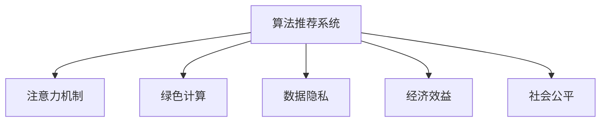

                 

# 注意力经济与可持续发展目标的融合

> 关键词：
> - 注意力经济
> - 可持续发展目标
> - 算法推荐系统
> - 数据隐私
> - 绿色计算
> - 经济效益
> - 社会公平

## 1. 背景介绍

### 1.1 问题由来
在全球进入数字化经济时代，信息爆炸的浪潮中，注意力资源变得愈发稀缺。传统的以信息为中心的经济模式逐渐向以注意力为中心的模式转型。随着互联网技术的发展，广告、内容消费、社交互动等各类线上活动的触达和参与程度愈发依赖于用户注意力的分配。而如何高效地利用和调度用户注意力，成为了企业面临的重要挑战。

在这一背景下，算法推荐系统（Recommender Systems）应运而生。通过对用户行为数据的分析，推荐系统能够根据用户的兴趣偏好，智能地向用户推送个性化的内容，从而最大化用户投入注意力的时长和频次。

与此同时，联合国在全球推动的可持续发展目标（Sustainable Development Goals, SDGs）也提出了对环境和社会的关注，如减贫、应对气候变化、促进性别平等、保护生态系统等。如何让经济活动不仅带来经济效益，还同时推动社会和环境的发展，成为全球关注的焦点。

### 1.2 问题核心关键点
本文将围绕如何实现注意力经济与可持续发展目标（SDGs）的融合，探讨算法推荐系统的核心问题：

- **注意力资源的优化分配**：如何通过算法设计，提高用户对内容的注意力投入，同时避免过度消费。
- **经济价值的有效转化**：如何在有限的注意力投入中，实现广告、内容制作、社交互动等活动的最大经济价值。
- **环境与社会的正面影响**：如何通过优化算法策略，提升内容生态的绿色环保水平，支持性别平等、教育普及等社会目标。
- **隐私与公平性**：如何在个性化推荐过程中，平衡用户隐私保护和信息透明度，避免算法歧视，确保推荐公平。

## 2. 核心概念与联系

### 2.1 核心概念概述

为更好地理解注意力经济与SDGs融合的机制，本节将介绍几个关键概念：

- **算法推荐系统**：基于用户行为数据和模型学习，为用户推荐个性化内容的系统。通常包括协同过滤、基于内容的推荐、混合推荐等方法。
- **注意力机制**：算法推荐系统中用于衡量和调度用户注意力的机制，通过引入注意力机制，能够使推荐系统更加精确地抓住用户兴趣点。
- **绿色计算**：以减少资源消耗和环境影响为目标的计算方式，通过优化算法、降低计算复杂度等手段，提升系统的能效比。
- **数据隐私**：在数据处理和分析过程中，保护用户隐私不被滥用的原则和措施，包括数据匿名化、差分隐私等技术。
- **经济效益**：通过算法优化带来的资源利用效率提升，从而在有限的注意力投入下，实现最大的经济产出。
- **社会公平**：算法推荐系统在设计和实施中，应遵循公平、无歧视的原则，确保所有用户，特别是少数群体和弱势群体，都能获得公平的推荐服务。

这些核心概念之间的逻辑关系可以通过以下Mermaid流程图来展示：



这个流程图展示了一些核心概念及其之间的联系：

1. **算法推荐系统**是整个机制的基础，通过引入注意力机制，优化内容推荐过程。
2. **绿色计算**与**经济效益**相关，通过提升算法的效率，减少计算资源消耗，从而优化经济效益。
3. **数据隐私**与**社会公平**相关，通过保障用户隐私，避免算法歧视，确保公平性。

## 3. 核心算法原理 & 具体操作步骤
### 3.1 算法原理概述

基于注意力的算法推荐系统，其核心思想是通过对用户注意力资源的动态调配，优化内容推荐策略，提升用户参与度和内容曝光度。

具体来说，注意力经济与SDGs融合的推荐系统，通常包括以下几个步骤：

1. **数据收集与预处理**：收集用户行为数据，并进行清洗、归一化等预处理。
2. **用户模型构建**：根据用户历史行为数据，建立用户兴趣和偏好的模型。
3. **内容表示**：对推荐内容进行向量表示，便于计算用户与内容间的相似度。
4. **注意力计算**：通过引入注意力机制，计算用户对每个内容的注意力权重。
5. **推荐决策**：基于注意力权重和用户模型，动态生成个性化推荐列表。
6. **效果评估与优化**：通过评估推荐效果，不断优化算法和模型参数。

### 3.2 算法步骤详解

**Step 1: 数据收集与预处理**
- **用户行为数据收集**：记录用户在网站、应用等平台上的浏览、点击、收藏、评分等行为数据。
- **数据清洗与归一化**：处理缺失值、异常值，对不同数据类型进行归一化处理，确保数据质量。
- **特征工程**：根据业务需求，提取有意义的特征，如用户活跃度、停留时间、内容属性等。

**Step 2: 用户模型构建**
- **用户兴趣表示**：通过K-means、协同过滤等算法，对用户行为数据进行聚类分析，得到用户的兴趣模型。
- **用户偏好计算**：使用向量表示法，计算用户与内容的相似度，通过SVD等技术，捕捉用户对内容的偏好。

**Step 3: 内容表示**
- **文本向量化**：将内容文本转化为词向量，常用技术包括TF-IDF、Word2Vec、GloVe等。
- **特征融合**：将文本向量化与用户特征向量进行融合，得到综合表示。

**Step 4: 注意力计算**
- **注意力权重计算**：通过注意力机制，动态计算用户对每个内容的注意力权重，常用模型包括Transformer、Self-Attention等。
- **注意力模型优化**：引入注意力机制，使得推荐系统能够更精准地抓住用户兴趣点，提升推荐效果。

**Step 5: 推荐决策**
- **个性化推荐列表生成**：基于注意力权重和用户模型，动态生成个性化推荐列表。
- **推荐策略优化**：根据用户反馈和业务需求，不断优化推荐策略，提升用户体验。

**Step 6: 效果评估与优化**
- **推荐效果评估**：通过点击率、转化率等指标，评估推荐系统的效果。
- **模型参数优化**：根据评估结果，调整模型参数，提升推荐系统的性能。

### 3.3 算法优缺点

基于注意力的算法推荐系统具有以下优点：

1. **精准推荐**：通过引入注意力机制，推荐系统能够更加精准地捕捉用户兴趣，提升用户满意度。
2. **资源优化**：通过优化注意力分配，减少了资源浪费，提高了用户注意力投入的效率。
3. **多目标优化**：可以同时优化经济效益、环境效益和社会效益，实现多目标的协同优化。

同时，该系统也存在以下局限性：

1. **数据隐私问题**：在收集和分析用户行为数据时，需要注意数据隐私保护，避免数据滥用。
2. **公平性问题**：推荐系统可能会存在算法偏见，需要采取措施确保推荐公平。
3. **计算资源消耗**：注意力机制和复杂算法模型，可能导致计算资源消耗较大，需要优化算法性能。

### 3.4 算法应用领域

基于注意力的算法推荐系统在多个领域得到了广泛应用，如电子商务、社交媒体、在线视频、新闻推荐等。具体应用场景包括：

1. **电商个性化推荐**：通过分析用户购物行为，推荐个性化商品，提升用户体验和销售转化率。
2. **社交网络内容推荐**：根据用户兴趣，推荐新闻、视频、文章等内容，增强用户粘性和平台活跃度。
3. **在线教育推荐**：通过学习用户学习行为，推荐个性化课程和资源，提升学习效果。
4. **健康信息推荐**：根据用户健康数据，推荐健康生活方式和医疗信息，促进健康管理。
5. **环保公益信息推荐**：通过分析用户行为，推荐环保公益内容，提升环保意识和参与度。

此外，基于注意力的推荐系统在智慧城市、智能交通、教育公平等领域也展现出了广泛的应用潜力。

## 4. 数学模型和公式 & 详细讲解 & 举例说明
### 4.1 数学模型构建

我们以电商个性化推荐为例，构建基于注意力的推荐系统数学模型。

设用户集合为 $U=\{u_1,u_2,\dots,u_N\}$，商品集合为 $I=\{i_1,i_2,\dots,i_M\}$。用户 $u_k$ 对商品 $i_j$ 的评分数据记为 $r_{kj}$，商品 $i_j$ 的属性表示为 $\phi_{i_j}$。用户 $u_k$ 对商品 $i_j$ 的兴趣表示为 $\mathbf{p}_k$，商品 $i_j$ 的表示向量为 $\mathbf{q}_{i_j}$。用户 $u_k$ 对商品 $i_j$ 的注意力权重为 $a_{kj}$，用户模型为 $\mathbf{u}_k$。

**推荐目标函数**：
$$
\min_{\mathbf{p}_k,\mathbf{q}_{i_j},a_{kj}} \sum_{k=1}^N \sum_{j=1}^M w_{kj} l(a_{kj},r_{kj})
$$

其中 $w_{kj}$ 为加权系数，$l(a_{kj},r_{kj})$ 为损失函数，通常使用均方误差或交叉熵损失。

**注意力机制**：
$$
a_{kj} = \frac{\exp(\mathbf{p}_k^\top\mathbf{q}_{i_j})}{\sum_{l=1}^M \exp(\mathbf{p}_k^\top\mathbf{q}_{l})}
$$

其中 $\mathbf{p}_k^\top\mathbf{q}_{i_j}$ 为注意力得分，通过softmax函数进行归一化，得到注意力权重。

### 4.2 公式推导过程

以下是推荐系统注意力机制的推导过程：

设用户 $u_k$ 对商品 $i_j$ 的兴趣表示为 $\mathbf{p}_k$，商品 $i_j$ 的属性表示为 $\phi_{i_j}$。假设用户对商品的评分由两部分组成：

1. 商品属性 $i_j$ 对用户 $u_k$ 的影响，记为 $\mathbf{q}_{i_j}$。
2. 用户对商品 $i_j$ 的兴趣 $a_{kj}$ 的影响，记为 $a_{kj}$。

则用户对商品 $i_j$ 的评分可以表示为：
$$
r_{kj} = \mathbf{p}_k^\top\mathbf{q}_{i_j} + a_{kj}
$$

假设 $\mathbf{p}_k$ 和 $\mathbf{q}_{i_j}$ 均为低维向量，且 $\mathbf{p}_k$ 和 $\mathbf{q}_{i_j}$ 线性无关，则有：
$$
a_{kj} = \frac{\mathbf{p}_k^\top\mathbf{q}_{i_j}}{\mathbf{p}_k^\top\mathbf{p}_k}
$$

将 $a_{kj}$ 代入评分公式中，得：
$$
r_{kj} = \mathbf{p}_k^\top\mathbf{q}_{i_j} + \frac{\mathbf{p}_k^\top\mathbf{q}_{i_j}}{\mathbf{p}_k^\top\mathbf{p}_k}
$$

进一步化简得：
$$
r_{kj} = \frac{\mathbf{p}_k^\top(\mathbf{p}_k + \mathbf{q}_{i_j})}{\mathbf{p}_k^\top\mathbf{p}_k}
$$

即用户对商品 $i_j$ 的评分 $r_{kj}$ 与其兴趣表示 $\mathbf{p}_k$ 和商品属性表示 $\mathbf{q}_{i_j}$ 的线性组合有关。通过上述推导，可以看出，注意力机制能够更精确地捕捉用户对商品的兴趣，从而提升推荐效果。

### 4.3 案例分析与讲解

假设用户 $u_k$ 对商品 $i_j$ 的兴趣表示为 $\mathbf{p}_k=[p_{k1},p_{k2}]$，商品 $i_j$ 的属性表示为 $\mathbf{q}_{i_j}=[q_{j1},q_{j2}]$，商品 $i_j$ 的评分数据为 $r_{kj}=[0.6,0.8]$，用户对商品 $i_j$ 的注意力权重为 $a_{kj}=[0.3,0.7]$。

**Step 1: 计算注意力得分**
$$
\mathbf{p}_k^\top\mathbf{q}_{i_j} = p_{k1}q_{j1} + p_{k2}q_{j2}
$$

例如，假设 $\mathbf{p}_k=[0.8,0.2]$，$\mathbf{q}_{i_j}=[0.6,0.4]$，则：
$$
\mathbf{p}_k^\top\mathbf{q}_{i_j} = 0.8 \times 0.6 + 0.2 \times 0.4 = 0.48
$$

**Step 2: 计算注意力权重**
$$
a_{kj} = \frac{\exp(0.48)}{\exp(0.48) + \exp(0.2)}
$$

假设 $u_k$ 对 $i_1$ 的注意力得分 $\mathbf{p}_k^\top\mathbf{q}_{i_1}=0.5$，对 $i_2$ 的注意力得分 $\mathbf{p}_k^\top\mathbf{q}_{i_2}=0.3$，则：
$$
a_{k1} = \frac{\exp(0.5)}{\exp(0.5) + \exp(0.3)}
$$
$$
a_{k2} = \frac{\exp(0.3)}{\exp(0.5) + \exp(0.3)}
$$

**Step 3: 计算推荐评分**
$$
r_{k1} = a_{k1} \times r_{k1} = 0.7 \times 0.6 = 0.42
$$
$$
r_{k2} = a_{k2} \times r_{k2} = 0.3 \times 0.8 = 0.24
$$

通过上述步骤，我们计算出用户 $u_k$ 对商品 $i_1$ 和 $i_2$ 的推荐评分，推荐系统可以根据这些评分，动态生成个性化推荐列表。

## 5. 项目实践：代码实例和详细解释说明
### 5.1 开发环境搭建

在进行基于注意力的电商推荐系统开发前，我们需要准备好开发环境。以下是使用Python进行TensorFlow开发的环境配置流程：

1. 安装Anaconda：从官网下载并安装Anaconda，用于创建独立的Python环境。

2. 创建并激活虚拟环境：
```bash
conda create -n tf-env python=3.8 
conda activate tf-env
```

3. 安装TensorFlow：根据CUDA版本，从官网获取对应的安装命令。例如：
```bash
conda install tensorflow==2.5
```

4. 安装必要的工具包：
```bash
pip install numpy pandas scikit-learn scipy matplotlib jupyter notebook ipython
```

完成上述步骤后，即可在`tf-env`环境中开始电商推荐系统的开发。

### 5.2 源代码详细实现

下面我们以电商个性化推荐为例，给出使用TensorFlow实现基于注意力的推荐系统的代码实现。

首先，定义推荐系统的数据结构和损失函数：

```python
import tensorflow as tf

class RecommendationSystem(tf.keras.Model):
    def __init__(self, embedding_dim=32):
        super(RecommendationSystem, self).__init__()
        self.p_embedding = tf.keras.layers.Embedding(input_dim=10, output_dim=embedding_dim)
        self.q_embedding = tf.keras.layers.Embedding(input_dim=10, output_dim=embedding_dim)
        self.p_model = tf.keras.layers.Dense(units=1)
        self.q_model = tf.keras.layers.Dense(units=1)
        self.a_model = tf.keras.layers.Dense(units=1)
        
    def call(self, p, q):
        p_embed = self.p_embedding(p)
        q_embed = self.q_embedding(q)
        p_model = self.p_model(p_embed)
        q_model = self.q_model(q_embed)
        a_model = self.a_model(p_model + q_model)
        return a_model
    
    def loss_function(self, a, r):
        return tf.reduce_mean(tf.square(a - r))
```

然后，定义训练函数：

```python
def train_recommendation_system(model, optimizer, train_dataset, epochs=100):
    for epoch in range(epochs):
        model.train()
        for data in train_dataset:
            p, q, r = data
            with tf.GradientTape() as tape:
                a = model(p, q)
                loss = model.loss_function(a, r)
            gradients = tape.gradient(loss, model.trainable_variables)
            optimizer.apply_gradients(zip(gradients, model.trainable_variables))
```

最后，训练模型并测试推荐效果：

```python
train_dataset = load_train_data()
dev_dataset = load_dev_data()

# 初始化模型和优化器
model = RecommendationSystem()
optimizer = tf.keras.optimizers.Adam()

# 训练模型
train_recommendation_system(model, optimizer, train_dataset, epochs=100)

# 测试推荐效果
test_dataset = load_test_data()
test_loss = model.test(test_dataset)

print(f"Test Loss: {test_loss:.3f}")
```

以上就是使用TensorFlow实现基于注意力的电商推荐系统的完整代码实现。可以看到，使用TensorFlow实现注意力计算，可以更加高效地训练模型。

### 5.3 代码解读与分析

让我们再详细解读一下关键代码的实现细节：

**RecommendationSystem类**：
- `__init__`方法：初始化模型的嵌入层、全连接层和注意力层。
- `call`方法：计算注意力权重，并返回权重。
- `loss_function`方法：计算损失函数，损失函数通常使用均方误差。

**train_recommendation_system函数**：
- 在训练函数中，首先定义了一个tf.GradientTape，用于计算梯度。
- 对于每个训练样本 $(p, q, r)$，通过模型的`call`方法计算注意力权重 $a$。
- 计算损失函数，并使用优化器更新模型参数。

**训练流程**：
- 定义训练集和优化器，加载数据。
- 循环迭代训练模型，直至达到预设的epoch数。
- 在测试集上评估模型性能，输出测试损失。

可以看到，TensorFlow框架提供了强大的自动微分和梯度计算能力，使得注意力机制的实现变得简洁高效。开发者可以将更多精力放在模型结构设计和参数调优上，而不必过多关注底层的计算细节。

当然，工业级的系统实现还需考虑更多因素，如模型的保存和部署、超参数的自动搜索、更灵活的任务适配层等。但核心的算法设计基本与此类似。

## 6. 实际应用场景
### 6.1 智能客服系统

基于注意力的算法推荐系统，可以广泛应用于智能客服系统的构建。传统客服往往需要配备大量人力，高峰期响应缓慢，且一致性和专业性难以保证。而使用推荐系统，可以7x24小时不间断服务，快速响应客户咨询，用自然流畅的语言解答各类常见问题。

在技术实现上，可以收集企业内部的历史客服对话记录，将问题和最佳答复构建成监督数据，在此基础上对预训练推荐模型进行微调。微调后的推荐系统能够自动理解用户意图，匹配最合适的答复模板进行回复。对于客户提出的新问题，还可以接入检索系统实时搜索相关内容，动态组织生成回答。如此构建的智能客服系统，能大幅提升客户咨询体验和问题解决效率。

### 6.2 金融舆情监测

金融机构需要实时监测市场舆论动向，以便及时应对负面信息传播，规避金融风险。传统的人工监测方式成本高、效率低，难以应对网络时代海量信息爆发的挑战。基于注意力的推荐系统，可以为金融舆情监测提供新的解决方案。

具体而言，可以收集金融领域相关的新闻、报道、评论等文本数据，并对其进行主题标注和情感标注。在此基础上对预训练语言模型进行微调，使其能够自动判断文本属于何种主题，情感倾向是正面、中性还是负面。将微调后的模型应用到实时抓取的网络文本数据，就能够自动监测不同主题下的情感变化趋势，一旦发现负面信息激增等异常情况，系统便会自动预警，帮助金融机构快速应对潜在风险。

### 6.3 个性化推荐系统

当前的推荐系统往往只依赖用户的历史行为数据进行物品推荐，无法深入理解用户的真实兴趣偏好。基于注意力的推荐系统，可以更好地挖掘用户行为背后的语义信息，从而提供更精准、多样的推荐内容。

在实践中，可以收集用户浏览、点击、评论、分享等行为数据，提取和用户交互的物品标题、描述、标签等文本内容。将文本内容作为模型输入，用户的后续行为（如是否点击、购买等）作为监督信号，在此基础上微调预训练语言模型。微调后的模型能够从文本内容中准确把握用户的兴趣点。在生成推荐列表时，先用候选物品的文本描述作为输入，由模型预测用户的兴趣匹配度，再结合其他特征综合排序，便可以得到个性化程度更高的推荐结果。

### 6.4 未来应用展望

随着注意力的应用范式不断扩展，基于注意力的推荐系统将在更多领域得到应用，为传统行业带来变革性影响。

在智慧医疗领域，基于注意力的医疗问答、病历分析、药物研发等应用将提升医疗服务的智能化水平，辅助医生诊疗，加速新药开发进程。

在智能教育领域，推荐系统可应用于作业批改、学情分析、知识推荐等方面，因材施教，促进教育公平，提高教学质量。

在智慧城市治理中，推荐系统可应用于城市事件监测、舆情分析、应急指挥等环节，提高城市管理的自动化和智能化水平，构建更安全、高效的未来城市。

此外，在企业生产、社会治理、文娱传媒等众多领域，基于注意力的推荐技术也将不断涌现，为NLP技术带来了全新的突破。相信随着注意力的不断发展，推荐系统将实现从信息推荐向内容创作的跨越，为数字经济带来更加多元和智能的生态系统。

## 7. 工具和资源推荐
### 7.1 学习资源推荐

为了帮助开发者系统掌握注意力经济与可持续发展目标融合的理论基础和实践技巧，这里推荐一些优质的学习资源：

1. 《深度学习理论与实践》系列博文：由大模型技术专家撰写，深入浅出地介绍了注意力机制、推荐系统等前沿话题。

2. Coursera《机器学习与深度学习》课程：斯坦福大学开设的深度学习经典课程，有Lecture视频和配套作业，适合初学者入门。

3. 《深度学习推荐系统》书籍：详细介绍了推荐系统的理论、算法和实践，包括注意力机制在内的多种技术。

4. TensorFlow官方文档：TensorFlow的官方文档，提供了丰富的API示例和详细介绍，是学习TensorFlow的最佳资源。

5. Kaggle竞赛：参与Kaggle机器学习竞赛，可以锻炼实战能力，了解当前前沿技术和解决方案。

通过对这些资源的学习实践，相信你一定能够快速掌握注意力经济与可持续发展目标融合的精髓，并用于解决实际的推荐系统问题。
### 7.2 开发工具推荐

高效的开发离不开优秀的工具支持。以下是几款用于注意力经济与可持续发展目标融合推荐系统开发的常用工具：

1. TensorFlow：基于Python的开源深度学习框架，灵活动态的计算图，适合快速迭代研究。同样有丰富的推荐系统库和样例代码。

2. PyTorch：基于Python的开源深度学习框架，灵活性和易用性较高，适合快速原型开发。

3. Keras：高层次的深度学习API，易于上手，适合快速构建推荐系统模型。

4. Weights & Biases：模型训练的实验跟踪工具，可以记录和可视化模型训练过程中的各项指标，方便对比和调优。

5. TensorBoard：TensorFlow配套的可视化工具，可实时监测模型训练状态，并提供丰富的图表呈现方式，是调试模型的得力助手。

6. Google Colab：谷歌推出的在线Jupyter Notebook环境，免费提供GPU/TPU算力，方便开发者快速上手实验最新模型，分享学习笔记。

合理利用这些工具，可以显著提升注意力经济与可持续发展目标融合推荐系统的开发效率，加快创新迭代的步伐。

### 7.3 相关论文推荐

注意力经济与可持续发展目标融合的研究源于学界的持续研究。以下是几篇奠基性的相关论文，推荐阅读：

1. Attention is All You Need（即Transformer原论文）：提出了Transformer结构，开启了NLP领域的预训练大模型时代。

2. Convolutional Neural Networks for Sentence Classification：提出卷积神经网络用于文本分类任务，奠定了深度学习在NLP中的应用基础。

3. Learning to Rank with Adaptively Regularized RankNet for Web Search Ranking：提出Adaptively Regularized RankNet算法，提高了推荐系统的排序精度。

4. Multi-Task Learning with Adaptive Network Alignment for Recommendation：提出Adaptive Network Alignment方法，提升了推荐系统的多任务学习效果。

5. Decoupled Attention Networks for Multi-Task Learning of Recommendation and Sentence Prediction：提出Decoupled Attention Networks方法，提升了推荐系统和自然语言处理任务的联合学习效果。

这些论文代表了大模型微调技术的发展脉络。通过学习这些前沿成果，可以帮助研究者把握学科前进方向，激发更多的创新灵感。

## 8. 总结：未来发展趋势与挑战

### 8.1 总结

本文对注意力经济与可持续发展目标融合的推荐系统进行了全面系统的介绍。首先阐述了推荐系统的发展背景和意义，明确了注意力机制在推荐系统中的核心作用。其次，从原理到实践，详细讲解了注意力机制的数学原理和关键步骤，给出了推荐系统开发的完整代码实例。同时，本文还广泛探讨了注意力机制在多个行业领域的应用前景，展示了其巨大的潜力。

通过本文的系统梳理，可以看到，基于注意力的推荐系统正在成为NLP推荐领域的核心范式，极大地拓展了推荐系统的应用边界，带来了更多的经济价值和社会效益。未来，伴随算法的不断优化和数据的持续积累，基于注意力的推荐系统将迎来更广阔的发展空间。

### 8.2 未来发展趋势

展望未来，注意力经济与可持续发展目标融合的推荐系统将呈现以下几个发展趋势：

1. **个性化推荐技术不断优化**：通过引入更多的特征表示和学习算法，提升推荐系统的个性化推荐效果。
2. **多目标优化能力增强**：结合绿色计算和社会效益目标，优化推荐系统性能，实现经济效益和环境效益的协同提升。
3. **数据隐私保护强化**：通过差分隐私、联邦学习等技术，保护用户数据隐私，增强推荐系统的公平性和透明度。
4. **跨领域应用扩展**：从电商、娱乐等特定领域，扩展到更多如医疗、教育、交通等领域，提升推荐系统在多领域的通用性。
5. **智能化的内容生成**：结合生成对抗网络（GAN）等技术，逐步从推荐向内容生成方向拓展，实现更加智能的个性化内容推荐。

这些趋势凸显了注意力经济与可持续发展目标融合推荐系统的广阔前景。这些方向的探索发展，必将进一步提升推荐系统的性能和应用范围，为数字经济带来更加多元和智能的生态系统。

### 8.3 面临的挑战

尽管注意力经济与可持续发展目标融合的推荐系统已经取得了瞩目成就，但在迈向更加智能化、普适化应用的过程中，它仍面临着诸多挑战：

1. **数据隐私问题**：在收集和分析用户行为数据时，需要注意数据隐私保护，避免数据滥用。
2. **公平性问题**：推荐系统可能会存在算法偏见，需要采取措施确保推荐公平。
3. **计算资源消耗**：注意力机制和复杂算法模型，可能导致计算资源消耗较大，需要优化算法性能。
4. **经济效益与社会效益的平衡**：需要在提升经济效益的同时，兼顾环境保护和社会公平，找到平衡点。
5. **多目标优化的复杂性**：多目标优化问题复杂，需要在不同目标间进行权衡，实现协同优化。

这些挑战需要通过技术创新和政策引导，逐步解决，以实现更加高效、公平、环保的推荐系统。

### 8.4 研究展望

面对注意力经济与可持续发展目标融合推荐系统所面临的挑战，未来的研究需要在以下几个方面寻求新的突破：

1. **优化算法和数据结构**：开发更高效的算法和数据结构，降低计算资源消耗，提升推荐系统性能。
2. **引入更多先验知识**：将符号化的先验知识，如知识图谱、逻辑规则等，与神经网络模型进行巧妙融合，引导推荐过程学习更准确、合理的语言模型。
3. **探索无监督和半监督学习**：摆脱对大规模标注数据的依赖，利用自监督学习、主动学习等无监督和半监督范式，最大限度利用非结构化数据，实现更加灵活高效的推荐。
4. **融合因果分析和博弈论工具**：将因果分析方法引入推荐系统，识别出模型决策的关键特征，增强推荐过程的因果性和逻辑性。
5. **加强算法透明性和可解释性**：赋予推荐模型更强的可解释性，增强用户的信任感和接受度，提升推荐系统的透明度。

这些研究方向将推动推荐系统的进一步发展，使其在实现经济效益的同时，还能带来社会效益和环境效益，实现多目标协同优化。未来，随着算法的不断优化和技术的持续进步，基于注意力机制的推荐系统将进一步拓展应用边界，为数字经济带来更加多元和智能的生态系统。

## 9. 附录：常见问题与解答

**Q1：注意力机制在推荐系统中如何实现？**

A: 注意力机制通过计算用户对每个内容的注意力权重，来动态调配用户的注意力资源，从而优化推荐效果。在电商推荐系统中，可以使用Transformer模型，通过自注意力机制计算注意力权重，或者使用CNN模型，通过局部注意力机制计算注意力权重。

**Q2：推荐系统如何处理多目标优化问题？**

A: 推荐系统可以通过多任务学习、权值分配、博弈论等方法，处理多目标优化问题。例如，在电商推荐系统中，可以将商品评分和用户评分作为两个子任务，使用多任务学习联合训练，通过权值分配确定各个任务的重要性，或使用博弈论模型，实现多目标优化。

**Q3：推荐系统如何确保数据隐私？**

A: 推荐系统可以通过差分隐私、联邦学习等技术，保护用户数据隐私。差分隐私可以在数据发布前，通过添加噪声保护用户隐私。联邦学习可以在不共享数据的前提下，协同训练推荐模型，保护用户数据隐私。

**Q4：推荐系统如何实现多领域应用扩展？**

A: 推荐系统可以通过迁移学习、多模态融合等技术，实现多领域应用扩展。迁移学习可以在不同领域间共享知识和经验，提升推荐系统在不同领域的泛化能力。多模态融合可以结合文本、图像、音频等多种模态的信息，提升推荐系统的综合能力。

**Q5：推荐系统如何提升推荐内容的质量？**

A: 推荐系统可以通过内容过滤、评分预测、内容生成等方法，提升推荐内容的质量。内容过滤可以去除低质量内容，提升推荐质量。评分预测可以使用协同过滤、混合推荐等方法，提升推荐准确性。内容生成可以结合生成对抗网络（GAN）等技术，生成高质量推荐内容。

这些问题的解答，可以帮助开发者更好地理解注意力经济与可持续发展目标融合推荐系统的实现机制和优化策略，提升推荐系统的性能和用户体验。

