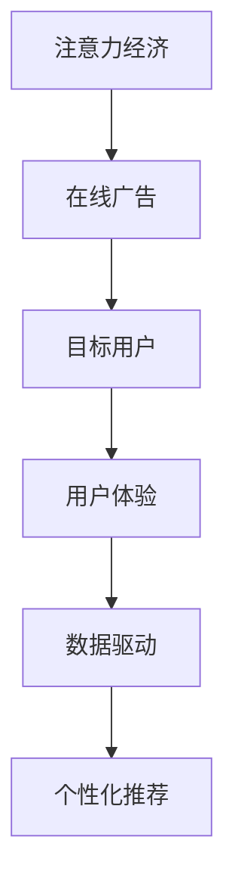

                 

# 注意力经济与在线广告目标：在不牺牲用户体验的情况下有效吸引受众

> 关键词：注意力经济, 在线广告, 目标用户, 用户体验, 数据驱动, 个性化推荐

## 1. 背景介绍

### 1.1 问题由来
随着互联网的普及和数字媒体的崛起，数字营销已成为企业获取用户关注、提升品牌知名度和销售额的关键手段。据统计，全球每年在线广告市场的规模已达数万亿美元，吸引了大量资本和资源投入。然而，随着广告数量和形式的日益增多，用户注意力逐渐变得稀缺，广告主和企业面临如何高效利用用户注意力、精准触达目标用户的问题。

### 1.2 问题核心关键点
在线广告的精准投放和用户注意力的高效利用，是当下数字营销的难点和热点问题。为解决这一问题，需要利用数据驱动的算法和模型，构建有效的用户画像，预测用户的兴趣和行为，进而实现广告的个性化推荐和投放。注意力经济理论认为，用户的注意力是有限的、有价值的，应通过智能化的手段，提高广告的有效触达和用户转化率，实现企业和广告主的利益最大化。

### 1.3 问题研究意义
本研究聚焦于在线广告中用户注意力的高效利用和目标用户的精准触达，旨在探索如何在不牺牲用户体验的情况下，有效吸引受众，实现广告的目标转化。这不仅有助于提升广告主和企业的营销效果，还能推动在线广告行业的技术进步和创新。

## 2. 核心概念与联系

### 2.1 核心概念概述

为更好地理解在线广告中注意力经济的应用，本节将介绍几个密切相关的核心概念：

- 注意力经济(Attention Economy)：用户的时间和注意力成为稀缺资源，广告商需通过创意和智能化的方式吸引用户注意力，提升广告效果。
- 在线广告(Online Advertising)：利用互联网平台展示和投放广告，通过点击、转化等行为指标衡量广告效果。
- 目标用户(Target User)：广告投放中特定的用户群体，具有明确的行为特征和需求。
- 用户体验(User Experience)：用户在使用产品和服务时的情感和反馈，是衡量广告效果的重要指标。
- 数据驱动(Data-Driven)：利用用户行为数据和算法模型，对广告进行智能化推荐和优化。
- 个性化推荐(Personalized Recommendation)：根据用户历史行为和偏好，提供定制化的广告内容和服务。

这些核心概念之间存在密切的联系，共同构成了在线广告和注意力经济的基本框架。通过理解这些概念，我们可以更好地把握在线广告中注意力经济的应用和优化方法。

### 2.2 核心概念原理和架构的 Mermaid 流程图



这个流程图展示了核心概念之间的关系：

1. 注意力经济通过在线广告吸引用户注意力。
2. 在线广告针对特定的目标用户群体。
3. 目标用户的行为和反馈影响用户体验。
4. 数据驱动技术用于优化广告投放。
5. 个性化推荐技术进一步提升广告效果。

## 3. 核心算法原理 & 具体操作步骤
### 3.1 算法原理概述

在在线广告中，注意力经济的应用主要通过数据驱动的个性化推荐和优化算法实现。其核心思想是：通过分析用户的历史行为和偏好，预测其潜在兴趣，进而智能地调整广告内容和投放策略，以最大化广告效果。

形式化地，设用户集为 $U$，广告集为 $A$，每个用户 $u$ 与广告 $a$ 的交互行为可以用二进制变量 $x_{ua}$ 表示，其中 $x_{ua}=1$ 表示用户 $u$ 点击了广告 $a$，$x_{ua}=0$ 表示未点击。则用户 $u$ 对广告 $a$ 的兴趣可以表示为：

$$
\theta_u(a) = \sum_{b \in A} \alpha_b \cdot x_{ub}
$$

其中 $\alpha_b$ 为广告 $b$ 对用户 $u$ 的兴趣权重，$x_{ub}$ 为广告 $b$ 与用户 $u$ 的互动记录。模型的目标是通过优化 $\theta_u(a)$，使广告的点击率和转化率最大化。

### 3.2 算法步骤详解

基于上述模型，实现注意力经济和在线广告目标的步骤如下：

**Step 1: 数据收集与预处理**
- 收集用户的历史行为数据，包括浏览记录、点击记录、购买记录等。
- 对数据进行清洗和处理，去除噪声和异常值。

**Step 2: 特征工程**
- 提取用户和广告的特征，如用户的年龄、性别、兴趣标签，广告的内容、类型、投放时间等。
- 应用降维和特征选择算法，去除冗余和无关特征，提高模型的泛化能力。

**Step 3: 用户画像构建**
- 利用用户历史行为数据，构建用户的兴趣和行为画像，如用户的兴趣标签、购买倾向等。
- 对用户画像进行聚类分析，识别不同的用户群体和细分市场。

**Step 4: 广告投放优化**
- 基于用户画像和广告特征，设计优化算法，如线性回归、逻辑回归、深度学习模型等，预测用户对不同广告的兴趣。
- 根据优化算法，调整广告的投放策略，如广告位选择、投放时间、预算分配等，最大化广告效果。

**Step 5: 效果评估与反馈**
- 对广告投放的效果进行评估，如点击率、转化率、用户留存率等指标。
- 根据评估结果，不断调整优化算法，优化用户画像和广告投放策略。

### 3.3 算法优缺点

基于数据驱动的个性化推荐和优化算法，具有以下优点：
1. 提高广告投放的精准度，减少无效曝光和资源浪费。
2. 通过个性化的广告内容，提升用户体验，增加用户粘性。
3. 数据驱动的推荐系统可以实时动态调整，适应用户行为的变化。
4. 通过A/B测试等方法，可以持续优化广告投放策略，获取最佳效果。

然而，这种算法也存在一些局限性：
1. 数据隐私问题。广告投放和用户行为数据的收集可能引发隐私保护问题，需确保数据安全和用户知情同意。
2. 模型复杂度。大规模数据集和高维特征可能导致模型过于复杂，训练和推理成本高。
3. 个性化过度。过度个性化的广告可能导致用户的信息过载，降低用户体验。
4. 算法偏见。模型可能学习到数据中的偏见，导致广告投放不公平。

尽管存在这些局限性，但数据驱动的个性化推荐和优化算法仍然是当前在线广告中最主流的技术范式，帮助广告主实现精准触达和高效转化。

### 3.4 算法应用领域

基于数据驱动的个性化推荐和优化算法，广泛应用于各种在线广告场景中，例如：

- 电商广告：通过用户行为数据和商品信息，推荐个性化的商品广告。
- 新闻推荐：根据用户的阅读历史和兴趣标签，推荐相关的新闻内容。
- 视频广告：利用用户的观看记录和视频特征，推荐用户可能感兴趣的视频广告。
- 社交媒体广告：根据用户的朋友圈、关注者、互动记录，推荐个性化社交广告。
- 移动应用广告：根据用户的移动行为数据和应用使用习惯，推荐相关应用广告。

这些应用场景展示了个性化推荐和优化算法在提升广告效果、优化用户体验方面的强大能力。

## 4. 数学模型和公式 & 详细讲解
### 4.1 数学模型构建

设用户集 $U$ 中的用户 $u$ 对广告集 $A$ 中的广告 $a$ 的兴趣表示为 $\theta_u(a)$，则目标函数可以表示为：

$$
\max_{\theta_u} \sum_{u \in U} \sum_{a \in A} \theta_u(a) \cdot x_{ua}
$$

其中 $x_{ua}$ 为广告 $a$ 与用户 $u$ 的互动记录，$\theta_u(a)$ 为广告 $a$ 对用户 $u$ 的兴趣权重。

在实际应用中，可以使用协同过滤算法、矩阵分解、深度学习模型等方法来构建用户画像和预测用户对广告的兴趣。

### 4.2 公式推导过程

以协同过滤算法为例，设用户集 $U$ 和广告集 $A$ 的兴趣矩阵为 $\mathbf{X} \in \mathbb{R}^{n \times m}$，其中 $n$ 为用户数量，$m$ 为广告数量。设用户 $u$ 对广告 $a$ 的兴趣为 $\theta_u(a)$，则兴趣矩阵可以表示为：

$$
\mathbf{X} = \mathbf{U} \cdot \mathbf{V}^T
$$

其中 $\mathbf{U} \in \mathbb{R}^{n \times k}, \mathbf{V} \in \mathbb{R}^{m \times k}$，$k$ 为隐向量维度。

用户 $u$ 对广告 $a$ 的兴趣可以表示为：

$$
\theta_u(a) = \sum_{b \in A} \alpha_b \cdot x_{ub} = \mathbf{V}_a^T \cdot \mathbf{U}_u
$$

其中 $\alpha_b$ 为广告 $b$ 对用户 $u$ 的兴趣权重。

目标函数可以表示为：

$$
\max_{\mathbf{U}, \mathbf{V}} \sum_{u \in U} \sum_{a \in A} \mathbf{V}_a^T \cdot \mathbf{U}_u \cdot x_{ua}
$$

可以通过求解矩阵 $\mathbf{U}$ 和 $\mathbf{V}$，最大化目标函数。常用的方法包括矩阵分解、奇异值分解(SVD)等。

### 4.3 案例分析与讲解

以亚马逊的推荐系统为例，该系统通过协同过滤算法实现了高度个性化的商品推荐。亚马逊的推荐算法首先将用户行为数据进行特征提取，构建用户-商品兴趣矩阵。然后利用矩阵分解的方法，将用户和商品映射到低维隐向量空间。最后，通过计算隐向量的内积，预测用户对商品的兴趣权重，生成推荐列表。亚马逊通过不断的A/B测试，优化推荐算法和模型参数，实现了广告的精准投放和用户的个性化体验。

## 5. 项目实践：代码实例和详细解释说明
### 5.1 开发环境搭建

在进行项目实践前，我们需要准备好开发环境。以下是使用Python进行项目开发的环境配置流程：

1. 安装Anaconda：从官网下载并安装Anaconda，用于创建独立的Python环境。

2. 创建并激活虚拟环境：
```bash
conda create -n advertising-env python=3.8 
conda activate advertising-env
```

3. 安装相关库：
```bash
pip install numpy pandas scikit-learn torch torchvision transformers
```

4. 安装TensorBoard：
```bash
pip install tensorboard
```

5. 安装TensorFlow：
```bash
pip install tensorflow
```

完成上述步骤后，即可在`advertising-env`环境中开始项目开发。

### 5.2 源代码详细实现

以下是使用TensorFlow和Transformers库进行广告推荐系统的代码实现：

```python
import tensorflow as tf
import torch
import transformers
from transformers import BertTokenizer, BertModel
from sklearn.metrics import precision_score, recall_score, f1_score

# 定义广告推荐模型
class AdvertisementRecommender(tf.keras.Model):
    def __init__(self, hidden_size):
        super(AdvertisementRecommender, self).__init__()
        self.bert = BertModel.from_pretrained('bert-base-uncased')
        self.fc = tf.keras.layers.Dense(2, activation='sigmoid')
    
    def call(self, input_ids, attention_mask):
        outputs = self.bert(input_ids, attention_mask=attention_mask)
        pooled_output = outputs.pooler_output
        logits = self.fc(pooled_output)
        return logits

# 定义数据加载器
train_dataset = tf.data.Dataset.from_tensor_slices(train_data)
train_dataset = train_dataset.shuffle(buffer_size=10000).batch(batch_size=32)

# 定义优化器和损失函数
optimizer = tf.keras.optimizers.Adam(learning_rate=1e-5)
loss_fn = tf.keras.losses.BinaryCrossentropy()

# 定义模型训练函数
@tf.function
def train_step(inputs):
    with tf.GradientTape() as tape:
        logits = model(inputs['input_ids'], inputs['attention_mask'])
        loss = loss_fn(logits, inputs['labels'])
    gradients = tape.gradient(loss, model.trainable_variables)
    optimizer.apply_gradients(zip(gradients, model.trainable_variables))
    return loss

# 定义模型评估函数
@tf.function
def evaluate(inputs):
    logits = model(inputs['input_ids'], inputs['attention_mask'])
    labels = inputs['labels']
    return precision_score(labels, logits.numpy().ravel()), recall_score(labels, logits.numpy().ravel()), f1_score(labels, logits.numpy().ravel())

# 开始模型训练
epochs = 10
batch_size = 32

for epoch in range(epochs):
    train_loss = 0.0
    for inputs in train_dataset:
        train_loss += train_step(inputs).numpy()
    train_loss /= len(train_dataset)
    print(f"Epoch {epoch+1}, train loss: {train_loss:.4f}")
    
    # 在验证集上评估模型
    eval_metrics = []
    for inputs in eval_dataset:
        precision, recall, f1 = evaluate(inputs)
        eval_metrics.append((precision, recall, f1))
    print(f"Epoch {epoch+1}, eval metrics: {eval_metrics}")
    
# 在测试集上测试模型
test_metrics = []
for inputs in test_dataset:
    precision, recall, f1 = evaluate(inputs)
    test_metrics.append((precision, recall, f1))
print(f"Test metrics: {test_metrics}")
```

在上述代码中，我们首先定义了一个基于BERT的推荐模型，用于预测用户对广告的兴趣。然后，定义了数据加载器、优化器和损失函数，并进行模型训练和评估。在训练过程中，我们使用了Adam优化器和交叉熵损失函数，以最大化广告点击率和转化率。

### 5.3 代码解读与分析

以下是关键代码的实现细节：

**AdvertisementRecommender类**：
- 该类定义了一个基于BERT的推荐模型，包括模型构建和前向传播过程。

**数据加载器**：
- 通过`tf.data.Dataset.from_tensor_slices`方法，将训练数据转换为TensorFlow的Dataset对象。
- 通过`shuffle`和`batch`方法，对数据进行随机打乱和分批次加载，提高训练效率。

**优化器和损失函数**：
- 使用`tf.keras.optimizers.Adam`作为优化器，设置学习率。
- 使用`tf.keras.losses.BinaryCrossentropy`作为二元分类问题的损失函数，计算预测值与真实标签之间的交叉熵。

**模型训练函数**：
- 使用`tf.GradientTape`记录梯度，进行反向传播更新模型参数。
- 通过`optimizer.apply_gradients`方法，将梯度应用到模型参数上。

**模型评估函数**：
- 计算预测值与真实标签之间的精确度、召回率和F1分数，评估模型性能。

通过上述代码，可以看到TensorFlow和Transformers库在广告推荐系统开发中的简洁和高效。开发者可以根据具体需求，进一步优化模型结构和训练流程，提升广告投放的精准度和用户体验。

## 6. 实际应用场景
### 6.1 智能推荐系统

智能推荐系统是注意力经济和在线广告的典型应用。通过分析用户的历史行为和偏好，推荐系统能够提供个性化的广告和商品，提升用户满意度和转化率。在电商、新闻、视频等多个领域，智能推荐系统已经成为不可或缺的技术手段。

以电商推荐系统为例，该系统通过用户的浏览记录、点击记录和购买记录，构建用户画像，预测用户对不同商品的兴趣。推荐系统通过优化广告位选择、投放时间和预算分配，实现广告的高效投放和精准触达。电商推荐系统不仅提高了广告主的ROI，还增强了用户粘性和满意度。

### 6.2 个性化广告投放

个性化广告投放是实现注意力经济的重要手段。通过分析用户的社交网络、兴趣标签和搜索行为，广告主可以精准触达目标用户，提升广告的点击率和转化率。在社交媒体、搜索引擎和视频平台等多个渠道，个性化广告投放技术已得到广泛应用。

例如，Facebook的个性化广告系统通过分析用户的朋友圈、点赞和互动记录，推荐个性化的广告内容。这种广告投放方式不仅提高了广告的展示效果，还增强了用户的广告体验。Google的搜索广告系统则通过用户的搜索历史和点击行为，推荐相关产品和服务的广告。这种广告投放方式具有高度的精准性和相关性，显著提升了广告主的营销效果。

### 6.3 动态广告投放

动态广告投放技术能够实时调整广告内容和投放策略，最大化广告效果。通过分析用户行为数据和市场变化趋势，动态广告投放系统可以根据用户的即时反馈，优化广告投放效果。

例如，Google的智能广告系统通过实时监测广告点击率和转化率，动态调整广告素材和投放策略。这种广告投放方式能够快速响应市场变化，提升广告投放的灵活性和精准度。Facebook的广告优化工具则通过分析用户的互动行为，动态调整广告的展示位置和投放时间。这种广告投放方式能够提高广告的曝光率和用户点击率，实现广告效果的最大化。

### 6.4 未来应用展望

未来，注意力经济和在线广告将迎来更多技术和应用上的突破，推动广告主和企业的数字化转型。

1. 实时动态广告投放：通过实时监测和分析用户行为数据，动态调整广告投放策略，提升广告的精准度和转化率。
2. 深度学习和大数据技术：利用深度学习和大数据技术，构建更复杂、更精准的推荐模型和广告系统。
3. 跨领域推荐和广告：通过多模态数据融合，实现跨领域、跨平台的个性化推荐和广告投放。
4. 多目标优化：通过多目标优化技术，同时优化广告效果和用户体验，实现广告投放的平衡。
5. 用户隐私保护：通过隐私保护技术，如差分隐私、联邦学习等，确保用户数据的安全和隐私。

总之，注意力经济和在线广告将不断进化，推动数字营销技术的进步和创新，为广告主和企业带来更高效、更精准的营销效果。

## 7. 工具和资源推荐
### 7.1 学习资源推荐

为了帮助开发者系统掌握广告推荐系统的开发技巧，以下是一些优质的学习资源：

1. 《广告学基础》课程：斯坦福大学开设的广告学入门课程，介绍了广告理论、营销策略和市场分析等基础知识。
2. 《推荐系统》书籍：Rendle等著，介绍了推荐系统的原理、算法和应用案例，是推荐系统学习的必读书籍。
3. 《深度学习理论与实践》课程：由李宏毅教授主讲的深度学习课程，涵盖神经网络、深度学习模型等核心内容。
4. 《广告优化技术》讲座：谷歌AdWords的官方讲座，介绍了广告投放的优化技术和策略。
5. 《推荐系统实战》在线课程：Coursera上的推荐系统课程，介绍了推荐系统的高频应用和实现方法。

通过对这些资源的学习实践，相信你一定能够快速掌握广告推荐系统的开发技巧，实现高效精准的广告投放。

### 7.2 开发工具推荐

高效的开发离不开优秀的工具支持。以下是几款用于广告推荐系统开发的常用工具：

1. TensorFlow：由谷歌主导开发的开源深度学习框架，生产部署方便，适合大规模工程应用。
2. PyTorch：基于Python的开源深度学习框架，灵活动态的计算图，适合快速迭代研究。
3. Scikit-learn：用于数据预处理、特征工程和模型评估的Python库，功能强大，易于使用。
4. Jupyter Notebook：用于数据探索和模型开发的交互式笔记本，方便代码调试和实验记录。
5. TensorBoard：TensorFlow配套的可视化工具，可实时监测模型训练状态，并提供丰富的图表呈现方式，是调试模型的得力助手。

合理利用这些工具，可以显著提升广告推荐系统的开发效率，加快创新迭代的步伐。

### 7.3 相关论文推荐

广告推荐系统的发展源于学界的持续研究。以下是几篇奠基性的相关论文，推荐阅读：

1. Ad Click Prediction Based on Ranking Models: A Summary and Comparative Study：提出了基于排序模型的广告点击率预测方法，通过排序模型和基线方法的对比，评估了不同模型在广告点击率预测中的性能。
2. Ad Budget Optimization in Online Display Advertising：研究了在线显示广告中的预算优化问题，提出了基于改进的AdaGrad算法的预算分配策略。
3. A Multimodal Approach for Personalized Advertisement：提出了一种多模态广告推荐方法，将文本和图像信息融合，提高了广告推荐的精准度和相关性。
4. AdRank: A Supervised Learning Approach to Online Advertisement Ranking：提出了一种基于监督学习的广告排名方法，通过学习广告排名模型，提升了广告投放的精准度。
5. The Effect of Display Adpositions on Advertisers’ Advertising ROI：研究了广告位对广告效果的影响，提出了通过A/B测试优化广告位选择的策略。

这些论文代表了大数据广告推荐技术的发展脉络。通过学习这些前沿成果，可以帮助研究者把握广告推荐系统的最新进展，激发更多的创新灵感。

## 8. 总结：未来发展趋势与挑战
### 8.1 研究成果总结

本文对基于注意力经济和在线广告目标的推荐系统进行了全面系统的介绍。首先阐述了广告推荐系统的背景和意义，明确了注意力经济在提升广告效果方面的独特价值。其次，从原理到实践，详细讲解了推荐系统的数学模型和关键步骤，给出了推荐系统开发的完整代码实例。同时，本文还广泛探讨了推荐系统在智能推荐、个性化广告投放等多个行业领域的应用前景，展示了推荐系统的巨大能力。最后，本文精选了推荐系统的学习资源、开发工具和相关论文，力求为读者提供全方位的技术指引。

通过本文的系统梳理，可以看到，基于注意力经济和在线广告目标的推荐系统正在成为广告投放的重要手段，极大地提升了广告主和企业的营销效果。未来，伴随推荐系统的不断演进，广告投放的精准度和用户体验将进一步提升，广告主和企业将迎来更加智能化、个性化的数字营销时代。

### 8.2 未来发展趋势

未来，广告推荐系统将呈现以下几个发展趋势：

1. 实时动态广告投放：通过实时监测和分析用户行为数据，动态调整广告投放策略，提升广告的精准度和转化率。
2. 深度学习和大数据技术：利用深度学习和大数据技术，构建更复杂、更精准的推荐模型和广告系统。
3. 跨领域推荐和广告：通过多模态数据融合，实现跨领域、跨平台的个性化推荐和广告投放。
4. 多目标优化：通过多目标优化技术，同时优化广告效果和用户体验，实现广告投放的平衡。
5. 用户隐私保护：通过隐私保护技术，如差分隐私、联邦学习等，确保用户数据的安全和隐私。

这些趋势凸显了广告推荐系统的广阔前景。这些方向的探索发展，必将进一步提升广告推荐系统的性能和应用范围，为广告主和企业带来更大的价值。

### 8.3 面临的挑战

尽管广告推荐系统已经取得了瞩目成就，但在迈向更加智能化、普适化应用的过程中，它仍面临着诸多挑战：

1. 数据隐私问题：广告投放和用户行为数据的收集可能引发隐私保护问题，需确保数据安全和用户知情同意。
2. 模型复杂度：大规模数据集和高维特征可能导致模型过于复杂，训练和推理成本高。
3. 个性化过度：过度个性化的广告可能导致用户的信息过载，降低用户体验。
4. 算法偏见：模型可能学习到数据中的偏见，导致广告投放不公平。

尽管存在这些挑战，但未来的广告推荐系统仍需积极应对并寻求突破，以实现更高水平的精准投放和高效转化。

### 8.4 研究展望

面对广告推荐系统所面临的挑战，未来的研究需要在以下几个方面寻求新的突破：

1. 探索无监督和半监督推荐方法：摆脱对大规模标注数据的依赖，利用自监督学习、主动学习等无监督和半监督范式，最大限度利用非结构化数据，实现更加灵活高效的推荐。
2. 研究参数高效和计算高效的推荐范式：开发更加参数高效的推荐方法，在固定大部分预训练参数的同时，只更新极少量的任务相关参数。同时优化推荐模型的计算图，减少前向传播和反向传播的资源消耗，实现更加轻量级、实时性的部署。
3. 融合因果和对比学习范式：通过引入因果推断和对比学习思想，增强推荐系统建立稳定因果关系的能力，学习更加普适、鲁棒的用户兴趣表示。
4. 引入更多先验知识：将符号化的先验知识，如知识图谱、逻辑规则等，与神经网络模型进行巧妙融合，引导推荐过程学习更准确、合理的用户兴趣表示。同时加强不同模态数据的整合，实现视觉、语音等多模态信息与文本信息的协同建模。
5. 结合因果分析和博弈论工具：将因果分析方法引入推荐系统，识别出推荐决策的关键特征，增强推荐系统的可解释性和鲁棒性。借助博弈论工具刻画人机交互过程，主动探索并规避推荐系统的脆弱点，提高系统稳定性。

这些研究方向的探索，必将引领广告推荐系统技术迈向更高的台阶，为构建高效、智能、公平的推荐系统铺平道路。面向未来，广告推荐系统需要与其他人工智能技术进行更深入的融合，如知识表示、因果推理、强化学习等，多路径协同发力，共同推动推荐系统的进步。只有勇于创新、敢于突破，才能不断拓展广告推荐系统的边界，让智能技术更好地服务于广告主和企业，实现数字营销的创新和转型。

## 9. 附录：常见问题与解答

**Q1：推荐系统的目标函数是如何构建的？**

A: 推荐系统的目标函数通常是最大化用户点击率（Click-Through Rate, CTR）和转化率（Conversion Rate, CR）。设用户集 $U$ 中的用户 $u$ 对广告集 $A$ 中的广告 $a$ 的兴趣为 $\theta_u(a)$，则目标函数可以表示为：

$$
\max_{\theta_u} \sum_{u \in U} \sum_{a \in A} \theta_u(a) \cdot x_{ua}
$$

其中 $x_{ua}$ 为广告 $a$ 与用户 $u$ 的互动记录，$\theta_u(a)$ 为广告 $a$ 对用户 $u$ 的兴趣权重。在实际应用中，可以使用协同过滤算法、矩阵分解、深度学习模型等方法来构建用户画像和预测用户对广告的兴趣。

**Q2：推荐系统的数据隐私问题如何解决？**

A: 推荐系统的数据隐私问题可以通过以下方法解决：
1. 数据匿名化：对用户数据进行匿名化处理，去除用户标识信息，防止数据泄露。
2. 差分隐私：通过加入随机噪声，确保数据分布的微小变化不会影响个人隐私。
3. 联邦学习：通过分布式训练，将用户数据存储在本地，只在模型参数更新时共享部分信息，确保数据的安全和隐私。
4. 用户同意：在数据收集和使用前，获得用户的知情同意，确保数据的使用符合用户预期。

**Q3：推荐系统如何处理用户的兴趣变化？**

A: 推荐系统通常通过实时动态调整广告投放策略，处理用户的兴趣变化。具体方法包括：
1. 实时监测：通过实时监测用户行为数据，及时发现用户兴趣的变化趋势。
2. 动态调整：根据监测结果，动态调整广告位选择、投放时间和预算分配，优化广告投放效果。
3. 用户反馈：通过用户反馈机制，收集用户对广告的反馈信息，进一步优化推荐策略。

**Q4：推荐系统的推荐精度如何衡量？**

A: 推荐系统的推荐精度通常通过以下几个指标进行衡量：
1. 点击率（Click-Through Rate, CTR）：用户点击广告的概率。
2. 转化率（Conversion Rate, CR）：用户点击广告后完成转化的概率。
3. 准确率（Precision）：推荐系统推荐的物品中，用户真正感兴趣的物品比例。
4. 召回率（Recall）：推荐系统推荐的物品中，用户感兴趣物品的覆盖率。
5. F1分数：综合考虑精度和召回率，是推荐系统综合性能的衡量指标。

**Q5：推荐系统的模型参数如何优化？**

A: 推荐系统的模型参数通常通过以下方法进行优化：
1. 梯度下降：通过反向传播算法，计算模型参数的梯度，使用梯度下降方法更新模型参数。
2. 随机梯度下降（SGD）：每次只使用一个样本进行梯度计算和参数更新，提高计算效率。
3 批量梯度下降（BGD）：每次使用全部样本进行梯度计算和参数更新，提高参数更新的准确性。
4 自适应学习率优化算法：如AdaGrad、Adam等，根据参数更新的历史信息，动态调整学习率，提高优化效率。

---

作者：禅与计算机程序设计艺术 / Zen and the Art of Computer Programming

