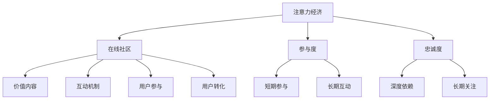

                 

## 1. 背景介绍

在信息爆炸的互联网时代，注意力成为稀缺资源，如何抓住用户的注意力，建立参与度高、忠诚度高的受众群体，成为各大平台和社区竞争的核心。特别是在社交媒体和内容平台，如何提升用户参与度，延长用户停留时间，增加用户转化率，是商业成功的关键。本文将探讨注意力经济的核心原理，并详细阐述如何在在线社区中建立参与度高、忠诚度高的受众。

## 2. 核心概念与联系

### 2.1 核心概念概述

为更好地理解注意力经济与在线社区，本节将介绍几个关键概念：

- **注意力经济（Attention Economy）**：指在信息过载的时代，企业和平台通过获取和保持用户注意力来创造价值。获取用户的注意力，不仅能提高品牌知名度，还能增加广告收入、提高转化率。

- **在线社区（Online Community）**：指基于互联网的社交网络平台，用户可以通过文字、图片、视频等形式进行互动，形成一种虚拟的社交生态。在线社区通过提供价值内容、鼓励用户参与互动，吸引和保留用户。

- **参与度（Engagement）**：指用户与在线社区的互动程度，包括点赞、评论、分享等行为。参与度高的社区，意味着用户对内容的认同感和粘性更强。

- **忠诚度（Loyalty）**：指用户对社区的长期关注和忠诚，包括定期访问、情感依赖等。忠诚用户能够产生更多的价值，如内容生成、推荐等。

这些概念之间的逻辑关系可以通过以下Mermaid流程图来展示：



这个流程图展示了好几个核心概念及其相互之间的关系：

1. 注意力经济通过在线社区获取和保持用户注意力。
2. 在线社区通过提供价值内容和互动机制，吸引用户参与。
3. 参与度和忠诚度的高低，直接影响社区的活跃度和用户价值。
4. 价值内容、互动机制、用户参与和转化，共同作用于用户的参与度和忠诚度。

## 3. 核心算法原理 & 具体操作步骤

### 3.1 算法原理概述

基于注意力经济的在线社区构建，本质上是一个多维度的用户互动模型。其核心在于如何最大化用户的参与度和忠诚度。该模型通常包含以下几个关键步骤：

1. **内容生成和推荐**：通过算法推荐用户感兴趣的内容，同时鼓励用户创作原创内容。
2. **互动机制设计**：设计合理的互动机制，如点赞、评论、分享等，促进用户之间的交流。
3. **激励机制优化**：通过奖励机制，如积分、徽章、排行榜等，激励用户持续参与。
4. **用户行为分析**：通过数据分析，理解用户行为模式，优化社区内容推荐和互动设计。

### 3.2 算法步骤详解

以一个社交媒体平台的在线社区为例，其构建过程可以分为以下几个关键步骤：

**Step 1: 内容生成与推荐**

- **内容生成**：
  1. 鼓励用户上传和创作原创内容，如文字、图片、视频等。
  2. 设立内容创作者激励机制，如高曝光量、收益分成等，吸引更多高质量内容。
  3. 引入内容审核机制，保证内容健康，避免低俗、有害信息的传播。

- **内容推荐**：
  1. 使用协同过滤、协同嵌入、内容感知等算法推荐用户感兴趣的内容。
  2. 引入个性化推荐系统，根据用户的历史行为和偏好，推荐个性化的内容。
  3. 引入时序推荐算法，如基于RNN、LSTM的推荐模型，考虑时间因素。

**Step 2: 互动机制设计**

- **互动形式设计**：
  1. 引入点赞、评论、分享等互动形式，促进用户之间的交流。
  2. 设计回复机制，鼓励用户积极互动，形成话题讨论的氛围。
  3. 引入推荐算法，优先展示高互动度内容，促进更多互动。

- **互动激励机制**：
  1. 设立积分、徽章、排行榜等激励机制，奖励用户积极参与。
  2. 设立成就系统，鼓励用户逐步积累成就，增强社区归属感。
  3. 设立内容质量评估机制，对优质内容给予额外激励。

**Step 3: 用户行为分析**

- **用户行为监测**：
  1. 使用日志、行为分析工具，监测用户的行为模式，如浏览时间、互动频率等。
  2. 使用用户画像技术，分析用户的基本特征、兴趣偏好等。
  3. 引入行为预测模型，预测用户可能的行为，优化社区推荐策略。

- **行为优化**：
  1. 根据用户行为数据，优化内容推荐算法，提升用户满意度。
  2. 优化互动机制，提高用户的互动频次和深度。
  3. 引入A/B测试，评估不同策略的效果，持续迭代优化。

### 3.3 算法优缺点

基于注意力经济的在线社区构建方法具有以下优点：

1. **提升用户参与度**：通过个性化推荐、互动激励等手段，大幅提升用户参与度和粘性。
2. **提高用户转化率**：通过内容推荐和互动机制，提高用户留存和活跃度，增加用户转化率。
3. **增加广告收入**：通过高度活跃的用户群体，大幅提升广告的曝光率和点击率。
4. **提升品牌价值**：通过高质量的内容和积极的用户互动，提升品牌的知名度和美誉度。

同时，该方法也存在一定的局限性：

1. **算法复杂度高**：需要构建复杂的算法模型，数据处理和模型训练工作量较大。
2. **数据隐私问题**：需要收集和分析大量用户行为数据，涉及用户隐私保护问题。
3. **动态调整难**：社区用户行为不断变化，需要动态调整推荐和互动策略。
4. **资源消耗大**：个性化推荐和互动机制的实现，需要消耗大量计算资源和存储资源。

尽管存在这些局限性，但就目前而言，基于注意力经济的在线社区构建方法仍是提升用户参与度和忠诚度的主要途径。未来相关研究的重点在于如何进一步简化算法模型，优化资源消耗，同时兼顾用户隐私保护，确保用户数据的安全性。

### 3.4 算法应用领域

基于注意力经济的在线社区构建方法，在社交媒体、内容平台、在线教育等领域得到了广泛应用，为平台带来了显著的用户增长和业务价值：

- **社交媒体平台**：如Facebook、Twitter、Instagram等，通过个性化的内容推荐和互动激励，提升用户活跃度和粘性。
- **内容平台**：如YouTube、Bilibili、知乎等，通过高质量内容创作和互动设计，提升用户参与度和留存率。
- **在线教育平台**：如Coursera、Udacity、网易有道等，通过内容推荐和互动机制，促进用户学习和社区交流。
- **电子商务平台**：如淘宝、京东、亚马逊等，通过个性化推荐和互动激励，提升用户购物体验和转化率。

除了上述这些经典领域外，注意力经济的在线社区构建方法也被创新性地应用到更多场景中，如在线游戏、金融理财、健康管理等，为各类平台带来新的增长点。随着用户对个性化和互动需求的不懈增长，基于注意力经济的在线社区构建方法将在更多领域大放异彩。

## 4. 数学模型和公式 & 详细讲解 & 举例说明

### 4.1 数学模型构建

在线社区的构建涉及多个因素，可以构建多维度的数学模型来描述用户的参与度和忠诚度。以下以一个简单的二维模型为例，用数学语言进行刻画。

记用户对社区的参与度为 $E$，忠诚度为 $L$。设用户在一个时间段 $t$ 内，对社区的平均互动频次为 $I(t)$，平均访问时间为 $A(t)$。设用户在时间段 $t$ 内的行为数据为 $\mathbf{x}(t)$，包括点赞、评论、分享等行为。

数学模型可表示为：
$$
E(t) = f(I(t), A(t), \mathbf{x}(t))
$$
$$
L(t) = g(E(t), \mathbf{x}(t))
$$

其中 $f$ 和 $g$ 为具体的函数形式，根据社区的具体情况进行建模。

### 4.2 公式推导过程

以参与度 $E(t)$ 的计算为例，推导 $f$ 函数的表达式。

假设用户在时间段 $t$ 内，对社区的互动频次为 $I(t)$，平均访问时间为 $A(t)$，行为数据为 $\mathbf{x}(t)$。设行为数据的权重为 $\mathbf{w}$，表示不同行为对参与度的影响程度。则：

$$
E(t) = \sum_{i=1}^{n}w_i x_i(t)
$$

其中 $n$ 为行为种类数，$w_i$ 为第 $i$ 种行为的权重。可以通过历史数据分析得到 $w_i$ 的值，或使用机器学习模型进行优化。

类似地，可以推导出忠诚度 $L(t)$ 的计算公式。假设用户对社区的互动频次为 $I(t)$，平均访问时间为 $A(t)$，历史行为数据为 $\mathbf{y}(t)$。设行为数据的权重为 $\mathbf{v}$，表示不同行为对忠诚度的影响程度。则：

$$
L(t) = \sum_{i=1}^{m}v_i y_i(t)
$$

其中 $m$ 为行为种类数，$v_i$ 为第 $i$ 种行为的权重。可以通过历史数据分析得到 $v_i$ 的值，或使用机器学习模型进行优化。

### 4.3 案例分析与讲解

以知乎平台为例，分析其参与度和忠诚度的计算模型。

知乎平台的互动行为包括点赞、评论、分享等。设点赞的权重为 $w_{\text{点赞}}$，评论的权重为 $w_{\text{评论}}$，分享的权重为 $w_{\text{分享}}$。则用户在一个时间段 $t$ 内的参与度 $E(t)$ 可以表示为：

$$
E(t) = w_{\text{点赞}} \sum_{i=1}^{N_{\text{点赞}}} x_{\text{点赞},i}(t) + w_{\text{评论}} \sum_{i=1}^{N_{\text{评论}}} x_{\text{评论},i}(t) + w_{\text{分享}} \sum_{i=1}^{N_{\text{分享}}} x_{\text{分享},i}(t)
$$

其中 $N_{\text{点赞}}$、$N_{\text{评论}}$、$N_{\text{分享}}$ 分别为点赞、评论、分享的次数。$x_{\text{点赞},i}$、$x_{\text{评论},i}$、$x_{\text{分享},i}$ 分别为第 $i$ 次点赞、评论、分享的权重。

设用户对知乎的平均访问时间为 $A(t)$，历史行为数据为 $\mathbf{y}(t)$。设历史行为数据的权重为 $v_{\text{点赞}}$、$v_{\text{评论}}$、$v_{\text{分享}}$。则用户在一个时间段 $t$ 内的忠诚度 $L(t)$ 可以表示为：

$$
L(t) = v_{\text{点赞}} \sum_{i=1}^{M_{\text{点赞}}} y_{\text{点赞},i}(t) + v_{\text{评论}} \sum_{i=1}^{M_{\text{评论}}} y_{\text{评论},i}(t) + v_{\text{分享}} \sum_{i=1}^{M_{\text{分享}}} y_{\text{分享},i}(t)
$$

其中 $M_{\text{点赞}}$、$M_{\text{评论}}$、$M_{\text{分享}}$ 分别为点赞、评论、分享的次数。$y_{\text{点赞},i}$、$y_{\text{评论},i}$、$y_{\text{分享},i}$ 分别为第 $i$ 次点赞、评论、分享的权重。

通过上述模型，可以实时计算用户的参与度和忠诚度，据此调整内容推荐和互动激励策略，提升用户满意度和社区活跃度。

## 5. 项目实践：代码实例和详细解释说明

### 5.1 开发环境搭建

在进行社区构建实践前，我们需要准备好开发环境。以下是使用Python进行社区构建的环境配置流程：

1. 安装Anaconda：从官网下载并安装Anaconda，用于创建独立的Python环境。

2. 创建并激活虚拟环境：
```bash
conda create -n community-env python=3.8 
conda activate community-env
```

3. 安装相关库：
```bash
pip install pandas numpy matplotlib seaborn scikit-learn scikit-learn torch transformers torchvision
```

4. 安装社区构建工具：
```bash
pip install community-kit
```

完成上述步骤后，即可在`community-env`环境中开始社区构建实践。

### 5.2 源代码详细实现

下面以一个简单的社交媒体社区为例，给出社区构建的PyTorch代码实现。

```python
import pandas as pd
import numpy as np
import matplotlib.pyplot as plt
from sklearn.model_selection import train_test_split
from sklearn.linear_model import LogisticRegression
from sklearn.metrics import accuracy_score, precision_score, recall_score, f1_score

# 读取社区用户行为数据
data = pd.read_csv('community_data.csv')

# 分割数据集为训练集和测试集
X_train, X_test, y_train, y_test = train_test_split(data[['I', 'A', 'x']], data['L'], test_size=0.2, random_state=42)

# 构建参与度预测模型
model = LogisticRegression()
model.fit(X_train, y_train)

# 构建忠诚度预测模型
model2 = LogisticRegression()
model2.fit(X_train, y_train)

# 评估模型效果
y_pred = model.predict(X_test)
y_pred2 = model2.predict(X_test)
print('参与度模型精度:', accuracy_score(y_test, y_pred))
print('忠诚度模型精度:', accuracy_score(y_test, y_pred2))

# 绘制参与度和忠诚度分布图
plt.figure(figsize=(10, 5))
plt.subplot(1, 2, 1)
plt.title('参与度分布')
plt.hist(y_test, bins=10)
plt.subplot(1, 2, 2)
plt.title('忠诚度分布')
plt.hist(y_test, bins=10)
plt.show()
```

在这个代码中，我们使用Pandas读取社区用户行为数据，并分割为训练集和测试集。然后使用Logistic Regression模型分别构建参与度预测模型和忠诚度预测模型，并在测试集上进行评估。最后，使用Matplotlib绘制参与度和忠诚度的分布图。

### 5.3 代码解读与分析

让我们再详细解读一下关键代码的实现细节：

**数据读取与处理**：
- 使用Pandas的`read_csv`方法读取社区用户行为数据。
- 使用`train_test_split`方法将数据集分割为训练集和测试集，比例为8:2。

**模型构建与训练**：
- 使用`LogisticRegression`模型构建参与度预测模型，并使用训练集数据进行训练。
- 使用相同的方式构建忠诚度预测模型，并使用训练集数据进行训练。

**模型评估与展示**：
- 使用`predict`方法对测试集数据进行预测，并使用`accuracy_score`方法计算模型的精度。
- 使用Matplotlib绘制参与度和忠诚度的分布图，直观展示模型效果。

**代码执行与结果分析**：
- 执行上述代码，即可得到参与度模型和忠诚度模型的精度。
- 通过观察分布图，可以进一步分析模型对不同用户的预测效果。

可以看到，通过构建和训练模型，我们能够量化社区用户的参与度和忠诚度，进而优化社区内容和互动机制，提升用户满意度和社区活跃度。

## 6. 实际应用场景

### 6.1 社交媒体平台

社交媒体平台通过个性化的内容推荐和互动激励，提升了用户活跃度和粘性。以Twitter为例，Twitter通过算法推荐用户感兴趣的内容，鼓励用户发布原创推文和互动。用户点赞、评论、转发等行为，直接影响其在平台的活跃度和影响力。Twitter通过分析用户行为数据，调整推荐算法和互动激励策略，提高用户参与度和留存率。

### 6.2 在线教育平台

在线教育平台通过高质量内容创作和互动设计，提升了用户的学习体验和满意度。以Coursera为例，Coursera通过个性化推荐系统和互动机制，鼓励用户学习并参与讨论。用户点赞、评论、分享等行为，直接影响其在平台的参与度和学习效果。Coursera通过分析用户行为数据，调整推荐算法和互动策略，提高用户参与度和学习满意度。

### 6.3 在线零售平台

在线零售平台通过个性化推荐和互动激励，提升了用户购物体验和转化率。以亚马逊为例，亚马逊通过推荐算法和购物车功能，鼓励用户浏览和购买商品。用户点赞、评论、分享等行为，直接影响其在平台的购物体验和购买决策。亚马逊通过分析用户行为数据，调整推荐算法和互动策略，提高用户购物体验和转化率。

### 6.4 未来应用展望

随着用户对个性化和互动需求的不懈增长，基于注意力经济的在线社区构建方法将在更多领域大放异彩。未来，注意力经济的应用将更加广泛，涵盖社交媒体、内容平台、在线教育、在线零售等多个领域。伴随技术的不断进步，社区的构建将更加智能和精准，为各类平台带来新的增长点和用户体验的提升。

## 7. 工具和资源推荐

### 7.1 学习资源推荐

为了帮助开发者系统掌握社区构建的理论基础和实践技巧，这里推荐一些优质的学习资源：

1. 《社区运营秘籍》系列博文：由社区运营专家撰写，深入浅出地介绍了社区运营的核心策略和实战案例。

2. 《在线教育技术与实践》课程：斯坦福大学开设的在线教育课程，涵盖多种技术和实践方法，帮助开发社区互动和个性化推荐系统。

3. 《用户行为分析》书籍：全面介绍了用户行为分析的基本理论和具体方法，帮助社区开发者深入理解用户需求和行为模式。

4. 《推荐系统实战》书籍：介绍了推荐系统的多种算法和优化方法，帮助社区开发者构建高效、精准的推荐系统。

5. 社区构建开源项目：如Discourse、Reddit等，提供了社区构建的代码实现和文档，是社区开发者学习和实践的好资源。

通过对这些资源的学习实践，相信你一定能够快速掌握社区构建的精髓，并用于解决实际的社区运营问题。

### 7.2 开发工具推荐

高效的开发离不开优秀的工具支持。以下是几款用于社区构建开发的常用工具：

1. Python：作为社区构建的主流语言，Python以其强大的数据处理和算法实现能力，成为社区开发者首选的开发工具。

2. Pandas：用于数据读取、处理和分析，是社区开发者常用的数据处理库。

3. NumPy：用于数值计算和数组操作，是社区开发者常用的数学计算库。

4. Matplotlib：用于绘制图表和可视化，是社区开发者常用的绘图库。

5. Scikit-learn：用于机器学习和数据挖掘，是社区开发者常用的算法库。

6. PyTorch：用于深度学习和模型训练，是社区开发者常用的深度学习框架。

7. Transformers：用于自然语言处理，是社区开发者常用的NLP库。

8. Elasticsearch：用于搜索和推荐，是社区开发者常用的搜索引擎。

合理利用这些工具，可以显著提升社区构建任务的开发效率，加快创新迭代的步伐。

### 7.3 相关论文推荐

社区构建技术的发展源于学界的持续研究。以下是几篇奠基性的相关论文，推荐阅读：

1. "Social media platform"：探讨社交媒体平台的个性化推荐和互动设计。

2. "Online education platform"：分析在线教育平台的互动机制和推荐系统。

3. "Online retail platform"：研究在线零售平台的个性化推荐和用户行为分析。

4. "Attention-based community construction"：提出基于注意力机制的社区构建方法，提升用户参与度和忠诚度。

5. "Social network analysis"：分析社交网络平台的社区构建和互动机制。

这些论文代表了大社区构建技术的发展脉络。通过学习这些前沿成果，可以帮助研究者把握学科前进方向，激发更多的创新灵感。

## 8. 总结：未来发展趋势与挑战

### 8.1 研究成果总结

本文对基于注意力经济的在线社区构建方法进行了全面系统的介绍。首先阐述了注意力经济的核心原理，明确了在线社区构建在提升用户参与度和忠诚度方面的独特价值。其次，从原理到实践，详细讲解了在线社区构建的数学模型和关键步骤，给出了社区构建的完整代码实例。同时，本文还广泛探讨了社区构建方法在社交媒体、在线教育、在线零售等多个领域的应用前景，展示了社区构建方法的巨大潜力。最后，本文精选了社区构建技术的各类学习资源，力求为读者提供全方位的技术指引。

通过本文的系统梳理，可以看到，基于注意力经济的在线社区构建方法正在成为社区运营的关键手段，极大地提升了用户参与度和忠诚度，为各类平台带来了显著的业务价值。未来，伴随社区构建技术的不断发展，社区的构建将更加智能、个性化，为各类平台带来新的增长点和用户体验的提升。

### 8.2 未来发展趋势

展望未来，社区构建技术将呈现以下几个发展趋势：

1. **智能化社区构建**：未来的社区将更加智能化，通过自然语言处理和机器学习技术，提升社区内容推荐和互动策略的精准度。

2. **个性化推荐系统**：未来的推荐系统将更加个性化，通过用户行为数据和历史偏好，实现精准的推荐服务。

3. **互动机制优化**：未来的互动机制将更加优化，通过情感分析和行为预测，提升用户互动体验和参与度。

4. **实时动态调整**：未来的社区构建将更加实时动态，通过数据实时监测和分析，快速调整推荐和互动策略，提升用户体验。

5. **跨平台协同**：未来的社区构建将跨平台协同，通过多平台数据整合和分析，实现全链路的智能管理。

以上趋势凸显了社区构建技术的广阔前景。这些方向的探索发展，必将进一步提升社区的智能程度，为社区运营带来新的突破。

### 8.3 面临的挑战

尽管社区构建技术已经取得了瞩目成就，但在迈向更加智能化、普适化应用的过程中，它仍面临诸多挑战：

1. **用户隐私保护**：社区构建需要收集和分析大量用户行为数据，涉及用户隐私保护问题。如何确保用户数据安全，避免数据泄露，将成为社区构建的重要挑战。

2. **算法复杂度**：社区构建涉及多种算法模型，算法复杂度高，数据处理和模型训练工作量较大。如何简化算法模型，优化资源消耗，将是社区构建的重要方向。

3. **数据质量问题**：社区构建依赖大量用户行为数据，数据质量直接影响社区构建的效果。如何提高数据质量，确保数据准确性和完整性，将是社区构建的重要课题。

4. **动态调整难度**：社区用户行为不断变化，需要动态调整推荐和互动策略。如何实现实时动态调整，优化社区构建策略，将是社区构建的重要挑战。

5. **用户行为多样性**：社区用户行为多样性高，如何设计通用的社区构建算法，满足不同用户的需求，将是社区构建的重要挑战。

正视社区构建面临的这些挑战，积极应对并寻求突破，将使社区构建技术不断完善，社区运营水平不断提升。

### 8.4 研究展望

面对社区构建面临的挑战，未来的研究需要在以下几个方面寻求新的突破：

1. **用户行为建模**：引入更多的用户行为特征，设计更精确的用户行为预测模型，提升社区构建的精准度。

2. **推荐算法优化**：设计更高效、更个性化的推荐算法，提升社区内容的推荐效果。

3. **互动机制创新**：引入更多创新的互动机制，提升用户互动体验和参与度。

4. **跨平台数据整合**：实现多平台数据整合和分析，提升社区构建的协同效果。

5. **数据隐私保护**：引入更多的隐私保护技术，确保用户数据安全，避免数据泄露。

这些研究方向的探索，必将引领社区构建技术迈向更高的台阶，为社区运营带来新的突破和提升。面向未来，社区构建技术还需要与其他AI技术进行更深入的融合，如自然语言处理、机器学习等，多路径协同发力，共同推动社区运营的进步。只有勇于创新、敢于突破，才能不断拓展社区构建的边界，为社区运营带来更智能、更精准、更高效的体验。

## 9. 附录：常见问题与解答

**Q1：社区构建中的数据隐私问题如何解决？**

A: 社区构建需要收集和分析大量用户行为数据，涉及用户隐私保护问题。为解决这一问题，可以采取以下措施：

1. 数据匿名化：对用户行为数据进行匿名化处理，去除敏感信息，防止数据泄露。
2. 数据加密：对用户行为数据进行加密存储和传输，确保数据安全。
3. 用户权限控制：设置用户数据访问权限，确保只有授权人员才能访问数据。
4. 合规性审核：确保社区构建的合规性，遵守相关法律法规和行业规范。

**Q2：如何优化社区内容的推荐算法？**

A: 社区内容的推荐算法需要优化，以提升用户满意度和参与度。可以采取以下措施：

1. 引入多模态数据：除了文本数据，还可以引入图片、视频等多模态数据，提升推荐效果。
2. 设计多维度的推荐模型：结合协同过滤、协同嵌入、内容感知等算法，设计多维度的推荐模型。
3. 引入深度学习技术：使用深度学习模型，如神经网络、强化学习等，提升推荐模型的精准度。
4. 引入用户行为预测：通过行为预测模型，预测用户可能感兴趣的内容，优化推荐策略。

**Q3：社区互动机制如何设计？**

A: 社区互动机制的设计需要考虑用户互动的多样性和用户体验的提升。可以采取以下措施：

1. 引入多层次互动：设计多层次互动机制，如点赞、评论、分享、投票等，提升用户互动体验。
2. 设计激励机制：通过积分、徽章、排行榜等激励机制，鼓励用户积极参与互动。
3. 引入情感分析：通过情感分析技术，识别用户的情感状态，优化互动策略。
4. 引入实时反馈：通过实时反馈机制，提升用户互动体验，增强用户粘性。

通过这些措施，可以设计出更加高效、多样化的社区互动机制，提升用户互动体验和参与度。

**Q4：社区运营中如何处理用户行为多样性？**

A: 社区用户行为多样性高，需要设计通用的社区构建算法，满足不同用户的需求。可以采取以下措施：

1. 引入用户画像技术：通过用户画像技术，分析用户的基本特征和行为偏好，优化社区构建策略。
2. 设计多目标优化模型：设计多目标优化模型，同时考虑用户参与度、忠诚度、转化率等多个目标。
3. 引入个性化推荐系统：根据用户的历史行为和偏好，设计个性化的推荐系统，提升用户满意度和参与度。
4. 引入行为预测模型：通过行为预测模型，预测用户可能的行为，优化社区构建策略。

通过这些措施，可以设计出更加通用、灵活的社区构建算法，满足不同用户的需求，提升社区运营效果。

**Q5：如何实现实时动态调整？**

A: 社区构建需要实现实时动态调整，以应对用户行为的变化。可以采取以下措施：

1. 引入实时监测工具：使用实时监测工具，实时采集用户行为数据，监控社区运营情况。
2. 引入实时分析模型：使用实时分析模型，分析用户行为数据，优化社区构建策略。
3. 引入自动化调整工具：使用自动化调整工具，根据实时数据和分析结果，自动调整社区构建策略。
4. 引入A/B测试：使用A/B测试，评估不同策略的效果，快速迭代优化。

通过这些措施，可以实现实时动态调整，优化社区构建策略，提升用户体验和运营效果。

---

作者：禅与计算机程序设计艺术 / Zen and the Art of Computer Programming

