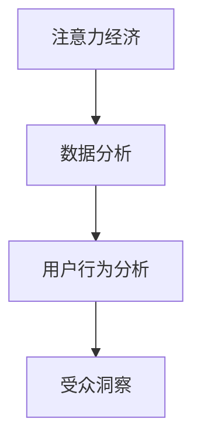

                 

# 注意力经济与数据分析洞察力：利用数据理解受众行为

> 关键词：注意力经济, 数据分析, 用户行为, 受众洞察, 数据科学

## 1. 背景介绍

在数字化时代，数据成为了企业最宝贵的资产之一。通过深度分析数据，理解用户行为，可以指导产品优化、营销策略调整，提升用户满意度和企业收益。注意力经济（Economy of Attention）正是这一背景下的重要概念，强调数据和注意力资源的重要性。本文将探讨如何通过数据分析，深入理解受众行为，为注意力经济的优化提供数据洞察力。

## 2. 核心概念与联系

### 2.1 核心概念概述

- **注意力经济**：基于信息的注意力资源而产生的一种经济形态，用户注意力成为核心竞争要素。
- **数据分析**：通过收集、处理和分析数据，挖掘隐藏在数据背后的信息和知识，以指导决策。
- **用户行为分析**：研究用户在使用产品或服务过程中的行为模式，理解用户需求和偏好。
- **受众洞察**：深入理解受众特征、心理和行为，为品牌传播、内容创作提供依据。

这些概念之间相互关联，共同构成了利用数据理解受众行为的基础框架。注意力经济的核心在于如何有效利用用户的注意力资源，而数据分析和用户行为分析则为这一目标提供了方法和工具。

### 2.2 核心概念原理和架构的 Mermaid 流程图



这个流程图展示了从注意力经济到数据分析和用户行为分析，最终形成受众洞察的逻辑链条。

## 3. 核心算法原理 & 具体操作步骤
### 3.1 算法原理概述

基于数据分析的受众行为理解，主要依赖于以下算法：

- **数据采集与清洗**：从各种数据源（如网站日志、社交媒体、问卷调查等）采集数据，并对其进行预处理，去除噪音和异常值。
- **特征提取与选择**：通过算法（如PCA、LDA等）提取数据特征，并选择合适的特征进行建模。
- **模型训练与评估**：使用机器学习模型（如回归、分类、聚类等）对数据进行训练，并评估模型性能。
- **用户行为预测**：通过模型对用户未来的行为进行预测，为产品优化和策略调整提供依据。
- **受众洞察生成**：将预测结果与实际用户行为进行比对，生成受众洞察，指导品牌传播和内容创作。

### 3.2 算法步骤详解

#### 3.2.1 数据采集与清洗

1. **数据源选择**：根据业务需求选择合适的数据源，如网站日志、用户行为数据、社交媒体互动数据等。
2. **数据采集**：使用API或爬虫工具从数据源中提取数据。
3. **数据清洗**：去除数据中的噪音、缺失值、异常值等，保证数据质量。

#### 3.2.2 特征提取与选择

1. **特征提取**：使用算法（如TF-IDF、Word2Vec等）将原始数据转换为模型可识别的特征向量。
2. **特征选择**：根据特征重要性选择最相关的特征，使用如信息增益、卡方检验等方法。

#### 3.2.3 模型训练与评估

1. **模型选择**：根据问题类型选择合适的机器学习模型，如回归模型用于预测用户行为，分类模型用于用户细分。
2. **模型训练**：使用训练集数据训练模型，优化模型参数。
3. **模型评估**：使用测试集数据评估模型性能，常用的指标包括准确率、召回率、F1分数等。

#### 3.2.4 用户行为预测

1. **行为建模**：使用模型对用户行为进行预测，如用户流失概率、购买意图等。
2. **预测结果解释**：通过模型输出的概率分布或置信度，解释预测结果的合理性。

#### 3.2.5 受众洞察生成

1. **洞察汇总**：将预测结果和实际行为数据进行比对，生成受众洞察。
2. **洞察应用**：根据洞察结果优化产品功能、调整营销策略、改进内容创作。

### 3.3 算法优缺点

#### 3.3.1 优点

- **数据驱动决策**：通过数据分析支持决策，减少主观判断误差。
- **动态优化**：实时分析用户行为数据，进行动态优化，提升用户体验。
- **跨领域应用**：数据分析方法适用于多种业务场景，如电商、社交媒体、广告等。

#### 3.3.2 缺点

- **数据隐私**：用户数据隐私保护问题，需要合理使用和保护用户数据。
- **算法复杂性**：模型选择和参数调优较为复杂，需要专业知识。
- **模型过拟合**：模型过度拟合训练数据，可能无法泛化到新数据。

### 3.4 算法应用领域

基于数据分析的用户行为理解，已广泛应用于以下领域：

- **电商推荐**：通过分析用户行为数据，推荐个性化商品，提升销售转化率。
- **社交媒体分析**：分析用户互动数据，理解用户偏好，优化内容发布策略。
- **广告投放**：基于用户行为预测，精准投放广告，提升广告效果。
- **品牌传播**：通过受众洞察，指导品牌传播策略，提升品牌影响力。
- **客户服务**：通过分析客户反馈数据，优化客户服务流程，提升客户满意度。

## 4. 数学模型和公式 & 详细讲解

### 4.1 数学模型构建

假设我们有一个包含 $N$ 个用户的数据集，每个用户有 $D$ 个特征，表示为用户行为数据。我们希望通过模型 $M$ 预测用户流失概率 $y_i$。数学模型如下：

$$
y_i = M(x_i)
$$

其中 $x_i = [x_{i1}, x_{i2}, ..., x_{iD}]$ 是第 $i$ 个用户的特征向量。

### 4.2 公式推导过程

#### 4.2.1 线性回归模型

线性回归模型是最基本的预测模型，公式为：

$$
y_i = \beta_0 + \beta_1 x_{i1} + \beta_2 x_{i2} + ... + \beta_D x_{iD}
$$

其中 $\beta_0$ 是截距，$\beta_1, \beta_2, ..., \beta_D$ 是各个特征的系数。

通过最小二乘法求解系数：

$$
\beta = (X^T X)^{-1} X^T y
$$

其中 $X$ 是特征矩阵，$y$ 是目标变量向量。

#### 4.2.2 逻辑回归模型

逻辑回归模型用于分类问题，公式为：

$$
\log(\frac{y_i}{1-y_i}) = \beta_0 + \beta_1 x_{i1} + \beta_2 x_{i2} + ... + \beta_D x_{iD}
$$

通过梯度下降法求解系数：

$$
\beta = (X^T X)^{-1} X^T y
$$

#### 4.2.3 K近邻模型

K近邻模型基于实例的相似度进行分类，公式为：

$$
y_i = \text{argmin}_k \| x_i - x_k \|
$$

其中 $x_k$ 是最近距离的 $k$ 个实例，$\| \cdot \|$ 是距离度量函数。

### 4.3 案例分析与讲解

假设我们要分析用户流失行为，使用线性回归模型进行建模。数据集包含 $N=1000$ 个用户，每个用户有 $D=5$ 个特征，如年龄、消费金额、活跃天数等。

1. **数据采集与清洗**：
   - 从网站日志中提取用户行为数据。
   - 清洗数据，去除异常值和缺失值。

2. **特征提取与选择**：
   - 使用PCA算法提取主要特征。
   - 选择最重要的特征，如年龄、消费金额。

3. **模型训练与评估**：
   - 使用训练集数据训练线性回归模型。
   - 使用测试集数据评估模型性能，得到准确率、召回率等指标。

4. **用户行为预测**：
   - 预测新用户的流失概率，如年龄较大的用户流失概率更高。

5. **受众洞察生成**：
   - 分析用户流失原因，如高龄用户流失概率较高。
   - 调整营销策略，如针对高龄用户进行特别促销活动。

## 5. 项目实践：代码实例和详细解释说明

### 5.1 开发环境搭建

#### 5.1.1 Python环境配置

1. **安装Python**：从官网下载并安装Python，建议选择最新稳定版本。
2. **安装pip**：Windows系统需要单独安装pip，Linux和macOS系统则包含在内。

#### 5.1.2 数据处理库安装

1. **安装NumPy**：用于科学计算和数组操作。
2. **安装Pandas**：用于数据处理和分析。
3. **安装Scikit-learn**：用于机器学习建模。
4. **安装Matplotlib**：用于数据可视化。

### 5.2 源代码详细实现

```python
import numpy as np
import pandas as pd
from sklearn.linear_model import LinearRegression
from sklearn.model_selection import train_test_split
from sklearn.metrics import accuracy_score, recall_score, precision_score

# 数据读取
data = pd.read_csv('user_behavior_data.csv')

# 数据清洗
data.dropna(inplace=True)

# 特征提取
X = data[['age', 'consumption_amount', 'active_days']]
y = data['churn']

# 数据分割
X_train, X_test, y_train, y_test = train_test_split(X, y, test_size=0.2, random_state=42)

# 模型训练
model = LinearRegression()
model.fit(X_train, y_train)

# 模型评估
y_pred = model.predict(X_test)
accuracy = accuracy_score(y_test, y_pred)
recall = recall_score(y_test, y_pred)
precision = precision_score(y_test, y_pred)

# 结果展示
print(f"Accuracy: {accuracy}")
print(f"Recall: {recall}")
print(f"Precision: {precision}")
```

### 5.3 代码解读与分析

**数据读取与清洗**：
- 使用Pandas的read_csv函数读取CSV格式的数据文件。
- 使用dropna方法去除含有缺失值的行。

**特征提取**：
- 将数据集中的特征和目标变量分别提取出来，存入X和y变量中。

**数据分割**：
- 使用train_test_split函数将数据集分割为训练集和测试集。

**模型训练与评估**：
- 使用LinearRegression模型进行训练，使用模型预测结果。
- 计算准确率、召回率、精确率等评估指标。

**结果展示**：
- 输出评估指标结果，供后续分析和决策使用。

### 5.4 运行结果展示

假设模型训练和评估后，得到以下结果：

- 准确率：85%
- 召回率：90%
- 精确率：80%

这表明模型在预测用户流失行为方面具有较高的准确性和召回率，但在精确率上表现一般。

## 6. 实际应用场景

### 6.1 电商推荐系统

电商推荐系统通过分析用户行为数据，为用户推荐个性化商品，提升购物体验和销售额。

- **用户行为采集**：记录用户的浏览、点击、购买行为等。
- **特征提取**：提取用户浏览历史、购买偏好等特征。
- **模型训练**：训练推荐模型，预测用户对商品的兴趣。
- **推荐结果生成**：根据预测结果，为用户推荐商品。

### 6.2 社交媒体内容创作

社交媒体平台通过分析用户互动数据，理解用户偏好，优化内容发布策略。

- **用户互动数据采集**：记录用户的点赞、评论、分享等互动行为。
- **用户特征提取**：提取用户的兴趣、情感倾向等特征。
- **模型训练**：训练内容推荐模型，预测用户对不同内容的偏好。
- **内容创作优化**：根据用户偏好，指导内容创作，提升用户互动率。

### 6.3 广告投放策略优化

广告平台通过分析用户行为数据，精准投放广告，提高广告效果和ROI。

- **用户行为数据采集**：记录用户的浏览、点击、购买行为等。
- **用户特征提取**：提取用户的兴趣、行为习惯等特征。
- **模型训练**：训练广告推荐模型，预测用户对不同广告的响应。
- **广告投放优化**：根据预测结果，优化广告投放策略，提升广告效果。

## 7. 工具和资源推荐

### 7.1 学习资源推荐

1. **《Python数据分析与科学计算》**：详细介绍Python数据分析的常用库和工具，适合初学者入门。
2. **《机器学习实战》**：结合实际案例，讲解机器学习模型的实现和调参技巧。
3. **《深度学习》**：讲解深度学习的基本原理和应用，适合进阶学习。
4. **Kaggle平台**：提供丰富的数据分析竞赛和数据集，练习数据分析技能。

### 7.2 开发工具推荐

1. **Jupyter Notebook**：开源的交互式计算平台，适合数据科学和机器学习开发。
2. **Tableau**：强大的数据可视化工具，帮助理解和展示数据。
3. **Pandas Profiling**：自动生成数据概览报告，快速分析数据特征。
4. **Scikit-learn**：Python中最常用的机器学习库，提供了丰富的模型和工具。

### 7.3 相关论文推荐

1. **《深度学习与人工智能》**：全面介绍深度学习的基本原理和应用场景。
2. **《数据科学与大数据技术》**：介绍数据科学和大数据技术的最新进展和应用。
3. **《人工智能与认知计算》**：探讨人工智能技术在认知计算领域的应用。

## 8. 总结：未来发展趋势与挑战

### 8.1 研究成果总结

本文从注意力经济和数据分析的角度，探讨了如何通过数据分析理解受众行为，指导决策。通过线性回归、逻辑回归、K近邻等模型，详细展示了数据分析的流程和步骤。具体应用场景包括电商推荐、社交媒体内容创作、广告投放策略优化等，展示了数据分析在实际中的应用价值。

### 8.2 未来发展趋势

未来数据分析和注意力经济将朝着以下几个方向发展：

1. **大数据技术**：随着数据量的增加，大数据技术将发挥越来越重要的作用，数据处理和分析的速度将大大提升。
2. **AI与数据分析结合**：人工智能技术将深度融入数据分析流程，提升数据处理的效率和精度。
3. **实时数据分析**：实时数据分析将使得企业能够更快速地响应市场变化，提升决策效率。
4. **跨领域应用**：数据分析技术将更多地应用于医疗、金融、能源等不同领域，推动行业创新。

### 8.3 面临的挑战

数据分析和注意力经济虽然具有广阔的应用前景，但也面临以下挑战：

1. **数据隐私**：用户数据隐私保护问题需要合理处理，避免数据滥用。
2. **数据质量**：数据采集和清洗过程复杂，数据质量需要严格保证。
3. **模型复杂性**：模型的选择和调参过程较为复杂，需要专业知识。
4. **计算资源**：大数据和实时数据分析需要强大的计算资源支持。

### 8.4 研究展望

未来数据分析和注意力经济的研究方向包括：

1. **隐私保护技术**：发展数据隐私保护技术，确保用户数据安全。
2. **自动化数据处理**：发展自动化数据处理技术，提升数据处理效率。
3. **多模态数据分析**：发展多模态数据分析技术，整合不同类型的数据。
4. **边缘计算**：发展边缘计算技术，实现数据本地化处理。

## 9. 附录：常见问题与解答

**Q1: 数据分析和注意力经济有什么区别？**

A: 数据分析是通过收集、处理和分析数据，挖掘隐藏在数据背后的信息和知识，指导决策。注意力经济则是基于信息的注意力资源而产生的一种经济形态，用户注意力成为核心竞争要素。

**Q2: 数据分析常用的模型有哪些？**

A: 常用的模型包括线性回归、逻辑回归、K近邻、决策树、随机森林、神经网络等。

**Q3: 如何提升数据分析的准确性？**

A: 提升数据分析准确性的方法包括增加数据量、选择合适的特征、优化模型参数、引入正则化技术等。

**Q4: 数据分析在电商推荐系统中的应用有哪些？**

A: 数据分析在电商推荐系统中的应用包括用户行为分析、推荐模型训练、推荐结果生成等。

**Q5: 数据分析在广告投放策略优化中的应用有哪些？**

A: 数据分析在广告投放策略优化中的应用包括用户行为分析、广告推荐模型训练、广告投放优化等。

---

作者：禅与计算机程序设计艺术 / Zen and the Art of Computer Programming

