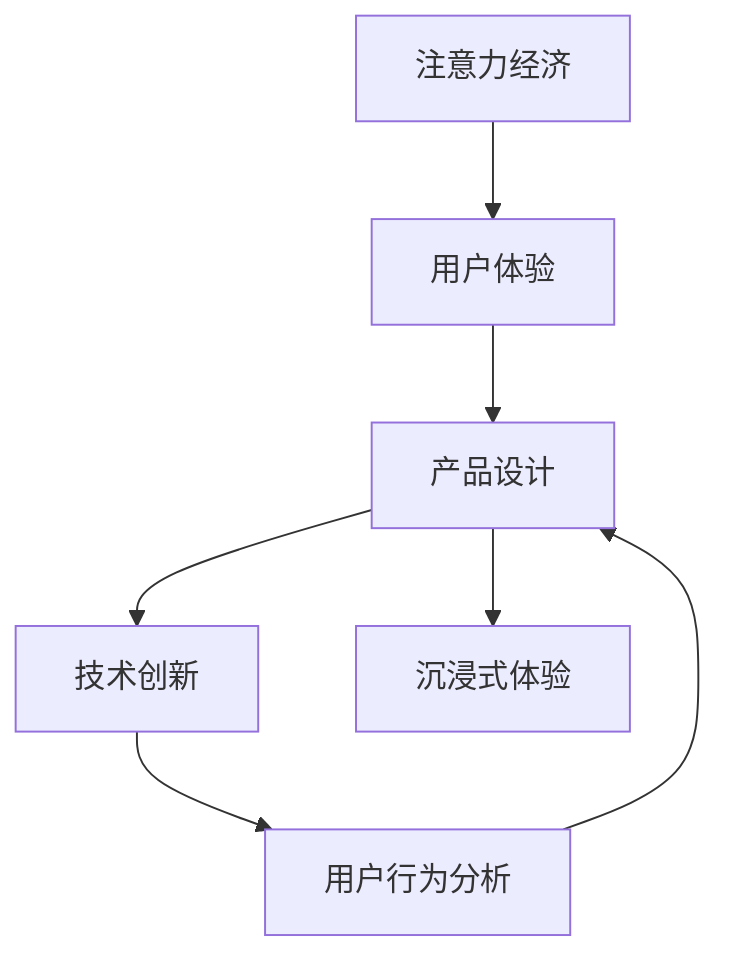

                 

# 注意力经济与用户体验优化策略与技术：创建令人沉浸的产品

> 关键词：注意力经济,用户体验,产品设计,沉浸式体验,技术创新,用户行为分析,数据驱动优化

## 1. 背景介绍

在互联网时代，随着信息爆炸和竞争加剧，注意力经济成为各方争夺的焦点。用户体验（UX）成为了竞争的制胜关键。如何创建令人沉浸的产品，满足用户需求，提升用户粘性，成为产品开发者的核心诉求。本文将深入探讨注意力经济与用户体验优化策略，剖析技术创新如何赋能产品设计，通过案例分析与技术讲解，为产品开发者提供全面的策略与实践指南。

### 1.1 问题由来
随着移动互联网的普及和智能设备的普及，人们的注意力分散日益严重。据统计，用户的注意力平均只能维持7秒，这就要求产品必须设计成易读易用，并且能够在短时间内吸引并留住用户。用户体验（UX）优化的重要性日益凸显，成为决定产品成败的关键。尤其在注意力稀缺的背景下，如何精准把握用户需求，设计出令人沉浸的产品，成为各互联网公司不断探索的课题。

### 1.2 问题核心关键点
用户体验优化涉及产品设计的各个环节，从功能定义、界面设计到交互逻辑，每个细节都关系到用户的沉浸感。核心的优化目标包括：
- **功能设计与用户体验**：功能是否符合用户需求，操作是否流畅简单。
- **界面设计**：界面布局是否美观，信息结构是否清晰。
- **交互体验**：用户与产品互动是否自然，是否满足用户心理预期。
- **性能与响应**：产品的响应速度与性能是否良好，用户等待是否感受良好。

## 2. 核心概念与联系

### 2.1 核心概念概述

为更好地理解注意力经济与用户体验优化策略，本节将介绍几个关键概念及其相互关系：

- **注意力经济**：指信息社会中，对注意力的争夺与分配所形成的经济形态。
- **用户体验（UX）**：指用户在使用产品时的情感体验，包括易用性、响应速度、设计美感等多个维度。
- **沉浸式体验**：指用户在使用产品时全身心投入，不受外界干扰的状态。
- **产品设计**：从功能到界面，从交互到反馈，综合考虑用户体验的各个方面，打造令用户沉浸的产品。
- **技术创新**：通过先进的技术手段，提升产品性能，优化用户体验。
- **用户行为分析**：利用数据驱动，洞察用户使用行为，优化产品设计。

这些概念之间的关系，可以通过以下Mermaid流程图来展示：



该流程图展示了一个循环迭代的用户体验优化过程，即在产品设计阶段通过技术创新提升用户体验，通过用户行为分析不断迭代优化。产品设计需要综合考虑技术、用户行为等多个维度，不断提升用户沉浸感。

## 3. 核心算法原理 & 具体操作步骤

### 3.1 算法原理概述

基于用户体验优化的产品设计，其核心在于提升用户的使用满意度。用户体验可以通过定量和定性两个维度来衡量，其中定量指标包括响应时间、成功率等，定性指标包括用户满意度、用户留存率等。

用户体验优化的核心算法原理包括：

- **A/B测试**：将用户分为两组，分别使用不同的产品设计，通过比较两组的指标（如点击率、转化率等）来优化产品设计。
- **用户行为分析**：通过数据分析用户的点击、停留、分享等行为，来优化产品功能和交互。
- **用户情感分析**：通过自然语言处理技术，分析用户的评论、反馈，来提升产品的情感设计。
- **AIOps**：结合AI与运维，通过实时监控产品性能，预测潜在问题，快速修复，提升用户体验。

### 3.2 算法步骤详解

用户体验优化涉及多个环节，包括以下关键步骤：

**Step 1: 数据收集与处理**
- 通过分析工具（如Mixpanel、Amplitude等）收集用户行为数据。
- 使用A/B测试工具（如Google Optimize、Optimizely等）进行分组实验。
- 通过情感分析工具（如Brandwatch、NLP分析等）收集用户情感反馈。

**Step 2: 用户行为分析**
- 使用数据分析技术（如聚类、回归分析等）识别用户行为模式。
- 使用可视化工具（如Tableau、Power BI等）展现数据分析结果，辅助决策。

**Step 3: 产品设计迭代**
- 根据分析结果，设计A/B测试方案，优化产品界面和交互。
- 通过用户情感分析反馈，不断调整设计方案。
- 使用AIOps技术实时监控产品性能，预测潜在问题，提升产品稳定性。

**Step 4: 测试与优化**
- 通过A/B测试评估优化效果。
- 根据测试结果，调整产品设计，重复进行迭代优化。
- 定期收集用户反馈，进一步优化产品。

### 3.3 算法优缺点

用户体验优化涉及多个环节和多种技术手段，其优点和缺点如下：

**优点：**
- **数据驱动**：通过用户行为和情感分析，能够精准把握用户需求。
- **持续改进**：通过A/B测试和AIOps，实现产品迭代优化。
- **提升满意度**：通过优化产品功能和设计，提升用户满意度，增加用户留存。

**缺点：**
- **成本高**：需要大量数据收集和分析工具，成本较高。
- **复杂度高**：涉及多个环节和多种技术手段，实施难度较大。
- **时间周期长**：从数据收集到设计优化，再到测试评估，周期较长。

尽管存在这些局限性，但用户体验优化的整体效果显著，能够显著提升产品的市场竞争力。

### 3.4 算法应用领域

用户体验优化的设计理念和方法，不仅适用于互联网产品，还可应用于各种硬件产品和服务领域，包括：

- **移动应用**：通过优化界面设计、提升响应速度，提升用户使用满意度。
- **电商网站**：通过个性化推荐、动态定价等手段，提高用户购买转化率。
- **智能家居**：通过语音控制、自动化设置，提升用户便利性。
- **在线教育**：通过互动学习、实时反馈，提升学习效果。
- **智能广告**：通过行为分析，优化广告投放，提升广告效果。

## 4. 数学模型和公式 & 详细讲解 & 举例说明

### 4.1 数学模型构建

用户体验优化涉及多个维度，可通过多个数学模型来量化分析。以下以用户留存率为目标，进行数学模型构建：

假设用户总数为$N$，第$i$个用户在$n$天后的留存率为$P_i$，则总体的用户留存率$R$可以表示为：

$$
R = \frac{1}{N} \sum_{i=1}^N P_i
$$

其中，用户留存率$P_i$可以进一步表示为：

$$
P_i = \frac{C_i}{N}
$$

其中$C_i$为在第$i$天之后仍然活跃的用户数。

### 4.2 公式推导过程

为了提升用户留存率$R$，可考虑以下优化措施：

- **功能优化**：提升产品的易用性和功能性，从而吸引更多用户，增加活跃用户数$C_i$。
- **界面美化**：提升产品的视觉效果，吸引用户停留更长时间。
- **互动增强**：通过增加互动元素，如推荐系统、社交功能等，提高用户黏性。
- **广告投放**：通过精准投放，吸引新用户，增加活跃用户数$C_i$。

为实现上述优化目标，可通过回归分析模型（如线性回归、决策树等）来预测用户留存率$P_i$，进而设计优化策略。

### 4.3 案例分析与讲解

以电商网站为例，分析如何通过数据驱动提升用户留存率。

**数据收集与处理**：
- 收集用户点击、浏览、购买、退货等行为数据。
- 使用A/B测试工具，将用户分为实验组和对照组，分别测试不同的界面设计和功能优化方案。
- 通过情感分析工具，收集用户对产品界面的反馈。

**用户行为分析**：
- 通过数据分析，识别用户行为模式，如特定时间段内活跃用户数量、不同功能模块的使用频率等。
- 使用可视化工具，展现数据分析结果，辅助决策。

**产品设计迭代**：
- 根据分析结果，设计A/B测试方案，如更改按钮颜色、增加功能模块等，优化产品界面和功能。
- 通过情感分析反馈，不断调整设计方案。
- 使用AIOps技术实时监控产品性能，预测潜在问题，提升产品稳定性。

**测试与优化**：
- 通过A/B测试评估优化效果。
- 根据测试结果，调整产品设计，重复进行迭代优化。
- 定期收集用户反馈，进一步优化产品。

通过上述案例分析，可以看出，用户体验优化是一个循环迭代的过程，需要综合考虑数据、行为、情感等多个维度，不断优化产品设计和功能，最终提升用户留存率。

## 5. 项目实践：代码实例和详细解释说明

### 5.1 开发环境搭建

在进行用户体验优化项目开发时，需要先搭建好开发环境。以下是使用Python进行Web开发的环境配置流程：

1. 安装Python：从官网下载并安装Python，如3.8版本。
2. 安装Flask框架：
```bash
pip install flask
```

3. 安装SQLAlchemy库：
```bash
pip install sqlalchemy
```

4. 安装Flask-RESTful扩展：
```bash
pip install flask-restful
```

5. 安装Flask-RESTful-Admin扩展：
```bash
pip install flask-restful-admin
```

完成上述步骤后，即可在Python环境中开始用户体验优化项目开发。

### 5.2 源代码详细实现

以下是一个简单的Web应用示例，用于展示如何使用Flask框架进行用户体验优化：

```python
from flask import Flask, jsonify, request
from flask_restful import Resource, Api
from flask_restful_admin import Admin
from flask_sqlalchemy import SQLAlchemy

app = Flask(__name__)
api = Api(app)
admin = Admin(app, name='admin', template_mode='bootstrap3')

# 数据库配置
app.config['SQLALCHEMY_DATABASE_URI'] = 'sqlite:////tmp/test.db'
db = SQLAlchemy(app)

# 定义数据模型
class User(db.Model):
    id = db.Column(db.Integer, primary_key=True)
    name = db.Column(db.String(50))
    age = db.Column(db.Integer)

# 定义API接口
class UserResource(Resource):
    def get(self, id):
        user = User.query.get(id)
        if user:
            return jsonify({'id': user.id, 'name': user.name, 'age': user.age})
        else:
            return jsonify({'error': 'User not found'})

# 注册API接口
api.add_resource(UserResource, '/user/<int:id>')

# 定义管理界面
class UserAdmin(Admin.ModelView):
    column_exclude_list = ['password']
    can_create = False
    can_edit = False
    can_delete = False

admin.add_view(UserAdmin(User, db, admin_name='User'))

if __name__ == '__main__':
    app.run(debug=True)
```

### 5.3 代码解读与分析

让我们再详细解读一下关键代码的实现细节：

**Flask框架**：
- Flask是一个轻量级的Python Web框架，便于快速开发和部署Web应用。
- 通过Flask-RESTful扩展，可以方便地创建RESTful风格的API接口。

**SQLAlchemy库**：
- SQLAlchemy是一个Python ORM库，用于简化数据库操作。
- 通过SQLAlchemy，可以方便地定义数据模型，实现数据库操作。

**Flask-RESTful-Admin扩展**：
- Flask-RESTful-Admin是一个基于Flask的Web管理界面，方便对数据进行管理。
- 通过Flask-RESTful-Admin，可以方便地实现用户管理、数据监控等功能。

**Web应用实例**：
- 在上述代码中，定义了一个简单的Web应用，用于展示如何使用Flask框架进行用户体验优化。
- 通过Flask-RESTful扩展，创建了一个用户API接口，用于获取用户信息。
- 使用SQLAlchemy库定义了用户数据模型，用于存储和查询用户信息。
- 使用Flask-RESTful-Admin扩展，实现了用户管理界面，方便对用户信息进行管理。

该Web应用代码简单，但通过Flask框架和SQLAlchemy库，可以方便地实现用户信息的管理和展示，为后续的用户行为分析提供了基础数据支持。

## 6. 实际应用场景

### 6.1 移动应用

移动应用是用户体验优化的重要领域之一。用户对移动应用的使用体验要求极高，如何提升应用的易用性、速度和性能，成为设计优化的核心目标。

以移动社交应用为例，分析如何通过用户体验优化提升用户满意度。

**数据收集与处理**：
- 收集用户在应用内的点击、滑动、停留等行为数据。
- 使用A/B测试工具，将用户分为实验组和对照组，分别测试不同的UI设计方案。
- 通过情感分析工具，收集用户对应用的反馈。

**用户行为分析**：
- 通过数据分析，识别用户行为模式，如不同功能模块的使用频率、用户停留时间等。
- 使用可视化工具，展现数据分析结果，辅助决策。

**产品设计迭代**：
- 根据分析结果，设计A/B测试方案，如更改图标颜色、增加功能提示等，优化应用UI和功能。
- 通过情感分析反馈，不断调整设计方案。
- 使用AIOps技术实时监控应用性能，预测潜在问题，提升应用稳定性。

**测试与优化**：
- 通过A/B测试评估优化效果。
- 根据测试结果，调整应用设计，重复进行迭代优化。
- 定期收集用户反馈，进一步优化应用。

通过上述案例分析，可以看出，用户体验优化是一个循环迭代的过程，需要综合考虑数据、行为、情感等多个维度，不断优化应用设计和功能，最终提升用户满意度。

### 6.2 电商网站

电商网站是用户体验优化的另一个重要领域。电商网站的销售转化率直接关系到公司的业绩，因此提升用户体验至关重要。

以某知名电商平台为例，分析如何通过用户体验优化提升销售转化率。

**数据收集与处理**：
- 收集用户在网站内的点击、浏览、购买、退货等行为数据。
- 使用A/B测试工具，将用户分为实验组和对照组，分别测试不同的界面设计和功能优化方案。
- 通过情感分析工具，收集用户对网站的反馈。

**用户行为分析**：
- 通过数据分析，识别用户行为模式，如不同商品页面的停留时间、购买转化率等。
- 使用可视化工具，展现数据分析结果，辅助决策。

**产品设计迭代**：
- 根据分析结果，设计A/B测试方案，如更改商品展示方式、增加用户评价等，优化网站界面和功能。
- 通过情感分析反馈，不断调整设计方案。
- 使用AIOps技术实时监控网站性能，预测潜在问题，提升网站稳定性。

**测试与优化**：
- 通过A/B测试评估优化效果。
- 根据测试结果，调整网站设计，重复进行迭代优化。
- 定期收集用户反馈，进一步优化网站。

通过上述案例分析，可以看出，用户体验优化是一个循环迭代的过程，需要综合考虑数据、行为、情感等多个维度，不断优化网站设计和功能，最终提升销售转化率。

## 7. 工具和资源推荐

### 7.1 学习资源推荐

为了帮助开发者系统掌握用户体验优化的理论基础和实践技巧，这里推荐一些优质的学习资源：

1. **《设计心理学》（Don Norman）**：这是一本经典的设计心理学著作，详细介绍了用户体验设计的心理学原理和设计方法。
2. **《响应式Web设计》（Ethan Marcotte）**：介绍了响应式设计的基本原理和技术手段，帮助开发者设计适配不同设备的网站和应用。
3. **《UX Design》课程**：由Coursera和Udacity等在线平台提供，系统讲解用户体验设计的各个环节，包括用户研究、交互设计等。
4. **《UX Design Patterns》书籍**：介绍了大量的用户体验设计模式，帮助开发者快速借鉴和应用设计思路。
5. **《UX Design System》视频**：由UX Design System网站提供，讲解如何构建可复用的设计系统，提升设计效率。

通过这些资源的学习实践，相信你一定能够快速掌握用户体验优化的精髓，并用于解决实际的NLP问题。

### 7.2 开发工具推荐

高效的开发离不开优秀的工具支持。以下是几款用于用户体验优化开发的常用工具：

1. **JIRA**：项目管理工具，帮助团队协调设计任务、跟踪进度。
2. **Adobe XD**：设计工具，用于绘制和模拟设计方案。
3. **Sketch**：设计工具，支持多种设备和平台，方便设计师进行界面设计。
4. **Figma**：云端设计工具，方便团队协作和实时修改设计。
5. **InVision**：设计工具，支持设计原型和互动效果展示，方便团队评审和反馈。

合理利用这些工具，可以显著提升用户体验优化任务的开发效率，加快创新迭代的步伐。

### 7.3 相关论文推荐

用户体验优化的研究源于学界的持续探索。以下是几篇奠基性的相关论文，推荐阅读：

1. **《The User Interface, Volume II: Research Monograph》**：由Nielsen等人编写，详细介绍了用户体验设计的各个方面，如可用性、易用性、可访问性等。
2. **《Designing for Interaction》**：介绍用户体验设计的核心原则和方法，帮助设计师打造优秀的用户体验。
3. **《Interaction Design Foundation》**：提供大量的用户体验设计课程和资源，涵盖从基础到高级的内容。
4. **《User Experience Insight》**：提供大量用户体验设计的实践案例和分析，帮助开发者应用设计思路。

这些论文代表了大用户体验优化设计的演变脉络。通过学习这些前沿成果，可以帮助研究者把握学科前进方向，激发更多的创新灵感。

## 8. 总结：未来发展趋势与挑战

### 8.1 总结

本文对用户体验优化的原理、策略和实践进行了全面系统的介绍。首先阐述了用户体验优化的背景和意义，明确了用户体验优化在产品设计中的核心地位。其次，从原理到实践，详细讲解了用户体验优化的数学模型和关键步骤，给出了用户体验优化任务开发的完整代码实例。同时，本文还广泛探讨了用户体验优化在移动应用、电商网站等多个领域的应用前景，展示了用户体验优化的巨大潜力。最后，本文精选了用户体验优化的各类学习资源，力求为开发者提供全方位的技术指引。

通过本文的系统梳理，可以看到，用户体验优化是一个循环迭代的过程，需要综合考虑数据、行为、情感等多个维度，不断优化产品设计和功能，最终提升用户满意度。未来，伴随用户体验优化技术的持续演进，相信产品设计将更加智能化、人性化，用户沉浸感将进一步提升，用户体验优化将迎来更加广阔的应用前景。

### 8.2 未来发展趋势

展望未来，用户体验优化的发展趋势如下：

1. **数据驱动优化**：通过大数据分析，精准把握用户需求，提升用户体验。
2. **AI与用户体验结合**：利用AI技术优化产品功能和界面设计，提升用户互动体验。
3. **多设备协同**：实现不同设备之间的无缝切换和协同，提升用户体验一致性。
4. **个性化定制**：通过个性化推荐和定制化设计，提升用户满意度。
5. **实时反馈与优化**：通过实时监控和反馈，快速响应用户需求，提升用户体验。

这些趋势凸显了用户体验优化技术的广阔前景。这些方向的探索发展，必将进一步提升用户体验，满足用户对更高质量的产品需求。

### 8.3 面临的挑战

尽管用户体验优化的整体效果显著，但在迈向更加智能化、普适化应用的过程中，它仍面临着诸多挑战：

1. **成本高昂**：用户体验优化涉及大量数据收集和分析，成本较高。
2. **实施复杂**：涉及多个环节和多种技术手段，实施难度较大。
3. **用户变化**：用户需求不断变化，用户体验优化需要不断迭代。
4. **技术瓶颈**：部分用户体验优化技术尚不成熟，需要进一步研究。
5. **资源占用**：用户体验优化对计算资源和存储资源的要求较高。

尽管存在这些挑战，但用户体验优化的整体效果显著，能够显著提升产品的市场竞争力。未来，伴随技术的不断进步和成本的降低，用户体验优化将更加智能化、自动化，为产品开发者带来更多便利。

### 8.4 研究展望

面对用户体验优化所面临的种种挑战，未来的研究需要在以下几个方面寻求新的突破：

1. **数据处理技术**：发展高效的数据处理技术，降低用户体验优化成本。
2. **自动化优化**：研发自动化优化工具，减少人工干预，提升优化效率。
3. **跨领域应用**：探索用户体验优化在其他领域的推广应用，如智能制造、智慧医疗等。
4. **模型优化**：提升用户体验优化模型的准确性和泛化能力。
5. **多模态体验**：研究多模态用户体验优化方法，如语音交互、手势控制等。

这些研究方向的探索，必将引领用户体验优化技术迈向更高的台阶，为产品开发者带来更多便利和创新灵感。总之，用户体验优化需要不断创新、不断优化，才能不断满足用户需求，提升产品市场竞争力。

## 9. 附录：常见问题与解答

**Q1: 用户体验优化的核心目标是什么？**

A: 用户体验优化的核心目标是提升用户的使用满意度，通过优化产品的易用性、速度、性能、界面设计、交互逻辑等多个维度，让用户在使用的过程中感到舒适、自然、愉悦，从而提升用户留存和忠诚度。

**Q2: 如何衡量用户体验的优劣？**

A: 用户体验的优劣可以通过多种指标来衡量，如用户满意度、用户留存率、点击率、转化率、页面停留时间等。这些指标可以根据具体场景和产品类型进行选择。

**Q3: 用户体验优化需要考虑哪些因素？**

A: 用户体验优化需要考虑多个因素，包括用户需求、技术手段、设计美感、性能和响应速度等。其中，用户需求是最重要的因素，其他因素需要围绕用户需求进行优化。

**Q4: 用户体验优化如何进行迭代优化？**

A: 用户体验优化是一个循环迭代的过程，一般包括以下步骤：
1. 数据收集与处理：收集用户行为数据，使用A/B测试工具进行分组实验。
2. 用户行为分析：通过数据分析识别用户行为模式。
3. 产品设计迭代：根据分析结果设计A/B测试方案，优化产品设计和功能。
4. 测试与优化：通过A/B测试评估优化效果，不断调整产品设计。
5. 用户反馈：定期收集用户反馈，进一步优化产品。

**Q5: 用户体验优化和注意力经济的关系是什么？**

A: 用户体验优化的本质是提升用户对产品的满意度和留存率，而注意力经济则是指在信息社会中对注意力的争夺与分配所形成的经济形态。两者密切相关，用户体验优化能够吸引并留住用户，从而提升产品的商业价值，吸引更多的注意力，形成注意力经济效应。

---

作者：禅与计算机程序设计艺术 / Zen and the Art of Computer Programming

