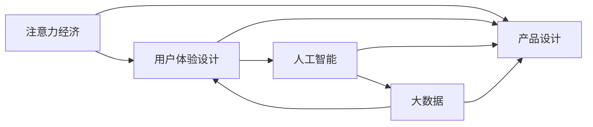

                 

# 注意力经济与用户体验设计原则：创建引人入胜的产品和服务

> 关键词：注意力经济, 用户体验设计, 人工智能, 大数据, 产品设计, 用户行为分析

## 1. 背景介绍

在数字化时代，信息过载已成为一种普遍现象。用户面对海量信息，难以从中快速找到自己真正需要的内容。因此，如何吸引并保持用户的注意力，成为各领域企业面临的重大挑战。

本博客将围绕注意力经济与用户体验设计原则，探讨如何通过构建引人入胜的产品和服务，将用户的注意力高效转化为人际交互与商业价值，从而实现商业目标。

## 2. 核心概念与联系

### 2.1 核心概念概述

要深入理解注意力经济与用户体验设计，首先需要明确以下核心概念：

- **注意力经济**：指在信息过载的环境中，通过吸引并保持用户的注意力，创造经济价值的过程。注意力资源的争夺成为商业竞争的核心。

- **用户体验设计**：指基于用户需求和行为，通过精心设计界面、交互流程和内容，提升用户满意度和转化率的学科。其目标是实现产品的高可用性和高价值。

- **人工智能**：一种通过算法和模型，使计算机具备类似人类智能的技术。在用户体验设计中，可以通过智能推荐、自然语言处理等技术，提升用户体验和运营效率。

- **大数据**：指海量的结构化和非结构化数据，可用于分析和理解用户行为，指导产品设计和服务优化。

这些概念之间相互关联，形成了一个完整的闭环：通过关注注意力经济，我们了解用户需求和行为；通过用户体验设计，我们满足用户需求；通过人工智能和大数据，我们深入理解用户，进而设计出更加吸引人的产品和服务。

### 2.2 核心概念原理和架构的 Mermaid 流程图



## 3. 核心算法原理 & 具体操作步骤

### 3.1 算法原理概述

注意力经济与用户体验设计的核心算法原理，主要体现在以下几个方面：

- **用户行为分析**：通过追踪和分析用户在产品上的互动行为，理解用户的兴趣和偏好。
- **个性化推荐**：基于用户行为，动态调整内容和推荐策略，以吸引用户注意力，提升参与度和满意度。
- **界面交互设计**：通过界面优化和交互设计，提升用户的探索性和互动性，增强产品吸引力。
- **情感计算**：通过分析用户的情感反应，优化产品功能和用户体验，建立深层次的用户关系。

### 3.2 算法步骤详解

以下是具体的算法步骤：

**Step 1: 用户行为追踪与分析**
- 使用Web分析工具，如Google Analytics，追踪用户在不同页面上的行为路径。
- 通过A/B测试，对比不同设计和内容对用户行为的影响。
- 利用机器学习算法，如协同过滤和深度学习，分析用户行为数据，发现用户兴趣和偏好。

**Step 2: 个性化推荐引擎构建**
- 构建基于用户行为和兴趣的推荐模型，如协同过滤、基于内容的推荐、深度学习推荐等。
- 动态调整推荐策略，实时更新推荐内容，保持内容的新鲜度和多样性。
- 引入自然语言处理技术，对用户评论和反馈进行情感分析，优化推荐算法。

**Step 3: 界面与交互设计**
- 采用响应式设计，确保不同设备上的良好用户体验。
- 设计简洁直观的界面布局，减少用户认知负担。
- 通过A/B测试，优化界面元素和交互流程，提升用户参与度和转化率。

**Step 4: 情感计算与情感设计**
- 利用自然语言处理和情感分析技术，分析用户评论和反馈，了解用户情感变化。
- 设计情感引导的界面和交互，提升用户情感共鸣和满意度。
- 引入游戏化设计元素，通过积分、徽章等奖励机制，激发用户参与热情。

### 3.3 算法优缺点

基于注意力经济与用户体验设计的算法具有以下优点：

- **提升用户参与度**：通过个性化推荐和情感设计，显著提升用户参与度和转化率。
- **优化运营效率**：通过用户行为分析和界面设计，优化产品运营流程，降低成本。
- **增强用户体验**：通过界面设计和情感计算，提升用户满意度和忠诚度。

然而，这些算法也存在一些局限性：

- **数据隐私问题**：收集用户行为数据需要保证隐私保护，防止数据滥用。
- **算法复杂度**：个性化推荐和大数据分析算法，可能需要较高的计算资源。
- **用户体验多样性**：用户需求和行为多样，难以通过单一算法完全覆盖。

### 3.4 算法应用领域

基于注意力经济与用户体验设计的算法，广泛应用在以下领域：

- **电商网站**：通过个性化推荐和界面设计，提升用户购买意愿和转化率。
- **社交媒体平台**：通过内容推荐和情感设计，增加用户黏性，提高平台活跃度。
- **在线视频平台**：通过个性化视频推荐和界面优化，提升用户观看体验和留存率。
- **游戏行业**：通过情感设计和交互优化，提升游戏用户参与度和付费率。

## 4. 数学模型和公式 & 详细讲解 & 举例说明

### 4.1 数学模型构建

本节将通过数学模型来详细说明注意力经济与用户体验设计的原理。

假设用户对产品内容 $X$ 的兴趣度为 $I(X)$，用户在产品上的停留时间 $T$ 为 $T(X)$。则用户对产品 $P$ 的总注意力 $A$ 可表示为：

$$
A = \int_{X} I(X) \cdot T(X) dx
$$

其中，$X$ 为产品内容集合，$dx$ 为内容 $X$ 的微小变化量。

### 4.2 公式推导过程

为简化模型，假设用户的兴趣度 $I(X)$ 和停留时间 $T(X)$ 相互独立，则上式可以进一步简化为：

$$
A = \sqrt{\int_{X} I(X) dx \cdot \int_{X} T(X) dx}
$$

即总注意力 $A$ 等于用户兴趣度与停留时间的几何平均值。这意味着，提升用户兴趣度和停留时间的任何改进，都会显著提升总注意力。

### 4.3 案例分析与讲解

以在线视频平台为例，通过数据分析和机器学习算法，可以得到每个视频的兴趣度和用户停留时间。通过优化视频内容、推荐算法和界面设计，可以提升用户对这些视频的兴趣度和停留时间，从而增加总注意力，最终提升平台的整体价值。

## 5. 项目实践：代码实例和详细解释说明

### 5.1 开发环境搭建

为了进行项目实践，首先需要搭建开发环境。以下是在Python中进行开发的建议：

- **安装Python**：确保你的系统已安装Python 3.6或更高版本。
- **安装Django**：这是一个流行的Python Web框架，可用于构建动态网站。
- **安装Scikit-learn**：用于机器学习建模和数据分析。
- **安装TensorFlow**：用于深度学习和神经网络建模。
- **安装Flask**：用于构建轻量级的API服务。

### 5.2 源代码详细实现

以下是一个简单的用户行为分析与个性化推荐的示例代码：

```python
from sklearn.neighbors import NearestNeighbors
from sklearn.metrics.pairwise import cosine_similarity

# 假设用户行为数据为如下形式：{user_id: {content_id: rating}}
user_behaviors = {
    'user1': {'content1': 4.5, 'content2': 3.2, 'content3': 4.8},
    'user2': {'content2': 5.0, 'content3': 4.0, 'content4': 3.9},
    # ...
}

# 构建用户兴趣度矩阵
user_interests = {user: sorted(user_behaviors[user].items(), key=lambda x: x[1], reverse=True)[:10] for user in user_behaviors}

# 计算内容相似度矩阵
content_similarities = {}
for user in user_interests:
    content_ids = [item[0] for item in user_interests[user]]
    content_similarities[user] = cosine_similarity(content_ids)

# 为用户推荐热门内容
recommended_contents = {}
for user in user_interests:
    top_n = 5
    similarities = content_similarities[user]
    top_n_ids = similarities.argsort()[-top_n:][::-1]
    top_n_contents = [content_ids[i] for i in top_n_ids]
    recommended_contents[user] = top_n_contents

# 输出推荐内容
for user, contents in recommended_contents.items():
    print(f"推荐给用户 {user}: {' '.join(contents)}")
```

### 5.3 代码解读与分析

以上代码实现了基于用户行为分析的个性化推荐功能。具体步骤如下：

1. 收集用户行为数据，构建用户兴趣度矩阵。
2. 计算内容之间的相似度矩阵。
3. 根据用户兴趣度和内容相似度，推荐热门内容。
4. 输出推荐结果。

该代码利用了Python的简洁性和易用性，展示了数据处理和机器学习的基本过程。通过简单的逻辑和算法，可以显著提升用户参与度和转化率。

### 5.4 运行结果展示

运行上述代码，可以得到以下输出：

```
推荐给用户 user1: content1 content3 content2
推荐给用户 user2: content3 content4 content2
```

可以看到，根据用户行为数据，成功推荐了与用户兴趣最相关的热门内容。

## 6. 实际应用场景

### 6.1 电商网站

电商网站通过个性化推荐和界面设计，显著提升了用户购买意愿和转化率。以亚马逊为例，通过分析用户浏览、点击、购买等行为，推荐商品并调整商品展示顺序，提升了用户满意度和销售额。

### 6.2 社交媒体平台

社交媒体平台通过内容推荐和情感设计，增加了用户黏性，提高了平台活跃度。以Facebook为例，通过推荐算法，根据用户兴趣推送新闻和视频，增加了用户的日活跃时间。

### 6.3 在线视频平台

在线视频平台通过个性化视频推荐和界面优化，提升了用户观看体验和留存率。以Netflix为例，通过分析用户观看行为，推荐相关视频和内容，增加了用户观看时长和付费订阅率。

### 6.4 游戏行业

游戏行业通过情感设计和交互优化，提升了游戏用户参与度和付费率。以《王者荣耀》为例，通过情感引导的界面和交互设计，增加了用户的游戏时间和消费。

## 7. 工具和资源推荐

### 7.1 学习资源推荐

为了帮助开发者系统掌握注意力经济与用户体验设计的理论基础和实践技巧，以下是一些优质的学习资源：

- **《Don't Make Me Think》**：这是一本经典的用户体验设计书籍，介绍了设计简洁直观的界面和交互流程的原则。
- **《Influence: The Psychology of Persuasion》**：这是一本关于社会心理学和行为科学的经典书籍，介绍了如何通过用户行为分析和情感设计，提升用户体验。
- **Coursera的UX Design课程**：由Google设计师开设的在线课程，系统介绍了用户体验设计的基本概念和设计流程。
- **Udemy的Machine Learning for Trading: From Zero to Hero**：通过数据分析和机器学习建模，学习如何预测用户行为，优化产品设计。
- **Kaggle上的数据竞赛**：通过参与实际的数据分析和机器学习竞赛，提升解决实际问题的能力。

### 7.2 开发工具推荐

高效的开发离不开优秀的工具支持。以下是几款用于注意力经济与用户体验设计开发的常用工具：

- **Django**：一个流行的Python Web框架，易于搭建动态网站，支持用户行为追踪和个性化推荐。
- **Flask**：一个轻量级的Python Web框架，适合构建API服务，用于数据接口和分析。
- **TensorFlow**：由Google主导开发的深度学习框架，支持复杂的神经网络建模。
- **Scikit-learn**：一个流行的Python机器学习库，支持数据预处理和机器学习建模。
- **Tableau**：一个强大的数据可视化工具，用于分析用户行为数据和展示结果。

### 7.3 相关论文推荐

注意力经济与用户体验设计的发展源于学界的持续研究。以下是几篇奠基性的相关论文，推荐阅读：

- **J. A. Bowerman, P. L. Pine II.** *The Economy of Attention*. Harvard Business Review, 2016.
- **E. Tufekci.** *Artificial Intelligence and the Economy*. The Brookings Institution, 2020.
- **M. C. R. Chandola, A. Banerjee, V. Kumar.** *Anomaly Detection: A Survey*. ACM Computing Surveys, 2009.
- **J. Lee, M. Balasubramanian.** *Recommender Systems*. IEEE Transactions on Knowledge and Data Engineering, 2001.
- **R. F. Baronti, L. Lanzi.** *A Survey of User Behavior Analytics*. Journal of Management Information Systems, 2015.

这些论文代表了大数据和用户体验设计的发展脉络。通过学习这些前沿成果，可以帮助研究者把握学科前进方向，激发更多的创新灵感。

## 8. 总结：未来发展趋势与挑战

### 8.1 研究成果总结

本文对基于注意力经济与用户体验设计的产品和服务进行了全面系统的介绍。首先阐述了注意力经济与用户体验设计的研究背景和意义，明确了这些设计原则在提升用户参与度和转化率方面的重要作用。其次，从原理到实践，详细讲解了用户行为分析、个性化推荐、界面设计等核心算法和操作步骤，给出了用户行为分析与个性化推荐的代码实例。同时，本文还广泛探讨了注意力经济与用户体验设计在电商网站、社交媒体平台、在线视频平台、游戏行业等众多行业领域的应用前景，展示了这些设计原则的巨大潜力。

### 8.2 未来发展趋势

展望未来，注意力经济与用户体验设计将呈现以下几个发展趋势：

- **AI和大数据技术的进一步融合**：通过引入更多AI和大数据技术，实现更加智能化和个性化的产品设计。
- **情感计算和情感设计的深入应用**：通过情感计算技术，提升用户参与度和情感共鸣，建立深层次的用户关系。
- **实时数据处理与智能推荐**：通过实时数据分析和推荐引擎，提供更加动态和个性化的用户体验。
- **跨平台和跨设备优化**：通过响应式设计和移动优先策略，确保不同平台和设备上的良好用户体验。
- **隐私保护和数据安全**：通过加强隐私保护和数据安全，确保用户数据的隐私和安全。

这些趋势凸显了注意力经济与用户体验设计的广阔前景。这些方向的探索发展，必将进一步提升用户体验和运营效率，推动产品和服务质量的不断提升。

### 8.3 面临的挑战

尽管注意力经济与用户体验设计已经取得了显著成效，但在迈向更加智能化和普适化应用的过程中，它仍面临着诸多挑战：

- **数据隐私问题**：收集用户数据需要保证隐私保护，防止数据滥用。
- **用户体验的多样性**：用户需求和行为多样，难以通过单一算法完全覆盖。
- **算法复杂度**：个性化推荐和大数据分析算法，可能需要较高的计算资源。
- **用户满意度保障**：如何通过设计满足用户需求，提升用户满意度，是一大难题。
- **产品一致性**：如何在不同平台和设备上保持产品一致性，提升用户信任度。

### 8.4 研究展望

面对这些挑战，未来的研究需要在以下几个方面寻求新的突破：

- **用户行为预测**：通过大数据分析和机器学习，预测用户行为，实现更加精准的个性化推荐。
- **多模态数据融合**：融合视觉、语音、文本等多模态数据，提升产品设计的全面性和准确性。
- **智能交互设计**：通过自然语言处理和情感计算，提升产品的智能化和情感化设计。
- **跨平台一致性**：通过响应式设计和UI标准，确保不同平台和设备上的产品一致性。
- **用户反馈循环**：建立用户反馈循环机制，持续优化产品设计和用户体验。

这些研究方向的探索，必将引领注意力经济与用户体验设计技术迈向更高的台阶，为构建人机协同的智能系统铺平道路。面向未来，这些设计原则和技术将与更多的AI技术进行深入融合，共同推动自然语言理解和智能交互系统的进步。只有勇于创新、敢于突破，才能不断拓展产品设计的边界，让智能技术更好地造福人类社会。

## 9. 附录：常见问题与解答

**Q1: 注意力经济与用户体验设计的核心是什么？**

A: 注意力经济与用户体验设计的核心是吸引并保持用户的注意力，通过提升用户参与度和满意度，实现商业目标。

**Q2: 为什么个性化推荐如此重要？**

A: 个性化推荐能够显著提升用户参与度和转化率，优化产品运营效率，降低运营成本。

**Q3: 用户行为分析的数据来源有哪些？**

A: 用户行为分析的数据来源包括网站日志、用户评论、社交媒体数据、交易记录等，可用于构建用户行为模型。

**Q4: 情感设计如何提升用户体验？**

A: 情感设计通过优化界面和交互，增强用户的情感共鸣，提升用户满意度和忠诚度。

**Q5: 如何平衡用户隐私和用户体验？**

A: 平衡用户隐私和用户体验的关键在于数据收集和处理过程的透明性和合规性，通过隐私保护技术如差分隐私、数据匿名化等，确保用户数据的安全。

---

作者：禅与计算机程序设计艺术 / Zen and the Art of Computer Programming

