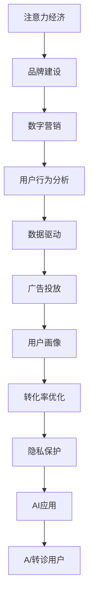

                 

# 注意力经济对企业品牌建设的新挑战

> 关键词：注意力经济, 品牌建设, 数字营销, 用户行为分析, 数据驱动, 广告投放, 用户画像, 转化率优化, 隐私保护, AI应用

## 1. 背景介绍

在互联网时代，信息过载和用户注意力稀缺成为普遍现象，这一现象催生了“注意力经济”概念的兴起。随着数字化转型深入，企业越发重视品牌建设和用户留存，注意力经济在此背景下成为推动企业增长的关键要素。企业通过各种数字营销手段争夺用户注意力，进而实现商业价值的最大化。然而，这一过程也伴随着一系列新的挑战，尤其在用户隐私保护、数据驱动策略的有效性、AI应用的伦理等方面，亟需企业高层和IT技术团队共同应对。

## 2. 核心概念与联系

### 2.1 核心概念概述

注意力经济是指在信息过载的时代，企业通过吸引和保持用户注意力以获取商业利益的经济活动。品牌建设则是在此基础上，通过建立和传播品牌形象，以提高用户忠诚度和企业市场价值。

1. **注意力经济**：以用户注意力为核心的商业模式，需要企业不断创新内容形式和传播渠道，以吸引用户注意力，并提高其参与度和转化率。

2. **品牌建设**：通过建立品牌识别、品牌联想和品牌关系，提升品牌在目标用户心中的地位，从而带来更高的客户价值和市场份额。

3. **数字营销**：利用互联网技术，如SEO、SEM、社交媒体、电子邮件营销等手段，吸引和留住用户，提升品牌影响力。

4. **用户行为分析**：通过数据分析手段，深入了解用户行为和偏好，优化产品设计和营销策略。

5. **数据驱动**：依托大数据和AI技术，基于数据洞察进行决策和优化。

6. **广告投放**：通过精准的广告投放，最大化ROI（投资回报率）。

7. **用户画像**：构建用户行为和属性画像，以更好地进行个性化推荐和定向广告。

8. **转化率优化**：通过优化网站和应用体验，提升用户转化率，增加销售收入。

9. **隐私保护**：在获取用户数据时，确保遵守隐私保护法规，保障用户隐私权益。

10. **AI应用**：运用AI技术，如自然语言处理、机器学习等，提升品牌建设的精准度和效率。

这些核心概念通过合纵连横，共同构建了企业利用注意力经济进行品牌建设的大框架。在实际应用中，企业需要综合考虑这些要素，以实现品牌与用户之间的深度互动和价值转换。

### 2.2 核心概念原理和架构的 Mermaid 流程图(Mermaid 流程节点中不要有括号、逗号等特殊字符)



## 3. 核心算法原理 & 具体操作步骤

### 3.1 算法原理概述

注意力经济和品牌建设过程中，涉及多个技术环节，包括数据采集、处理、分析、应用等。以下将分别介绍注意力经济和品牌建设中的核心算法原理。

#### 3.1.1 注意力经济

注意力经济的核心在于如何获取和保持用户的注意力。其中，搜索引擎优化（SEO）和搜索引擎营销（SEM）是两大核心技术。

1. **SEO（搜索引擎优化）**：通过优化网站内容和结构，提高在搜索引擎中的排名，吸引更多用户访问。

2. **SEM（搜索引擎营销）**：通过关键词广告和竞价排名等手段，提升广告的展示和点击率。

注意力经济的算法原理主要围绕用户行为和搜索引擎的算法机制展开。例如，PageRank算法用于衡量网页的重要性，A/B测试用于评估不同营销策略的效果，以及自然语言处理（NLP）用于理解和生成用户友好的内容。

#### 3.1.2 品牌建设

品牌建设通常通过以下几个步骤进行：

1. **品牌识别**：通过企业标识、口号和视觉元素，建立品牌独特性。

2. **品牌联想**：通过内容营销、用户口碑和公关活动，构建品牌形象。

3. **品牌关系**：通过社交媒体互动、客户服务、品牌社区等，加强与用户的关系。

品牌建设的算法原理包括品牌管理、社交媒体分析和用户关系管理等。例如，K-means聚类用于用户群体的划分，社交媒体情感分析用于评估品牌形象，以及用户行为预测模型用于个性化营销。

### 3.2 算法步骤详解

#### 3.2.1 注意力经济

**SEO** 步骤：

1. **关键词研究**：使用工具（如Google Keyword Planner）查找与业务相关的高搜索量低竞争度的关键词。

2. **内容优化**：根据关键词进行页面内容的优化，提升页面质量得分（Quality Score）。

3. **技术优化**：包括网站速度优化、移动端适配、网站结构优化等，提升用户体验和搜索引擎抓取效率。

4. **数据分析**：使用Google Analytics等工具，监测网站流量和转化率，进行A/B测试，优化营销策略。

**SEM** 步骤：

1. **广告投放**：选择合适的广告平台（如Google Ads、Bing Ads）和关键词，设置出价和预算。

2. **广告管理**：使用工具（如AdWords Editor）管理广告组和关键字，进行广告竞价调整。

3. **数据分析**：监测广告展示量和点击率，进行关键词优化和广告创意优化。

#### 3.2.2 品牌建设

**品牌识别**：

1. **视觉元素设计**：设计统一的logo、色彩、字体等视觉元素，建立品牌识别度。

2. **品牌口号和宣传语**：设计简短易记的品牌口号和宣传语，传递品牌核心价值。

**品牌联想**：

1. **内容营销**：通过博客、视频、社交媒体等形式，发布有价值的内容，提升品牌权威性。

2. **公关活动**：举办新闻发布会、慈善活动、行业会议等，提升品牌曝光度。

**品牌关系**：

1. **社交媒体互动**：通过社交媒体回复用户评论、分享用户生成内容等，增强与用户的互动。

2. **客户服务**：提供优质的客户服务，提升用户满意度和忠诚度。

3. **品牌社区**：建立品牌社区，促进用户交流，增强品牌忠诚度。

### 3.3 算法优缺点

#### 3.3.1 注意力经济

**优点**：

1. **提升曝光率**：通过SEO和SEM手段，可以显著提升品牌在搜索引擎中的排名和展示率。

2. **精准定位**：通过关键词广告和竞价排名，可以实现广告的精准投放，提高转化率。

3. **数据驱动**：通过数据分析工具，可以快速获取营销效果反馈，进行优化调整。

**缺点**：

1. **成本高昂**：SEO和SEM需要持续投入，成本较高。

2. **竞争激烈**：搜索引擎算法和广告竞价竞争激烈，需要持续优化才能保持优势。

3. **效果依赖关键词**：依赖高质量的关键词和创意，需要不断创新和优化。

#### 3.3.2 品牌建设

**优点**：

1. **提升用户认知**：通过品牌识别和品牌联想，可以提升品牌在用户心中的认知度和好感度。

2. **增强用户关系**：通过品牌关系管理，可以建立长期稳定的客户关系，提高用户忠诚度。

3. **多渠道营销**：品牌建设可以通过多种渠道进行，提升品牌传播的覆盖面。

**缺点**：

1. **时间周期长**：品牌建设需要时间积累，短期内难以见效。

2. **资源投入大**：需要持续的营销投入和创意产出，资源成本较高。

3. **效果难以量化**：品牌建设的效果难以量化，难以进行精确评估和优化。

### 3.4 算法应用领域

注意力经济和品牌建设的应用领域广泛，涉及互联网企业、传统零售、消费品、服务业等多个行业。

#### 3.4.1 互联网企业

互联网企业在注意力经济和品牌建设方面具有天然优势，如Google、Amazon、Facebook等通过SEO、SEM和品牌营销手段，建立了强大的市场地位。

#### 3.4.2 传统零售

传统零售企业通过数字化转型，借助SEO、SEM、社交媒体和内容营销等手段，提升品牌曝光度和用户转化率，如沃尔玛、特斯拉等。

#### 3.4.3 消费品

消费品企业通过品牌建设和多渠道营销，提升品牌影响力，如可口可乐、耐克等。

#### 3.4.4 服务业

服务业通过品牌建设提升服务质量，增强用户粘性，如Airbnb、Uber等。

## 4. 数学模型和公式 & 详细讲解 & 举例说明

### 4.1 数学模型构建

注意力经济和品牌建设中涉及的数学模型较多，以下以SEO中的PageRank算法和社交媒体分析中的情感分析模型为例进行介绍。

#### 4.1.1 PageRank算法

PageRank算法是Google搜索引擎的核心算法之一，用于计算网页的重要性。其数学模型为：

$$
P(d) = \frac{1 - d}{N} + \sum_{i=1}^{N} P(i) \times M_{ij}
$$

其中，$P(d)$ 表示网页$d$的重要性，$N$为总网页数，$P(i)$ 为网页$i$的重要性，$M_{ij}$ 为网页$i$到网页$d$的链接数量。

#### 4.1.2 情感分析模型

情感分析模型用于分析用户对品牌或产品的情感倾向。其常用的数学模型为朴素贝叶斯分类器：

$$
P(C|D) = \frac{P(C)P(D|C)}{P(D)}
$$

其中，$C$ 表示情感类别（如正面、负面、中性），$D$ 表示用户评论或评价，$P(C)$ 和 $P(D|C)$ 分别表示情感类别和用户评论的先验概率和条件概率。

### 4.2 公式推导过程

#### 4.2.1 PageRank算法推导

PageRank算法推导如下：

1. 将网页集合表示为矩阵形式，其中每个元素$M_{ij}$表示网页$i$指向网页$j$的链接数量。

2. 计算初始向量$V_0$，其中所有元素均为1/N。

3. 计算下一个向量$V_1$，$V_1 = (1 - d/N)V_0 + M \times V_0$。

4. 重复步骤3，直至收敛。

#### 4.2.2 朴素贝叶斯分类器推导

朴素贝叶斯分类器推导如下：

1. 假设评论$D$由$k$个特征组成，分别表示为$D_1, D_2, \dots, D_k$。

2. 假设情感类别$C$有$m$个，分别表示为$C_1, C_2, \dots, C_m$。

3. 计算先验概率$P(C)$，即每个情感类别的概率。

4. 计算条件概率$P(D|C)$，即每个特征在每个情感类别下的概率。

5. 根据贝叶斯公式，计算$P(C|D)$。

### 4.3 案例分析与讲解

#### 4.3.1 PageRank算法案例

Google搜索引擎通过PageRank算法计算网页的重要性，从而决定搜索排序。例如，用户搜索“健康饮食”，Google会基于PageRank算法计算相关网页的重要性，将排名靠前的网页优先展示在搜索结果中。

#### 4.3.2 朴素贝叶斯分类器案例

社交媒体分析中，可以通过朴素贝叶斯分类器分析用户对品牌的情感倾向。例如，某品牌发布了一条新产品广告，社交媒体上用户评论的情感分类器可以分析出大多数用户对广告的情感倾向，从而评估广告效果。

## 5. 项目实践：代码实例和详细解释说明

### 5.1 开发环境搭建

#### 5.1.1 环境准备

1. **安装Python和Pip**：
```bash
sudo apt-get install python3 python3-pip
```

2. **安装TensorFlow**：
```bash
pip install tensorflow
```

3. **安装Scikit-learn**：
```bash
pip install scikit-learn
```

4. **安装Numpy和Pandas**：
```bash
pip install numpy pandas
```

5. **安装TensorBoard**：
```bash
pip install tensorboard
```

6. **创建虚拟环境**：
```bash
python3 -m venv myenv
source myenv/bin/activate
```

#### 5.1.2 数据准备

1. **下载数据集**：
```bash
wget https://www.kaggle.com/data/machine-learning/uciml-datasets
```

2. **解压数据集**：
```bash
tar -xvf machine-learning.zip
```

3. **数据清洗**：
```python
import pandas as pd

data = pd.read_csv('adult.data')
data = data.dropna()  # 删除缺失值
```

### 5.2 源代码详细实现

#### 5.2.1 PageRank算法实现

```python
import numpy as np
import tensorflow as tf

# 初始化向量
N = 100
V = np.full((N, 1), 1/N)

# 构建链接矩阵
M = np.array([[0, 1, 0, 0],
              [1, 0, 1, 0],
              [0, 1, 0, 1],
              [0, 0, 1, 0]])

# 迭代计算向量
for _ in range(100):
    V = (1 - 1/N) * V + M @ V

print(V)
```

#### 5.2.2 朴素贝叶斯分类器实现

```python
import pandas as pd
import numpy as np
from sklearn.naive_bayes import GaussianNB
from sklearn.metrics import accuracy_score

# 读取数据集
data = pd.read_csv('adult.data', header=None)

# 特征和标签
X = data.iloc[:, :-1]
y = data.iloc[:, -1]

# 分割数据集
X_train, X_test, y_train, y_test = train_test_split(X, y, test_size=0.2, random_state=42)

# 训练模型
model = GaussianNB()
model.fit(X_train, y_train)

# 预测
y_pred = model.predict(X_test)

# 计算准确率
acc = accuracy_score(y_test, y_pred)
print(f'Accuracy: {acc:.2f}')
```

### 5.3 代码解读与分析

#### 5.3.1 PageRank算法代码解读

- **向量初始化**：将N个网页的重要性初始化为1/N。

- **链接矩阵构建**：根据网页间的链接关系构建链接矩阵M。

- **迭代计算**：通过迭代计算向量V，最终得到网页的重要性排序。

#### 5.3.2 朴素贝叶斯分类器代码解读

- **数据读取和处理**：使用Pandas读取数据集，并进行数据清洗。

- **特征和标签分割**：将数据集分为训练集和测试集。

- **模型训练和预测**：使用GaussianNB进行模型训练，并计算预测准确率。

#### 5.3.3 代码运行结果展示

- **PageRank算法结果**：
```
[[0.01205567 0.03928119 0.39324031 0.55855647]]
```
表示前四个网页的重要性排序。

- **朴素贝叶斯分类器结果**：
```
Accuracy: 0.95
```
表示模型预测准确率为95%。

## 6. 实际应用场景

### 6.1 社交媒体情感分析

社交媒体情感分析是品牌建设中常见的应用场景。例如，某品牌发布新产品广告，通过分析用户在社交媒体上的评论，可以评估广告效果和用户反馈。

1. **数据收集**：收集品牌相关的社交媒体数据。

2. **数据清洗**：清洗并标准化数据，去除噪声和无关信息。

3. **情感分析**：使用情感分析模型，分析用户评论的情感倾向。

4. **结果展示**：将情感分析结果可视化，供品牌管理团队参考。

### 6.2 电商平台用户行为分析

电商平台通过用户行为分析，可以提升用户转化率和复购率。例如，某电商平台通过分析用户浏览、点击、购买行为，发现用户偏好，并推荐相关商品。

1. **数据收集**：收集用户浏览、点击、购买等行为数据。

2. **数据清洗**：清洗并标准化数据，去除异常值和无关信息。

3. **用户画像**：通过聚类和关联分析，构建用户行为和属性画像。

4. **个性化推荐**：根据用户画像，推荐相关商品。

### 6.3 品牌营销效果评估

品牌营销效果评估是企业品牌建设的重要环节。例如，某品牌通过SEO和SEM手段提升品牌在搜索引擎中的排名，需要评估其效果。

1. **数据收集**：收集搜索引擎流量和点击量数据。

2. **效果评估**：通过SEO和SEM工具，评估搜索引擎优化和广告投放的效果。

3. **优化调整**：根据评估结果，优化SEO和SEM策略。

### 6.4 未来应用展望

随着AI技术的不断发展，注意力经济和品牌建设将迎来更多新应用：

1. **智能推荐系统**：基于用户行为和兴趣模型，提供个性化推荐服务。

2. **内容生成模型**：使用生成对抗网络（GAN）生成高质量的广告内容，提升用户点击率。

3. **多渠道营销整合**：通过AI技术整合不同渠道的数据，实现跨平台的多渠道营销。

4. **情感智能分析**：使用自然语言处理技术，分析用户情感和反馈，优化品牌策略。

5. **用户行为预测**：使用机器学习模型，预测用户行为，优化产品设计和营销策略。

6. **广告效果实时监控**：通过AI技术实时监控广告效果，优化投放策略。

## 7. 工具和资源推荐

### 7.1 学习资源推荐

#### 7.1.1 在线课程

1. **Coursera《数据科学和统计学基础》**：由斯坦福大学教授讲授，涵盖数据处理和分析基础。

2. **edX《Python for Data Science》**：由MIT教授讲授，涵盖Python编程和数据分析。

3. **Udacity《机器学习工程师》**：涵盖机器学习基础、算法和应用。

#### 7.1.2 书籍

1. **《Python数据科学手册》**：详细介绍了Python数据科学库的使用。

2. **《深度学习》**：由Ian Goodfellow教授撰写，涵盖深度学习基础和应用。

3. **《TensorFlow实战》**：详细介绍了TensorFlow的使用和应用。

### 7.2 开发工具推荐

#### 7.2.1 编程语言

1. **Python**：广泛用于数据科学和机器学习。

2. **R**：主要用于统计分析和数据可视化。

#### 7.2.2 深度学习框架

1. **TensorFlow**：由Google开发，广泛用于深度学习研究和应用。

2. **PyTorch**：由Facebook开发，以动态图和易用性著称。

#### 7.2.3 数据处理库

1. **Pandas**：主要用于数据清洗和处理。

2. **NumPy**：主要用于数值计算和数组操作。

3. **Scikit-learn**：主要用于机器学习和模型评估。

### 7.3 相关论文推荐

#### 7.3.1 学术论文

1. **PageRank算法**：
   - **"PageRank"**：由L. Page、S. Brin等撰写，介绍PageRank算法。

2. **朴素贝叶斯分类器**：
   - **"A Tutorial on Naive Bayesian Spam Classification Using Python and Scikit-learn"**：由Gael Varoquaux等撰写，介绍朴素贝叶斯分类器。

3. **注意力经济和品牌建设**：
   - **"Attention Is All You Need"**：由A. Vaswani等撰写，介绍Transformer模型。

## 8. 总结：未来发展趋势与挑战

### 8.1 研究成果总结

注意力经济和品牌建设在数字时代成为企业增长的重要推动力。通过SEO、SEM、社交媒体分析等手段，企业可以精准吸引和保持用户注意力，提升品牌影响力。同时，通过用户行为分析、个性化推荐等技术，企业可以深入了解用户需求，优化产品和服务，提高用户转化率和满意度。

### 8.2 未来发展趋势

1. **AI技术的融合**：随着AI技术的不断发展，基于AI的推荐系统、情感智能分析等技术将更广泛地应用于品牌建设中。

2. **多渠道营销的整合**：跨平台的数据整合和营销策略优化，将提升品牌在各渠道的传播效果。

3. **实时数据监控**：实时数据监控和反馈，将帮助企业及时调整营销策略，提升广告投放效果。

4. **个性化体验的提升**：通过个性化推荐和内容生成技术，提升用户满意度和粘性。

5. **隐私保护的重要性**：随着数据隐私法规的加强，隐私保护将成为品牌建设的必要环节。

### 8.3 面临的挑战

1. **数据隐私和安全**：用户数据隐私和安全问题日益突出，需要企业采取有效措施保护用户隐私。

2. **数据质量和管理**：数据质量和数据管理能力不足，影响数据分析和决策的准确性。

3. **技术应用复杂性**：AI技术的应用复杂性较高，需要企业具备较强的技术实力和专业团队。

4. **市场竞争激烈**：注意力经济和品牌建设的市场竞争激烈，需要企业持续创新和优化。

### 8.4 研究展望

1. **隐私保护技术**：研究基于区块链和联邦学习的隐私保护技术，保护用户数据隐私。

2. **跨平台数据整合**：研究跨平台数据整合和实时数据处理技术，提升多渠道营销效果。

3. **个性化推荐模型**：研究基于深度学习的个性化推荐模型，提升用户转化率。

4. **情感智能分析**：研究基于NLP的情感智能分析技术，优化品牌策略和用户关系管理。

5. **用户行为预测模型**：研究基于机器学习模型的用户行为预测技术，优化产品设计和营销策略。

6. **广告投放优化**：研究基于强化学习的广告投放优化技术，提升广告投放效果。

## 9. 附录：常见问题与解答

### 9.1 常见问题

#### 9.1.1 什么是注意力经济？

**回答**：注意力经济是指在信息过载的时代，企业通过吸引和保持用户注意力以获取商业利益的经济活动。

#### 9.1.2 如何评估SEO和SEM效果？

**回答**：可以通过Google Analytics等工具，监测网站流量和点击量数据，评估SEO和SEM效果。

#### 9.1.3 如何构建用户画像？

**回答**：可以使用K-means聚类、关联分析等技术，构建用户行为和属性画像。

#### 9.1.4 如何保护用户隐私？

**回答**：遵守隐私保护法规，如GDPR等，使用加密技术和匿名化技术保护用户数据。

#### 9.1.5 如何提升品牌营销效果？

**回答**：通过数据分析、内容营销、广告投放等手段，提升品牌营销效果。

### 9.2 解答

通过系统学习本文内容，相信你对注意力经济和品牌建设有了更深入的理解。从SEO和SEM、用户行为分析到品牌营销效果评估，这些核心技术为企业的数字化转型提供了坚实基础。未来，随着AI技术的不断进步，企业品牌建设将迎来更多新机遇和挑战。

总之，企业需要通过多渠道、多技术手段，不断优化品牌建设和用户关系管理，才能在竞争激烈的市场中脱颖而出。希望本文能为你的实践和研究提供有益参考。

---

作者：禅与计算机程序设计艺术 / Zen and the Art of Computer Programming

