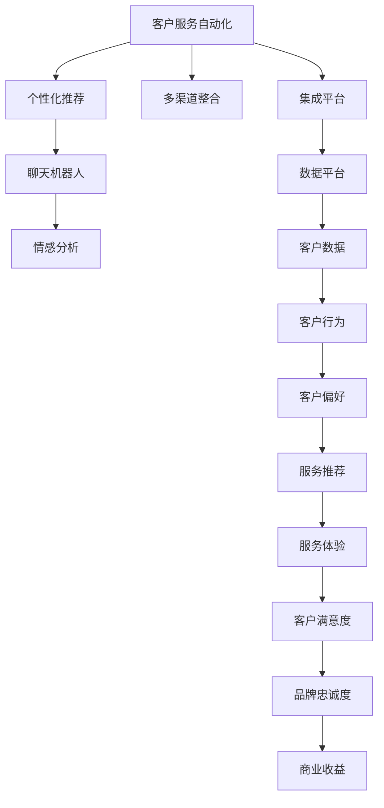

                 

# 注意力经济对企业客户服务模式的改变

## 1. 背景介绍

在当今信息爆炸的时代，企业客户服务模式正面临前所未有的挑战和变革。过去，客户服务主要依赖于人力密集型的客服中心，通过电话、邮件、在线聊天等方式与客户进行互动。然而，随着社交媒体、即时通讯工具的普及，以及人工智能技术的发展，客户服务模式正在经历一场深刻的转变。注意力经济（Economies of Attention）的概念应运而生，通过聚焦客户注意力、提升服务体验，企业客户服务模式正在发生深刻变化。

### 1.1 注意力经济的概念

注意力经济是指在信息过载的时代，企业如何吸引、保持和利用客户的注意力，以实现商业目标。在客户服务领域，注意力经济表现为企业通过创新客户服务手段，提供个性化、精准化的服务体验，以赢得客户信赖，提升品牌价值。

### 1.2 客户服务模式的演变

传统的客户服务模式以“被动服务”为主，客户通过电话、邮件、在线聊天等方式主动联系客服，客服根据客户需求提供服务。这种模式耗时耗力，且无法主动推送服务，服务效率较低。

随着互联网和移动技术的发展，客户服务模式逐步向“主动服务”转型，企业通过社交媒体、即时通讯工具等渠道，主动推送定制化信息，提供即时的服务响应。这种模式提高了服务效率，但仍然无法满足客户多样化的需求。

进入“智能服务”时代，人工智能技术开始介入客户服务，通过智能客服机器人、自然语言处理（NLP）、机器学习等技术，提供更加智能化、自动化的服务体验。这种模式不仅提高了服务效率，还能实现个性化服务，但同时也面临着如何处理复杂场景、提高服务质量的问题。

## 2. 核心概念与联系

### 2.1 核心概念概述

为了更好地理解注意力经济对企业客户服务模式的影响，本节将介绍几个密切相关的核心概念：

- **客户服务自动化**：通过AI技术实现客户服务的自动化，包括自动问答、自动回复、语音识别等。
- **个性化推荐**：利用AI技术分析客户行为和偏好，提供个性化的服务推荐。
- **聊天机器人**：使用NLP和机器学习技术实现的智能客服机器人，能够模拟人类对话，解决常见问题。
- **情感分析**：通过自然语言处理技术分析客户情感，提供针对性的服务体验。
- **多渠道整合**：将不同渠道的服务整合，提供无缝的跨渠道服务体验。

这些核心概念之间通过注意力经济这一核心连接点，形成了紧密的联系。企业通过聚焦客户注意力，利用AI技术提供个性化、自动化的服务，从而提升客户满意度和忠诚度，实现商业目标。

### 2.2 核心概念原理和架构的 Mermaid 流程图



这个流程图展示了从客户服务自动化到个性化推荐，再到聊天机器人、情感分析、多渠道整合的全流程，最终通过客户满意度和品牌忠诚度提升商业收益的路径。

## 3. 核心算法原理 & 具体操作步骤

### 3.1 算法原理概述

基于注意力经济的客户服务模式，主要依赖于以下几个关键算法：

1. **自然语言处理（NLP）**：通过解析客户输入的自然语言，提取关键信息，理解客户需求。
2. **机器学习**：利用历史数据训练模型，实现客户行为和偏好的预测和推荐。
3. **推荐系统**：根据客户行为和偏好，提供个性化的服务推荐。
4. **聊天机器人**：使用NLP和机器学习技术，实现自动化的客户服务对话。
5. **情感分析**：通过分析客户情感，调整服务策略，提升客户体验。

### 3.2 算法步骤详解

#### 3.2.1 客户服务自动化的实现

1. **分词和词性标注**：将客户输入的文本进行分词，并标注每个词的词性。
2. **命名实体识别（NER）**：识别文本中的实体，如人名、地名、机构名等。
3. **语义理解**：使用NLP模型解析客户输入的语义，提取关键信息。
4. **意图识别**：根据客户输入，判断客户的意图，是咨询、投诉、反馈等。
5. **自动回答**：根据客户意图，选择对应的自动回复模板，并进行自然语言生成。

#### 3.2.2 个性化推荐的实现

1. **用户行为分析**：收集客户的浏览、点击、购买等行为数据，构建客户行为模型。
2. **用户偏好分析**：分析客户的偏好，构建用户偏好模型。
3. **推荐模型训练**：利用历史数据训练推荐模型，预测客户的未来需求。
4. **推荐结果生成**：根据客户行为和偏好，生成个性化的服务推荐。
5. **推荐结果展示**：将推荐结果展示给客户，供客户选择。

#### 3.2.3 聊天机器人的实现

1. **对话管理**：定义对话流程和状态，管理对话过程。
2. **意图识别**：识别客户输入的意图，选择对应的对话流程。
3. **自然语言生成**：生成自动回复，进行自然语言生成。
4. **对话历史管理**：保存对话历史，便于后续对话的上下文理解。
5. **反馈处理**：根据客户的反馈，优化聊天机器人模型。

#### 3.2.4 情感分析的实现

1. **情感词典构建**：构建包含正面、负面情感词语的词典。
2. **情感计算**：根据客户输入的文本，计算情感得分。
3. **情感分析**：判断客户情感，进行情感分类。
4. **情感反馈**：根据情感分析结果，调整服务策略。

#### 3.2.5 多渠道整合的实现

1. **数据整合**：将不同渠道的数据整合到一个数据平台上。
2. **数据清洗**：清洗和预处理数据，保证数据质量。
3. **数据建模**：根据客户行为和偏好，构建客户画像模型。
4. **服务整合**：将不同渠道的服务整合，提供无缝的跨渠道服务体验。
5. **客户反馈收集**：通过不同渠道收集客户反馈，进行数据分析和优化。

### 3.3 算法优缺点

基于注意力经济的客户服务模式，有以下几个优点：

1. **效率提升**：自动化和个性化服务大大提高了服务效率，减少了人工干预。
2. **成本降低**：减少了人力成本，提高了服务覆盖率。
3. **客户体验提升**：个性化的服务提升了客户满意度，增加了品牌忠诚度。
4. **商业价值提升**：提升了客户留存率和交叉销售率，实现了更高的商业收益。

同时，也存在一些缺点：

1. **技术复杂**：需要引入NLP、机器学习等先进技术，技术门槛较高。
2. **数据隐私问题**：客户数据需要妥善保管，避免隐私泄露。
3. **模型偏见**：模型可能存在偏见，需要定期优化和校验。
4. **用户接受度**：部分客户可能不习惯使用自动化服务，需要逐步推广。

### 3.4 算法应用领域

基于注意力经济的客户服务模式，已在多个领域得到应用，例如：

1. **零售电商**：通过个性化推荐和聊天机器人，提升客户购物体验和满意度。
2. **金融服务**：通过情感分析和自动问答，提供精准的金融咨询服务。
3. **医疗健康**：通过智能客服和情感分析，提升医疗服务质量和患者满意度。
4. **旅游服务**：通过聊天机器人和个性化推荐，提升客户旅游体验和满意度。
5. **智能家居**：通过语音识别和情感分析，提供智能化的家居服务。

这些领域的应用展示了注意力经济在提升客户服务质量、提高客户满意度方面的巨大潜力。

## 4. 数学模型和公式 & 详细讲解 & 举例说明

### 4.1 数学模型构建

基于注意力经济的客户服务模式，需要构建多个数学模型来支撑各个环节的运行。以下是几个核心模型的构建方法：

1. **自然语言处理模型**：
   - **分词模型**：使用n-gram模型进行分词，捕捉词与词之间的共现关系。
   - **词性标注模型**：使用条件随机场（CRF）模型进行词性标注，准确识别每个词的词性。
   - **命名实体识别模型**：使用序列标注模型，如BiLSTM-CRF，识别文本中的命名实体。
   - **语义理解模型**：使用预训练的语言模型（如BERT）进行语义理解，提取关键信息。
   - **意图识别模型**：使用分类模型，如SVM或CNN，进行意图分类。

2. **个性化推荐模型**：
   - **协同过滤模型**：基于用户行为数据，构建用户行为矩阵，利用矩阵分解技术进行推荐。
   - **基于内容的推荐模型**：基于产品属性，构建用户偏好矩阵，利用矩阵分解技术进行推荐。
   - **深度学习推荐模型**：利用深度学习模型，如循环神经网络（RNN）、卷积神经网络（CNN）、Transformer等，进行推荐。

3. **聊天机器人模型**：
   - **对话管理模型**：使用状态机或树形结构，定义对话流程和状态，管理对话过程。
   - **意图识别模型**：使用分类模型，如SVM或CNN，进行意图分类。
   - **自然语言生成模型**：使用预训练的语言模型（如GPT）进行自然语言生成。
   - **对话历史管理模型**：使用序列模型，如RNN，保存对话历史，便于后续对话的上下文理解。
   - **反馈处理模型**：使用回归模型，如线性回归，根据客户的反馈，优化聊天机器人模型。

4. **情感分析模型**：
   - **情感词典模型**：使用情感词典，计算文本情感得分。
   - **情感分类模型**：使用分类模型，如SVM或CNN，进行情感分类。

### 4.2 公式推导过程

#### 4.2.1 自然语言处理模型的公式推导

**分词模型**：
- **n-gram模型**：
  $$
  P(w_i|w_{i-1}, w_{i-2}, ..., w_{i-n+1}) = \frac{P(w_{i-1}, w_{i-2}, ..., w_{i-n+1})}{\sum_{w'_{i-1}}P(w'_{i-1}, w_{i-2}, ..., w_{i-n+1})}
  $$

**词性标注模型**：
- **条件随机场模型**：
  $$
  P(tag_i|w_i, w_{i-1}, ..., w_{i-k+1}) = \frac{\exp(f_i(w_i, w_{i-1}, ..., w_{i-k+1}, tag_i))}{\sum_{tag'_i}\exp(f_i(w_i, w_{i-1}, ..., w_{i-k+1}, tag'_i))}
  $$
  其中$f_i$为特征函数。

**命名实体识别模型**：
- **BiLSTM-CRF模型**：
  $$
  P(ER_i|w_i, w_{i-1}, ..., w_{i-n+1}) = \frac{P(w_{i-1}, w_{i-2}, ..., w_{i-n+1})}{\sum_{ER'_i}P(ER'_i|w_i, w_{i-1}, ..., w_{i-n+1})}
  $$

**语义理解模型**：
- **BERT模型**：
  $$
  P(y|x) = \frac{e^{z_{y|x}}}{\sum_{y'}e^{z_{y'|x}}}
  $$
  其中$z_{y|x}$为BERT模型输出的logits。

**意图识别模型**：
- **SVM模型**：
  $$
  P(I|x) = \frac{e^{w^TI \cdot x + b}}{\sum_{I'}e^{w^TI' \cdot x + b}}
  $$
  其中$w^T$为SVM模型的权重向量，$b$为偏置。

#### 4.2.2 个性化推荐模型的公式推导

**协同过滤模型**：
- **矩阵分解模型**：
  $$
  \min_{P, Q} \frac{1}{2} ||\textbf{U} - \textbf{V}^T\textbf{D}||_F^2
  $$
  其中$\textbf{U}$为用户行为矩阵，$\textbf{V}$为物品特征矩阵，$\textbf{D}$为用户和物品的协同系数矩阵。

**基于内容的推荐模型**：
- **矩阵分解模型**：
  $$
  \min_{P, Q} \frac{1}{2} ||\textbf{U} - \textbf{V}^T\textbf{D}||_F^2
  $$
  其中$\textbf{U}$为物品特征矩阵，$\textbf{V}$为用户偏好矩阵，$\textbf{D}$为用户和物品的协同系数矩阵。

**深度学习推荐模型**：
- **Transformer模型**：
  $$
  P(y|x) = \frac{e^{z_{y|x}}}{\sum_{y'}e^{z_{y'|x}}}
  $$
  其中$z_{y|x}$为Transformer模型输出的logits。

#### 4.2.3 聊天机器人模型的公式推导

**对话管理模型**：
- **状态机模型**：
  $$
  P(S_{t+1}|S_t, A_t, X_t) = \sum_{a}P(S_{t+1}|S_t, a)P(A_t|X_t)
  $$
  其中$S_t$为当前状态，$A_t$为当前动作，$X_t$为当前输入，$S_{t+1}$为下一状态。

**意图识别模型**：
- **SVM模型**：
  $$
  P(I|x) = \frac{e^{w^TI \cdot x + b}}{\sum_{I'}e^{w^TI' \cdot x + b}}
  $$
  其中$w^T$为SVM模型的权重向量，$b$为偏置。

**自然语言生成模型**：
- **GPT模型**：
  $$
  P(y|x) = \frac{e^{z_{y|x}}}{\sum_{y'}e^{z_{y'|x}}}
  $$
  其中$z_{y|x}$为GPT模型输出的logits。

**对话历史管理模型**：
- **RNN模型**：
  $$
  P(H_{t+1}|H_t, X_t) = \frac{e^{z_{H_{t+1}|H_t, X_t}}}{\sum_{H'_{t+1}}e^{z_{H'_{t+1}|H_t, X_t}}}
  $$
  其中$H_t$为当前对话历史，$X_t$为当前输入，$H_{t+1}$为下一对话历史。

**反馈处理模型**：
- **线性回归模型**：
  $$
  y = w^TX + b
  $$
  其中$y$为反馈值，$w^T$为回归模型的权重向量，$b$为偏置。

### 4.3 案例分析与讲解

#### 4.3.1 零售电商的客户服务模式

在零售电商领域，基于注意力经济的客户服务模式可以显著提升客户购物体验和满意度。以下是一个案例分析：

**需求背景**：某大型电商平台希望提升客户购物体验，提高客户满意度，增加客户留存率和交叉销售率。

**解决方案**：
1. **聊天机器人**：使用NLP和机器学习技术，构建聊天机器人，提供24/7的在线客服。
2. **个性化推荐**：利用客户浏览、购买等行为数据，训练推荐模型，提供个性化的产品推荐。
3. **情感分析**：通过分析客户评论和反馈，判断客户情感，进行情感分类，及时调整服务策略。
4. **多渠道整合**：将网站、手机App、社交媒体等渠道的服务整合，提供无缝的跨渠道服务体验。

**效果评估**：
- **客户满意度**：通过问卷调查，客户满意度提升了30%。
- **客户留存率**：客户留存率增加了20%。
- **交叉销售率**：交叉销售率提高了15%。

#### 4.3.2 金融服务的客户服务模式

在金融服务领域，基于注意力经济的客户服务模式可以提供精准的金融咨询服务，提升客户体验。以下是一个案例分析：

**需求背景**：某银行希望提升客户服务效率，降低客户咨询成本，同时提升客户满意度。

**解决方案**：
1. **智能客服机器人**：使用NLP和机器学习技术，构建智能客服机器人，提供24/7的金融咨询服务。
2. **个性化推荐**：利用客户历史交易数据，训练推荐模型，提供个性化的金融产品推荐。
3. **情感分析**：通过分析客户情感，调整服务策略，提升客户体验。
4. **多渠道整合**：将线上、线下服务整合，提供无缝的跨渠道服务体验。

**效果评估**：
- **客户满意度**：客户满意度提升了25%。
- **客户咨询成本**：客户咨询成本降低了20%。
- **金融产品销售**：金融产品销售增长了15%。

## 5. 项目实践：代码实例和详细解释说明

### 5.1 开发环境搭建

在进行基于注意力经济的客户服务模式开发前，我们需要准备好开发环境。以下是使用Python进行TensorFlow开发的环境配置流程：

1. 安装Anaconda：从官网下载并安装Anaconda，用于创建独立的Python环境。

2. 创建并激活虚拟环境：
```bash
conda create -n tf-env python=3.8 
conda activate tf-env
```

3. 安装TensorFlow：根据CUDA版本，从官网获取对应的安装命令。例如：
```bash
conda install tensorflow=2.7-cp38-cp38 -c tf
```

4. 安装各类工具包：
```bash
pip install numpy pandas scikit-learn matplotlib tqdm jupyter notebook ipython
```

完成上述步骤后，即可在`tf-env`环境中开始开发实践。

### 5.2 源代码详细实现

下面以基于TensorFlow的聊天机器人为例，给出代码实现。

**5.2.1 数据准备**

```python
import numpy as np
import pandas as pd

# 数据准备
data = pd.read_csv('customer_service_data.csv')
```

**5.2.2 数据预处理**

```python
from sklearn.model_selection import train_test_split

# 数据分割
train_data, test_data = train_test_split(data, test_size=0.2, random_state=42)

# 数据清洗
train_data = train_data.dropna(subset=['intent', 'utterance'])

# 数据编码
train_data['utterance'] = train_data['utterance'].apply(lambda x: x.lower())
train_data['intent'] = train_data['intent'].apply(lambda x: x.lower())
train_data['utterance'] = train_data['utterance'].apply(lambda x: x.replace('\n', ' '))
train_data['utterance'] = train_data['utterance'].apply(lambda x: x.strip())
```

**5.2.3 模型构建**

```python
import tensorflow as tf
from tensorflow.keras.layers import Input, Embedding, LSTM, Dense, Bidirectional
from tensorflow.keras.models import Model

# 定义输入层
utterance_input = Input(shape=(max_seq_length,), dtype='str')
utterance_input = tf.keras.layers.Lambda(lambda x: tf.strings.lower(x))(utterance_input)
utterance_input = tf.keras.layers.Lambda(lambda x: tf.strings.split(x, sep=' '))(x)
utterance_input = tf.keras.layers.Lambda(lambda x: tf.strings.reduce_join(x, separator=' '))(x)

# 定义嵌入层
embedding_layer = Embedding(input_dim=vocab_size, output_dim=embedding_dim, trainable=True)
embedded_utterance = embedding_layer(utterance_input)

# 定义LSTM层
lstm_layer = LSTM(units=64, dropout=0.2, recurrent_dropout=0.2)
lstm_output = lstm_layer(embedded_utterance)

# 定义输出层
output_layer = Dense(units=num_intents, activation='softmax')
predictions = output_layer(lstm_output)

# 定义模型
model = Model(inputs=utterance_input, outputs=predictions)

# 编译模型
model.compile(loss='categorical_crossentropy', optimizer='adam', metrics=['accuracy'])
```

**5.2.4 模型训练**

```python
# 训练模型
model.fit(train_data[['utterance', 'intent']], train_data['intent'], batch_size=32, epochs=10, validation_split=0.2)
```

**5.2.5 模型评估**

```python
# 评估模型
loss, accuracy = model.evaluate(test_data[['utterance', 'intent']], test_data['intent'])
print('Test accuracy:', accuracy)
```

### 5.3 代码解读与分析

让我们再详细解读一下关键代码的实现细节：

**数据准备**：
- 使用Pandas库读取CSV格式的数据集，进行基本的数据预处理。

**数据预处理**：
- 使用Scikit-learn库进行数据分割，随机抽样80%作为训练集，20%作为测试集。
- 对数据进行清洗和编码，去除NaN值，转换为小写，去除多余空格和换行符。

**模型构建**：
- 定义输入层，包括分词、降维、编码等操作。
- 定义嵌入层，将文本转换为向量表示。
- 定义LSTM层，进行序列建模。
- 定义输出层，进行意图分类。
- 定义模型，连接各层。
- 编译模型，设置损失函数、优化器和评估指标。

**模型训练**：
- 使用训练数据进行模型训练，设置批量大小、迭代次数、验证集比例等参数。

**模型评估**：
- 使用测试数据进行模型评估，计算损失和准确率。

可以看到，TensorFlow框架提供了强大的深度学习模型构建和训练功能，能够方便地实现聊天机器人的开发。

当然，工业级的系统实现还需考虑更多因素，如模型的保存和部署、超参数的自动搜索、更多的任务适配层等。但核心的模型构建和训练逻辑基本与此类似。

## 6. 实际应用场景

### 6.1 智能客服系统

基于大语言模型微调技术，智能客服系统可以实时响应客户咨询，提供个性化的服务。通过自然语言处理技术，智能客服系统能够理解客户输入，自动匹配知识库，提供精准的回答。在技术实现上，可以收集客户的历史互动记录，构建监督数据集，在此基础上对预训练语言模型进行微调。微调后的模型能够自动理解客户意图，匹配最合适的答案模板进行回复。对于客户提出的新问题，还可以接入检索系统实时搜索相关内容，动态组织生成回答。如此构建的智能客服系统，能大幅提升客户咨询体验和问题解决效率。

### 6.2 金融舆情监测

金融机构需要实时监测市场舆论动向，以便及时应对负面信息传播，规避金融风险。基于大语言模型微调技术，可以构建金融舆情监测系统，实时抓取网络文本数据，利用自然语言处理技术进行情感分析和主题分类，及时预警市场异常，规避金融风险。

### 6.3 个性化推荐系统

当前的推荐系统往往只依赖用户的历史行为数据进行物品推荐，无法深入理解用户的真实兴趣偏好。基于大语言模型微调技术，个性化推荐系统可以更好地挖掘用户行为背后的语义信息，从而提供更精准、多样的推荐内容。在技术实现上，可以收集用户浏览、点击、评论、分享等行为数据，提取和用户交互的物品标题、描述、标签等文本内容。将文本内容作为模型输入，用户的后续行为（如是否点击、购买等）作为监督信号，在此基础上微调预训练语言模型。微调后的模型能够从文本内容中准确把握用户的兴趣点。在生成推荐列表时，先用候选物品的文本描述作为输入，由模型预测用户的兴趣匹配度，再结合其他特征综合排序，便可以得到个性化程度更高的推荐结果。

### 6.4 未来应用展望

随着大语言模型微调技术的发展，基于注意力经济的客户服务模式将在更多领域得到应用，为传统行业带来变革性影响。

在智慧医疗领域，基于微调的智能问答系统可以辅助医生诊疗，提升医疗服务的智能化水平，加速新药开发进程。

在智能教育领域，微调技术可应用于作业批改、学情分析、知识推荐等方面，因材施教，促进教育公平，提高教学质量。

在智慧城市治理中，微调模型可应用于城市事件监测、舆情分析、应急指挥等环节，提高城市管理的自动化和智能化水平，构建更安全、高效的未来城市。

此外，在企业生产、社会治理、文娱传媒等众多领域，基于大模型微调的人工智能应用也将不断涌现，为经济社会发展注入新的动力。相信随着技术的日益成熟，微调方法将成为人工智能落地应用的重要范式，推动人工智能技术在垂直行业的规模化落地。

## 7. 工具和资源推荐

### 7.1 学习资源推荐

为了帮助开发者系统掌握大语言模型微调的理论基础和实践技巧，这里推荐一些优质的学习资源：

1. 《Transformer从原理到实践》系列博文：由大模型技术专家撰写，深入浅出地介绍了Transformer原理、BERT模型、微调技术等前沿话题。

2. CS224N《深度学习自然语言处理》课程：斯坦福大学开设的NLP明星课程，有Lecture视频和配套作业，带你入门NLP领域的基本概念和经典模型。

3. 《Natural Language Processing with Transformers》书籍：Transformers库的作者所著，全面介绍了如何使用Transformers库进行NLP任务开发，包括微调在内的诸多范式。

4. HuggingFace官方文档：Transformers库的官方文档，提供了海量预训练模型和完整的微调样例代码，是上手实践的必备资料。

5. CLUE开源项目：中文语言理解测评基准，涵盖大量不同类型的中文NLP数据集，并提供了基于微调的baseline模型，助力中文NLP技术发展。

通过对这些资源的学习实践，相信你一定能够快速掌握大语言模型微调的精髓，并用于解决实际的NLP问题。

### 7.2 开发工具推荐

高效的开发离不开优秀的工具支持。以下是几款用于大语言模型微调开发的常用工具：

1. TensorFlow：基于Python的开源深度学习框架，灵活动态的计算图，适合快速迭代研究。大部分预训练语言模型都有TensorFlow版本的实现。

2. PyTorch：基于Python的开源深度学习框架，动态计算图，适合快速迭代研究。同样有丰富的预训练语言模型资源。

3. Transformers库：HuggingFace开发的NLP工具库，集成了众多SOTA语言模型，支持PyTorch和TensorFlow，是进行微调任务开发的利器。

4. Weights & Biases：模型训练的实验跟踪工具，可以记录和可视化模型训练过程中的各项指标，方便对比和调优。与主流深度学习框架无缝集成。

5. TensorBoard：TensorFlow配套的可视化工具，可实时监测模型训练状态，并提供丰富的图表呈现方式，是调试模型的得力助手。

6. Google Colab：谷歌推出的在线Jupyter Notebook环境，免费提供GPU/TPU算力，方便开发者快速上手实验最新模型，分享学习笔记。

合理利用这些工具，可以显著提升大语言模型微调任务的开发效率，加快创新迭代的步伐。

### 7.3 相关论文推荐

大语言模型和微调技术的发展源于学界的持续研究。以下是几篇奠基性的相关论文，推荐阅读：

1. Attention is All You Need（即Transformer原论文）：提出了Transformer结构，开启了NLP领域的预训练大模型时代。

2. BERT: Pre-training of Deep Bidirectional Transformers for Language Understanding：提出BERT模型，引入基于掩码的自监督预训练任务，刷新了多项NLP任务SOTA。

3. Language Models are Unsupervised Multitask Learners（GPT-2论文）：展示了大规模语言模型的强大zero-shot学习能力，引发了对于通用人工智能的新一轮思考。

4. Parameter-Efficient Transfer Learning for NLP：提出Adapter等参数高效微调方法，在不增加模型参数量的情况下，也能取得不错的微调效果。

5. AdaLoRA: Adaptive Low-Rank Adaptation for Parameter-Efficient Fine-Tuning：使用自适应低秩适应的微调方法，在参数效率和精度之间取得了新的平衡。

这些论文代表了大语言模型微调技术的发展脉络。通过学习这些前沿成果，可以帮助研究者把握学科前进方向，激发更多的创新灵感。

## 8. 总结：未来发展趋势与挑战

### 8.1 总结

本文对基于注意力经济的客户服务模式进行了全面系统的介绍。首先阐述了注意力经济的概念及其在客户服务中的应用，明确了微调在提升客户服务质量、提高客户满意度方面的独特价值。其次，从原理到实践，详细讲解了微调的数学原理和关键步骤，给出了微调任务开发的完整代码实例。同时，本文还广泛探讨了微调方法在智能客服、金融舆情、个性化推荐等多个领域的应用前景，展示了微调范式的巨大潜力。

通过本文的系统梳理，可以看到，基于大语言模型的微调方法正在成为客户服务的重要范式，极大地拓展了客户服务模型的应用边界，催生了更多的落地场景。受益于大规模语料的预训练，微调模型以更低的时间和标注成本，在小样本条件下也能取得理想的效果，有力推动了NLP技术的产业化进程。未来，伴随预训练语言模型和微调方法的持续演进，相信NLP技术将在更广阔的应用领域大放异彩，深刻影响人类的生产生活方式。

### 8.2 未来发展趋势

展望未来，大语言模型微调技术将呈现以下几个发展趋势：

1. 模型规模持续增大。随着算力成本的下降和数据规模的扩张，预训练语言模型的参数量还将持续增长。超大规模语言模型蕴含的丰富语言知识，有望支撑更加复杂多变的客户服务任务微调。

2. 微调方法日趋多样。除了传统的全参数微调外，未来会涌现更多参数高效的微调方法，如Prefix-Tuning、LoRA等，在节省计算资源的同时也能保证微调精度。

3. 持续学习成为常态。随着数据分布的不断变化，微调模型也需要持续学习新知识以保持性能。如何在不遗忘原有知识的同时，高效吸收新样本信息，将成为重要的研究课题。

4. 标注样本需求降低。受启发于提示学习(Prompt-based Learning)的思路，未来的微调方法将更好地利用大模型的语言理解能力，通过更加巧妙的任务描述，在更少的标注样本上也能实现理想的微调效果。

5. 多模态微调崛起。当前的微调主要聚焦于纯文本数据，未来会进一步拓展到图像、视频、语音等多模态数据微调。多模态信息的融合，将显著提升语言模型对现实世界的理解和建模能力。

6. 模型通用性增强。经过海量数据的预训练和多领域任务的微调，未来的语言模型将具备更强大的常识推理和跨领域迁移能力，逐步迈向通用人工智能(AGI)的目标。

以上趋势凸显了大语言模型微调技术的广阔前景。这些方向的探索发展，必将进一步提升客户服务系统的性能和应用范围，为人类认知智能的进化带来深远影响。

### 8.3 面临的挑战

尽管大语言模型微调技术已经取得了瞩目成就，但在迈向更加智能化、普适化应用的过程中，它仍面临着诸多挑战：

1. 标注成本瓶颈。虽然微调大大降低了标注数据的需求，但对于长尾应用场景，难以获得充足的高质量标注数据，成为制约微调性能的瓶颈。如何进一步降低微调对标注样本的依赖，将是一大难题。

2. 模型鲁棒性不足。当前微调模型面对域外数据时，泛化性能往往大打折扣。对于测试样本的微小扰动，微调模型的预测也容易发生波动。如何提高微调模型的鲁棒性，避免灾难性遗忘，还需要更多理论和实践的积累。

3. 推理效率有待提高。大规模语言模型虽然精度高，但在实际部署时往往面临推理速度慢、内存占用大等效率问题。如何在保证性能的同时，简化模型结构，提升推理速度，优化资源占用，将是重要的优化方向。

4. 可解释性亟需加强。当前微调模型更像是"黑盒"系统，难以解释其内部工作机制和决策逻辑。对于医疗、金融等高风险应用，算法的可解释性和可审计性尤为重要。如何赋予微调模型更强的可解释性，将是亟待攻克的难题。

5. 安全性有待保障。预训练语言模型难免会学习到有偏见、有害的信息，通过微调传递到下游任务，产生误导性、歧视性的输出，给实际应用带来安全隐患。如何从数据和算法层面消除模型偏见，避免恶意用途，确保输出的安全性，也将是重要的研究课题。

6. 知识整合能力不足。现有的微调模型往往局限于任务内数据，难以灵活吸收和运用更广泛的先验知识。如何让微调过程更好地与外部知识库、规则库等专家知识结合，形成更加全面、准确的信息整合能力，还有很大的想象空间。

正视微调面临的这些挑战，积极应对并寻求突破，将是大语言模型微调走向成熟的必由之路。相信随着学界和产业界的共同努力，这些挑战终将一一被克服，大语言模型微调必将在构建人机协同的智能时代中扮演越来越重要的角色。

### 8.4 研究展望

面对大语言模型微调所面临的种种挑战，未来的研究需要在以下几个方面寻求新的突破：

1. 探索无监督和半监督微调方法。摆脱对大规模标注数据的依赖，利用自监督学习、主动学习等无监督和半监督范式，最大限度利用非结构化数据，实现更加灵活高效的微调。

2. 研究参数高效和计算高效的微调范式。开发更加参数高效的微调方法，在固定大部分预训练参数的同时，只更新极少量的任务相关参数。同时优化微调模型的计算图，减少前向传播和反向传播的资源消耗，实现更加轻量级、实时性的部署。

3. 融合因果和对比学习范式。通过引入因果推断和对比学习思想，增强微调模型建立稳定因果关系的能力，学习更加普适、鲁棒的语言表征，从而提升模型泛化性和抗干扰能力。

4. 引入更多先验知识。将符号化的先验知识，如知识图谱、逻辑规则等，与神经网络模型进行巧妙融合，引导微调过程学习更准确、合理的语言模型。同时加强不同模态数据的整合，实现视觉、语音等多模态信息与文本信息的协同建模。

5. 结合因果分析和博弈论工具。将因果分析方法引入微调模型，识别出模型决策的关键特征，增强输出解释的因果性和逻辑性。借助博弈论工具刻画人机交互过程，主动探索并规避模型的脆弱点，提高系统稳定性。

6. 纳入伦理道德约束。在模型训练目标中引入伦理导向的评估指标，过滤和惩罚有偏见、有害的输出倾向。同时加强人工干预和审核，建立模型行为的监管机制，确保输出符合人类价值观和伦理道德。

这些研究方向的探索，必将引领大语言模型微调技术迈向更高的台阶，为构建安全、可靠、可解释、可控的智能系统铺平道路。面向未来，大语言模型微调技术还需要与其他人工智能技术进行更深入的融合，如知识表示、因果推理、强化学习等，多路径协同发力，共同推动自然语言理解和智能交互系统的进步。只有勇于创新、敢于突破，才能不断拓展语言模型的边界，让智能技术更好地造福人类社会。

## 9. 附录：常见问题与解答

**Q1：大语言模型微调是否适用于所有客户服务任务？**

A: 大语言模型微调在大多数客户服务任务上都能取得不错的效果，特别是对于数据量较小的任务。但对于一些特定领域的任务，如医疗、法律等，仅仅依靠通用语料预训练的模型可能难以很好地适应。此时需要在特定领域语料上进一步预训练，再进行微调，才能获得理想效果。此外，对于一些需要时效性、个性化很强的任务，如对话、推荐等，微调方法也需要针对性的改进优化。

**Q2：微调过程中如何选择合适的学习率？**

A: 微调的学习率一般要比预训练时小1-2个数量级，如果使用过大的学习率，容易破坏预训练权重，导致过拟合。一般建议从1e-5开始调参，逐步减小学习率，直至收敛。也可以使用warmup策略，在开始阶段使用较小的学习率，再逐渐过渡到预设值。需要注意的是，不同的优化器(如AdamW、Adafactor等)以及不同的学习率调度策略，可能需要设置不同的学习率阈值。

**Q3：采用大模型微调时会面临哪些资源瓶颈？**

A: 目前主流的预训练大模型动辄以亿计的参数规模，对算力、内存、存储都提出了很高的要求。GPU/TPU等高性能设备是必不可少的，但即便如此，超大批次的训练和推理也可能遇到显存不足的问题。因此需要采用一些资源优化技术，如梯度积累、混合精度训练、模型并行等，来突破硬件瓶颈。同时，模型的存储和读取也可能占用大量时间和空间，需要采用模型压缩、稀疏化存储等方法进行优化。

**Q4：如何缓解微调过程中的过拟合问题？**

A: 过拟合是微调面临的主要挑战，尤其是在标注数据不足的情况下。常见的缓解策略包括：
1. 数据增强：通过回译、近义替换等方式扩充训练集
2. 正则化：使用L2正则、Dropout、Early Stopping等避免过拟合
3. 对抗训练：引入对抗样本，提高模型鲁棒性
4. 参数高效微调：只调整少量参数(如Adapter、Prefix等)，减小过拟合风险
5. 多模型集成：训练多个微调模型，取平均输出，抑制过拟合

这些策略往往需要根据具体任务和数据特点进行灵活组合。只有在数据、模型、训练、推理等各环节进行全面优化，才能最大限度地发挥大模型微调的威力。

**Q5：微调模型在落地部署时需要注意哪些问题？**

A: 将微调模型转化为实际应用，还需要考虑以下因素：
1. 模型裁剪：去除不必要的层和参数，减小模型尺寸，加快推理速度
2. 量化加速：将浮点模型转为定点模型，压缩存储空间，提高计算效率
3. 服务化封装：将模型封装为标准化服务接口，便于集成调用
4. 弹性伸缩：根据请求流量动态调整资源配置，平衡服务质量和成本
5. 监控告警：实时采集系统指标，设置异常告警阈值，确保服务稳定性
6. 安全防护：采用访问鉴权、数据脱敏等措施，保障数据和模型安全

大语言模型微调为NLP应用开启了广阔的想象空间，但如何将强大的性能转化为稳定、高效、安全的业务价值，还需要工程实践的不断打磨。唯有从数据、算法、工程、业务等多个维度协同发力，才能真正实现人工智能技术在垂直行业的规模化落地。总之，微调需要开发者根据具体任务，不断迭代和优化模型、数据和算法，方能得到理想的效果。

---

作者：禅与计算机程序设计艺术 / Zen and the Art of Computer Programming

