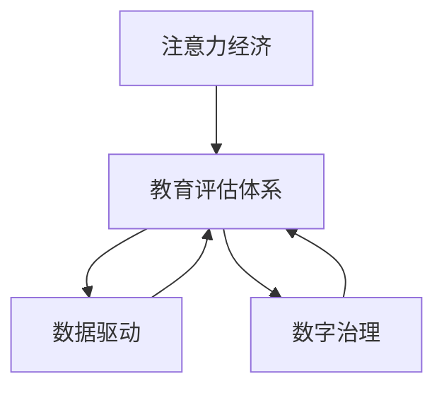

                 

# 注意力经济对传统教育评估体系的冲击

> 关键词：注意力经济, 教育评估体系, 人工智能, 数据驱动, 数字治理, 学习分析

## 1. 背景介绍

在信息爆炸的时代，传统教育评估体系正面临前所未有的冲击。随着移动互联网、大数据和人工智能技术的迅猛发展，人类社会步入了一个新的阶段——注意力经济时代。本文旨在探讨注意力经济对传统教育评估体系的影响，提出应对策略，探索未来教育评价体系的建设方向。

## 2. 核心概念与联系

### 2.1 核心概念概述

注意力经济（Attention Economy）是指在信息过载的时代，人们被海量的信息吸引，而注意力成为稀缺资源，因此吸引注意力成为商业、教育等领域的重要课题。传统教育评估体系（Traditional Educational Evaluation System）是以考试成绩为主要指标，通过标准化的测试对学生进行评估。

数据驱动（Data-Driven）是指利用数据进行决策和评估，注重数据的采集、处理和分析，从而更好地理解和优化教育过程。数字治理（Digital Governance）则是指利用信息技术手段，对教育资源进行高效管理，提高教育决策的科学性和透明性。

### 2.2 核心概念原理和架构的 Mermaid 流程图(Mermaid 流程节点中不要有括号、逗号等特殊字符)



## 3. 核心算法原理 & 具体操作步骤

### 3.1 算法原理概述

注意力经济对教育评估体系的影响主要体现在以下几个方面：

1. **学生关注度的改变**：传统教育评估体系以考试成绩为主，而注意力经济时代，学生的关注点更加多样化，不仅关注成绩，还关注教师的授课风格、学习资源的丰富度、学习社区的活跃度等。

2. **评估指标的丰富化**：传统的评估体系以标准化测试为主，而注意力经济时代，评估指标更加丰富，包括学生的互动频率、在线学习时长、学习内容的个性化推荐等。

3. **评估方法的多元化**：传统评估方法单一，主要依赖纸笔测试，而注意力经济时代，评估方法更加多元化，包括在线测试、实时互动、情感分析等。

### 3.2 算法步骤详解

1. **数据采集**：利用数据采集工具，如传感器、学习管理系统（LMS）、在线问卷调查等，收集学生的学习行为数据、教师的教学行为数据以及学习社区的互动数据。

2. **数据清洗与预处理**：对采集的数据进行清洗、去重、缺失值处理等预处理操作，确保数据的质量和完整性。

3. **特征工程**：根据评估指标，提取有效的特征，如学生的参与度、成绩、情感倾向等，并进行特征转换、归一化等操作，为后续建模做准备。

4. **模型训练与优化**：选择合适的机器学习算法，如随机森林、神经网络、支持向量机等，对数据进行训练，并根据评估指标对模型进行优化。

5. **评估与验证**：在训练集上训练模型，在验证集上评估模型性能，调整模型参数，确保模型的准确性和泛化能力。

### 3.3 算法优缺点

**优点**：

- 数据驱动的评估方法能够更全面、客观地反映学生的学习状态和效果，避免单一指标的片面性。
- 数字治理手段能够提高教育资源的利用效率，优化教育过程，提高教育质量。

**缺点**：

- 数据隐私和安全问题：收集大量学生数据可能涉及隐私问题，数据泄露风险较高。
- 数据质量问题：数据采集、处理、存储等环节可能存在误差，影响评估结果的准确性。
- 模型复杂性问题：多样化的评估指标和复杂的数据处理方式可能导致模型过于复杂，难以解释和维护。

### 3.4 算法应用领域

注意力经济对传统教育评估体系的影响主要应用于以下几个领域：

1. **高校评价**：高校可以通过学生的网络行为数据、学习成绩、互动频率等指标，评估教师的教学效果和课程质量。

2. **基础教育评估**：学校可以利用学生的在线学习时长、作业完成情况、互动频率等数据，对学生的学习效果进行评估。

3. **企业培训评估**：企业可以通过员工的在线学习记录、参与度、知识掌握情况等指标，评估培训效果和课程设计质量。

## 4. 数学模型和公式 & 详细讲解 & 举例说明

### 4.1 数学模型构建

基于注意力经济原理，我们可以构建以下数学模型：

- **学生关注度模型**：
  $$
  \text{Attention}_{i,j} = \alpha \times \text{Engagement}_{i,j} + \beta \times \text{Interactivity}_{i,j} + \gamma \times \text{Diversity}_{i,j}
  $$

- **评估指标模型**：
  $$
  \text{Score}_{i,j} = \delta \times \text{Performance}_{i,j} + \epsilon \times \text{Engagement}_{i,j} + \zeta \times \text{Interactivity}_{i,j} + \eta \times \text{Diversity}_{i,j}
  $$

其中，$\alpha,\beta,\gamma,\delta,\epsilon,\zeta,\eta$ 为模型参数，$\text{Engagement}_{i,j}$、$\text{Interactivity}_{i,j}$、$\text{Diversity}_{i,j}$ 为不同维度的评估指标，$\text{Performance}_{i,j}$ 为学生的成绩指标。

### 4.2 公式推导过程

- **学生关注度模型推导**：
  - $\text{Engagement}_{i,j}$：指学生在某个教学资源上的参与度，可以通过点击次数、停留时间等指标衡量。
  - $\text{Interactivity}_{i,j}$：指学生与教师或其他学生的互动频率，可以通过评论、讨论、点赞等指标衡量。
  - $\text{Diversity}_{i,j}$：指学习资源的丰富度，可以通过资源类型、主题、形式等指标衡量。

- **评估指标模型推导**：
  - $\text{Performance}_{i,j}$：指学生的成绩，是评估体系中最基本的指标。
  - $\text{Engagement}_{i,j}$：指学生的参与度，通过学习时长、互动频率等指标衡量。
  - $\text{Interactivity}_{i,j}$：指学生的互动频率，通过评论、讨论等指标衡量。
  - $\text{Diversity}_{i,j}$：指学习资源的丰富度，通过资源类型、主题等指标衡量。

### 4.3 案例分析与讲解

以高校评价为例，构建学生关注度模型和评估指标模型，进行评估分析。假设某高校使用在线学习平台，收集了学生的在线学习行为数据，包括观看视频时长、参与讨论次数、课程成绩等指标。利用上述模型进行评估：

- 首先，根据学生关注度模型，计算每个学生对不同课程的关注度。
- 其次，根据评估指标模型，计算每个学生的综合成绩。
- 最后，对比不同课程和教师的表现，评估教学效果。

## 5. 项目实践：代码实例和详细解释说明

### 5.1 开发环境搭建

1. **环境配置**：安装Python 3.x，并确保安装相应的数据科学库，如Pandas、NumPy、Scikit-learn等。
2. **数据准备**：收集学生在线学习行为数据，包括观看视频时长、参与讨论次数、课程成绩等指标。
3. **工具选择**：选择合适的数据清洗工具，如OpenRefine、DataWrangler等，进行数据清洗和预处理。
4. **模型训练**：利用Python编写模型训练代码，选择合适的机器学习算法，进行模型训练和优化。

### 5.2 源代码详细实现

```python
import pandas as pd
from sklearn.ensemble import RandomForestRegressor

# 数据准备
data = pd.read_csv('student_data.csv')

# 特征工程
features = ['watching_hours', 'discussion_count', 'performance']
X = data[features]
y = data['score']

# 数据清洗
X.dropna(inplace=True)

# 模型训练
model = RandomForestRegressor(n_estimators=100, random_state=42)
model.fit(X, y)

# 模型评估
score = model.score(X, y)
print('模型评估得分：', score)
```

### 5.3 代码解读与分析

- **数据准备**：从CSV文件中读取学生在线学习行为数据，将其转换为Pandas DataFrame格式。
- **特征工程**：选择相关的特征，并进行特征选择和预处理，去除缺失值。
- **模型训练**：利用RandomForestRegressor算法进行模型训练，设置参数和交叉验证。
- **模型评估**：在训练集上计算模型的评估得分，评估模型性能。

### 5.4 运行结果展示

训练结束后，模型可以在新的数据集上进行预测，并输出评估结果。例如：

```python
# 预测新数据
new_data = pd.read_csv('new_student_data.csv')
X_new = new_data[features]
y_pred = model.predict(X_new)

# 输出预测结果
print('预测结果：', y_pred)
```

## 6. 实际应用场景

### 6.1 高校评价

高校可以利用注意力经济原理，通过学生关注度模型和评估指标模型，对教师和课程进行综合评估。例如，某高校某学期开设多门课程，通过在线学习平台收集了学生的学习行为数据，包括观看视频时长、参与讨论次数、课程成绩等指标。利用上述模型，可以评估不同课程和教师的教学效果，及时调整教学策略。

### 6.2 基础教育评估

小学、初中、高中等基础教育阶段，可以通过学生的在线学习行为数据，对学生的学习效果进行评估。例如，某小学采用在线学习平台进行数学教学，收集了学生的观看视频时长、完成作业次数、成绩等指标。利用上述模型，可以评估不同课程和教师的教学效果，优化教学方案。

### 6.3 企业培训评估

企业可以通过员工的在线学习记录、参与度、知识掌握情况等指标，评估培训效果和课程设计质量。例如，某公司采用在线学习平台进行新员工培训，收集了员工的观看视频时长、参与讨论次数、知识测试成绩等指标。利用上述模型，可以评估不同课程和培训师的培训效果，优化培训内容。

## 7. 工具和资源推荐

### 7.1 学习资源推荐

- **数据科学书籍**：《Python数据科学手册》、《R语言实战》等书籍，提供数据科学和机器学习的入门知识。
- **在线课程**：Coursera、edX等平台的机器学习课程，涵盖数据驱动、机器学习算法等知识。
- **学术论文**：阅读相关领域的学术论文，了解最新研究和应用进展。

### 7.2 开发工具推荐

- **Python**：Python是数据科学和机器学习的主流编程语言，具有丰富的库和工具支持。
- **Jupyter Notebook**：交互式编程环境，方便代码调试和数据可视化。
- **TensorFlow**：开源机器学习框架，支持深度学习模型训练和部署。

### 7.3 相关论文推荐

- **《注意力经济：基于用户行为数据的评估与优化》**：探讨注意力经济对教育评估体系的影响，提出数据驱动的评估方法。
- **《数字治理：基于大数据的教育管理与优化》**：讨论数字治理在教育资源管理中的应用。
- **《人工智能在教育评估中的应用》**：探讨人工智能技术在教育评估中的应用，包括数据采集、建模和评估等环节。

## 8. 总结：未来发展趋势与挑战

### 8.1 研究成果总结

本文探讨了注意力经济对传统教育评估体系的影响，提出数据驱动的评估方法和数字治理手段。通过实例分析，展示了如何利用模型进行评估和优化。研究成果认为，注意力经济时代，教育评估体系需要更加全面、客观和科学，数据驱动的评估方法具有广阔的应用前景。

### 8.2 未来发展趋势

- **数据驱动的普及**：随着大数据和人工智能技术的普及，数据驱动的评估方法将在更多领域得到应用。
- **多维度评估**：未来的评估体系将更加多元化，涵盖学生的学习行为、情感状态、知识掌握等多个维度。
- **智能分析工具**：智能分析工具将进一步提升评估的准确性和效率，如情感分析、行为预测等技术。
- **隐私保护与伦理**：数据隐私和安全问题将成为关注的重点，未来评估体系将更加注重隐私保护和伦理道德。

### 8.3 面临的挑战

- **数据质量与隐私**：数据采集、清洗和存储等环节可能存在误差和隐私问题。
- **模型复杂性**：多维度的评估指标可能导致模型过于复杂，难以解释和维护。
- **技术普及**：数据驱动和数字治理技术的应用需要较高的技术门槛，推广普及存在挑战。
- **伦理道德**：数据驱动和数字治理手段可能涉及伦理道德问题，需要制定相应的政策和规范。

### 8.4 研究展望

未来的教育评估体系需要更加全面、科学和透明。数据驱动和数字治理手段将提供新的方法和工具，提高评估的准确性和效率。然而，如何平衡数据质量、隐私保护和技术普及等挑战，将是未来研究的重要方向。

## 9. 附录：常见问题与解答

**Q1：什么是注意力经济？**

A: 注意力经济是指在信息过载的时代，人们被海量的信息吸引，而注意力成为稀缺资源，因此吸引注意力成为商业、教育等领域的重要课题。

**Q2：数据驱动的评估方法有哪些优点和缺点？**

A: **优点**：数据驱动的评估方法能够更全面、客观地反映学生的学习状态和效果，避免单一指标的片面性。**缺点**：数据隐私和安全问题，数据质量问题，模型复杂性问题。

**Q3：数字治理手段对教育有什么影响？**

A: 数字治理手段能够提高教育资源的利用效率，优化教育过程，提高教育质量。然而，数字治理也可能涉及隐私保护和伦理道德问题，需要制定相应的政策和规范。

**Q4：如何评估数字治理手段的应用效果？**

A: 利用数据驱动的方法，如数据采集、特征工程、模型训练等步骤，对数字治理手段的应用效果进行评估，确保其科学性和有效性。

**Q5：未来教育评估体系的发展方向是什么？**

A: 未来教育评估体系将更加全面、多元化和智能化，涵盖学生的学习行为、情感状态、知识掌握等多个维度。数据驱动和数字治理手段将提供新的方法和工具，提高评估的准确性和效率。

---

作者：禅与计算机程序设计艺术 / Zen and the Art of Computer Programming

