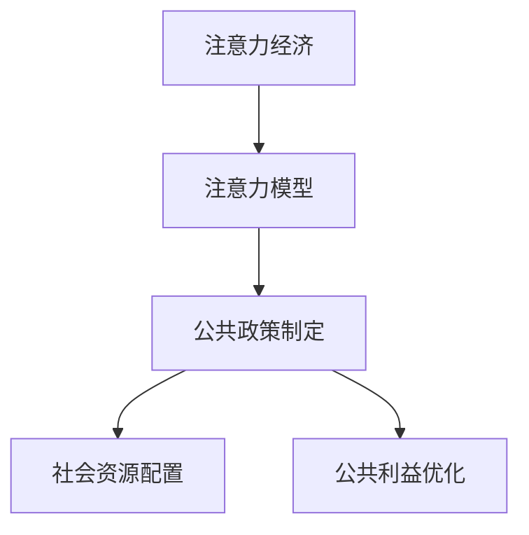

                 

## 1. 背景介绍

### 1.1 问题由来
在信息爆炸的数字化时代，注意力成为稀缺资源。如何高效配置这一资源，成为了现代社会的一项重要挑战。对于企业来说，需要了解用户的注意力偏好，制定有效的市场策略。对于政府而言，则需要在公共政策制定中，精确引导公众的注意力，实现社会价值的最大化。

### 1.2 问题核心关键点
注意力经济的核心在于如何通过数据分析和模型构建，精准预测和引导公众的注意力。公共政策制定则侧重于如何通过引导公众的注意力，实现社会资源的有效配置和公共利益的优化。本文旨在探讨注意力经济在公共政策制定中的应用，具体研究如下关键点：

1. 注意力经济理论基础：了解注意力经济的基本概念和运作机制。
2. 注意力模型构建：如何利用数据和算法，构建预测公众注意力的模型。
3. 公共政策应用：探讨注意力模型在公共政策制定中的具体应用案例。
4. 数据伦理与隐私保护：在注意力分析中如何平衡数据利用和隐私保护。

### 1.3 问题研究意义
研究注意力经济对公共政策制定的影响，具有重要理论和实践意义：

1. **理论贡献**：深化对注意力经济和公共政策制定理论的理解，推动跨学科研究发展。
2. **实践价值**：为公共政策制定提供数据驱动的新思路，提升政策制定效率和效果。
3. **技术创新**：促进数据科学和公共政策理论的融合，推动相关技术的创新和发展。
4. **社会影响**：改善政策制定的公众参与度，提升政策的社会接受度和执行效果。

## 2. 核心概念与联系

### 2.1 核心概念概述

注意力经济(Attention Economy)是指在信息过载的社会背景下，通过吸引和保持公众注意力，实现商业、政治和社会目标的一种经济模式。注意力模型(Attention Model)则是利用机器学习和深度学习技术，预测并优化公众注意力的分布和变化。

公共政策制定(Public Policy Making)是指政府通过立法、行政、经济、教育等手段，实现社会资源的有效配置和公共利益的优化。注意力经济和公共政策制定之间具有紧密联系：

1. **数据基础**：注意力经济依赖于对公众注意力的精准预测，公共政策制定则依赖于对社会问题的全面分析。
2. **技术支撑**：注意力模型的构建和应用，为公共政策制定提供了数据驱动的新工具。
3. **目标一致**：二者最终目的都是优化资源配置和提升公众福利，以实现社会的长远发展。

通过以下Mermaid流程图，可以更直观地理解注意力经济、注意力模型和公共政策制定之间的关系：



该流程图展示了注意力模型如何通过技术手段，预测公众的注意力分布，进而支持公共政策的制定，优化资源配置和公共利益。

## 3. 核心算法原理 & 具体操作步骤

### 3.1 算法原理概述

注意力模型通过学习公众对信息的注意力分布，预测不同内容、事件或话题的吸引力。公共政策制定则通过分析注意力模型提供的信息，制定出更有针对性的政策，以提高社会资源的配置效率和公共利益的优化程度。

### 3.2 算法步骤详解

#### 3.2.1 数据准备
1. **数据来源**：收集相关领域的文本数据、视频数据、社交媒体数据等，作为注意力模型的训练样本。
2. **数据预处理**：对数据进行清洗、去重、分词等处理，构建适合模型训练的输入格式。
3. **数据标注**：标注数据中每个样本的注意力焦点，如关键词、热门话题等，作为模型的监督信号。

#### 3.2.2 模型构建
1. **模型选择**：选择合适的注意力模型框架，如Transformer、LSTM等，构建预测公众注意力的模型。
2. **模型训练**：使用标注好的数据集训练模型，优化模型参数，提升预测精度。
3. **模型评估**：在验证集上评估模型性能，调整模型参数，提高模型泛化能力。

#### 3.2.3 模型应用
1. **公众注意力分析**：利用训练好的注意力模型，预测公众对不同内容、事件或话题的注意力分布。
2. **政策制定优化**：根据注意力分析结果，优化公共政策的目标、内容、实施策略等，以提高政策效果。

#### 3.2.4 结果展示与反馈
1. **结果展示**：将注意力分析和公共政策优化的结果可视化，供决策者参考。
2. **反馈调整**：根据政策实施效果和公众反馈，进一步调整模型和政策，优化资源配置。

### 3.3 算法优缺点

#### 3.3.1 优点
1. **数据驱动**：利用注意力模型提供的数据，公共政策制定更加科学和精准。
2. **实时响应**：通过持续的数据采集和模型训练，公共政策可以实时响应社会变化，提高时效性。
3. **定制化服务**：注意力模型能够识别公众的具体需求和兴趣，制定更有针对性的政策。

#### 3.3.2 缺点
1. **数据依赖**：注意力模型的性能依赖于数据质量和数量，数据不足可能影响预测精度。
2. **隐私风险**：在收集和分析公众数据时，可能存在隐私泄露的风险。
3. **算法透明性**：注意力模型通常作为"黑箱"模型，难以解释其内部工作机制。

### 3.4 算法应用领域

注意力经济和公共政策制定在多个领域具有广泛应用：

1. **健康政策**：通过分析公众对健康信息的关注度，制定健康宣传和防控策略。
2. **教育政策**：通过分析学生和家长对教育内容的关注度，优化教育资源分配和课程设置。
3. **公共安全**：通过分析公众对公共安全事件的关注度，制定应急预案和预防措施。
4. **环境保护**：通过分析公众对环保问题的关注度，推动环境保护政策的制定和执行。

## 4. 数学模型和公式 & 详细讲解  
### 4.1 数学模型构建

注意力模型的核心在于如何构建预测公众注意力的数学模型。常用的数学模型包括线性回归模型、卷积神经网络(Convolutional Neural Networks, CNN)、循环神经网络(Recurrent Neural Networks, RNN)和Transformer等。

以Transformer为例，其基本结构包括自注意力机制(Self-Attention)、多头注意力机制(Multi-Head Attention)、层归一化(Layer Normalization)等。在Transformer中，注意力模型通过计算输入序列中每个位置与其他位置的注意力权重，预测每个位置的重要性。

### 4.2 公式推导过程

以Transformer中的多头注意力机制为例，其数学公式推导如下：

设输入序列为 $X = \{x_1, x_2, \cdots, x_n\}$，其中 $x_i$ 表示第 $i$ 个输入位置的向量。多头注意力模型的输出为 $Y = \{y_1, y_2, \cdots, y_n\}$，其中 $y_i$ 表示第 $i$ 个输出位置的向量。

多头注意力模型的计算过程包括三个步骤：

1. **查询(q)、键(k)、值(v)的计算**：
   $$
   q_k = X_kW^Q, \quad q_v = X_vW^V
   $$
   其中 $X_k$ 和 $X_v$ 分别为输入序列的键和值，$W^Q$ 和 $W^V$ 为查询和值矩阵的权重矩阵。

2. **注意力分数的计算**：
   $$
   A = q_kk_v^T
   $$
   其中 $k_v$ 表示键向量的转置矩阵，$A$ 表示注意力分数矩阵。

3. **输出向量的计算**：
   $$
   Y = AV^O
   $$
   其中 $V^O$ 为输出向量矩阵的权重矩阵。

通过上述计算过程，Transformer模型能够预测输入序列中每个位置的注意力权重，实现对公众注意力的预测和分析。

### 4.3 案例分析与讲解

以某城市环境政策制定为例，利用注意力模型预测公众对不同环境保护活动的关注度。

1. **数据准备**：收集城市居民在社交媒体上关于环境保护的讨论数据，标注数据中每个话题的关注度和热度。
2. **模型构建**：构建基于Transformer的注意力模型，对收集到的数据进行训练和优化。
3. **注意力分析**：利用训练好的模型，预测不同环境保护活动的公众关注度。
4. **政策制定**：根据注意力分析结果，制定环境保护宣传和实施策略，优化资源配置。

## 5. 项目实践：代码实例和详细解释说明

### 5.1 开发环境搭建

在开始项目实践之前，首先需要搭建好开发环境。具体步骤如下：

1. **安装Python和相关库**：确保Python版本为3.7以上，并安装TensorFlow、Keras、NLTK等库。
2. **搭建模型训练环境**：使用Google Colab或AWS等云平台，搭建GPU环境，以加快模型训练速度。
3. **数据准备与标注**：收集和标注相关领域的数据，构建适合模型训练的输入和标签。

### 5.2 源代码详细实现

以下是一个简单的注意力模型代码实现：

```python
import tensorflow as tf
from tensorflow.keras.layers import Input, Dense, Embedding, Dropout
from tensorflow.keras.models import Model

# 定义模型输入
input = Input(shape=(None,), dtype='int32')

# 嵌入层
embedding = Embedding(input_dim=vocab_size, output_dim=embedding_dim)(input)

# 多头注意力层
attention = AttentionLayer(embedding)(input)

# 全连接层
fc = Dense(128, activation='relu')(attention)

# 输出层
output = Dense(1, activation='sigmoid')(fc)

# 定义模型
model = Model(inputs=input, outputs=output)

# 编译模型
model.compile(optimizer='adam', loss='binary_crossentropy', metrics=['accuracy'])

# 训练模型
model.fit(X_train, y_train, batch_size=64, epochs=10, validation_data=(X_val, y_val))
```

在上述代码中，使用了TensorFlow和Keras构建了基于Transformer的多头注意力模型。模型包含输入层、嵌入层、多头注意力层、全连接层和输出层，通过编译和训练，实现了对公众注意力的预测。

### 5.3 代码解读与分析

在代码实现中，输入层定义了模型的输入格式，嵌入层将输入数据映射到低维空间，多头注意力层通过计算注意力权重，输出每个位置的注意力分数，全连接层进行特征提取和处理，输出层输出预测结果。通过训练和评估，模型可以不断优化，提高预测精度。

## 6. 实际应用场景

### 6.1 智能交通管理

智能交通管理是注意力经济在公共政策制定中的典型应用。通过分析公众对交通信息的关注度，政府可以制定出更有效的交通管理措施。例如，利用注意力模型预测公众对不同交通方式的偏好，优化交通路线和调度，减少拥堵和污染。

### 6.2 公共健康宣传

在公共健康领域，注意力模型可以用于分析公众对健康信息的关注度，指导健康宣传和预防措施的制定。例如，通过预测公众对新冠疫苗接种的关注度，政府可以制定更有效的宣传策略，提高疫苗接种率。

### 6.3 教育资源分配

教育资源分配也是注意力经济在公共政策制定中的重要应用。通过分析学生和家长对教育内容的关注度，政府可以优化教育资源分配，提高教育质量和公平性。例如，利用注意力模型预测热门学科和教学内容，合理配置师资和设施，提升教育效果。

## 7. 工具和资源推荐

### 7.1 学习资源推荐

为了更好地掌握注意力经济和公共政策制定的理论基础，推荐以下学习资源：

1. **《注意力经济与公共政策》（Attention Economy and Public Policy）**：深入分析注意力经济和公共政策的理论基础，探讨其应用和影响。
2. **《深度学习理论与实践》（Deep Learning Theory and Practice）**：介绍深度学习的基础知识和应用案例，包括注意力模型在公共政策中的应用。
3. **Coursera《数据科学与公共政策》（Data Science and Public Policy）**：通过在线课程学习数据科学和公共政策的基本原理和方法。

### 7.2 开发工具推荐

以下是一些推荐的开发工具，可用于注意力经济和公共政策制定的研究：

1. **Google Colab**：提供免费的GPU计算资源，方便快速迭代实验。
2. **TensorFlow**：强大的深度学习框架，支持多种模型构建和训练。
3. **Keras**：基于TensorFlow的高级API，简化模型开发和训练过程。
4. **NLTK**：自然语言处理工具包，方便进行文本数据预处理和分析。

### 7.3 相关论文推荐

以下是几篇相关的研究论文，推荐阅读：

1. **《注意力机制在深度学习中的应用》（Attention Mechanism in Deep Learning）**：综述注意力机制的理论基础和应用案例，探讨其对公共政策制定的影响。
2. **《公共政策制定中的注意力分析》（Attention Analysis in Public Policy Making）**：通过案例研究，探讨注意力模型在公共政策制定中的具体应用。
3. **《数据科学与公共政策融合》（Data Science and Public Policy Integration）**：探讨数据科学和公共政策的融合，推动公共政策制定的科学化和数据化。

## 8. 总结：未来发展趋势与挑战

### 8.1 研究成果总结

本文对注意力经济在公共政策制定中的应用进行了系统探讨，主要研究结论如下：

1. **理论基础**：通过构建注意力模型，预测公众注意力的分布和变化，为公共政策的制定提供数据支撑。
2. **模型构建**：利用深度学习技术，构建预测公众注意力的模型，实现对注意力数据的自动化处理和分析。
3. **政策应用**：将注意力模型应用于智能交通管理、公共健康宣传、教育资源分配等多个领域，提升公共政策的科学性和实效性。
4. **数据伦理**：探讨注意力分析中的数据隐私保护和算法透明性问题，强调在公共政策制定中需要平衡数据利用和隐私保护。

### 8.2 未来发展趋势

展望未来，注意力经济和公共政策制定将呈现以下发展趋势：

1. **跨领域应用**：注意力模型将应用于更多领域，如环境保护、社会治理等，提升公共政策的全面性和科学性。
2. **实时响应**：通过持续的数据采集和模型训练，公共政策可以实时响应社会变化，提高时效性。
3. **个性化服务**：注意力模型能够识别公众的具体需求和兴趣，制定更有针对性的政策，提升政策效果。
4. **数据驱动**：公共政策的制定将更多依赖于数据驱动，通过分析注意力数据，优化资源配置和公共利益。

### 8.3 面临的挑战

尽管注意力经济在公共政策制定中具有广泛应用前景，但也面临诸多挑战：

1. **数据隐私**：在收集和分析公众数据时，可能存在隐私泄露的风险。
2. **算法透明性**：注意力模型通常作为"黑箱"模型，难以解释其内部工作机制。
3. **数据质量**：注意力模型的性能依赖于数据质量和数量，数据不足可能影响预测精度。
4. **模型鲁棒性**：注意力模型可能受到对抗样本的干扰，影响其预测精度和鲁棒性。

### 8.4 研究展望

未来的研究需要在以下几个方面寻求新的突破：

1. **隐私保护**：探讨如何在数据收集和分析中保护个人隐私，确保公众数据的安全和合法使用。
2. **算法透明性**：通过模型解释和可视化技术，提高注意力模型的可解释性，增强其可信度和透明度。
3. **数据质量**：利用先进的数据清洗和增强技术，提升数据质量和数量，提高模型预测精度。
4. **鲁棒性优化**：通过对抗样本训练和鲁棒性优化，提升模型的鲁棒性和抗干扰能力。

## 9. 附录：常见问题与解答

**Q1：注意力模型在公共政策制定中的应用主要有哪些？**

A: 注意力模型在公共政策制定中的应用主要包括以下几个方面：

1. **数据收集与分析**：通过分析公众对信息的注意力分布，收集和分析相关领域的数据，为政策制定提供数据支撑。
2. **注意力预测**：利用深度学习技术，预测公众对不同内容、事件或话题的关注度，指导政策的制定和实施。
3. **优化资源配置**：根据注意力分析结果，优化公共政策的资源配置和实施策略，提高政策效果。

**Q2：如何平衡注意力分析中的数据利用和隐私保护？**

A: 在注意力分析中，平衡数据利用和隐私保护的方法主要包括：

1. **匿名化处理**：通过数据匿名化技术，去除个人身份信息，保护用户隐私。
2. **数据加密**：在数据传输和存储过程中，采用加密技术，防止数据泄露。
3. **用户授权**：在数据收集和使用过程中，获得用户授权，确保数据使用的合法性。
4. **隐私保护技术**：采用差分隐私、联邦学习等隐私保护技术，确保数据使用的安全性。

**Q3：注意力模型在公共政策制定中需要注意哪些问题？**

A: 在公共政策制定中，使用注意力模型需要注意以下问题：

1. **数据质量**：确保数据的质量和数量，避免模型过拟合和欠拟合。
2. **模型鲁棒性**：采用对抗样本训练等方法，提升模型的鲁棒性和抗干扰能力。
3. **算法透明性**：通过模型解释和可视化技术，提高模型的可解释性和透明度。
4. **隐私保护**：在数据收集和分析中，保护用户隐私，确保数据使用的合法性和安全性。

---

作者：禅与计算机程序设计艺术 / Zen and the Art of Computer Programming

