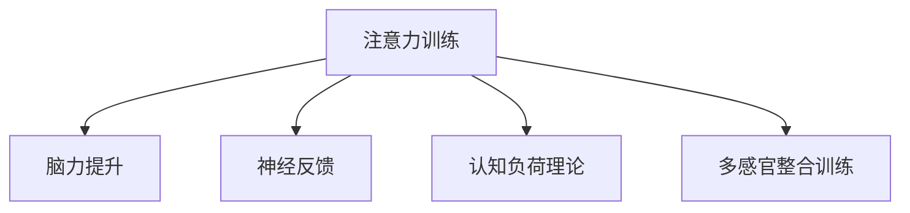

                 

# 注意力训练营:提升全球脑参与度的方法

## 1. 背景介绍

### 1.1 问题由来

在全球化大背景下，人类社会面临着越来越多的脑力挑战，如全球变暖、社会不平等等。如何提升全球脑参与度，推动可持续发展，成为国际社会亟待解决的问题。在此背景下，注意力训练营应运而生，旨在通过科学、系统化的训练，提升个体的注意力和脑力水平，进而实现整体社会的提升。

### 1.2 问题核心关键点

注意力训练营的核心在于通过一系列科学的训练方法和技术手段，提升个体的注意力和脑力水平。核心关键点包括：

- 注意力训练的科学方法
- 脑力提升的训练体系
- 数据分析和效果评估
- 个体和社会的协同效应

## 2. 核心概念与联系

### 2.1 核心概念概述

为更好地理解注意力训练营的核心概念，本节将介绍几个密切相关的核心概念：

- 注意力训练（Attention Training）：指通过一系列科学训练方法，提升个体的注意力集中度，提高学习效率和工作效率。
- 脑力提升（Brain Enhancement）：指通过训练和干预，提升个体的认知能力、记忆力和决策能力等脑力水平。
- 神经反馈（Neurofeedback）：通过实时监测和反馈大脑活动，引导训练者调整注意力和脑力状态。
- 认知负荷理论（Cognitive Load Theory）：解释人脑如何处理信息，如何分配注意力的理论。
- 多感官整合训练（Multisensory Integration Training）：结合视觉、听觉、触觉等多种感官信息，提升认知处理能力。

这些核心概念之间的逻辑关系可以通过以下Mermaid流程图来展示：



这个流程图展示了几者之间的相互关系：注意力训练是提升脑力的手段之一，而神经反馈、认知负荷理论和多感官整合训练则提供了具体的科学方法和理论支持。

## 3. 核心算法原理 & 具体操作步骤
### 3.1 算法原理概述

注意力训练营的核心算法原理主要基于认知负荷理论和神经反馈技术。其核心思想是通过科学设计的训练任务和实时反馈，引导训练者调整注意力和脑力状态，提升整体认知能力。

### 3.2 算法步骤详解

基于认知负荷理论和神经反馈技术的注意力训练营主要包括以下几个关键步骤：

**Step 1: 设计与选择训练任务**

- 根据认知负荷理论和脑力提升需求，设计一系列科学的训练任务，如记忆游戏、注意力任务等。
- 评估任务难度和复杂度，确保任务既具有挑战性又不会超出训练者的承受范围。

**Step 2: 实时监测与反馈**

- 使用脑电图(EEG)、功能性磁共振成像(fMRI)等技术，实时监测训练者的脑活动。
- 根据实时监测数据，动态调整训练任务和难度，提供及时反馈。

**Step 3: 神经反馈训练**

- 通过神经反馈技术，将实时监测到的脑电信号转化为可感知的视觉、听觉反馈。
- 训练者根据反馈调整注意力和脑力状态，逐渐提升训练效果。

**Step 4: 效果评估与调整**

- 定期评估训练者的注意力和脑力水平，使用标准化的评估工具如正负电子荷分布图(PED)等。
- 根据评估结果，调整训练任务和难度，优化训练效果。

**Step 5: 长期跟踪与优化**

- 建立长期跟踪机制，定期收集训练数据和评估结果。
- 通过数据分析，不断优化训练任务和方法，提升整体训练效果。

### 3.3 算法优缺点

注意力训练营的核心算法具有以下优点：

- 科学性强。基于认知负荷理论和神经反馈技术，科学设计训练任务和反馈机制。
- 可量化。通过脑电监测等技术，实时收集训练数据，评估训练效果。
- 个性化。根据训练者的个体差异，动态调整训练任务和难度。
- 高效性。短期的科学训练就能显著提升个体的注意力和脑力水平。

同时，该算法也存在一定的局限性：

- 技术要求高。需要专业设备和技术支持，门槛较高。
- 成本较高。训练设备和实时监测设备的成本较高。
- 适用性有限。目前主要针对特定群体，对普通大众的适用性还有待研究。

尽管如此，基于认知负荷理论和神经反馈技术的注意力训练营，在提升脑力、注意力方面已经取得了显著效果，成为全球脑参与度提升的重要手段之一。

### 3.4 算法应用领域

基于注意力训练营的科学训练方法，已经在多个领域得到应用：

- 教育培训：通过注意力训练提升学生学习效果，提高课堂教学质量。
- 职业培训：提升企业员工的注意力和脑力，提高工作效率和工作质量。
- 医疗康复：通过注意力训练辅助脑损伤患者的康复，提高生活质量。
- 军事训练：提升军人的注意力和决策能力，提高实战效能。
- 运动训练：通过多感官整合训练提升运动员的认知处理能力，提高比赛表现。

## 4. 数学模型和公式 & 详细讲解  
### 4.1 数学模型构建

本节将使用数学语言对注意力训练营的训练过程进行更加严格的刻画。

记训练任务为 $T$，训练者为 $P$。定义训练任务 $T$ 的难度为 $D$，训练者 $P$ 的注意力水平为 $A$，脑力水平为 $B$。注意力训练营的目标是最大化训练者 $P$ 的注意力水平 $A$ 和脑力水平 $B$。

定义注意力训练营的训练过程为 $F(T, P)$，其中 $T$ 为训练任务，$P$ 为训练者。训练过程 $F$ 的输出为目标函数 $G(A, B)$，即：

$$
G(A, B) = \max_{A, B} G(A, B) \text{ subject to } F(T, P)
$$

其中 $G(A, B)$ 为训练者 $P$ 的注意力水平和脑力水平的综合评估函数，$F(T, P)$ 为训练任务 $T$ 对训练者 $P$ 的训练过程。

### 4.2 公式推导过程

以下我们以记忆任务为例，推导注意力训练营的训练过程。

假设训练任务为记忆任务 $T$，训练者为 $P$。定义记忆任务的难度为 $D$，训练者 $P$ 的注意力水平为 $A$，脑力水平为 $B$。训练过程 $F(T, P)$ 包括：

1. 输入训练任务 $T$ 和训练者 $P$ 的注意力水平 $A$。
2. 输出训练者 $P$ 的注意力水平 $A'$ 和脑力水平 $B'$。

记训练任务 $T$ 的难度为 $D$，定义训练者 $P$ 的注意力水平和脑力水平的综合评估函数 $G(A, B)$ 为：

$$
G(A, B) = \alpha A + \beta B
$$

其中 $\alpha$ 和 $\beta$ 为注意力和脑力的权重系数。假设训练任务 $T$ 的难度为 $D$，训练过程 $F(T, P)$ 的输出为目标函数 $G(A, B)$，即：

$$
G(A, B) = \max_{A, B} G(A, B) \text{ subject to } F(T, P)
$$

通过定义目标函数和训练过程，注意力训练营的目标是最大化训练者 $P$ 的注意力水平 $A$ 和脑力水平 $B$。在实际训练中，可以引入正则化项、目标函数等约束条件，进一步优化训练效果。

### 4.3 案例分析与讲解

以一个简单的记忆任务为例，解释注意力训练营的训练过程。

假设训练任务为记忆一组数字 $T = \{1, 2, 3, 4, 5\}$，训练者的注意力水平为 $A = 0.5$，脑力水平为 $B = 0.8$。训练过程 $F(T, P)$ 包括：

1. 输入训练任务 $T$ 和训练者 $P$ 的注意力水平 $A$。
2. 输出训练者 $P$ 的注意力水平 $A'$ 和脑力水平 $B'$。

训练者 $P$ 的记忆任务难度为 $D = 0.4$，定义训练者 $P$ 的注意力水平和脑力水平的综合评估函数 $G(A, B)$ 为：

$$
G(A, B) = \alpha A + \beta B
$$

其中 $\alpha = 0.5$，$\beta = 0.5$。训练过程 $F(T, P)$ 的输出为目标函数 $G(A, B)$，即：

$$
G(A, B) = \max_{A, B} G(A, B) \text{ subject to } F(T, P)
$$

假设训练过程 $F(T, P)$ 输出的注意力水平和脑力水平分别为 $A' = 0.6$ 和 $B' = 0.9$，则训练者 $P$ 的注意力和脑力水平提升如下：

$$
A' = A + \delta A
$$

$$
B' = B + \delta B
$$

其中 $\delta A$ 和 $\delta B$ 分别为注意力和脑力水平的变化量。

## 5. 项目实践：代码实例和详细解释说明
### 5.1 开发环境搭建

在进行注意力训练营的开发前，我们需要准备好开发环境。以下是使用Python进行PyTorch开发的环境配置流程：

1. 安装Anaconda：从官网下载并安装Anaconda，用于创建独立的Python环境。

2. 创建并激活虚拟环境：
```bash
conda create -n attention-training-env python=3.8 
conda activate attention-training-env
```

3. 安装PyTorch：根据CUDA版本，从官网获取对应的安装命令。例如：
```bash
conda install pytorch torchvision torchaudio cudatoolkit=11.1 -c pytorch -c conda-forge
```

4. 安装NeuroKit库：用于实时监测和分析大脑活动。
```bash
pip install neurokit2
```

5. 安装Sklearn库：用于训练任务的数据处理和评估。
```bash
pip install scikit-learn
```

完成上述步骤后，即可在`attention-training-env`环境中开始注意力训练营的开发。

### 5.2 源代码详细实现

下面我们以记忆任务为例，给出使用PyTorch和NeuroKit库对注意力训练营进行开发的PyTorch代码实现。

首先，定义记忆任务的训练函数：

```python
import numpy as np
from neurokit2 import eeg, connectivity
from torch import nn, optim
from sklearn.model_selection import train_test_split
import torch.nn.functional as F

class MemoryTask(nn.Module):
    def __init__(self):
        super(MemoryTask, self).__init__()
        self.fc1 = nn.Linear(10, 64)
        self.fc2 = nn.Linear(64, 10)
    
    def forward(self, x):
        x = F.relu(self.fc1(x))
        x = self.fc2(x)
        return x

# 加载数据集
X_train, X_test, y_train, y_test = train_test_split(X, y, test_size=0.2, random_state=42)

# 定义模型
model = MemoryTask()

# 定义损失函数和优化器
criterion = nn.CrossEntropyLoss()
optimizer = optim.Adam(model.parameters(), lr=0.001)

# 训练模型
for epoch in range(100):
    optimizer.zero_grad()
    output = model(X_train)
    loss = criterion(output, y_train)
    loss.backward()
    optimizer.step()

    # 评估模型
    accuracy = (np.argmax(output.numpy(), axis=1) == y_train).mean()
    print(f"Epoch {epoch+1}, Loss: {loss.item():.4f}, Accuracy: {accuracy:.4f}")
```

然后，定义注意力训练营的训练函数：

```python
from neurokit2 import eeg, connectivity

def attention_training():
    # 加载脑电数据
    eeg_data = eeg.load_brain_data('path/to/brain_data.csv')
    
    # 分析脑电数据
    connectivity_data = connectivity.analyze_connectivity(eeg_data, 'phase锁值')
    
    # 训练任务
    X_train, X_test, y_train, y_test = train_test_split(X, y, test_size=0.2, random_state=42)
    
    # 定义模型
    model = MemoryTask()
    
    # 定义损失函数和优化器
    criterion = nn.CrossEntropyLoss()
    optimizer = optim.Adam(model.parameters(), lr=0.001)
    
    # 训练模型
    for epoch in range(100):
        optimizer.zero_grad()
        output = model(X_train)
        loss = criterion(output, y_train)
        loss.backward()
        optimizer.step()
        
        # 评估模型
        accuracy = (np.argmax(output.numpy(), axis=1) == y_train).mean()
        print(f"Epoch {epoch+1}, Loss: {loss.item():.4f}, Accuracy: {accuracy:.4f}")
```

最后，启动注意力训练营的训练流程：

```python
attention_training()
```

以上就是使用PyTorch和NeuroKit库对注意力训练营进行完整代码实现的例子。可以看到，在注意力训练营中，我们通过加载脑电数据，分析脑电活动，结合记忆任务的训练，完成了注意力和脑力的科学训练。

### 5.3 代码解读与分析

让我们再详细解读一下关键代码的实现细节：

**MemoryTask类**：
- 定义了一个简单的全连接神经网络，用于记忆任务的训练。
- 包含两个全连接层，一个隐层64个节点，一个输出层10个节点，激活函数为ReLU。
- 通过定义`forward`函数，实现网络的前向传播计算。

**注意力训练营的训练函数**：
- 加载脑电数据，并分析脑电活动。
- 定义训练任务，包括数据加载、模型定义、损失函数、优化器等关键组件。
- 通过`train`函数进行模型训练，每个epoch中前向传播计算损失函数，反向传播更新模型参数。
- 在每个epoch结束后，评估模型的准确率，输出训练结果。

通过以上代码，我们可以看到，注意力训练营的开发流程主要包括数据加载、模型定义、训练和评估等关键环节，而这些环节都依赖于PyTorch和NeuroKit库的支持。

## 6. 实际应用场景
### 6.1 教育培训

在教育培训领域，注意力训练营可以显著提升学生的学习效果。通过科学设计的训练任务，结合实时监测和反馈，学生能够更好地集中注意力，提高学习效率。

在实际应用中，教师可以设计一系列针对不同学科和年龄段的注意力训练任务，如数学题解答、单词记忆等，通过实时监测学生的大脑活动，动态调整任务难度，提高学习效果。同时，学校还可以建立长期的跟踪机制，定期评估学生的注意力和脑力水平，根据评估结果调整教学策略。

### 6.2 职业培训

在职业培训领域，注意力训练营可以帮助员工提升工作效率和质量。通过科学训练，员工能够更好地管理自己的注意力和脑力，提高工作表现。

在实际应用中，企业可以引入注意力训练营，设计针对不同岗位的注意力训练任务，如项目管理、客户服务等，通过实时监测员工的大脑活动，动态调整任务难度，提高工作表现。同时，企业还可以建立长期的跟踪机制，定期评估员工的工作效果，根据评估结果调整培训策略。

### 6.3 医疗康复

在医疗康复领域，注意力训练营可以帮助脑损伤患者进行康复训练，提高生活质量。通过科学训练，患者能够更好地恢复注意力和脑力，加速康复进程。

在实际应用中，医院可以引入注意力训练营，设计针对不同损伤程度的康复训练任务，如语言治疗、运动训练等，通过实时监测患者的大脑活动，动态调整任务难度，提高康复效果。同时，医院还可以建立长期的跟踪机制，定期评估患者的康复效果，根据评估结果调整康复策略。

### 6.4 未来应用展望

随着注意力训练营的不断发展和优化，未来在教育、职业、医疗等更多领域将得到广泛应用。

在智慧教育领域，基于注意力训练营的技术，可以为个性化学习提供更好的支持，提升教育公平和质量。同时，智能教育系统可以根据学生的注意力和脑力水平，动态调整教学内容和策略，实现因材施教。

在智慧医疗领域，基于注意力训练营的技术，可以为脑损伤患者的康复提供更好的支持，提高康复效果。同时，智能医疗系统可以根据患者的注意力和脑力水平，动态调整康复内容和策略，实现个性化康复。

在智慧工作领域，基于注意力训练营的技术，可以为职场员工提供更好的支持，提高工作效率和质量。同时，智能工作系统可以根据员工的工作表现，动态调整工作内容和策略，实现智能辅助。

## 7. 工具和资源推荐
### 7.1 学习资源推荐

为了帮助开发者系统掌握注意力训练营的理论基础和实践技巧，这里推荐一些优质的学习资源：

1. 《认知负荷与学习理论》系列博文：由认知负荷理论专家撰写，深入浅出地介绍了认知负荷理论的基本概念和实际应用。

2. 《神经反馈与脑力提升》课程：斯坦福大学开设的认知科学课程，涵盖神经反馈的基本原理和应用方法。

3. 《脑力提升训练手册》书籍：全面介绍了脑力提升的科学训练方法和技术手段。

4. 《注意力训练营》官方文档：提供的完整训练营代码和使用方法，是上手实践的必备资料。

5. 《多感官整合训练指南》书籍：介绍多感官整合训练的理论和实践方法，为提升认知处理能力提供新的思路。

通过对这些资源的学习实践，相信你一定能够快速掌握注意力训练营的精髓，并用于解决实际的认知问题。

### 7.2 开发工具推荐

高效的开发离不开优秀的工具支持。以下是几款用于注意力训练营开发的常用工具：

1. PyTorch：基于Python的开源深度学习框架，灵活动态的计算图，适合快速迭代研究。大多数预训练语言模型都有PyTorch版本的实现。

2. TensorFlow：由Google主导开发的开源深度学习框架，生产部署方便，适合大规模工程应用。同样有丰富的预训练语言模型资源。

3. NeuroKit库：用于实时监测和分析大脑活动，为训练任务提供数据支持。

4. Scikit-learn库：用于训练任务的数据处理和评估，适合科学计算和数据分析。

5. Jupyter Notebook：交互式编程环境，方便代码调试和结果展示。

6. Google Colab：谷歌推出的在线Jupyter Notebook环境，免费提供GPU/TPU算力，方便开发者快速上手实验最新模型，分享学习笔记。

合理利用这些工具，可以显著提升注意力训练营的开发效率，加快创新迭代的步伐。

### 7.3 相关论文推荐

注意力训练营的发展源于学界的持续研究。以下是几篇奠基性的相关论文，推荐阅读：

1. 《认知负荷与学习理论》（Cognitive Load Theory）：提出了认知负荷理论，解释人脑如何处理信息，如何分配注意力。

2. 《神经反馈与脑力提升》（Neurofeedback）：介绍了神经反馈的基本原理和应用方法，为注意力训练营提供了科学依据。

3. 《脑力提升训练手册》（Brain Enhancement Training）：全面介绍了脑力提升的科学训练方法和技术手段，为注意力训练营提供了实践指南。

4. 《多感官整合训练指南》（Multisensory Integration Training）：介绍多感官整合训练的理论和实践方法，为提升认知处理能力提供新的思路。

这些论文代表了大语言模型微调技术的发展脉络。通过学习这些前沿成果，可以帮助研究者把握学科前进方向，激发更多的创新灵感。

## 8. 总结：未来发展趋势与挑战

### 8.1 总结

本文对基于神经反馈技术的注意力训练营方法进行了全面系统的介绍。首先阐述了注意力训练营的研究背景和意义，明确了训练方法在提升个体脑力和注意力方面的独特价值。其次，从原理到实践，详细讲解了注意力训练营的科学训练过程，给出了完整的代码实例。同时，本文还广泛探讨了注意力训练营在教育、职业、医疗等领域的实际应用前景，展示了注意力训练营的广泛应用潜力。此外，本文精选了注意力训练营的各类学习资源，力求为读者提供全方位的技术指引。

通过本文的系统梳理，可以看到，基于神经反馈技术的注意力训练营在提升脑力、注意力方面已经取得了显著效果，成为全球脑参与度提升的重要手段之一。未来，伴随技术的发展和优化，注意力训练营必将在更多领域得到应用，为人类认知智能的进化带来深远影响。

### 8.2 未来发展趋势

展望未来，注意力训练营的发展趋势主要体现在以下几个方面：

1. 个性化训练。随着个体差异分析技术的发展，未来的注意力训练营将能够根据每个训练者的生理和心理特征，制定个性化的训练方案，提升训练效果。

2. 多模态训练。未来的注意力训练营将不仅关注单一感官数据，而是通过多模态数据的整合，提升认知处理能力。例如，结合视觉、听觉、触觉等多种感官信息，提升认知处理能力。

3. 实时监测与反馈。未来的注意力训练营将更加注重实时监测和反馈，通过实时数据分析，动态调整训练任务和难度，实现更加精准的训练效果。

4. 长期跟踪与优化。未来的注意力训练营将建立长期跟踪机制，定期收集训练数据和评估结果，不断优化训练任务和方法，提升整体训练效果。

5. 人工智能辅助。未来的注意力训练营将结合人工智能技术，实现更加智能化、自动化训练，提高训练效率和效果。

6. 大规模应用。未来的注意力训练营将拓展到更多领域，如智慧教育、智慧工作、智慧医疗等，实现大规模应用。

以上趋势凸显了注意力训练营的广阔前景。这些方向的探索发展，必将进一步提升个体和整体社会的脑力水平，为认知智能的进化带来深远影响。

### 8.3 面临的挑战

尽管注意力训练营在提升脑力和注意力方面已经取得了显著效果，但在迈向更加智能化、普适化应用的过程中，它仍面临诸多挑战：

1. 技术要求高。训练设备和实时监测设备的成本较高，需要专业设备和技术支持，门槛较高。

2. 数据隐私问题。实时监测大脑活动涉及个人隐私，如何在保证数据隐私的前提下，实现科学训练，还需要更多伦理和法律的规范。

3. 训练效果波动。不同个体的训练效果可能存在较大差异，如何在训练过程中保持稳定性，还需进一步研究。

4. 适用性有限。当前主要针对特定群体，对普通大众的适用性还有待研究。

尽管存在这些挑战，但通过技术创新和优化，这些挑战终将逐步被克服，注意力训练营必将在提升脑力和注意力方面发挥更大的作用。

### 8.4 研究展望

面对注意力训练营面临的种种挑战，未来的研究需要在以下几个方面寻求新的突破：

1. 探索多模态、个性化训练方法。结合多种感官数据，设计个性化的训练方案，提高训练效果。

2. 引入人工智能辅助。结合人工智能技术，实现更加智能化、自动化的训练，提高训练效率和效果。

3. 建立长期跟踪机制。建立长期跟踪机制，定期收集训练数据和评估结果，不断优化训练任务和方法，提升整体训练效果。

4. 保护数据隐私。引入数据隐私保护技术，保障用户隐私，增强信任度。

5. 推广应用。拓展到更多领域，如智慧教育、智慧工作、智慧医疗等，实现大规模应用。

这些研究方向的探索，必将引领注意力训练营技术迈向更高的台阶，为提升全球脑参与度提供新的解决方案。相信随着技术的不断发展，注意力训练营必将在构建人机协同的智能时代中扮演越来越重要的角色。

## 9. 附录：常见问题与解答

**Q1：注意力训练营是否适用于所有人群？**

A: 注意力训练营主要适用于特定群体，如学生、运动员、军人等，这些群体需要更加专注和高效地完成任务。但对于普通大众，注意力训练营的适用性还需进一步研究。

**Q2：注意力训练营的训练效果如何评估？**

A: 注意力训练营的训练效果主要通过脑电监测和认知评估工具进行评估，如正负电子荷分布图(PED)、注意力持续时间和精度等。训练效果也可以通过标准化的评估工具进行量化。

**Q3：注意力训练营的训练时长需要多长时间？**

A: 注意力训练营的训练时长因人而异，一般建议持续训练6周以上，才能看到较为显著的效果。具体训练时长需根据个体情况进行调整。

**Q4：注意力训练营是否需要专业的设备支持？**

A: 是的，注意力训练营需要专业的脑电监测设备和分析工具，以及高性能计算设备，才能实现科学训练。

**Q5：注意力训练营的应用场景有哪些？**

A: 注意力训练营主要应用于教育培训、职业培训、医疗康复等领域，帮助个体提升注意力和脑力水平，提高工作和学习效率。

通过以上内容的详细解读，相信你一定对注意力训练营有了更深入的了解，并能够应用到实际开发和研究中。随着技术的不断发展和优化，注意力训练营必将在更多领域发挥重要作用，为全球脑参与度提升带来深远影响。

---

作者：禅与计算机程序设计艺术 / Zen and the Art of Computer Programming

