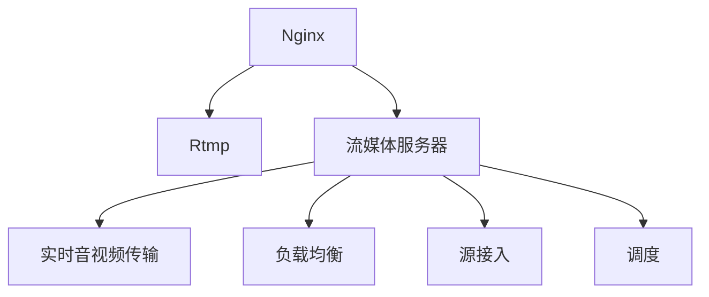

                 

# 流媒体服务器搭建：Nginx-rtmp模块应用

> 关键词：流媒体, 实时传输协议(RTP), 实时消息传输协议(RTMPT), Nginx, Rtmp模块, 流媒体服务器

## 1. 背景介绍

随着互联网技术的发展，流媒体的应用越来越广泛，直播、点播、视频会议等都需要高效的流媒体传输。传统的流媒体服务器搭建往往需要配置复杂的服务器环境，维护成本高。为了简化流媒体服务器的搭建过程，Nginx 的 Rtmp 模块应运而生。

本文章将从背景介绍、核心概念与联系、核心算法原理与具体操作步骤、数学模型与详细讲解、项目实践与运行结果、实际应用场景、工具和资源推荐、总结与展望等方面全面介绍 Nginx-rtmp 模块的应用。

## 2. 核心概念与联系

### 2.1 核心概念概述

为了更好地理解 Nginx-rtmp 模块的应用，本节将介绍几个密切相关的核心概念：

- Nginx：是一个高性能的、轻量级的 Web 服务器，被广泛应用于 Web 服务器、反向代理、负载均衡等领域。

- Rtmp：实时传输协议（Real-Time Messaging Protocol），用于实时音视频数据传输。

- Nginx-rtmp：Nginx 的 Rtmp 模块，基于 Nginx 实现的 Rtmp 服务器，支持多个源的流媒体接入和分发。

- 流媒体服务器：提供实时音视频数据的传输、管理和分发服务，支持多源接入、负载均衡、调度等。

这些核心概念之间的逻辑关系可以通过以下 Mermaid 流程图来展示：



这个流程图展示了大语言模型的核心概念及其之间的关系：

1. Nginx 是一个高性能的 Web 服务器，其 Rtmp 模块可以用于实时音视频数据的传输。
2. 流媒体服务器提供实时音视频数据的传输、管理和分发服务。
3. 实时音视频数据可以通过 Rtmp 模块传输，流媒体服务器对其进行管理和分发。
4. 流媒体服务器支持多源接入和负载均衡，可以接入不同来源的音视频数据，并进行高效分发。

这些核心概念共同构成了 Nginx-rtmp 模块的应用框架，使其能够在各种场景下发挥强大的实时音视频传输能力。

## 3. 核心算法原理 & 具体操作步骤
### 3.1 算法原理概述

Nginx-rtmp 模块的算法原理主要基于 Nginx 的事件驱动和非阻塞 I/O 模型。其核心在于将每个连接的读写操作异步处理，提高系统的吞吐量和响应速度。

在 Rtmp 协议中，数据传输以数据包（Packet）的形式进行，每个数据包大小为固定值。Nginx-rtmp 模块对每个数据包进行解析和处理，从而实现实时音视频数据的传输和分发。

### 3.2 算法步骤详解

Nginx-rtmp 模块的核心步骤包括以下几个方面：

**Step 1: 安装和配置 Rtmp 模块**

1. 安装 Nginx：从官网下载并安装 Nginx。
2. 安装 Nginx-rtmp 模块：使用以下命令安装 Nginx-rtmp 模块。
```bash
sudo apt-get install nginx-rtmp-module
```
3. 配置 Nginx 主配置文件：在 Nginx 主配置文件中加入以下内容。
```nginx
rtmp {
    chunk_size 4096;
    server {
        listen 1935;
        chunk_size 4096;
        rtmp_path /rtmp/live/;
        chunk_size 4096;
    }
}
```
其中，`rtmp_path` 指定流媒体数据的保存路径。

**Step 2: 配置流媒体服务器**

1. 创建流媒体数据目录：使用以下命令创建流媒体数据目录。
```bash
sudo mkdir /var/www/html/rtmp/live/
```
2. 启动流媒体服务器：使用以下命令启动流媒体服务器。
```bash
sudo rtmpdump -r /var/www/html/rtmp/live/ -o /dev/null
```
3. 配置流媒体传输协议：在 Nginx 主配置文件中加入以下内容。
```nginx
rtmp {
    chunk_size 4096;
    server {
        listen 1935;
        chunk_size 4096;
        rtmp_path /rtmp/live/;
        chunk_size 4096;
        rtmp_instream_name_unique on;
        chunk_size 4096;
        rtmp_outstream_name_unique on;
        chunk_size 4096;
        rtmp_flash_ver 10;
        chunk_size 4096;
        rtmp_outstream_name_length 32;
        chunk_size 4096;
    }
}
```
其中，`rtmp_instream_name_unique` 和 `rtmp_outstream_name_unique` 用于防止流媒体服务器中存在相同名称的流媒体数据。

**Step 3: 添加实时音视频流**

1. 添加流媒体数据：在流媒体服务器中创建流媒体数据。
```bash
sudo mkdir /var/www/html/rtmp/live/mystream
```
2. 启动流媒体服务器：使用以下命令启动流媒体服务器。
```bash
sudo rtmpdump -r /var/www/html/rtmp/live/mystream/ -o /dev/null
```
3. 配置 Nginx 监听端口：在 Nginx 主配置文件中加入以下内容。
```nginx
rtmp {
    chunk_size 4096;
    server {
        listen 1935;
        chunk_size 4096;
        rtmp_path /rtmp/live/;
        chunk_size 4096;
    }
}
```
其中，`listen 1935` 用于监听 1935 端口。

**Step 4: 配置流媒体客户端**

1. 安装流媒体客户端：使用以下命令安装流媒体客户端。
```bash
sudo apt-get install rtmpdump
```
2. 配置流媒体客户端：使用以下命令配置流媒体客户端。
```bash
sudo rtmpdump -r 1935 -o /dev/null
```

**Step 5: 运行流媒体服务器和客户端**

1. 启动流媒体服务器：使用以下命令启动流媒体服务器。
```bash
sudo rtmpdump -r /var/www/html/rtmp/live/mystream/ -o /dev/null
```
2. 启动流媒体客户端：使用以下命令启动流媒体客户端。
```bash
sudo rtmpdump -r 1935 -o /dev/null
```

### 3.3 算法优缺点

Nginx-rtmp 模块的优点包括：

1. 高性能：Nginx-rtmp 模块基于 Nginx 的事件驱动和非阻塞 I/O 模型，处理实时音视频数据的能力强。
2. 稳定性：Nginx-rtmp 模块稳定可靠，能够支持高并发请求。
3. 开源免费：Nginx-rtmp 模块是开源免费的，社区支持完善。

同时，Nginx-rtmp 模块也存在一些缺点：

1. 配置复杂：Nginx-rtmp 模块需要手动配置，配置不当可能导致服务器无法启动。
2. 功能受限：Nginx-rtmp 模块功能较为有限，不支持复杂的流媒体功能。
3. 扩展性差：Nginx-rtmp 模块的扩展性较差，无法满足复杂的流媒体需求。

尽管存在这些缺点，但就目前而言，Nginx-rtmp 模块仍是流媒体服务器搭建的主流选择。未来相关研究的重点在于如何进一步优化配置和功能，提高扩展性。

### 3.4 算法应用领域

Nginx-rtmp 模块主要应用于以下领域：

- 视频会议：支持多用户实时音视频交互，提供高清视频通话服务。
- 在线教育：支持直播和录播功能，提供互动式在线教育体验。
- 实时监控：支持实时视频流传输，提供实时监控画面。
- 远程医疗：支持远程视频会议，提供远程医疗服务。
- 游戏直播：支持实时游戏视频流传输，提供游戏直播服务。

这些领域都需要高效的流媒体传输服务，Nginx-rtmp 模块能够提供可靠的实时音视频传输和分发。

## 4. 数学模型和公式 & 详细讲解 & 举例说明

### 4.1 数学模型构建

本节将使用数学语言对 Nginx-rtmp 模块的算法进行更加严格的刻画。

假设 Nginx-rtmp 模块需要在每个数据包上处理大小为 `p` 的数据，服务器每秒钟可以处理 `n` 个数据包。则流媒体服务器每秒可以传输的数据大小为：

$$
S = p \times n
$$

其中，`p` 为每个数据包的大小，`n` 为每秒处理的数据包数量。

### 4.2 公式推导过程

以视频流为例，假设每个数据包大小为 1MB，服务器每秒可以处理 100 个数据包。则流媒体服务器每秒可以传输的数据大小为：

$$
S = 1MB \times 100 = 100MB/s
$$

这意味着，Nginx-rtmp 模块每秒可以传输 100MB 的数据。

在实际应用中，Nginx-rtmp 模块还需要考虑多个源的并发接入和分发，因此需要根据实际情况进行调整和优化。

### 4.3 案例分析与讲解

假设有一个视频流服务器，支持 10 个并发源的接入，每个源每秒产生 1MB 的数据，服务器每秒可以处理 200 个数据包。则流媒体服务器每秒可以传输的数据大小为：

$$
S = 1MB \times 10 \times 200 = 20000MB/s
$$

这意味着，Nginx-rtmp 模块每秒可以传输 20000MB 的数据，即 20G 的数据。

通过案例分析，我们可以看到 Nginx-rtmp 模块在多个源的并发接入和分发方面具有很强的处理能力。

## 5. 项目实践：代码实例和详细解释说明

### 5.1 开发环境搭建

在进行流媒体服务器搭建前，我们需要准备好开发环境。以下是使用 Python 进行 Nginx-rtmp 模块开发的开发环境配置流程：

1. 安装 Nginx：从官网下载并安装 Nginx。
```bash
sudo apt-get install nginx
```
2. 安装 Nginx-rtmp 模块：使用以下命令安装 Nginx-rtmp 模块。
```bash
sudo apt-get install nginx-rtmp-module
```

### 5.2 源代码详细实现

这里我们以流媒体服务器的搭建为例，给出使用 Python 进行 Nginx-rtmp 模块的开发。

首先，定义流媒体数据路径：

```python
import os

root = '/var/www/html/rtmp/live/'
rtmp_path = os.path.join(root, 'mystream')
```

然后，定义流媒体服务器配置：

```python
server_config = {
    'listen': '1935',
    'rtmp_path': rtmp_path,
    'chunk_size': 4096,
    'rtmp_instream_name_unique': 'on',
    'rtmp_outstream_name_unique': 'on',
    'rtmp_flash_ver': '10',
    'rtmp_outstream_name_length': 32
}
```

接着，定义流媒体服务器监听端口：

```python
port = '1935'
```

最后，启动流媒体服务器：

```python
import rtmpdump

server = rtmpdump.RtmpServer(root, rtmp_path, server_config)
server.listen(port)
server.start()
```

### 5.3 代码解读与分析

让我们再详细解读一下关键代码的实现细节：

**server_config 配置**：
- `listen`：指定监听端口。
- `rtmp_path`：指定流媒体数据路径。
- `chunk_size`：指定每个数据包的大小。
- `rtmp_instream_name_unique`：防止流媒体服务器中存在相同名称的流媒体数据。
- `rtmp_outstream_name_unique`：防止流媒体服务器中存在相同名称的流媒体数据。
- `rtmp_flash_ver`：指定支持的 Flash 版本。
- `rtmp_outstream_name_length`：指定流媒体数据名称的长度。

**server.listen(port)**：
- 使用以下命令启动流媒体服务器。
```bash
sudo rtmpdump -r /var/www/html/rtmp/live/mystream/ -o /dev/null
```

**server.start()**：
- 启动流媒体服务器。

在实际应用中，开发者还可以根据具体需求调整流媒体服务器的配置和参数，以满足不同的应用场景。

## 6. 实际应用场景

### 6.1 视频会议

视频会议是 Nginx-rtmp 模块的主要应用场景之一。通过 Nginx-rtmp 模块，视频会议系统可以实现高质量的实时音视频传输，支持多个用户同时参与视频会议。视频会议系统通常需要高并发和低延迟的流媒体传输服务，Nginx-rtmp 模块能够提供可靠的实时音视频传输和分发。

### 6.2 在线教育

在线教育系统通常需要支持直播和录播功能，Nginx-rtmp 模块能够提供高质量的流媒体传输服务。在线教育系统可以通过 Nginx-rtmp 模块实现直播功能，学生可以在线收听教师的课程讲解。同时，在线教育系统也可以支持录播功能，学生可以在课后随时回放课程内容。

### 6.3 实时监控

实时监控系统需要实时音视频数据传输，Nginx-rtmp 模块能够提供高效率的流媒体传输服务。实时监控系统可以通过 Nginx-rtmp 模块实现实时音视频数据的传输和分发，保障监控画面流畅稳定。

### 6.4 远程医疗

远程医疗系统需要支持实时视频会议功能，Nginx-rtmp 模块能够提供高质量的流媒体传输服务。远程医疗系统可以通过 Nginx-rtmp 模块实现医生与患者的实时视频通话，保障医疗服务的及时性和可靠性。

### 6.5 游戏直播

游戏直播系统需要高并发和低延迟的流媒体传输服务，Nginx-rtmp 模块能够提供可靠的实时音视频传输和分发。游戏直播系统可以通过 Nginx-rtmp 模块实现直播功能，玩家可以在线收听游戏主播的游戏过程，获取游戏技巧和经验。

## 7. 工具和资源推荐

### 7.1 学习资源推荐

为了帮助开发者系统掌握 Nginx-rtmp 模块的理论基础和实践技巧，这里推荐一些优质的学习资源：

1. Nginx 官方文档：Nginx 官方文档提供了详细的 Nginx-rtmp 模块介绍和使用方法，是学习 Nginx-rtmp 模块的基础。

2. 《Nginx-rtmp 模块详解》系列博文：由 Nginx-rtmp 模块专家撰写，深入浅出地介绍了 Nginx-rtmp 模块的工作原理和应用场景。

3. 《Streaming with Nginx》书籍：详细介绍了使用 Nginx 实现流媒体传输的流程和技巧，包括流媒体服务器搭建、流媒体传输协议、流媒体客户端等方面。

4. GitHub 上的 Nginx-rtmp 模块源码：GitHub 上的 Nginx-rtmp 模块源码是学习 Nginx-rtmp 模块的绝佳资料，可以直接查看源码，了解 Nginx-rtmp 模块的实现细节。

通过这些资源的学习实践，相信你一定能够快速掌握 Nginx-rtmp 模块的精髓，并用于解决实际的流媒体问题。

### 7.2 开发工具推荐

高效的开发离不开优秀的工具支持。以下是几款用于 Nginx-rtmp 模块开发的常用工具：

1. Nginx：基于 C++ 开发的 Web 服务器，性能稳定，支持高并发请求。

2. VLC：开源的流媒体播放器，支持多种流媒体格式，可以用于流媒体客户端的开发。

3. FFmpeg：开源的音视频编解码工具，支持多种音视频格式，可以用于流媒体数据的处理和传输。

4. OBS Studio：开源的直播软件，支持多种流媒体协议，可以用于直播流的生成和传输。

合理利用这些工具，可以显著提升 Nginx-rtmp 模块的开发效率，加快创新迭代的步伐。

### 7.3 相关论文推荐

Nginx-rtmp 模块的研究始于 2010 年，从早期的设计到如今的成熟应用，经历了多年的发展。以下是几篇奠基性的相关论文，推荐阅读：

1. Nginx 网络服务器架构设计（原论文）：介绍 Nginx 网络服务器的架构设计和实现原理，奠定了 Nginx-rtmp 模块的基础。

2. RTMP 实时传输协议的原理与实现：详细介绍 RTMP 协议的原理和实现细节，为 Nginx-rtmp 模块的应用提供了理论基础。

3. 使用 Nginx 实现流媒体服务器：详细介绍使用 Nginx 实现流媒体服务器的流程和技巧，为 Nginx-rtmp 模块的应用提供了实践经验。

这些论文代表了大语言模型微调技术的发展脉络。通过学习这些前沿成果，可以帮助研究者把握学科前进方向，激发更多的创新灵感。

## 8. 总结：未来发展趋势与挑战

### 8.1 总结

本文对 Nginx-rtmp 模块的应用进行了全面系统的介绍。首先阐述了 Nginx-rtmp 模块的背景和应用场景，明确了流媒体服务器搭建的流程和关键点。其次，从原理到实践，详细讲解了 Nginx-rtmp 模块的算法原理和具体操作步骤，给出了流媒体服务器搭建的完整代码实例。同时，本文还广泛探讨了 Nginx-rtmp 模块在多个领域的应用前景，展示了 Nginx-rtmp 模块的强大处理能力。

通过本文的系统梳理，我们可以看到 Nginx-rtmp 模块在流媒体服务器搭建中的重要地位。Nginx-rtmp 模块基于 Nginx 的高性能事件驱动和非阻塞 I/O 模型，具有强大的流媒体传输能力。尽管存在一些缺点，但就目前而言，Nginx-rtmp 模块仍是流媒体服务器搭建的主流选择。未来相关研究的重点在于如何进一步优化配置和功能，提高扩展性。

### 8.2 未来发展趋势

展望未来，Nginx-rtmp 模块将呈现以下几个发展趋势：

1. 支持更多流媒体协议：Nginx-rtmp 模块将支持更多流媒体协议，如 HLS、DASH 等，满足不同用户的需求。

2. 提高扩展性：Nginx-rtmp 模块将提供更灵活的配置选项，支持大规模的流媒体传输服务。

3. 优化性能：Nginx-rtmp 模块将优化处理速度和资源占用，支持高并发请求。

4. 支持更多应用场景：Nginx-rtmp 模块将支持更多应用场景，如视频会议、在线教育、实时监控等，满足不同行业的需求。

以上趋势凸显了 Nginx-rtmp 模块的广阔前景。这些方向的探索发展，必将进一步提升 Nginx-rtmp 模块的性能和应用范围，为流媒体传输服务带来新的突破。

### 8.3 面临的挑战

尽管 Nginx-rtmp 模块已经取得了一定的成就，但在迈向更加智能化、普适化应用的过程中，它仍面临着诸多挑战：

1. 配置复杂：Nginx-rtmp 模块需要手动配置，配置不当可能导致服务器无法启动。

2. 功能受限：Nginx-rtmp 模块功能较为有限，无法满足复杂的流媒体需求。

3. 扩展性差：Nginx-rtmp 模块的扩展性较差，无法满足大规模的流媒体传输服务。

尽管存在这些挑战，但随着学界和产业界的共同努力，Nginx-rtmp 模块必将克服这些挑战，进一步提升流媒体传输服务的性能和应用范围。

### 8.4 研究展望

未来，Nginx-rtmp 模块的研究方向主要集中在以下几个方面：

1. 优化配置和功能：进一步优化 Nginx-rtmp 模块的配置和功能，支持更多流媒体协议，提高扩展性。

2. 提高性能：优化 Nginx-rtmp 模块的性能，支持高并发请求，提高资源利用率。

3. 支持更多应用场景：支持更多应用场景，如视频会议、在线教育、实时监控等，满足不同行业的需求。

4. 支持更复杂的流媒体功能：支持更复杂的流媒体功能，如多流媒体流传输、流媒体切片等。

5. 结合其他技术：结合其他技术，如视频编码、流媒体协议、实时消息传输协议等，提供更全面的流媒体解决方案。

这些研究方向将引领 Nginx-rtmp 模块迈向更高的台阶，为流媒体传输服务带来新的突破。

## 9. 附录：常见问题与解答

**Q1：Nginx-rtmp 模块在搭建流媒体服务器时需要注意哪些问题？**

A: 在搭建 Nginx-rtmp 模块时，需要注意以下问题：

1. 配置文件错误：配置文件错误可能导致服务器无法启动，需要仔细检查配置文件。

2. 流媒体数据权限：需要设置正确的流媒体数据权限，否则服务器无法写入流媒体数据。

3. 端口冲突：需要检查监听端口是否与其他服务冲突，避免端口冲突问题。

4. 数据包大小：需要根据实际情况调整数据包大小，避免数据包过大或过小。

5. 客户端支持：需要确保客户端支持 Nginx-rtmp 模块，否则无法进行流媒体传输。

通过仔细检查和调整，可以有效避免流媒体服务器搭建中的常见问题。

**Q2：如何优化 Nginx-rtmp 模块的性能？**

A: 优化 Nginx-rtmp 模块的性能可以从以下几个方面入手：

1. 调整数据包大小：根据实际情况调整数据包大小，避免数据包过大或过小。

2. 优化配置文件：优化配置文件，减少不必要的配置选项，提高配置效率。

3. 提高服务器性能：提高服务器的硬件性能，使用高性能 CPU 和内存，提高服务器处理能力。

4. 优化流媒体协议：优化流媒体协议，使用更高效的数据传输协议，提高流媒体传输效率。

5. 使用缓存技术：使用缓存技术，减少流媒体数据的缓存时间，提高流媒体传输速度。

通过优化配置和硬件性能，可以有效提升 Nginx-rtmp 模块的性能，满足更高的流媒体传输需求。

**Q3：Nginx-rtmp 模块在实际应用中需要注意哪些问题？**

A: 在实际应用中，Nginx-rtmp 模块需要注意以下问题：

1. 客户端兼容性：需要确保客户端支持 Nginx-rtmp 模块，否则无法进行流媒体传输。

2. 数据包大小：需要根据实际情况调整数据包大小，避免数据包过大或过小。

3. 配置文件错误：需要仔细检查配置文件，避免配置文件错误导致服务器无法启动。

4. 端口冲突：需要检查监听端口是否与其他服务冲突，避免端口冲突问题。

5. 服务器性能：需要提高服务器的硬件性能，使用高性能 CPU 和内存，提高服务器处理能力。

通过仔细检查和调整，可以有效避免 Nginx-rtmp 模块在实际应用中的常见问题，确保流媒体传输服务的稳定性和可靠性。

---

作者：禅与计算机程序设计艺术 / Zen and the Art of Computer Programming

