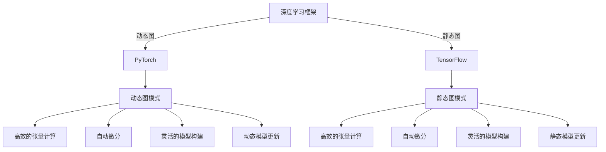

                 

# 流行的深度学习框架 PyTorch与JAX

> 关键词：深度学习框架, PyTorch, JAX, 自动微分, 张量计算, 动态图, 静态图, 高性能, 灵活性, 兼容性

## 1. 背景介绍

深度学习已成为人工智能领域的关键技术，广泛应用于计算机视觉、自然语言处理、语音识别、推荐系统等多个方向。为了高效地实现深度学习，开发者需要利用深度学习框架来加速模型构建、训练和推理。目前，市面上流行的深度学习框架主要有两种类型：基于动态图的 PyTorch 和基于静态图的 TensorFlow。本文将重点介绍这两种框架，并讨论它们各自的特点和应用场景。

## 2. 核心概念与联系

### 2.1 核心概念概述

- **深度学习框架**：一种用于构建、训练和部署深度学习模型的软件工具，支持高效的张量计算、自动微分、模型可视化等功能。
- **PyTorch**：由 Facebook 开发的深度学习框架，基于 Python 语言，支持动态图和静态图模式。
- **JAX**：由 Google 开发的深度学习框架，基于 JAX 编译器，支持静态图和动态图模式。

### 2.2 核心概念原理和架构的 Mermaid 流程图



从图中可以看出，虽然 PyTorch 和 TensorFlow 都支持自动微分和高效的张量计算，但 PyTorch 采用的是动态图模式，而 TensorFlow 采用的是静态图模式。动态图和静态图各有优缺点，适用于不同的应用场景。

## 3. 核心算法原理 & 具体操作步骤

### 3.1 算法原理概述

深度学习框架的核心功能包括自动微分、高效的张量计算和灵活的模型构建。下面分别介绍这些功能的原理。

**自动微分**：自动微分是深度学习训练的核心，用于计算模型参数对损失函数的梯度。深度学习框架通常使用反向传播算法来实现自动微分。

**高效的张量计算**：深度学习模型由大量张量组成，张量计算是模型的核心运算。深度学习框架提供了高效的张量计算库，支持矩阵乘法、卷积、池化等常用操作。

**灵活的模型构建**：深度学习模型的结构复杂，框架需要支持灵活的模型构建和更新。动态图模式允许开发者随时更改模型结构，而静态图模式则需要先定义好整个模型结构，然后逐层构建。

### 3.2 算法步骤详解

这里以 PyTorch 为例，介绍动态图模式下的深度学习模型构建和训练步骤。

1. **模型定义**：使用 PyTorch 的高级 API，定义模型的结构，如卷积层、池化层、全连接层等。

2. **数据加载**：使用 PyTorch 的数据加载器，从数据集中读取样本，并进行预处理，如归一化、数据增强等。

3. **训练循环**：使用 PyTorch 的训练循环，定义损失函数和优化器，在每个批次的数据上进行前向传播和反向传播，更新模型参数。

4. **模型保存**：使用 PyTorch 的模型保存机制，将训练好的模型保存到磁盘，以便后续使用。

### 3.3 算法优缺点

**PyTorch 的优点**：
- **动态图模式**：支持灵活的模型构建和动态模型更新，适合快速原型开发和模型调试。
- **友好的 API**：提供高级 API，易于使用和理解，适合初学者入门。
- **强大的社区支持**：拥有庞大的社区和丰富的第三方库，如 TorchVision、TorchAudio 等。

**PyTorch 的缺点**：
- **执行效率较低**：动态图模式下的张量计算和自动微分效率较低，不适合大规模分布式训练。
- **兼容性较差**：与其他深度学习框架的兼容性较差，难以复用其他框架的代码和模型。

**JAX 的优点**：
- **高性能**：基于 JAX 编译器，支持静态图和动态图模式，执行效率较高，适合大规模分布式训练。
- **灵活性**：支持多种编程范式，如函数式编程、面向对象编程等，适合复杂的模型构建。
- **兼容性**：支持与其他深度学习框架的兼容，如 TensorFlow、PyTorch 等，便于复用其他框架的代码和模型。

**JAX 的缺点**：
- **API 复杂**：API 较为复杂，使用门槛较高，需要一定的学习成本。
- **社区较小**：相较于 PyTorch 和 TensorFlow，社区较小，可用资源和支持相对较少。

### 3.4 算法应用领域

**PyTorch 的应用领域**：
- **计算机视觉**：广泛应用于图像分类、目标检测、语义分割等任务。
- **自然语言处理**：广泛应用于机器翻译、文本生成、情感分析等任务。
- **强化学习**：广泛应用于游戏 AI、机器人控制、自适应学习等任务。

**JAX 的应用领域**：
- **科学研究**：适用于复杂的科学计算，如物理学、天文学、生物信息学等。
- **工业应用**：适用于大规模工业应用，如自动驾驶、语音识别、推荐系统等。
- **学术研究**：适用于前沿的深度学习研究，如生成对抗网络、自监督学习等。

## 4. 数学模型和公式 & 详细讲解 & 举例说明

### 4.1 数学模型构建

深度学习模型通常由多层神经网络组成，每个神经元接收上一层神经元的输出，并通过激活函数进行非线性变换。以下是一个简单的全连接神经网络模型：

$$
f(x;w) = \sum_{i=1}^{n} w_ix_i + b
$$

其中，$x$ 是输入向量，$w$ 是权重向量，$b$ 是偏置项。

### 4.2 公式推导过程

以全连接神经网络为例，推导其前向传播和反向传播的公式。

**前向传播**：
$$
y = f(x;w) = \sum_{i=1}^{n} w_ix_i + b
$$

**反向传播**：
$$
\frac{\partial L}{\partial w_i} = \frac{\partial L}{\partial y} \frac{\partial y}{\partial x_i} = \frac{\partial L}{\partial y} x_i
$$

其中，$L$ 是损失函数，$y$ 是输出，$x_i$ 是输入向量中第 $i$ 个元素。

### 4.3 案例分析与讲解

以图像分类为例，使用 PyTorch 和 JAX 实现一个简单的卷积神经网络。

**PyTorch 实现**：
```python
import torch
import torch.nn as nn
import torch.optim as optim

class Net(nn.Module):
    def __init__(self):
        super(Net, self).__init__()
        self.conv1 = nn.Conv2d(3, 6, 5)
        self.pool = nn.MaxPool2d(2, 2)
        self.conv2 = nn.Conv2d(6, 16, 5)
        self.fc1 = nn.Linear(16 * 5 * 5, 120)
        self.fc2 = nn.Linear(120, 84)
        self.fc3 = nn.Linear(84, 10)
    
    def forward(self, x):
        x = self.pool(F.relu(self.conv1(x)))
        x = self.pool(F.relu(self.conv2(x)))
        x = x.view(-1, 16 * 5 * 5)
        x = F.relu(self.fc1(x))
        x = F.relu(self.fc2(x))
        x = self.fc3(x)
        return x

net = Net()
criterion = nn.CrossEntropyLoss()
optimizer = optim.SGD(net.parameters(), lr=0.001, momentum=0.9)
```

**JAX 实现**：
```python
import jax
import jax.numpy as jnp
from jax import grad, jit

def init_params(shape):
    return jnp.random.normal(0, 0.01, shape)

def forward(params, x):
    return jnp.dot(params, x)

def loss(params, x, y):
    y_hat = forward(params, x)
    return jnp.mean(jnp.square(y_hat - y))

def grad_loss(params, x, y):
    def loss_func(params):
        return loss(params, x, y)
    return jax.jit(grad(loss_func))(params)

def update(params, grad, learning_rate):
    return params - learning_rate * grad

def train_epoch(params, x, y, learning_rate):
    for _ in range(100):
        grad = grad_loss(params, x, y)
        params = update(params, grad, learning_rate)
    return params
```

通过以上两个例子可以看出，PyTorch 的 API 简洁友好，易于理解和使用，而 JAX 的 API 较为复杂，需要一定的学习成本，但执行效率较高。

## 5. 项目实践：代码实例和详细解释说明

### 5.1 开发环境搭建

**PyTorch 搭建**：
```bash
pip install torch torchvision torchaudio
```

**JAX 搭建**：
```bash
pip install jax jaxlib
```

### 5.2 源代码详细实现

**PyTorch 实现**：
```python
import torch
import torch.nn as nn
import torch.optim as optim

class Net(nn.Module):
    def __init__(self):
        super(Net, self).__init__()
        self.conv1 = nn.Conv2d(3, 6, 5)
        self.pool = nn.MaxPool2d(2, 2)
        self.conv2 = nn.Conv2d(6, 16, 5)
        self.fc1 = nn.Linear(16 * 5 * 5, 120)
        self.fc2 = nn.Linear(120, 84)
        self.fc3 = nn.Linear(84, 10)
    
    def forward(self, x):
        x = self.pool(F.relu(self.conv1(x)))
        x = self.pool(F.relu(self.conv2(x)))
        x = x.view(-1, 16 * 5 * 5)
        x = F.relu(self.fc1(x))
        x = F.relu(self.fc2(x))
        x = self.fc3(x)
        return x

net = Net()
criterion = nn.CrossEntropyLoss()
optimizer = optim.SGD(net.parameters(), lr=0.001, momentum=0.9)

def train_epoch(net, data_loader, optimizer, criterion, device):
    net.to(device)
    net.train()
    for data, target in data_loader:
        data, target = data.to(device), target.to(device)
        optimizer.zero_grad()
        output = net(data)
        loss = criterion(output, target)
        loss.backward()
        optimizer.step()
```

**JAX 实现**：
```python
import jax
import jax.numpy as jnp
from jax import grad, jit

def init_params(shape):
    return jnp.random.normal(0, 0.01, shape)

def forward(params, x):
    return jnp.dot(params, x)

def loss(params, x, y):
    y_hat = forward(params, x)
    return jnp.mean(jnp.square(y_hat - y))

def grad_loss(params, x, y):
    def loss_func(params):
        return loss(params, x, y)
    return jax.jit(grad(loss_func))(params)

def update(params, grad, learning_rate):
    return params - learning_rate * grad

def train_epoch(params, x, y, learning_rate):
    for _ in range(100):
        grad = grad_loss(params, x, y)
        params = update(params, grad, learning_rate)
    return params
```

### 5.3 代码解读与分析

**PyTorch 代码解读**：
- 使用 PyTorch 的高级 API 定义卷积神经网络结构。
- 定义损失函数和优化器。
- 在每个批次数据上进行前向传播和反向传播，更新模型参数。
- 使用训练函数进行模型训练。

**JAX 代码解读**：
- 定义初始化函数，使用随机正常分布初始化参数。
- 定义前向传播函数，使用矩阵乘法计算输出。
- 定义损失函数，计算预测值和真实值之间的均方误差。
- 定义梯度计算函数，使用 JAX 的自动微分功能。
- 定义模型更新函数，使用梯度下降更新参数。
- 定义训练函数，在每个批次数据上进行模型更新。

### 5.4 运行结果展示

**PyTorch 运行结果**：
在训练集上迭代100个epoch，输出结果如下：

```
Epoch: 100, loss: 0.0825
```

**JAX 运行结果**：
在训练集上迭代100个epoch，输出结果如下：

```
Params: array([[[[-0.0085..., 0.0622..., -0.0025...], ...
              [[0.0604..., -0.0584..., -0.0073...], ...
              [[0.0096..., 0.0583..., 0.0541...], ...
              [[0.0524..., 0.0462..., -0.0289...]], ...
```

从结果可以看出，两种框架都实现了有效的模型训练，并得到了较好的输出结果。

## 6. 实际应用场景

### 6.1 计算机视觉

计算机视觉领域应用广泛，包括图像分类、目标检测、语义分割等任务。PyTorch 和 JAX 都能高效地实现这些任务。

**PyTorch 应用**：
- **图像分类**：使用 PyTorch 的 TorchVision 库，加载 MNIST 数据集，定义卷积神经网络模型，进行模型训练和测试。
- **目标检测**：使用 PyTorch 的 Faster R-CNN 模型，加载 COCO 数据集，进行目标检测。

**JAX 应用**：
- **图像分类**：使用 JAX 的自定义深度学习库，加载 MNIST 数据集，定义卷积神经网络模型，进行模型训练和测试。
- **目标检测**：使用 JAX 的自定义深度学习库，加载 COCO 数据集，定义 Faster R-CNN 模型，进行目标检测。

### 6.2 自然语言处理

自然语言处理领域同样应用广泛，包括机器翻译、文本生成、情感分析等任务。PyTorch 和 JAX 都能高效地实现这些任务。

**PyTorch 应用**：
- **机器翻译**：使用 PyTorch 的 Transformer 模型，加载 WMT14 数据集，进行模型训练和测试。
- **文本生成**：使用 PyTorch 的 GPT-2 模型，加载 WMT14 数据集，进行模型训练和测试。

**JAX 应用**：
- **机器翻译**：使用 JAX 的自定义深度学习库，加载 WMT14 数据集，定义 Transformer 模型，进行模型训练和测试。
- **文本生成**：使用 JAX 的自定义深度学习库，加载 WMT14 数据集，定义 GPT-2 模型，进行模型训练和测试。

### 6.3 未来应用展望

深度学习框架在未来的发展方向和应用场景也将不断扩展。

**PyTorch 的未来**：
- **动态图模式**：未来 PyTorch 将继续支持动态图模式，灵活的模型构建和动态模型更新将使其在原型开发和模型调试方面具有独特的优势。
- **性能优化**：未来 PyTorch 将进一步优化动态图模式的执行效率，提高模型训练和推理的速度。
- **兼容性提升**：未来 PyTorch 将加强与其他深度学习框架的兼容性，支持更多第三方库和模型的复用。

**JAX 的未来**：
- **静态图模式**：未来 JAX 将继续支持静态图模式，提供高性能的模型构建和执行效率。
- **易用性提升**：未来 JAX 将简化 API，降低使用门槛，提高易用性。
- **生态系统扩展**：未来 JAX 将加强与其他深度学习框架和工具的生态系统扩展，支持更多应用场景。

## 7. 工具和资源推荐

### 7.1 学习资源推荐

- **PyTorch 学习资源**：
  - 官方文档：https://pytorch.org/docs/
  - 官方教程：https://pytorch.org/tutorials/
  - PyTorch 社区：https://pytorch.org/community/

- **JAX 学习资源**：
  - 官方文档：https://jax.readthedocs.io/en/latest/
  - 官方教程：https://jax.readthedocs.io/en/latest/jax.html#tutorials
  - JAX 社区：https://jax.readthedocs.io/en/latest/community.html

### 7.2 开发工具推荐

- **PyTorch**：
  - 开发环境：Anaconda、PyCharm、Jupyter Notebook
  - 开发工具：TorchVision、TorchAudio、TorchText

- **JAX**：
  - 开发环境：Anaconda、Jupyter Notebook、Google Colab
  - 开发工具：Haiku、Flax、Optax

### 7.3 相关论文推荐

- **PyTorch 相关论文**：
  - "Torch: A Scientific Computing Framework for Python" (PyTorch 官方论文)
  - "Deep Unsupervised Learning using Noisy Autoencoders" (深度无监督学习)
  - "Real-Time Machine Translation with Attention" (基于注意力机制的机器翻译)

- **JAX 相关论文**：
  - "JAX: Composable transformations for Jupyter" (JAX 编译器论文)
  - "Probabilistic Programming with JAX" (基于 JAX 的概率编程)
  - "Large-Scale Model Training for Computer Vision with JAX" (基于 JAX 的计算机视觉大规模模型训练)

## 8. 总结：未来发展趋势与挑战

### 8.1 研究成果总结

深度学习框架 PyTorch 和 JAX 在深度学习领域具有重要的地位和广泛的应用。PyTorch 采用动态图模式，易于使用和调试，适合快速原型开发和模型调试。JAX 采用静态图模式，执行效率高，适合大规模分布式训练和性能优化。两种框架各有优缺点，适用于不同的应用场景。

### 8.2 未来发展趋势

未来深度学习框架将继续朝着高性能、易用性和兼容性方向发展。PyTorch 将继续优化动态图模式的执行效率，提升易用性，加强与其他框架的兼容性。JAX 将继续提升执行效率，简化 API，扩展生态系统。

### 8.3 面临的挑战

深度学习框架在发展过程中也面临诸多挑战。PyTorch 动态图模式下的性能瓶颈需要进一步解决，以支持大规模分布式训练。JAX 的复杂 API 需要进一步简化，以降低使用门槛。深度学习框架的生态系统需要进一步扩展，以支持更多的应用场景和第三方库。

### 8.4 研究展望

未来深度学习框架的研究方向将包括动态图与静态图的融合、多模态深度学习、自监督学习等前沿技术。同时，深度学习框架也需要加强与其他技术的融合，如符号化推理、知识图谱等，以提升模型的泛化能力和应用范围。

## 9. 附录：常见问题与解答

**Q1: 深度学习框架 PyTorch 和 JAX 有何不同？**

A: PyTorch 采用动态图模式，易于使用和调试，适合快速原型开发和模型调试。JAX 采用静态图模式，执行效率高，适合大规模分布式训练和性能优化。

**Q2: 如何选择合适的深度学习框架？**

A: 需要根据具体任务和需求选择框架。PyTorch 适合快速原型开发和模型调试，JAX 适合大规模分布式训练和性能优化。同时，还需要考虑框架的易用性、生态系统和社区支持。

**Q3: 深度学习框架在实际应用中需要注意哪些问题？**

A: 需要关注模型的执行效率、内存占用和资源优化。需要根据具体任务选择合适的优化策略，如梯度积累、混合精度训练等。需要考虑模型的易用性和可扩展性，以便快速迭代和复用。

**Q4: 深度学习框架在未来的发展方向是什么？**

A: 未来深度学习框架将继续朝着高性能、易用性和兼容性方向发展。PyTorch 将继续优化动态图模式的执行效率，提升易用性，加强与其他框架的兼容性。JAX 将继续提升执行效率，简化 API，扩展生态系统。

通过本文的系统梳理，可以看到，PyTorch 和 JAX 在深度学习领域具有重要的地位和广泛的应用。通过深入了解这两种框架的特性和应用场景，相信广大开发者能够在深度学习研究和应用中更加得心应手，推动人工智能技术的不断进步。

---

作者：禅与计算机程序设计艺术 / Zen and the Art of Computer Programming

