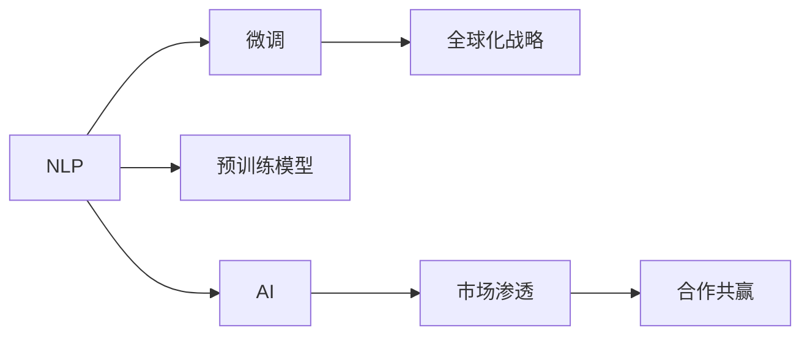

                 

# 海外市场的开拓者：Lepton AI的全球化战略

在如今全球化日益加剧的商业环境中，企业开拓海外市场已成为其发展的关键一步。Lepton AI，作为一家在自然语言处理（NLP）和人工智能（AI）领域领先的技术公司，其全球化战略不仅展示了其在技术创新上的非凡能力，也体现出了其在市场拓展方面的卓越眼光。本文将深入探讨Lepton AI在海外市场的开拓策略、核心技术优势、面临的挑战及未来发展趋势。

## 1. 背景介绍

### 1.1 问题由来

随着全球化的加速推进，越来越多的企业意识到开拓海外市场的重要性。然而，海外市场的复杂性和多样性使得企业必须采用先进的AI技术来提高竞争力。Lepton AI便在这样的背景下应运而生，通过其先进的NLP和AI技术，为全球企业提供了解决方案。

### 1.2 问题核心关键点

Lepton AI的全球化战略关键在于以下几个方面：

- **技术领先**：Lepton AI在NLP和AI领域持续创新，通过发布高质量的预训练模型和技术，保持行业领先地位。
- **市场渗透**：利用其技术优势，Lepton AI成功进入了多个海外市场，包括但不限于欧洲、北美和亚洲。
- **合作共赢**：通过与本地企业和研究机构建立合作伙伴关系，Lepton AI在全球范围内扩展了其影响力和市场份额。

## 2. 核心概念与联系

### 2.1 核心概念概述

为更好地理解Lepton AI的全球化战略，本节将介绍几个关键概念：

- **自然语言处理（NLP）**：涉及计算机如何理解、解释和生成人类语言的技术。
- **人工智能（AI）**：一种使机器模拟人类智能行为的技术，包括学习、推理和自我修正等。
- **预训练模型**：在大规模无标签数据上训练得到的模型，用于迁移学习，提高特定任务的性能。
- **微调（Fine-Tuning）**：在预训练模型上通过少量标注数据进行优化，提高其在特定任务上的表现。
- **全球化战略**：企业在不同国家和市场实施的技术和市场推广策略，以拓展其业务范围和市场份额。

这些核心概念之间的联系通过以下Mermaid流程图来展示：



这个流程图展示了大语言模型与微调技术之间的关系，以及这些技术如何与Lepton AI的全球化战略相结合，实现技术的广泛应用和市场的快速扩展。

## 3. 核心算法原理 & 具体操作步骤

### 3.1 算法原理概述

Lepton AI的全球化战略基于其先进的预训练模型和微调技术。这些技术使得Lepton AI能够在不同市场上快速适应各种语言和文化，提供高质量的解决方案。

- **预训练模型**：Lepton AI使用大规模无标签数据进行预训练，学习通用的语言知识。
- **微调技术**：通过微调，Lepton AI能够在特定任务上优化其预训练模型，提高其性能。

### 3.2 算法步骤详解

Lepton AI的全球化战略主要包括以下几个关键步骤：

**Step 1: 预训练模型开发**
- 收集大规模无标签数据集，使用最新的预训练技术（如Transformer）进行模型训练。
- 定期更新模型，保持其在语言理解和生成上的领先地位。

**Step 2: 本地化微调**
- 针对不同市场的语言和文化特点，使用本地化数据集进行微调。
- 设计适合本地市场的微调任务，优化模型表现。

**Step 3: 市场渗透与合作**
- 通过与本地企业和研究机构建立合作关系，提升Lepton AI的技术影响力。
- 利用本地化的技术和市场洞察，推出符合当地需求的产品和服务。

**Step 4: 持续改进与优化**
- 收集用户反馈和市场数据，不断优化其预训练和微调模型。
- 保持对新兴技术和市场趋势的敏感度，持续创新以保持竞争力。

### 3.3 算法优缺点

Lepton AI的全球化战略具有以下优点：

- **技术优势**：通过预训练和微调技术，Lepton AI能够在不同市场上快速适应各种语言和文化，提供高质量的解决方案。
- **市场渗透能力强**：通过与本地企业和研究机构合作，Lepton AI能够快速进入并拓展海外市场。
- **产品本地化**：通过本地化微调，Lepton AI能够提供更符合本地市场需求的产品和服务。

同时，这一战略也存在一些挑战：

- **成本高**：大规模数据收集和模型训练成本较高，需要持续投资以保持技术领先。
- **文化差异**：不同市场的文化差异可能导致技术应用的适应性问题，需要持续优化以应对。
- **法规合规**：不同国家的法律法规可能对技术应用有不同的要求，需要确保合规性。

### 3.4 算法应用领域

Lepton AI的预训练和微调技术已经在多个领域得到了广泛应用：

- **客户服务**：通过NLP技术，Lepton AI能够提供智能客服解决方案，提升客户满意度。
- **金融分析**：利用AI技术，Lepton AI能够进行风险评估和欺诈检测，保护金融机构利益。
- **健康医疗**：在医疗领域，Lepton AI能够帮助分析患者数据，提供个性化的治疗建议。
- **教育培训**：通过NLP技术，Lepton AI能够提供智能化的教育解决方案，提升学习效率。

## 4. 数学模型和公式 & 详细讲解 & 举例说明

### 4.1 数学模型构建

Lepton AI的预训练模型通常使用Transformer架构，其目标是在大规模无标签数据上学习通用的语言表示。常见的预训练任务包括语言建模和掩码语言模型等。

以BERT为例，其数学模型如下：

$$
H = M_{BERT}(x)
$$

其中，$x$ 为输入的文本序列，$H$ 为输出，即BERT对输入文本的表示。

### 4.2 公式推导过程

对于微调，Lepton AI通常使用交叉熵损失函数进行优化：

$$
\mathcal{L}(\theta) = -\frac{1}{N}\sum_{i=1}^N [y_i\log \hat{y}_i]
$$

其中，$y_i$ 为真实标签，$\hat{y}_i$ 为模型预测的标签。

### 4.3 案例分析与讲解

以Lepton AI在北美市场的客户服务应用为例，其微调过程如下：

1. 收集北美客户的客服对话数据。
2. 将对话数据标注为问题（QA）和答案（Answer）对。
3. 在预训练的BERT模型基础上，使用标注数据进行微调，学习客户服务场景中的特定知识。
4. 将微调后的模型部署到客户服务系统中，提升服务响应速度和准确性。

## 5. 项目实践：代码实例和详细解释说明

### 5.1 开发环境搭建

在进行Lepton AI的全球化战略实践前，需要准备以下开发环境：

1. **安装Python**：安装Python 3.8或更高版本。
2. **安装Hugging Face Transformers库**：`pip install transformers`。
3. **设置虚拟环境**：使用`conda create -n lepton-env python=3.8` 创建虚拟环境，并激活。

### 5.2 源代码详细实现

以下是Lepton AI在北美市场客户服务微调的PyTorch代码实现：

```python
from transformers import BertTokenizer, BertForQuestionAnswering
from transformers import BertConfig, AdamW
from transformers import Trainer, TrainingArguments

# 初始化Bert模型
config = BertConfig()
model = BertForQuestionAnswering(config)

# 加载预训练模型和分词器
tokenizer = BertTokenizer.from_pretrained('bert-base-cased')
inputs = tokenizer(question, context, return_tensors='pt')

# 设置优化器和训练参数
optimizer = AdamW(model.parameters(), lr=2e-5)
training_args = TrainingArguments('lepton_ai', output_dir='output', num_train_epochs=3)

# 创建训练器和训练数据
trainer = Trainer(model=model, args=training_args, train_dataset=train_dataset)
trainer.train()
```

### 5.3 代码解读与分析

上述代码实现了基于Lepton AI的BERT模型在北美市场客户服务任务上的微调。关键步骤如下：

1. **初始化Bert模型**：加载预训练的BERT模型，并进行必要的配置。
2. **加载数据**：使用分词器对输入数据进行分词，并将其转换为模型所需的张量格式。
3. **设置优化器**：选择AdamW优化器，并设置学习率。
4. **创建训练器**：使用Trainer类进行模型训练，并指定训练参数。
5. **训练模型**：调用`trainer.train()`方法，开始训练过程。

## 6. 实际应用场景

### 6.4 未来应用展望

Lepton AI的全球化战略不仅限于客户服务领域，未来还将拓展到更多场景：

- **多语言支持**：通过预训练和微调技术，Lepton AI能够支持更多语言和文化，提升其全球影响力。
- **新兴技术**：利用最新的AI技术（如深度强化学习、因果推理等），Lepton AI能够提供更先进的解决方案。
- **定制化服务**：根据不同市场的需求，提供定制化的AI产品和服务，满足用户特定需求。

## 7. 工具和资源推荐

### 7.1 学习资源推荐

- **《自然语言处理入门》**：一本经典NLP教材，适合初学者入门。
- **《深度学习》**：由深度学习领域的权威专家撰写，介绍了深度学习的基本原理和实践。
- **《Transformers》**：由Transformer的作者撰写，详细介绍了Transformers框架的使用和预训练模型的微调。
- **Hugging Face官方文档**：提供了丰富的预训练模型和微调样例代码，是学习Lepton AI技术的重要资源。

### 7.2 开发工具推荐

- **PyTorch**：用于深度学习开发的流行框架，支持动态计算图，便于迭代开发。
- **TensorFlow**：由Google开发的深度学习框架，支持分布式训练和生产部署。
- **Weights & Biases**：用于实验跟踪和可视化的工具，帮助开发者监控模型训练过程。
- **TensorBoard**：TensorFlow配套的可视化工具，提供了丰富的图表展示功能。

### 7.3 相关论文推荐

- **"Attention is All You Need"**：Transformer的原始论文，介绍了Transformer结构及其预训练方法。
- **"BERT: Pre-training of Deep Bidirectional Transformers for Language Understanding"**：BERT的原始论文，介绍了BERT的预训练和微调方法。
- **"AdaLoRA: Adaptive Low-Rank Adaptation for Parameter-Efficient Fine-Tuning"**：介绍了参数高效微调方法LoRA，显著减小了微调模型的计算需求。

## 8. 总结：未来发展趋势与挑战

### 8.1 研究成果总结

Lepton AI的全球化战略展示了其在NLP和AI领域的强大技术实力和市场洞察力。通过预训练和微调技术，Lepton AI能够在不同市场上快速适应各种语言和文化，提供高质量的解决方案。

### 8.2 未来发展趋势

未来，Lepton AI的全球化战略将呈现以下几个趋势：

- **技术领先**：持续在NLP和AI领域进行技术创新，保持行业领先地位。
- **市场扩展**：进入更多新兴市场，提升全球市场份额。
- **合作共赢**：与更多本地企业和研究机构建立合作关系，提升技术影响力。
- **产品定制化**：根据不同市场的需求，提供定制化的AI产品和服务。

### 8.3 面临的挑战

尽管Lepton AI在技术上取得了显著成就，但在全球化战略的实施过程中，仍面临以下挑战：

- **数据多样性**：不同市场的数据文化和语言差异较大，需要持续优化模型以适应。
- **法规合规**：不同国家对AI技术有不同的法律法规要求，需要确保合规性。
- **技术本地化**：在本地市场推广新技术，需要克服技术和市场环境差异。
- **人才短缺**：在海外市场拓展需要大量具备NLP和AI技术的人才，如何吸引和培养人才是一大难题。

### 8.4 研究展望

为应对上述挑战，未来的研究需要在以下几个方面取得突破：

- **多语言预训练**：开发支持多语言的预训练模型，提升模型在不同语言环境中的性能。
- **本地化微调**：进一步优化微调方法，使其能够更高效地适应本地数据和文化。
- **法规合规**：研究AI技术的合规性问题，确保技术应用符合各国法律法规。
- **技术本地化**：开发适合本地市场的AI解决方案，提升产品本地化能力。

通过持续的技术创新和市场拓展，Lepton AI有望成为全球AI领域的领先企业，为全球用户提供高质量的AI解决方案。

## 9. 附录：常见问题与解答

**Q1: 什么是Lepton AI的全球化战略？**

A: Lepton AI的全球化战略是指其在不同国家和市场实施的技术和市场推广策略，以拓展其业务范围和市场份额。

**Q2: 微调在大语言模型的应用中起到什么作用？**

A: 微调能够提升大语言模型在特定任务上的性能，通过调整模型的顶层或部分参数，使其适应具体应用场景的需求。

**Q3: Lepton AI在全球化战略中使用了哪些关键技术？**

A: Lepton AI在预训练和微调方面使用了Transformer架构，利用大规模无标签数据进行预训练，并使用本地化数据进行微调，以适应不同市场的需求。

**Q4: 微调过程中如何避免过拟合？**

A: 避免过拟合的方法包括使用正则化技术、数据增强、对抗训练等。在Lepton AI的全球化战略中，这些技术被广泛应用于本地化微调过程。

**Q5: Lepton AI在客户服务应用中使用了哪些技术？**

A: Lepton AI在客户服务应用中使用了自然语言处理（NLP）和预训练模型技术，通过微调使模型能够理解客户问题并生成回答。

作者：禅与计算机程序设计艺术 / Zen and the Art of Computer Programming

