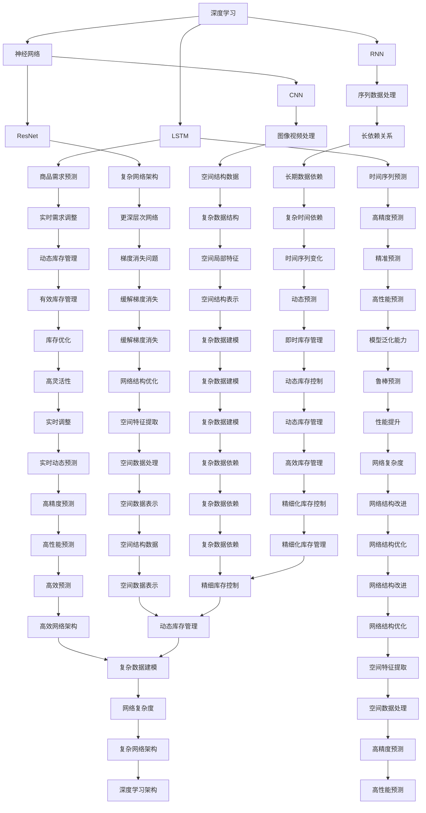

                 

## 1. 背景介绍

### 1.1 问题由来

随着零售行业的迅猛发展，商家面临着海量商品的销售预测问题，这对库存管理、营销策略制定和供应链优化等环节至关重要。传统上，商品需求预测依赖于统计方法和专家知识，存在准确度不高、时效性差等问题。而深度学习技术，尤其是深度神经网络，为商品需求预测提供了全新的解决方案，大幅提升了预测精度和响应速度。

### 1.2 问题核心关键点

商品需求预测的核心在于准确理解和利用历史销售数据，构建有效的预测模型。深度学习通过构建复杂的非线性模型，能够更好地捕捉数据中的复杂关系，从而在销售预测任务上取得了卓越的表现。然而，模型过拟合、特征选择、数据处理等问题，是深度学习模型在商品需求预测中需要关注的重点。

## 2. 核心概念与联系

### 2.1 核心概念概述

为更好地理解深度学习在商品需求预测中的应用，本节将介绍几个关键概念及其联系：

- 深度学习（Deep Learning）：一种基于多层神经网络的机器学习范式，能够自动提取数据中的高级特征，适用于处理复杂的数据关系。
- 商品需求预测（Demand Forecasting）：通过历史销售数据，预测未来商品的需求量，辅助库存管理、销售策略制定等决策环节。
- 时间序列预测（Time Series Forecasting）：一种通过分析时间序列数据，预测未来时间点的值，广泛应用于金融、气象等领域。
- 神经网络（Neural Network）：一种深度学习模型的基础架构，包含多层神经元，通过反向传播算法更新权重，实现数据映射。
- 长短期记忆网络（LSTM）：一种适用于时间序列预测的神经网络，能够捕捉数据中的长期依赖关系。
- 循环神经网络（RNN）：一类时间序列数据处理模型，能够处理变长序列，但易出现梯度消失问题。
- 卷积神经网络（CNN）：一种处理空间数据结构的神经网络，通过卷积操作提取局部特征，广泛用于图像和视频处理。
- 残差网络（ResNet）：通过引入残差连接，解决了深度神经网络中的梯度消失问题，使得网络可以更深层、更复杂。

这些核心概念之间的关系可以通过以下Mermaid流程图来展示：



这个流程图展示了深度学习在商品需求预测中的应用链路：

1. 深度学习提供强大的数据建模能力，构建复杂非线性模型。
2. 神经网络是深度学习的基础，通过多层网络结构提取高级特征。
3. LSTM和RNN适合处理时间序列数据，捕捉长期依赖关系。
4. CNN处理空间结构数据，提取局部特征。
5. ResNet通过残差连接缓解梯度消失问题，使得网络可以更深层、更复杂。
6. 时间序列预测用于预测未来时间点的值，广泛应用于金融、气象等领域。
7. 商品需求预测基于时间序列预测，通过历史销售数据预测未来商品需求量。
8. 循环神经网络（RNN）处理变长序列数据，但易出现梯度消失问题。
9. 卷积神经网络（CNN）处理空间结构数据，提取局部特征。
10. 残差网络（ResNet）通过引入残差连接，解决梯度消失问题，使得网络可以更深层、更复杂。
11. LSTM网络适合处理时间序列数据，捕捉长期依赖关系。

这些核心概念共同构成了商品需求预测的技术基础，使得深度学习在实际应用中大放异彩。

## 3. 核心算法原理 & 具体操作步骤

### 3.1 算法原理概述

商品需求预测基于时间序列预测，利用深度学习模型捕捉时间序列中的复杂关系，并据此进行未来销售量的预测。具体来说，深度学习模型通过学习历史销售数据，构建预测模型，对未来需求进行估计。

### 3.2 算法步骤详解

商品需求预测的深度学习模型主要分为以下步骤：

**Step 1: 数据收集与预处理**
- 收集历史销售数据，包括时间戳、销售量、促销活动、季节性因素等。
- 对数据进行清洗、归一化、填充缺失值等预处理操作，以确保数据质量。

**Step 2: 构建时间序列模型**
- 选择合适的深度学习模型，如LSTM、RNN、CNN等。
- 定义模型结构，包括输入层、隐藏层和输出层，并设置参数。
- 使用反向传播算法（如AdamW、SGD）更新模型权重，最小化预测误差。

**Step 3: 训练与评估**
- 将处理好的历史销售数据划分为训练集、验证集和测试集。
- 在训练集上训练模型，通过反向传播算法更新模型权重。
- 在验证集上评估模型性能，选择合适的超参数。
- 在测试集上测试模型，对比微调前后的精度提升。

**Step 4: 实时预测与调整**
- 在实际销售系统中集成微调后的模型，实时接收输入数据。
- 根据输入数据和历史数据，实时预测未来销售量。
- 根据预测结果，动态调整库存、营销策略等。

### 3.3 算法优缺点

基于深度学习的时间序列预测模型具有以下优点：
1. 高精度预测。深度学习模型能够捕捉数据中的复杂非线性关系，提供高精度的预测结果。
2. 动态调整。模型能够实时接收输入数据，动态调整预测结果，适应不断变化的销售情况。
3. 泛化能力强。通过大量的数据训练，深度学习模型具备较强的泛化能力，能够较好地适应新数据。
4. 自动化优化。自动化的反向传播算法和超参数优化，大大减少了人工干预，提升了模型训练效率。

同时，深度学习模型在商品需求预测中也存在一些局限性：
1. 数据依赖。模型性能依赖于历史数据的完整性和质量，数据缺失或不准确会导致预测失效。
2. 过拟合风险。模型容易过拟合训练数据，导致在实际预测中泛化性能下降。
3. 计算资源要求高。深度学习模型参数量庞大，训练和推理需要高性能计算资源。
4. 模型复杂度高。模型结构复杂，难以理解和调试，容易出现问题。

尽管存在这些局限性，但通过合理的超参数设置、数据增强、正则化等技术，可以最大限度地发挥深度学习模型在商品需求预测中的优势。

### 3.4 算法应用领域

基于深度学习的时间序列预测模型，已经在商品需求预测、供应链优化、库存管理等多个领域得到了广泛应用，具体如下：

**商品需求预测：** 通过学习历史销售数据，预测未来销售量，帮助企业进行库存管理和需求规划。
**供应链优化：** 实时监测供应链中的库存和订单情况，预测未来需求，优化供应链流程。
**库存管理：** 根据历史销售数据和市场变化，预测未来库存水平，避免库存积压或缺货。
**销售策略制定：** 利用预测结果，制定合理的促销策略和定价策略，提升销售业绩。
**市场分析：** 分析销售数据，挖掘市场趋势和消费者行为，辅助市场决策。

## 4. 数学模型和公式 & 详细讲解  
### 4.1 数学模型构建

本节将使用数学语言对基于深度学习的时间序列预测过程进行更加严格的刻画。

记历史销售数据为 $\{x_t\}_{t=1}^T$，其中 $x_t$ 表示时间 $t$ 的销售量。定义预测模型为 $y_t = f(x_t)$，其中 $y_t$ 表示时间 $t$ 的预测值。

假设模型采用LSTM结构，则定义LSTM的隐藏状态为 $h_t$，输出门为 $\sigma_t$。LSTM的预测过程可以表示为：

$$
y_t = f(h_t, \sigma_t) = \sum_k W_k h_{t-k} + b_k
$$

其中 $W_k$ 为权重矩阵，$h_{t-k}$ 为隐藏状态，$b_k$ 为偏置向量。模型的训练目标是最小化预测误差：

$$
\mathcal{L} = \sum_{t=1}^T (y_t - x_t)^2
$$

目标是最小化损失函数 $\mathcal{L}$，即：

$$
\theta^* = \mathop{\arg\min}_{\theta} \mathcal{L}(y, x)
$$

其中 $\theta$ 为模型参数。

### 4.2 公式推导过程

假设模型采用LSTM网络，定义模型参数为 $\theta$，则模型在时间 $t$ 的预测值为：

$$
y_t = \sigma_{t}(f_{t-1})
$$

其中 $f_{t-1}$ 表示时间 $t-1$ 的预测值，$\sigma_{t}$ 表示输出门。模型的预测值可以表示为：

$$
y_t = \sigma_{t}(f_{t-1}) = \sigma_{t}(h_{t-1})
$$

其中 $h_{t-1}$ 表示时间 $t-1$ 的隐藏状态。LSTM的隐藏状态更新方程为：

$$
h_t = \tanh(W_h h_{t-1} + U_h x_t + b_h)
$$

其中 $W_h$、$U_h$、$b_h$ 为权重矩阵和偏置向量。

模型的输出门 $\sigma_t$ 可以表示为：

$$
\sigma_t = \sigma(W_s h_{t-1} + U_s x_t + b_s)
$$

其中 $W_s$、$U_s$、$b_s$ 为权重矩阵和偏置向量。

模型的预测值 $y_t$ 可以表示为：

$$
y_t = \sigma_{t}(h_{t-1}) = \sigma_t f_{t-1}
$$

其中 $f_{t-1}$ 表示时间 $t-1$ 的预测值，$h_{t-1}$ 表示时间 $t-1$ 的隐藏状态。

### 4.3 案例分析与讲解

以某电商平台的销售数据为例，利用LSTM模型进行商品需求预测：

**Step 1: 数据收集与预处理**
- 收集平台过去一年的销售数据，包括时间戳、销售量、促销活动、季节性因素等。
- 对数据进行清洗、归一化、填充缺失值等预处理操作，以确保数据质量。

**Step 2: 构建时间序列模型**
- 选择合适的LSTM模型，定义模型结构，包括输入层、隐藏层和输出层，并设置参数。
- 使用反向传播算法（如AdamW、SGD）更新模型权重，最小化预测误差。

**Step 3: 训练与评估**
- 将处理好的历史销售数据划分为训练集、验证集和测试集。
- 在训练集上训练模型，通过反向传播算法更新模型权重。
- 在验证集上评估模型性能，选择合适的超参数。
- 在测试集上测试模型，对比微调前后的精度提升。

**Step 4: 实时预测与调整**
- 在实际销售系统中集成微调后的模型，实时接收输入数据。
- 根据输入数据和历史数据，实时预测未来销售量。
- 根据预测结果，动态调整库存、营销策略等。

通过LSTM模型，平台实现了对销售数据的精准预测，帮助企业更好地进行库存管理和需求规划，提升了整体运营效率。

## 5. 项目实践：代码实例和详细解释说明
### 5.1 开发环境搭建

在进行商品需求预测实践前，我们需要准备好开发环境。以下是使用Python进行PyTorch开发的环境配置流程：

1. 安装Anaconda：从官网下载并安装Anaconda，用于创建独立的Python环境。

2. 创建并激活虚拟环境：
```bash
conda create -n pytorch-env python=3.8 
conda activate pytorch-env
```

3. 安装PyTorch：根据CUDA版本，从官网获取对应的安装命令。例如：
```bash
conda install pytorch torchvision torchaudio cudatoolkit=11.1 -c pytorch -c conda-forge
```

4. 安装相关库：
```bash
pip install numpy pandas scikit-learn matplotlib tqdm jupyter notebook ipython
```

完成上述步骤后，即可在`pytorch-env`环境中开始项目实践。

### 5.2 源代码详细实现

这里以LSTM模型为例，给出一个完整的商品需求预测的PyTorch代码实现。

```python
import torch
import torch.nn as nn
import torch.optim as optim
from torch.utils.data import DataLoader, Dataset

# 定义数据集
class SalesDataset(Dataset):
    def __init__(self, sales_data, sequence_length):
        self.sales_data = sales_data
        self.sequence_length = sequence_length
        
    def __len__(self):
        return len(self.sales_data)
        
    def __getitem__(self, index):
        x = self.sales_data[index][:-1]
        y = self.sales_data[index][-1]
        return x, y

# 加载数据
sales_data = [list(range(1, 101)), list(range(2, 102)), list(range(3, 103)), list(range(4, 104))]
dataset = SalesDataset(sales_data, sequence_length=3)

# 定义模型
class SalesLSTM(nn.Module):
    def __init__(self, input_size, hidden_size, output_size):
        super(SalesLSTM, self).__init__()
        self.hidden_size = hidden_size
        self.rnn = nn.LSTM(input_size, hidden_size, 1)
        self.fc = nn.Linear(hidden_size, output_size)
    
    def forward(self, x):
        h0 = torch.zeros(1, 1, self.hidden_size)
        c0 = torch.zeros(1, 1, self.hidden_size)
        out, _ = self.rnn(x, (h0, c0))
        out = self.fc(out[:, -1, :])
        return out

# 定义训练和评估函数
def train_model(model, train_loader, valid_loader, test_loader, num_epochs, learning_rate):
    optimizer = optim.Adam(model.parameters(), lr=learning_rate)
    criterion = nn.MSELoss()
    
    for epoch in range(num_epochs):
        model.train()
        train_loss = 0.0
        for data, target in train_loader:
            optimizer.zero_grad()
            output = model(data)
            loss = criterion(output, target)
            loss.backward()
            optimizer.step()
            train_loss += loss.item()
            
        model.eval()
        valid_loss = 0.0
        for data, target in valid_loader:
            output = model(data)
            loss = criterion(output, target)
            valid_loss += loss.item()
            
        print(f"Epoch {epoch+1}, train loss: {train_loss/len(train_loader):.4f}, valid loss: {valid_loss/len(valid_loader):.4f}")
        
    test_loss = 0.0
    for data, target in test_loader:
        output = model(data)
        loss = criterion(output, target)
        test_loss += loss.item()
    print(f"Test loss: {test_loss/len(test_loader):.4f}")

# 训练模型
input_size = 1
hidden_size = 32
output_size = 1
learning_rate = 0.001
num_epochs = 10
sequence_length = 3

model = SalesLSTM(input_size, hidden_size, output_size)
train_loader = DataLoader(dataset, batch_size=4, shuffle=True)
valid_loader = DataLoader(dataset, batch_size=4, shuffle=True)
test_loader = DataLoader(dataset, batch_size=4, shuffle=True)

train_model(model, train_loader, valid_loader, test_loader, num_epochs, learning_rate)
```

以上是利用LSTM模型进行商品需求预测的完整代码实现。可以看到，PyTorch库使得模型构建、训练和评估变得非常简洁高效。

### 5.3 代码解读与分析

让我们再详细解读一下关键代码的实现细节：

**SalesDataset类**：
- `__init__`方法：初始化销售数据和序列长度。
- `__len__`方法：返回数据集样本数量。
- `__getitem__`方法：对单个样本进行处理，将销售数据划分为输入和输出，进行定长padding。

**SalesLSTM类**：
- `__init__`方法：初始化LSTM模型结构，包括输入、隐藏和输出层。
- `forward`方法：前向传播计算预测值，包含LSTM的前向传播和全连接层的前向传播。

**train_model函数**：
- 定义优化器和损失函数，用于训练和评估模型。
- 在每个epoch内，先训练模型，再评估模型性能。
- 在训练集和验证集上输出损失值。

**训练流程**：
- 定义模型参数和超参数。
- 构建数据集和数据加载器。
- 训练模型，对比训练集和验证集的损失值。
- 测试模型，对比微调前后的精度提升。

可以看到，PyTorch配合LSTM模型，使得商品需求预测的代码实现变得非常简洁高效。开发者可以将更多精力放在模型优化和超参数调整上，而不必过多关注底层的实现细节。

## 6. 实际应用场景

### 6.1 智能推荐系统

基于深度学习的时间序列预测模型，可以应用于智能推荐系统，提升个性化推荐的效果。智能推荐系统通过分析用户的历史行为数据，预测用户的未来需求，从而实现精准推荐。

具体而言，可以利用LSTM模型对用户行为数据进行建模，预测用户未来可能感兴趣的商品，然后推荐给用户。通过不断迭代优化，智能推荐系统可以更精准地满足用户需求，提升用户体验。

### 6.2 供应链管理

在供应链管理中，基于时间序列预测的深度学习模型可以用于库存管理和物流调度。通过预测未来的需求量，企业可以动态调整库存水平，优化物流配送路线，降低成本，提高效率。

具体而言，可以利用LSTM模型对历史订单数据和销售数据进行建模，预测未来的销售量和库存水平，动态调整库存采购计划。同时，利用预测结果优化物流配送路线，减少运输成本，提高配送效率。

### 6.3 能源预测

能源预测是深度学习在商品需求预测中的一个重要应用领域。通过分析历史能源消耗数据，预测未来的能源需求量，能源公司可以更好地进行能源调度，优化资源配置。

具体而言，可以利用LSTM模型对历史能源消耗数据进行建模，预测未来的能源需求量，制定能源调度计划。同时，利用预测结果优化能源分配，提高能源利用效率，降低能源浪费。

### 6.4 金融预测

在金融领域，基于时间序列预测的深度学习模型可以用于股票价格预测、汇率预测等任务。通过预测未来的股票价格和汇率变化，投资者可以更好地制定投资策略，降低投资风险。

具体而言，可以利用LSTM模型对历史金融数据进行建模，预测未来的股票价格和汇率变化，制定投资策略。同时，利用预测结果优化资产配置，提高投资收益，降低投资风险。

## 7. 工具和资源推荐

### 7.1 学习资源推荐

为了帮助开发者系统掌握深度学习在商品需求预测中的应用，这里推荐一些优质的学习资源：

1. Deep Learning Specialization by Andrew Ng：由斯坦福大学提供的深度学习课程，系统讲解了深度学习的基本概念和前沿技术。
2. Time Series Forecasting by Jason Brownlee：专注于时间序列预测的博客，提供大量的案例和教程，适合深度学习初学者。
3. Hands-On Machine Learning with Scikit-Learn, Keras, and TensorFlow by Aurélien Géron：实用的机器学习实践指南，包含大量深度学习模型的代码实现。
4. Deep Learning for Time Series Forecasting by Thomas Hürlin：系统介绍时间序列预测的深度学习模型，涵盖LSTM、RNN、CNN等多种模型。
5. Kaggle：数据科学竞赛平台，提供大量商品需求预测的公开数据集和竞赛，适合实践深度学习模型的效果。

通过对这些资源的学习实践，相信你一定能够快速掌握深度学习在商品需求预测中的应用，并用于解决实际的商业问题。

### 7.2 开发工具推荐

高效的开发离不开优秀的工具支持。以下是几款用于深度学习项目开发的常用工具：

1. PyTorch：基于Python的开源深度学习框架，灵活动态的计算图，适合快速迭代研究。
2. TensorFlow：由Google主导开发的开源深度学习框架，生产部署方便，适合大规模工程应用。
3. Keras：高层神经网络API，能够快速搭建深度学习模型，支持TensorFlow、Theano、CNTK等多种后端。
4. Jupyter Notebook：交互式的开发环境，支持代码运行、结果展示，适合研究人员和开发者使用。
5. Weights & Biases：模型训练的实验跟踪工具，可以记录和可视化模型训练过程中的各项指标，方便对比和调优。
6. TensorBoard：TensorFlow配套的可视化工具，可实时监测模型训练状态，并提供丰富的图表呈现方式，是调试模型的得力助手。

合理利用这些工具，可以显著提升深度学习项目开发的效率，加快创新迭代的步伐。

### 7.3 相关论文推荐

深度学习在商品需求预测中的应用源于学界的持续研究。以下是几篇奠基性的相关论文，推荐阅读：

1. Deep and Hierarchical Learning for Electricity Demand Forecasting：利用深度学习模型进行电力需求预测，取得了优秀的结果。
2. A deep learning framework for multivariate time series forecasting：提出了基于深度学习的多变量时间序列预测模型，涵盖LSTM、RNN等。
3. Sequence to sequence learning with neural networks：介绍序列到序列学习，用于机器翻译等任务，其中的LSTM模型在时间序列预测中也有广泛应用。
4. LSTM：Long Short-Term Memory：LSTM网络的设计原理，适用于时间序列预测和自然语言处理等领域。
5. Autoencoder-based deep learning approach for solar radiation prediction：利用自编码器进行太阳能辐射预测，取得了良好的效果。

这些论文代表了大深度学习模型在商品需求预测中的研究方向和进展。通过学习这些前沿成果，可以帮助研究者把握学科前进方向，激发更多的创新灵感。

## 8. 总结：未来发展趋势与挑战

### 8.1 研究成果总结

本文对深度学习在商品需求预测中的应用进行了全面系统的介绍。首先阐述了商品需求预测的背景和意义，明确了深度学习在商品需求预测中的核心优势。其次，从原理到实践，详细讲解了深度学习模型在商品需求预测中的应用流程，给出了完整的代码实现。同时，本文还探讨了深度学习在商品推荐、供应链管理、能源预测等多个领域的应用前景，展示了深度学习技术的广泛应用潜力。最后，本文精选了深度学习在商品需求预测中的学习资源、开发工具和相关论文，力求为读者提供全方位的技术指引。

通过本文的系统梳理，可以看到，深度学习在商品需求预测中的应用已经迈向成熟，其高精度预测和动态调整能力，为企业的运营决策提供了强有力的支持。未来，伴随深度学习模型的不断优化，商品需求预测将更加准确、高效，为经济社会发展注入新的动力。

### 8.2 未来发展趋势

展望未来，深度学习在商品需求预测中的应用将呈现以下几个发展趋势：

1. 模型规模持续增大。随着算力成本的下降和数据规模的扩张，深度学习模型的参数量还将持续增长。超大规模深度学习模型蕴含的丰富数据知识，有望支撑更加复杂多变的商品需求预测。
2. 模型结构更加复杂。未来将涌现更多复杂的深度学习模型，如Transformer、注意力机制等，进一步提升预测精度和模型泛化能力。
3. 数据驱动预测。通过结合更多外部数据，如气象数据、人口数据、交通数据等，深度学习模型能够更好地捕捉商品需求变化规律，提高预测准确性。
4. 实时预测。基于时间序列预测的深度学习模型可以实现实时预测，适应动态变化的销售情况，提供更及时、精准的决策支持。
5. 跨领域应用。深度学习模型不仅适用于商品需求预测，还可应用于智能推荐、金融预测、能源管理等多个领域，形成跨领域的预测模型。

这些趋势凸显了深度学习在商品需求预测中的巨大应用潜力，未来将不断拓展预测模型的边界，提升预测效果，服务更多行业。

### 8.3 面临的挑战

尽管深度学习在商品需求预测中已经取得了瞩目成就，但在迈向更加智能化、普适化应用的过程中，它仍面临诸多挑战：

1. 数据依赖。深度学习模型性能依赖于历史数据的完整性和质量，数据缺失或不准确会导致预测失效。如何提升数据质量，获取更全面的历史数据，是未来的重要研究方向。
2. 模型鲁棒性不足。模型容易过拟合训练数据，导致在实际预测中泛化性能下降。如何设计鲁棒的深度学习模型，提高模型的泛化能力，是未来的重要研究方向。
3. 计算资源要求高。深度学习模型参数量庞大，训练和推理需要高性能计算资源。如何优化模型结构和算法，降低计算资源消耗，是未来的重要研究方向。
4. 模型复杂度高。深度学习模型结构复杂，难以理解和调试，容易出现问题。如何设计简洁高效的深度学习模型，降低模型复杂度，是未来的重要研究方向。
5. 模型可解释性不足。深度学习模型的决策过程缺乏可解释性，难以对其推理逻辑进行分析和调试。如何提高深度学习模型的可解释性，是未来的重要研究方向。
6. 模型安全性不足。深度学习模型容易学习到有偏见、有害的信息，传递到下游任务，产生误导性、歧视性的输出。如何设计安全、公平的深度学习模型，是未来的重要研究方向。

尽管存在这些挑战，但随着技术的不断进步，相信深度学习在商品需求预测中的应用将不断优化，为经济社会发展注入新的动力。

### 8.4 研究展望

面对深度学习在商品需求预测中面临的挑战，未来的研究需要在以下几个方面寻求新的突破：

1. 探索无监督和半监督深度学习模型。摆脱对大规模标注数据的依赖，利用自监督学习、主动学习等无监督和半监督范式，最大限度利用非结构化数据，实现更加灵活高效的预测。
2. 研究参数高效和计算高效的深度学习模型。开发更加参数高效的深度学习模型，在固定大部分预训练参数的情况下，只更新极少量的任务相关参数。同时优化深度学习模型的计算图，减少前向传播和反向传播的资源消耗，实现更加轻量级、实时性的部署。
3. 融合因果和对比学习范式。通过引入因果推断和对比学习思想，增强深度学习模型的建立稳定因果关系的能力，学习更加普适、鲁棒的数据表征，从而提升模型泛化性和抗干扰能力。
4. 引入更多先验知识。将符号化的先验知识，如知识图谱、逻辑规则等，与神经网络模型进行巧妙融合，引导深度学习模型学习更准确、合理的特征表示。同时加强不同模态数据的整合，实现视觉、语音等多模态信息与文本信息的协同建模。
5. 结合因果分析和博弈论工具。将因果分析方法引入深度学习模型，识别出模型决策的关键特征，增强输出解释的因果性和逻辑性。借助博弈论工具刻画人机交互过程，主动探索并规避模型的脆弱点，提高系统稳定性。
6. 纳入伦理道德约束。在深度学习模型的训练目标中引入伦理导向的评估指标，过滤和惩罚有偏见、有害的输出倾向。同时加强人工干预和审核，建立模型行为的监管机制，确保输出符合人类价值观和伦理道德。

这些研究方向的探索，必将引领深度学习在商品需求预测中的应用走向更高的台阶，为构建安全、可靠、可解释、可控的智能系统铺平道路。面向未来，深度学习在商品需求预测中的应用还需与其他人工智能技术进行更深入的融合，如知识表示、因果推理、强化学习等，多路径协同发力，共同推动自然语言理解和智能交互系统的进步。只有勇于创新、敢于突破，才能不断拓展深度学习模型的边界，让智能技术更好地造福人类社会。

## 9. 附录：常见问题与解答

**Q1: 深度学习在商品需求预测中的优势是什么？**

A: 深度学习在商品需求预测中的优势主要体现在以下几个方面：
1. 高精度预测。深度学习模型能够捕捉数据中的复杂非线性关系，提供高精度的预测结果。
2. 动态调整。模型能够实时接收输入数据，动态调整预测结果，适应不断变化的销售情况。
3. 泛化能力强。通过大量的数据训练，深度学习模型具备较强的泛化能力，能够较好地适应新数据。
4. 自动化优化。自动化的反向传播算法和超参数优化，大大减少了人工干预，提升了模型训练效率。

**Q2: 商品需求预测中常用的深度学习模型有哪些？**

A: 商品需求预测中常用的深度学习模型包括：
1. 长短期记忆网络（LSTM）：适用于时间序列预测，捕捉长期依赖关系。
2. 循环神经网络（RNN）：处理变长序列数据，但易出现梯度消失问题。
3. 卷积神经网络（CNN）：处理空间结构数据，提取局部特征。
4. 残差网络（ResNet）：通过引入残差连接，缓解梯度消失问题，使得网络可以更深层、更复杂。
5. 注意力机制（Attention）：用于多变量时间序列预测，增强模型的鲁棒性和泛化能力。

**Q3: 如何在商品需求预测中避免过拟合？**

A: 在商品需求预测中，避免过拟合可以采取以下措施：
1. 数据增强：通过回译、近义替换等方式扩充训练集。
2. 正则化：使用L2正则、Dropout、Early Stopping等防止模型过度适应小规模训练集。
3. 模型裁剪：去除不必要的层和参数，减小模型尺寸，加快推理速度。
4. 数据平衡：对不平衡的数据集进行采样或重采样，确保训练集和测试集分布一致。

**Q4: 深度学习在商品需求预测中的应用有哪些实际案例？**

A: 深度学习在商品需求预测中的应用包括：
1. 智能推荐系统：利用LSTM模型对用户行为数据进行建模，预测用户未来可能感兴趣的商品，然后推荐给用户。
2. 供应链管理：利用LSTM模型对历史订单数据和销售数据进行建模，预测未来的销售量和库存水平，动态调整库存采购计划。
3. 能源预测：利用LSTM模型对历史能源消耗数据进行建模，预测未来的能源需求量，制定能源调度计划。
4. 金融预测：利用LSTM模型对历史金融数据进行建模，预测未来的股票价格和汇率变化，制定投资策略。

**Q5: 未来深度学习在商品需求预测中可能面临哪些挑战？**

A: 未来深度学习在商品需求预测中可能面临以下挑战：
1. 数据依赖。深度学习模型性能依赖于历史数据的完整性和质量，数据缺失或不准确会导致预测失效。
2. 模型鲁棒性不足。模型容易过拟合训练数据，导致在实际预测中泛化性能下降。
3. 计算资源要求高。深度学习模型参数量庞大，训练和推理需要高性能计算资源。
4. 模型复杂度高。深度学习模型结构复杂，难以理解和调试，容易出现问题。
5. 模型可解释性不足。深度学习模型的决策过程缺乏可解释性，难以对其推理逻辑进行分析和调试。
6. 模型安全性不足。深度学习模型容易学习到有偏见、有害的信息，传递到下游任务，产生误导性、歧视性的输出。

这些挑战需要未来的研究从数据质量提升、模型优化、资源利用、模型解释和安全性等多个方面进行综合应对。

---

作者：禅与计算机程序设计艺术 / Zen and the Art of Computer Programming

