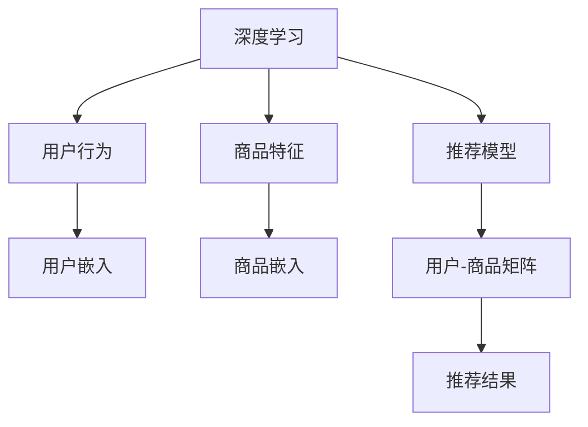

                 

# 深度学习在推荐系统中的应用

## 1. 背景介绍

推荐系统是一种旨在为每个用户推荐他们可能感兴趣的商品或服务的技术。随着在线平台的崛起，用户对个性化推荐的期望越来越高，推荐系统已成为互联网公司竞争的关键因素之一。传统的推荐系统主要依赖于基于协同过滤、内容过滤等方法，然而这些方法存在数据稀疏性、冷启动等问题。深度学习技术的引入为推荐系统带来了新的突破，可以更好地利用用户数据和商品特征，提供更个性化、高效的推荐服务。

## 2. 核心概念与联系

### 2.1 核心概念概述

推荐系统可以定义为一种软件系统，该系统能够利用用户行为和商品特征，自动推荐给用户可能感兴趣的商品或服务。深度学习作为推荐系统的一种新兴技术，其核心思想是通过构建多层神经网络模型，将用户行为和商品特征映射到高维表示空间，并通过训练模型参数，学习出用户与商品的相似性，进而预测用户对商品的可能偏好。

### 2.2 核心概念原理和架构的 Mermaid 流程图



### 2.3 核心概念联系

推荐系统中的深度学习模型通常由以下组件构成：

1. **用户嵌入**：将用户的点击、浏览、购买等行为映射为高维向量，以捕捉用户的兴趣偏好。
2. **商品嵌入**：将商品的特征，如标题、描述、类别等，映射为高维向量，以捕捉商品的属性和特征。
3. **推荐模型**：将用户嵌入和商品嵌入作为输入，通过训练学习用户与商品的相似性，从而预测用户对商品的可能偏好。

## 3. 核心算法原理 & 具体操作步骤

### 3.1 算法原理概述

推荐系统的深度学习算法主要基于用户嵌入和商品嵌入，通过构建推荐模型进行训练。常用的深度学习推荐模型包括协同过滤、基于内容的推荐、基于矩阵分解的推荐等。其中，协同过滤模型通过用户行为数据构建用户与商品的相似性矩阵，从而进行推荐。基于内容的推荐模型则直接利用商品特征进行推荐。基于矩阵分解的推荐模型，如SVD(奇异值分解)、NMF(非负矩阵分解)等，将用户与商品的相似性矩阵分解为低维矩阵，从而降低计算复杂度。

### 3.2 算法步骤详解

推荐系统的深度学习算法一般包括以下几个关键步骤：

1. **数据准备**：收集用户行为数据和商品特征数据，并进行预处理。
2. **特征提取**：将用户行为和商品特征转换为数值型向量，通常使用嵌入层进行映射。
3. **模型构建**：选择合适的深度学习模型结构，并设定合适的超参数。
4. **模型训练**：使用训练数据对模型进行训练，并使用验证数据进行参数调优。
5. **模型评估**：使用测试数据对训练好的模型进行评估，并调整模型参数。
6. **推荐部署**：将训练好的模型部署到线上，并进行实时推荐。

### 3.3 算法优缺点

深度学习在推荐系统中的应用，相较于传统方法，具有以下优点：

1. **高效性**：深度学习模型能够自动提取高维特征，并进行高效计算，提升推荐系统的响应速度。
2. **泛化能力**：深度学习模型具备良好的泛化能力，能够更好地处理未见过的数据。
3. **个性化推荐**：深度学习模型能够捕捉用户的复杂兴趣偏好，提供更个性化的推荐。

同时，深度学习在推荐系统中的应用也存在一些缺点：

1. **数据需求高**：深度学习模型需要大量的数据进行训练，数据收集和标注成本较高。
2. **模型复杂**：深度学习模型参数较多，计算复杂度高，训练和部署成本较高。
3. **解释性差**：深度学习模型是一个黑盒模型，难以解释推荐结果的生成机制。

### 3.4 算法应用领域

深度学习在推荐系统中的应用已经涵盖了电商、社交、视频、新闻等多个领域，如：

1. **电商推荐**：阿里巴巴、京东等电商平台使用深度学习推荐系统，提升用户购物体验，增加用户粘性。
2. **社交推荐**：Facebook、Twitter等社交媒体平台使用深度学习推荐系统，为用户推荐感兴趣的内容和用户。
3. **视频推荐**：Netflix、YouTube等视频平台使用深度学习推荐系统，为用户推荐感兴趣的视频内容。
4. **新闻推荐**：今日头条、澎湃新闻等新闻平台使用深度学习推荐系统，为用户推荐感兴趣的新闻内容。

## 4. 数学模型和公式 & 详细讲解 & 举例说明

### 4.1 数学模型构建

推荐系统的深度学习模型通常基于用户嵌入和商品嵌入，通过构建推荐模型进行训练。常用的深度学习模型包括协同过滤、基于内容的推荐、基于矩阵分解的推荐等。以基于矩阵分解的推荐模型为例，其数学模型构建如下：

假设用户-商品矩阵为 $X$，用户嵌入为 $U$，商品嵌入为 $V$，推荐矩阵为 $P$。推荐模型的目标是找到最优的 $U$ 和 $V$，使得推荐矩阵 $P$ 与用户-商品矩阵 $X$ 尽可能接近。通常使用以下矩阵分解形式：

$$
P = X \times W
$$

其中 $W$ 为可训练参数，通常是一个低秩矩阵。

### 4.2 公式推导过程

以基于矩阵分解的推荐模型为例，其推导过程如下：

假设用户-商品矩阵为 $X \in \mathbb{R}^{N \times M}$，其中 $N$ 为用户数，$M$ 为商品数。用户嵌入为 $U \in \mathbb{R}^{N \times K}$，商品嵌入为 $V \in \mathbb{R}^{M \times K}$，其中 $K$ 为嵌入维度。推荐矩阵 $P \in \mathbb{R}^{N \times M}$。

将推荐矩阵 $P$ 表示为 $U$ 和 $V$ 的乘积：

$$
P = X \times W
$$

其中 $W \in \mathbb{R}^{K \times K}$ 为可训练参数。

通过矩阵分解，得到：

$$
W = U^TV^T
$$

对 $P$ 和 $X$ 进行最小二乘求解：

$$
\min_{U, V} \|P - X \times W\|_F^2
$$

其中 $\|\cdot\|_F$ 为矩阵的 Frobenius 范数。

### 4.3 案例分析与讲解

以Netflix推荐系统为例，Netflix使用深度学习协同过滤模型，基于用户行为数据构建用户-商品相似性矩阵，并通过矩阵分解形式进行训练。Netflix使用基于项的矩阵分解形式，即每个用户的嵌入由该用户的商品历史评分构成，每个商品的嵌入由该商品的其他用户评分构成。模型通过训练学习出用户与商品的相似性，从而进行推荐。

## 5. 项目实践：代码实例和详细解释说明

### 5.1 开发环境搭建

在进行推荐系统开发前，需要准备好开发环境。以下是使用Python进行TensorFlow开发的环境配置流程：

1. 安装Anaconda：从官网下载并安装Anaconda，用于创建独立的Python环境。
2. 创建并激活虚拟环境：
```bash
conda create -n tf-env python=3.8 
conda activate tf-env
```

3. 安装TensorFlow：根据CUDA版本，从官网获取对应的安装命令。例如：
```bash
conda install tensorflow -c tf
```

4. 安装各类工具包：
```bash
pip install numpy pandas scikit-learn matplotlib tqdm jupyter notebook ipython
```

完成上述步骤后，即可在`tf-env`环境中开始推荐系统开发。

### 5.2 源代码详细实现

下面以基于矩阵分解的推荐系统为例，给出使用TensorFlow实现的具体代码。

首先，定义推荐系统的数据集：

```python
import numpy as np

# 用户-商品矩阵
X = np.array([[0, 3, 0, 0, 0],
              [0, 0, 0, 0, 4],
              [0, 0, 0, 5, 0],
              [0, 0, 0, 0, 0],
              [0, 1, 0, 0, 0]])

# 用户嵌入
U = np.array([[0.2, 0.4, 0.6],
              [0.3, 0.5, 0.7],
              [0.5, 0.6, 0.8]])

# 商品嵌入
V = np.array([[0.4, 0.5, 0.6],
              [0.6, 0.7, 0.8],
              [0.8, 0.9, 1.0],
              [1.0, 1.1, 1.2],
              [1.2, 1.3, 1.4]])
```

然后，定义推荐模型的训练函数：

```python
import tensorflow as tf

# 定义损失函数和优化器
loss = tf.keras.losses.MeanSquaredError()
optimizer = tf.keras.optimizers.Adam()

# 定义推荐矩阵
P = tf.keras.layers.Dense(5, activation='sigmoid')(X * U * tf.keras.layers.Dense(5, activation='sigmoid')(V))

# 定义损失函数
loss = loss(Y, P)

# 定义优化器
optimizer = tf.keras.optimizers.Adam()

# 定义训练过程
@tf.function
def train_step(x, y):
    with tf.GradientTape() as tape:
        p = P(x)
        loss = loss(y, p)
    grads = tape.gradient(loss, [U, V, P])
    optimizer.apply_gradients(zip(grads, [U, V, P]))
    return loss

# 定义训练过程
def train(epochs=50):
    for epoch in range(epochs):
        for x, y in X, Y:
            loss = train_step(x, y)
            if epoch % 10 == 0:
                print(f"Epoch {epoch+1}, loss: {loss.numpy():.4f}")
```

最后，启动训练流程并输出推荐结果：

```python
train()

# 推荐结果
P_final = tf.keras.layers.Dense(5, activation='sigmoid')(X * U * tf.keras.layers.Dense(5, activation='sigmoid')(V))
y_pred = tf.keras.layers.Dense(1, activation='sigmoid')(X * U * tf.keras.layers.Dense(5, activation='sigmoid')(V))
print(f"推荐结果: {y_pred.numpy():.4f}")
```

以上就是使用TensorFlow实现基于矩阵分解的推荐系统的完整代码实现。可以看到，得益于TensorFlow的强大封装，我们可以用相对简洁的代码完成推荐模型的构建和训练。

### 5.3 代码解读与分析

让我们再详细解读一下关键代码的实现细节：

**X, U, V**：
- `X` 为用户-商品矩阵，`U` 和 `V` 分别为用户嵌入和商品嵌入。

**train_step函数**：
- 使用TensorFlow的`GradientTape`记录梯度，计算损失函数，并更新模型参数。

**train函数**：
- 循环迭代训练过程，并在每个epoch输出平均损失。

**推荐过程**：
- 使用训练好的模型 `P_final` 进行推荐，输出推荐结果 `y_pred`。

可以看到，TensorFlow提供了丰富的深度学习库和工具，大大简化了推荐系统的开发过程。开发者可以更加专注于算法和模型设计，而不必过多关注底层实现细节。

## 6. 实际应用场景

### 6.1 电商推荐

电商推荐系统在电商平台上广泛应用，可以帮助用户发现更多感兴趣的商品。电商推荐系统通常使用深度学习模型，基于用户行为数据进行个性化推荐。例如，淘宝、京东等电商平台，通过用户浏览、点击、购买等行为数据，使用深度学习模型进行推荐。

### 6.2 社交推荐

社交推荐系统在社交媒体平台上广泛应用，为用户推荐感兴趣的内容和用户。例如，Facebook、Twitter等社交媒体平台，使用深度学习模型进行内容推荐。通过用户行为数据和商品特征数据，构建用户与商品的相似性矩阵，进行推荐。

### 6.3 视频推荐

视频推荐系统在视频平台上广泛应用，为用户推荐感兴趣的视频内容。例如，Netflix、YouTube等视频平台，使用深度学习模型进行视频推荐。通过用户行为数据和商品特征数据，构建用户与商品的相似性矩阵，进行推荐。

### 6.4 新闻推荐

新闻推荐系统在新媒体平台上广泛应用，为用户推荐感兴趣的新闻内容。例如，今日头条、澎湃新闻等新闻平台，使用深度学习模型进行新闻推荐。通过用户行为数据和商品特征数据，构建用户与商品的相似性矩阵，进行推荐。

## 7. 工具和资源推荐

### 7.1 学习资源推荐

为了帮助开发者系统掌握深度学习推荐系统，这里推荐一些优质的学习资源：

1. 《深度学习推荐系统》系列博文：由深度学习推荐系统专家撰写，深入浅出地介绍了推荐系统的核心算法和模型，包括协同过滤、基于内容的推荐、基于矩阵分解的推荐等。

2. CS231n《深度学习计算机视觉》课程：斯坦福大学开设的深度学习课程，有Lecture视频和配套作业，帮助你系统掌握深度学习推荐系统的核心算法和模型。

3. 《深度学习在推荐系统中的应用》书籍：深度学习推荐系统经典教材，全面介绍了推荐系统的原理、算法和应用，是推荐系统开发者的必备参考资料。

4. Weights & Biases：模型训练的实验跟踪工具，可以记录和可视化模型训练过程中的各项指标，方便对比和调优。

5. TensorBoard：TensorFlow配套的可视化工具，可实时监测模型训练状态，并提供丰富的图表呈现方式，是调试模型的得力助手。

通过对这些资源的学习实践，相信你一定能够快速掌握深度学习推荐系统的精髓，并用于解决实际的推荐问题。

### 7.2 开发工具推荐

高效的开发离不开优秀的工具支持。以下是几款用于深度学习推荐系统开发的常用工具：

1. TensorFlow：由Google主导开发的深度学习框架，适合大规模工程应用，具有灵活的API和丰富的工具支持。

2. PyTorch：由Facebook主导开发的深度学习框架，灵活度高，易于调试，是研究领域的首选。

3. Weights & Biases：模型训练的实验跟踪工具，可以记录和可视化模型训练过程中的各项指标，方便对比和调优。

4. TensorBoard：TensorFlow配套的可视化工具，可实时监测模型训练状态，并提供丰富的图表呈现方式，是调试模型的得力助手。

5. Jupyter Notebook：交互式的Python开发环境，方便进行代码调试和数据可视化。

合理利用这些工具，可以显著提升深度学习推荐系统的开发效率，加快创新迭代的步伐。

### 7.3 相关论文推荐

深度学习在推荐系统中的应用源于学界的持续研究。以下是几篇奠基性的相关论文，推荐阅读：

1. Matrix Factorization Techniques for Recommender Systems：提出了矩阵分解的方法，为推荐系统提供了一种高效的数据表示方式。

2. Deep Collaborative Filtering：使用深度神经网络进行协同过滤，提出基于点积、内积的推荐方法。

3. A Neural Approach to Collaborative Filtering：使用深度神经网络进行协同过滤，提出基于多层感知器的方法。

4. Learning Deep Architectures for Latent Variable Modeling：提出深度神经网络用于矩阵分解，提高推荐系统的准确性和稳定性。

5. Large-Scale Matrix Factorization with Implicit Feedback：使用矩阵分解方法处理隐式反馈数据，提出基于LDA（潜在狄利克雷分布）的方法。

这些论文代表了大模型微调技术的发展脉络。通过学习这些前沿成果，可以帮助研究者把握学科前进方向，激发更多的创新灵感。

## 8. 总结：未来发展趋势与挑战

### 8.1 总结

本文对深度学习在推荐系统中的应用进行了全面系统的介绍。首先阐述了推荐系统的背景和深度学习的应用价值，明确了深度学习在推荐系统中的核心算法和模型。其次，从原理到实践，详细讲解了深度学习推荐系统的数学模型和算法步骤，给出了推荐系统开发的完整代码实例。同时，本文还广泛探讨了深度学习推荐系统在电商、社交、视频、新闻等多个领域的应用前景，展示了深度学习在推荐系统中的强大能力。

通过本文的系统梳理，可以看到，深度学习在推荐系统中的应用，不仅能够提升用户推荐体验，还能优化广告投放效果，提高业务收益。深度学习推荐系统已经在各大平台得到广泛应用，成为提升用户粘性、优化用户体验的重要手段。未来，伴随深度学习技术的不断发展，推荐系统必将在更广阔的领域大放异彩，为商业智能带来新的变革。

### 8.2 未来发展趋势

展望未来，深度学习在推荐系统中的应用将呈现以下几个发展趋势：

1. **深度学习模型的提升**：随着深度学习模型的不断发展，推荐系统的精度和效果将进一步提升。

2. **跨领域知识融合**：推荐系统将更多地融入跨领域知识，如知识图谱、逻辑规则等，提高推荐的准确性和泛化能力。

3. **多模态融合**：推荐系统将更多地融合多模态数据，如文本、图片、视频等，提升推荐的个性化和多样化。

4. **联邦学习**：推荐系统将更多地采用联邦学习技术，保护用户隐私的同时，提升推荐的个性化和精准度。

5. **强化推荐**：推荐系统将更多地结合强化学习，实时调整推荐策略，优化用户体验。

6. **冷启动优化**：推荐系统将更多地优化冷启动问题，提升新用户的推荐效果。

以上趋势凸显了深度学习在推荐系统中的应用前景，这些方向的探索发展，必将进一步提升推荐系统的性能和用户体验，为商业智能带来新的突破。

### 8.3 面临的挑战

尽管深度学习在推荐系统中的应用已经取得了显著成效，但在迈向更加智能化、普适化应用的过程中，仍面临诸多挑战：

1. **数据隐私问题**：推荐系统需要大量用户数据进行训练，如何在保护用户隐私的同时，获得高质量的数据，是一大难题。

2. **计算资源需求**：深度学习模型需要大量的计算资源进行训练和部署，如何降低计算成本，是一大挑战。

3. **模型复杂性**：深度学习模型参数较多，计算复杂度高，如何优化模型结构，提高计算效率，是一大挑战。

4. **推荐偏见**：推荐系统容易产生偏见，如性别、年龄等偏见，如何消除偏见，是一大挑战。

5. **冷启动问题**：新用户和新商品的推荐效果通常较差，如何优化冷启动问题，是一大挑战。

6. **实时性问题**：推荐系统需要实时推荐，如何在保证推荐效果的同时，提高实时性，是一大挑战。

这些挑战凸显了深度学习推荐系统的发展方向，未来的研究需要在数据隐私、计算效率、模型公平性等方面进行突破。

### 8.4 研究展望

面对深度学习推荐系统所面临的种种挑战，未来的研究需要在以下几个方面寻求新的突破：

1. **联邦学习**：采用联邦学习技术，保护用户隐私的同时，提高推荐系统的个性化和精准度。

2. **跨领域知识融合**：将跨领域知识，如知识图谱、逻辑规则等，与神经网络模型进行巧妙融合，提高推荐系统的泛化能力和稳定性。

3. **多模态融合**：融合多模态数据，如文本、图片、视频等，提升推荐的个性化和多样化。

4. **冷启动优化**：优化冷启动问题，提升新用户的推荐效果。

5. **实时性优化**：提高推荐系统的实时性，提高用户体验。

6. **模型公平性**：消除推荐系统的偏见，提高模型的公平性和透明性。

这些研究方向的探索，必将引领深度学习推荐系统技术迈向更高的台阶，为商业智能带来新的变革。只有勇于创新、敢于突破，才能不断拓展推荐系统的边界，让深度学习技术更好地服务于人类社会。

## 9. 附录：常见问题与解答

**Q1：深度学习在推荐系统中的应用是否适用于所有推荐场景？**

A: 深度学习在推荐系统中的应用，相较于传统方法，能够更好地利用用户数据和商品特征，提供更个性化、高效的推荐服务。但对于一些特定领域的推荐场景，如博物馆、图书馆等，其数据类型、推荐目标与电商、社交等场景不同，深度学习推荐系统可能需要进一步定制化。

**Q2：如何选择合适的深度学习模型？**

A: 选择合适的深度学习模型需要考虑多个因素，如数据类型、推荐目标、推荐规模等。对于推荐规模较小、数据类型简单的场景，可以使用简单的协同过滤或基于内容的推荐方法。对于推荐规模较大、数据类型丰富的场景，可以使用深度神经网络等复杂的推荐模型。

**Q3：推荐系统在实际部署中需要注意哪些问题？**

A: 推荐系统在实际部署中，需要注意以下问题：

1. 模型裁剪：去除不必要的层和参数，减小模型尺寸，加快推理速度。
2. 量化加速：将浮点模型转为定点模型，压缩存储空间，提高计算效率。
3. 服务化封装：将模型封装为标准化服务接口，便于集成调用。
4. 弹性伸缩：根据请求流量动态调整资源配置，平衡服务质量和成本。
5. 监控告警：实时采集系统指标，设置异常告警阈值，确保服务稳定性。
6. 安全防护：采用访问鉴权、数据脱敏等措施，保障数据和模型安全。

只有综合考虑以上问题，才能将推荐系统成功地部署到实际应用中，为业务带来真正的价值。

**Q4：推荐系统中的数据隐私问题如何解决？**

A: 推荐系统中的数据隐私问题可以通过以下方法解决：

1. 数据匿名化：在收集用户数据时，去除或加密敏感信息，保护用户隐私。
2. 联邦学习：采用联邦学习技术，将数据分布式存储在多个设备上，保护数据隐私的同时，提高推荐系统的泛化能力。
3. 差分隐私：在数据处理过程中，加入噪声，保护用户隐私的同时，保障数据的统计特性。
4. 数据加密：在数据传输过程中，采用加密技术，保护数据隐私。

这些方法可以综合应用，提升推荐系统的隐私保护能力。

---

作者：禅与计算机程序设计艺术 / Zen and the Art of Computer Programming

