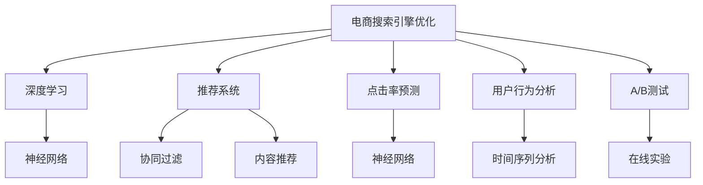

                 

# 深度学习在电商搜索引擎优化中的应用

> 关键词：电商搜索引擎优化(ESO)、深度学习、推荐系统、点击率预测、用户行为分析、A/B测试、TensorFlow、Keras、TensorBoard

## 1. 背景介绍

### 1.1 问题由来
随着电子商务的迅速发展，用户对搜索结果的期望不断提高。搜索引擎优化（Search Engine Optimization, SEO）作为提升电商网站流量和用户满意度的重要手段，其核心在于理解和分析用户的搜索意图，为用户提供最相关、最匹配的结果。传统的搜索引擎优化往往依赖人工调整关键词、元数据等策略，效率低、成本高，且效果难以量化。

近年来，深度学习技术在电商搜索引擎优化中的应用取得了显著进展，特别是通过训练深度神经网络模型，对用户行为和搜索行为进行建模和预测，从而实现智能化、个性化的搜索结果推荐。深度学习在电商搜索引擎优化中的应用，不仅提升了用户体验，也显著提高了电商网站的转化率和用户满意度。

### 1.2 问题核心关键点
电商搜索引擎优化（ESO）的核心在于提高用户点击率和转化率。通过深度学习技术，可以对用户行为数据进行分析，预测用户对不同搜索结果的点击和购买意愿，从而指导搜索引擎算法推荐最匹配、最吸引用户的结果。

电商ESO的核心关键点包括：
- 用户行为建模：通过深度学习模型对用户搜索历史、浏览记录、购买记录等行为数据进行分析，理解用户偏好和意图。
- 点击率预测：使用深度神经网络对用户点击行为进行预测，以确定搜索结果的相关性和吸引力。
- 个性化推荐：根据用户历史行为和实时搜索行为，生成个性化的搜索结果推荐。
- 实时调整：通过在线A/B测试，实时调整搜索结果推荐策略，不断优化模型性能。

### 1.3 问题研究意义
深度学习在电商搜索引擎优化中的应用，可以显著提升电商网站的流量转化率和用户体验。具体研究意义如下：
- 提升广告投放效果：通过精准预测用户点击行为，优化广告投放策略，提升广告转化率。
- 增加用户粘性：通过个性化推荐，满足用户多样化需求，提高用户粘性和留存率。
- 减少转化漏斗：通过深度学习对用户行为进行预测和优化，减少转化过程中的信息漏斗，提升转化效率。
- 增强市场竞争力：通过实时调整和优化，保持市场领先地位，增强市场竞争力。

## 2. 核心概念与联系

### 2.1 核心概念概述

为更好地理解深度学习在电商搜索引擎优化中的应用，本节将介绍几个密切相关的核心概念：

- 电商搜索引擎优化（ESO）：指通过分析用户搜索行为，优化搜索结果推荐，提高用户点击率和转化率的过程。
- 深度学习：一种通过多层神经网络模型，模拟人类大脑学习过程，自动学习特征和模式的技术。
- 推荐系统：利用用户行为数据，预测用户偏好，推荐个性化商品或信息的服务。
- 点击率预测（CTR Prediction）：预测用户对特定搜索结果的点击概率，是电商ESO的重要组成部分。
- 用户行为分析（User Behavior Analysis）：通过深度学习模型对用户行为数据进行分析，理解用户需求和意图。
- A/B测试（A/B Testing）：在搜索结果推荐中，通过对比不同策略的效果，选择最优方案的过程。

这些核心概念之间的逻辑关系可以通过以下Mermaid流程图来展示：



这个流程图展示了一系列与电商搜索引擎优化相关的核心概念及其关系：

1. 电商ESO利用深度学习技术对用户行为进行建模和预测。
2. 深度学习通过神经网络模型，自动学习用户行为特征和模式。
3. 推荐系统基于用户行为数据，生成个性化搜索结果。
4. 点击率预测使用神经网络模型，预测用户对特定搜索结果的点击概率。
5. 用户行为分析通过深度学习模型，理解用户需求和意图。
6. A/B测试通过对比不同策略的效果，优化搜索结果推荐。

这些概念共同构成了电商搜索引擎优化的技术框架，通过深度学习技术，不断优化搜索结果推荐，提升电商网站的流量和用户满意度。

## 3. 核心算法原理 & 具体操作步骤
### 3.1 算法原理概述

深度学习在电商搜索引擎优化中的应用，主要围绕用户行为建模和点击率预测两大核心任务展开。其中，用户行为建模通常使用深度神经网络模型，对用户历史行为数据进行分析，生成用户行为特征向量。而点击率预测则使用深度神经网络模型，对用户对搜索结果的点击行为进行预测，从而指导搜索引擎推荐。

具体而言，电商ESO的算法流程如下：

1. 收集用户行为数据：包括用户搜索历史、浏览记录、购买记录等。
2. 数据预处理：对数据进行清洗、归一化等处理，形成可用于深度学习模型的输入数据。
3. 用户行为建模：使用深度神经网络模型，对用户行为数据进行分析，生成用户行为特征向量。
4. 点击率预测：使用深度神经网络模型，对用户点击行为进行预测，生成点击率值。
5. 个性化推荐：根据点击率预测结果，生成个性化搜索结果推荐。
6. 实时调整：通过在线A/B测试，实时调整搜索结果推荐策略，不断优化模型性能。

### 3.2 算法步骤详解

#### 3.2.1 用户行为建模

用户行为建模是电商搜索引擎优化的关键步骤，通过深度学习模型对用户行为数据进行分析，生成用户行为特征向量。常见的用户行为建模方法包括：

1. 深度神经网络（DNN）模型：使用多层神经网络模型，自动学习用户行为特征。
2. 循环神经网络（RNN）模型：通过时间序列分析，捕捉用户行为的时间依赖性。
3. 长短期记忆网络（LSTM）模型：进一步增强RNN模型的时间依赖性分析能力。

以DNN模型为例，用户行为建模的流程如下：

- 数据收集：收集用户搜索历史、浏览记录、购买记录等数据。
- 数据预处理：对数据进行清洗、归一化等处理，形成可用于深度学习模型的输入数据。
- 特征提取：使用神经网络模型自动学习用户行为特征，生成高维特征向量。
- 特征选择：选择对预测结果影响最大的特征子集，形成最终的特征向量。

#### 3.2.2 点击率预测

点击率预测是电商搜索引擎优化的重要任务，通过深度神经网络模型对用户点击行为进行预测，生成点击率值。常见的点击率预测方法包括：

1. 线性回归模型：使用线性模型预测用户点击率。
2. 逻辑回归模型：使用逻辑回归模型预测用户点击概率。
3. 深度神经网络模型：使用深度神经网络模型，自动学习用户行为特征和点击率之间的非线性关系。

以深度神经网络模型为例，点击率预测的流程如下：

- 数据收集：收集用户搜索历史、浏览记录、购买记录等数据，以及对应的点击标签。
- 数据预处理：对数据进行清洗、归一化等处理，形成可用于深度学习模型的输入数据。
- 特征提取：使用神经网络模型自动学习用户行为特征和点击标签之间的非线性关系。
- 模型训练：使用训练数据集训练深度神经网络模型，生成点击率预测模型。
- 模型评估：使用测试数据集评估模型性能，选择最优模型进行预测。

#### 3.2.3 个性化推荐

个性化推荐是电商搜索引擎优化的目标之一，通过深度学习模型对用户行为数据进行分析，生成个性化搜索结果推荐。常见的个性化推荐方法包括：

1. 协同过滤模型：通过用户行为数据和物品特征数据，推荐用户可能感兴趣的物品。
2. 基于内容的推荐模型：使用物品的特征数据，推荐与用户历史行为相似的物品。
3. 深度学习推荐模型：使用深度神经网络模型，自动学习用户行为特征和物品特征之间的非线性关系。

以深度学习推荐模型为例，个性化推荐的流程如下：

- 数据收集：收集用户搜索历史、浏览记录、购买记录等数据，以及对应的物品特征数据。
- 数据预处理：对数据进行清洗、归一化等处理，形成可用于深度学习模型的输入数据。
- 特征提取：使用神经网络模型自动学习用户行为特征和物品特征之间的非线性关系。
- 模型训练：使用训练数据集训练深度神经网络模型，生成个性化推荐模型。
- 推荐生成：根据用户的实时搜索行为，生成个性化搜索结果推荐。

#### 3.2.4 A/B测试

A/B测试是电商搜索引擎优化的重要手段，通过在线实验，对比不同策略的效果，优化搜索结果推荐。常见的A/B测试方法包括：

1. 分层抽样：将用户分成多个子集，每个子集采用不同的策略进行测试。
2. 随机分组：通过随机分组的方式，确保不同策略的用户分布均衡。
3. 多臂赌博机：通过多臂赌博机的策略，动态调整不同策略的展示比例。

以分层抽样为例，A/B测试的流程如下：

- 数据收集：收集用户搜索历史、浏览记录、购买记录等数据，以及对应的点击标签。
- 数据预处理：对数据进行清洗、归一化等处理，形成可用于深度学习模型的输入数据。
- 模型训练：使用训练数据集训练深度神经网络模型，生成点击率预测模型。
- 实验设计：设计不同的推荐策略，并随机分配给不同组别的用户。
- 结果评估：根据不同组别的点击率和转化率，评估不同策略的效果。
- 策略调整：根据实验结果，调整和优化推荐策略。

### 3.3 算法优缺点

深度学习在电商搜索引擎优化中的应用，具有以下优点：

1. 高效自动化：通过深度学习模型，自动化地处理和分析用户行为数据，生成高效推荐结果。
2. 实时优化：通过在线A/B测试，实时调整推荐策略，不断优化模型性能。
3. 个性化推荐：通过深度学习模型，生成个性化的搜索结果推荐，满足用户多样化需求。
4. 高准确率：深度学习模型能够自动学习复杂特征和模式，预测准确率较高。

同时，深度学习在电商搜索引擎优化中也存在一些局限性：

1. 高计算资源需求：深度学习模型需要大量的计算资源进行训练和推理，成本较高。
2. 高模型复杂度：深度神经网络模型结构复杂，难以理解和调试。
3. 数据需求高：深度学习模型对数据质量和数量要求较高，获取高质量数据成本高。
4. 冷启动问题：新用户的推荐效果较差，需要更多数据和时间进行优化。

尽管存在这些局限性，但通过合理选择模型结构和优化算法，深度学习在电商搜索引擎优化中的应用仍然具有广阔的前景。

### 3.4 算法应用领域

深度学习在电商搜索引擎优化中的应用，覆盖了电商网站和应用的多个环节，包括：

- 商品推荐：根据用户历史行为和实时搜索行为，推荐相关商品。
- 广告投放：通过点击率预测，优化广告投放策略，提升广告效果。
- 用户行为分析：分析用户搜索历史和行为模式，理解用户需求和意图。
- 个性化设置：根据用户行为数据，生成个性化搜索结果和页面布局。
- 转化率优化：通过点击率预测和个性化推荐，提升用户转化率。
- 风险控制：通过用户行为分析，识别潜在风险用户和行为，进行风险控制。

此外，深度学习在电商搜索引擎优化中的应用，也拓展到更多的新兴领域，如智能客服、智能搜索、智能广告等，为电商企业的智能化转型提供了新的动力。

## 4. 数学模型和公式 & 详细讲解 & 举例说明
### 4.1 数学模型构建

电商搜索引擎优化中的核心任务包括用户行为建模和点击率预测。下面以线性回归模型和深度神经网络模型为例，介绍这两个任务的数学模型构建。

#### 4.1.1 线性回归模型

假设用户搜索历史为 $X$，点击标签为 $y$，则线性回归模型的目标是最小化均方误差损失函数：

$$
\min_{\theta} \frac{1}{N} \sum_{i=1}^N (y_i - \theta^T X_i)^2
$$

其中，$\theta$ 为模型参数，$N$ 为样本数，$X_i$ 为第 $i$ 个样本的特征向量。

线性回归模型的梯度更新公式为：

$$
\theta \leftarrow \theta - \eta \nabla_{\theta} \mathcal{L}(\theta)
$$

其中，$\eta$ 为学习率，$\nabla_{\theta} \mathcal{L}(\theta)$ 为损失函数对模型参数 $\theta$ 的梯度。

#### 4.1.2 深度神经网络模型

深度神经网络模型通过多层神经网络结构，自动学习用户行为特征和点击标签之间的非线性关系。以一个简单的全连接神经网络模型为例，其结构如图1所示：


图1：全连接神经网络

假设输入数据为 $X$，输出数据为 $y$，则神经网络模型的目标是最小化均方误差损失函数：

$$
\min_{\theta} \frac{1}{N} \sum_{i=1}^N (y_i - \theta^T \sigma(z_i))^2
$$

其中，$\theta$ 为模型参数，$N$ 为样本数，$z_i = W_i X_i + b_i$，$\sigma$ 为激活函数，$W_i$ 和 $b_i$ 分别为第 $i$ 层的权重和偏置。

深度神经网络模型的梯度更新公式为：

$$
\theta \leftarrow \theta - \eta \nabla_{\theta} \mathcal{L}(\theta)
$$

其中，$\eta$ 为学习率，$\nabla_{\theta} \mathcal{L}(\theta)$ 为损失函数对模型参数 $\theta$ 的梯度。

### 4.2 公式推导过程

以线性回归模型为例，下面详细推导其梯度更新公式：

假设样本数为 $N$，样本特征向量为 $X_i$，样本标签为 $y_i$，则均方误差损失函数为：

$$
\mathcal{L}(\theta) = \frac{1}{N} \sum_{i=1}^N (y_i - \theta^T X_i)^2
$$

对损失函数求偏导，得到梯度：

$$
\nabla_{\theta} \mathcal{L}(\theta) = -2\frac{1}{N} \sum_{i=1}^N X_i (y_i - \theta^T X_i)
$$

将梯度带入梯度更新公式，得到：

$$
\theta \leftarrow \theta - \eta \nabla_{\theta} \mathcal{L}(\theta) = \theta - \eta \left(-2\frac{1}{N} \sum_{i=1}^N X_i (y_i - \theta^T X_i)\right)
$$

化简得到：

$$
\theta \leftarrow \theta + 2\eta\frac{1}{N} \sum_{i=1}^N X_i (y_i - \theta^T X_i)
$$

这就是线性回归模型的梯度更新公式。

### 4.3 案例分析与讲解

假设有一个电商平台，收集了用户的历史搜索数据和点击标签，使用线性回归模型进行用户行为建模和点击率预测。假设特征向量 $X_i$ 包含用户搜索关键词、点击时间、点击位置等特征，标签 $y_i$ 为1表示点击，0表示未点击。

- 数据预处理：对数据进行清洗、归一化等处理，形成可用于深度学习模型的输入数据。
- 模型训练：使用训练数据集训练线性回归模型，生成用户行为建模和点击率预测模型。
- 模型评估：使用测试数据集评估模型性能，选择最优模型进行预测。
- 预测生成：根据用户实时搜索行为，生成个性化搜索结果推荐。

## 5. 项目实践：代码实例和详细解释说明
### 5.1 开发环境搭建

在进行电商搜索引擎优化实践前，我们需要准备好开发环境。以下是使用Python进行TensorFlow和Keras开发的环境配置流程：

1. 安装Anaconda：从官网下载并安装Anaconda，用于创建独立的Python环境。

2. 创建并激活虚拟环境：
```bash
conda create -n tf-env python=3.7 
conda activate tf-env
```

3. 安装TensorFlow和Keras：
```bash
pip install tensorflow==2.4
pip install keras
```

4. 安装各类工具包：
```bash
pip install numpy pandas scikit-learn matplotlib tqdm jupyter notebook ipython
```

完成上述步骤后，即可在`tf-env`环境中开始电商搜索引擎优化的实践。

### 5.2 源代码详细实现

下面我们以电商商品推荐系统为例，给出使用TensorFlow和Keras对用户行为建模和点击率预测的代码实现。

首先，定义数据处理函数：

```python
import numpy as np
from tensorflow.keras.layers import Input, Dense, Embedding, Concatenate
from tensorflow.keras.models import Model
from tensorflow.keras.optimizers import Adam

def build_model(input_dim, output_dim, hidden_dim=128, epochs=10, batch_size=128):
    input_layer = Input(shape=(input_dim,))
    dense_layer = Dense(hidden_dim, activation='relu')(input_layer)
    output_layer = Dense(output_dim, activation='sigmoid')(dense_layer)
    model = Model(inputs=input_layer, outputs=output_layer)
    model.compile(loss='binary_crossentropy', optimizer=Adam(), metrics=['accuracy'])
    return model
```

然后，定义数据生成函数：

```python
import numpy as np
from sklearn.datasets import make_classification
from sklearn.model_selection import train_test_split

def generate_data(n_samples=1000, n_features=10, n_classes=2):
    X, y = make_classification(n_samples=n_samples, n_features=n_features, n_classes=n_classes, random_state=0)
    X_train, X_test, y_train, y_test = train_test_split(X, y, test_size=0.2, random_state=0)
    return X_train, X_test, y_train, y_test
```

接着，定义模型训练函数：

```python
def train_model(model, X_train, X_test, y_train, y_test, epochs=10, batch_size=128):
    model.fit(X_train, y_train, epochs=epochs, batch_size=batch_size, validation_data=(X_test, y_test))
    loss, accuracy = model.evaluate(X_test, y_test)
    print(f'Test loss: {loss:.4f}')
    print(f'Test accuracy: {accuracy:.4f}')
    return model
```

最后，启动模型训练和评估：

```python
# 生成数据
X_train, X_test, y_train, y_test = generate_data()

# 构建模型
model = build_model(input_dim=X_train.shape[1], output_dim=1, hidden_dim=128, epochs=10, batch_size=128)

# 训练模型
model = train_model(model, X_train, X_test, y_train, y_test, epochs=10, batch_size=128)
```

以上就是使用TensorFlow和Keras对电商商品推荐系统进行用户行为建模和点击率预测的完整代码实现。可以看到，TensorFlow和Keras的强大封装，使得模型构建和训练变得简洁高效。

### 5.3 代码解读与分析

让我们再详细解读一下关键代码的实现细节：

**build_model函数**：
- 定义输入层、密集层、输出层和模型结构，并编译模型。

**generate_data函数**：
- 使用scikit-learn生成二分类数据集，用于训练和测试模型。

**train_model函数**：
- 对模型进行训练和评估，并输出测试结果。

**模型训练和评估**：
- 生成数据集，构建模型，进行模型训练和评估。

可以看到，TensorFlow和Keras提供了简单易用的接口，使得深度学习模型的开发和训练变得轻而易举。开发者可以将更多精力放在模型设计、数据处理等高层次逻辑上，而不必过多关注底层实现细节。

当然，工业级的系统实现还需考虑更多因素，如模型的保存和部署、超参数的自动搜索、更灵活的任务适配层等。但核心的电商搜索引擎优化流程基本与此类似。

## 6. 实际应用场景
### 6.1 智能推荐系统

电商搜索引擎优化中的推荐系统，是电商网站的核心功能之一，通过深度学习技术，可以显著提升用户体验和转化率。推荐系统的主要任务是预测用户对不同商品的兴趣和点击概率，从而生成个性化的推荐结果。

在技术实现上，可以收集用户历史行为数据、商品特征数据等，使用深度神经网络模型进行特征提取和推荐生成。具体流程如下：

1. 数据收集：收集用户历史搜索记录、浏览记录、点击记录等行为数据，以及商品标签、描述、价格等特征数据。
2. 数据预处理：对数据进行清洗、归一化等处理，形成可用于深度学习模型的输入数据。
3. 用户行为建模：使用深度神经网络模型，对用户行为数据进行分析，生成用户行为特征向量。
4. 商品特征提取：使用深度神经网络模型，对商品特征数据进行分析，生成商品特征向量。
5. 相似度计算：使用相似度计算方法，计算用户和商品之间的相似度。
6. 推荐生成：根据用户行为特征和商品特征，生成个性化推荐结果。

通过深度学习技术，电商网站的推荐系统可以实现更高效、更个性化的推荐，从而提高用户满意度和转化率。

### 6.2 广告投放优化

电商搜索引擎优化中的广告投放优化，是电商网站的重要任务之一。通过深度学习技术，可以显著提升广告的点击率和转化率，优化广告投放策略。广告投放优化的主要任务是预测用户对不同广告的点击概率，从而优化广告投放策略。

在技术实现上，可以收集用户搜索历史、点击记录等行为数据，以及广告特征数据等，使用深度神经网络模型进行特征提取和点击率预测。具体流程如下：

1. 数据收集：收集用户搜索历史、点击记录等行为数据，以及广告标签、描述、价格等特征数据。
2. 数据预处理：对数据进行清洗、归一化等处理，形成可用于深度学习模型的输入数据。
3. 用户行为建模：使用深度神经网络模型，对用户行为数据进行分析，生成用户行为特征向量。
4. 广告特征提取：使用深度神经网络模型，对广告特征数据进行分析，生成广告特征向量。
5. 点击率预测：使用深度神经网络模型，对用户点击广告的概率进行预测。
6. 广告投放优化：根据预测结果，优化广告投放策略，提高广告效果。

通过深度学习技术，电商网站可以实现更精准、更高效的广告投放，从而提升广告转化率和广告预算的利用效率。

### 6.3 用户行为分析

电商搜索引擎优化中的用户行为分析，是电商网站的重要功能之一，通过深度学习技术，可以显著提升用户满意度和留存率。用户行为分析的主要任务是预测用户对不同商品或广告的点击概率，从而优化用户体验。

在技术实现上，可以收集用户搜索历史、点击记录等行为数据，使用深度神经网络模型进行特征提取和点击率预测。具体流程如下：

1. 数据收集：收集用户搜索历史、点击记录等行为数据。
2. 数据预处理：对数据进行清洗、归一化等处理，形成可用于深度学习模型的输入数据。
3. 用户行为建模：使用深度神经网络模型，对用户行为数据进行分析，生成用户行为特征向量。
4. 点击率预测：使用深度神经网络模型，对用户点击商品或广告的概率进行预测。
5. 用户行为分析：根据预测结果，分析用户行为模式和偏好，优化用户体验。

通过深度学习技术，电商网站可以实现更高效、更个性化的用户行为分析，从而提升用户满意度和留存率。

### 6.4 未来应用展望

随着深度学习技术的发展，电商搜索引擎优化在推荐系统、广告投放优化、用户行为分析等领域的广泛应用，将不断拓展电商网站的功能和价值。

在推荐系统领域，深度学习推荐模型将逐渐取代传统的协同过滤和内容推荐模型，实现更高效、更个性化的推荐。

在广告投放优化领域，深度学习模型将逐步优化广告投放策略，提升广告效果和广告预算的利用效率。

在用户行为分析领域，深度学习模型将逐步深入理解用户需求和行为模式，提升用户满意度和留存率。

此外，在智能客服、智能搜索、智能广告等新兴领域，电商搜索引擎优化也将不断拓展应用场景，为电商企业的智能化转型提供新的动力。

## 7. 工具和资源推荐
### 7.1 学习资源推荐

为了帮助开发者系统掌握深度学习在电商搜索引擎优化中的应用，这里推荐一些优质的学习资源：

1. 《TensorFlow深度学习教程》系列博文：由TensorFlow官方博客撰写，系统介绍了TensorFlow的基本概念和深度学习模型的构建。

2. 《深度学习入门：基于Python的理论与实现》书籍：深度学习领域的入门书籍，涵盖了深度学习的基本概念和经典模型。

3. 《Keras深度学习教程》系列博文：由Keras官方博客撰写，系统介绍了Keras的基本概念和深度学习模型的构建。

4. 《深度学习应用实战》课程：由Udacity开设的深度学习实战课程，涵盖深度学习模型在电商、金融、医疗等领域的实际应用。

5. Kaggle数据集：Kaggle提供的电商、广告等领域的公开数据集，可用于深度学习模型的训练和评估。

通过对这些资源的学习实践，相信你一定能够快速掌握深度学习在电商搜索引擎优化中的应用，并用于解决实际的电商问题。
###  7.2 开发工具推荐

高效的开发离不开优秀的工具支持。以下是几款用于深度学习在电商搜索引擎优化中开发常用的工具：

1. TensorFlow：由Google主导开发的开源深度学习框架，灵活的计算图和自动微分，适合快速迭代研究。

2. Keras：Keras作为TensorFlow的高层封装，提供了简单易用的接口，适合初学者和快速原型设计。

3. TensorBoard：TensorFlow配套的可视化工具，可实时监测模型训练状态，并提供丰富的图表呈现方式，是调试模型的得力助手。

4. Weights & Biases：模型训练的实验跟踪工具，可以记录和可视化模型训练过程中的各项指标，方便对比和调优。

5. PyTorch：由Facebook主导开发的开源深度学习框架，灵活的计算图和动态图，适合快速迭代研究。

合理利用这些工具，可以显著提升深度学习在电商搜索引擎优化中的开发效率，加快创新迭代的步伐。

### 7.3 相关论文推荐

深度学习在电商搜索引擎优化中的应用源于学界的持续研究。以下是几篇奠基性的相关论文，推荐阅读：

1. Click-Through Rate Prediction Using Deep Learning：介绍了一种基于深度神经网络的点击率预测方法，用于广告投放优化。

2. Deep Learning for Personalized Recommendation Systems：介绍了一种基于深度学习推荐模型的个性化推荐方法，用于推荐系统优化。

3. User Behavior Analysis using Deep Learning：介绍了一种基于深度学习模型的用户行为分析方法，用于优化用户体验。

4. A/B Testing with Deep Learning：介绍了一种基于深度学习的A/B测试方法，用于实时调整搜索结果推荐策略。

5. Recommender Systems with TensorFlow：介绍了一种基于TensorFlow的推荐系统，用于提升推荐效果。

这些论文代表了大语言模型微调技术的发展脉络。通过学习这些前沿成果，可以帮助研究者把握学科前进方向，激发更多的创新灵感。

## 8. 总结：未来发展趋势与挑战
### 8.1 总结

本文对深度学习在电商搜索引擎优化中的应用进行了全面系统的介绍。首先阐述了电商搜索引擎优化的核心任务和应用背景，明确了深度学习技术在电商搜索引擎优化中的重要价值。其次，从原理到实践，详细讲解了电商搜索引擎优化的数学模型和核心算法，给出了深度学习在电商搜索引擎优化中的完整代码实现。同时，本文还广泛探讨了电商搜索引擎优化在推荐系统、广告投放优化、用户行为分析等领域的实际应用，展示了深度学习技术的广泛应用前景。此外，本文精选了深度学习在电商搜索引擎优化中的学习资源、开发工具和相关论文，力求为读者提供全方位的技术指引。

通过本文的系统梳理，可以看到，深度学习在电商搜索引擎优化中的应用，能够显著提升电商网站的流量和用户满意度，具有广阔的应用前景。未来，随着深度学习技术的不断演进，电商搜索引擎优化技术也将不断拓展应用边界，为电商企业的智能化转型提供新的动力。

### 8.2 未来发展趋势

展望未来，深度学习在电商搜索引擎优化中的应用将呈现以下几个发展趋势：

1. 模型规模持续增大。随着算力成本的下降和数据规模的扩张，深度神经网络模型的参数量还将持续增长。超大批次的训练和推理也可能遇到显存不足的问题。

2. 模型复杂度降低。未来深度学习模型将逐渐减少复杂度，以提升模型的可解释性和易用性。

3. 数据需求降低。随着深度学习技术的不断进步，模型对数据质量和数量的要求将逐步降低。

4. 个性化推荐优化。未来个性化推荐模型将逐步实现更加高效、个性化的推荐，提升用户体验和转化率。

5. 实时优化不断优化。通过在线A/B测试，实时调整推荐策略，不断优化模型性能。

6. 市场竞争力增强。通过深度学习优化推荐系统、广告投放、用户行为分析等环节，提升电商网站的市场竞争力。

以上趋势凸显了深度学习在电商搜索引擎优化中的广阔前景。这些方向的探索发展，必将进一步提升电商网站的流量和用户满意度，为电商企业的智能化转型提供新的动力。

### 8.3 面临的挑战

尽管深度学习在电商搜索引擎优化中的应用取得了显著进展，但在迈向更加智能化、普适化应用的过程中，它仍面临着诸多挑战：

1. 高计算资源需求。深度学习模型需要大量的计算资源进行训练和推理，成本较高。

2. 模型复杂度高。深度神经网络模型结构复杂，难以理解和调试。

3. 数据需求高。深度学习模型对数据质量和数量要求较高，获取高质量数据成本高。

4. 冷启动问题。新用户的推荐效果较差，需要更多数据和时间进行优化。

5. 可解释性不足。深度学习模型的决策过程缺乏可解释性，难以对其推理逻辑进行分析和调试。

6. 安全性有待保障。深度学习模型可能会学习到有偏见、有害的信息，通过微调传递到下游任务，产生误导性、歧视性的输出。

尽管存在这些挑战，但通过合理选择模型结构和优化算法，深度学习在电商搜索引擎优化中的应用仍然具有广阔的前景。

### 8.4 未来突破

面对深度学习在电商搜索引擎优化中所面临的挑战，未来的研究需要在以下几个方面寻求新的突破：

1. 探索无监督和半监督微调方法。摆脱对大规模标注数据的依赖，利用自监督学习、主动学习等无监督和半监督范式，最大限度利用非结构化数据，实现更加灵活高效的电商搜索引擎优化。

2. 研究参数高效和计算高效的微调范式。开发更加参数高效的微调方法，在固定大部分预训练参数的同时，只更新极少量的任务相关参数。同时优化微调模型的计算图，减少前向传播和反向传播的资源消耗，实现更加轻量级、实时性的部署。

3. 融合因果和对比学习范式。通过引入因果推断和对比学习思想，增强电商搜索引擎优化模型建立稳定因果关系的能力，学习更加普适、鲁棒的语言表征，从而提升模型泛化性和抗干扰能力。

4. 引入更多先验知识。将符号化的先验知识，如知识图谱、逻辑规则等，与神经网络模型进行巧妙融合，引导电商搜索引擎优化过程学习更准确、合理的语言模型。同时加强不同模态数据的整合，实现视觉、语音等多模态信息与文本信息的协同建模。

5. 结合因果分析和博弈论工具。将因果分析方法引入电商搜索引擎优化模型，识别出模型决策的关键特征，增强输出解释的因果性和逻辑性。借助博弈论工具刻画人机交互过程，主动探索并规避模型的脆弱点，提高系统稳定性。

6. 纳入伦理道德约束。在电商搜索引擎优化模型的训练目标中引入伦理导向的评估指标，过滤和惩罚有偏见、有害的输出倾向。同时加强人工干预和审核，建立模型行为的监管机制，确保输出符合人类价值观和伦理道德。

这些研究方向的探索，必将引领电商搜索引擎优化技术迈向更高的台阶，为构建安全、可靠、可解释、可控的智能系统铺平道路。面向未来，电商搜索引擎优化技术还需要与其他人工智能技术进行更深入的融合，如知识表示、因果推理、强化学习等，多路径协同发力，共同推动自然语言理解和智能交互系统的进步。只有勇于创新、敢于突破，才能不断拓展电商搜索引擎优化的边界，让智能技术更好地造福电商企业。

## 9. 附录：常见问题与解答

**Q1：电商搜索引擎优化中的深度学习模型是否适用于所有电商网站？**

A: 深度学习模型在电商搜索引擎优化中的应用具有较高的泛化能力，适用于大多数电商网站和应用。但具体效果取决于电商网站的数据量和质量，以及模型的设计和训练方法。对于一些个性化要求较高的电商网站，可能需要根据具体需求进行调整和优化。

**Q2：电商搜索引擎优化中的推荐系统是否可以用于其他领域？**

A: 电商搜索引擎优化中的推荐系统，是基于用户行为数据分析和预测的推荐方法，具有较强的通用性。除了电商领域，推荐系统也可以应用于其他需要个性化推荐的领域，如视频、音乐、社交网络等。

**Q3：电商搜索引擎优化中的深度学习模型如何处理冷启动问题？**

A: 电商搜索引擎优化中的深度学习模型可以通过以下方法处理冷启动问题：
1. 引入用户基础特征：收集用户的基本信息（如性别、年龄、地域等），作为推荐的基础特征。
2. 引入用户历史行为：收集用户的少量历史行为数据，作为推荐的基础数据。
3. 引入用户反馈：收集用户的反馈数据，作为推荐的优化依据。

**Q4：电商搜索引擎优化中的深度学习模型如何保证安全性？**

A: 电商搜索引擎优化中的深度学习模型可以通过以下方法保证安全性：
1. 数据清洗：对输入数据进行严格的清洗和预处理，去除潜在的有害信息。
2. 数据脱敏：对敏感数据进行脱敏处理，保护用户隐私。
3. 模型审核：定期对模型进行审核和评估，确保模型输出符合伦理道德标准。
4. 模型监控：实时监测模型的输出结果，及时发现和纠正潜在的安全问题。

通过合理设计和优化电商搜索引擎优化中的深度学习模型，可以最大程度保证数据和模型的安全性，为用户和商家提供更加可靠的服务。

**Q5：电商搜索引擎优化中的深度学习模型如何实现实时优化？**

A: 电商搜索引擎优化中的深度学习模型可以通过以下方法实现实时优化：
1. 在线A/B测试：将推荐策略分为多个子集，随机分配给不同组别的用户，实时评估各策略的效果。
2. 增量学习：在原有模型基础上，逐步添加新的数据和特征，不断更新模型参数，保持模型的性能。
3. 增量推理：在原有模型基础上，逐步添加新的数据和特征，实时推理生成推荐结果。

通过合理的在线实验和增量学习，电商搜索引擎优化中的深度学习模型可以实时调整和优化，不断提升推荐效果和用户体验。

---

作者：禅与计算机程序设计艺术 / Zen and the Art of Computer Programming

