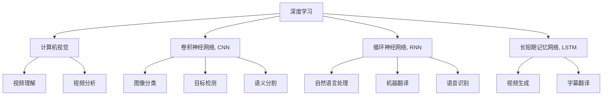

                 

# 深度学习在视频理解与分析中的应用

> 关键词：深度学习,视频理解,视频分析,卷积神经网络(CNN),循环神经网络(RNN),长短期记忆网络(LSTM),迁移学习,迁移学习范式,自监督学习, unsupervised learning, 计算机视觉(CV)

## 1. 背景介绍

### 1.1 问题由来
随着视频监控、智能家居、自动驾驶等技术的迅猛发展，视频数据的生成和存储规模呈现出爆炸式增长，视频数据的理解与分析成为了人工智能领域的热点问题。与传统的图像数据相比，视频数据具有时序性、多样性、复杂性等特点，如何高效、准确地从视频中提取信息、理解和生成内容，成为学术界和工业界关注的重点。

视频理解与分析的核心理论基础是计算机视觉和自然语言处理。在计算机视觉领域，深度学习尤其是卷积神经网络(CNN)已成为主流技术，显著提升了视频数据的识别和分类能力。而在自然语言处理领域，深度学习技术尤其是循环神经网络(RNN)和长短期记忆网络(LSTM)的应用，也促进了视频生成、字幕翻译等任务的突破。本文将从深度学习技术在视频理解与分析中的应用，探讨其原理、实现方法、应用场景及未来发展方向。

## 2. 核心概念与联系

### 2.1 核心概念概述

为更好地理解深度学习在视频理解与分析中的应用，本节将介绍几个密切相关的核心概念：

- 深度学习(Deep Learning)：一类基于多层神经网络的机器学习方法，能够自动学习数据的特征表示，用于图像、语音、文本等多种领域的处理和分析。

- 计算机视觉(Computer Vision)：利用计算机技术模拟人类视觉系统，实现图像、视频等视觉数据的识别、分类、跟踪等任务。

- 卷积神经网络(Convolutional Neural Network, CNN)：一种特殊的深度神经网络，用于图像处理，通过卷积操作提取空间特征，实现图像分类、目标检测、语义分割等任务。

- 循环神经网络(Recurrent Neural Network, RNN)：一种能够处理序列数据的神经网络，常用于自然语言处理和语音识别，通过循环机制捕捉序列数据的时序关系。

- 长短期记忆网络(Long Short-Term Memory, LSTM)：一种特殊类型的RNN，通过门控机制解决传统RNN的梯度消失问题，广泛应用于序列数据处理，如机器翻译、语音识别等。

- 迁移学习(Transfer Learning)：一种机器学习方法，通过将预训练模型的知识迁移到新任务上，以减少在新任务上的训练时间，提高模型效果。

- 迁移学习范式：指利用预训练模型在源任务上学习到的知识，辅助在新任务上进行微调，提升模型性能的方法。

- 自监督学习(Unsupervised Learning)：指在缺乏标注数据的情况下，利用数据的内在结构进行模型训练，学习数据的潜在表示的方法。

这些核心概念之间的逻辑关系可以通过以下Mermaid流程图来展示：



这个流程图展示了大语言模型微调的核心概念及其之间的关系：

1. 深度学习提供了强大的模型学习框架，用于处理图像、视频、语音、文本等多种类型的数据。
2. CNN用于图像处理，实现图像分类、目标检测、语义分割等任务。
3. RNN和LSTM用于序列数据处理，常用于自然语言处理和语音识别。
4. 迁移学习通过将预训练模型的知识迁移到新任务上，减少新任务的训练时间，提升模型效果。
5. 自监督学习在缺乏标注数据的情况下，通过利用数据的内在结构进行模型训练，学习数据的潜在表示。
6. 计算机视觉与视频理解、分析密不可分，从视频中提取关键信息。

这些概念共同构成了深度学习在视频理解与分析中的应用框架，使其能够在各种场景下发挥强大的处理能力。通过理解这些核心概念，我们可以更好地把握深度学习在视频领域的应用方向和优化方法。

## 3. 核心算法原理 & 具体操作步骤
### 3.1 算法原理概述

深度学习在视频理解与分析中的应用，主要体现在卷积神经网络(CNN)和循环神经网络(RNN)的联合使用上。CNN用于处理空间结构数据，RNN用于处理时序结构数据。通过两者的融合，深度学习模型能够从视频数据中提取出时间、空间等多个维度上的特征，实现对视频的深度理解与分析。

典型的视频理解与分析任务包括视频分类、行为识别、动作跟踪、对象检测、语义分割、视频生成等。本文将以视频分类和行为识别为例，探讨深度学习模型的实现方法。

### 3.2 算法步骤详解

深度学习在视频理解与分析中的应用，主要包括以下几个关键步骤：

**Step 1: 数据预处理**
- 将视频文件转换为标准格式，如帧率、分辨率、编码格式等一致。
- 对视频帧进行归一化、裁剪、旋转等操作，确保视频帧的稳定性。

**Step 2: 特征提取**
- 使用卷积神经网络(CNN)提取视频帧的空间特征。
- 通过池化操作降低特征图的空间大小。
- 使用循环神经网络(RNN)或长短期记忆网络(LSTM)提取视频帧的时间特征。

**Step 3: 模型训练**
- 选择合适的深度学习框架，如TensorFlow、PyTorch等。
- 加载预训练模型或从头训练模型，进行迁移学习。
- 在训练集上训练模型，最小化损失函数。
- 在验证集上评估模型性能，调整超参数。

**Step 4: 模型评估**
- 在测试集上评估模型性能，如准确率、召回率、F1值等。
- 对比微调前后的性能提升，评估模型效果。

**Step 5: 应用部署**
- 将训练好的模型部署到实际应用中。
- 集成到视频监控、智能家居、自动驾驶等系统。
- 持续收集新数据，定期重新训练和微调模型。

### 3.3 算法优缺点

深度学习在视频理解与分析中的应用，具有以下优点：
1. 强大的特征提取能力。卷积神经网络和循环神经网络能够高效地从视频数据中提取出时间、空间等特征，实现对视频的深度理解。
2. 多任务处理能力。深度学习模型能够同时处理多个任务，如视频分类、行为识别、动作跟踪等，减少了单任务处理的复杂性。
3. 迁移学习范式的应用。利用预训练模型在源任务上学习到的知识，辅助在新任务上进行微调，减少了新任务的训练时间和数据量。
4. 多模态数据的融合。深度学习模型能够处理图像、视频、音频等多模态数据，实现更全面的信息整合。

同时，该方法也存在一些局限性：
1. 数据标注成本高。视频数据标注需要大量的人力和时间，成本较高。
2. 计算资源消耗大。视频数据量庞大，训练和推理所需计算资源较大。
3. 模型的可解释性不足。深度学习模型的决策过程复杂，难以解释其内部工作机制和逻辑。
4. 模型的鲁棒性有限。深度学习模型对输入数据的噪声和变化较为敏感，容易产生误判。

尽管存在这些局限性，但深度学习在视频理解与分析中的应用，已经取得了显著的成果，并在诸多领域得到了广泛应用。未来，随着技术的发展和算力的提升，这些挑战有望得到进一步解决。

### 3.4 算法应用领域

深度学习在视频理解与分析中的应用，已经在诸多领域取得了显著成果，例如：

- 视频分类：如动作识别、视频主题分类等。通过卷积神经网络提取视频帧的空间特征，结合循环神经网络提取时间特征，实现对视频的分类。
- 行为识别：如打斗场景识别、运动轨迹分析等。通过CNN提取视频帧的空间特征，RNN处理时间特征，实现对行为模式的学习和识别。
- 动作跟踪：如目标跟踪、动作序列追踪等。通过CNN提取视频帧的空间特征，RNN处理时间特征，实现对动作目标的持续追踪。
- 对象检测：如行人检测、车辆检测等。通过CNN提取视频帧的空间特征，结合锚框回归等技术，实现对对象的准确检测和定位。
- 语义分割：如视频中的物体分割、场景理解等。通过CNN提取视频帧的空间特征，实现对视频场景的精细分割和理解。
- 视频生成：如视频修复、视频合成等。通过生成对抗网络(GAN)等技术，结合视频帧的空间和时间特征，实现对视频内容的生成和修复。

除了上述这些经典任务外，深度学习在视频理解与分析领域的应用还在不断扩展，如视频检索、视频摘要、视频推荐等，为视频技术的创新和应用带来了新的可能性。

## 4. 数学模型和公式 & 详细讲解  
### 4.1 数学模型构建

在深度学习中，视频分类和行为识别的主要数学模型基于卷积神经网络和循环神经网络。本节将使用数学语言对视频分类和行为识别的模型进行详细描述。

假设输入视频序列为 $X=\{x_1, x_2, ..., x_T\}$，其中 $x_t$ 表示第 $t$ 帧的视频图像。记视频帧的空间特征提取网络为 $f_{\theta}^{\text{CNN}}$，时间特征提取网络为 $g_{\phi}^{\text{RNN}}$，输出层为 $h_{\psi}$。则视频分类的模型结构如图：

```
   f_{θ}^CNN
      |
      v
X -> (X') -> (Y')
      |
      v
   g_{φ}^RNN
      |
      v
      |
   h_{ψ}      (监督信号)
```

其中 $X'$ 表示卷积神经网络提取的空间特征，$Y'$ 表示循环神经网络提取的时间特征。设模型输出为 $y_t$，监督信号为 $y$，则模型的损失函数为：

$$
\mathcal{L}=\frac{1}{T} \sum_{t=1}^{T} \ell(y_t, y)
$$

其中 $\ell(y_t, y)$ 为单帧输出的交叉熵损失函数。

对于行为识别任务，模型结构略有不同，如图：

```
   f_{θ}^CNN
      |
      v
X -> (X') -> (Y')
      |
      v
   g_{φ}^LSTM
      |
      v
      |
   h_{ψ}      (监督信号)
```

LSTM网络替代了普通的RNN网络，提高了模型处理长序列数据的能力。模型的损失函数与视频分类任务类似。

### 4.2 公式推导过程

以视频分类任务为例，推导模型的损失函数及梯度更新公式。

设视频帧的空间特征提取网络为 $f_{\theta}^{\text{CNN}}$，时间特征提取网络为 $g_{\phi}^{\text{RNN}}$，输出层为 $h_{\psi}$，监督信号为 $y$。则模型的单帧输出为：

$$
y_t = h_{\psi}(X')
$$

模型的损失函数为：

$$
\mathcal{L}=\frac{1}{T} \sum_{t=1}^{T} \ell(y_t, y)
$$

其中 $\ell(y_t, y)$ 为单帧输出的交叉熵损失函数。

使用梯度下降法优化模型，求得模型参数的梯度更新公式为：

$$
\theta \leftarrow \theta - \eta \nabla_{\theta} \mathcal{L}
$$

其中 $\eta$ 为学习率，$\nabla_{\theta} \mathcal{L}$ 为损失函数对模型参数的梯度，可通过反向传播算法计算。

在实践中，我们通常使用基于梯度的优化算法（如Adam、SGD等）来近似求解上述最优化问题。在微调过程中，我们一般使用较小的学习率，以避免破坏预训练的权重。

### 4.3 案例分析与讲解

为了更好地理解深度学习在视频理解与分析中的应用，下面以动作识别为例，分析其模型结构和训练过程。

假设我们有一个包含视频数据的标注数据集 $D=\{(x_i, y_i)\}_{i=1}^N$，其中 $x_i$ 表示第 $i$ 个视频序列，$y_i$ 表示动作标签。我们希望训练一个动作识别模型，使其能够准确地预测新视频序列中的动作类别。

**Step 1: 数据预处理**
- 将视频文件转换为标准格式，如帧率、分辨率、编码格式等一致。
- 对视频帧进行归一化、裁剪、旋转等操作，确保视频帧的稳定性。

**Step 2: 特征提取**
- 使用卷积神经网络(CNN)提取视频帧的空间特征。
- 通过池化操作降低特征图的空间大小。
- 使用循环神经网络(RNN)或长短期记忆网络(LSTM)提取视频帧的时间特征。

**Step 3: 模型训练**
- 选择合适的深度学习框架，如TensorFlow、PyTorch等。
- 加载预训练模型或从头训练模型，进行迁移学习。
- 在训练集上训练模型，最小化损失函数。
- 在验证集上评估模型性能，调整超参数。

**Step 4: 模型评估**
- 在测试集上评估模型性能，如准确率、召回率、F1值等。
- 对比微调前后的性能提升，评估模型效果。

**Step 5: 应用部署**
- 将训练好的模型部署到实际应用中。
- 集成到视频监控、智能家居、自动驾驶等系统。
- 持续收集新数据，定期重新训练和微调模型。

## 5. 项目实践：代码实例和详细解释说明
### 5.1 开发环境搭建

在进行视频理解与分析的深度学习项目实践前，我们需要准备好开发环境。以下是使用Python进行TensorFlow开发的环境配置流程：

1. 安装Anaconda：从官网下载并安装Anaconda，用于创建独立的Python环境。

2. 创建并激活虚拟环境：
```bash
conda create -n tf-env python=3.8 
conda activate tf-env
```

3. 安装TensorFlow：根据CUDA版本，从官网获取对应的安装命令。例如：
```bash
conda install tensorflow==2.6.0
```

4. 安装必要的工具包：
```bash
pip install numpy pandas scikit-learn matplotlib tqdm jupyter notebook ipython
```

完成上述步骤后，即可在`tf-env`环境中开始项目实践。

### 5.2 源代码详细实现

下面我们以视频分类任务为例，给出使用TensorFlow实现卷积神经网络(CNN)和循环神经网络(RNN)的代码实现。

首先，定义视频分类任务的数据处理函数：

```python
import tensorflow as tf
from tensorflow.keras import layers

class VideoDataset(tf.keras.utils.Sequence):
    def __init__(self, videos, labels, batch_size=16, frame_size=(224, 224)):
        self.videos = videos
        self.labels = labels
        self.batch_size = batch_size
        self.frame_size = frame_size

    def __len__(self):
        return len(self.videos) // self.batch_size

    def __getitem__(self, index):
        batch = []
        labels = []
        for i in range(self.batch_size):
            video = self.videos[index * self.batch_size + i]
            label = self.labels[index * self.batch_size + i]
            video = self.preprocess(video)
            batch.append(video)
            labels.append(label)
        return tf.stack(batch, axis=0), tf.stack(labels)
```

然后，定义卷积神经网络(CNN)和循环神经网络(RNN)：

```python
from tensorflow.keras import layers

# 定义卷积神经网络(CNN)
cnn = layers.Conv2D(32, 3, activation='relu', padding='same')  # 32个3x3卷积核，ReLU激活函数，同位填充

# 定义循环神经网络(RNN)
rnn = layers.SimpleRNN(128, return_sequences=True)  # 128个隐藏单元，返回序列

# 定义输出层
output = layers.Dense(1, activation='sigmoid')  # 输出一个二分类结果
```

接着，定义训练和评估函数：

```python
from tensorflow.keras import Model
from tensorflow.keras.optimizers import Adam

def build_model():
    input = layers.Input(shape=(self.frame_size[0], self.frame_size[1], 3))
    x = cnn(input)
    x = layers.MaxPooling2D((2, 2))(x)
    x = layers.Flatten()(x)
    x = rnn(x)
    output = output(x)
    model = Model(inputs=input, outputs=output)
    return model

def train_model(model, data, epochs=10, batch_size=16):
    model.compile(optimizer=Adam(lr=0.001), loss='binary_crossentropy', metrics=['accuracy'])
    model.fit(data, epochs=epochs, batch_size=batch_size, validation_split=0.2)
    return model

def evaluate_model(model, test_data):
    test_loss, test_acc = model.evaluate(test_data)
    print(f'Test Loss: {test_loss}, Test Accuracy: {test_acc}')
```

最后，启动训练流程并在测试集上评估：

```python
# 定义数据集
videos = []
labels = []
# 从视频数据集中加载视频和标签数据
# 将视频数据预处理后存储到videos列表中
# 将标签数据存储到labels列表中

# 构建模型
model = build_model()

# 训练模型
train_model(model, (videos, labels), epochs=10, batch_size=16)

# 评估模型
evaluate_model(model, (test_videos, test_labels))
```

以上就是使用TensorFlow对视频分类任务进行微调的完整代码实现。可以看到，TensorFlow提供了丰富的卷积、池化、循环等操作，可以方便地构建和训练深度学习模型。

### 5.3 代码解读与分析

让我们再详细解读一下关键代码的实现细节：

**VideoDataset类**：
- `__init__`方法：初始化视频、标签、批量大小和帧大小。
- `__len__`方法：返回数据集的样本数量。
- `__getitem__`方法：对单个样本进行处理，将视频序列转换为张量形式，并添加标签。

**模型构建**：
- `cnn`：定义卷积神经网络，包括卷积层、激活函数、池化层等。
- `rnn`：定义循环神经网络，包括隐藏单元和返回序列。
- `output`：定义输出层，采用sigmoid激活函数用于二分类。
- `build_model`：定义完整的模型结构。

**训练函数**：
- `train_model`：编译模型，定义损失函数、优化器和评估指标，使用训练集进行模型训练，并在验证集上评估模型性能，调整超参数。

**评估函数**：
- `evaluate_model`：使用测试集对训练好的模型进行评估，输出损失和准确率。

**训练流程**：
- 定义数据集，加载视频和标签数据。
- 构建模型，使用CNN提取空间特征，RNN处理时间特征，输出层进行分类。
- 训练模型，使用Adam优化器，损失函数为二分类交叉熵。
- 在测试集上评估模型性能，输出结果。

可以看到，TensorFlow提供了强大的深度学习模型构建和训练工具，可以高效地实现视频理解与分析任务。开发者可以将更多精力放在模型设计和数据处理等高层逻辑上，而不必过多关注底层实现细节。

当然，工业级的系统实现还需考虑更多因素，如模型的保存和部署、超参数的自动搜索、更灵活的任务适配层等。但核心的微调范式基本与此类似。

## 6. 实际应用场景
### 6.1 智能监控

智能监控系统是视频理解与分析的重要应用领域。传统的监控系统需要大量人力进行实时监控，难以应对突发事件和异常情况。而使用深度学习模型对视频进行理解与分析，可以自动发现异常行为，如入侵、火灾、故障等，提高监控系统的智能化水平。

具体而言，可以利用深度学习模型对监控视频进行行为识别，实时监测视频中的异常行为，并及时发出警报。例如，在视频监控中，可以对行人、车辆、设备等进行行为识别，一旦检测到异常行为，如损坏设备、非法入侵等，系统便会自动报警，通知相关人员进行现场处理。

### 6.2 视频编辑

视频编辑是将原始视频素材进行剪辑、配音、特效等处理的流程，是影视制作、广告制作、多媒体展示等领域的重要环节。视频编辑需要对原始视频进行剪辑、配景变换、特效添加等操作，在原有视频基础上，生成更加丰富、有趣、创意的视频内容。

利用深度学习模型对视频进行理解与分析，可以自动提取视频的特征信息，实现视频的智能剪辑和自动配音。例如，在视频剪辑中，可以对视频帧进行语义分割，提取出其中的场景、人物、动作等关键信息，自动选择镜头切换和剪辑，生成流畅自然的剪辑效果。在自动配音中，可以提取视频中的音频信息，并使用文本到语音(TTS)技术，生成匹配的视频配音，提高配音效果和效率。

### 6.3 智能家居

智能家居系统通过深度学习模型对视频进行理解与分析，可以实现智能化的家居控制。例如，通过摄像头监控家中的生活场景，自动检测家人的行为，实现自动开关灯光、调节温度、播放音乐等操作，提高生活质量。

利用深度学习模型对视频进行行为识别，可以自动控制家中的电器设备。例如，在视频监控中，可以对家庭成员的行为进行识别，当家庭成员离开房间时，系统自动关闭电器设备，节省能源消耗。当家庭成员回家时，系统自动打开电器设备，方便使用。

### 6.4 未来应用展望

随着深度学习技术的不断进步，视频理解与分析技术将会在更多领域得到应用，为各行各业带来变革性影响。

在智慧城市治理中，利用深度学习模型对视频进行理解与分析，可以实现智能化的城市监控、交通管理、公共安全等任务。例如，在城市监控中，可以通过对视频进行行为识别和分析，实时监测城市中的异常行为，保障城市安全。在交通管理中，可以利用视频进行实时交通分析，提高交通管理效率，减少交通拥堵。

在自动驾驶中，利用深度学习模型对视频进行行为识别和分析，可以实现智能化的驾驶辅助。例如，在自动驾驶中，可以对路面的情况进行实时分析，自动调整驾驶策略，提高驾驶安全性。

在虚拟现实(AR)和增强现实(AR)中，利用深度学习模型对视频进行行为识别和分析，可以实现智能化的虚拟现实体验。例如，在虚拟现实中，可以对用户的动作进行实时分析，生成匹配的虚拟场景，提高虚拟现实体验的真实感。

## 7. 工具和资源推荐
### 7.1 学习资源推荐

为了帮助开发者系统掌握深度学习在视频理解与分析中的应用，这里推荐一些优质的学习资源：

1. 《深度学习与计算机视觉》系列博文：由大模型技术专家撰写，深入浅出地介绍了深度学习在计算机视觉中的应用，包括视频分类、行为识别、动作跟踪等前沿话题。

2. 《自然语言处理与深度学习》课程：斯坦福大学开设的深度学习课程，涵盖自然语言处理和计算机视觉的基础知识和深度学习模型的实现。

3. 《深度学习在视频理解中的应用》书籍：全面介绍了深度学习在视频分类、行为识别、动作跟踪等任务中的应用，是理解视频理解与分析技术的好帮手。

4. PyTorch官方文档：提供了完整的深度学习框架文档和丰富的视频理解与分析模型样例代码，是学习和实践深度学习技术的重要资源。

5. Kaggle数据集：Kaggle提供了丰富的视频理解与分析数据集，包括动作识别、视频分类等，方便开发者进行实验和模型训练。

通过对这些资源的学习实践，相信你一定能够快速掌握深度学习在视频理解与分析中的应用，并用于解决实际的NLP问题。
###  7.2 开发工具推荐

高效的开发离不开优秀的工具支持。以下是几款用于深度学习项目开发的常用工具：

1. TensorFlow：由Google主导开发的开源深度学习框架，生产部署方便，适合大规模工程应用。

2. PyTorch：基于Python的开源深度学习框架，灵活动态的计算图，适合快速迭代研究。

3. Keras：高层次的深度学习框架，提供了简单易用的API，适合初学者入门。

4. Weights & Biases：模型训练的实验跟踪工具，可以记录和可视化模型训练过程中的各项指标，方便对比和调优。

5. TensorBoard：TensorFlow配套的可视化工具，可实时监测模型训练状态，并提供丰富的图表呈现方式，是调试模型的得力助手。

6. Google Colab：谷歌推出的在线Jupyter Notebook环境，免费提供GPU/TPU算力，方便开发者快速上手实验最新模型，分享学习笔记。

合理利用这些工具，可以显著提升深度学习在视频理解与分析中的应用开发效率，加快创新迭代的步伐。

### 7.3 相关论文推荐

深度学习在视频理解与分析中的应用，源于学界的持续研究。以下是几篇奠基性的相关论文，推荐阅读：

1. "3D ConvNet for Large-Scale Video Classification"（2014）：提出了一种3D卷积神经网络，用于大规模视频分类任务，取得了SOTA的性能。

2. "Two-Stream ConvNets for Action Recognition"（2014）：提出了一种双流卷积神经网络，用于动作识别任务，实现了动作分类和位置检测。

3. "Temporal Segment Networks for Action Classification in Videos"（2015）：提出了一种基于分段的视频动作分类模型，实现了较高的动作分类准确率。

4. "Deep Action Recognition by Learning to Strike a Pose"（2015）：提出了一种基于姿势的深度动作识别方法，通过学习关键姿势特征，提高了动作识别精度。

5. "I3D: A Simple Baseline for the Kinetics 100 Action Classification Challenge"（2015）：提出了一种3D卷积神经网络，用于Kinetics 100视频分类任务，取得了SOTA的性能。

这些论文代表了大语言模型微调技术的发展脉络。通过学习这些前沿成果，可以帮助研究者把握学科前进方向，激发更多的创新灵感。

## 8. 总结：未来发展趋势与挑战

### 8.1 总结

本文对深度学习在视频理解与分析中的应用进行了全面系统的介绍。首先阐述了深度学习技术在计算机视觉和自然语言处理中的应用，明确了其在视频理解与分析中的核心地位。其次，从原理到实践，详细讲解了卷积神经网络和循环神经网络在视频分类和行为识别中的实现方法，给出了深度学习项目的完整代码实现。同时，本文还广泛探讨了深度学习技术在智能监控、视频编辑、智能家居等实际应用场景中的应用前景，展示了深度学习在视频领域的广阔应用空间。

通过本文的系统梳理，可以看到，深度学习在视频理解与分析中的应用，正在成为计算机视觉领域的重要技术手段，显著提升了视频数据的处理和分析能力。得益于深度学习技术的强大性能和广泛应用，未来的视频理解与分析技术必将在更多领域取得突破，为各行业带来变革性影响。

### 8.2 未来发展趋势

展望未来，深度学习在视频理解与分析中的应用将呈现以下几个发展趋势：

1. 模型规模持续增大。随着算力成本的下降和数据规模的扩张，深度学习模型的参数量还将持续增长。超大规模模型蕴含的丰富特征，将推动视频理解与分析技术向更加智能化、准确化方向发展。

2. 模型结构多样化。未来，深度学习模型将逐渐从单一的卷积神经网络和循环神经网络，向融合多种网络结构的方向发展。例如，卷积神经网络和循环神经网络的联合使用，将提升模型在时空特征融合上的能力。

3. 迁移学习范式的广泛应用。利用预训练模型在源任务上学习到的知识，辅助在新任务上进行微调，将减少新任务的训练时间和数据量，提升模型效果。

4. 自监督学习的深度应用。在缺乏标注数据的情况下，利用数据的内在结构进行模型训练，学习数据的潜在表示，将大大降低标注数据的需求，提高数据处理效率。

5. 多模态数据的深度融合。深度学习模型不仅能够处理视频数据，还可以处理图像、音频、文本等多模态数据，实现更加全面、准确的信息整合。

6. 实时性要求的提高。未来，随着应用场景的多样化，实时性要求将逐渐提高，对深度学习模型的推理速度和计算效率提出了更高的要求。

以上趋势凸显了深度学习在视频理解与分析领域的广阔前景。这些方向的探索发展，必将进一步提升视频处理和分析的性能和应用范围，为视频技术的创新和应用带来新的可能性。

### 8.3 面临的挑战

尽管深度学习在视频理解与分析中的应用已经取得了显著的成果，但在迈向更加智能化、普适化应用的过程中，它仍面临着诸多挑战：

1. 数据标注成本高。视频数据标注需要大量的人力和时间，成本较高。如何降低标注成本，提高标注效率，是一个重要问题。

2. 计算资源消耗大。视频数据量庞大，训练和推理所需计算资源较大。如何优化计算资源的使用，提高计算效率，是一个关键问题。

3. 模型的可解释性不足。深度学习模型的决策过程复杂，难以解释其内部工作机制和逻辑。如何提高模型的可解释性，赋予其更强的逻辑性和可理解性，是一个重要问题。

4. 模型的鲁棒性有限。深度学习模型对输入数据的噪声和变化较为敏感，容易产生误判。如何提高模型的鲁棒性，增强其对复杂环境的适应能力，是一个关键问题。

5. 模型的通用性不足。当前深度学习模型大多针对特定任务进行设计，难以泛化到其他任务。如何提高模型的通用性，使其在多种任务上都能够表现出色，是一个重要问题。

尽管存在这些挑战，但深度学习在视频理解与分析中的应用，已经取得了显著的成果，并在诸多领域得到了广泛应用。未来，随着技术的发展和算力的提升，这些挑战有望得到进一步解决。

### 8.4 研究展望

面对深度学习在视频理解与分析中所面临的挑战，未来的研究需要在以下几个方面寻求新的突破：

1. 探索无监督和半监督学习范式。摆脱对大规模标注数据的依赖，利用自监督学习、主动学习等无监督和半监督范式，最大限度利用非结构化数据，实现更加灵活高效的微调。

2. 开发更加高效的深度学习模型。优化网络结构，引入残差连接、注意力机制等先进技术，提高模型的推理速度和计算效率。

3. 引入因果推理和对比学习思想。通过引入因果推理和对比学习思想，增强深度学习模型建立稳定因果关系的能力，学习更加普适、鲁棒的语言表征。

4. 融合符号化的先验知识。将符号化的先验知识，如知识图谱、逻辑规则等，与深度学习模型进行融合，引导深度学习模型学习更加全面、准确的特征表示。

5. 纳入伦理道德约束。在模型训练目标中引入伦理导向的评估指标，过滤和惩罚有害输出倾向，确保模型的输出符合人类价值观和伦理道德。

这些研究方向的探索，必将引领深度学习在视频理解与分析中的应用走向更高的台阶，为构建安全、可靠、可解释、可控的智能系统铺平道路。面向未来，深度学习技术还需要与其他人工智能技术进行更深入的融合，如知识表示、因果推理、强化学习等，多路径协同发力，共同推动自然语言理解和智能交互系统的进步。只有勇于创新、敢于突破，才能不断拓展深度学习在视频领域的边界，让智能技术更好地造福人类社会。

## 9. 附录：常见问题与解答

**Q1：深度学习在视频理解与分析中的应用与计算机视觉有何不同？**

A: 深度学习在视频理解与分析中的应用，与计算机视觉在处理对象和场景上有所不同。计算机视觉主要处理静态的图像数据，而深度学习在视频理解与分析中的应用，需要处理动态的时序数据。深度学习模型不仅要学习视频帧的静态特征，还要学习视频帧之间的时间关系，实现对视频的深度理解。

**Q2：深度学习在视频理解与分析中的应用有哪些？**

A: 深度学习在视频理解与分析中的应用非常广泛，主要包括视频分类、行为识别、动作跟踪、对象检测、语义分割、视频生成等任务。例如，在视频分类任务中，可以通过卷积神经网络提取视频帧的空间特征，使用循环神经网络提取时间特征，实现对视频的分类。在行为识别任务中，可以通过CNN提取空间特征，RNN处理时间特征，实现对行为模式的学习和识别。

**Q3：深度学习在视频理解与分析中的应用需要哪些硬件支持？**

A: 深度学习在视频理解与分析中的应用，需要大量的计算资源，包括高性能的GPU/TPU等。视频数据量大，训练和推理所需计算资源较大，因此需要高性能的硬件支持。同时，为了提高计算效率，还需要优化算法和模型结构，减少计算资源的使用。

**Q4：深度学习在视频理解与分析中的应用如何提高模型的可解释性？**

A: 提高深度学习模型的可解释性，可以通过多种方法实现。例如，利用可视化技术，显示模型的决策过程和特征表示，帮助用户理解模型的内部机制。引入符号化的先验知识，如知识图谱、逻辑规则等，与深度学习模型进行融合，增强模型的可解释性。使用因果推理和对比学习思想，提高模型的决策逻辑和可理解性。

**Q5：深度学习在视频理解与分析中的应用如何提升模型的鲁棒性？**

A: 提高深度学习模型的鲁棒性，可以从多个方面进行改进。例如，引入正则化技术，如L2正则、Dropout等，防止模型过拟合。引入对抗样本，提高模型对输入数据的鲁棒性。使用数据增强技术，如回译、旋转、缩放等，扩充训练集，提高模型的泛化能力。

这些技术手段的引入，可以显著提升深度学习模型的鲁棒性，使其在复杂环境下也能保持稳定的表现。

---

作者：禅与计算机程序设计艺术 / Zen and the Art of Computer Programming

