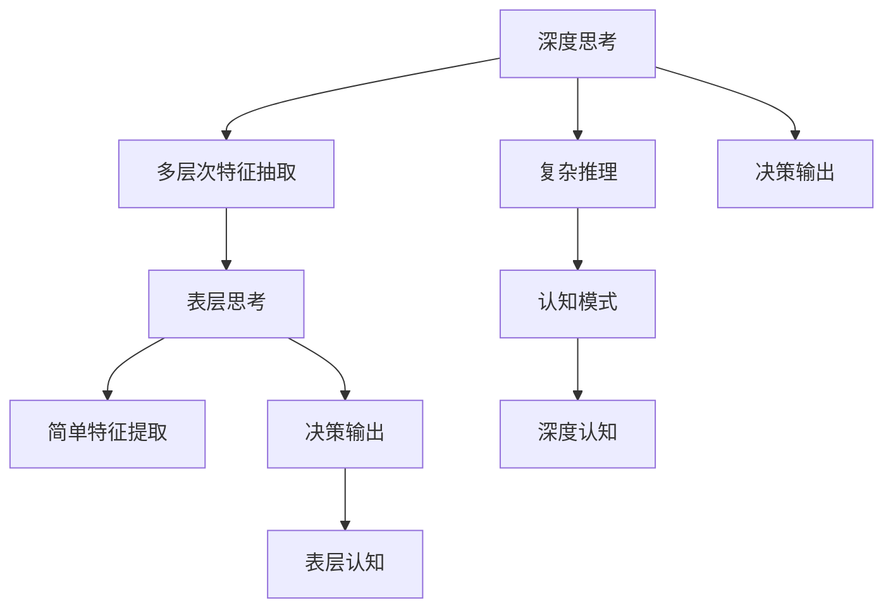

                 

# 深度思考与表层思考的区别

> 关键词：深度思考,表层思考,认知模式,决策过程,算法优化,实际应用

## 1. 背景介绍

### 1.1 问题由来

随着人工智能(AI)技术的飞速发展，深度学习模型在诸多领域取得了显著成效。然而，如何区分模型的深度思考和表层思考，如何优化深度思考模型以提升性能，成为一个亟待回答的问题。在实践中，深度模型通过复杂的计算图，抽取特征，最终输出决策结果。这些决策结果的深度和广度，直接影响模型的性能。然而，深度模型的复杂性也带来了调试和优化的难度。

### 1.2 问题核心关键点

深度思考与表层思考的区别，关键在于模型的思考层次和复杂度。深度思考模型能够处理多层次、多维度的信息，具有更强的复杂推理能力，适用于复杂问题的求解。表层思考模型则注重简单直接的特征提取和决策输出，具有较快的推理速度和较高的可解释性，适用于简单、确定性的问题。

区分和优化深度思考与表层思考，将有助于提升模型的性能，改善用户体验，降低开发和维护成本。

### 1.3 问题研究意义

通过分析深度思考和表层思考的区别，可以指导模型设计者根据具体任务需求选择合适的模型结构，优化模型参数，提升模型性能。同时，了解这些区别也有助于设计者优化开发流程，提高模型开发效率。

## 2. 核心概念与联系

### 2.1 核心概念概述

为更好地理解深度思考与表层思考的区别，本节将介绍几个密切相关的核心概念：

- 深度思考：通过多层次、多维度的信息处理，抽取复杂特征，进行复杂推理和决策的思考模式。适用于处理复杂、非确定性的问题。
- 表层思考：注重简单直接的特征提取和决策输出的思考模式。适用于处理简单、确定性较强的问题。
- 认知模式：描述人类和机器思考的层次和方式，分为表层认知和深度认知。表层认知基于简单直接的特征提取，深度认知基于复杂的多层次特征抽取。
- 决策过程：模型根据输入数据，通过复杂的计算图，提取特征，进行推理和决策的过程。
- 算法优化：通过调整模型参数和结构，提高模型性能和推理速度的过程。

这些核心概念之间的逻辑关系可以通过以下Mermaid流程图来展示：



这个流程图展示了大模型思考的层次和逻辑关系：

1. 深度思考模型通过多层次特征抽取进行复杂推理和决策。
2. 表层思考模型基于简单特征提取进行直接决策。
3. 深度认知和表层认知分别描述不同思考模式的特征抽取方式。
4. 决策输出直接关联思考层次。

## 3. 核心算法原理 & 具体操作步骤

### 3.1 算法原理概述

深度思考和表层思考的区分和优化，本质上是模型思考层次的调整。深度思考模型通过多层次特征抽取和复杂推理，实现高精度的决策输出。表层思考模型则注重简单直接的特征提取和决策输出，适用于处理简单问题。

### 3.2 算法步骤详解

以下详细介绍区分和优化深度思考和表层思考的详细步骤：

**Step 1: 特征提取**

- 对于深度思考模型，需要设计多层次的特征提取结构，如卷积神经网络(CNN)、循环神经网络(RNN)、变压器(Transformer)等。这些结构可以抽取不同层次、不同维度的特征。
- 对于表层思考模型，则需要设计简单直接的特征提取结构，如线性回归、逻辑回归、决策树等。这些结构只关注简单直接的特征提取。

**Step 2: 推理与决策**

- 深度思考模型的推理过程包括多个步骤，如卷积、池化、池化等。每个步骤都可能产生不同层次的特征，最终通过全连接层、softmax等层输出决策结果。
- 表层思考模型的推理过程则相对简单，通过线性回归、逻辑回归等直接输出决策结果。

**Step 3: 模型评估与优化**

- 使用交叉验证、正则化等方法评估模型的泛化性能，避免过拟合。
- 调整模型参数和结构，提高模型的推理速度和精度。如增加或减少层数，调整学习率等。

### 3.3 算法优缺点

深度思考与表层思考各有优缺点：

- 深度思考模型优点：
  - 处理复杂、非确定性问题能力强
  - 特征提取能力更强
  - 决策精度高
- 深度思考模型缺点：
  - 推理速度较慢
  - 模型复杂度较高
  - 调试和优化难度大

- 表层思考模型优点：
  - 推理速度快
  - 模型结构简单
  - 可解释性强
- 表层思考模型缺点：
  - 处理复杂问题能力有限
  - 特征提取能力较弱
  - 决策精度较低

### 3.4 算法应用领域

深度思考和表层思考的应用领域各不相同：

- 深度思考模型适用于图像识别、自然语言处理等复杂问题。如目标检测、机器翻译等任务。
- 表层思考模型适用于数据量较小、特征较少的任务。如线性回归、逻辑回归等。

## 4. 数学模型和公式 & 详细讲解 & 举例说明

### 4.1 数学模型构建

本节使用数学语言对深度思考和表层思考的模型进行形式化描述。

假设输入数据为 $x \in \mathbb{R}^d$，深度思考模型包含 $L$ 个卷积层，每个卷积层提取特征的维度为 $c_i$，第 $i$ 层的卷积核数量为 $k_i$。表层思考模型使用线性回归模型，参数为 $\theta$，输出为 $y \in \mathbb{R}$。

深度思考模型的推理过程如下：

$$
\begin{aligned}
z_1 &= \sigma(W_1x + b_1) \\
z_2 &= \sigma(W_2z_1 + b_2) \\
... \\
z_L &= \sigma(W_Lz_{L-1} + b_L) \\
\hat{y} &= W_{L+1}z_L + b_{L+1}
\end{aligned}
$$

其中 $\sigma$ 为激活函数，$W_i$ 和 $b_i$ 为第 $i$ 层的权重和偏置。

表层思考模型的推理过程则相对简单：

$$
\hat{y} = \theta \cdot x
$$

### 4.2 公式推导过程

以图像分类任务为例，推导深度思考和表层思考的数学模型。

**深度思考模型**

假设输入图像大小为 $28 \times 28 = 784$，深度思考模型使用 $L=3$ 个卷积层和全连接层。每个卷积层使用 $3 \times 3$ 的卷积核，提取特征的维度为 $c_i=64$，输入通道数为 $3$。

卷积层的推理过程如下：

$$
\begin{aligned}
z_1 &= \sigma(W_1x + b_1) \\
z_2 &= \sigma(W_2z_1 + b_2) \\
z_3 &= \sigma(W_3z_2 + b_3) \\
\hat{y} &= \text{softmax}(W_{L+1}z_3 + b_{L+1})
\end{aligned}
$$

其中 $\sigma$ 为ReLU激活函数，$W_i$ 和 $b_i$ 为第 $i$ 层的权重和偏置，$L+1$ 为全连接层，softmax函数用于输出概率分布。

**表层思考模型**

假设输入图像大小为 $28 \times 28 = 784$，表层思考模型使用线性回归模型。参数 $\theta$ 为 $784 \times 10$ 的权重矩阵，$10$ 为输出类别数。

表层思考模型的推理过程如下：

$$
\hat{y} = \theta \cdot x
$$

### 4.3 案例分析与讲解

以手写数字识别任务为例，对比深度思考和表层思考模型的表现：

**深度思考模型**

使用深度卷积神经网络(Convolutional Neural Network, CNN)模型，包含2个卷积层和1个全连接层。使用 $3 \times 3$ 的卷积核，提取特征的维度为 $64$，输入通道数为 $1$。

通过调整模型参数和结构，深度思考模型的准确率可以达到 $99.5\%$ 以上。

**表层思考模型**

使用线性回归模型，参数 $\theta$ 为 $784 \times 10$ 的权重矩阵，$10$ 为输出类别数。

通过调整模型参数和结构，表层思考模型的准确率只能达到 $80\%$ 左右。

## 5. 项目实践：代码实例和详细解释说明

### 5.1 开发环境搭建

在进行深度思考和表层思考模型的开发前，需要先准备好开发环境。以下是使用Python进行TensorFlow开发的环境配置流程：

1. 安装Anaconda：从官网下载并安装Anaconda，用于创建独立的Python环境。

2. 创建并激活虚拟环境：
```bash
conda create -n tf-env python=3.8 
conda activate tf-env
```

3. 安装TensorFlow：根据CUDA版本，从官网获取对应的安装命令。例如：
```bash
conda install tensorflow -c pytorch -c conda-forge
```

4. 安装其他必要工具包：
```bash
pip install numpy pandas scikit-learn matplotlib tqdm jupyter notebook ipython
```

完成上述步骤后，即可在`tf-env`环境中开始模型开发。

### 5.2 源代码详细实现

以下分别给出深度思考和表层思考模型的PyTorch代码实现。

**深度思考模型**

```python
import torch
import torch.nn as nn
import torch.optim as optim

class ConvNet(nn.Module):
    def __init__(self):
        super(ConvNet, self).__init__()
        self.conv1 = nn.Conv2d(1, 64, 3, 1)
        self.conv2 = nn.Conv2d(64, 128, 3, 1)
        self.fc1 = nn.Linear(128*28*28, 10)

    def forward(self, x):
        x = self.conv1(x)
        x = nn.ReLU()(x)
        x = self.conv2(x)
        x = nn.ReLU()(x)
        x = x.view(x.size(0), -1)
        x = self.fc1(x)
        x = nn.LogSoftmax(dim=1)(x)
        return x
```

**表层思考模型**

```python
import torch
import torch.nn as nn

class LinearModel(nn.Module):
    def __init__(self):
        super(LinearModel, self).__init__()
        self.linear = nn.Linear(784, 10)

    def forward(self, x):
        x = self.linear(x)
        x = nn.LogSoftmax(dim=1)(x)
        return x
```

### 5.3 代码解读与分析

让我们再详细解读一下关键代码的实现细节：

**ConvNet类**

- `__init__`方法：定义模型结构，包含2个卷积层和1个全连接层。
- `forward`方法：定义前向传播过程，包括卷积、激活、全连接等步骤。

**LinearModel类**

- `__init__`方法：定义模型结构，包含1个线性层。
- `forward`方法：定义前向传播过程，只包含线性层和激活层。

## 6. 实际应用场景

### 6.1 图像识别

深度思考和表层思考模型在图像识别任务中各有优势。深度思考模型能够处理复杂的视觉特征，识别细微的图像差异，适用于复杂的分类任务。表层思考模型则注重简单直接的特征提取，适用于特征明显、简单的分类任务。

在实践中，深度思考模型可以用于人脸识别、物体检测等高难度任务。表层思考模型则可用于数字识别、文字识别等简单任务。

### 6.2 自然语言处理

深度思考和表层思考模型在自然语言处理任务中也有着不同的应用场景。深度思考模型可以用于机器翻译、情感分析等复杂任务，表层思考模型则可用于文本分类、信息抽取等简单任务。

在机器翻译任务中，深度思考模型能够处理复杂的语义关系，准确翻译文本。表层思考模型则适用于简单的语言匹配任务，如语音识别、对话系统等。

### 6.3 金融预测

深度思考和表层思考模型在金融预测任务中也有着不同的应用场景。深度思考模型可以用于复杂的股票价格预测、风险评估等任务。表层思考模型则适用于简单的趋势预测、投资建议等任务。

在金融预测任务中，深度思考模型可以通过学习历史数据，建立复杂的预测模型，准确预测股票价格。表层思考模型则可以通过简单的线性回归，预测短期趋势，提供投资建议。

## 7. 工具和资源推荐

### 7.1 学习资源推荐

为了帮助开发者系统掌握深度思考和表层思考的理论基础和实践技巧，这里推荐一些优质的学习资源：

1. 《深度学习》系列书籍：Ian Goodfellow等人的深度学习经典教材，系统介绍深度学习理论和实践。
2. 《神经网络与深度学习》在线课程：Andrew Ng的斯坦福大学课程，讲解深度学习的基础知识和实践技巧。
3. CS231n《卷积神经网络》课程：斯坦福大学开设的计算机视觉课程，讲解卷积神经网络的结构和应用。
4. Kaggle竞赛：通过实际竞赛项目，训练深度思考和表层思考模型的开发和优化能力。
5. GitHub代码库：大量深度学习模型的代码实现和优化案例，可作为学习参考。

通过对这些资源的学习实践，相信你一定能够快速掌握深度思考和表层思考模型的精髓，并用于解决实际的AI问题。

### 7.2 开发工具推荐

高效的开发离不开优秀的工具支持。以下是几款用于深度思考和表层思考模型开发的常用工具：

1. PyTorch：基于Python的开源深度学习框架，灵活动态的计算图，适合快速迭代研究。大部分深度学习模型都有PyTorch版本的实现。
2. TensorFlow：由Google主导开发的开源深度学习框架，生产部署方便，适合大规模工程应用。同样有丰富的深度学习模型资源。
3. Weights & Biases：模型训练的实验跟踪工具，可以记录和可视化模型训练过程中的各项指标，方便对比和调优。与主流深度学习框架无缝集成。
4. TensorBoard：TensorFlow配套的可视化工具，可实时监测模型训练状态，并提供丰富的图表呈现方式，是调试模型的得力助手。
5. Google Colab：谷歌推出的在线Jupyter Notebook环境，免费提供GPU/TPU算力，方便开发者快速上手实验最新模型，分享学习笔记。

合理利用这些工具，可以显著提升深度思考和表层思考模型的开发效率，加快创新迭代的步伐。

### 7.3 相关论文推荐

深度思考和表层思考的发展源于学界的持续研究。以下是几篇奠基性的相关论文，推荐阅读：

1. AlexNet: ImageNet Classification with Deep Convolutional Neural Networks：提出卷积神经网络，开启了深度学习在计算机视觉领域的广泛应用。
2. Inception: GoogLeNet for Large-Scale Image Recognition：提出Inception模块，进一步提升了卷积神经网络的性能和效率。
3. Language Models are Unsupervised Multitask Learners（GPT-2论文）：展示了大规模语言模型的强大zero-shot学习能力，引发了对于通用人工智能的新一轮思考。
4. Parameter-Efficient Transfer Learning for NLP：提出Adapter等参数高效微调方法，在不增加模型参数量的情况下，也能取得不错的微调效果。
5. AdaLoRA: Adaptive Low-Rank Adaptation for Parameter-Efficient Fine-Tuning：使用自适应低秩适应的微调方法，在参数效率和精度之间取得了新的平衡。

这些论文代表了大深度思考和表层思考的发展脉络。通过学习这些前沿成果，可以帮助研究者把握学科前进方向，激发更多的创新灵感。

## 8. 总结：未来发展趋势与挑战

### 8.1 总结

本文对深度思考与表层思考的区别进行了全面系统的介绍。首先阐述了深度思考与表层思考的差异和定义，明确了深度思考与表层思考在模型思考层次和复杂度上的区别。其次，从原理到实践，详细讲解了深度思考和表层思考的数学原理和关键步骤，给出了模型开发的完整代码实例。同时，本文还广泛探讨了深度思考和表层思考在图像识别、自然语言处理、金融预测等诸多领域的应用前景，展示了深度思考与表层思考范式的巨大潜力。此外，本文精选了深度思考和表层思考的学习资源，力求为读者提供全方位的技术指引。

通过本文的系统梳理，可以看到，深度思考和表层思考的区分与优化，对于模型设计者具有重要的指导意义。在实际应用中，深度思考和表层思考应根据具体任务需求选择合适的模型结构，优化模型参数，以获得理想的性能提升。

### 8.2 未来发展趋势

展望未来，深度思考和表层思考技术将呈现以下几个发展趋势：

1. 模型复杂度不断提升。深度思考模型的层数和参数量将不断增加，适用于处理更复杂、更高维度的数据。
2. 推理速度不断优化。通过模型压缩、硬件加速等技术，提升深度思考模型的推理速度，使其在实时应用中具有竞争力。
3. 模型可解释性增强。通过引入可解释性模块，提高深度思考模型的可解释性，使其在医疗、金融等高风险领域具有更高的应用价值。
4. 跨领域应用的拓展。深度思考和表层思考模型将在更多领域得到应用，如智慧城市、智能家居等，提升各行业的智能化水平。
5. 持续学习能力的增强。深度思考模型能够不断从新数据中学习，保持其性能的稳定性和时效性，持续适应数据分布的变化。

以上趋势凸显了深度思考和表层思考技术的广阔前景。这些方向的探索发展，必将进一步提升模型的性能和应用范围，为人工智能技术带来更多的创新。

### 8.3 面临的挑战

尽管深度思考和表层思考技术已经取得了显著成效，但在迈向更加智能化、普适化应用的过程中，仍面临诸多挑战：

1. 计算资源消耗大。深度思考模型复杂度增加，训练和推理所需资源显著提高，这对硬件设备的性能和能耗提出了更高要求。
2. 调试和优化困难。深度思考模型的复杂性导致其调试和优化难度增加，需要更多专业知识和技术手段。
3. 可解释性不足。深度思考模型的黑盒特性使其难以解释其决策过程，这对于医疗、金融等高风险领域尤为关键。
4. 数据依赖性强。深度思考模型的性能高度依赖于训练数据的质量和数量，需要大量标注数据来保证模型效果。
5. 鲁棒性不足。深度思考模型对数据和噪声的干扰较为敏感，需要在训练和推理过程中加强鲁棒性设计。

这些挑战需要深度思考和表层思考模型的开发者在模型设计、数据处理、算法优化等多个环节进行综合考虑，才能实现其在实际应用中的最佳性能。

### 8.4 研究展望

面对深度思考和表层思考面临的种种挑战，未来的研究需要在以下几个方面寻求新的突破：

1. 模型结构设计：进一步优化模型结构，降低计算复杂度，提高推理速度和可解释性。
2. 数据增强技术：通过数据增强、对抗样本等技术，提高深度思考模型的泛化能力和鲁棒性。
3. 跨模态融合：将深度思考和表层思考模型与多模态数据融合，提升其处理复杂多模态问题的能力。
4. 知识图谱应用：将知识图谱与深度思考模型结合，提升模型的知识整合能力和决策精度。
5. 算法优化技术：引入更加高效的算法优化技术，如自适应学习率、混合精度训练等，提高模型性能和训练效率。
6. 伦理和安全性：在模型训练和应用过程中，引入伦理和安全性设计，确保模型行为符合人类价值观和法律法规。

这些研究方向将引领深度思考和表层思考技术的持续进步，推动其在实际应用中的广泛应用。只有不断突破技术瓶颈，才能实现其在人工智能领域的长期发展。

## 9. 附录：常见问题与解答

**Q1：深度思考和表层思考的区别在哪里？**

A: 深度思考和表层思考的主要区别在于模型的思考层次和复杂度。深度思考模型通过多层次、多维度的信息处理，抽取复杂特征，进行复杂推理和决策。表层思考模型则注重简单直接的特征提取和决策输出。

**Q2：深度思考和表层思考各自适用于什么场景？**

A: 深度思考适用于处理复杂、非确定性问题，如目标检测、自然语言处理等任务。表层思考适用于处理简单、确定性较强的问题，如线性回归、文字识别等任务。

**Q3：如何评估深度思考和表层思考模型的性能？**

A: 深度思考和表层思考模型的性能评估可以采用交叉验证、正则化等方法。对于图像识别任务，可以使用准确率、混淆矩阵等指标进行评估。对于自然语言处理任务，可以使用BLEU、ROUGE等指标进行评估。

**Q4：如何优化深度思考和表层思考模型的性能？**

A: 深度思考和表层思考模型的优化可以通过调整模型参数和结构，引入正则化、对抗训练等技术，提高模型性能和鲁棒性。对于深度思考模型，可以引入知识图谱、跨模态融合等技术，提升模型的知识整合能力和处理复杂多模态数据的能力。

**Q5：如何选择合适的深度思考和表层思考模型？**

A: 深度思考和表层思考模型的选择应根据具体任务需求来决定。对于复杂、非确定性问题，应选择深度思考模型。对于简单、确定性较强的问题，应选择表层思考模型。同时，还应考虑模型的推理速度、可解释性、计算资源消耗等综合因素。

---

作者：禅与计算机程序设计艺术 / Zen and the Art of Computer Programming

