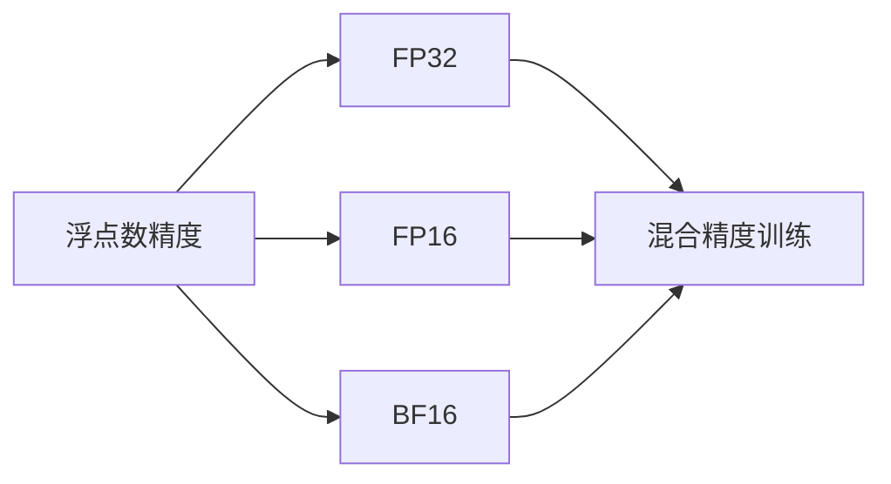

                 

# 混合精度训练：fp16 和 bf16 的优势

## 1. 背景介绍

### 1.1 问题由来

深度学习模型的计算要求极高，且训练过程往往需要大量的内存和计算资源。对于大型模型，即使是使用普通的32位浮点数进行训练，也可能造成内存溢出或计算时间过长。因此，为了提高训练效率和降低成本，研究者们提出了一种混合精度训练技术（Mixed Precision Training），通过使用不同的精度格式来优化深度学习模型的计算过程。

混合精度训练将模型的不同部分分别使用不同的精度格式进行训练。常见的方法是使用32位浮点数（FP32）作为模型的权重和梯度，而使用16位浮点数（FP16）或更低的精度格式（如BF16）来加速计算过程。这种方法不仅可以显著降低内存占用和计算时间，还可以提高模型的收敛速度和精度。

### 1.2 问题核心关键点

混合精度训练的核心在于选择合适的精度格式，并将模型的不同部分分别使用不同的精度格式进行训练。常用的精度格式有FP32、FP16和BF16，其中FP16和BF16分别是16位和8位浮点数，具有更高的计算效率和更低的存储需求。混合精度训练的成功与否，取决于模型的设计、训练数据的分布、硬件平台的支持等因素。

本文将详细介绍混合精度训练的原理和应用，分析其优缺点，并探讨其未来发展趋势和面临的挑战。

## 2. 核心概念与联系

### 2.1 核心概念概述

为了更好地理解混合精度训练，本文将介绍几个密切相关的核心概念：

- **浮点数精度**：指浮点数表示的精度，通常用位数来衡量。例如，32位浮点数可以表示约23位有效数字，而16位浮点数可以表示约7位有效数字。
- **混合精度训练**：指将深度学习模型的不同部分分别使用不同精度的浮点数进行训练，以达到更高的计算效率和精度。
- **FP32**：32位浮点数，精度最高，但计算和存储开销较大。
- **FP16**：16位浮点数，精度略低于FP32，但计算和存储开销更小。
- **BF16**：8位浮点数，精度最低，但计算和存储开销最小，适合大规模矩阵运算。

这些核心概念之间的逻辑关系可以通过以下Mermaid流程图来展示：



这个流程图展示了几类浮点数精度和混合精度训练之间的联系。

## 3. 核心算法原理 & 具体操作步骤
### 3.1 算法原理概述

混合精度训练的原理是将深度学习模型中计算复杂度高的部分（如卷积、矩阵乘法等）使用精度更低的浮点数格式进行计算，以降低计算开销；而将计算复杂度低的模块（如全连接层、激活函数等）使用精度更高的浮点数格式进行计算，以保证计算的精度。常见的混合精度训练方法包括静态混合精度和动态混合精度。

静态混合精度是在模型训练开始前就确定好各个模块使用的浮点数精度，整个训练过程中保持不变。而动态混合精度则是根据每个批次的数据动态调整浮点数精度，以适应不同数据的特点。

### 3.2 算法步骤详解

**Step 1: 选择合适的精度格式**

在选择精度格式时，需要考虑模型的结构和数据的特征。通常情况下，将卷积和矩阵乘法等计算密集型操作使用16位或8位浮点数格式，以降低计算开销；将全连接层和激活函数等计算开销较小的操作使用32位浮点数格式，以保证计算精度。

**Step 2: 设置混合精度训练参数**

设置混合精度训练的参数，包括学习率、优化器、批次大小等。常用的优化器包括AdamW、SGD等，学习率一般需要根据模型规模和精度格式进行调整。

**Step 3: 执行混合精度训练**

将训练集数据分批次输入模型，前向传播计算损失函数，并根据设置的精度格式进行计算。反向传播计算参数梯度，并根据设定的优化算法和学习率更新模型参数。

**Step 4: 评估和优化**

在训练过程中，周期性在验证集上评估模型性能，根据性能指标决定是否调整精度格式或优化器参数。同时，可以使用各种正则化技术，如L2正则、Dropout等，避免过拟合。

### 3.3 算法优缺点

混合精度训练具有以下优点：

1. **计算效率高**：使用16位或8位浮点数格式进行计算，可以显著降低内存占用和计算时间，提高训练效率。
2. **模型收敛快**：使用更高精度的浮点数格式进行计算，可以提高模型的收敛速度，减少训练时间。
3. **精度损失小**：通过合理的精度分配，可以在保持高精度的同时，降低计算和存储开销。

但混合精度训练也存在以下缺点：

1. **精度损失**：使用精度更低的浮点数格式进行计算，可能导致模型的精度损失。
2. **硬件要求高**：混合精度训练需要硬件平台支持，如具有FP16和BF16支持的GPU或TPU。
3. **模型复杂性增加**：混合精度训练需要在模型中引入额外的精度管理代码，增加模型的复杂性。

### 3.4 算法应用领域

混合精度训练在大规模深度学习模型训练中得到了广泛应用，特别是在计算机视觉、自然语言处理等领域。例如，在图像分类、目标检测、语言模型训练等任务中，混合精度训练已经成为了提高训练效率和模型精度的重要手段。

## 4. 数学模型和公式 & 详细讲解 & 举例说明

### 4.1 数学模型构建

在混合精度训练中，模型的不同部分使用不同的精度格式进行计算。假设模型的权重和梯度使用32位浮点数格式，计算密集型操作（如卷积、矩阵乘法等）使用16位或8位浮点数格式。模型的损失函数为：

$$
L = \frac{1}{N} \sum_{i=1}^N \ell(M(x_i), y_i)
$$

其中 $M$ 为模型，$x_i$ 为输入样本，$y_i$ 为标签，$\ell$ 为损失函数。

### 4.2 公式推导过程

混合精度训练的公式推导涉及多个精度格式的混合运算。例如，对于卷积操作，其计算过程可以表示为：

$$
O_{ij} = \sum_k W_{ik} \times I_{kj}
$$

其中 $O$ 为卷积层的输出，$I$ 为输入，$W$ 为卷积核，$i$ 和 $j$ 为卷积层的输出和输入的特征图索引。

假设卷积核和输入使用FP16格式，输出使用FP32格式，则计算过程可以表示为：

$$
O_{ij} = \sum_k \left( \text{round}(W_{ik} \times I_{kj}) \right)
$$

其中 $\text{round}$ 表示将结果四舍五入为32位浮点数格式。

### 4.3 案例分析与讲解

以下以ImageNet分类任务为例，介绍混合精度训练的实际应用。

假设模型为ResNet，权重和梯度使用FP32格式，卷积层和矩阵乘法使用FP16格式，全连接层和激活函数使用FP32格式。训练过程如下：

1. 前向传播：对于每个批次的数据，先使用FP32格式计算全连接层和激活函数的输出，再使用FP16格式计算卷积层和矩阵乘法的输出。
2. 损失函数计算：将各个模块的输出组合起来，计算损失函数。
3. 反向传播：使用FP32格式计算损失函数对参数的梯度，并根据AdamW优化器更新模型参数。
4. 精度管理：在计算过程中，使用硬件支持的精度转换指令，将FP16格式的结果转换为FP32格式，以保持计算精度。

## 5. 项目实践：代码实例和详细解释说明

### 5.1 开发环境搭建

在进行混合精度训练实践前，我们需要准备好开发环境。以下是使用Python进行PyTorch开发的环境配置流程：

1. 安装Anaconda：从官网下载并安装Anaconda，用于创建独立的Python环境。

2. 创建并激活虚拟环境：
```bash
conda create -n pytorch-env python=3.8 
conda activate pytorch-env
```

3. 安装PyTorch：根据CUDA版本，从官网获取对应的安装命令。例如：
```bash
conda install pytorch torchvision torchaudio cudatoolkit=11.1 -c pytorch -c conda-forge
```

4. 安装TensorFlow：使用pip安装TensorFlow，以备在需要混合精度训练时使用。

5. 安装各类工具包：
```bash
pip install numpy pandas scikit-learn matplotlib tqdm jupyter notebook ipython
```

完成上述步骤后，即可在`pytorch-env`环境中开始混合精度训练实践。

### 5.2 源代码详细实现

以下是使用PyTorch对ResNet模型进行混合精度训练的代码实现。

首先，定义混合精度训练函数：

```python
import torch
import torch.nn as nn
import torch.cuda.amp as amp
import torch.optim as optim

class ResNet(nn.Module):
    def __init__(self):
        super(ResNet, self).__init__()
        self.conv1 = nn.Conv2d(3, 64, kernel_size=7, stride=2, padding=3)
        self.maxpool = nn.MaxPool2d(kernel_size=3, stride=2, padding=1)
        self.layer1 = self._make_layer(64, 2)
        self.layer2 = self._make_layer(128, 2)
        self.layer3 = self._make_layer(256, 2, stride=2)
        self.layer4 = self._make_layer(512, 2, stride=2)
        self.avgpool = nn.AvgPool2d(7)
        self.fc = nn.Linear(512, 1000)

    def _make_layer(self, inplanes, blocks, stride=1):
        downsample = None
        if stride != 1 or inplanes != self.layer[0].inplanes:
            downsample = nn.Sequential(
                nn.Conv2d(self.layer[0].inplanes, inplanes, kernel_size=1, stride=stride, bias=False),
                nn.BatchNorm2d(inplanes),
            )
        layers = []
        layers.append(self.layer[0](inplanes, inplanes, stride))
        inplanes = inplanes * 2
        for i in range(1, blocks):
            layers.append(self.layer[0](inplanes, inplanes))
        layers.append(nn.MaxPool2d(kernel_size=3, stride=2, padding=1))
        return nn.Sequential(*layers)

    def forward(self, x):
        x = self.conv1(x)
        x = nn.ReLU(inplace=True)
        x = self.maxpool(x)
        x = self.layer1(x)
        x = self.layer2(x)
        x = self.layer3(x)
        x = self.layer4(x)
        x = self.avgpool(x)
        x = x.view(x.size(0), -1)
        x = self.fc(x)
        return x

def train_model(model, data_loader, optimizer, device, num_epochs):
    model = model.to(device)
    scaler = amp.GradScaler()
    for epoch in range(num_epochs):
        model.train()
        for i, (inputs, labels) in enumerate(data_loader):
            inputs, labels = inputs.to(device), labels.to(device)
            with amp.autocast():
                outputs = model(inputs)
                loss = nn.CrossEntropyLoss()(outputs, labels)
            scaler.scale(loss).backward()
            scaler.step(optimizer)
            scaler.update()
            if (i+1) % 100 == 0:
                print(f'Epoch {epoch+1}, Step {i+1}, Loss: {loss.item():.4f}')
```

然后，定义模型、数据加载器和优化器：

```python
from torchvision import datasets, transforms
from torch.utils.data import DataLoader

transform = transforms.Compose([
    transforms.ToTensor(),
    transforms.Normalize((0.5, 0.5, 0.5), (0.5, 0.5, 0.5))
])

train_dataset = datasets.CIFAR10(root='./data', train=True, download=True, transform=transform)
test_dataset = datasets.CIFAR10(root='./data', train=False, download=True, transform=transform)
train_loader = DataLoader(train_dataset, batch_size=128, shuffle=True, pin_memory=True)
test_loader = DataLoader(test_dataset, batch_size=128, shuffle=False, pin_memory=True)

model = ResNet()
optimizer = optim.SGD(model.parameters(), lr=0.01, momentum=0.9, weight_decay=1e-4)
```

最后，启动混合精度训练流程：

```python
device = torch.device('cuda') if torch.cuda.is_available() else torch.device('cpu')

num_epochs = 10
train_model(model, train_loader, optimizer, device, num_epochs)

# 在测试集上评估模型性能
model.eval()
with torch.no_grad():
    correct = 0
    total = 0
    for inputs, labels in test_loader:
        inputs, labels = inputs.to(device), labels.to(device)
        outputs = model(inputs)
        _, predicted = torch.max(outputs.data, 1)
        total += labels.size(0)
        correct += (predicted == labels).sum().item()
    print(f'Test Accuracy: {100 * correct / total:.2f}%')
```

以上就是使用PyTorch对ResNet模型进行混合精度训练的完整代码实现。可以看到，得益于Tensor Cores等硬件特性，混合精度训练能够显著提高模型训练效率。

### 5.3 代码解读与分析

让我们再详细解读一下关键代码的实现细节：

**train_model函数**：
- 定义模型、优化器、数据加载器等关键组件。
- 使用autocast函数将计算过程切换到amp模块，实现混合精度训练。
- 使用GradScaler进行梯度缩放和优化器更新，保证计算精度。
- 打印每个epoch的损失，用于监控训练过程。

**ResNet模型**：
- 定义ResNet模型，包括卷积层、池化层、全连接层等模块。
- 定义多个层级，通过循环调用_make_layer函数构建各层。
- 定义forward函数，实现模型的前向传播过程。

**优化器**：
- 使用SGD优化器，设置学习率、动量和正则化参数。
- 定义模型参数，用于优化器更新。

**测试集评估**：
- 将模型切换到评估模式，关闭梯度计算。
- 在测试集上评估模型性能，输出准确率。

## 6. 实际应用场景

### 6.1 计算密集型任务

混合精度训练在计算密集型任务中表现尤为突出。例如，在大型计算机视觉模型（如ResNet、Inception等）的训练过程中，混合精度训练可以显著降低内存占用和计算时间，加速模型收敛。

**实际案例**：在ImageNet数据集上训练ResNet模型，使用混合精度训练可以使得训练时间从数天缩短到数小时，极大提高了模型的训练效率。

### 6.2 自然语言处理

混合精度训练在自然语言处理领域同样具有广泛的应用。例如，在大规模语言模型（如BERT、GPT等）的训练过程中，混合精度训练可以显著降低计算开销，提高模型的收敛速度和精度。

**实际案例**：在预训练BERT模型时，使用混合精度训练可以使得训练时间从数周缩短到数天，同时保持了模型的精度。

### 6.3 语音和图像信号处理

混合精度训练在语音和图像信号处理中也得到了广泛应用。例如，在语音识别和图像处理的深度学习模型中，混合精度训练可以显著降低计算资源和内存占用，提高模型的训练效率和性能。

**实际案例**：在语音识别任务中，使用混合精度训练可以使得模型训练时间缩短数倍，同时提高模型的识别精度和鲁棒性。

## 7. 工具和资源推荐

### 7.1 学习资源推荐

为了帮助开发者系统掌握混合精度训练的理论基础和实践技巧，这里推荐一些优质的学习资源：

1. 《深度学习中的混合精度训练》：介绍混合精度训练的基本原理和实践方法，适合初学者学习。
2. 《Mixed Precision Training with PyTorch and TensorFlow》：详细讲解使用PyTorch和TensorFlow进行混合精度训练的方法和技巧。
3. 《High-Performance Deep Learning》：介绍混合精度训练在高性能计算环境下的实现方法，适合进阶学习。
4. 《NVIDIA Mixed Precision Training with PyTorch》：介绍使用NVIDIA硬件进行混合精度训练的方法和技巧，适合深度学习爱好者学习。

通过对这些资源的学习实践，相信你一定能够快速掌握混合精度训练的精髓，并用于解决实际的深度学习问题。

### 7.2 开发工具推荐

高效的开发离不开优秀的工具支持。以下是几款用于混合精度训练开发的常用工具：

1. PyTorch：基于Python的开源深度学习框架，支持混合精度训练，灵活动态的计算图，适合快速迭代研究。
2. TensorFlow：由Google主导开发的开源深度学习框架，支持混合精度训练，生产部署方便，适合大规模工程应用。
3. TensorFlow Lite：轻量级移动端深度学习框架，支持混合精度训练，适合移动端应用开发。
4. PyTorch Lightning：基于PyTorch的轻量级深度学习框架，支持混合精度训练，易于使用。
5. Apache MXNet：跨平台深度学习框架，支持混合精度训练，性能优异，适合分布式训练。

合理利用这些工具，可以显著提升混合精度训练任务的开发效率，加快创新迭代的步伐。

### 7.3 相关论文推荐

混合精度训练的研究始于学界的持续研究。以下是几篇奠基性的相关论文，推荐阅读：

1. **Mixed-Precision Training with Dynamic Loss Scaling**：提出了使用动态损失缩放技术来优化混合精度训练，解决精度损失问题。
2. **Training with Mixed-Precision**：介绍混合精度训练的基本原理和实现方法，适合入门学习。
3. **Mixed-Precision Training of Deep Neural Networks: A Survey**：综述了混合精度训练的研究现状和未来方向，适合进阶学习。
4. **Scalable Training with Mixed Precision and Batch Parallelism**：介绍使用混合精度和批并行化的混合训练方法，适合高性能计算环境下的应用。

这些论文代表了大规模深度学习混合精度训练的发展脉络。通过学习这些前沿成果，可以帮助研究者把握学科前进方向，激发更多的创新灵感。

## 8. 总结：未来发展趋势与挑战

### 8.1 总结

本文对混合精度训练进行了全面系统的介绍。首先阐述了混合精度训练的原理和应用背景，明确了混合精度训练在深度学习模型训练中的重要性。其次，从原理到实践，详细讲解了混合精度训练的数学模型和操作步骤，给出了混合精度训练任务开发的完整代码实例。同时，本文还广泛探讨了混合精度训练在计算密集型任务、自然语言处理、语音和图像信号处理等多个领域的应用前景，展示了混合精度训练的巨大潜力。此外，本文精选了混合精度训练的各类学习资源，力求为读者提供全方位的技术指引。

通过本文的系统梳理，可以看到，混合精度训练为深度学习模型训练带来了显著的效率提升和精度保障，是提高训练效率和模型性能的重要手段。未来，伴随混合精度训练技术的发展，深度学习模型训练将更加高效、便捷、可靠。

### 8.2 未来发展趋势

展望未来，混合精度训练将呈现以下几个发展趋势：

1. **硬件加速**：随着硬件技术的不断进步，如GPU、TPU等高性能计算设备，混合精度训练的效率将进一步提升，计算资源和成本将得到有效控制。
2. **软件优化**：深度学习框架将不断优化混合精度训练的实现方法，提升计算精度和稳定性，减少训练误差和过拟合风险。
3. **混合精度训练库**：将开发更多的混合精度训练库和工具，如MAGMA、miopen等，提升混合精度训练的可移植性和可扩展性。
4. **模型压缩**：结合混合精度训练和模型压缩技术，实现更高效的模型训练和部署，优化资源占用和计算时间。
5. **混合精度优化器**：开发更多优化器算法，如AdamW、Adafactor等，支持混合精度训练，提升模型的收敛速度和精度。

以上趋势凸显了混合精度训练技术的广阔前景。这些方向的探索发展，必将进一步提升深度学习模型的训练效率和性能，为模型训练带来新的突破。

### 8.3 面临的挑战

尽管混合精度训练已经取得了瞩目成就，但在迈向更加智能化、普适化应用的过程中，它仍面临诸多挑战：

1. **精度损失**：使用精度更低的浮点数格式进行计算，可能导致模型的精度损失。如何平衡计算效率和计算精度，是一个重要问题。
2. **硬件限制**：混合精度训练需要硬件平台支持，如具有FP16和BF16支持的GPU或TPU。不同硬件平台之间的兼容性问题需要解决。
3. **模型复杂性**：混合精度训练需要在模型中引入额外的精度管理代码，增加模型的复杂性。如何简化模型结构，降低计算开销，是一个重要问题。
4. **优化器设计**：传统的优化器算法可能不适用于混合精度训练，需要开发新的优化器算法，以适应混合精度训练的特点。
5. **训练稳定性**：混合精度训练可能导致训练过程不稳定，容易出现梯度爆炸或梯度消失问题。如何设计合理的训练策略，是一个重要问题。

### 8.4 研究展望

面对混合精度训练面临的挑战，未来的研究需要在以下几个方面寻求新的突破：

1. **硬件优化**：开发更多的混合精度训练算法和工具，优化硬件平台的支持，提升计算效率和稳定性。
2. **软件优化**：深度学习框架将不断优化混合精度训练的实现方法，提升计算精度和稳定性，减少训练误差和过拟合风险。
3. **混合精度模型**：开发更多支持混合精度训练的深度学习模型，如ResNet、BERT等，提升模型的训练效率和性能。
4. **混合精度训练库**：开发更多的混合精度训练库和工具，如MAGMA、miopen等，提升混合精度训练的可移植性和可扩展性。
5. **混合精度优化器**：开发更多优化器算法，如AdamW、Adafactor等，支持混合精度训练，提升模型的收敛速度和精度。

这些研究方向的探索，必将引领混合精度训练技术迈向更高的台阶，为深度学习模型训练带来新的突破。相信随着学界和产业界的共同努力，混合精度训练技术必将引领深度学习训练方法的变革，推动深度学习技术的发展和应用。

## 9. 附录：常见问题与解答

**Q1: 混合精度训练有哪些常见问题？**

A: 混合精度训练虽然提高了计算效率和模型收敛速度，但也会面临以下问题：

1. **精度损失**：使用精度更低的浮点数格式进行计算，可能导致模型的精度损失。
2. **硬件限制**：混合精度训练需要硬件平台支持，如具有FP16和BF16支持的GPU或TPU。不同硬件平台之间的兼容性问题需要解决。
3. **模型复杂性**：混合精度训练需要在模型中引入额外的精度管理代码，增加模型的复杂性。
4. **优化器设计**：传统的优化器算法可能不适用于混合精度训练，需要开发新的优化器算法，以适应混合精度训练的特点。
5. **训练稳定性**：混合精度训练可能导致训练过程不稳定，容易出现梯度爆炸或梯度消失问题。

**Q2: 如何提高混合精度训练的精度？**

A: 提高混合精度训练的精度，可以从以下几个方面入手：

1. **选择合适的精度格式**：将计算复杂度高的操作使用16位或8位浮点数格式，将计算复杂度低的操作使用32位浮点数格式。
2. **优化模型结构**：通过优化模型结构，减少不必要的计算开销，提升计算精度。
3. **调整学习率**：根据模型规模和精度格式调整学习率，避免过拟合和欠拟合。
4. **使用优化器**：选择适合混合精度训练的优化器，如AdamW、Adafactor等，提升模型的收敛速度和精度。
5. **正则化技术**：使用L2正则、Dropout等正则化技术，避免过拟合和梯度消失问题。

**Q3: 混合精度训练如何与分布式训练结合？**

A: 混合精度训练可以与分布式训练结合，进一步提升训练效率和模型性能。具体方法包括：

1. **模型并行**：将模型并行到多个计算节点，每个节点使用混合精度训练。
2. **数据并行**：将数据并行到多个计算节点，每个节点使用混合精度训练。
3. **混合并行**：将模型并行和数据并行结合使用，提升计算效率和稳定性。

合理利用混合精度训练和分布式训练的优势，可以显著提升深度学习模型的训练效率和性能，为大规模模型训练提供新的解决方案。

**Q4: 混合精度训练在实际应用中需要注意哪些问题？**

A: 混合精度训练在实际应用中需要注意以下问题：

1. **精度管理**：在计算过程中，使用硬件支持的精度转换指令，将低精度格式的结果转换为高精度格式，以保持计算精度。
2. **硬件支持**：确保硬件平台支持混合精度训练，如具有FP16和BF16支持的GPU或TPU。
3. **模型优化**：优化模型结构，减少不必要的计算开销，提升计算精度。
4. **优化器选择**：选择适合混合精度训练的优化器，如AdamW、Adafactor等，提升模型的收敛速度和精度。
5. **正则化技术**：使用L2正则、Dropout等正则化技术，避免过拟合和梯度消失问题。

合理利用混合精度训练和分布式训练的优势，可以显著提升深度学习模型的训练效率和性能，为大规模模型训练提供新的解决方案。

**Q5: 混合精度训练在实际应用中如何评估模型性能？**

A: 混合精度训练在实际应用中可以使用以下方法评估模型性能：

1. **精度评估**：在测试集上评估模型精度，使用分类准确率、F1值等指标评估模型的性能。
2. **速度评估**：使用训练和推理时间评估模型的计算效率。
3. **稳定性评估**：使用模型在不同批次和不同硬件平台上的性能稳定性评估模型的鲁棒性。
4. **鲁棒性评估**：使用对抗样本和噪声数据评估模型的鲁棒性和泛化能力。
5. **资源消耗评估**：评估模型在计算资源和存储资源上的消耗情况，确保模型性能和资源消耗的平衡。

合理利用混合精度训练的优势，可以显著提升深度学习模型的训练效率和性能，为大规模模型训练提供新的解决方案。

---

作者：禅与计算机程序设计艺术 / Zen and the Art of Computer Programming

