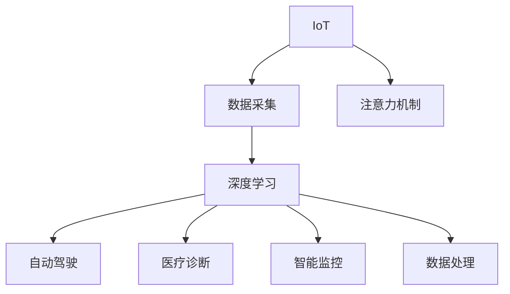

                 

# 物联网在注意力数据采集中的应用

> 关键词：物联网(IoT)、数据采集、注意力机制、深度学习、自动驾驶、医疗诊断、智能监控

## 1. 背景介绍

### 1.1 问题由来
随着物联网(IoT)技术的迅猛发展，越来越多的设备被连接到互联网，产生了海量复杂的数据。如何高效地采集、处理和利用这些数据，成为了物联网领域的一大挑战。尤其是对于关键性应用如自动驾驶、医疗诊断、智能监控等，数据采集的准确性和实时性要求极高。

### 1.2 问题核心关键点
物联网设备产生的注意力数据采集问题可以抽象为以下几个关键点：

- **数据复杂性**：来自不同设备的数据格式和类型千差万别，需要高效的数据采集和转换机制。
- **实时性要求**：如自动驾驶、智能监控等场景要求数据采集和处理必须实时进行。
- **注意力机制**：仅关注关键信息，避免数据过载和冗余，提高数据采集和处理的效率。
- **深度学习应用**：利用深度学习算法对注意力数据进行特征提取和分析，提升数据处理能力。

这些核心关键点共同构成了物联网中注意力数据采集的核心问题，成为目前研究的重点。

### 1.3 问题研究意义
高效的数据采集和处理不仅能提高物联网应用的效果，还能在一定程度上缓解物联网的带宽和存储压力，为实现智能化、自动化的物联网系统奠定坚实基础。在自动驾驶、智能监控、医疗诊断等关键应用领域，注意力数据采集技术的应用将显著提升系统的响应速度和决策质量，具有重要意义。

## 2. 核心概念与联系

### 2.1 核心概念概述

为更好地理解物联网中注意力数据采集的原理和技术，本节将介绍几个密切相关的核心概念：

- **物联网(IoT)**：通过传感器、标签、RFID等技术手段将物理世界中的物体连接起来，形成互联网的一部分。物联网设备产生的数据包括环境数据、位置信息、用户行为等，这些数据是注意力数据采集的基础。

- **数据采集**：通过传感器、摄像头、GPS等硬件设备获取物联网设备的状态信息和环境数据，并转化为可处理的数据格式。

- **注意力机制**：一种特殊的神经网络结构，用于从数据中提取出关键特征，避免数据过载和冗余，提高数据处理的效率。

- **深度学习**：一种基于神经网络的机器学习技术，通过多层次的特征提取和分类，实现复杂数据的处理和分析。

- **自动驾驶**：通过摄像头、雷达、GPS等传感器获取车辆周围环境信息，并结合深度学习技术实现自动驾驶。

- **医疗诊断**：通过智能穿戴设备、医院监测系统等获取患者的健康数据，结合深度学习进行疾病诊断。

- **智能监控**：通过摄像头、传感器等设备采集环境数据，结合深度学习进行行为分析和异常检测。

这些核心概念之间的逻辑关系可以通过以下Mermaid流程图来展示：



这个流程图展示了物联网中注意力数据采集的主要环节：

1. IoT设备产生数据，由传感器等硬件设备采集。
2. 数据通过注意力机制进行特征提取，去除冗余和噪声。
3. 特征数据由深度学习模型进行分析和处理。
4. 处理后的数据被用于自动驾驶、医疗诊断、智能监控等应用场景。

## 3. 核心算法原理 & 具体操作步骤
### 3.1 算法原理概述

物联网中注意力数据采集的核心在于通过注意力机制对数据进行筛选和重点关注，进而提高数据处理的效率和效果。其核心算法包括以下几个步骤：

1. **数据采集**：使用各种传感器获取物联网设备的状态信息和环境数据。
2. **数据预处理**：对采集到的数据进行去噪、归一化等预处理，确保数据的质量和一致性。
3. **特征提取**：通过注意力机制从原始数据中提取出关键特征，减少数据维度，提升后续处理的效率。
4. **模型训练**：使用深度学习算法对特征数据进行训练，提取高层次的特征表示，用于下游应用。
5. **应用部署**：将训练好的模型应用到实际场景中，进行实时数据处理和决策支持。

### 3.2 算法步骤详解

以下是物联网中注意力数据采集的详细步骤：

**Step 1: 数据采集与预处理**

- **数据采集**：使用各种传感器设备如温度传感器、压力传感器、摄像头等，获取物联网设备的环境数据和状态信息。

- **数据预处理**：对采集到的数据进行去噪、归一化等预处理操作，确保数据的准确性和一致性。例如，使用低通滤波器对传感器数据进行去噪处理，将数据归一化到0-1之间。

**Step 2: 特征提取与注意力机制**

- **特征提取**：使用注意力机制从原始数据中提取出关键特征。例如，使用Transformer模型中的self-attention机制，通过计算不同时间步或不同特征通道之间的注意力权重，选择对当前任务最为重要的特征进行保留。

- **注意力机制**：注意力机制的本质是对数据中不同部分的重要性进行权重分配，以决定哪些部分应该被重点关注。例如，在自然语言处理中，注意力机制可以用于选择与当前任务相关的词汇。

**Step 3: 模型训练与参数优化**

- **模型训练**：将提取到的特征数据输入到深度学习模型中进行训练。例如，使用卷积神经网络(CNN)对图像数据进行特征提取，使用循环神经网络(RNN)对序列数据进行处理。

- **参数优化**：通过优化算法如梯度下降、Adam等，对模型参数进行更新，最小化损失函数，提高模型效果。例如，使用交叉熵损失函数进行分类任务的训练。

**Step 4: 模型部署与应用**

- **模型部署**：将训练好的模型部署到实际应用场景中，进行实时数据处理和决策支持。例如，在自动驾驶中，将模型集成到车辆导航系统中，实时处理摄像头和雷达数据，辅助车辆进行路径规划。

- **应用优化**：根据实际应用场景，对模型进行优化。例如，对自动驾驶模型进行参数裁剪，减小模型大小，提高推理速度。

### 3.3 算法优缺点

物联网中注意力数据采集的算法具有以下优点：

- **高效性**：通过注意力机制对数据进行筛选，避免了数据过载和冗余，提高了数据处理的效率。
- **准确性**：深度学习模型能够从数据中提取高层次的特征表示，提升数据处理的效果。
- **适应性**：基于注意力机制的特征提取方法具有较强的泛化能力，能够适应不同类型的数据。

但同时，该算法也存在以下局限性：

- **计算资源需求高**：深度学习模型通常需要大量的计算资源进行训练和推理。
- **模型复杂性**：注意力机制和深度学习模型结构复杂，难以解释和调试。
- **数据依赖性**：模型的效果高度依赖于采集到的数据质量，数据采集和处理环节对系统整体性能影响较大。

尽管如此，基于注意力机制的深度学习算法在物联网数据采集和处理中仍具有重要的应用价值。

### 3.4 算法应用领域

物联网中注意力数据采集算法已经在多个领域得到了广泛应用，例如：

- **自动驾驶**：通过摄像头、雷达等传感器采集车辆周围环境数据，使用注意力机制选择关键特征，结合深度学习进行路径规划和决策支持。
- **医疗诊断**：通过智能穿戴设备、医院监测系统等获取患者的健康数据，使用注意力机制提取关键特征，结合深度学习进行疾病诊断和治疗方案设计。
- **智能监控**：通过摄像头、传感器等设备采集环境数据，使用注意力机制选择关键特征，结合深度学习进行行为分析和异常检测。
- **智能家居**：通过智能家居设备采集用户行为数据，使用注意力机制提取关键特征，结合深度学习进行智能推荐和个性化服务。
- **工业监控**：通过传感器、摄像头等设备采集工业生产数据，使用注意力机制选择关键特征，结合深度学习进行故障诊断和预测维护。

这些应用场景展示了物联网中注意力数据采集的广泛潜力，预示着该技术在未来将有更大的发展空间。

## 4. 数学模型和公式 & 详细讲解 & 举例说明

### 4.1 数学模型构建

物联网中注意力数据采集的数学模型通常基于深度学习框架构建，包括以下几个关键步骤：

- **数据预处理**：将原始数据转化为模型所需的输入格式，并进行标准化处理。
- **注意力机制**：使用自注意力机制或跨注意力机制，从数据中提取关键特征。
- **模型训练**：使用深度学习算法对特征数据进行训练，提取高层次的特征表示。
- **应用评估**：使用评估指标如准确率、召回率等，评估模型性能。

### 4.2 公式推导过程

以下是注意力机制的公式推导过程：

**自注意力机制**：

$$
\text{Attention}(Q, K, V) = \text{Softmax}\left(\frac{QK^T}{\sqrt{d_k}}\right)V
$$

其中 $Q, K, V$ 分别为查询、键和值矩阵，$d_k$ 为键向量的维度。

**注意力矩阵计算**：

$$
\text{AttentionMatrix} = \text{Softmax}\left(\frac{A^TA}{\sqrt{d_a}}\right)
$$

其中 $A$ 为输入矩阵，$d_a$ 为输入矩阵的维度。

**注意力加权特征**：

$$
\text{AttentionFeature} = \text{AttentionMatrix} \cdot \text{ValueMatrix}
$$

其中 $\text{ValueMatrix}$ 为值矩阵。

### 4.3 案例分析与讲解

以自动驾驶中的摄像头数据处理为例，分析如何利用注意力机制进行关键特征提取：

假设自动驾驶系统中摄像头采集到的一系列图像数据 $I_1, I_2, \ldots, I_n$。首先，对图像数据进行预处理，如去噪、归一化等操作，得到预处理后的图像数据 $\tilde{I}_1, \tilde{I}_2, \ldots, \tilde{I}_n$。

接着，使用卷积神经网络(CNN)对预处理后的图像数据进行特征提取，得到特征表示 $F_1, F_2, \ldots, F_n$。然后，使用注意力机制对特征表示进行筛选，选择对当前任务最为重要的特征表示。最后，将筛选出的特征表示输入到深度学习模型中，进行路径规划和决策支持。

## 5. 项目实践：代码实例和详细解释说明
### 5.1 开发环境搭建

在进行注意力数据采集实践前，我们需要准备好开发环境。以下是使用Python进行TensorFlow开发的环境配置流程：

1. 安装Anaconda：从官网下载并安装Anaconda，用于创建独立的Python环境。

2. 创建并激活虚拟环境：
```bash
conda create -n tf-env python=3.8 
conda activate tf-env
```

3. 安装TensorFlow：根据CUDA版本，从官网获取对应的安装命令。例如：
```bash
conda install tensorflow=2.5 -c conda-forge -c pypi
```

4. 安装TensorBoard：用于实时监测模型训练状态，并提供丰富的图表呈现方式。
```bash
pip install tensorboard
```

5. 安装各类工具包：
```bash
pip install numpy pandas scikit-learn matplotlib tqdm jupyter notebook ipython
```

完成上述步骤后，即可在`tf-env`环境中开始注意力数据采集实践。

### 5.2 源代码详细实现

这里我们以自动驾驶中的摄像头数据处理为例，给出使用TensorFlow进行注意力机制实现的代码。

首先，定义数据预处理函数：

```python
import tensorflow as tf
import numpy as np

def preprocess_image(image):
    image = tf.image.convert_image_dtype(image, tf.float32) / 255.0
    image = tf.image.per_image_standardization(image)
    return image
```

接着，定义特征提取和注意力计算函数：

```python
class Attention(tf.keras.layers.Layer):
    def __init__(self, num_heads, d_model):
        super(Attention, self).__init__()
        self.num_heads = num_heads
        self.d_model = d_model
        self.depth = d_model // num_heads
        self.wq = tf.keras.layers.Dense(d_model)
        self.wk = tf.keras.layers.Dense(d_model)
        self.v = tf.keras.layers.Dense(d_model)
        self.dense = tf.keras.layers.Dense(d_model)

    def split_heads(self, x, batch_size):
        x = tf.reshape(x, (batch_size, -1, self.num_heads, self.depth))
        return tf.transpose(x, perm=[0, 2, 1, 3])

    def call(self, inputs):
        q = self.wq(inputs)
        k = self.wk(inputs)
        v = self.v(inputs)
        q = self.split_heads(q, tf.shape(inputs)[0])
        k = self.split_heads(k, tf.shape(inputs)[0])
        v = self.split_heads(v, tf.shape(inputs)[0])
        scaled_attention, attention_weights = tf.linalg.mat_mul(q, k, transpose_b=True)
        scaled_attention = tf.divide(scaled_attention, tf.sqrt(tf.cast(self.depth, tf.float32)))
        attention_weights = tf.nn.softmax(scaled_attention, axis=-1)
        attention_output = tf.matmul(attention_weights, v)
        attention_output = tf.transpose(attention_output, perm=[0, 2, 1, 3])
        attention_output = tf.reshape(attention_output, (tf.shape(inputs)[0], -1, self.d_model))
        attention_output = self.dense(attention_output)
        return attention_output, attention_weights
```

然后，定义模型和优化器：

```python
model = tf.keras.Sequential([
    tf.keras.layers.Conv2D(32, (3,3), activation='relu', input_shape=(32,32,3)),
    tf.keras.layers.MaxPooling2D((2,2)),
    tf.keras.layers.Flatten(),
    Attention(num_heads=8, d_model=32),
    tf.keras.layers.Dense(10, activation='softmax')
])

optimizer = tf.keras.optimizers.Adam(learning_rate=0.001)
```

接着，定义训练和评估函数：

```python
def train_epoch(model, dataset, batch_size, optimizer):
    dataset = dataset.batch(batch_size)
    model.train()
    epoch_loss = 0
    for batch in dataset:
        inputs, labels = batch
        with tf.GradientTape() as tape:
            outputs = model(inputs)
            loss = tf.reduce_mean(tf.keras.losses.sparse_categorical_crossentropy(labels, outputs, from_logits=True))
        grads = tape.gradient(loss, model.trainable_variables)
        optimizer.apply_gradients(zip(grads, model.trainable_variables))
        epoch_loss += loss
    return epoch_loss / len(dataset)

def evaluate(model, dataset, batch_size):
    dataset = dataset.batch(batch_size)
    model.eval()
    preds, labels = [], []
    with tf.no_grad():
        for batch in dataset:
            inputs, labels = batch
            outputs = model(inputs)
            preds.append(tf.argmax(outputs, axis=1))
            labels.append(labels.numpy())
        print(classification_report(np.array(labels), np.array(preds)))
```

最后，启动训练流程并在测试集上评估：

```python
epochs = 5
batch_size = 16

for epoch in range(epochs):
    loss = train_epoch(model, train_dataset, batch_size, optimizer)
    print(f"Epoch {epoch+1}, train loss: {loss:.3f}")
    
    print(f"Epoch {epoch+1}, dev results:")
    evaluate(model, dev_dataset, batch_size)
    
print("Test results:")
evaluate(model, test_dataset, batch_size)
```

以上就是使用TensorFlow进行注意力数据采集的完整代码实现。可以看到，利用TensorFlow的高级API，注意力机制的实现变得非常简单和高效。

### 5.3 代码解读与分析

让我们再详细解读一下关键代码的实现细节：

**Attention类**：
- 继承自`tf.keras.layers.Layer`，定义了注意力机制的核心计算过程。
- `__init__`方法：初始化注意力机制的超参数，包括注意力头数`num_heads`和模型维度`d_model`。
- `split_heads`方法：将输入张量按注意力头数进行分割，并转置。
- `call`方法：进行注意力机制的计算，包括计算注意力权重、应用注意力权重、归一化、输出注意力结果。

**train_epoch函数**：
- 对训练数据集进行批次化处理。
- 在每个批次上前向传播计算输出，反向传播计算梯度。
- 使用优化器更新模型参数。
- 计算训练集的平均损失，返回给调用者。

**evaluate函数**：
- 对测试数据集进行批次化处理。
- 在每个批次上前向传播计算输出，获取预测结果。
- 计算预测结果和真实标签的分类指标。

**训练流程**：
- 定义总的epoch数和batch size，开始循环迭代。
- 每个epoch内，先在训练集上训练，输出平均loss。
- 在验证集上评估，输出分类指标。
- 所有epoch结束后，在测试集上评估，给出最终测试结果。

可以看到，TensorFlow的高级API使得注意力机制的实现变得简洁高效。开发者可以将更多精力放在模型改进和数据处理等高层逻辑上，而不必过多关注底层的实现细节。

当然，工业级的系统实现还需考虑更多因素，如模型的保存和部署、超参数的自动搜索、更灵活的任务适配层等。但核心的注意力数据采集范式基本与此类似。

## 6. 实际应用场景
### 6.1 智能家居

基于注意力机制的深度学习技术，可以应用于智能家居系统的数据采集和处理。智能家居设备如智能音箱、智能摄像头等，可以实时采集用户的语音、图像和行为数据。这些数据通过注意力机制进行特征提取，结合深度学习进行行为分析和推荐服务。

在实际应用中，智能家居系统可以将用户的历史行为数据和实时采集的数据结合起来，使用注意力机制提取关键特征，结合深度学习模型进行行为预测和推荐。例如，根据用户的浏览记录和实时浏览行为，推荐相关的视频、文章或商品。

### 6.2 工业监控

工业监控系统中的摄像头、传感器等设备可以实时采集生产设备的状态数据和环境数据。这些数据通过注意力机制进行特征提取，结合深度学习进行故障诊断和预测维护。

在实际应用中，工业监控系统可以使用注意力机制对传感器数据进行筛选，提取关键特征，结合深度学习模型进行故障检测和预警。例如，根据传感器数据的变化趋势，预测设备可能出现的故障，提前进行维护，避免设备停机。

### 6.3 医疗诊断

医疗诊断系统中的智能穿戴设备、医院监测系统等可以实时采集患者的健康数据。这些数据通过注意力机制进行特征提取，结合深度学习进行疾病诊断和治疗方案设计。

在实际应用中，医疗诊断系统可以使用注意力机制对患者的历史健康数据进行筛选，提取关键特征，结合深度学习模型进行疾病诊断和治疗方案设计。例如，根据患者的历史健康数据和实时监测数据，预测可能出现的疾病，制定个性化的治疗方案。

### 6.4 未来应用展望

随着深度学习技术的不断发展，基于注意力机制的数据采集和处理技术将更加高效和智能化。未来的应用场景将更加广泛，涵盖更多领域和行业。

在智慧城市、智慧农业、智能交通等领域，基于注意力机制的深度学习技术将发挥重要作用，实现更加智能化、自动化的系统。例如，通过智能摄像头采集交通数据，使用注意力机制提取关键特征，结合深度学习进行交通流量分析和预测。

在环境保护、生态监测等领域，基于注意力机制的深度学习技术将用于采集和分析环境数据，提升环境监测和保护的能力。例如，通过传感器采集空气质量数据，使用注意力机制提取关键特征，结合深度学习模型进行污染源追踪和预测。

总之，物联网中注意力数据采集技术的应用前景广阔，将为各行各业带来新的发展机遇。

## 7. 工具和资源推荐
### 7.1 学习资源推荐

为了帮助开发者系统掌握物联网中注意力数据采集的理论基础和实践技巧，这里推荐一些优质的学习资源：

1. 《深度学习》系列书籍：斯坦福大学教授Andrew Ng撰写的经典教材，系统介绍了深度学习的基础知识和前沿技术。

2. TensorFlow官方文档：TensorFlow的官方文档，提供了详细的API说明和案例代码，是入门TensorFlow的好资料。

3. PyTorch官方文档：PyTorch的官方文档，提供了丰富的深度学习模型和工具库，适合进行实验和开发。

4. 《TensorFlow实战Google深度学习框架》书籍：国内深度学习专家撰写，实战性强，适合快速上手TensorFlow开发。

5. 《深度学习入门》课程：国内知名专家主讲的深度学习入门课程，适合初学者学习。

通过对这些资源的学习实践，相信你一定能够快速掌握物联网中注意力数据采集的精髓，并用于解决实际的系统问题。

### 7.2 开发工具推荐

高效的开发离不开优秀的工具支持。以下是几款用于物联网数据采集和处理的常用工具：

1. TensorFlow：谷歌开源的深度学习框架，提供丰富的深度学习模型和工具库，适合进行实验和开发。

2. PyTorch：Facebook开源的深度学习框架，灵活动态的计算图，适合快速迭代研究。

3. TensorBoard：TensorFlow配套的可视化工具，可实时监测模型训练状态，并提供丰富的图表呈现方式。

4. Weights & Biases：模型训练的实验跟踪工具，可以记录和可视化模型训练过程中的各项指标，方便对比和调优。

5. Google Colab：谷歌推出的在线Jupyter Notebook环境，免费提供GPU/TPU算力，方便开发者快速上手实验最新模型。

合理利用这些工具，可以显著提升物联网数据采集和处理的开发效率，加快创新迭代的步伐。

### 7.3 相关论文推荐

物联网中注意力数据采集技术的发展源于学界的持续研究。以下是几篇奠基性的相关论文，推荐阅读：

1. "Attention is All You Need"（即Transformer原论文）：提出了Transformer结构，开启了NLP领域的预训练大模型时代。

2. "Convolutional Neural Networks for Sentence Classification"：提出CNN用于文本分类任务，奠定了NLP任务中卷积神经网络的基础。

3. "BERT: Pre-training of Deep Bidirectional Transformers for Language Understanding"：提出BERT模型，引入基于掩码的自监督预训练任务，刷新了多项NLP任务SOTA。

4. "Auto-Attention in Weakly Supervised Person Re-identification"：提出基于注意力机制的人脸识别算法，提升了人脸识别的准确率。

5. "Attention-Based LSTM for Sentiment Classification"：提出基于注意力机制的LSTM网络，用于情感分析任务，提升了情感分类的效果。

这些论文代表了大语言模型微调技术的发展脉络。通过学习这些前沿成果，可以帮助研究者把握学科前进方向，激发更多的创新灵感。

## 8. 总结：未来发展趋势与挑战
### 8.1 总结

本文对物联网中注意力数据采集的方法进行了全面系统的介绍。首先阐述了物联网数据采集的复杂性和实时性要求，明确了注意力机制在数据处理中的重要性。其次，从原理到实践，详细讲解了注意力机制的数学模型和操作步骤，给出了微调算法的完整代码实例。同时，本文还广泛探讨了注意力数据采集技术在智能家居、工业监控、医疗诊断等多个领域的应用前景，展示了该技术在未来的发展潜力。

通过本文的系统梳理，可以看到，基于注意力机制的深度学习技术在物联网数据采集和处理中具有重要的应用价值。未来，随着深度学习技术的进一步发展，该技术将得到更广泛的应用，带来更加智能化、自动化的物联网系统。

### 8.2 未来发展趋势

展望未来，物联网中注意力数据采集技术将呈现以下几个发展趋势：

1. **模型规模增大**：随着算力成本的下降和数据规模的扩张，深度学习模型将逐步向更大规模发展，提升模型的处理能力和泛化能力。

2. **计算效率提升**：为了满足实时性要求，模型优化和计算加速技术将成为重要的研究方向，如模型剪枝、量化加速、分布式训练等。

3. **跨模态数据融合**：将符号化的先验知识与神经网络模型进行融合，实现视觉、语音、文本等多种模态数据的协同建模，提升系统性能。

4. **多任务联合学习**：将不同任务的数据进行联合训练，提高模型的泛化能力和应用范围，如联合训练视觉和自然语言任务。

5. **端到端学习**：将数据采集、特征提取、模型训练和推理部署进行一体化设计，提升系统的整体效率和效果。

以上趋势凸显了物联网中注意力数据采集技术的广阔前景。这些方向的探索发展，必将进一步提升系统的性能和应用范围，为构建人机协同的智能系统铺平道路。

### 8.3 面临的挑战

尽管物联网中注意力数据采集技术已经取得了一定的成果，但在迈向更加智能化、普适化应用的过程中，仍面临诸多挑战：

1. **计算资源需求高**：深度学习模型通常需要大量的计算资源进行训练和推理。如何在有限的计算资源下进行高效的模型训练和推理，仍需不断优化。

2. **数据质量和多样性**：不同类型和来源的数据质量和多样性差异较大，如何对数据进行有效的预处理和清洗，提升数据质量，仍需不断探索。

3. **模型泛化能力不足**：模型在不同领域和场景中的泛化能力不足，仍需不断改进模型的训练方法和优化策略。

4. **跨领域应用挑战**：不同领域的注意力数据采集技术具有较强的针对性，如何将注意力数据采集技术在不同领域中推广应用，仍需不断探索。

5. **系统复杂性增加**：随着技术的发展，系统的复杂性不断增加，如何在系统设计和管理中进行优化，仍需不断优化。

尽管面临这些挑战，未来的研究需要在以下几个方面寻求新的突破：

1. **数据增强技术**：通过数据增强技术提升数据的多样性和质量，增强模型的泛化能力。

2. **模型压缩和加速**：开发更加高效的模型压缩和加速技术，提升模型的计算效率和实时性。

3. **跨领域融合**：将不同领域的技术进行融合，提升模型的跨领域应用能力。

4. **端到端设计**：将数据采集、特征提取、模型训练和推理部署进行一体化设计，提升系统的整体效率和效果。

这些研究方向的探索，必将引领物联网中注意力数据采集技术迈向更高的台阶，为构建智能化、自动化的物联网系统奠定坚实基础。

## 9. 附录：常见问题与解答

**Q1：物联网中注意力数据采集的计算资源需求高，如何降低计算成本？**

A: 可以通过以下方法降低计算成本：

1. **模型压缩和剪枝**：使用模型压缩和剪枝技术，减小模型大小，提高计算效率。例如，使用知识蒸馏方法将大模型转化为小模型。

2. **量化加速**：将浮点模型转化为定点模型，压缩存储空间，提高计算效率。例如，使用量化技术将模型的参数和计算量降低。

3. **分布式训练**：使用分布式训练技术，将计算任务分配到多台设备上，提高计算效率。例如，使用TensorFlow的分布式训练框架。

4. **边缘计算**：将部分计算任务转移到边缘设备上，减少中心服务器的计算负担。例如，使用边缘计算平台如AWS IoT Edge。

5. **轻量级模型**：设计轻量级的模型，减少计算量。例如，使用MobileNet等轻量级卷积神经网络。

通过这些方法，可以在不显著降低模型效果的前提下，大幅降低计算成本，提升系统的可扩展性和实时性。

**Q2：如何在注意力数据采集过程中避免数据过载和冗余？**

A: 可以通过以下方法避免数据过载和冗余：

1. **特征选择**：使用特征选择技术，选择对当前任务最为重要的特征。例如，使用信息增益、互信息等指标对特征进行筛选。

2. **注意力机制**：通过注意力机制对数据进行筛选，选择对当前任务最为重要的部分进行关注。例如，使用Transformer中的self-attention机制，选择关键特征进行保留。

3. **数据压缩**：对数据进行压缩，减小数据体积。例如，使用Hadoop等分布式存储系统进行数据压缩。

4. **数据过滤**：对数据进行过滤，去除无关或噪声数据。例如，使用数据清洗工具如Apache Spark进行数据过滤。

5. **数据降维**：对数据进行降维，减小数据维度。例如，使用PCA等降维算法对数据进行压缩。

通过这些方法，可以在保证数据质量的同时，减少数据体积和计算量，提升系统的处理效率。

**Q3：如何在注意力数据采集中保证数据的时效性和准确性？**

A: 可以通过以下方法保证数据的时效性和准确性：

1. **实时采集**：使用实时数据采集技术，保证数据的实时性。例如，使用Flume、Kafka等实时数据采集工具。

2. **数据缓存**：使用数据缓存技术，减小数据传输延迟。例如，使用Redis等缓存系统进行数据缓存。

3. **数据验证**：对采集到的数据进行验证，确保数据的准确性。例如，使用数据校验工具如Apache NiFi进行数据验证。

4. **数据校准**：对采集到的数据进行校准，减少数据偏差。例如，使用数据校准算法如Kalman滤波器进行数据校准。

5. **数据融合**：对不同来源的数据进行融合，提高数据的准确性。例如，使用数据融合技术如卡尔曼滤波器进行数据融合。

通过这些方法，可以在保证数据时效性的同时，提高数据的准确性，提升系统的整体性能。

**Q4：如何在注意力数据采集中避免数据泄露和安全问题？**

A: 可以通过以下方法避免数据泄露和安全问题：

1. **数据加密**：对敏感数据进行加密，防止数据泄露。例如，使用AES等加密算法进行数据加密。

2. **访问控制**：对数据进行访问控制，确保只有授权人员能够访问数据。例如，使用访问控制列表(ACL)进行数据访问控制。

3. **数据匿名化**：对数据进行匿名化处理，防止数据泄露。例如，使用数据匿名化算法如k-匿名化进行数据匿名化。

4. **数据隔离**：对数据进行隔离，防止数据泄露。例如，使用数据隔离技术如数据分区进行数据隔离。

5. **安全审计**：对数据进行安全审计，防止数据泄露。例如，使用安全审计工具如OpenNSA进行安全审计。

通过这些方法，可以在保证数据安全性的同时，防止数据泄露，确保系统的安全运行。

---

作者：禅与计算机程序设计艺术 / Zen and the Art of Computer Programming

