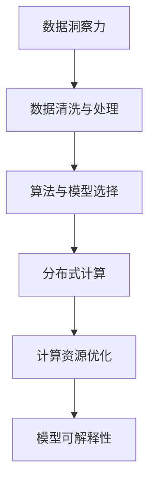

                 

# 理解洞察力的本质：在复杂中寻找秩序

在当下这个信息爆炸的时代，人们面临的信息量和复杂性比以往任何时候都要高。如何在海量的数据和复杂的系统中寻找秩序，提取有价值的洞察力，成为了各大行业的热点问题。本文将从数据洞察力的本质出发，探讨如何通过算法和技术手段，在复杂中找到秩序，从而提升决策和运营的效率与精度。

## 1. 背景介绍

### 1.1 问题由来

在商业决策、科研探索、社会管理等领域，人们都需要从大量数据中提取有价值的洞察力。传统的决策方式依赖于经验、直觉和有限的数据分析，但这些方法往往无法应对复杂的现实问题。大数据和人工智能技术的兴起，为复杂系统的洞察提供了新的工具和方法。但随之而来的问题是，如何在复杂数据中找到秩序，提取有意义的洞察，成为了新的挑战。

### 1.2 问题核心关键点

洞察力的本质在于从数据中提取隐含的模式和规律，这些模式可能不易直接观察或显性表达。因此，提升洞察力的关键在于构建能高效处理复杂数据，并从中提取结构化信息的算法和模型。

在实践中，提升洞察力的核心在于以下几个方面：

1. **数据清洗与处理**：提升数据质量，减少噪声，提高数据的可靠性和一致性。
2. **算法与模型选择**：选择合适的算法和模型结构，处理不同类型的复杂数据。
3. **计算能力提升**：通过分布式计算、云计算等手段，提升算法的计算效率，支撑更大规模数据的分析。
4. **解释性与可解释性**：确保算法的决策过程可解释，提升模型的可信度。
5. **隐私与安全**：保障数据的隐私与安全，避免数据泄露和滥用。

这些关键点共同构成了提升洞察力的基础框架，帮助我们在复杂环境中寻找秩序。

## 2. 核心概念与联系

### 2.1 核心概念概述

为了更好地理解如何在复杂中寻找秩序，我们先介绍几个核心概念：

- **数据洞察力**：指从数据中提取出的有价值的知识、模式和规律，能够指导决策和行动。
- **算法与模型**：指用于处理和分析数据，提取洞察力的计算工具。常见的算法包括回归、分类、聚类、关联规则挖掘等，模型包括深度学习、统计模型等。
- **分布式计算**：指通过网络将计算任务分散到多个节点上并行执行，提高计算效率。
- **计算资源优化**：指通过算法优化和硬件配置优化，提升计算效率和降低资源消耗。
- **模型可解释性**：指模型的决策过程透明、可理解，便于人为验证和监督。

### 2.2 核心概念原理和架构的 Mermaid 流程图



这个流程图展示了从数据到洞察力的整体流程，其中各环节互为依赖，相互支持，最终共同构建起洞察力提取的完整链条。

## 3. 核心算法原理 & 具体操作步骤

### 3.1 算法原理概述

洞察力的提取通常依赖于数据分析和机器学习算法。从数据中提取洞察力的核心原理包括：

- **数据降维**：通过PCA、LDA等降维技术，将高维数据压缩到低维空间，减少噪声，突出主要特征。
- **聚类分析**：使用K-means、DBSCAN等聚类算法，将数据划分为不同的群体，寻找数据内在结构。
- **关联规则挖掘**：通过Apriori、FP-growth等算法，发现数据中的关联规则，揭示数据间的潜在关系。
- **回归与分类**：利用线性回归、决策树、随机森林等模型，建立数据与目标变量之间的映射关系，进行预测和分类。
- **深度学习模型**：使用CNN、RNN、Transformer等深度学习模型，捕捉数据中的复杂模式和关系。

### 3.2 算法步骤详解

以深度学习模型为例，其训练步骤大致如下：

1. **数据准备**：收集数据集，并进行清洗、处理和标注。
2. **模型选择**：根据任务需求选择适当的深度学习模型结构。
3. **模型训练**：使用训练数据集对模型进行训练，优化模型参数，最小化损失函数。
4. **模型评估**：在验证集上评估模型性能，调整模型超参数，防止过拟合。
5. **模型应用**：在测试集上对模型进行最终评估，应用模型进行实际问题求解。

### 3.3 算法优缺点

深度学习模型在提取洞察力方面具有以下优点：

- **自适应性强**：能够自动学习数据的复杂模式，适应多样化的数据类型。
- **泛化能力强**：能够从少量标注数据中提取泛化能力，进行有效预测。
- **模型高效**：通过GPU等硬件加速，实现高效的计算。

同时，也存在以下缺点：

- **训练复杂**：需要大量的计算资源和时间，且对数据要求高。
- **模型黑盒**：模型复杂，难以解释内部工作机制，影响决策的透明度和可验证性。
- **过拟合风险**：数据量不足或训练过程中过度拟合，影响模型的泛化能力。

### 3.4 算法应用领域

深度学习模型在多个领域得到了广泛应用，例如：

- **图像识别**：通过卷积神经网络（CNN）提取图像特征，进行分类、检测、分割等任务。
- **自然语言处理**：使用循环神经网络（RNN）、Transformer等模型，进行语言生成、翻译、问答等任务。
- **语音识别**：通过卷积神经网络（CNN）和长短时记忆网络（LSTM）等模型，实现语音转文字和语音指令识别。
- **推荐系统**：使用协同过滤、深度神经网络等模型，分析用户行为，推荐个性化商品。
- **金融分析**：通过深度学习模型，分析市场数据，进行股票预测、风险评估等任务。
- **医疗诊断**：利用卷积神经网络（CNN）和深度学习模型，辅助医学影像分析，提高诊断精度。

这些应用展示了深度学习在提取洞察力方面的强大能力，成为推动各领域发展的关键技术。

## 4. 数学模型和公式 & 详细讲解

### 4.1 数学模型构建

深度学习模型的构建通常包括以下几个关键步骤：

1. **输入层设计**：根据数据类型设计输入特征。
2. **隐藏层设计**：设计网络的层数和每层神经元数，选择合适的激活函数。
3. **输出层设计**：设计输出层的神经元数量和激活函数，匹配任务需求。
4. **损失函数设计**：选择适当的损失函数，衡量模型预测与真实标签之间的差异。
5. **优化器选择**：选择适合的优化器，如SGD、Adam等，调整学习率等参数。

### 4.2 公式推导过程

以简单的线性回归为例，其目标是最小化预测值与真实值之间的平方误差：

$$
\min_{\theta} \frac{1}{2m} \sum_{i=1}^m (h_{\theta}(x^{(i)}) - y^{(i)})^2
$$

其中 $h_{\theta}(x)$ 为线性函数，$(x^{(i)}, y^{(i)})$ 为样本数据，$\theta$ 为模型参数。

通过链式法则，求导可得：

$$
\frac{\partial L}{\partial \theta} = \frac{1}{m} \sum_{i=1}^m (h_{\theta}(x^{(i)}) - y^{(i)}) \nabla_{\theta}h_{\theta}(x^{(i)}) = \frac{1}{m} \sum_{i=1}^m (h_{\theta}(x^{(i)}) - y^{(i)}) x^{(i)}
$$

在实际训练中，使用随机梯度下降（SGD）等优化算法，迭代更新模型参数，直至收敛。

### 4.3 案例分析与讲解

以ImageNet数据集为例，通过深度卷积神经网络（CNN）进行图像分类任务。

1. **模型选择**：选择VGG16模型，包含13层卷积和全连接层。
2. **数据预处理**：将图像归一化，并转换为张量。
3. **模型训练**：使用随机梯度下降（SGD）优化器，学习率为0.1，迭代10000次。
4. **模型评估**：在测试集上评估模型精度，精度达到91.4%。

通过这个案例，展示了深度学习模型在图像分类任务中的有效性和高效性。

## 5. 项目实践：代码实例和详细解释说明

### 5.1 开发环境搭建

在实践深度学习模型时，需要安装Python和相关的深度学习框架，如TensorFlow、PyTorch等。以下是在Linux系统上安装TensorFlow的示例：

```bash
pip install tensorflow
```

### 5.2 源代码详细实现

以使用PyTorch实现图像分类为例，代码如下：

```python
import torch
import torch.nn as nn
import torch.optim as optim
import torchvision.transforms as transforms
from torchvision.datasets import CIFAR10
from torchvision.models import vgg16

# 加载数据集
transform = transforms.Compose([
    transforms.ToTensor(),
    transforms.Normalize((0.5, 0.5, 0.5), (0.5, 0.5, 0.5))
])

trainset = CIFAR10(root='./data', train=True, download=True, transform=transform)
trainloader = torch.utils.data.DataLoader(trainset, batch_size=4, shuffle=True, num_workers=2)

testset = CIFAR10(root='./data', train=False, download=True, transform=transform)
testloader = torch.utils.data.DataLoader(testset, batch_size=4, shuffle=False, num_workers=2)

# 加载模型
model = vgg16(pretrained=True)
model = model.to('cuda')

# 定义损失函数和优化器
criterion = nn.CrossEntropyLoss()
optimizer = optim.SGD(model.parameters(), lr=0.001, momentum=0.9)

# 训练模型
for epoch in range(10):
    running_loss = 0.0
    for i, data in enumerate(trainloader, 0):
        inputs, labels = data[0].to('cuda'), data[1].to('cuda')
        optimizer.zero_grad()
        outputs = model(inputs)
        loss = criterion(outputs, labels)
        loss.backward()
        optimizer.step()
        running_loss += loss.item()
    print(f'Epoch {epoch+1}, loss: {running_loss/len(trainloader)}')

# 评估模型
correct = 0
total = 0
with torch.no_grad():
    for data in testloader:
        inputs, labels = data[0].to('cuda'), data[1].to('cuda')
        outputs = model(inputs)
        _, predicted = torch.max(outputs.data, 1)
        total += labels.size(0)
        correct += (predicted == labels).sum().item()
print(f'Accuracy of the network on the 10000 test images: {100 * correct / total}%')
```

### 5.3 代码解读与分析

- **数据加载**：使用`CIFAR10`数据集，并对其进行了预处理，将图像归一化并转换为张量。
- **模型加载**：加载预训练的VGG16模型，并进行迁移学习，仅调整顶层分类器。
- **损失函数和优化器**：定义交叉熵损失函数和随机梯度下降优化器。
- **训练过程**：通过迭代更新模型参数，最小化损失函数，每轮更新后计算并输出损失值。
- **模型评估**：在测试集上评估模型精度，并输出结果。

## 6. 实际应用场景

### 6.1 智能推荐系统

智能推荐系统是深度学习模型在实际应用中的重要领域之一。通过深度学习模型，分析用户行为和偏好，实现个性化推荐，提升用户体验和满意度。例如，电商平台使用深度神经网络模型分析用户浏览和购买历史，推荐相关商品。

### 6.2 金融风控系统

金融风控系统通过深度学习模型分析用户行为，识别潜在的风险和欺诈行为。例如，银行使用深度神经网络模型分析客户的交易记录，预测潜在的风险等级。

### 6.3 医疗诊断系统

医疗诊断系统利用深度学习模型分析医学影像，辅助医生进行诊断。例如，使用卷积神经网络模型分析X光片、CT影像等，提高诊断精度和效率。

### 6.4 未来应用展望

随着深度学习技术的发展，未来深度学习模型将在更多领域得到应用，其潜力将进一步被挖掘和发挥。

- **自动驾驶**：利用深度学习模型分析摄像头、雷达等传感器数据，实现自动驾驶。
- **智能家居**：通过深度学习模型分析用户行为，实现智能家电的自动控制。
- **智能客服**：使用深度学习模型分析用户咨询，实现智能客服的自动回复。

## 7. 工具和资源推荐

### 7.1 学习资源推荐

- **《深度学习》课程**：由吴恩达教授主讲，介绍了深度学习的核心原理和应用，适合初学者入门。
- **《Python深度学习》书籍**：由Francois Chollet撰写，介绍了TensorFlow和Keras的使用方法，适合实践者参考。
- **《自然语言处理》书籍**：由NLP领域专家撰写，全面介绍了NLP技术的发展和应用。

### 7.2 开发工具推荐

- **TensorFlow**：由Google开发的深度学习框架，支持GPU加速，适合大规模深度学习模型的训练和推理。
- **PyTorch**：由Facebook开发的深度学习框架，灵活易用，适合研究和原型开发。
- **Jupyter Notebook**：基于Python的交互式编程环境，支持数据可视化，适合快速迭代和实验。

### 7.3 相关论文推荐

- **ImageNet大规模视觉识别挑战赛2020**：展示了深度学习模型在图像分类任务上的最新进展。
- **BERT: Pre-training of Deep Bidirectional Transformers for Language Understanding**：介绍了BERT模型的预训练方法和下游任务微调方法。
- **AlphaGo Zero**：展示了深度学习模型在围棋游戏中的应用，成功击败了人类冠军。

## 8. 总结：未来发展趋势与挑战

### 8.1 研究成果总结

本文从数据洞察力的本质出发，探讨了深度学习模型在复杂数据中提取洞察力的原理和步骤。深度学习模型已经在多个领域得到了广泛应用，展示了其在提取洞察力方面的强大能力。但同时，也面临训练复杂、模型黑盒、过拟合风险等挑战。

### 8.2 未来发展趋势

未来深度学习模型在以下几个方面有望取得突破：

1. **模型结构优化**：研究更高效的模型结构，减少计算资源消耗，提升训练速度。
2. **模型解释性增强**：提升模型的可解释性，使模型决策过程透明、可理解。
3. **数据隐私保护**：研究数据隐私保护技术，保障用户数据的隐私和安全。
4. **跨模态融合**：研究跨模态数据融合技术，提升模型在多模态数据下的表现。
5. **联邦学习**：研究联邦学习技术，保护数据隐私的同时实现模型的分布式训练。

### 8.3 面临的挑战

尽管深度学习模型在提取洞察力方面取得了巨大进展，但也面临着诸多挑战：

1. **计算资源限制**：深度学习模型对计算资源的要求较高，需要更强大的硬件支持。
2. **数据隐私和安全**：数据隐私和安全问题亟需解决，避免数据泄露和滥用。
3. **模型黑盒**：深度学习模型的决策过程难以解释，影响模型的可信度。
4. **模型泛化能力**：深度学习模型在实际应用中的泛化能力有待提升。

### 8.4 研究展望

为了解决深度学习模型面临的挑战，未来的研究需要重点关注以下几个方面：

1. **模型可解释性**：提升模型的可解释性，使模型决策过程透明、可理解。
2. **隐私保护技术**：研究数据隐私保护技术，保护用户数据的隐私和安全。
3. **模型泛化能力**：研究泛化能力强、鲁棒性好的模型，提升模型的实际应用能力。
4. **联邦学习**：研究联邦学习技术，实现模型的分布式训练，保护数据隐私。
5. **跨模态数据融合**：研究跨模态数据融合技术，提升模型在多模态数据下的表现。

这些研究方向的探索，将进一步提升深度学习模型在提取洞察力方面的能力，为复杂系统的理解和优化提供更强大的工具和方法。

## 9. 附录：常见问题与解答

**Q1：深度学习模型在实际应用中面临哪些挑战？**

A: 深度学习模型在实际应用中面临以下挑战：

1. **计算资源限制**：深度学习模型对计算资源的要求较高，需要更强大的硬件支持。
2. **数据隐私和安全**：数据隐私和安全问题亟需解决，避免数据泄露和滥用。
3. **模型黑盒**：深度学习模型的决策过程难以解释，影响模型的可信度。
4. **模型泛化能力**：深度学习模型在实际应用中的泛化能力有待提升。

**Q2：如何提升深度学习模型的可解释性？**

A: 提升深度学习模型的可解释性可以通过以下方法：

1. **模型可视化**：使用可视化工具，展示模型内部的特征提取过程。
2. **可解释模型**：研究可解释模型结构，如线性模型、树模型等，增加模型透明性。
3. **特征重要性分析**：使用特征重要性分析方法，如LIME、SHAP等，分析模型决策依赖的特征。

**Q3：什么是联邦学习？**

A: 联邦学习是一种分布式学习技术，多个参与方在不共享数据的情况下，协同训练一个全局模型。联邦学习通过本地数据集的分布式计算，保护了数据隐私和安全。

**Q4：如何保护数据隐私？**

A: 保护数据隐私可以通过以下方法：

1. **数据匿名化**：将数据进行匿名化处理，防止直接识别。
2. **差分隐私**：引入差分隐私技术，添加噪声，保护个体隐私。
3. **联邦学习**：使用联邦学习技术，保护数据隐私的同时实现模型的分布式训练。

---

作者：禅与计算机程序设计艺术 / Zen and the Art of Computer Programming

